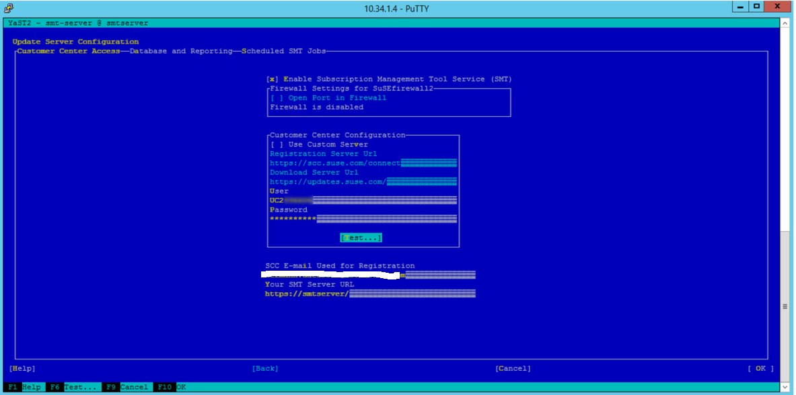
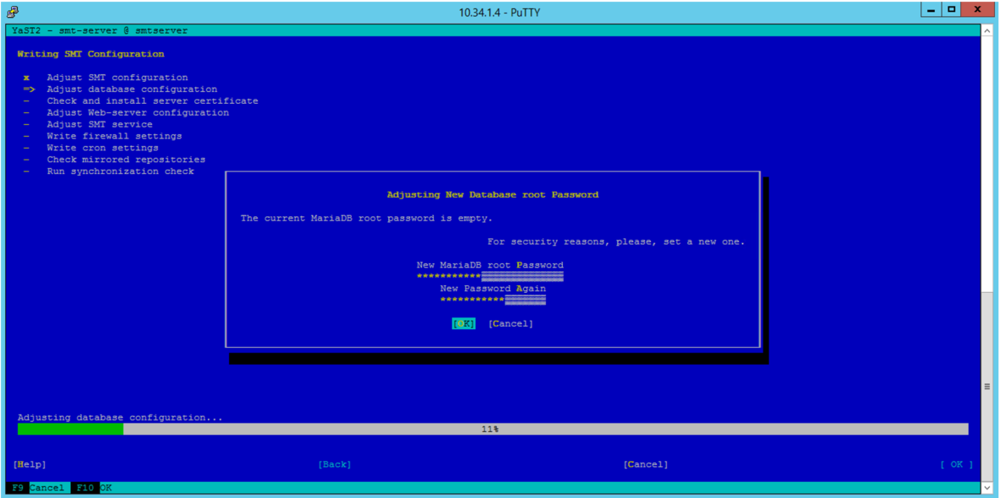

# Set up SMT server for SUSE Linux
Large Instances of SAP HANA don't have direct connectivity to the internet. It's not a straightforward process to register such a unit with the operating system provider, and to download and apply updates. A solution for SUSE Linux is to set up an SMT server in an Azure virtual machine. Host the virtual machine in an Azure virtual network, which is connected to the HANA Large Instance. With such an SMT server, the HANA Large Instance unit could register and download updates. 

For more documentation on SUSE, see their [Subscription Management Tool for SLES 12 SP2](https://www.suse.com/documentation/sles-12/pdfdoc/book_smt/book_smt.pdf). 

Prerequisites for installing an SMT server that fulfills the task for HANA Large Instances are:

- An Azure virtual network that is connected to the HANA Large Instance ExpressRoute circuit.
- A SUSE account that is associated with an organization. The organization should have a valid SUSE subscription.

## Install SMT server on an Azure virtual machine

First, sign in to the [SUSE Customer Center](https://scc.suse.com/).

Go to **Organization** > **Organization Credentials**. In that section, you should find the credentials that are necessary to set up the SMT server.

Then, install a SUSE Linux VM in the Azure virtual network. To deploy the virtual machine, take a SLES 12 SP2 gallery image of Azure (select BYOS SUSE image). In the deployment process, don't define a DNS name, and don't use static IP addresses.


The deployed virtual machine is smaller, and got the internal IP address in the Azure virtual network of 10.34.1.4. The name of the virtual machine is *smtserver*. After the installation, the connectivity to the HANA Large Instance unit or units is checked. Depending on how you organized name resolution, you might need to configure resolution of the HANA Large Instance units in etc/hosts of the Azure virtual machine. 

Add a disk to the virtual machine. You use this disk to hold the updates, and the boot disk itself could be too small. Here, the disk got mounted to /srv/www/htdocs, as shown in the following screenshot. A 100-GB disk should suffice.


Sign in to the HANA Large Instance unit or units, maintain /etc/hosts, and check whether you can reach the Azure virtual machine that is supposed to run the SMT server over the network.

After this check, sign in to the Azure virtual machine that should run the SMT server. If you are using putty to sign in to the virtual machine, run this sequence of commands in your bash window:

```
cd ~
echo "export NCURSES_NO_UTF8_ACS=1" >> .bashrc
```

Restart your bash to activate the settings. Then start YAST.

Connect your VM (smtserver) to the SUSE site.

```
smtserver:~ # SUSEConnect -r <registration code> -e s<email address> --url https://scc.suse.com
Registered SLES_SAP 12.2 x86_64
To server: https://scc.suse.com
Using E-Mail: email address
Successfully registered system.
```

After the virtual machine is connected to the SUSE site, install the smt packages. Use the following putty command to install the smt packages.

```
smtserver:~ # zypper in smt
Refreshing service 'SUSE_Linux_Enterprise_Server_for_SAP_Applications_12_SP2_x86_64'.
Loading repository data...
Reading installed packages...
Resolving package dependencies...
```


You can also use the YAST tool to install the smt packages. In YAST, go to **Software Maintenance**, and search for smt. Select **smt**, which switches automatically to yast2-smt.


Accept the selection for installation on the smtserver. After the installation completes, go to the SMT server configuration. Enter the organizational credentials from the SUSE Customer Center you retrieved earlier. Also enter your Azure virtual machine hostname as the SMT Server URL. In this demonstration, it's https:\//smtserver.



Now test whether the connection to the SUSE Customer Center works. As you see in the following screenshot, in this demonstration case, it did work.


After the SMT setup starts, provide a database password. Because it's a new installation, you should define that password as shown in the following screenshot.



The next step is to create a certificate.


At the end of the configuration, it might take a few minutes to run the synchronization check. After the installation and configuration of the SMT server, you should find the directory repo under the mount point /srv/www/htdocs/. There are also some subdirectories under repo. 

Restart the SMT server and its related services with these commands.

```
rcsmt restart
systemctl restart smt.service
systemctl restart apache2
```

## Download packages onto SMT server

After all the services are restarted, select the appropriate packages in SMT Management by using YAST. The package selection depends on the operating system image of the HANA Large Instance server. The package selection doesn't depend on the SLES release or version of the virtual machine running the SMT server. The following screenshot shows an example of the selection screen.


Next, start the initial copy of the select packages to the SMT server you set up. This copy is triggered in the shell by using the command smt-mirror.


The packages should get copied into the directories created under the mount point /srv/www/htdocs. This process can take an hour or more, depending on how many packages you select. As this process finishes, move to the SMT client setup. 

## Set up the SMT client on HANA Large Instance units

The client or clients in this case are the HANA Large Instance units. The SMT server setup copied the script clientSetup4SMT.sh into the Azure virtual machine. Copy that script over to the HANA Large Instance unit you want to connect to your SMT server. Start the script with the -h option, and give the name of your SMT server as a parameter. In this example, the name is *smtserver*.


It's possible that the load of the certificate from the server by the client succeeds, but the registration fails, as shown in the following screenshot.


If the registration fails, see [SUSE support document](https://www.suse.com/de-de/support/kb/doc/?id=7006024), and run the steps described there.

> [!IMPORTANT] 
> For the server name, provide the name of the virtual machine (in this case, *smtserver*), without the fully qualified domain name. 

After running these steps, run the following command on the HANA Large Instance unit:

```
SUSEConnect –cleanup
```

> [!Note] 
> Wait a few minutes after that step. If you run clientSetup4SMT.sh immediately, you might get an error.

If you encounter a problem that you need to fix based on the steps of the SUSE article, restart clientSetup4SMT.sh on the HANA Large Instance unit. Now it should finish successfully.


You configured the SMT client of the HANA Large Instance unit to connect to the SMT server you installed in the Azure virtual machine. You now can take 'zypper up' or 'zypper in' to install operating system updates to HANA Large Instances, or install additional packages. You can only get updates that you downloaded before on the SMT server.

## Next steps
- [HANA Installation on HLI](hana-example-installation.md).


