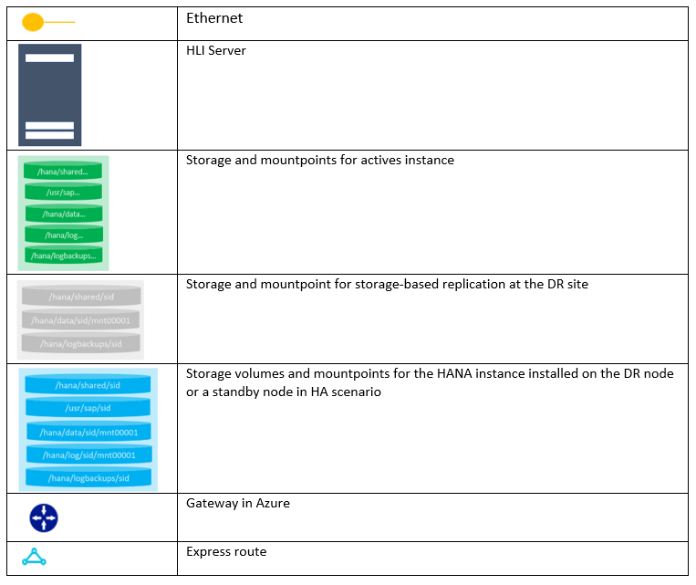
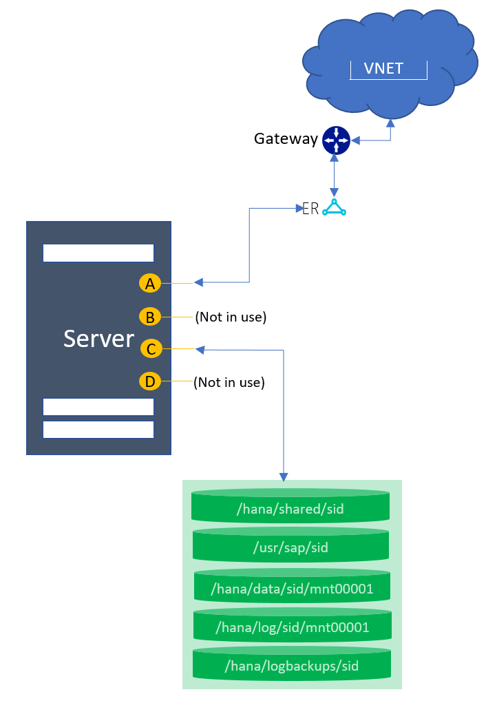
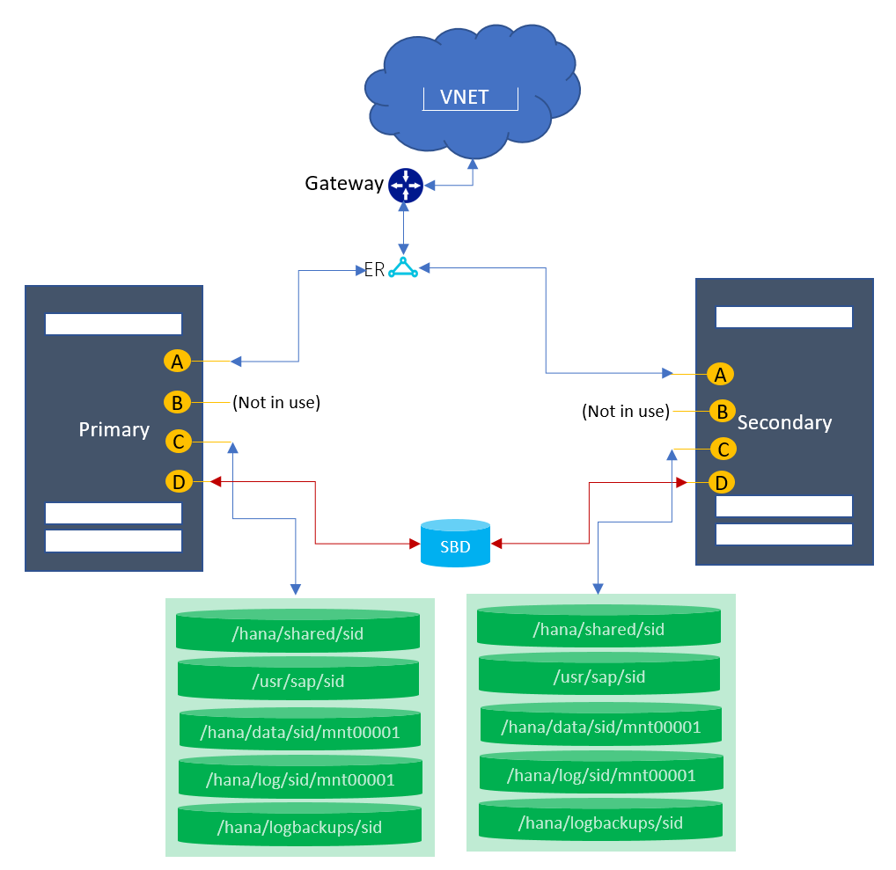
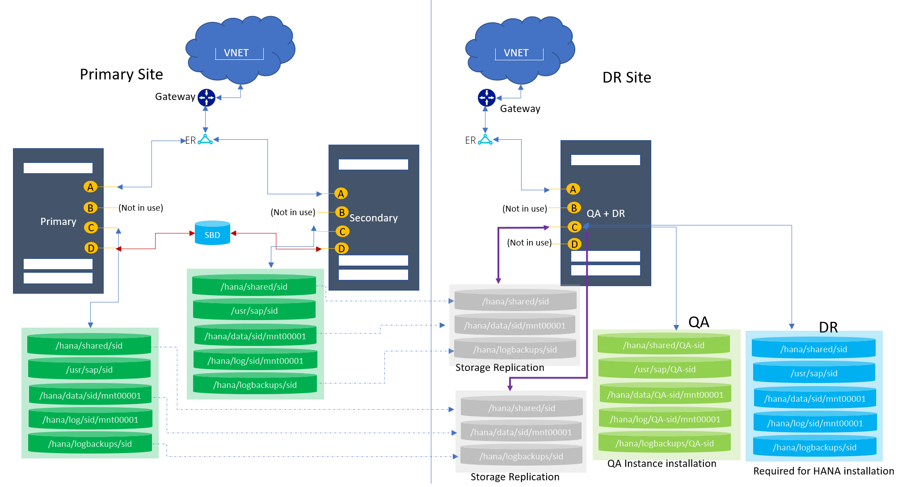

# Supported scenarios for HANA Large Instances
This document describes the supported scenarios along with their architecture details for the HANA Large Instances (HLI).

>[!NOTE]
>If your required scenario is not mentioned here, contact Microsoft Service Management team to assess your requirements.
Before proceeding with the HLI unit provisioning, validate the design with SAP or your service implementation partner.

## Terms and definitions
Let's understand the terms and definitions used in the document.

- SID: System Identifier for HANA system.
- HLI: Hana Large Instances.
- DR: A disaster recovery site.
- Normal DR: A system setup with a dedicated resource for DR purpose used only.
- Multipurpose DR: A system at DR site configured to use non-production environment along with production instance configured to use to DR event. 
- Single SID:  A system with one instance installed.
- Multi SID: A system with multiple instances configured. Also called an MCOS environment.

## Overview
The HANA Large Instances support the variety of architectures to accomplish your business requirements. The following list covers the scenarios and their configuration details. 

The derived architecture design is purely from the infrastructure perspective, and you must consult SAP or your implementation partners for the HANA deployment. If your scenarios are not listed, contact the Microsoft account team to review the architecture and derive a solution for you.

**These architectures are fully compliant with the TDI (Tailored Data Integration) design and supported by SAP.**

This document describes the details of the two components in each supported architecture:

- Ethernet
- Storage

### Ethernet

Each server provisioned comes pre-configured with the sets of ethernet interfaces. Here are the details of the ethernet interfaces configured on each HLI unit.

- **A**: This interface is used for/by the client access.
- **B**: This interface is used for the node to node communication. This interface is configured on all the servers (irrespective of the topology requested) but only used for the 
- scale-out scenarios.
- **C**: This interface is used for the node to the storage connectivity.
- **D**: This interface is used for the Node to ISCSI device connection for STONITH setup. This interface is only configured when the HSR setup is requested.  

| NIC LOGICAL INTERFACES | SKU TYPE | Name with SUSE OS | Name with RHEL OS | Use case|
| --- | --- | --- | --- | --- |
| A | TYPE I | eth0.tenant | eno1.tenant | Client to HLI |
| B | TYPE I | eth2.tenant | eno3.tenant | Node to node |
| C | TYPE I | eth1.tenant | eno2.tenant | Node to storage |
| D | TYPE I | eth4.tenant | eno4.tenant | STONITH |
| A | TYPE II | vlan<tenantNo> | team0.tenant | Client to HLI |
| B | TYPE II | vlan<tenantNo+2> | team0.tenant+2 | Node to node |
| C | TYPE II | vlan<tenantNo+1> | team0.tenant+1 | Node to storage |
| D | TYPE II | vlan<tenantNo+3> | team0.tenant+3 | STONITH |

You use the interfaces based on the topology configured on the HLI unit. For example, the interface “B” is set up for node to node communication, which is useful when you have a scale-out topology configured. In the case of single node scale-up configuration, this interface is not used. Review your required scenarios (later in this document) to get more information about the interface usage. 

If needed, you can define additional NIC cards on your own. However, the configuration on the existing NICs can NOT be changed.

>[!NOTE]
>You may still find additional interfaces which are physical interfaces or bonding. 
You should consider the above-mentioned interfaces for your used case, rest can be ignored/or not to be tempered with.

The distribution for units with two IP addresses assigned should look like:

- Ethernet “A” should have an IP address assigned that is out of the Server IP Pool address range that you submitted to Microsoft. This IP address shall be used for maintaining in /etc/hosts of the OS.

- Ethernet “C” should have an IP address assigned that is used for communication to NFS. Therefore, these addresses do **NOT** need to be maintained in etc/hosts in order to allow instance to instance traffic within the tenant.

For deployment cases of HANA System Replication or HANA scale-out, a blade configuration with two IP addresses assigned is not suitable. If having two IP addresses assigned only and wanting to deploy such a configuration, contact SAP HANA on Azure Service Management to get a third IP address in a third VLAN assigned. For HANA Large Instance units having three IP addresses assigned on three NIC ports, the following usage rules apply:

- Ethernet “A” should have an IP address assigned that is out of the Server IP Pool address range that you submitted to Microsoft. Hence this IP address shall not be used for maintaining in /etc/hosts of the OS.

- Ethernet “B” should be exclusively used to be maintained in etc/hosts for communication between the different instances. These addresses would also be the IP addresses that need to be maintained in scale-out HANA configurations as IP addresses HANA uses for the inter-node configuration.

- Ethernet “C” should have an IP address assigned that is used for communication to NFS storage. Hence this type of addresses should not be maintained in etc/hosts.

- Ethernet “D” should be exclusively used for access STONITH device for pacemaker. This interface is required when you configure HANA System Replication (HSR) and want to achieve auto failover at the operating system using an SBD based device.

### Storage
Storage is preconfigured based on the topology requested. The volume sizes and mountpoint vary based on the number of servers, SKUs, and topology configured. Review your required scenarios (later in this document) to get more information. If more storage is required, you can purchase it in one TB increment.

>[!NOTE]
>The mountpoint /usr/sap/<SID> is a symbolic link to the /hana/shared mountpoint.

## Supported Scenarios

In the architecture diagrams, following notations are used for the graphics:

The following list shows the supported scenarios:

1. Single node with one SID
2. Single node MCOS
3. Single node with DR (Normal)
4. Single node with DR (Multipurpose)
5. HSR with STONITH
6. HSR with DR (Normal / Multipurpose) 
7. Host auto failover (1+1) 
8. Scale-out with standby
9. Scale-out without standby
10. Scale-out with DR

## 1. Single node with one SID

This topology supports one node in a scale up configuration with one SID.

### Architecture diagram  

### Ethernet
The following network interfaces are preconfigured:

| NIC LOGICAL INTERFACES | SKU TYPE | Name with SUSE OS | Name with RHEL OS | Use case|
| --- | --- | --- | --- | --- |
| A | TYPE I | eth0.tenant | eno1.tenant | Client to HLI |
| B | TYPE I | eth2.tenant | eno3.tenant | Configured but not in use |
| C | TYPE I | eth1.tenant | eno2.tenant | Node to storage |
| D | TYPE I | eth4.tenant | eno4.tenant | Configured but not in use |
| A | TYPE II | vlan<tenantNo> | team0.tenant | Client to HLI |
| B | TYPE II | vlan<tenantNo+2> | team0.tenant+2 | Configured but not in use |
| C | TYPE II | vlan<tenantNo+1> | team0.tenant+1 | Node to storage |
| D | TYPE II | vlan<tenantNo+3> | team0.tenant+3 | Configured but not in use |

### Storage
The following mountpoints are preconfigured:

| Mountpoint | Use case | 
| --- | --- |
|/hana/shared/SID | HANA Install | 
|/hana/data/SID/mnt00001 | Data files install | 
|/hana/log/SID/mnt00001 | Log files install | 
|/hana/logbackups/SID | Redo logs |

### Key considerations
- /usr/sap/SID is a symbolic link to /hana/shared/SID.

## 2. Single node MCOS

This topology supports one node in a scale up configuration with multiple SIDs.

### Architecture diagram  

### Ethernet
The following network interfaces are preconfigured:

| NIC LOGICAL INTERFACES | SKU TYPE | Name with SUSE OS | Name with RHEL OS | Use case|
| --- | --- | --- | --- | --- |
| A | TYPE I | eth0.tenant | eno1.tenant | Client to HLI |
| B | TYPE I | eth2.tenant | eno3.tenant | Configured but not in use |
| C | TYPE I | eth1.tenant | eno2.tenant | Node to storage |
| D | TYPE I | eth4.tenant | eno4.tenant | Configured but not in use |
| A | TYPE II | vlan<tenantNo> | team0.tenant | Client to HLI |
| B | TYPE II | vlan<tenantNo+2> | team0.tenant+2 | Configured but not in use |
| C | TYPE II | vlan<tenantNo+1> | team0.tenant+1 | Node to storage |
| D | TYPE II | vlan<tenantNo+3> | team0.tenant+3 | Configured but not in use |

### Storage
The following mountpoints are preconfigured:

| Mountpoint | Use case | 
| --- | --- |
|/hana/shared/SID1 | HANA Install for SID1 | 
|/hana/data/SID1/mnt00001 | Data files install for SID1 | 
|/hana/log/SID1/mnt00001 | Log files install for SID1 | 
|/hana/logbackups/SID1 | Redo logs for SID1 |
|/hana/shared/SID2 | HANA Install for SID2 | 
|/hana/data/SID2/mnt00001 | Data files install for SID2 | 
|/hana/log/SID2/mnt00001 | Log files install for SID2 | 
|/hana/logbackups/SID2 | Redo logs for SID2 |

### Key considerations
- /usr/sap/SID is a symbolic link to /hana/shared/SID.
- Volume size distribution is based off the database size in memory. Refer the [Overview and architecture](https://docs.microsoft.com/azure/virtual-machines/workloads/sap/hana-overview-architecture) section to learn what database sizes in memory are supported with multisid environment.

## 3. Single node with DR (Normal)
 
This topology supports one node in a scale up configuration with one or multiple SIDs with the storage-based replication to the DR site for a primary SID. In the diagram, only single SID is depicted at the primary site, but multisid (MCOS) is supported as well.

### Architecture diagram  

### Ethernet
The following network interfaces are preconfigured:

| NIC LOGICAL INTERFACES | SKU TYPE | Name with SUSE OS | Name with RHEL OS | Use case|
| --- | --- | --- | --- | --- |
| A | TYPE I | eth0.tenant | eno1.tenant | Client to HLI |
| B | TYPE I | eth2.tenant | eno3.tenant | Configured but not in use |
| C | TYPE I | eth1.tenant | eno2.tenant | Node to storage |
| D | TYPE I | eth4.tenant | eno4.tenant | Configured but not in use |
| A | TYPE II | vlan<tenantNo> | team0.tenant | Client to HLI |
| B | TYPE II | vlan<tenantNo+2> | team0.tenant+2 | Configured but not in use |
| C | TYPE II | vlan<tenantNo+1> | team0.tenant+1 | Node to storage |
| D | TYPE II | vlan<tenantNo+3> | team0.tenant+3 | Configured but not in use |

### Storage
The following mountpoints are preconfigured:

| Mountpoint | Use case | 
| --- | --- |
|/hana/shared/SID | HANA Install for SID | 
|/hana/data/SID/mnt00001 | Data files install for SID | 
|/hana/log/SID/mnt00001 | Log files install for SID | 
|/hana/logbackups/SID | Redo logs for SID |

### Key considerations
- /usr/sap/SID is a symbolic link to /hana/shared/SID.
- For MCOS: Volume size distribution is based off the database size in memory. Refer the [Overview and architecture](https://docs.microsoft.com/azure/virtual-machines/workloads/sap/hana-overview-architecture) section to learn what database sizes in memory are supported with multisid environment.
- At the DR: The volumes and mountpoints are configured (marked as “Required for HANA installation”) for the production HANA Instance installation at the DR HLI unit. 
- At the DR: The data, logbackups, and shared volumes (marked as “Storage Replication”) are replicated via snapshot from the production site. These volumes are mounted during the failover time only. For more information, read the document [Disaster recovery failover procedure](https://docs.microsoft.com/azure/virtual-machines/workloads/sap/hana-overview-high-availability-disaster-recovery#disaster-recovery-failover-procedure) for more details.
- Boot volume for **SKU Type I class** is replicated to DR node.

## 4. Single node with DR (Multipurpose)
 
This topology supports one node in a scale up configuration with one or multiple SIDs with the storage-based replication to the DR site for a primary SID. In the diagram, only single SID is depicted at the primary site, but multisid (MCOS) is supported as well. At the DR site, HLI unit is used for QA instance while production operations are running from the primary site. At the time of DR failover (or failover test), QA instance at DR site is taken down.

### Architecture diagram  

### Ethernet
The following network interfaces are preconfigured:

| NIC LOGICAL INTERFACES | SKU TYPE | Name with SUSE OS | Name with RHEL OS | Use case|
| --- | --- | --- | --- | --- |
| A | TYPE I | eth0.tenant | eno1.tenant | Client to HLI |
| B | TYPE I | eth2.tenant | eno3.tenant | Configured but not in use |
| C | TYPE I | eth1.tenant | eno2.tenant | Node to storage |
| D | TYPE I | eth4.tenant | eno4.tenant | Configured but not in use |
| A | TYPE II | vlan<tenantNo> | team0.tenant | Client to HLI |
| B | TYPE II | vlan<tenantNo+2> | team0.tenant+2 | Configured but not in use |
| C | TYPE II | vlan<tenantNo+1> | team0.tenant+1 | Node to storage |
| D | TYPE II | vlan<tenantNo+3> | team0.tenant+3 | Configured but not in use |

### Storage
The following mountpoints are preconfigured:

| Mountpoint | Use case | 
| --- | --- |
|**At the primary site**|
|/hana/shared/SID | HANA Install for production SID | 
|/hana/data/SID/mnt00001 | Data files install for production SID | 
|/hana/log/SID/mnt00001 | Log files install for production SID | 
|/hana/logbackups/SID | Redo logs for production SID |
|**At the DR site**|
|/hana/shared/SID | HANA Install for production SID | 
|/hana/data/SID/mnt00001 | Data files install for production  SID | 
|/hana/log/SID/mnt00001 | Log files install for production SID | 
|/hana/shared/QA-SID | HANA Install for QA SID | 
|/hana/data/QA-SID/mnt00001 | Data files install for QA  SID | 
|/hana/log/QA-SID/mnt00001 | Log files install for QA SID |
|/hana/logbackups/QA-SID | Redo logs for QA SID |

### Key considerations
- /usr/sap/SID is a symbolic link to /hana/shared/SID.
- For MCOS: Volume size distribution is based off the database size in memory. Refer the [Overview and architecture](https://docs.microsoft.com/azure/virtual-machines/workloads/sap/hana-overview-architecture) section to learn what database sizes in memory are supported with multisid environment.
- At the DR: The volumes and mountpoints are configured (marked as “Required for HANA installation”) for the production HANA Instance installation at the DR HLI unit. 
- At the DR: The data, logbackups, and shared volumes (marked as “Storage Replication”) are replicated via snapshot from the production site. These volumes are mounted during the failover time only. For more information, read the document [Disaster recovery failover procedure](https://docs.microsoft.com/azure/virtual-machines/workloads/sap/hana-overview-high-availability-disaster-recovery#disaster-recovery-failover-procedure) for more details. 
- At the DR: The data, logbackups, log, shared volumes for QA (marked as “QA Instance installation”) are configured for the QA instance installation.
- Boot volume for **SKU Type I class** is replicated to DR node.

## 5. HSR with STONITH
 
This topology support two nodes for the HANA System Replication (HSR) configuration. This configuration is only supported for single HANA instances on a node. Means, MCOS scenarios are NOT supported.

**As of now, this architecture is supported only for SUSE Operating system.**

### Architecture diagram  

### Ethernet
The following network interfaces are preconfigured:

| NIC LOGICAL INTERFACES | SKU TYPE | Name with SUSE OS | Name with RHEL OS | Use case|
| --- | --- | --- | --- | --- |
| A | TYPE I | eth0.tenant | eno1.tenant | Client to HLI |
| B | TYPE I | eth2.tenant | eno3.tenant | Configured but not in use |
| C | TYPE I | eth1.tenant | eno2.tenant | Node to storage |
| D | TYPE I | eth4.tenant | eno4.tenant | Used for STONITH |
| A | TYPE II | vlan<tenantNo> | team0.tenant | Client to HLI |
| B | TYPE II | vlan<tenantNo+2> | team0.tenant+2 | Configured but not in use |
| C | TYPE II | vlan<tenantNo+1> | team0.tenant+1 | Node to storage |
| D | TYPE II | vlan<tenantNo+3> | team0.tenant+3 | Used for STONITH |

### Storage
The following mountpoints are preconfigured:

| Mountpoint | Use case | 
| --- | --- |
|**On the primary node**|
|/hana/shared/SID | HANA Install for production SID | 
|/hana/data/SID/mnt00001 | Data files install for production SID | 
|/hana/log/SID/mnt00001 | Log files install for production SID | 
|/hana/logbackups/SID | Redo logs for production SID |
|**On the secondary node**|
|/hana/shared/SID | HANA Install for secondary SID | 
|/hana/data/SID/mnt00001 | Data files install for secondary  SID | 
|/hana/log/SID/mnt00001 | Log files install for secondary SID | 
|/hana/logbackups/SID | Redo logs for secondary SID |

### Key considerations
- /usr/sap/SID is a symbolic link to /hana/shared/SID.
- For MCOS: Volume size distribution is based off the database size in memory. Refer the [Overview and architecture](https://docs.microsoft.com/azure/virtual-machines/workloads/sap/hana-overview-architecture) section to learn what database sizes in memory are supported with multisid environment.
- STONITH: An SBD is configured for the STONITH setup. However, a use of STONITH is optional.

## 6. HSR with DR
 
This topology support two nodes for the HANA System Replication (HSR) configuration. Both the normal and multipurpose DR is supported. These configurations are only supported for single HANA instances on a node. Means, MCOS scenarios are NOT supported with these configurations.

In the diagram, multipurpose scenario is depicted where at the DR site, HLI unit is used for QA instance while production operations are running from the primary site. At the time of DR failover (or failover test), QA instance at DR site is taken down. 

### Architecture diagram  

### Ethernet
The following network interfaces are preconfigured:

| NIC LOGICAL INTERFACES | SKU TYPE | Name with SUSE OS | Name with RHEL OS | Use case|
| --- | --- | --- | --- | --- |
| A | TYPE I | eth0.tenant | eno1.tenant | Client to HLI |
| B | TYPE I | eth2.tenant | eno3.tenant | Configured but not in use |
| C | TYPE I | eth1.tenant | eno2.tenant | Node to storage |
| D | TYPE I | eth4.tenant | eno4.tenant | Used for STONITH |
| A | TYPE II | vlan<tenantNo> | team0.tenant | Client to HLI |
| B | TYPE II | vlan<tenantNo+2> | team0.tenant+2 | Configured but not in use |
| C | TYPE II | vlan<tenantNo+1> | team0.tenant+1 | Node to storage |
| D | TYPE II | vlan<tenantNo+3> | team0.tenant+3 | Used for STONITH |

### Storage
The following mountpoints are preconfigured:

| Mountpoint | Use case | 
| --- | --- |
|**On the primary node at the primary site**|
|/hana/shared/SID | HANA Install for production SID | 
|/hana/data/SID/mnt00001 | Data files install for production SID | 
|/hana/log/SID/mnt00001 | Log files install for production SID | 
|/hana/logbackups/SID | Redo logs for production SID |
|**On the secondary node at the primary site**|
|/hana/shared/SID | HANA Install for secondary SID | 
|/hana/data/SID/mnt00001 | Data files install for secondary  SID | 
|/hana/log/SID/mnt00001 | Log files install for secondary SID | 
|/hana/logbackups/SID | Redo logs for secondary SID |
|**At the DR site**|
|/hana/shared/SID | HANA Install for production SID | 
|/hana/data/SID/mnt00001 | Data files install for production  SID | 
|/hana/log/SID/mnt00001 | Log files install for production SID | 
|/hana/shared/QA-SID | HANA Install for QA SID | 
|/hana/data/QA-SID/mnt00001 | Data files install for QA  SID | 
|/hana/log/QA-SID/mnt00001 | Log files install for QA SID |
|/hana/logbackups/QA-SID | Redo logs for QA SID |

### Key considerations
- /usr/sap/SID is a symbolic link to /hana/shared/SID.
- For MCOS: Volume size distribution is based off the database size in memory. Refer the [Overview and architecture](https://docs.microsoft.com/azure/virtual-machines/workloads/sap/hana-overview-architecture) section to learn what database sizes in memory are supported with multisid environment.
- STONITH: An SBD is configured for the STONITH setup. However, a use of STONITH is optional.
- At the DR: **Two sets of storage volumes are required** for primary and secondary node replication.
- At the DR: The volumes and mountpoints are configured (marked as “Required for HANA installation”) for the production HANA Instance installation at the DR HLI unit. 
- At the DR: The data, logbackups, and shared volumes (marked as “Storage Replication”) are replicated via snapshot from the production site. These volumes are mounted during the failover time only. For more information, read the document [Disaster recovery failover procedure](https://docs.microsoft.com/azure/virtual-machines/workloads/sap/hana-overview-high-availability-disaster-recovery#disaster-recovery-failover-procedure) for more details. 
- At the DR: The data, logbackups, log, shared volumes for QA (marked as “QA Instance installation”) are configured for the QA instance installation.
- Boot volume for **SKU Type I class** is replicated to DR node.

## 7. Host auto failover (1+1)
 
This topology supports two nodes in a host auto failover configuration. There is one node with master/worker role and other as a standby. **SAP Supports this scenario only for S/4 HANA.** Refer OSS note “[2408419 - SAP S/4HANA - Multi-Node Support](https://launchpad.support.sap.com/#/notes/2408419)” for more detail.

### Architecture diagram  

### Ethernet
The following network interfaces are preconfigured:

| NIC LOGICAL INTERFACES | SKU TYPE | Name with SUSE OS | Name with RHEL OS | Use case|
| --- | --- | --- | --- | --- |
| A | TYPE I | eth0.tenant | eno1.tenant | Client to HLI |
| B | TYPE I | eth2.tenant | eno3.tenant | Node to node communication |
| C | TYPE I | eth1.tenant | eno2.tenant | Node to storage |
| D | TYPE I | eth4.tenant | eno4.tenant | Configured but not in use |
| A | TYPE II | vlan<tenantNo> | team0.tenant | Client to HLI |
| B | TYPE II | vlan<tenantNo+2> | team0.tenant+2 | Node to node communication |
| C | TYPE II | vlan<tenantNo+1> | team0.tenant+1 | Node to storage |
| D | TYPE II | vlan<tenantNo+3> | team0.tenant+3 | Configured but not in use |

### Storage
The following mountpoints are preconfigured:

| Mountpoint | Use case | 
| --- | --- |
|**On the master and standby nodes**|
|/hana/shared | HANA Install for production SID | 
|/hana/data/SID/mnt00001 | Data files install for production SID | 
|/hana/log/SID/mnt00001 | Log files install for production SID | 
|/hana/logbackups/SID | Redo logs for production SID |

### Key considerations
- /usr/sap/SID is a symbolic link to /hana/shared/SID.
- On standby: The volumes and mountpoints are configured (marked as “Required for HANA installation”) for the HANA Instance installation on the standby unit.
 

## 8. Scale-out with standby
 
This topology supports multiple nodes in a scale-out configuration. There is one node with master role, one or more nodes with worker role, and one or more nodes as standby. Though, there can be only one master node at any given point of time.

### Architecture diagram  

### Ethernet
The following network interfaces are preconfigured:

| NIC LOGICAL INTERFACES | SKU TYPE | Name with SUSE OS | Name with RHEL OS | Use case|
| --- | --- | --- | --- | --- |
| A | TYPE I | eth0.tenant | eno1.tenant | Client to HLI |
| B | TYPE I | eth2.tenant | eno3.tenant | Node to node communication |
| C | TYPE I | eth1.tenant | eno2.tenant | Node to storage |
| D | TYPE I | eth4.tenant | eno4.tenant | Configured but not in use |
| A | TYPE II | vlan<tenantNo> | team0.tenant | Client to HLI |
| B | TYPE II | vlan<tenantNo+2> | team0.tenant+2 | Node to node communication |
| C | TYPE II | vlan<tenantNo+1> | team0.tenant+1 | Node to storage |
| D | TYPE II | vlan<tenantNo+3> | team0.tenant+3 | Configured but not in use |

### Storage
The following mountpoints are preconfigured:

| Mountpoint | Use case | 
| --- | --- |
|**On the master, worker and standby nodes**|
|/hana/shared | HANA Install for production SID | 
|/hana/data/SID/mnt00001 | Data files install for production SID | 
|/hana/log/SID/mnt00001 | Log files install for production SID | 
|/hana/logbackups/SID | Redo logs for production SID |

## 9. Scale-out without standby
 
This topology supports multiple nodes in a scale-out configuration. There is one node with master role, and one or mode nodes with worker role. Though, there can be only one master node at any given point of time.

### Architecture diagram  

### Ethernet
The following network interfaces are preconfigured:

| NIC LOGICAL INTERFACES | SKU TYPE | Name with SUSE OS | Name with RHEL OS | Use case|
| --- | --- | --- | --- | --- |
| A | TYPE I | eth0.tenant | eno1.tenant | Client to HLI |
| B | TYPE I | eth2.tenant | eno3.tenant | Node to node communication |
| C | TYPE I | eth1.tenant | eno2.tenant | Node to storage |
| D | TYPE I | eth4.tenant | eno4.tenant | Configured but not in use |
| A | TYPE II | vlan<tenantNo> | team0.tenant | Client to HLI |
| B | TYPE II | vlan<tenantNo+2> | team0.tenant+2 | Node to node communication |
| C | TYPE II | vlan<tenantNo+1> | team0.tenant+1 | Node to storage |
| D | TYPE II | vlan<tenantNo+3> | team0.tenant+3 | Configured but not in use |

### Storage
The following mountpoints are preconfigured:

| Mountpoint | Use case | 
| --- | --- |
|**On the master and worker nodes**|
|/hana/shared | HANA Install for production SID | 
|/hana/data/SID/mnt00001 | Data files install for production SID | 
|/hana/log/SID/mnt00001 | Log files install for production SID | 
|/hana/logbackups/SID | Redo logs for production SID |

### Key considerations
- /usr/sap/SID is a symbolic link to /hana/shared/SID.

## 10. Scale-out with DR
 
This topology supports multiple nodes in a scale-out with a DR. Both normal and multipurpose DR is supported. In the diagram, only the single purpose DR is depicted. You can request this topology with or without the standby node.

### Architecture diagram  

### Ethernet
The following network interfaces are preconfigured:

| NIC LOGICAL INTERFACES | SKU TYPE | Name with SUSE OS | Name with RHEL OS | Use case|
| --- | --- | --- | --- | --- |
| A | TYPE I | eth0.tenant | eno1.tenant | Client to HLI |
| B | TYPE I | eth2.tenant | eno3.tenant | Node to node communication |
| C | TYPE I | eth1.tenant | eno2.tenant | Node to storage |
| D | TYPE I | eth4.tenant | eno4.tenant | Configured but not in use |
| A | TYPE II | vlan<tenantNo> | team0.tenant | Client to HLI |
| B | TYPE II | vlan<tenantNo+2> | team0.tenant+2 | Node to node communication |
| C | TYPE II | vlan<tenantNo+1> | team0.tenant+1 | Node to storage |
| D | TYPE II | vlan<tenantNo+3> | team0.tenant+3 | Configured but not in use |

### Storage
The following mountpoints are preconfigured:

| Mountpoint | Use case | 
| --- | --- |
|**On the primary node**|
|/hana/shared | HANA Install for production SID | 
|/hana/data/SID/mnt00001 | Data files install for production SID | 
|/hana/log/SID/mnt00001 | Log files install for production SID | 
|/hana/logbackups/SID | Redo logs for production SID |
|**On the DR node**|
|/hana/shared | HANA Install for production SID | 
|/hana/data/SID/mnt00001 | Data files install for production SID | 
|/hana/log/SID/mnt00001 | Log files install for production SID | 

### Key considerations
- /usr/sap/SID is a symbolic link to /hana/shared/SID.
-  At the DR: The volumes and mountpoints are configured (marked as “Required for HANA installation”) for the production HANA Instance installation at the DR HLI unit. 
- At the DR: The data, logbackups, and shared volumes (marked as “Storage Replication”) are replicated via snapshot from the production site. These volumes are mounted during the failover time only. For more information, read the document [Disaster recovery failover procedure](https://docs.microsoft.com/azure/virtual-machines/workloads/sap/hana-overview-high-availability-disaster-recovery#disaster-recovery-failover-procedure) for more details. 
- Boot volume for **SKU Type I class** is replicated to DR node.

## Next steps
- Refer [Infrastructure and connectivity](https://docs.microsoft.com/azure/virtual-machines/workloads/sap/hana-overview-infrastructure-connectivity) for HLI
- Refer [High availability and disaster recovery](https://docs.microsoft.com/azure/virtual-machines/workloads/sap/hana-overview-high-availability-disaster-recovery) for HLI