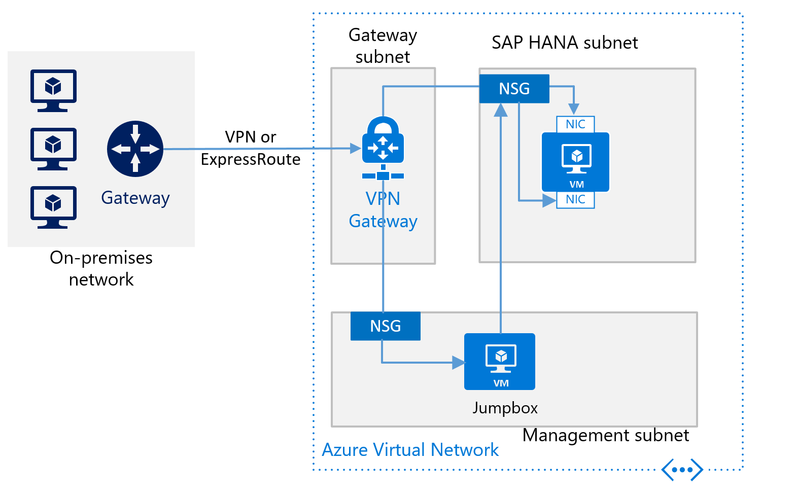
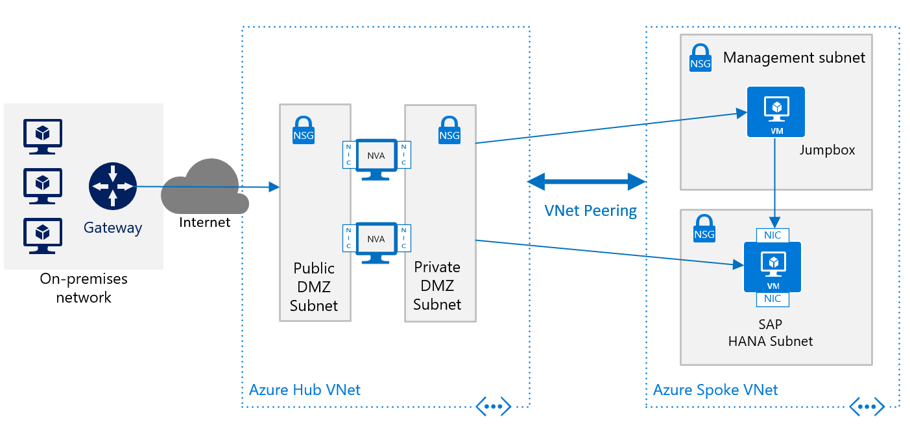
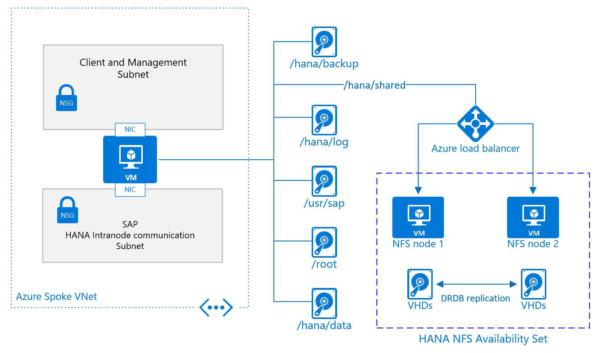
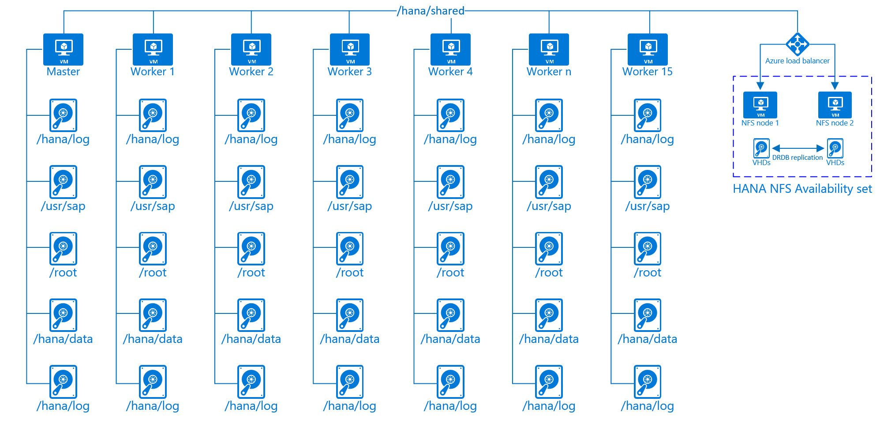
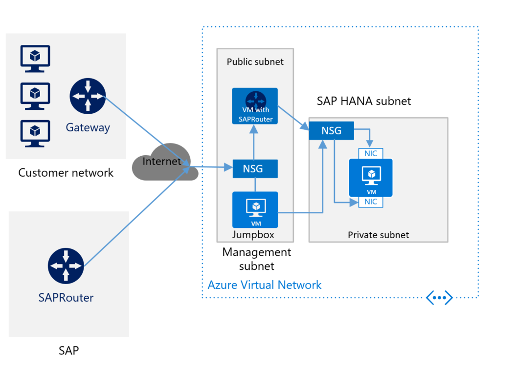

# SAP HANA infrastructure configurations and operations on Azure
This document provides guidance for configuring Azure infrastructure and operating SAP HANA systems that are deployed on Azure native virtual machines (VMs). The document also includes configuration information for SAP HANA scale-out for the M128s VM SKU. This document is not intended to replace the standard SAP documentation, which includes the following content:

- [SAP administration guide](https://help.sap.com/viewer/6b94445c94ae495c83a19646e7c3fd56/2.0.02/330e5550b09d4f0f8b6cceb14a64cd22.html)
- [SAP installation guides](https://service.sap.com/instguides)
- [SAP notes](https://sservice.sap.com/notes)

## Prerequisites
To use this guide, you need basic knowledge of the following Azure components:

- [Azure virtual machines](https://docs.microsoft.com/azure/virtual-machines/linux/tutorial-manage-vm)
- [Azure networking and virtual networks](https://docs.microsoft.com/azure/virtual-machines/linux/tutorial-virtual-network)
- [Azure Storage](https://docs.microsoft.com/azure/virtual-machines/linux/tutorial-manage-disks)

To learn more about SAP NetWeaver and other SAP components on Azure, see the [SAP on Azure](https://docs.microsoft.com/azure/virtual-machines/workloads/sap/get-started) section of the [Azure documentation](https://docs.microsoft.com/azure/).

## Basic setup considerations
The following sections describe basic setup considerations for deploying SAP HANA systems on Azure VMs.

### Connect into Azure virtual machines
As documented in the [Azure virtual machines planning guide](https://docs.microsoft.com/azure/virtual-machines/workloads/sap/planning-guide), there are two basic methods for connecting into Azure VMs:

- Connect through the internet and public endpoints on a Jump VM or on the VM that is running SAP HANA.
- Connect through a [VPN](https://docs.microsoft.com/azure/vpn-gateway/vpn-gateway-howto-site-to-site-resource-manager-portal) or Azure [ExpressRoute](https://azure.microsoft.com/services/expressroute/).

Site-to-site connectivity via VPN or ExpressRoute is necessary for production scenarios. This type of connection is also needed for non-production scenarios that feed into production scenarios where SAP software is being used. The following image shows an example of cross-site connectivity:

### Choose Azure VM types
The Azure VM types that can be used for production scenarios are listed in the [SAP documentation for IAAS](https://www.sap.com/dmc/exp/2014-09-02-hana-hardware/enEN/iaas.html). For non-production scenarios, a wider variety of native Azure VM types is available.

>[!NOTE]
> For non-production scenarios, use the VM types that are listed in the [SAP note #1928533](https://launchpad.support.sap.com/#/notes/1928533). For the usage of Azure VMs for production scenarios, check for SAP HANA certified VMs in the SAP published [Certified IaaS Platforms list](https://www.sap.com/dmc/exp/2014-09-02-hana-hardware/enEN/iaas.html#categories=Microsoft%20Azure).

Deploy the VMs in Azure by using:

- The Azure portal.
- Azure PowerShell cmdlets.
- The Azure CLI.

You also can deploy a complete installed SAP HANA platform on the Azure VM services through the [SAP Cloud platform](https://cal.sap.com/). The installation process is described in [Deploy SAP S/4HANA or BW/4HANA on Azure](https://docs.microsoft.com/azure/virtual-machines/workloads/sap/cal-s4h) or with the automation released [here](https://github.com/AzureCAT-GSI/SAP-HANA-ARM).

>[!IMPORTANT]
> In order to use M208xx_v2 VMs , you need to be careful selecting your SUSE Linux image from the Azure VM image gallery. In order to read the details, read the article [Memory optimized virtual machine sizes](https://docs.microsoft.com/azure/virtual-machines/windows/sizes-memory#mv2-series). Red Hat is not yet supported for using HANA on Mv2 family VMs. Current planning is to provide support for Red Hat versions running HANA on the Mv2 VM family in Q4/CY2019 
> 

### Storage configuration for SAP HANA
For storage configurations and storage types to be used with SAP HANA in Azure, read the document [SAP HANA Azure virtual machine storage configurations](./hana-vm-operations-storage.md)

### Set up Azure virtual networks
When you have site-to-site connectivity into Azure via VPN or ExpressRoute, you must have at least one Azure virtual network that is connected through a Virtual Gateway to the VPN or ExpressRoute circuit. In simple deployments, the Virtual Gateway can be deployed in a subnet of the Azure virtual network (VNet) that hosts the SAP HANA instances as well. To install SAP HANA, you create two additional subnets within the Azure virtual network. One subnet hosts the VMs to run the SAP HANA instances. The other subnet runs Jumpbox or Management VMs to host SAP HANA Studio, other management software, or your application software.

> [!IMPORTANT]
> Out of functionality, but more important out of performance reasons, it is not supported to configure [Azure Network Virtual Appliances](https://azure.microsoft.com/solutions/network-appliances/) in the communication path between the SAP application and the DBMS layer of a SAP NetWeaver, Hybris or S/4HANA based SAP system. The communication between the SAP application layer and the DBMS layer needs to be a direct one. The restriction does not include [Azure ASG and NSG rules](https://docs.microsoft.com/azure/virtual-network/security-overview) as long as those ASG and NSG rules allow a direct communication. Further scenarios where NVAs are not supported are in communication paths between Azure VMs that represent Linux Pacemaker cluster nodes and SBD devices as described in [High availability for SAP NetWeaver on Azure VMs on SUSE Linux Enterprise Server for SAP applications](https://docs.microsoft.com/azure/virtual-machines/workloads/sap/high-availability-guide-suse). Or in communication paths between Azure VMs and Windows Server SOFS set up as described in [Cluster an SAP ASCS/SCS instance on a Windows failover cluster by using a file share in Azure](https://docs.microsoft.com/azure/virtual-machines/workloads/sap/sap-high-availability-guide-wsfc-file-share). NVAs in communication paths can easily double the network latency between two communication partners, can restrict throughput in critical paths between the SAP application layer and the DBMS layer. In some scenarios observed with customers, NVAs can cause Pacemaker Linux clusters to fail in cases where communications between the Linux Pacemaker cluster nodes need to communicate to their SBD device through an NVA.  
> 

> [!IMPORTANT]
> Another design that is **NOT** supported is the segregation of the SAP application layer and the DBMS layer into different Azure virtual networks that are not [peered](https://docs.microsoft.com/azure/virtual-network/virtual-network-peering-overview) with each other. It is recommended to segregate the SAP application layer and DBMS layer using subnets within an Azure virtual network instead of using different Azure virtual networks. If you decide not to follow the recommendation, and instead segregate the two layers into different virtual network, the two virtual networks need to be [peered](https://docs.microsoft.com/azure/virtual-network/virtual-network-peering-overview). Be aware that network traffic between two [peered](https://docs.microsoft.com/azure/virtual-network/virtual-network-peering-overview) Azure virtual networks are subject of transfer costs. With the huge data volume  in many Terabytes exchanged between the SAP application layer and DBMS layer substantial costs can be accumulated if the SAP application layer and DBMS layer is segregated between two peered Azure virtual networks. 

When you install the VMs to run SAP HANA, the VMs need:

- Two virtual NICs installed: one NIC to connect to the management subnet, and one NIC to connect from the on-premises network or other networks, to the SAP HANA instance in the Azure VM.
- Static private IP addresses that are deployed for both virtual NICs.

> [!NOTE]
> You should assign static IP addresses through Azure means to individual vNICs. You should not assign static IP addresses within the guest OS to a vNIC. Some Azure services like Azure Backup Service rely on the fact that at least the primary vNIC is set to DHCP and not to static IP addresses. See also the document [Troubleshoot Azure virtual machine backup](https://docs.microsoft.com/azure/backup/backup-azure-vms-troubleshoot#networking). If you need to assign multiple static IP addresses to a VM, you need to assign multiple vNICs to a VM.
>
>

However, for deployments that are enduring, you need to create a virtual datacenter network architecture in Azure. This architecture recommends the separation of the Azure VNet Gateway that connects to on-premise into a separate Azure VNet. This separate VNet should host all the traffic that leaves either to on-premise or to the internet. This approach allows you to deploy software for auditing and logging traffic that enters the virtual datacenter in Azure in this separate hub VNet. So you have one VNet that hosts all the software and configurations that relates to in- and outgoing traffic to your Azure deployment.

The articles [Azure Virtual Datacenter: A Network Perspective](https://docs.microsoft.com/azure/architecture/vdc/networking-virtual-datacenter) and [Azure Virtual Datacenter and the Enterprise Control Plane](https://docs.microsoft.com/azure/architecture/vdc/) give more  information on the virtual datacenter approach and related Azure VNet design.

>[!NOTE]
>Traffic that flows between a hub VNet and spoke VNet using [Azure VNet peering](https://docs.microsoft.com/azure/virtual-network/virtual-network-peering-overview) is subject of additional [costs](https://azure.microsoft.com/pricing/details/virtual-network/). Based on those costs, you might need to consider making compromises between running a strict hub and spoke network design and running multiple [Azure ExpressRoute Gateways](https://docs.microsoft.com/azure/expressroute/expressroute-about-virtual-network-gateways) that you connect to 'spokes' in order to bypass VNet peering. However, Azure ExpressRoute Gateways introduce additional [costs](https://azure.microsoft.com/pricing/details/vpn-gateway/) as well. You also may encounter additional costs for third-party software you use for network traffic logging, auditing, and monitoring. Dependent on the costs for data exchange through VNet peering on the one side and costs created by additional Azure ExpressRoute Gateways and additional software licenses, you may decide for micro-segmentation within one VNet by using subnets as isolation unit instead of VNets.

For an overview of the different methods for assigning IP addresses, see [IP address types and allocation methods in Azure](https://docs.microsoft.com/azure/virtual-network/virtual-network-ip-addresses-overview-arm). 

For VMs running SAP HANA, you should work with static IP addresses assigned. Reason is that some configuration attributes for HANA reference IP addresses.

[Azure Network Security Groups (NSGs)](https://docs.microsoft.com/azure/virtual-network/virtual-networks-nsg) are used to direct traffic that's routed to the SAP HANA instance or the jumpbox. The NSGs and eventually [Application Security Groups](https://docs.microsoft.com/azure/virtual-network/security-overview#application-security-groups) are associated to the SAP HANA subnet and the Management subnet.

The following image shows an overview of a rough deployment schema for SAP HANA following a hub and spoke VNet architecture:

To deploy SAP HANA in Azure without a site-to-site connection, you still want to shield the SAP HANA instance from the public internet and hide it behind a forward proxy. In this basic scenario, the deployment relies on Azure built-in DNS services to resolve hostnames. In a more complex deployment where public-facing IP addresses are used, Azure built-in DNS services are especially important. Use Azure NSGs and [Azure NVAs](https://azure.microsoft.com/solutions/network-appliances/) to control, monitor the routing from the internet into your Azure VNet architecture in Azure. The following image shows a rough schema for deploying SAP HANA without a site-to-site connection in a hub and spoke VNet architecture:
  

 

Another description on how to use Azure NVAs to control and monitor access from Internet without the hub and spoke VNet architecture can be found in the article [Deploy highly available network virtual appliances](https://docs.microsoft.com/azure/architecture/reference-architectures/dmz/nva-ha).

## Configuring Azure infrastructure for SAP HANA scale-out
Microsoft has one M-Series VM SKU that is certified for an SAP HANA scale-out configuration. The VM type M128s got certified for a scale-out of up to 16 nodes. For changes in SAP HANA scale-out certifications on Azure VMs, check [Certified IaaS Platforms list](https://www.sap.com/dmc/exp/2014-09-02-hana-hardware/enEN/iaas.html#categories=Microsoft%20Azure).

The minimum OS releases for deploying scale-out configurations in Azure VMs are:

- SUSE Linux 12 SP3
- Red hat Linux 7.4

Of the 16 node scale-out certification

- One node is the master node
- A maximum of 15 nodes are worker nodes

>[!NOTE]
>In Azure VM scale-out deployments there is no possibility to use a standby node
>

The reason for not being able to configure a standby node are twofold:

- Azure at this point has no native NFS service. As a result NFS shares need to be configured with help of third-party functionality.
- None of the third-party NFS configurations are able to fulfill the storage latency criteria for SAP HANA with their solutions deployed on Azure.

As a result, **/hana/data** and **/hana/log** volumes can't be shared. Not sharing these volumes of the single nodes, prevents the usage of an SAP HANA standby node in a scale-out configuration.

As a result the basic design for a single node in a scale-out configuration is going to look like:

The basic configuration of a VM node for SAP HANA scale-out looks like:

- For **/hana/shared**, you build out a highly available NFS cluster based on SUSE Linux 12 SP3. This cluster hosts the **/hana/shared** NFS share(s) of your scale-out configuration and SAP NetWeaver or BW/4HANA Central Services. Documentation to build such a configuration is available in the article [High availability for NFS on Azure VMs on SUSE Linux Enterprise Server](https://docs.microsoft.com/azure/virtual-machines/workloads/sap/high-availability-guide-suse-nfs)
- All other disk volumes are **NOT** shared among the different nodes and are **NOT** based on NFS. Installation configurations and steps for scale-out HANA installations with non-shared **/hana/data** and **/hana/log** is provided further down in this document.

>[!NOTE]
>The highly available NFS cluster as displayed in the graphics so far is supported with SUSE Linux only. A highly available NFS solution based on Red Hat is going to be advised later.

Sizing the volumes for the nodes is the same as for scale-up, except **/hana/shared**. For the M128s VM SKU, the suggested sizes and types look like:

| VM SKU | RAM | Max. VM I/O  Throughput | /hana/data | /hana/log | /root volume | /usr/sap | hana/backup |
| --- | --- | --- | --- | --- | --- | --- | --- |
| M128s | 2000 GiB | 2000 MB/s |3 x P30 | 2 x P20 | 1 x P6 | 1 x P6 | 2 x P40 |

Check whether the storage throughput for the different suggested volumes meets the workload that you want to run. If the workload requires higher volumes for **/hana/data** and **/hana/log**, you need to increase the number of Azure Premium Storage VHDs. Sizing a volume with more VHDs than listed increases the IOPS and I/O throughput within the limits of the Azure virtual machine type. Also apply Azure Write Accelerator to the disks that form the **/hana/log** volume.
 
In the document [SAP HANA TDI Storage Requirements](https://www.sap.com/documents/2015/03/74cdb554-5a7c-0010-82c7-eda71af511fa.html), a formula is named that defines the size of the **/hana/shared** volume for scale-out as the memory size of a single worker node per four worker nodes.

Assuming you take the SAP HANA scale-out certified M128s Azure VM with roughly 2 TB memory, the SAP recommendations can be summarized like:

- One master node and up to four worker node, the **/hana/shared** volume would need to be 2 TB of size. 
- One master node and five and eight worker nodes, the size of **/hana/shared** should be 4 TB. 
- One master node and 9 to 12 worker nodes, a size of 6 TB for **/hana/shared** would be required. 
- One master node and using between 12 and 15 worker nodes, you are required to provide a **/hana/shared** volume that is 8 TB in size.

The other important design that is displayed in the graphics of the single node configuration for a scale-out SAP HANA VM is the VNet, or better the subnet configuration. SAP highly recommends a separation of the client/application facing traffic from the communications between the HANA nodes. As shown in the graphics, this goal is achieved by having two different vNICs attached to the VM. Both vNICs are in different subnets, have two different IP addresses. You then control the flow of traffic with routing rules using NSGs or user-defined routes.

Particularly in Azure, there are no means and methods to enforce quality of service and quotas on specific vNICs. As a result, the separation of client/application facing and intra-node communication does not open any opportunities to prioritize one traffic stream over the other. Instead the separation remains a measure of security in shielding the intra-node communications of the scale-out configurations.  

>[!IMPORTANT]
>SAP highly recommends separating network traffic to the client/application side and intra-node traffic as described in this document. Therefore putting an architecture in place as shown in the last graphics is highly recommended.
>

From a networking point of view the minimum required network architecture would look like:

The limits supported so far are 15 worker additional to the one master node.

From a storage point of view the storage architecture would look like:

The **/hana/shared** volume is located on the highly available NFS share configuration. Whereas all the other drives are 'locally' mounted to the individual VMs. 

### Highly available NFS share
The highly available NFS cluster so far is working with SUSE Linux only. The document [High availability for NFS on Azure VMs on SUSE Linux Enterprise Server](https://docs.microsoft.com/azure/virtual-machines/workloads/sap/high-availability-guide-suse-nfs) describes how to set it up. if you don't share the NFS cluster with any other HANA configurations outside the azure VNet that runs the SAP HANA instances, install it in the same VNet. Install it in its own subnet and make sure that not all arbitrary traffic can access the subnet. Instead you want to limit the traffic to that subnet to the IP addresses of the VM that execute the traffic to **/hana/shared** volume.

Related to the vNIC of a HANA scale-out VM that should route the **/hana/shared** traffic, the recommendations are:

- Since traffic to **/hana/shared** is moderate, route it through the vNIC that is assigned to the client network in the minimum configuration
- Eventually, for the traffic to **/hana/shared**, deploy a third subnet in the VNet you deploy the SAP HANA scale-out configuration and assign a third vNIC that is hosted in that subnet. Use the third vNIC and associated IP address for the traffic to the NFS share. You then can apply separate access and routing rules.

>[!IMPORTANT]
>Network traffic between the VMs that have SAP HANA in a scale-out manner deployed and the highly available NFS may under no circumstances be routed through an [NVA](https://azure.microsoft.com/solutions/network-appliances/) or similar virtual appliances. Whereas Azure NSGs are no such devices. Check your routing rules in order to make sure that NVAs or similar virtual appliances are detoured when access the highly available NFS share from the VMs running SAP HANA.
> 

If you want to share the highly available NFS cluster between SAP HANA configurations, move all those HANA configurations into the same VNet. 
 

### Installing SAP HANA scale-out n Azure
Installing a scale-out SAP configuration, you need to perform rough steps of:

- Deploying new or adapting new Azure VNet infrastructure
- Deploying the new VMs using Azure Managed Premium Storage volumes
- Deploying a new or adapt an existing highly available NFS cluster
- Adapt network routing to make sure that, for example, intra-node communication between VMs is not routed through an [NVA](https://azure.microsoft.com/solutions/network-appliances/). Same is true for traffic between the VMs and the highly available NFS cluster.
- Install the SAP HANA master node.
- Adapt configuration parameters of the SAP HANA master node
- Continue with the installation of the SAP HANA worker nodes

#### Installation of SAP HANA in scale-out configuration
As your Azure VM infrastructure is deployed, and all other preparations are done, you need to install the SAP HANA scale-out configurations in these steps:

- Install the SAP HANA master node according to SAP's documentation
- **After the installation, you need to change the global.ini file and add the parameter 'basepath_shared = no' to the global.ini**. This parameter enables SAP HANA to run in scale-out without 'shared' **/hana/data** and **/hana/log** volumes between the nodes. Details are documented in [SAP Note #2080991](https://launchpad.support.sap.com/#/notes/2080991).
- After changing the global.ini parameter, restart the SAP HANA instance
- Add additional worker nodes. See also <https://help.sap.com/viewer/6b94445c94ae495c83a19646e7c3fd56/2.0.00/en-US/0d9fe701e2214e98ad4f8721f6558c34.html>. Specify the internal network for SAP HANA inter-node communication during the installation or afterwards using, for example, the local hdblcm. For more detailed documentation, see also [SAP Note #2183363](https://launchpad.support.sap.com/#/notes/2183363). 

Following this setup routine, the scale-out configuration you installed is going to use non-shared disks for running **/hana/data** and **/hana/log**. Whereas the **/hana/shared** volume is going to be placed on the highly available NFS share.

## SAP HANA Dynamic Tiering 2.0 for Azure virtual machines

In addition to the SAP HANA certifications on Azure M-series VMs, SAP HANA Dynamic Tiering 2.0 is also supported on Microsoft Azure
(see SAP HANA Dynamic Tiering documentation links further down). While there is no difference in installing the product or 
operating it, for example, via SAP HANA Cockpit inside an Azure Virtual Machine, there are a few important items, which are mandatory for official support on Azure. These key points are described below. Throughout the article, the abbreviation "DT 2.0" is going to be used instead of the full name Dynamic Tiering 2.0.

SAP HANA Dynamic Tiering 2.0 isn't supported by SAP BW or S4HANA. Main use cases right now are native HANA applications.

### Overview

The picture below gives an overview regarding DT 2.0 support on Microsoft Azure. There is a set of mandatory requirements, which
has to be followed to comply with the official certification:

- DT 2.0 must be installed on a dedicated Azure VM. It may not run on the same VM where SAP HANA runs
- SAP HANA and DT 2.0 VMs must be deployed within the same Azure Vnet
- The SAP HANA and DT 2.0 VMs must be deployed with Azure accelerated networking enabled
- Storage type for the DT 2.0 VMs must be Azure Premium Storage
- Multiple Azure disks must be attached to the DT 2.0 VM
- It's required to create a software raid / striped volume (either via lvm or mdadm) using striping across the Azure disks

More details are going to be explained in the following sections.

### Dedicated Azure VM for SAP HANA DT 2.0

On Azure IaaS, DT 2.0 is only supported on a dedicated VM. It is not allowed to run DT 2.0 on the same Azure VM where the HANA
instance is running. Initially two VM types can be used to run SAP HANA DT 2.0:

- M64-32ms 
- E32sv3 

See VM type description [here](https://docs.microsoft.com/azure/virtual-machines/linux/sizes-memory)

Given the basic idea of DT 2.0, which is about offloading "warm" data in order to save costs it makes sense to use corresponding
VM sizes. There is no strict rule though regarding the possible combinations. It depends on the specific customer workload.

Recommended configurations would be:

| SAP HANA VM type | DT 2.0 VM type |
| --- | --- | 
| M128ms | M64-32ms |
| M128s | M64-32ms |
| M64ms | E32sv3 |
| M64s | E32sv3 |

All combinations of SAP HANA-certified M-series VMs with supported DT 2.0 VMs (M64-32ms and E32sv3) are possible.

### Azure networking and SAP HANA DT 2.0

Installing DT 2.0 on a dedicated VM requires network throughput between the DT 2.0 VM and the SAP HANA VM of 10 Gb minimum. 
Therefore it's mandatory to place all VMs within the same Azure Vnet and enable Azure accelerated networking.

See additional information about Azure accelerated networking [here](https://docs.microsoft.com/azure/virtual-network/create-vm-accelerated-networking-cli)

### VM Storage for SAP HANA DT 2.0

According to DT 2.0 best practice guidance, the disk IO throughput should be minimum 50 MB/sec per physical core. Looking at the spec for the two 
Azure VM types, which are supported for DT 2.0 the maximum disk IO throughput limit for the VM look like:

- E32sv3    :   768 MB/sec (uncached) which means a ratio of 48 MB/sec per physical core
- M64-32ms  :  1000 MB/sec (uncached) which means a ratio of 62.5 MB/sec per physical core

It is required to attach multiple Azure disks to the DT 2.0 VM and create a software raid (striping) on OS level to achieve the max limit of disk throughput 
per VM. A single Azure disk cannot provide the throughput to reach the max VM limit in this regard. Azure Premium storage is mandatory to run DT 2.0. 

- Details about available Azure disk types can be found [here](../../windows/disks-types.md)
- Details about creating software raid via mdadm can be found [here](https://docs.microsoft.com/azure/virtual-machines/linux/configure-raid)
- Details about configuring LVM to create a striped volume for max throughput can be found [here](https://docs.microsoft.com/azure/virtual-machines/linux/configure-lvm)

Depending on size requirements, there are different options to reach the max throughput of a VM. Here are possible data volume disk configurations 
for every DT 2.0 VM type to achieve the upper VM throughput limit. The E32sv3 VM should be considered as an entry level for smaller workloads. In case it
should turn out that it's not fast enough it might be necessary to resize the VM to M64-32ms.
As the M64-32ms VM has much memory, the IO load might not reach the limit especially for read intensive workloads. Therefore fewer disks in the stripe set
might be sufficient depending on the customer specific workload. But to be on the safe side the disk configurations below were chosen to guarantee the
maximum throughput:

| VM SKU | Disk Config 1 | Disk Config 2 | Disk Config 3 | Disk Config 4 | Disk Config 5 | 
| ---- | ---- | ---- | ---- | ---- | ---- | 
| M64-32ms | 4 x P50 -> 16 TB | 4 x P40 -> 8 TB | 5 x P30 -> 5 TB | 7 x P20 -> 3.5 TB | 8 x P15 -> 2 TB | 
| E32sv3 | 3 x P50 -> 12 TB | 3 x P40 -> 6 TB | 4 x P30 -> 4 TB | 5 x P20 -> 2.5 TB | 6 x P15 -> 1.5 TB | 

Especially in case the workload is read-intense it could boost IO performance to turn on Azure host cache "read-only" as recommended for the 
data volumes of database software. Whereas for the transaction log Azure host disk cache must be "none". 

Regarding the size of the log volume a recommended starting point is a heuristic of 15% of the data size. The creation of the log volume  can be accomplished by using different
Azure disk types depending on cost and throughput requirements. For the log volume high I/O throughput is required.  In case of using the VM type M64-32ms it is 
strongly recommended to enable [Write Accelerator](https://docs.microsoft.com/azure/virtual-machines/linux/how-to-enable-write-accelerator). Azure Write Accelerator provides optimal disk write latency for the transaction
log (only available for M-series). There are some items to consider though like the maximum number of disks per VM type. Details about Write Accelerator can be
found [here](https://docs.microsoft.com/azure/virtual-machines/windows/how-to-enable-write-accelerator)

Here are a few examples about sizing the log volume:

| data volume size and disk type | log volume and disk type config 1 | log volume and disk type config 2 |
| --- | --- | --- |
| 4 x P50 -> 16 TB | 5 x P20 -> 2.5 TB | 3 x P30 -> 3 TB |
| 6 x P15 -> 1.5 TB | 4 x P6 -> 256 GB | 1 x P15 -> 256 GB |

Like for SAP HANA scale-out, the /hana/shared directory has to be shared between the SAP HANA VM and the DT 2.0 VM. The same architecture as for
SAP HANA scale-out using dedicated VMs, which act as a highly available NFS server is recommended. In order to provide a shared backup volume,
the identical design can be used. But it is up to the customer if HA would be necessary or if it is sufficient to just use a dedicated VM with
enough storage capacity to act as a backup server.

### Links to DT 2.0 documentation 

- [SAP HANA Dynamic Tiering installation and update guide](https://help.sap.com/viewer/88f82e0d010e4da1bc8963f18346f46e/2.0.03/en-US)
- [SAP HANA Dynamic Tiering tutorials and resources](https://help.sap.com/viewer/fb9c3779f9d1412b8de6dd0788fa167b/2.0.03/en-US)
- [SAP HANA Dynamic Tiering PoC](https://blogs.sap.com/2017/12/08/sap-hana-dynamic-tiering-delivering-on-low-tco-with-impressive-performance/)
- [SAP HANA 2.0 SPS 02 dynamic tiering enhancements](https://blogs.sap.com/2017/07/31/sap-hana-2.0-sps-02-dynamic-tiering-enhancements/)

## Operations for deploying SAP HANA on Azure VMs
The following sections describe some of the operations related to deploying SAP HANA systems on Azure VMs.

### Back up and restore operations on Azure VMs
The following documents describe how to back up and restore your SAP HANA deployment:

- [SAP HANA backup overview](https://docs.microsoft.com/azure/virtual-machines/workloads/sap/sap-hana-backup-guide)
- [SAP HANA file-level backup](https://docs.microsoft.com/azure/virtual-machines/workloads/sap/sap-hana-backup-file-level)
- [SAP HANA storage snapshot benchmark](https://docs.microsoft.com/azure/virtual-machines/workloads/sap/sap-hana-backup-storage-snapshots)

### Start and restart VMs that contain SAP HANA
A prominent feature of the Azure public cloud is that you're charged only for your computing minutes. For example, when you shut down a VM that is running SAP HANA, you're billed only for the storage costs during that time. Another feature is available when you specify static IP addresses for your VMs in your initial deployment. When you restart a VM that has SAP HANA, the VM restarts with its prior IP addresses. 

### Use SAProuter for SAP remote support
If you have a site-to-site connection between your on-premises locations and Azure, and you're running SAP components, then you're probably already running SAProuter. In this case, complete the following items for remote support:

- Maintain the private and static IP address of the VM that hosts SAP HANA in the SAProuter configuration.
- Configure the NSG of the subnet that hosts the HANA VM to allow traffic through TCP/IP port 3299.

If you're connecting to Azure through the internet, and you don't have an SAP router for the VM with SAP HANA, then you need to install the component. Install SAProuter in a separate VM in the Management subnet. The following image shows a rough schema for deploying SAP HANA without a site-to-site connection and with SAProuter:

Be sure to install SAProuter in a separate VM and not in your Jumpbox VM. The separate VM must have a static IP address. To connect your SAProuter to the SAProuter that is hosted by SAP, contact SAP for an IP address. (The SAProuter that is hosted by SAP is the counterpart of the SAProuter instance that you install on your VM.) Use the IP address from SAP to configure your SAProuter instance. In the configuration settings, the only necessary port is TCP port 3299.

For more information on how to set up and maintain remote support connections through SAProuter, see the [SAP documentation](https://support.sap.com/en/tools/connectivity-tools/remote-support.html).

### High-availability with SAP HANA on Azure native VMs
If you're running SUSE Linux Enterprise Server for SAP Applications 12 SP1 or later, you can establish a Pacemaker cluster with STONITH devices. You can use the devices to set up an SAP HANA configuration that uses synchronous replication with HANA System Replication and automatic failover. For more information about the setup procedure, see [SAP HANA High Availability guide for Azure virtual machines](https://docs.microsoft.com/azure/virtual-machines/workloads/sap/sap-hana-availability-overview).
