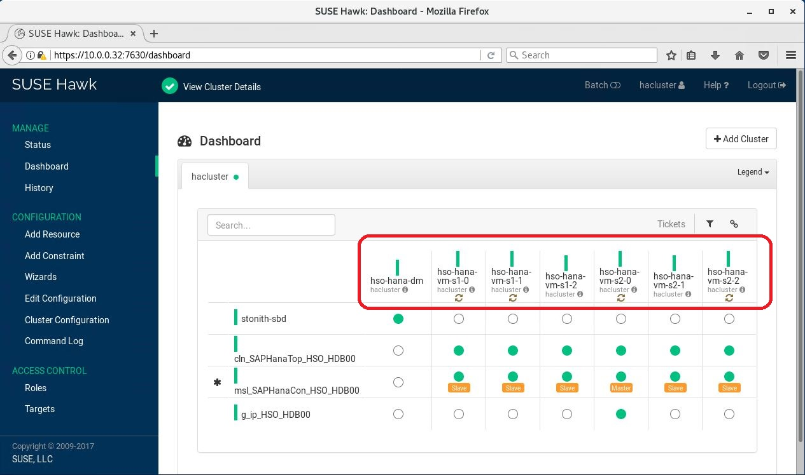
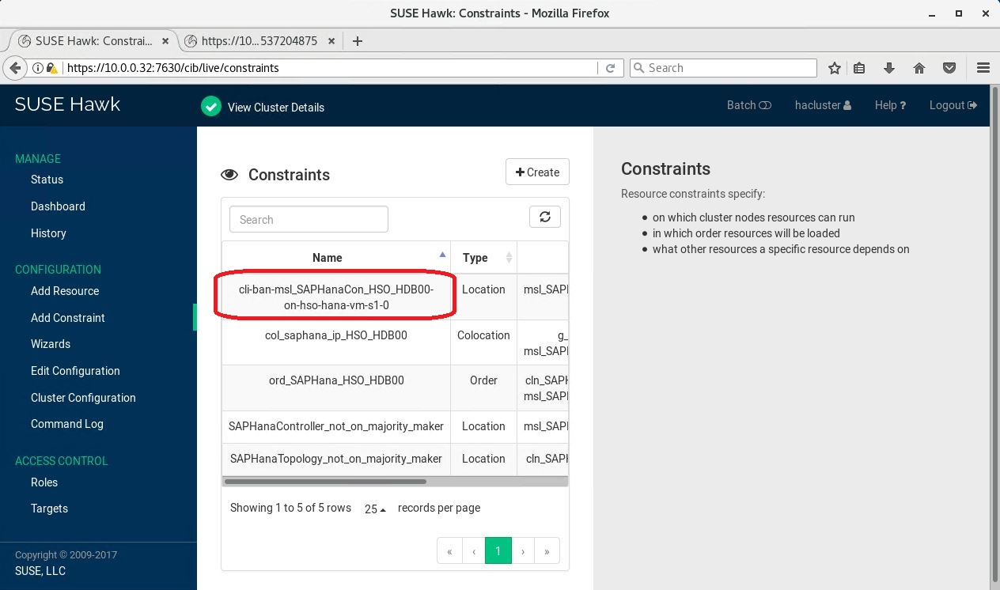
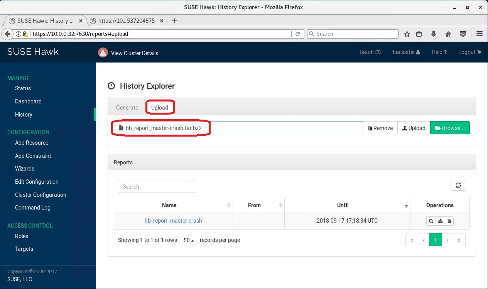
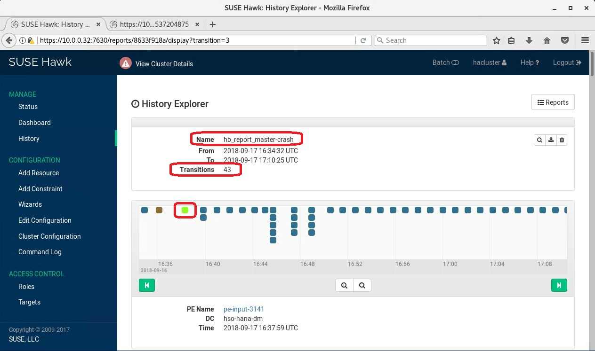

# Verify and troubleshoot SAP HANA scale-out high-availability setup on SLES 12 SP3 

[sles-pacemaker-ha-guide]:high-availability-guide-suse-pacemaker.md
[sles-hana-scale-out-ha-paper]:https://www.suse.com/documentation/suse-best-practices/singlehtml/SLES4SAP-hana-scaleOut-PerfOpt-12/SLES4SAP-hana-scaleOut-PerfOpt-12.html
[sap-hana-iaas-list]:https://www.sap.com/dmc/exp/2014-09-02-hana-hardware/enEN/iaas.html
[suse-pacemaker-support-log-files]:https://www.suse.com/support/kb/doc/?id=7022702
[azure-linux-multiple-nics]:https://docs.microsoft.com/azure/virtual-machines/linux/multiple-nics
[suse-cloud-netconfig]:https://www.suse.com/c/multi-nic-cloud-netconfig-ec2-azure/
[sap-list-port-numbers]:https://help.sap.com/viewer/ports
[sles-12-ha-paper]:https://www.suse.com/documentation/sle-ha-12/pdfdoc/book_sleha/book_sleha.pdf
[sles-zero-downtime-paper]:https://www.suse.com/media/presentation/TUT90846_towards_zero_downtime%20_how_to_maintain_sap_hana_system_replication_clusters.pdf
[sap-nw-ha-guide-sles]:high-availability-guide-suse.md
[sles-12-for-sap]:https://www.suse.com/media/white-paper/suse_linux_enterprise_server_for_sap_applications_12_sp1.pdf

This article helps you check the Pacemaker cluster configuration for SAP HANA scale-out that runs on Azure virtual machines (VMs). The cluster setup was accomplished in combination with SAP HANA System Replication (HSR) and the SUSE RPM package SAPHanaSR-ScaleOut. All tests were done on SUSE SLES 12 SP3 only. The article's sections cover different areas and include sample commands and excerpts from config files. We recommend these samples as a method to verify and check the whole cluster setup.

## Important notes

All testing for SAP HANA scale-out in combination with SAP HANA System Replication and Pacemaker was done with SAP HANA 2.0 only. The operating system version was SUSE Linux Enterprise Server 12 SP3 for SAP applications. The latest RPM package, SAPHanaSR-ScaleOut from SUSE, was used to set up the Pacemaker cluster.
SUSE published a [detailed description of this performance-optimized setup][sles-hana-scale-out-ha-paper].

For virtual machine types that are supported for SAP HANA scale-out, check the [SAP HANA certified IaaS directory][sap-hana-iaas-list].

There was a technical issue with SAP HANA scale-out in combination with multiple subnets and vNICs and setting up HSR. It's mandatory to use the latest SAP HANA 2.0 patches where this issue was fixed. The following SAP HANA versions are supported: 

* rev2.00.024.04 or higher 
* rev2.00.032 or higher

If you need support from SUSE, follow this [guide][suse-pacemaker-support-log-files]. Collect all the information about the SAP HANA high-availability (HA) cluster as described in the article. SUSE support needs this information for further analysis.

During internal testing, the cluster setup got confused by a normal graceful VM shutdown via the Azure portal. So we recommend that you test a cluster failover by other methods. Use methods like forcing a kernel panic, or shut down the networks or migrate the **msl** resource. See details in the following sections. The assumption is that a standard shutdown happens with intention. The best example of an intentional shutdown is for maintenance. See details in [Planned maintenance](#planned-maintenance).

Also, during internal testing, the cluster setup got confused after a manual SAP HANA takeover while the cluster was in maintenance mode. We recommend that you switch it back again manually before you end the cluster maintenance mode. Another option is to trigger a failover before you put the cluster into maintenance mode. For more information, see [Planned maintenance](#planned-maintenance). The documentation from SUSE describes how you can reset the cluster in this way by using the **crm** command. But the approach mentioned previously was robust during internal testing and never showed any unexpected side effects.

When you use the **crm migrate** command, make sure to clean up the cluster configuration. It adds location constraints that you might not be aware of. These constraints impact the cluster behavior. See more details in [Planned maintenance](#planned-maintenance).

## Test system description

 For SAP HANA scale-out HA verification and certification, a setup was used. It consisted of two systems with three SAP HANA nodes each: one master and two workers. The following table lists VM names and internal IP addresses. All the verification samples that follow were done on these VMs. By using these VM names and IP addresses in the command samples, you can better understand the commands and their outputs:

| Node type | VM name | IP address |
| --- | --- | --- |
| Master node on site 1 | hso-hana-vm-s1-0 | 10.0.0.30 |
| Worker node 1 on site 1 | hso-hana-vm-s1-1 | 10.0.0.31 |
| Worker node 2 on site 1 | hso-hana-vm-s1-2 | 10.0.0.32 |
| | | |
| Master node on site 2 | hso-hana-vm-s2-0 | 10.0.0.40 |
| Worker node 1 on site 2 | hso-hana-vm-s2-1 | 10.0.0.41 |
| Worker node 2 on site 2 | hso-hana-vm-s2-2  | 10.0.0.42 |
| | | |
| Majority maker node | hso-hana-dm | 10.0.0.13 |
| SBD device server | hso-hana-sbd | 10.0.0.19 |
| | | |
| NFS server 1 | hso-nfs-vm-0 | 10.0.0.15 |
| NFS server 2 | hso-nfs-vm-1 | 10.0.0.14 |

## Multiple subnets and vNICs

Following SAP HANA network recommendations, three subnets were created within one Azure virtual network. SAP HANA scale-out on Azure has to be installed in nonshared mode. That means every node uses local disk volumes for **/hana/data** and **/hana/log**. Because the nodes use only local disk volumes, it's not necessary to define a separate subnet for storage:

- 10.0.2.0/24 for SAP HANA internode communication
- 10.0.1.0/24 for SAP HANA System Replication (HSR)
- 10.0.0.0/24 for everything else

For information about SAP HANA configuration related to using multiple networks, see [SAP HANA global.ini](#sap-hana-globalini).

Every VM in the cluster has three vNICs that correspond to the number of subnets. [How to create a Linux virtual machine in Azure with multiple network interface cards][azure-linux-multiple-nics] describes a potential routing issue on Azure when deploying a Linux VM. This specific routing article applies only for use of multiple vNICs. The problem is solved by SUSE per default in SLES 12 SP3. For more information, see [Multi-NIC with cloud-netconfig in EC2 and Azure][suse-cloud-netconfig].

To verify that SAP HANA is configured correctly to use multiple networks, run the following commands. First check on the OS level that all three internal IP addresses for all three subnets are active. If you defined the subnets with different IP address ranges, you have to adapt the commands:

<pre><code>
ifconfig | grep "inet addr:10\."
</code></pre>

The following sample output is from the second worker node on site 2. You can see three different internal IP addresses from eth0, eth1, and eth2:

<pre><code>
inet addr:10.0.0.42  Bcast:10.0.0.255  Mask:255.255.255.0
inet addr:10.0.1.42  Bcast:10.0.1.255  Mask:255.255.255.0
inet addr:10.0.2.42  Bcast:10.0.2.255  Mask:255.255.255.0
</code></pre>

Next, verify the SAP HANA ports for the name server and HSR. SAP HANA should listen on the corresponding subnets. Depending on the SAP HANA instance number, you have to adapt the commands. For the test system, the instance number was **00**. There are different ways to find out which ports are used. 

The following SQL statement returns the instance ID, instance number, and other information:

<pre><code>
select * from "SYS"."M_SYSTEM_OVERVIEW"
</code></pre>

To find the correct port numbers, you can look, for example, in HANA Studio under **Configuration** or via a SQL statement:

<pre><code>
select * from M_INIFILE_CONTENTS WHERE KEY LIKE 'listen%'
</code></pre>

To find every port that's used in the SAP software stack including SAP HANA, search [TCP/IP ports of all SAP products][sap-list-port-numbers].

Given the instance number **00** in the SAP HANA 2.0 test system, the port number for the name server is **30001**. The port number for HSR metadata communication is **40002**. One option is to sign in to a worker node and then check the master node services. For this article, we checked worker node 2 on site 2 trying to connect to the master node on site 2.

Check the name server port:

<pre><code>
nc -vz 10.0.0.40 30001
nc -vz 10.0.1.40 30001
nc -vz 10.0.2.40 30001
</code></pre>

To prove that the internode communication uses subnet **10.0.2.0/24**, the result should look like the following sample output.
Only the connection via subnet **10.0.2.0/24** should succeed:

<pre><code>
nc: connect to 10.0.0.40 port 30001 (tcp) failed: Connection refused
nc: connect to 10.0.1.40 port 30001 (tcp) failed: Connection refused
Connection to 10.0.2.40 30001 port [tcp/pago-services1] succeeded!
</code></pre>

Now check for HSR port **40002**:

<pre><code>
nc -vz 10.0.0.40 40002
nc -vz 10.0.1.40 40002
nc -vz 10.0.2.40 40002
</code></pre>

To prove that the HSR communication uses subnet **10.0.1.0/24**, the result should look like the following sample output.
Only the connection via subnet **10.0.1.0/24** should succeed:

<pre><code>
nc: connect to 10.0.0.40 port 40002 (tcp) failed: Connection refused
Connection to 10.0.1.40 40002 port [tcp/*] succeeded!
nc: connect to 10.0.2.40 port 40002 (tcp) failed: Connection refused
</code></pre>

## Corosync

The **corosync** config file has to be correct on every node in the cluster including the majority maker node. If the cluster join of a node doesn't work as expected, create or copy **/etc/corosync/corosync.conf** manually onto all nodes and restart the service. 

The content of **corosync.conf** from the test system is an example.

The first section is **totem**, as described in [Cluster installation](https://docs.microsoft.com/azure/virtual-machines/workloads/sap/high-availability-guide-suse-pacemaker#cluster-installation), step 11. You can ignore the value for **mcastaddr**. Just keep the existing entry. The entries for **token** and **consensus** must be set according to [Microsoft Azure SAP HANA documentation][sles-pacemaker-ha-guide].

<pre><code>
totem {
    version:    2
    secauth:    on
    crypto_hash:    sha1
    crypto_cipher:  aes256
    cluster_name:   hacluster
    clear_node_high_bit: yes

    token:      30000
    token_retransmits_before_loss_const: 10
    join:       60
    consensus:  36000
    max_messages:   20

    interface {
        ringnumber:     0
        bindnetaddr: 10.0.0.0
        mcastaddr:  239.170.19.232
        mcastport:  5405

        ttl:        1
    }
    transport:      udpu

}
</code></pre>

The second section, **logging**, wasn't changed from the given defaults:

<pre><code>
logging {
    fileline:   off
    to_stderr:  no
    to_logfile:     no
    logfile:    /var/log/cluster/corosync.log
    to_syslog:  yes
    debug:      off
    timestamp:  on
    logger_subsys {
        subsys:     QUORUM
        debug:  off
    }
}
</code></pre>

The third section shows the **nodelist**. All nodes of the cluster have to show up with their **nodeid**:

<pre><code>
nodelist {
  node {
   ring0_addr:hso-hana-vm-s1-0
   nodeid: 1
   }
  node {
   ring0_addr:hso-hana-vm-s1-1
   nodeid: 2
   }
  node {
   ring0_addr:hso-hana-vm-s1-2
   nodeid: 3
   }
  node {
   ring0_addr:hso-hana-vm-s2-0
   nodeid: 4
   }
  node {
   ring0_addr:hso-hana-vm-s2-1
   nodeid: 5
   }
  node {
   ring0_addr:hso-hana-vm-s2-2
   nodeid: 6
   }
  node {
   ring0_addr:hso-hana-dm
   nodeid: 7
   }
}
</code></pre>

In the last section, **quorum**, it's important to set the value for **expected_votes** correctly. It must be the number of nodes including the majority maker node. And the value for **two_node** has to be **0**. Don't remove the entry completely. Just set the value to **0**.

<pre><code>
quorum {
    # Enable and configure quorum subsystem (default: off)
    # see also corosync.conf.5 and votequorum.5
    provider: corosync_votequorum
    expected_votes: 7
    two_node: 0
}
</code></pre>

Restart the service via **systemctl**:

<pre><code>
systemctl restart corosync
</code></pre>

## SBD device

How to set up an SBD device on an Azure VM is described in [SBD fencing](https://docs.microsoft.com/azure/virtual-machines/workloads/sap/high-availability-guide-suse-pacemaker#sbd-fencing).

First, check on the SBD server VM if there are ACL entries for every node in the cluster. Run the following command on the SBD server VM:

<pre><code>
targetcli ls
</code></pre>

On the test system, the output of the command looks like the following sample. ACL names like **iqn.2006-04.hso-db-0.local:hso-db-0** must be entered as the corresponding initiator names on the VMs. Every VM needs a different one.

<pre><code>
 | | o- sbddbhso ................................................................... [/sbd/sbddbhso (50.0MiB) write-thru activated]
  | |   o- alua ................................................................................................... [ALUA Groups: 1]
  | |     o- default_tg_pt_gp ....................................................................... [ALUA state: Active/optimized]
  | o- pscsi .................................................................................................. [Storage Objects: 0]
  | o- ramdisk ................................................................................................ [Storage Objects: 0]
  o- iscsi ............................................................................................................ [Targets: 1]
  | o- iqn.2006-04.dbhso.local:dbhso ..................................................................................... [TPGs: 1]
  |   o- tpg1 ............................................................................................... [no-gen-acls, no-auth]
  |     o- acls .......................................................................................................... [ACLs: 7]
  |     | o- iqn.2006-04.hso-db-0.local:hso-db-0 .................................................................. [Mapped LUNs: 1]
  |     | | o- mapped_lun0 ............................................................................. [lun0 fileio/sbddbhso (rw)]
  |     | o- iqn.2006-04.hso-db-1.local:hso-db-1 .................................................................. [Mapped LUNs: 1]
  |     | | o- mapped_lun0 ............................................................................. [lun0 fileio/sbddbhso (rw)]
  |     | o- iqn.2006-04.hso-db-2.local:hso-db-2 .................................................................. [Mapped LUNs: 1]
  |     | | o- mapped_lun0 ............................................................................. [lun0 fileio/sbddbhso (rw)]
  |     | o- iqn.2006-04.hso-db-3.local:hso-db-3 .................................................................. [Mapped LUNs: 1]
  |     | | o- mapped_lun0 ............................................................................. [lun0 fileio/sbddbhso (rw)]
  |     | o- iqn.2006-04.hso-db-4.local:hso-db-4 .................................................................. [Mapped LUNs: 1]
  |     | | o- mapped_lun0 ............................................................................. [lun0 fileio/sbddbhso (rw)]
  |     | o- iqn.2006-04.hso-db-5.local:hso-db-5 .................................................................. [Mapped LUNs: 1]
  |     | | o- mapped_lun0 ............................................................................. [lun0 fileio/sbddbhso (rw)]
  |     | o- iqn.2006-04.hso-db-6.local:hso-db-6 .................................................................. [Mapped LUNs: 1]
</code></pre>

Then check that the initiator names on all the VMs are different and correspond to the previously shown entries. This example is from worker node 1 on site 1:

<pre><code>
cat /etc/iscsi/initiatorname.iscsi
</code></pre>

The output looks like the following sample:

<pre><code>
##
## /etc/iscsi/iscsi.initiatorname
##
## Default iSCSI Initiatorname.
##
## DO NOT EDIT OR REMOVE THIS FILE!
## If you remove this file, the iSCSI daemon will not start.
## If you change the InitiatorName, existing access control lists
## may reject this initiator.  The InitiatorName must be unique
## for each iSCSI initiator.  Do NOT duplicate iSCSI InitiatorNames.
InitiatorName=iqn.2006-04.hso-db-1.local:hso-db-1
</code></pre>

Next, verify that the **discovery** works correctly. Run the following command on every cluster node by using the IP address of the SBD server VM:

<pre><code>
iscsiadm -m discovery --type=st --portal=10.0.0.19:3260
</code></pre>

The output should look like the following sample:

<pre><code>
10.0.0.19:3260,1 iqn.2006-04.dbhso.local:dbhso
</code></pre>

The next proof point is to verify that the node sees the SDB device. Check it on every node including the majority maker node:

<pre><code>
lsscsi | grep dbhso
</code></pre>

The output should look like the following sample. However, the names might differ. The device name might also change after the VM reboots:

<pre><code>
[6:0:0:0]    disk    LIO-ORG  sbddbhso         4.0   /dev/sdm
</code></pre>

Depending on the status of the system, it sometimes helps to restart the iSCSI services to resolve issues. Then run the following commands:

<pre><code>
systemctl restart iscsi
systemctl restart iscsid
</code></pre>

From any node, you can check if all nodes are **clear**. Make sure that you use the correct device name on a specific node:

<pre><code>
sbd -d /dev/sdm list
</code></pre>

The output should show **clear** for every node in the cluster:

<pre><code>
0       hso-hana-vm-s1-0        clear
1       hso-hana-vm-s2-2        clear
2       hso-hana-vm-s2-1        clear
3       hso-hana-dm     clear
4       hso-hana-vm-s1-1        clear
5       hso-hana-vm-s2-0        clear
6       hso-hana-vm-s1-2        clear
</code></pre>

Another SBD check is the **dump** option of the **sbd** command. In this sample command and output from the majority maker node, the device name was **sdd**, not **sdm**:

<pre><code>
sbd -d /dev/sdd dump
</code></pre>

The output, apart from the device name, should look the same on all nodes:

<pre><code>
==Dumping header on disk /dev/sdd
Header version     : 2.1
UUID               : 9fa6cc49-c294-4f1e-9527-c973f4d5a5b0
Number of slots    : 255
Sector size        : 512
Timeout (watchdog) : 60
Timeout (allocate) : 2
Timeout (loop)     : 1
Timeout (msgwait)  : 120
==Header on disk /dev/sdd is dumped
</code></pre>

One more check for SBD is the possibility to send a message to another node. To send a message to worker node 2 on site 2, run the following command on worker node 1 on site 2:

<pre><code>
sbd -d /dev/sdm message hso-hana-vm-s2-2 test
</code></pre>

On the target VM side, **hso-hana-vm-s2-2** in this example, you can find the following entry in **/var/log/messages**:

<pre><code>
/dev/disk/by-id/scsi-36001405e614138d4ec64da09e91aea68:   notice: servant: Received command test from hso-hana-vm-s2-1 on disk /dev/disk/by-id/scsi-36001405e614138d4ec64da09e91aea68
</code></pre>

Check that the entries in **/etc/sysconfig/sbd** correspond to the description in [Setting up Pacemaker on SUSE Linux Enterprise Server in Azure](https://docs.microsoft.com/azure/virtual-machines/workloads/sap/high-availability-guide-suse-pacemaker#sbd-fencing). Verify that the startup setting in **/etc/iscsi/iscsid.conf** is set to automatic.

The following entries are important in **/etc/sysconfig/sbd**. Adapt the **id** value if necessary:

<pre><code>
SBD_DEVICE="/dev/disk/by-id/scsi-36001405e614138d4ec64da09e91aea68;"
SBD_PACEMAKER=yes
SBD_STARTMODE=always
SBD_WATCHDOG=yes
</code></pre>

Check the startup setting in **/etc/iscsi/iscsid.conf**. The required setting should have happened with the following **iscsiadm** command, described in the documentation. Verify and adapt it manually with **vi** if it's different.

This command sets startup behavior:

<pre><code>
iscsiadm -m node --op=update --name=node.startup --value=automatic
</code></pre>

Make this entry in **/etc/iscsi/iscsid.conf**:

<pre><code>
node.startup = automatic
</code></pre>

During testing and verification, after the restart of a VM, the SBD device wasn't visible anymore in some cases. There was a discrepancy between the startup setting and what YaST2 showed. To check the settings, take these steps:

1. Start YaST2.
2. Select **Network Services** on the left side.
3. Scroll down on the right side to **iSCSI Initiator** and select it.
4. On the next screen under the **Service** tab, you see the unique initiator name for the node.
5. Above the initiator name, make sure that the **Service Start** value is set to **When Booting**.
6. If it's not, then set it to **When Booting** instead of **Manually**.
7. Next, switch the top tab to **Connected Targets**.
8. On the **Connected Targets** screen, you should see an entry for the SBD device like this sample: **10.0.0.19:3260 iqn.2006-04.dbhso.local:dbhso**.
9. Check if the **Start-Up** value is set to **on boot**.
10. If not, choose **Edit** and change it.
11. Save the changes and exit YaST2.

## Pacemaker

After everything is set up correctly, you can run the following command on every node to check the status of the Pacemaker service:

<pre><code>
systemctl status pacemaker
</code></pre>

The top of the output should look like the following sample. It's important that the status after **Active** is shown as **loaded** and **active (running)**. The status after **Loaded** must be shown as **enabled**.

<pre><code>
  pacemaker.service - Pacemaker High Availability Cluster Manager
   Loaded: loaded (/usr/lib/systemd/system/pacemaker.service; enabled; vendor preset: disabled)
   Active: active (running) since Fri 2018-09-07 05:56:27 UTC; 4 days ago
     Docs: man:pacemakerd
           http://clusterlabs.org/doc/en-US/Pacemaker/1.1-pcs/html/Pacemaker_Explained/index.html
 Main PID: 4496 (pacemakerd)
    Tasks: 7 (limit: 4915)
   CGroup: /system.slice/pacemaker.service
           ├─4496 /usr/sbin/pacemakerd -f
           ├─4499 /usr/lib/pacemaker/cib
           ├─4500 /usr/lib/pacemaker/stonithd
           ├─4501 /usr/lib/pacemaker/lrmd
           ├─4502 /usr/lib/pacemaker/attrd
           ├─4503 /usr/lib/pacemaker/pengine
           └─4504 /usr/lib/pacemaker/crmd
</code></pre>

If the setting is still on **disabled**, run the following command:

<pre><code>
systemctl enable pacemaker
</code></pre>

To see all configured resources in Pacemaker, run the following command:

<pre><code>
crm status
</code></pre>

The output should look like the following sample. It's fine that the **cln** and **msl** resources are shown as stopped on the majority maker VM, **hso-hana-dm**. There's no SAP HANA installation on the majority maker node. So the **cln** and **msl** resources are shown as stopped. It's important that it shows the correct total number of VMs, **7**. All VMs that are part of the cluster must be listed with the status **Online**. The current primary master node must be recognized correctly. In this example, it's **hso-hana-vm-s1-0**:

<pre><code>
Stack: corosync
Current DC: hso-hana-dm (version 1.1.16-4.8-77ea74d) - partition with quorum
Last updated: Tue Sep 11 15:56:40 2018
Last change: Tue Sep 11 15:56:23 2018 by root via crm_attribute on hso-hana-vm-s1-0

7 nodes configured
17 resources configured

Online: [ hso-hana-dm hso-hana-vm-s1-0 hso-hana-vm-s1-1 hso-hana-vm-s1-2 hso-hana-vm-s2-0 hso-hana-vm-s2-1 hso-hana-vm-s2-2 ]

Full list of resources:

 stonith-sbd    (stonith:external/sbd): Started hso-hana-dm
 Clone Set: cln_SAPHanaTop_HSO_HDB00 [rsc_SAPHanaTop_HSO_HDB00]
     Started: [ hso-hana-vm-s1-0 hso-hana-vm-s1-1 hso-hana-vm-s1-2 hso-hana-vm-s2-0 hso-hana-vm-s2-1 hso-hana-vm-s2-2 ]
     Stopped: [ hso-hana-dm ]
 Master/Slave Set: msl_SAPHanaCon_HSO_HDB00 [rsc_SAPHanaCon_HSO_HDB00]
     Masters: [ hso-hana-vm-s1-0 ]
     Slaves: [ hso-hana-vm-s1-1 hso-hana-vm-s1-2 hso-hana-vm-s2-0 hso-hana-vm-s2-1 hso-hana-vm-s2-2 ]
     Stopped: [ hso-hana-dm ]
 Resource Group: g_ip_HSO_HDB00
     rsc_ip_HSO_HDB00   (ocf::heartbeat:IPaddr2):       Started hso-hana-vm-s1-0
     rsc_nc_HSO_HDB00   (ocf::heartbeat:anything):      Started hso-hana-vm-s1-0
</code></pre>

An important feature of Pacemaker is maintenance mode. In this mode, you can make modifications without provoking an immediate cluster action. An example is a VM reboot. A typical use case would be planned OS or Azure infrastructure maintenance. See [Planned maintenance](#planned-maintenance). Use the following command to put Pacemaker into maintenance mode:

<pre><code>
crm configure property maintenance-mode=true
</code></pre>

When you check with **crm status**, you notice in the output that all resources are marked as **unmanaged**. In this state, the cluster doesn't react on any changes like starting or stopping SAP HANA.
The following sample shows the output of the **crm status** command while the cluster is in maintenance mode:

<pre><code>
Stack: corosync
Current DC: hso-hana-dm (version 1.1.16-4.8-77ea74d) - partition with quorum
Last updated: Wed Sep 12 07:48:10 2018
Last change: Wed Sep 12 07:46:54 2018 by root via cibadmin on hso-hana-vm-s2-1

7 nodes configured
17 resources configured

              *** Resource management is DISABLED ***
  The cluster will not attempt to start, stop or recover services

Online: [ hso-hana-dm hso-hana-vm-s1-0 hso-hana-vm-s1-1 hso-hana-vm-s1-2 hso-hana-vm-s2-0 hso-hana-vm-s2-1 hso-hana-vm-s2-2 ]

Full list of resources:

 stonith-sbd    (stonith:external/sbd): Started hso-hana-dm (unmanaged)
 Clone Set: cln_SAPHanaTop_HSO_HDB00 [rsc_SAPHanaTop_HSO_HDB00] (unmanaged)
     rsc_SAPHanaTop_HSO_HDB00   (ocf::suse:SAPHanaTopology):    Started hso-hana-vm-s1-1 (unmanaged)
     rsc_SAPHanaTop_HSO_HDB00   (ocf::suse:SAPHanaTopology):    Started hso-hana-vm-s1-0 (unmanaged)
     rsc_SAPHanaTop_HSO_HDB00   (ocf::suse:SAPHanaTopology):    Started hso-hana-vm-s1-2 (unmanaged)
     rsc_SAPHanaTop_HSO_HDB00   (ocf::suse:SAPHanaTopology):    Started hso-hana-vm-s2-1 (unmanaged)
     rsc_SAPHanaTop_HSO_HDB00   (ocf::suse:SAPHanaTopology):    Started hso-hana-vm-s2-2 (unmanaged)
     rsc_SAPHanaTop_HSO_HDB00   (ocf::suse:SAPHanaTopology):    Started hso-hana-vm-s2-0 (unmanaged)
     Stopped: [ hso-hana-dm ]
 Master/Slave Set: msl_SAPHanaCon_HSO_HDB00 [rsc_SAPHanaCon_HSO_HDB00] (unmanaged)
     rsc_SAPHanaCon_HSO_HDB00   (ocf::suse:SAPHanaController):  Slave hso-hana-vm-s1-1 (unmanaged)
     rsc_SAPHanaCon_HSO_HDB00   (ocf::suse:SAPHanaController):  Slave hso-hana-vm-s1-2 (unmanaged)
     rsc_SAPHanaCon_HSO_HDB00   (ocf::suse:SAPHanaController):  Slave hso-hana-vm-s2-1 (unmanaged)
     rsc_SAPHanaCon_HSO_HDB00   (ocf::suse:SAPHanaController):  Slave hso-hana-vm-s2-2 (unmanaged)
     rsc_SAPHanaCon_HSO_HDB00   (ocf::suse:SAPHanaController):  Master hso-hana-vm-s2-0 (unmanaged)
     Stopped: [ hso-hana-dm hso-hana-vm-s1-0 ]
 Resource Group: g_ip_HSO_HDB00
     rsc_ip_HSO_HDB00   (ocf::heartbeat:IPaddr2):       Started hso-hana-vm-s2-0 (unmanaged)
     rsc_nc_HSO_HDB00   (ocf::heartbeat:anything):      Started hso-hana-vm-s2-0 (unmanaged)
</code></pre>

This command sample shows how to end the cluster maintenance mode:

<pre><code>
crm configure property maintenance-mode=false
</code></pre>

Another **crm** command gets the complete cluster configuration into an editor, so you can edit it. After it saves the changes, the cluster starts appropriate actions:

<pre><code>
crm configure edit
</code></pre>

To look at the complete cluster configuration, use the **crm show** option:

<pre><code>
crm configure show
</code></pre>

After failures of cluster resources, the **crm status** command shows a list of **Failed Actions**. See the following sample of this output:

<pre><code>
Stack: corosync
Current DC: hso-hana-dm (version 1.1.16-4.8-77ea74d) - partition with quorum
Last updated: Thu Sep 13 07:30:44 2018
Last change: Thu Sep 13 07:30:20 2018 by root via crm_attribute on hso-hana-vm-s1-0

7 nodes configured
17 resources configured

Online: [ hso-hana-dm hso-hana-vm-s1-0 hso-hana-vm-s1-1 hso-hana-vm-s1-2 hso-hana-vm-s2-0 hso-hana-vm-s2-1 hso-hana-vm-s2-2 ]

Full list of resources:

 stonith-sbd    (stonith:external/sbd): Started hso-hana-dm
 Clone Set: cln_SAPHanaTop_HSO_HDB00 [rsc_SAPHanaTop_HSO_HDB00]
     Started: [ hso-hana-vm-s1-0 hso-hana-vm-s1-1 hso-hana-vm-s1-2 hso-hana-vm-s2-0 hso-hana-vm-s2-1 hso-hana-vm-s2-2 ]
     Stopped: [ hso-hana-dm ]
 Master/Slave Set: msl_SAPHanaCon_HSO_HDB00 [rsc_SAPHanaCon_HSO_HDB00]
     Masters: [ hso-hana-vm-s1-0 ]
     Slaves: [ hso-hana-vm-s1-1 hso-hana-vm-s1-2 hso-hana-vm-s2-1 hso-hana-vm-s2-2 ]
     Stopped: [ hso-hana-dm hso-hana-vm-s2-0 ]
 Resource Group: g_ip_HSO_HDB00
     rsc_ip_HSO_HDB00   (ocf::heartbeat:IPaddr2):       Started hso-hana-vm-s1-0
     rsc_nc_HSO_HDB00   (ocf::heartbeat:anything):      Started hso-hana-vm-s1-0

Failed Actions:
* rsc_SAPHanaCon_HSO_HDB00_monitor_60000 on hso-hana-vm-s2-0 'unknown error' (1): call=86, status=complete, exitreason='none',
    last-rc-change='Wed Sep 12 17:01:28 2018', queued=0ms, exec=277663ms
</code></pre>

It's necessary to do a cluster cleanup after failures. Use the **crm** command again, and use the command option **cleanup** to get rid of these failed action entries. Name the corresponding cluster resource as follows:

<pre><code>
crm resource cleanup rsc_SAPHanaCon_HSO_HDB00
</code></pre>

The command should return output like the following sample:

<pre><code>
Cleaned up rsc_SAPHanaCon_HSO_HDB00:0 on hso-hana-dm
Cleaned up rsc_SAPHanaCon_HSO_HDB00:0 on hso-hana-vm-s1-0
Cleaned up rsc_SAPHanaCon_HSO_HDB00:0 on hso-hana-vm-s1-1
Cleaned up rsc_SAPHanaCon_HSO_HDB00:0 on hso-hana-vm-s1-2
Cleaned up rsc_SAPHanaCon_HSO_HDB00:0 on hso-hana-vm-s2-0
Cleaned up rsc_SAPHanaCon_HSO_HDB00:0 on hso-hana-vm-s2-1
Cleaned up rsc_SAPHanaCon_HSO_HDB00:0 on hso-hana-vm-s2-2
Waiting for 7 replies from the CRMd....... OK
</code></pre>

## Failover or takeover

As discussed in [Important notes](#important-notes), you shouldn't use a standard graceful shutdown to test the cluster failover or SAP HANA HSR takeover. Instead, we recommend that you trigger a kernel panic, force a resource migration, or possibly shut down all networks on the OS level of a VM. Another method is the **crm \<node\> standby** command. See the [SUSE document][sles-12-ha-paper]. 

The following three sample commands can force a cluster failover:

<pre><code>
echo c &gt /proc/sysrq-trigger

crm resource migrate msl_SAPHanaCon_HSO_HDB00 hso-hana-vm-s2-0 force

wicked ifdown eth0
wicked ifdown eth1
wicked ifdown eth2
......
wicked ifdown eth&ltn&gt
</code></pre>

As described in [Planned maintenance](#planned-maintenance), a good way to monitor the cluster activities is to run **SAPHanaSR-showAttr** with the **watch** command:

<pre><code>
watch SAPHanaSR-showAttr
</code></pre>

It also helps to look at the SAP HANA landscape status coming from an SAP Python script. The cluster setup is looking for this status value. It becomes clear when you think about a worker node failure. If a worker node goes down, SAP HANA doesn't immediately return an error for the health of the whole scale-out system. 

There are some retries to avoid unnecessary failovers. The cluster reacts only if the status changes from **Ok**, return value **4**, to **error**, return value **1**. So it's correct if the output from **SAPHanaSR-showAttr** shows a VM with the state **offline**. But there's no activity yet to switch primary and secondary. No cluster activity gets triggered as long as SAP HANA doesn't return an error.

You can monitor the SAP HANA landscape health status as user **\<HANA SID\>adm** by calling the SAP Python script as follows. You might have to adapt the path:

<pre><code>
watch python /hana/shared/HSO/exe/linuxx86_64/HDB_2.00.032.00.1533114046_eeaf4723ec52ed3935ae0dc9769c9411ed73fec5/python_support/landscapeHostConfiguration.py
</code></pre>

The output of this command should look like the following sample. The **Host Status** column and the **overall host status** are both important. The actual output is wider, with additional columns.
To make the output table more readable within this document, most columns on the right side were stripped:

<pre><code>
| Host             | Host   | Host   | Failover | Remove | 
|                  | Active | Status | Status   | Status | 
|                  |        |        |          |        | 
| ---------------- | ------ | ------ | -------- | ------ |    .......
| hso-hana-vm-s2-0 | yes    | ok     |          |        |        
| hso-hana-vm-s2-1 | yes    | ok     |          |        |         
| hso-hana-vm-s2-2 | yes    | ok     |          |        |        

overall host status: ok
</code></pre>

There's another command to check current cluster activities. See the following command and the output tail after the master node of the primary site was killed. You can see the list of transition actions like **promoting** the former secondary master node, **hso-hana-vm-s2-0**, as the new primary master. If everything is fine, and all activities are finished, this **Transition Summary** list has to be empty.

<pre><code>
 crm_simulate -Ls

...........

Transition Summary:
 * Fence hso-hana-vm-s1-0
 * Stop    rsc_SAPHanaTop_HSO_HDB00:1   (hso-hana-vm-s1-0)
 * Demote  rsc_SAPHanaCon_HSO_HDB00:1   (Master -> Stopped hso-hana-vm-s1-0)
 * Promote rsc_SAPHanaCon_HSO_HDB00:5   (Slave -> Master hso-hana-vm-s2-0)
 * Move    rsc_ip_HSO_HDB00     (Started hso-hana-vm-s1-0 -> hso-hana-vm-s2-0)
 * Move    rsc_nc_HSO_HDB00     (Started hso-hana-vm-s1-0 -> hso-hana-vm-s2-0)
</code></pre>

## Planned maintenance 

There are different use cases when it comes to planned maintenance. One question is whether it's just infrastructure maintenance like changes on the OS level and disk configuration or a HANA upgrade.
You can find additional information in documents from SUSE like [Towards Zero Downtime][sles-zero-downtime-paper] or [SAP HANA SR Performance Optimized Scenario][sles-12-for-sap]. These documents also include samples that show how to manually migrate a primary.

Intense internal testing was done to verify the infrastructure maintenance use case. To avoid any issues related to migrating the primary, we decided to always migrate a primary before putting a cluster into maintenance mode. This way, it's not necessary to make the cluster forget about the former situation: which side was primary and which was secondary.

There are two different situations in this regard:

- **Planned maintenance on the current secondary**. In this case, you can just put the cluster into maintenance mode and do the work on the secondary without affecting the cluster.

- **Planned maintenance on the current primary**. So that users can continue to work during maintenance, you need to force a failover. With this approach, you must trigger the cluster failover by Pacemaker and not just on the SAP HANA HSR level. The Pacemaker setup automatically triggers the SAP HANA takeover. You also need to accomplish the failover before you put the cluster into maintenance mode.

The procedure for maintenance on the current secondary site is as follows:

1. Put the cluster into maintenance mode.
2. Accomplish the work on the secondary site. 
3. End the cluster maintenance mode.

The procedure for maintenance on the current primary site is more complex:

1. Manually trigger a failover or SAP HANA takeover via a Pacemaker resource migration. See details that follow.
2. SAP HANA on the former primary site gets shut down by the cluster setup.
3. Put the cluster into maintenance mode.
4. After the maintenance work is done, register the former primary as the new secondary site.
5. Clean up the cluster configuration. See details that follow.
6. End the cluster maintenance mode.

Migrating a resource adds an entry to the cluster configuration. An example is forcing a failover. You have to clean up these entries before you end maintenance mode. See the following sample.

First, force a cluster failover by migrating the **msl** resource to the current secondary master node. This command gives a warning that a **move constraint** was created:

<pre><code>
crm resource migrate msl_SAPHanaCon_HSO_HDB00 force

INFO: Move constraint created for msl_SAPHanaCon_HSO_HDB00
</code></pre>

Check the failover process via the command **SAPHanaSR-showAttr**. To monitor the cluster status, open a dedicated shell window and start the command with **watch**:

<pre><code>
watch SAPHanaSR-showAttr
</code></pre>

The output should show the manual failover. The former secondary master node got **promoted**, in this sample, **hso-hana-vm-s2-0**. The former primary site was stopped, **lss** value **1** for former primary master node **hso-hana-vm-s1-0**: 

<pre><code>
Global cib-time                 prim  sec srHook sync_state
------------------------------------------------------------
global Wed Sep 12 07:40:02 2018 HSOS2 -   SFAIL  SFAIL

Sites lpt        lss mns              srr
------------------------------------------
HSOS1 10         1   hso-hana-vm-s1-0 P
HSOS2 1536738002 4   hso-hana-vm-s2-0 P

Hosts            clone_state node_state roles                        score  site
----------------------------------------------------------------------------------
hso-hana-dm                  online
hso-hana-vm-s1-0 UNDEFINED   online     master1::worker:             150    HSOS1
hso-hana-vm-s1-1 DEMOTED     online     slave::worker:               -10000 HSOS1
hso-hana-vm-s1-2 DEMOTED     online     slave::worker:               -10000 HSOS1
hso-hana-vm-s2-0 PROMOTED    online     master1:master:worker:master 150    HSOS2
hso-hana-vm-s2-1 DEMOTED     online     slave:slave:worker:slave     -10000 HSOS2
hso-hana-vm-s2-2 DEMOTED     online     slave:slave:worker:slave     -10000 HSOS2
</code></pre>

After the cluster failover and SAP HANA takeover, put the cluster into maintenance mode as described in [Pacemaker](#pacemaker).

The commands **SAPHanaSR-showAttr** and **crm status** don't indicate anything about the constraints created by the resource migration. One option to make these constraints visible is to show the complete cluster resource configuration with the following command:

<pre><code>
crm configure show
</code></pre>

Within the cluster configuration, you find a new location constraint caused by the former manual resource migration. This example entry starts with **location cli-**:

<pre><code>
location cli-ban-msl_SAPHanaCon_HSO_HDB00-on-hso-hana-vm-s1-0 msl_SAPHanaCon_HSO_HDB00 role=Started -inf: hso-hana-vm-s1-0
</code></pre>

Unfortunately, such constraints might impact the overall cluster behavior. So it's mandatory to remove them again before you bring the whole system back up. With the **unmigrate** command, it's possible to clean up the location constraints that were created before. The naming might be a bit confusing. It doesn't try to migrate the resource back to the original VM from which it was migrated. It just removes the location constraints and also returns corresponding information when you run the command:

<pre><code>
crm resource unmigrate msl_SAPHanaCon_HSO_HDB00

INFO: Removed migration constraints for msl_SAPHanaCon_HSO_HDB00
</code></pre>

At the end of the maintenance work, you stop the cluster maintenance mode as shown in [Pacemaker](#pacemaker).

## hb_report to collect log files

To analyze Pacemaker cluster issues, it's helpful and also requested by SUSE support to run the **hb_report** utility. It collects all the important log files that you need to analyze what happened. This sample call uses a start and end time where a specific incident occurred. Also see [Important notes](#important-notes):

<pre><code>
hb_report -f "2018/09/13 07:36" -t "2018/09/13 08:00" /tmp/hb_report_log
</code></pre>

The command tells you where it put the compressed log files:

<pre><code>
The report is saved in /tmp/hb_report_log.tar.bz2
Report timespan: 09/13/18 07:36:00 - 09/13/18 08:00:00
</code></pre>

You can then extract the individual files via the standard **tar** command:

<pre><code>
tar -xvf hb_report_log.tar.bz2
</code></pre>

When you look at the extracted files, you find all the log files. Most of them were put in separate directories for every node in the cluster:

<pre><code>
-rw-r--r-- 1 root root  13655 Sep 13 09:01 analysis.txt
-rw-r--r-- 1 root root  14422 Sep 13 09:01 description.txt
-rw-r--r-- 1 root root      0 Sep 13 09:01 events.txt
-rw-r--r-- 1 root root 275560 Sep 13 09:00 ha-log.txt
-rw-r--r-- 1 root root     26 Sep 13 09:00 ha-log.txt.info
drwxr-xr-x 4 root root   4096 Sep 13 09:01 hso-hana-dm
drwxr-xr-x 3 root root   4096 Sep 13 09:01 hso-hana-vm-s1-0
drwxr-xr-x 3 root root   4096 Sep 13 09:01 hso-hana-vm-s1-1
drwxr-xr-x 3 root root   4096 Sep 13 09:01 hso-hana-vm-s1-2
drwxr-xr-x 3 root root   4096 Sep 13 09:01 hso-hana-vm-s2-0
drwxr-xr-x 3 root root   4096 Sep 13 09:01 hso-hana-vm-s2-1
drwxr-xr-x 3 root root   4096 Sep 13 09:01 hso-hana-vm-s2-2
-rw-r--r-- 1 root root 264726 Sep 13 09:00 journal.log
</code></pre>

Within the time range that was specified, the current master node **hso-hana-vm-s1-0** was killed. You can find entries related to this event in the **journal.log**:

<pre><code>
2018-09-13T07:38:01+0000 hso-hana-vm-s2-1 su[93494]: (to hsoadm) root on none
2018-09-13T07:38:01+0000 hso-hana-vm-s2-1 su[93494]: pam_unix(su-l:session): session opened for user hsoadm by (uid=0)
2018-09-13T07:38:01+0000 hso-hana-vm-s2-1 systemd[1]: Started Session c44290 of user hsoadm.
2018-09-13T07:38:02+0000 hso-hana-vm-s2-1 corosync[28302]:   [TOTEM ] A new membership (10.0.0.13:120996) was formed. Members left: 1
2018-09-13T07:38:02+0000 hso-hana-vm-s2-1 corosync[28302]:   [TOTEM ] Failed to receive the leave message. failed: 1
2018-09-13T07:38:02+0000 hso-hana-vm-s2-1 attrd[28313]:   notice: Node hso-hana-vm-s1-0 state is now lost
2018-09-13T07:38:02+0000 hso-hana-vm-s2-1 attrd[28313]:   notice: Removing all hso-hana-vm-s1-0 attributes for peer loss
2018-09-13T07:38:02+0000 hso-hana-vm-s2-1 attrd[28313]:   notice: Purged 1 peer with id=1 and/or uname=hso-hana-vm-s1-0 from the membership cache
2018-09-13T07:38:02+0000 hso-hana-vm-s2-1 stonith-ng[28311]:   notice: Node hso-hana-vm-s1-0 state is now lost
2018-09-13T07:38:02+0000 hso-hana-vm-s2-1 stonith-ng[28311]:   notice: Purged 1 peer with id=1 and/or uname=hso-hana-vm-s1-0 from the membership cache
2018-09-13T07:38:02+0000 hso-hana-vm-s2-1 cib[28310]:   notice: Node hso-hana-vm-s1-0 state is now lost
2018-09-13T07:38:02+0000 hso-hana-vm-s2-1 corosync[28302]:   [QUORUM] Members[6]: 7 2 3 4 5 6
2018-09-13T07:38:02+0000 hso-hana-vm-s2-1 corosync[28302]:   [MAIN  ] Completed service synchronization, ready to provide service.
2018-09-13T07:38:02+0000 hso-hana-vm-s2-1 crmd[28315]:   notice: Node hso-hana-vm-s1-0 state is now lost
2018-09-13T07:38:02+0000 hso-hana-vm-s2-1 pacemakerd[28308]:   notice: Node hso-hana-vm-s1-0 state is now lost
2018-09-13T07:38:02+0000 hso-hana-vm-s2-1 cib[28310]:   notice: Purged 1 peer with id=1 and/or uname=hso-hana-vm-s1-0 from the membership cache
2018-09-13T07:38:03+0000 hso-hana-vm-s2-1 su[93494]: pam_unix(su-l:session): session closed for user hsoadm
</code></pre>

Another example is the Pacemaker log file on the secondary master, which became the new primary master. This excerpt shows that the status of the killed primary master node was set to **offline**:

<pre><code>
Sep 13 07:38:02 [4178] hso-hana-vm-s2-0 stonith-ng:     info: pcmk_cpg_membership:      Node 3 still member of group stonith-ng (peer=hso-hana-vm-s1-2, counter=5.1)
Sep 13 07:38:02 [4178] hso-hana-vm-s2-0 stonith-ng:     info: pcmk_cpg_membership:      Node 4 still member of group stonith-ng (peer=hso-hana-vm-s2-0, counter=5.2)
Sep 13 07:38:02 [4178] hso-hana-vm-s2-0 stonith-ng:     info: pcmk_cpg_membership:      Node 5 still member of group stonith-ng (peer=hso-hana-vm-s2-1, counter=5.3)
Sep 13 07:38:02 [4178] hso-hana-vm-s2-0 stonith-ng:     info: pcmk_cpg_membership:      Node 6 still member of group stonith-ng (peer=hso-hana-vm-s2-2, counter=5.4)
Sep 13 07:38:02 [4178] hso-hana-vm-s2-0 stonith-ng:     info: pcmk_cpg_membership:      Node 7 still member of group stonith-ng (peer=hso-hana-dm, counter=5.5)
Sep 13 07:38:02 [4184] hso-hana-vm-s2-0       crmd:     info: pcmk_cpg_membership:      Node 1 left group crmd (peer=hso-hana-vm-s1-0, counter=5.0)
Sep 13 07:38:02 [4184] hso-hana-vm-s2-0       crmd:     info: crm_update_peer_proc:     pcmk_cpg_membership: Node hso-hana-vm-s1-0[1] - corosync-cpg is now offline
Sep 13 07:38:02 [4184] hso-hana-vm-s2-0       crmd:     info: peer_update_callback:     Client hso-hana-vm-s1-0/peer now has status [offline] (DC=hso-hana-dm, changed=4000000)
Sep 13 07:38:02 [4184] hso-hana-vm-s2-0       crmd:     info: pcmk_cpg_membership:      Node 2 still member of group crmd (peer=hso-hana-vm-s1-1, counter=5.0)
</code></pre>

## SAP HANA global.ini

The following excerpts are from the SAP HANA **global.ini** file on cluster site 2. This example shows the hostname resolution entries for using different networks for SAP HANA internode communication and HSR:

<pre><code>
[communication]
tcp_keepalive_interval = 20
internal_network = 10.0.2/24
listeninterface = .internal
</code></pre>

<pre><code>
[internal_hostname_resolution]
10.0.2.40 = hso-hana-vm-s2-0
10.0.2.42 = hso-hana-vm-s2-2
10.0.2.41 = hso-hana-vm-s2-1
</code></pre>

<pre><code>
[ha_dr_provider_SAPHanaSR]
provider = SAPHanaSR
path = /hana/shared/myHooks
execution_order = 1
</code></pre>

<pre><code>
[system_replication_communication]
listeninterface = .internal

[system_replication_hostname_resolution]
10.0.1.30 = hso-hana-vm-s1-0
10.0.1.31 = hso-hana-vm-s1-1
10.0.1.32 = hso-hana-vm-s1-2
10.0.1.40 = hso-hana-vm-s2-0
10.0.1.41 = hso-hana-vm-s2-1
10.0.1.42 = hso-hana-vm-s2-2
</code></pre>

## Hawk

The cluster solution provides a browser interface that offers a GUI for users who prefer menus and graphics to having all the commands on the shell level.
To use the browser interface, replace **\<node\>** with an actual SAP HANA node in the following URL. Then enter the credentials of the cluster (user **cluster**):

<pre><code>
https://&ltnode&gt:7630
</code></pre>

This screenshot shows the cluster dashboard:

This example shows the location constraints caused by a cluster resource migration as explained in [Planned maintenance](#planned-maintenance):

You can also upload the **hb_report** output in Hawk under **History**, shown as follows. See hb_report to collect log files: 

With the **History Explorer**, you can then go through all the cluster transitions included in the **hb_report** output:

This final screenshot shows the **Details** section of a single transition. The cluster reacted on a primary master node crash, node **hso-hana-vm-s1-0**. It's now promoting the secondary node as the new master, **hso-hana-vm-s2-0**:

## Next steps

This troubleshooting guide describes high availability for SAP HANA in a scale-out configuration. In addition to the database, another important component in an SAP landscape is the SAP NetWeaver stack. Learn about [high availability for SAP NetWeaver on Azure virtual machines that use SUSE Enterprise Linux Server][sap-nw-ha-guide-sles].

