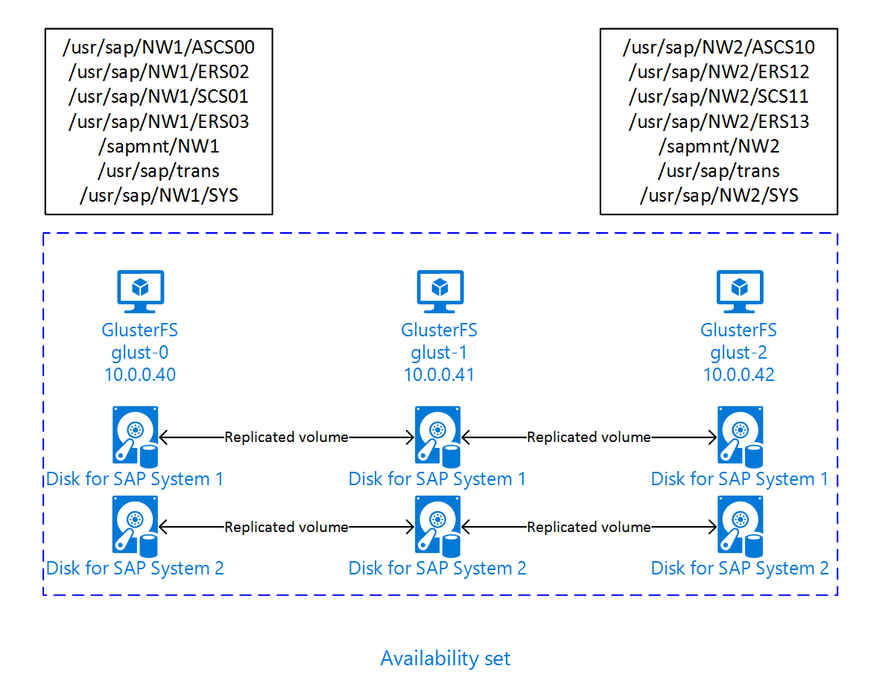

# GlusterFS on Azure VMs on Red Hat Enterprise Linux for SAP NetWeaver

[dbms-guide]:dbms-guide.md
[deployment-guide]:deployment-guide.md
[planning-guide]:planning-guide.md

[2002167]:https://launchpad.support.sap.com/#/notes/2002167
[2009879]:https://launchpad.support.sap.com/#/notes/2009879
[1928533]:https://launchpad.support.sap.com/#/notes/1928533
[2015553]:https://launchpad.support.sap.com/#/notes/2015553
[2178632]:https://launchpad.support.sap.com/#/notes/2178632
[2191498]:https://launchpad.support.sap.com/#/notes/2191498
[2243692]:https://launchpad.support.sap.com/#/notes/2243692
[1999351]:https://launchpad.support.sap.com/#/notes/1999351

[sap-swcenter]:https://support.sap.com/en/my-support/software-downloads.html

[template-file-server]:https://portal.azure.com/#create/Microsoft.Template/uri/https%3A%2F%2Fraw.githubusercontent.com%2FAzure%2Fazure-quickstart-templates%2Fmaster%2Fsap-file-server-md%2Fazuredeploy.json

[sap-hana-ha]:sap-hana-high-availability-rhel.md

This article describes how to deploy the virtual machines, configure the virtual machines, and install a GlusterFS cluster that can be used to store the shared data of a highly available SAP system.
This guide describes how to set up GlusterFS that is used by two SAP systems, NW1 and NW2. The names of the resources (for example virtual machines, virtual networks) in the example assume that you have used the [SAP file server template][template-file-server] with resource prefix **glust**.

Read the following SAP Notes and papers first

* SAP Note [1928533], which has:
  * List of Azure VM sizes that are supported for the deployment of SAP software
  * Important capacity information for Azure VM sizes
  * Supported SAP software, and operating system (OS) and database combinations
  * Required SAP kernel version for Windows and Linux on Microsoft Azure

* SAP Note [2015553] lists prerequisites for SAP-supported SAP software deployments in Azure.
* SAP Note [2002167] has recommended OS settings for Red Hat Enterprise Linux
* SAP Note [2009879] has SAP HANA Guidelines for Red Hat Enterprise Linux
* SAP Note [2178632] has detailed information about all monitoring metrics reported for SAP in Azure.
* SAP Note [2191498] has the required SAP Host Agent version for Linux in Azure.
* SAP Note [2243692] has information about SAP licensing on Linux in Azure.
* SAP Note [1999351] has additional troubleshooting information for the Azure Enhanced Monitoring Extension for SAP.
* [SAP Community WIKI](https://wiki.scn.sap.com/wiki/display/HOME/SAPonLinuxNotes) has all required SAP Notes for Linux.
* [Azure Virtual Machines planning and implementation for SAP on Linux][planning-guide]
* [Azure Virtual Machines deployment for SAP on Linux (this article)][deployment-guide]
* [Azure Virtual Machines DBMS deployment for SAP on Linux][dbms-guide]
* [Product Documentation for Red Hat Gluster Storage](https://access.redhat.com/documentation/red_hat_gluster_storage/)
* General RHEL documentation
  * [High Availability Add-On Overview](https://access.redhat.com/documentation/en-us/red_hat_enterprise_linux/7/html/high_availability_add-on_overview/index)
  * [High Availability Add-On Administration](https://access.redhat.com/documentation/en-us/red_hat_enterprise_linux/7/html/high_availability_add-on_administration/index)
  * [High Availability Add-On Reference](https://access.redhat.com/documentation/en-us/red_hat_enterprise_linux/7/html/high_availability_add-on_reference/index)
* Azure specific RHEL documentation:
  * [Support Policies for RHEL High Availability Clusters - Microsoft Azure Virtual Machines as Cluster Members](https://access.redhat.com/articles/3131341)
  * [Installing and Configuring a Red Hat Enterprise Linux 7.4 (and later) High-Availability Cluster on Microsoft Azure](https://access.redhat.com/articles/3252491)

## Overview

To achieve high availability, SAP NetWeaver requires shared storage. GlusterFS is configured in a separate cluster and can be used by multiple SAP systems.

## Set up GlusterFS

You can either use an Azure Template from github to deploy all required Azure resources, including the virtual machines, availability set and network interfaces or you can deploy the resources manually.

### Deploy Linux via Azure Template

The Azure Marketplace contains an image for Red Hat Enterprise Linux that you can use to deploy new virtual machines.
You can use one of the quickstart templates on github to deploy all required resources. The template deploys the virtual machines, availability set etc.
Follow these steps to deploy the template:

1. Open the [SAP file server template][template-file-server] in the Azure portal
1. Enter the following parameters
   1. Resource Prefix  
      Enter the prefix you want to use. The value is used as a prefix for the resources that are deployed.
   2. SAP System Count
      Enter the number of SAP systems that will use this file server. This will deploy the required number of disks etc.
   3. Os Type  
      Select one of the Linux distributions. For this example, select RHEL 7
   4. Admin Username, Admin Password or SSH key  
      A new user is created that can be used to log on to the machine.
   5. Subnet ID  
      If you want to deploy the VM into an existing VNet where you have a subnet defined the VM should be assigned to, name the ID of that specific subnet. The ID usually looks like /subscriptions/**&lt;subscription ID&gt;**/resourceGroups/**&lt;resource group name&gt;**/providers/Microsoft.Network/virtualNetworks/**&lt;virtual network name&gt;**/subnets/**&lt;subnet name&gt;**

### Deploy Linux manually via Azure portal

You first need to create the virtual machines for this cluster. Afterwards, you create a load balancer and use the virtual machines in the backend pools. We recommend [standard load balancer](https://docs.microsoft.com/azure/load-balancer/load-balancer-standard-overview).  

1. Create a Resource Group
1. Create a Virtual Network
1. Create an Availability Set  
   Set max update domain
1. Create Virtual Machine 1  
   Use at least RHEL 7, in this example the Red Hat Enterprise Linux 7.4 image
   <https://portal.azure.com/#create/RedHat.RedHatEnterpriseLinux74-ARM>  
   Select Availability Set created earlier  
1. Create Virtual Machine 2  
   Use at least RHEL 7, in this example the Red Hat Enterprise Linux 7.4 image
   <https://portal.azure.com/#create/RedHat.RedHatEnterpriseLinux74-ARM>  
   Select Availability Set created earlier  
1. Add one data disk for each SAP system to both virtual machines.

### Configure GlusterFS

The following items are prefixed with either **[A]** - applicable to all nodes, **[1]** - only applicable to node 1, **[2]** - only applicable to node 2, **[3]** - only applicable to node 3.

1. **[A]** Setup host name resolution

   You can either use a DNS server or modify the /etc/hosts on all nodes. This example shows how to use the /etc/hosts file.
   Replace the IP address and the hostname in the following commands

   <pre><code>sudo vi /etc/hosts
   </code></pre>

   Insert the following lines to /etc/hosts. Change the IP address and hostname to match your environment

   <pre><code># IP addresses of the Gluster nodes
   <b>10.0.0.40 glust-0</b>
   <b>10.0.0.41 glust-1</b>
   <b>10.0.0.42 glust-2</b>
   </code></pre>

1. **[A]** Register

   Register your virtual machines and attach it to a pool that contains repositories for RHEL 7 and GlusterFS

   <pre><code>sudo subscription-manager register
   sudo subscription-manager attach --pool=&lt;pool id&gt;
   </code></pre>

1. **[A]** Enable GlusterFS repos

   In order to install the required packages, enable the following repositories.

   <pre><code>sudo subscription-manager repos --disable "*"
   sudo subscription-manager repos --enable=rhel-7-server-rpms
   sudo subscription-manager repos --enable=rh-gluster-3-for-rhel-7-server-rpms
   </code></pre>
  
1. **[A]** Install GlusterFS packages

   Install these packages on all GlusterFS nodes

   <pre><code>sudo yum -y install redhat-storage-server
   </code></pre>

   Reboot the nodes after the installation.

1. **[A]** Modify Firewall

   Add firewall rules to allow client traffic to the GlusterFS nodes.

   <pre><code># list the available zones
   firewall-cmd --get-active-zones
   
   sudo firewall-cmd --zone=public --add-service=glusterfs --permanent
   sudo firewall-cmd --zone=public --add-service=glusterfs
   </code></pre>

1. **[A]** Enable and start GlusterFS service

   Start the GlusterFS service on all nodes.

   <pre><code>sudo systemctl start glusterd
   sudo systemctl enable glusterd
   </code></pre>

1. **[1]** Create GluserFS

   Run the following commands to create the GlusterFS cluster

   <pre><code>sudo gluster peer probe glust-1
   sudo gluster peer probe glust-2
   
   # Check gluster peer status
   sudo gluster peer status
   
   # Number of Peers: 2
   # 
   # Hostname: glust-1
   # Uuid: 10d43840-fee4-4120-bf5a-de9c393964cd
   # State: Accepted peer request (Connected)
   # 
   # Hostname: glust-2
   # Uuid: 9e340385-12fe-495e-ab0f-4f851b588cba
   # State: Accepted peer request (Connected)
   </code></pre>

1. **[2]** Test peer status

   Test the peer status on the second node

   <pre><code>sudo gluster peer status
   # Number of Peers: 2
   #
   # Hostname: glust-0
   # Uuid: 6bc6927b-7ee2-461b-ad04-da123124d6bd
   # State: Peer in Cluster (Connected)
   #
   # Hostname: glust-2
   # Uuid: 9e340385-12fe-495e-ab0f-4f851b588cba
   # State: Peer in Cluster (Connected)
   </code></pre>

1. **[3]** Test peer status

   Test the peer status on the third node

   <pre><code>sudo gluster peer status
   # Number of Peers: 2
   #
   # Hostname: glust-0
   # Uuid: 6bc6927b-7ee2-461b-ad04-da123124d6bd
   # State: Peer in Cluster (Connected)
   #
   # Hostname: glust-1
   # Uuid: 10d43840-fee4-4120-bf5a-de9c393964cd
   # State: Peer in Cluster (Connected)
   </code></pre>

1. **[A]** Create LVM

   In this example, the GlusterFS is used for two SAP systems, NW1 and NW2. Use the following commands to create LVM configurations for these SAP systems.

   Use these commands for NW1

   <pre><code>sudo pvcreate --dataalignment 1024K /dev/disk/azure/scsi1/lun0
   sudo pvscan
   sudo vgcreate --physicalextentsize 256K rhgs-<b>NW1</b> /dev/disk/azure/scsi1/lun0
   sudo vgscan
   sudo lvcreate -l 50%FREE -n rhgs-<b>NW1</b>/sapmnt
   sudo lvcreate -l 20%FREE -n rhgs-<b>NW1</b>/trans
   sudo lvcreate -l 10%FREE -n rhgs-<b>NW1</b>/sys
   sudo lvcreate -l 50%FREE -n rhgs-<b>NW1</b>/ascs
   sudo lvcreate -l 100%FREE -n rhgs-<b>NW1</b>/aers
   sudo lvscan
   
   sudo mkfs.xfs -f -K -i size=512 -n size=8192 /dev/rhgs-<b>NW1</b>/sapmnt
   sudo mkfs.xfs -f -K -i size=512 -n size=8192 /dev/rhgs-<b>NW1</b>/trans
   sudo mkfs.xfs -f -K -i size=512 -n size=8192 /dev/rhgs-<b>NW1</b>/sys
   sudo mkfs.xfs -f -K -i size=512 -n size=8192 /dev/rhgs-<b>NW1</b>/ascs
   sudo mkfs.xfs -f -K -i size=512 -n size=8192 /dev/rhgs-<b>NW1</b>/aers
   
   sudo mkdir -p /rhs/<b>NW1</b>/sapmnt
   sudo mkdir -p /rhs/<b>NW1</b>/trans
   sudo mkdir -p /rhs/<b>NW1</b>/sys
   sudo mkdir -p /rhs/<b>NW1</b>/ascs
   sudo mkdir -p /rhs/<b>NW1</b>/aers
   
   sudo chattr +i /rhs/<b>NW1</b>/sapmnt
   sudo chattr +i /rhs/<b>NW1</b>/trans
   sudo chattr +i /rhs/<b>NW1</b>/sys
   sudo chattr +i /rhs/<b>NW1</b>/ascs
   sudo chattr +i /rhs/<b>NW1</b>/aers

   echo -e "/dev/rhgs-<b>NW1</b>/sapmnt\t/rhs/<b>NW1</b>/sapmnt\txfs\tdefaults,inode64,nobarrier,noatime,nouuid 0 2" | sudo tee -a /etc/fstab
   echo -e "/dev/rhgs-<b>NW1</b>/trans\t/rhs/<b>NW1</b>/trans\txfs\tdefaults,inode64,nobarrier,noatime,nouuid 0 2" | sudo tee -a /etc/fstab
   echo -e "/dev/rhgs-<b>NW1</b>/sys\t/rhs/<b>NW1</b>/sys\txfs\tdefaults,inode64,nobarrier,noatime,nouuid 0 2" | sudo tee -a /etc/fstab
   echo -e "/dev/rhgs-<b>NW1</b>/ascs\t/rhs/<b>NW1</b>/ascs\txfs\tdefaults,inode64,nobarrier,noatime,nouuid 0 2" | sudo tee -a /etc/fstab
   echo -e "/dev/rhgs-<b>NW1</b>/aers\t/rhs/<b>NW1</b>/aers\txfs\tdefaults,inode64,nobarrier,noatime,nouuid 0 2" | sudo tee -a /etc/fstab
   sudo mount -a
   </code></pre>

   Use these commands for NW2

   <pre><code>sudo pvcreate --dataalignment 1024K /dev/disk/azure/scsi1/lun1
   sudo pvscan
   sudo vgcreate --physicalextentsize 256K rhgs-<b>NW2</b> /dev/disk/azure/scsi1/lun1
   sudo vgscan
   sudo lvcreate -l 50%FREE -n rhgs-<b>NW2</b>/sapmnt
   sudo lvcreate -l 20%FREE -n rhgs-<b>NW2</b>/trans
   sudo lvcreate -l 10%FREE -n rhgs-<b>NW2</b>/sys
   sudo lvcreate -l 50%FREE -n rhgs-<b>NW2</b>/ascs
   sudo lvcreate -l 100%FREE -n rhgs-<b>NW2</b>/aers
   
   sudo mkfs.xfs -f -K -i size=512 -n size=8192 /dev/rhgs-<b>NW2</b>/sapmnt
   sudo mkfs.xfs -f -K -i size=512 -n size=8192 /dev/rhgs-<b>NW2</b>/trans
   sudo mkfs.xfs -f -K -i size=512 -n size=8192 /dev/rhgs-<b>NW2</b>/sys
   sudo mkfs.xfs -f -K -i size=512 -n size=8192 /dev/rhgs-<b>NW2</b>/ascs
   sudo mkfs.xfs -f -K -i size=512 -n size=8192 /dev/rhgs-<b>NW2</b>/aers
   
   sudo mkdir -p /rhs/<b>NW2</b>/sapmnt
   sudo mkdir -p /rhs/<b>NW2</b>/trans
   sudo mkdir -p /rhs/<b>NW2</b>/sys
   sudo mkdir -p /rhs/<b>NW2</b>/ascs
   sudo mkdir -p /rhs/<b>NW2</b>/aers
   
   sudo chattr +i /rhs/<b>NW2</b>/sapmnt
   sudo chattr +i /rhs/<b>NW2</b>/trans
   sudo chattr +i /rhs/<b>NW2</b>/sys
   sudo chattr +i /rhs/<b>NW2</b>/ascs
   sudo chattr +i /rhs/<b>NW2</b>/aers
   sudo lvscan
   
   echo -e "/dev/rhgs-<b>NW2</b>/sapmnt\t/rhs/<b>NW2</b>/sapmnt\txfs\tdefaults,inode64,nobarrier,noatime,nouuid 0 2" | sudo tee -a /etc/fstab
   echo -e "/dev/rhgs-<b>NW2</b>/trans\t/rhs/<b>NW2</b>/trans\txfs\tdefaults,inode64,nobarrier,noatime,nouuid 0 2" | sudo tee -a /etc/fstab
   echo -e "/dev/rhgs-<b>NW2</b>/sys\t/rhs/<b>NW2</b>/sys\txfs\tdefaults,inode64,nobarrier,noatime,nouuid 0 2" | sudo tee -a /etc/fstab
   echo -e "/dev/rhgs-<b>NW2</b>/ascs\t/rhs/<b>NW2</b>/ascs\txfs\tdefaults,inode64,nobarrier,noatime,nouuid 0 2" | sudo tee -a /etc/fstab
   echo -e "/dev/rhgs-<b>NW2</b>/aers\t/rhs/<b>NW2</b>/aers\txfs\tdefaults,inode64,nobarrier,noatime,nouuid 0 2" | sudo tee -a /etc/fstab
   sudo mount -a
   </code></pre>

1. **[1]** Create the distributed volume

   Use the following commands to create the GlusterFS volume for NW1 and start it.

   <pre><code>sudo gluster vol create <b>NW1</b>-sapmnt replica 3 glust-0:/rhs/<b>NW1</b>/sapmnt glust-1:/rhs/<b>NW1</b>/sapmnt glust-2:/rhs/<b>NW1</b>/sapmnt force
   sudo gluster vol create <b>NW1</b>-trans replica 3 glust-0:/rhs/<b>NW1</b>/trans glust-1:/rhs/<b>NW1</b>/trans glust-2:/rhs/<b>NW1</b>/trans force
   sudo gluster vol create <b>NW1</b>-sys replica 3 glust-0:/rhs/<b>NW1</b>/sys glust-1:/rhs/<b>NW1</b>/sys glust-2:/rhs/<b>NW1</b>/sys force
   sudo gluster vol create <b>NW1</b>-ascs replica 3 glust-0:/rhs/<b>NW1</b>/ascs glust-1:/rhs/<b>NW1</b>/ascs glust-2:/rhs/<b>NW1</b>/ascs force
   sudo gluster vol create <b>NW1</b>-aers replica 3 glust-0:/rhs/<b>NW1</b>/aers glust-1:/rhs/<b>NW1</b>/aers glust-2:/rhs/<b>NW1</b>/aers force
   
   sudo gluster volume start <b>NW1</b>-sapmnt
   sudo gluster volume start <b>NW1</b>-trans
   sudo gluster volume start <b>NW1</b>-sys
   sudo gluster volume start <b>NW1</b>-ascs
   sudo gluster volume start <b>NW1</b>-aers
   </code></pre>

   Use the following commands to create the GlusterFS volume for NW2 and start it.

   <pre><code>sudo gluster vol create <b>NW2</b>-sapmnt replica 3 glust-0:/rhs/<b>NW2</b>/sapmnt glust-1:/rhs/<b>NW2</b>/sapmnt glust-2:/rhs/<b>NW2</b>/sapmnt force
   sudo gluster vol create <b>NW2</b>-trans replica 3 glust-0:/rhs/<b>NW2</b>/trans glust-1:/rhs/<b>NW2</b>/trans glust-2:/rhs/<b>NW2</b>/trans force
   sudo gluster vol create <b>NW2</b>-sys replica 3 glust-0:/rhs/<b>NW2</b>/sys glust-1:/rhs/<b>NW2</b>/sys glust-2:/rhs/<b>NW2</b>/sys force
   sudo gluster vol create <b>NW2</b>-ascs replica 3 glust-0:/rhs/<b>NW2</b>/ascs glust-1:/rhs/<b>NW2</b>/ascs glust-2:/rhs/<b>NW2</b>/ascs force
   sudo gluster vol create <b>NW2</b>-aers replica 3 glust-0:/rhs/<b>NW2</b>/aers glust-1:/rhs/<b>NW2</b>/aers glust-2:/rhs/<b>NW2</b>/aers force
   
   sudo gluster volume start <b>NW2</b>-sapmnt
   sudo gluster volume start <b>NW2</b>-trans
   sudo gluster volume start <b>NW2</b>-sys
   sudo gluster volume start <b>NW2</b>-ascs
   sudo gluster volume start <b>NW2</b>-aers
   </code></pre>

## Next steps

* [Install the SAP ASCS and database](high-availability-guide-rhel.md)
* [Azure Virtual Machines planning and implementation for SAP][planning-guide]
* [Azure Virtual Machines deployment for SAP][deployment-guide]
* [Azure Virtual Machines DBMS deployment for SAP][dbms-guide]
* To learn how to establish high availability and plan for disaster recovery of SAP HANA on Azure (large instances), see [SAP HANA (large instances) high availability and disaster recovery on Azure](hana-overview-high-availability-disaster-recovery.md).
* To learn how to establish high availability and plan for disaster recovery of SAP HANA on Azure VMs, see [High Availability of SAP HANA on Azure Virtual Machines (VMs)][sap-hana-ha]
