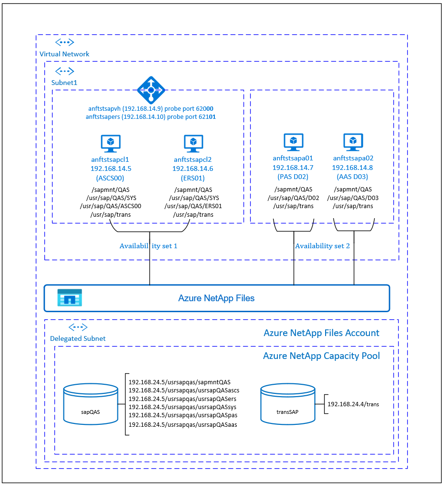

# Azure Virtual Machines high availability for SAP NetWeaver on Red Hat Enterprise Linux with Azure NetApp Files for SAP applications

[dbms-guide]:dbms-guide.md
[deployment-guide]:deployment-guide.md
[planning-guide]:planning-guide.md

[anf-azure-doc]:https://docs.microsoft.com/azure/azure-netapp-files/
[anf-avail-matrix]:https://azure.microsoft.com/global-infrastructure/services/?products=storage&regions=all
[anf-register]:https://docs.microsoft.com/azure/azure-netapp-files/azure-netapp-files-register
[anf-sap-applications-azure]:https://www.netapp.com/us/media/tr-4746.pdf

[2002167]:https://launchpad.support.sap.com/#/notes/2002167
[2009879]:https://launchpad.support.sap.com/#/notes/2009879
[1928533]:https://launchpad.support.sap.com/#/notes/1928533
[2015553]:https://launchpad.support.sap.com/#/notes/2015553
[2178632]:https://launchpad.support.sap.com/#/notes/2178632
[2191498]:https://launchpad.support.sap.com/#/notes/2191498
[2243692]:https://launchpad.support.sap.com/#/notes/2243692
[1999351]:https://launchpad.support.sap.com/#/notes/1999351
[1410736]:https://launchpad.support.sap.com/#/notes/1410736

[sap-swcenter]:https://support.sap.com/en/my-support/software-downloads.html

[template-multisid-xscs]:https://portal.azure.com/#create/Microsoft.Template/uri/https%3A%2F%2Fraw.githubusercontent.com%2FAzure%2Fazure-quickstart-templates%2Fmaster%2Fsap-3-tier-marketplace-image-multi-sid-xscs-md%2Fazuredeploy.json

[sap-hana-ha]:sap-hana-high-availability-rhel.md
[glusterfs-ha]:high-availability-guide-rhel-glusterfs.md

This article describes how to deploy the virtual machines, configure the virtual machines, install the cluster framework, and install a highly available SAP NetWeaver 7.50 system, using [Azure NetApp Files](https://docs.microsoft.com/azure/azure-netapp-files/azure-netapp-files-introduction/).
In the example configurations, installation commands etc. ASCS instance is number 00, the ERS instance is number 01, Primary Application instance (PAS) is 02 and the Application instance (AAS) is 03. SAP System ID QAS is used. 

The database layer isn't covered in detail in this article.  

Read the following SAP Notes and papers first:

* [Azure NetApp Files documentation][anf-azure-doc] 
* SAP Note [1928533], which has:
  * List of Azure VM sizes that are supported for the deployment of SAP software
  * Important capacity information for Azure VM sizes
  * Supported SAP software, and operating system (OS) and database combinations
  * Required SAP kernel version for Windows and Linux on Microsoft Azure

* SAP Note [2015553] lists prerequisites for SAP-supported SAP software deployments in Azure.
* SAP Note [2002167] has recommended OS settings for Red Hat Enterprise Linux
* SAP Note [2009879] has SAP HANA Guidelines for Red Hat Enterprise Linux
* SAP Note [2178632] has detailed information about all monitoring metrics reported for SAP in Azure.
* SAP Note [2191498] has the required SAP Host Agent version for Linux in Azure.
* SAP Note [2243692] has information about SAP licensing on Linux in Azure.
* SAP Note [1999351] has additional troubleshooting information for the Azure Enhanced Monitoring Extension for SAP.
* [SAP Community WIKI](https://wiki.scn.sap.com/wiki/display/HOME/SAPonLinuxNotes) has all required SAP Notes for Linux.
* [Azure Virtual Machines planning and implementation for SAP on Linux][planning-guide]
* [Azure Virtual Machines deployment for SAP on Linux][deployment-guide]
* [Azure Virtual Machines DBMS deployment for SAP on Linux][dbms-guide]
* [SAP Netweaver in pacemaker cluster](https://access.redhat.com/articles/3150081)
* General RHEL documentation
  * [High Availability Add-On Overview](https://access.redhat.com/documentation/en-us/red_hat_enterprise_linux/7/html/high_availability_add-on_overview/index)
  * [High Availability Add-On Administration](https://access.redhat.com/documentation/en-us/red_hat_enterprise_linux/7/html/high_availability_add-on_administration/index)
  * [High Availability Add-On Reference](https://access.redhat.com/documentation/en-us/red_hat_enterprise_linux/7/html/high_availability_add-on_reference/index)
  * [Configuring ASCS/ERS for SAP Netweaver with standalone resources in RHEL 7.5](https://access.redhat.com/articles/3569681)
  * [Configure SAP S/4HANA ASCS/ERS with Standalone Enqueue Server 2 (ENSA2) in Pacemaker on RHEL
](https://access.redhat.com/articles/3974941)
* Azure-specific RHEL documentation:
  * [Support Policies for RHEL High Availability Clusters - Microsoft Azure Virtual Machines as Cluster Members](https://access.redhat.com/articles/3131341)
  * [Installing and Configuring a Red Hat Enterprise Linux 7.4 (and later) High-Availability Cluster on Microsoft Azure](https://access.redhat.com/articles/3252491)
* [NetApp SAP Applications on Microsoft Azure using Azure NetApp Files][anf-sap-applications-azure]

## Overview

High availability(HA) for SAP Netweaver central services requires shared storage.
To achieve that on Red Hat Linux so far it was necessary to build separate highly available GlusterFS cluster. 

Now it is possible to achieve SAP Netweaver HA by using shared storage, deployed on Azure NetApp Files. Using Azure NetApp Files for the shared storage eliminates the need for additional [GlusterFS cluster](https://docs.microsoft.com/azure/virtual-machines/workloads/sap/high-availability-guide-rhel-glusterfs). Pacemaker is still needed for HA of the SAP Netweaver central services(ASCS/SCS).



SAP NetWeaver ASCS, SAP NetWeaver SCS, SAP NetWeaver ERS, and the SAP HANA database use virtual hostname and virtual IP addresses. On Azure, a load balancer is required to use a virtual IP address. We recommend using [Standard load balancer](https://docs.microsoft.com/azure/load-balancer/quickstart-load-balancer-standard-public-portal). The following list shows the configuration of the load balancer with separate front-end IPs for (A)SCS and ERS.

### (A)SCS

* Frontend configuration
  * IP address 192.168.14.9
* Probe Port
  * Port 620<strong>&lt;nr&gt;</strong>
* Load-balancing rules
  * If using Standard Load Balancer, select **HA ports**
  * 32<strong>&lt;nr&gt;</strong> TCP
  * 36<strong>&lt;nr&gt;</strong> TCP
  * 39<strong>&lt;nr&gt;</strong> TCP
  * 81<strong>&lt;nr&gt;</strong> TCP
  * 5<strong>&lt;nr&gt;</strong>13 TCP
  * 5<strong>&lt;nr&gt;</strong>14 TCP
  * 5<strong>&lt;nr&gt;</strong>16 TCP

### ERS

* Frontend configuration
  * IP address 192.168.14.10
* Probe Port
  * Port 621<strong>&lt;nr&gt;</strong>
* Load-balancing rules
  * If using Standard Load Balancer, select **HA ports**
  * 32<strong>&lt;nr&gt;</strong> TCP
  * 33<strong>&lt;nr&gt;</strong> TCP
  * 5<strong>&lt;nr&gt;</strong>13 TCP
  * 5<strong>&lt;nr&gt;</strong>14 TCP
  * 5<strong>&lt;nr&gt;</strong>16 TCP

* Backend configuration
  * Connected to primary network interfaces of all virtual machines that should be part of the (A)SCS/ERS cluster

## Setting up the Azure NetApp Files infrastructure 

SAP NetWeaver requires shared storage for the transport and profile directory.  Before proceeding with the setup for Azure NetApp files infrastructure, familiarize yourself with the [Azure NetApp Files documentation][anf-azure-doc]. 
Check if your selected Azure region offers Azure NetApp Files. The following link shows the availability of Azure NetApp Files by Azure region: [Azure NetApp Files Availability by Azure Region][anf-avail-matrix].

Azure NetApp files are available in several [Azure regions](https://azure.microsoft.com/global-infrastructure/services/?products=netapp). Before deploying Azure NetApp Files, request onboarding to Azure NetApp Files, following the [Register for Azure NetApp files instructions][anf-register]. 

### Deploy Azure NetApp Files resources  

The steps assume that you have already deployed [Azure Virtual Network](https://docs.microsoft.com/azure/virtual-network/virtual-networks-overview). The Azure NetApp Files resources and the VMs, where the Azure NetApp Files resources will be mounted must be deployed in the same Azure Virtual Network or in peered Azure Virtual Networks.  

1. If you haven't done that already, request [onboarding to Azure NetApp Files](https://docs.microsoft.com/azure/azure-netapp-files/azure-netapp-files-register).  
2. Create the NetApp account in the selected Azure region, following the [instructions to create NetApp Account](https://docs.microsoft.com/azure/azure-netapp-files/azure-netapp-files-create-netapp-account).  
3. Set up Azure NetApp Files capacity pool, following the [instructions on how to set up Azure NetApp Files capacity pool](https://docs.microsoft.com/azure/azure-netapp-files/azure-netapp-files-set-up-capacity-pool).  
The SAP Netweaver architecture presented in this article uses single Azure NetApp Files capacity pool, Premium SKU. We recommend Azure NetApp Files Premium SKU for SAP Netweaver application workload on Azure.  
4. Delegate a subnet to Azure NetApp files as described in the [instructions Delegate a subnet to Azure NetApp Files](https://docs.microsoft.com/azure/azure-netapp-files/azure-netapp-files-delegate-subnet).  

5. Deploy Azure NetApp Files volumes, following the [instructions to create a volume for Azure NetApp Files](https://docs.microsoft.com/azure/azure-netapp-files/azure-netapp-files-create-volumes). Deploy the volumes in the designated Azure NetApp Files [subnet](https://docs.microsoft.com/rest/api/virtualnetwork/subnets). The IP addresses of the Azure NetApp volumes are assigned automatically. Keep in mind that the Azure NetApp Files resources and the Azure VMs must be in the same Azure Virtual Network or in peered Azure Virtual Networks. In this example we use two Azure NetApp Files volumes: sap<b>QAS</b> and transSAP. The file paths that are mounted to the corresponding mount points are /usrsap<b>qas</b>/sapmnt<b>QAS</b>, /usrsap<b>qas</b>/usrsap<b>QAS</b>sys, etc.  

   1. volume sap<b>QAS</b> (nfs://192.168.24.5/usrsap<b>qas</b>/sapmnt<b>QAS</b>)
   2. volume sap<b>QAS</b> (nfs://192.168.24.5/usrsap<b>qas</b>/usrsap<b>QAS</b>ascs)
   3. volume sap<b>QAS</b> (nfs://192.168.24.5/usrsap<b>qas</b>/usrsap<b>QAS</b>sys)
   4. volume sap<b>QAS</b> (nfs://192.168.24.5/usrsap<b>qas</b>/usrsap<b>QAS</b>ers)
   5. volume transSAP (nfs://192.168.24.4/transSAP)
   6. volume sap<b>QAS</b> (nfs://192.168.24.5/usrsap<b>qas</b>/usrsap<b>QAS</b>pas)
   7. volume sap<b>QAS</b> (nfs://192.168.24.5/usrsap<b>qas</b>/usrsap<b>QAS</b>aas)
  
In this example, we used Azure NetApp Files for all SAP Netweaver file systems to demonstrate how Azure NetApp Files can be used. The SAP file systems that don't need to be mounted via NFS can also be deployed as [Azure disk storage](https://docs.microsoft.com/azure/virtual-machines/windows/disks-types#premium-ssd) . In this example <b>a-e</b> must be on Azure NetApp Files and <b>f-g</b> (that is, /usr/sap/<b>QAS</b>/D<b>02</b>, /usr/sap/<b>QAS</b>/D<b>03</b>) could be deployed as Azure disk storage. 

### Important considerations

When considering Azure NetApp Files for the SAP Netweaver on SUSE High Availability architecture, be aware of the following important considerations:

- The minimum capacity pool is 4 TiB. The capacity pool size can be increased in 1 TiB increments.
- The minimum volume is 100 GiB
- Azure NetApp Files and all virtual machines, where Azure NetApp Files volumes will be mounted, must be in the same Azure Virtual Network or in [peered virtual networks](https://docs.microsoft.com/azure/virtual-network/virtual-network-peering-overview) in the same region. Azure NetApp Files access over VNET peering in the same region is supported now. Azure NetApp access over global peering is not yet supported.
- The selected virtual network must have a subnet, delegated to Azure NetApp Files.
- Azure NetApp Files offers [export policy](https://docs.microsoft.com/azure/azure-netapp-files/azure-netapp-files-configure-export-policy): you can control the allowed clients, the access type (Read&Write, Read Only, etc.). 
- Azure NetApp Files feature isn't zone aware yet. Currently Azure NetApp Files feature isn't deployed in all Availability zones in an Azure region. Be aware of the potential latency implications in some Azure regions. 
- Azure NetApp Files volumes can be deployed as NFSv3 or NFSv4.1 volumes. Both protocols are supported for the SAP application layer (ASCS/ERS, SAP application servers). 

## Setting up (A)SCS

In this example, the resources were deployed manually via the [Azure portal](https://portal.azure.com/#home).

### Deploy Linux manually via Azure portal

First you need to create the Azure NetApp Files volumes. Deploy the VMs. Afterwards, you create a load balancer and use the virtual machines in the backend pool.

1. Create load balancer (internal, standard):  
   1. Create the frontend IP addresses
      1. IP address 192.168.14.9 for the ASCS
         1. Open the load balancer, select frontend IP pool, and click Add
         1. Enter the name of the new frontend IP pool (for example **frontend.QAS.ASCS**)
         1. Set the Assignment to Static and enter the IP address (for example **192.168.14.9**)
         1. Click OK
      1. IP address 192.168.14.10 for the ASCS ERS
         * Repeat the steps above under "a" to create an IP address for the ERS (for example **192.168.14.10** and **frontend.QAS.ERS**)
   1. Create the backend pool
      1. Open the load balancer, select backend pools, and click Add
      1. Enter the name of the new backend pool (for example **backend.QAS**)
      1. Click Add a virtual machine.
      1. Select Virtual machine. 
      1. Select the virtual machines of the (A)SCS cluster and their IP addresses.
      1. Click Add
   1. Create the health probes
      1. Port 620**00** for ASCS
         1. Open the load balancer, select health probes, and click Add
         1. Enter the name of the new health probe (for example **health.QAS.ASCS**)
         1. Select TCP as protocol, port 620**00**, keep Interval 5 and Unhealthy threshold 2
         1. Click OK
      1. Port 621**01** for ASCS ERS
            * Repeat the steps above under "c" to create a health probe for the ERS (for example 621**01** and **health.QAS.ERS**)
   1. Load-balancing rules
      1. Load-balancing rules for ASCS
         1. Open the load balancer, select Load-balancing rules, and click Add
         1. Enter the name of the new load balancer rule (for example **lb.QAS.ASCS**)
         1. Select the frontend IP address for ASCS, backend pool, and health probe you created earlier (for example **frontend.QAS.ASCS**, **backend.QAS** and **health.QAS.ASCS**)
         1. Select **HA ports**
         1. Increase idle timeout to 30 minutes
         1. **Make sure to enable Floating IP**
         1. Click OK
         * Repeat the steps above to create load balancing rules for ERS (for example **lb.QAS.ERS**)
1. Alternatively, if your scenario requires basic load balancer (internal), follow these steps:  
   1. Create the frontend IP addresses
      1. IP address 192.168.14.9 for the ASCS
         1. Open the load balancer, select frontend IP pool, and click Add
         1. Enter the name of the new frontend IP pool (for example **frontend.QAS.ASCS**)
         1. Set the Assignment to Static and enter the IP address (for example **192.168.14.9**)
         1. Click OK
      1. IP address 192.168.14.10 for the ASCS ERS
         * Repeat the steps above under "a" to create an IP address for the ERS (for example **192.168.14.10** and **frontend.QAS.ERS**)
   1. Create the backend pool
      1. Open the load balancer, select backend pools, and click Add
      1. Enter the name of the new backend pool (for example **backend.QAS**)
      1. Click Add a virtual machine.
      1. Select the Availability Set you created earlier for ASCS 
      1. Select the virtual machines of the (A)SCS cluster
      1. Click OK
   1. Create the health probes
      1. Port 620**00** for ASCS
         1. Open the load balancer, select health probes, and click Add
         1. Enter the name of the new health probe (for example **health.QAS.ASCS**)
         1. Select TCP as protocol, port 620**00**, keep Interval 5 and Unhealthy threshold 2
         1. Click OK
      1. Port 621**01** for ASCS ERS
            * Repeat the steps above under "c" to create a health probe for the ERS (for example 621**01** and **health.QAS.ERS**)
   1. Load-balancing rules
      1. 32**00** TCP for ASCS
         1. Open the load balancer, select Load-balancing rules, and click Add
         1. Enter the name of the new load balancer rule (for example **lb.QAS.ASCS.3200**)
         1. Select the frontend IP address for ASCS, backend pool, and health probe you created earlier (for example **frontend.QAS.ASCS**)
         1. Keep protocol **TCP**, enter port **3200**
         1. Increase idle timeout to 30 minutes
         1. **Make sure to enable Floating IP**
         1. Click OK
      1. Additional ports for the ASCS
         * Repeat the steps above under "d" for ports 36**00**, 39**00**, 81**00**, 5**00**13, 5**00**14, 5**00**16 and TCP for the ASCS
      1. Additional ports for the ASCS ERS
         * Repeat the steps above under "d" for ports 32**01**, 33**01**, 5**01**13, 5**01**14, 5**01**16 and TCP for the ASCS ERS

      > [!Note]
      > When VMs without public IP addresses are placed in the backend pool of internal (no public IP address) Standard Azure load balancer, there will be no outbound internet connectivity, unless additional configuration is performed to allow routing to public end points. For details on how to achieve outbound connectivity see [Public endpoint connectivity for Virtual Machines using Azure Standard Load Balancer in SAP high-availability scenarios](https://docs.microsoft.com/azure/virtual-machines/workloads/sap/high-availability-guide-standard-load-balancer-outbound-connections).  

      > [!IMPORTANT]
      > Do not enable TCP timestamps on Azure VMs placed behind Azure Load Balancer. Enabling TCP timestamps will cause the health probes to fail. Set parameter **net.ipv4.tcp_timestamps** to **0**. For details see [Load Balancer health probes](https://docs.microsoft.com/azure/load-balancer/load-balancer-custom-probe-overview).

## Disable ID mapping (if using NFSv4.1)

The instructions in this section are only applicable, if using Azure NetApp Files volumes with NFSv4.1 protocol. Perform the configuration on all VMs, where Azure NetApp Files NFSv4.1 volumes will be mounted.  

1. Verify the NFS domain setting. Make sure that the domain is configured as the default Azure NetApp Files domain, i.e. **`defaultv4iddomain.com`** and the mapping is set to **nobody**.  

    > [!IMPORTANT]
    > Make sure to set the NFS domain in `/etc/idmapd.conf` on the VM to match the default domain configuration on Azure NetApp Files: **`defaultv4iddomain.com`**. If there's a mismatch between the domain configuration on the NFS client (i.e. the VM) and the NFS server, i.e. the Azure NetApp configuration, then the permissions for files on Azure NetApp volumes that are mounted on the VMs will be displayed as `nobody`.  

    <pre><code>
    sudo cat /etc/idmapd.conf
    # Example
    [General]
    Domain = <b>defaultv4iddomain.com</b>
    [Mapping]
    Nobody-User = <b>nobody</b>
    Nobody-Group = <b>nobody</b>
    </code></pre>

4. **[A]** Verify `nfs4_disable_idmapping`. It should be set to **Y**. To create the directory structure where `nfs4_disable_idmapping` is located, execute the mount command. You won't be able to manually create the directory under /sys/modules, because access is reserved for the kernel / drivers.  

    <pre><code>
    # Check nfs4_disable_idmapping 
    cat /sys/module/nfs/parameters/nfs4_disable_idmapping
    # If you need to set nfs4_disable_idmapping to Y
    mkdir /mnt/tmp
    mount 192.168.24.5:/sap<b>QAS</b>
    umount  /mnt/tmp
    echo "Y" > /sys/module/nfs/parameters/nfs4_disable_idmapping
    # Make the configuration permanent
    echo "options nfs nfs4_disable_idmapping=Y" >> /etc/modprobe.d/nfs.conf
    </code></pre>

   For more details on how to change `nfs4_disable_idmapping` parameter see https://access.redhat.com/solutions/1749883.

### Create Pacemaker cluster

Follow the steps in [Setting up Pacemaker on Red Hat Enterprise Linux in Azure](high-availability-guide-rhel-pacemaker.md) to create a basic Pacemaker cluster for this (A)SCS server.

### Prepare for SAP NetWeaver installation

The following items are prefixed with either **[A]** - applicable to all nodes, **[1]** - only applicable to node 1 or **[2]** - only applicable to node 2.

1. **[A]** Setup host name resolution

   You can either use a DNS server or modify the /etc/hosts on all nodes. This example shows how to use the /etc/hosts file.
   Replace the IP address and the hostname in the following commands

    ```
    sudo vi /etc/hosts
    ```

   Insert the following lines to /etc/hosts. Change the IP address and hostname to match your environment

    ```
    # IP address of cluster node 1
    192.168.14.5    anftstsapcl1
    # IP address of cluster node 2
    192.168.14.6     anftstsapcl2
    # IP address of the load balancer frontend configuration for SAP Netweaver ASCS
    192.168.14.9    anftstsapvh
    # IP address of the load balancer frontend configuration for SAP Netweaver ERS
    192.168.14.10    anftstsapers
    ```

1. **[1]** Create SAP directories in the Azure NetApp Files volume.  
   Mount temporarily the Azure NetApp Files volume on one of the VMs and create the SAP directories(file paths).  

    ```
     # mount temporarily the volume
     sudo mkdir -p /saptmp
     # If using NFSv3
     sudo mount -t nfs -o rw,hard,rsize=65536,wsize=65536,vers=3,tcp 192.168.24.5:/sapQAS /saptmp
     # If using NFSv4.1
     sudo mount -t nfs -o rw,hard,rsize=65536,wsize=65536,vers=4.1,sec=sys,tcp 192.168.24.5:/sapQAS /saptmp
     # create the SAP directories
     sudo cd /saptmp
     sudo mkdir -p sapmntQAS
     sudo mkdir -p usrsapQASascs
     sudo mkdir -p usrsapQASers
     sudo mkdir -p usrsapQASsys
     sudo mkdir -p usrsapQASpas
     sudo mkdir -p usrsapQASaas
     # unmount the volume and delete the temporary directory
     sudo cd ..
     sudo umount /saptmp
     sudo rmdir /saptmp
    ``` 

1. **[A]** Create the shared directories

   ```
   sudo mkdir -p /sapmnt/QAS
   sudo mkdir -p /usr/sap/trans
   sudo mkdir -p /usr/sap/QAS/SYS
   sudo mkdir -p /usr/sap/QAS/ASCS00
   sudo mkdir -p /usr/sap/QAS/ERS01
   
   sudo chattr +i /sapmnt/QAS
   sudo chattr +i /usr/sap/trans
   sudo chattr +i /usr/sap/QAS/SYS
   sudo chattr +i /usr/sap/QAS/ASCS00
   sudo chattr +i /usr/sap/QAS/ERS01
   ```

1. **[A]** Install NFS client and other requirements

   ```
   sudo yum -y install nfs-utils resource-agents resource-agents-sap
   ```

1. **[A]** Check version of resource-agents-sap

   Make sure that the version of the installed resource-agents-sap package is at least 3.9.5-124.el7
   ```
   sudo yum info resource-agents-sap
   
   # Loaded plugins: langpacks, product-id, search-disabled-repos
   # Repodata is over 2 weeks old. Install yum-cron? Or run: yum makecache fast
   # Installed Packages
   # Name        : resource-agents-sap
   # Arch        : x86_64
   # Version     : 3.9.5
   # Release     : 124.el7
   # Size        : 100 k
   # Repo        : installed
   # From repo   : rhel-sap-for-rhel-7-server-rpms
   # Summary     : SAP cluster resource agents and connector script
   # URL         : https://github.com/ClusterLabs/resource-agents
   # License     : GPLv2+
   # Description : The SAP resource agents and connector script interface with
   #          : Pacemaker to allow SAP instances to be managed in a cluster
   #          : environment.
   ```


1. **[A]** Add mount entries

   If using NFSv3:
   ```
   sudo vi /etc/fstab
   
   # Add the following lines to fstab, save and exit
    192.168.24.5:/sapQAS/sapmntQAS /sapmnt/QAS nfs rw,hard,rsize=65536,wsize=65536,vers=3
    192.168.24.5:/sapQAS/usrsapQASsys /usr/sap/QAS/SYS nfs rw,hard,rsize=65536,wsize=65536,vers=3
    192.168.24.4:/transSAP /usr/sap/trans nfs rw,hard,rsize=65536,wsize=65536,vers=3
   ```

   If using NFSv4.1:
   ```
   sudo vi /etc/fstab
   
   # Add the following lines to fstab, save and exit
    192.168.24.5:/sapQAS/sapmntQAS /sapmnt/QAS nfs rw,hard,rsize=65536,wsize=65536,vers=4.1,sec=sys
    192.168.24.5:/sapQAS/usrsapQASsys /usr/sap/QAS/SYS nfs rw,hard,rsize=65536,wsize=65536,vers=4.1,sec=sys
    192.168.24.4:/transSAP /usr/sap/trans nfs rw,hard,rsize=65536,wsize=65536,vers=4.1,sec=sys
   ```

   > [!NOTE]
   > Make sure to match the NFS protocol version of the Azure NetApp Files volumes, when mounting the volumes. If the Azure NetApp Files volumes are created as NFSv3 volumes, use the corresponding NFSv3 configuration. If the Azure NetApp Files volumes are created as NFSv4.1 volumes, follow the instructions to disable ID mapping and make sure to use the corresponding NFSv4.1 configuration. In this example the Azure NetApp Files volumes were created as NFSv3 volumes.  

   Mount the new shares

   ```
   sudo mount -a  
   ```

1. **[A]** Configure SWAP file

   ```
   sudo vi /etc/waagent.conf
   
   # Set the property ResourceDisk.EnableSwap to y
   # Create and use swapfile on resource disk.
   ResourceDisk.EnableSwap=y
   
   # Set the size of the SWAP file with property ResourceDisk.SwapSizeMB
   # The free space of resource disk varies by virtual machine size. Make sure that you do not set a value that is too big. You can check the SWAP space with command swapon
   # Size of the swapfile.
   ResourceDisk.SwapSizeMB=2000
   ```

   Restart the Agent to activate the change

   ```
   sudo service waagent restart
   ```

1. **[A]** RHEL configuration

   Configure RHEL as described in SAP Note [2002167]

### Installing SAP NetWeaver ASCS/ERS

1. **[1]** Create a virtual IP resource and health-probe for the ASCS instance

   ```
   sudo pcs node standby anftstsapcl2
   # If using NFSv3
   sudo pcs resource create fs_QAS_ASCS Filesystem device='192.168.24.5:/sapQAS/usrsapQASascs' \
     directory='/usr/sap/QAS/ASCS00' fstype='nfs' force_unmount=safe \
     op start interval=0 timeout=60 op stop interval=0 timeout=120 op monitor interval=200 timeout=40 \
     --group g-QAS_ASCS
   
   # If using NFSv4.1
   sudo pcs resource create fs_QAS_ASCS Filesystem device='192.168.24.5:/sapQAS/usrsapQASascs' \
     directory='/usr/sap/QAS/ASCS00' fstype='nfs' force_unmount=safe options='sec=sys,vers=4.1' \
     op start interval=0 timeout=60 op stop interval=0 timeout=120 op monitor interval=200 timeout=40 \
     --group g-QAS_ASCS
   
   sudo pcs resource create vip_QAS_ASCS IPaddr2 \
     ip=192.168.14.9 cidr_netmask=24 \
     --group g-QAS_ASCS
   
   sudo pcs resource create nc_QAS_ASCS azure-lb port=62000 \
     --group g-QAS_ASCS
   ```

   Make sure that the cluster status is ok and that all resources are started. It is not important on which node the resources are running.

   ```
   sudo pcs status
   
   # Node anftstsapcl2: standby
   # Online: [ anftstsapcl1 ]
   #
   # Full list of resources:
   #
   # rsc_st_azure    (stonith:fence_azure_arm):      Started anftstsapcl1
   #  Resource Group: g-QAS_ASCS
   #      fs_QAS_ASCS        (ocf::heartbeat:Filesystem):    Started anftstsapcl1
   #      nc_QAS_ASCS        (ocf::heartbeat:azure-lb):      Started anftstsapcl1
   #      vip_QAS_ASCS       (ocf::heartbeat:IPaddr2):       Started anftstsapcl1
   ```

1. **[1]** Install SAP NetWeaver ASCS  

   Install SAP NetWeaver ASCS as root on the first node using a virtual hostname that maps to the IP address of the load balancer frontend configuration for the ASCS, for example <b>anftstsapvh</b>, <b>192.168.14.9</b> and the instance number that you used for the probe of the load balancer, for example <b>00</b>.

   You can use the sapinst parameter SAPINST_REMOTE_ACCESS_USER to allow a non-root user to connect to sapinst.

   ```
   # Allow access to SWPM. This rule is not permanent. If you reboot the machine, you have to run the command again.
   sudo firewall-cmd --zone=public  --add-port=4237/tcp
   
   sudo <swpm>/sapinst SAPINST_REMOTE_ACCESS_USER=sapadmin SAPINST_USE_HOSTNAME=<virtual_hostname>
   ```

   If the installation fails to create a subfolder in /usr/sap/**QAS**/ASCS**00**, try setting the owner and group of the ASCS**00** folder and retry.

   ```
   sudo chown qasadm /usr/sap/QAS/ASCS00
   sudo chgrp sapsys /usr/sap/QAS/ASCS00
   ```

1. **[1]** Create a virtual IP resource and health-probe for the ERS instance

   ```
   sudo pcs node unstandby anftstsapcl2
   sudo pcs node standby anftstsapcl1
   
   # If using NFSv3
   sudo pcs resource create fs_QAS_AERS Filesystem device='192.168.24.5:/sapQAS/usrsapQASers' \
     directory='/usr/sap/QAS/ERS01' fstype='nfs' force_unmount=safe \
     op start interval=0 timeout=60 op stop interval=0 timeout=120 op monitor interval=200 timeout=40 \
    --group g-QAS_AERS
   
   # If using NFSv4.1
   sudo pcs resource create fs_QAS_AERS Filesystem device='192.168.24.5:/sapQAS/usrsapQASers' \
     directory='/usr/sap/QAS/ERS01' fstype='nfs' force_unmount=safe options='sec=sys,vers=4.1' \
     op start interval=0 timeout=60 op stop interval=0 timeout=120 op monitor interval=200 timeout=40 \
    --group g-QAS_AERS
   
   sudo pcs resource create vip_QAS_AERS IPaddr2 \
     ip=192.168.14.10 cidr_netmask=24 \
    --group g-QAS_AERS
   
   sudo pcs resource create nc_QAS_AERS azure-lb port=62101 \
    --group g-QAS_AERS
   ```
 
   Make sure that the cluster status is ok and that all resources are started. It is not important on which node the resources are running.

   ```
   sudo pcs status
   
   # Node anftstsapcl1: standby
   # Online: [ anftstsapcl2 ]
   #
   # Full list of resources:
   #
   # rsc_st_azure    (stonith:fence_azure_arm):      Started anftstsapcl2
   #  Resource Group: g-QAS_ASCS
   #      fs_QAS_ASCS        (ocf::heartbeat:Filesystem):    Started anftstsapcl2
   #      nc_QAS_ASCS        (ocf::heartbeat:azure-lb):      Started anftstsapcl2<
   #      vip_QAS_ASCS       (ocf::heartbeat:IPaddr2):       Started anftstsapcl2
   #  Resource Group: g-QAS_AERS
   #      fs_QAS_AERS        (ocf::heartbeat:Filesystem):    Started anftstsapcl2
   #      nc_QAS_AERS        (ocf::heartbeat:azure-lb):      Started anftstsapcl2
   #      vip_QAS_AERS       (ocf::heartbeat:IPaddr2):       Started anftstsapcl2
   ```

1. **[2]** Install SAP NetWeaver ERS  

   Install SAP NetWeaver ERS as root on the second node using a virtual hostname that maps to the IP address of the load balancer frontend configuration for the ERS, for example <b>anftstsapers</b>, <b>192.168.14.10</b> and the instance number that you used for the probe of the load balancer, for example <b>01</b>.

   You can use the sapinst parameter SAPINST_REMOTE_ACCESS_USER to allow a non-root user to connect to sapinst.

   ```
   # Allow access to SWPM. This rule is not permanent. If you reboot the machine, you have to run the command again.
   sudo firewall-cmd --zone=public  --add-port=4237/tcp

   sudo <swpm>/sapinst SAPINST_REMOTE_ACCESS_USER=sapadmin SAPINST_USE_HOSTNAME=<virtual_hostname>
   ```

   If the installation fails to create a subfolder in /usr/sap/**QAS**/ERS**01**, try setting the owner and group of the ERS**01** folder and retry.

   ```
   sudo chown qaadm /usr/sap/QAS/ERS01
   sudo chgrp sapsys /usr/sap/QAS/ERS01
   ```

1. **[1]** Adapt the ASCS/SCS and ERS instance profiles

   * ASCS/SCS profile

   ```
   sudo vi /sapmnt/QAS/profile/QAS_ASCS00_anftstsapvh
   
   # Change the restart command to a start command
   #Restart_Program_01 = local $(_EN) pf=$(_PF)
   Start_Program_01 = local $(_EN) pf=$(_PF)
   
   # Add the keep alive parameter
   enque/encni/set_so_keepalive = true
   ```

   * ERS profile

   ```
   sudo vi /sapmnt/QAS/profile/QAS_ERS01_anftstsapers
   
   # Change the restart command to a start command
   #Restart_Program_00 = local $(_ER) pf=$(_PFL) NR=$(SCSID)
   Start_Program_00 = local $(_ER) pf=$(_PFL) NR=$(SCSID)
   
   # remove Autostart from ERS profile
   # Autostart = 1
   ```


1. **[A]** Configure Keep Alive

   The communication between the SAP NetWeaver application server and the ASCS/SCS is routed through a software load balancer. The load balancer disconnects inactive connections after a configurable timeout. To prevent this, you need to set a parameter in the SAP NetWeaver ASCS/SCS profile and change the Linux system settings. Read [SAP Note 1410736][1410736] for more information.

   The ASCS/SCS profile parameter enque/encni/set_so_keepalive was already added in the last step.

   ```
   # Change the Linux system configuration
   sudo sysctl net.ipv4.tcp_keepalive_time=120
   ```

1. **[A]** Update the /usr/sap/sapservices file

   To prevent the start of the instances by the sapinit startup script, all instances managed by Pacemaker must be commented out from /usr/sap/sapservices file. Do not comment out the SAP HANA instance if it will be used with HANA SR.

   ```
   sudo vi /usr/sap/sapservices
   
   # On the node where you installed the ASCS, comment out the following line
   # LD_LIBRARY_PATH=/usr/sap/QAS/ASCS00/exe:$LD_LIBRARY_PATH; export LD_LIBRARY_PATH; /usr/sap/QAS/ASCS00/exe/sapstartsrv pf=/usr/sap/QAS/SYS/profile/QAS_ASCS00_anftstsapvh -D -u qasadm
   
   # On the node where you installed the ERS, comment out the following line
   # LD_LIBRARY_PATH=/usr/sap/QAS/ERS01/exe:$LD_LIBRARY_PATH; export LD_LIBRARY_PATH; /usr/sap/QAS/ERS01/exe/sapstartsrv pf=/usr/sap/QAS/ERS01/profile/QAS_ERS01_anftstsapers -D -u qasadm
   ```

1. **[1]** Create the SAP cluster resources

   If using enqueue server 1 architecture (ENSA1), define the resources as follows:

   ```
   sudo pcs property set maintenance-mode=true
   
    sudo pcs resource create rsc_sap_QAS_ASCS00 SAPInstance \
    InstanceName=QAS_ASCS00_anftstsapvh START_PROFILE="/sapmnt/QAS/profile/QAS_ASCS00_anftstsapvh" \
    AUTOMATIC_RECOVER=false \
    meta resource-stickiness=5000 migration-threshold=1 failure-timeout=60 \
    op monitor interval=20 on-fail=restart timeout=60 \
    op start interval=0 timeout=600 op stop interval=0 timeout=600 \
    --group g-QAS_ASCS
   
    sudo pcs resource create rsc_sap_QAS_ERS01 SAPInstance \
    InstanceName=QAS_ERS01_anftstsapers START_PROFILE="/sapmnt/QAS/profile/QAS_ERS01_anftstsapers" \
    AUTOMATIC_RECOVER=false IS_ERS=true \
    op monitor interval=20 on-fail=restart timeout=60 op start interval=0 timeout=600 op stop interval=0 timeout=600 \
    --group g-QAS_AERS
      
    sudo pcs constraint colocation add g-QAS_AERS with g-QAS_ASCS -5000
    sudo pcs constraint location rsc_sap_QAS_ASCS00 rule score=2000 runs_ers_QAS eq 1
    sudo pcs constraint order g-QAS_ASCS then g-QAS_AERS kind=Optional symmetrical=false
    
    sudo pcs node unstandby anftstsapcl1
    sudo pcs property set maintenance-mode=false
    ```

   SAP introduced support for enqueue server 2, including replication, as of SAP NW 7.52. Starting with ABAP Platform 1809, enqueue server 2 is installed by default. See SAP note [2630416](https://launchpad.support.sap.com/#/notes/2630416) for enqueue server 2 support.
   If using enqueue server 2 architecture ([ENSA2](https://help.sap.com/viewer/cff8531bc1d9416d91bb6781e628d4e0/1709%20001/en-US/6d655c383abf4c129b0e5c8683e7ecd8.html)), install resource agent resource-agents-sap-4.1.1-12.el7.x86_64 or newer and define the resources as follows:

    ```
    sudo pcs property set maintenance-mode=true
    
    sudo pcs resource create rsc_sap_QAS_ASCS00 SAPInstance \
    InstanceName=QAS_ASCS00_anftstsapvh START_PROFILE="/sapmnt/QAS/profile/QAS_ASCS00_anftstsapvh" \
    AUTOMATIC_RECOVER=false \
    meta resource-stickiness=5000 migration-threshold=1 failure-timeout=60 \
    op monitor interval=20 on-fail=restart timeout=60 \
    op start interval=0 timeout=600 op stop interval=0 timeout=600 \
    --group g-QAS_ASCS
   
    sudo pcs resource create rsc_sap_QAS_ERS01 SAPInstance \
    InstanceName=QAS_ERS01_anftstsapers START_PROFILE="/sapmnt/QAS/profile/QAS_ERS01_anftstsapers" \
    AUTOMATIC_RECOVER=false IS_ERS=true \
    op monitor interval=20 on-fail=restart timeout=60 op start interval=0 timeout=600 op stop interval=0 timeout=600 \
    --group g-QAS_AERS
      
    sudo pcs constraint colocation add g-QAS_AERS with g-QAS_ASCS -5000
    sudo pcs constraint order g-QAS_ASCS then g-QAS_AERS kind=Optional symmetrical=false
    sudo pcs constraint order start g-QAS_ASCS then stop g-QAS_AERS symmetrical=false
   
    sudo pcs node unstandby anftstsapcl1
    sudo pcs property set maintenance-mode=false
    ```

   If you are upgrading from an older version and switching to enqueue server 2, see SAP note [2641322](https://launchpad.support.sap.com/#/notes/2641322). 

   > [!NOTE]
   > The timeouts in the above configuration are just examples and may need to be adapted to the specific SAP setup. 

   Make sure that the cluster status is ok and that all resources are started. It is not important on which node the resources are running.

    ```
    sudo pcs status
    
    # Online: [ anftstsapcl1 anftstsapcl2 ]
    #
    # Full list of resources:
    #
    # rsc_st_azure    (stonith:fence_azure_arm):      Started anftstsapcl2
    #  Resource Group: g-QAS_ASCS
    #      fs_QAS_ASCS        (ocf::heartbeat:Filesystem):    Started anftstsapcl2
    #      nc_QAS_ASCS        (ocf::heartbeat:azure-lb):      Started anftstsapcl2
    #      vip_QAS_ASCS       (ocf::heartbeat:IPaddr2):       Started anftstsapcl2
    #      rsc_sap_QAS_ASCS00 (ocf::heartbeat:SAPInstance):   Started anftstsapcl2
    #  Resource Group: g-QAS_AERS
    #      fs_QAS_AERS        (ocf::heartbeat:Filesystem):    Started anftstsapcl1
    #      nc_QAS_AERS        (ocf::heartbeat:azure-lb):      Started anftstsapcl1
    #      vip_QAS_AERS       (ocf::heartbeat:IPaddr2):       Started anftstsapcl1
    #      rsc_sap_QAS_ERS01  (ocf::heartbeat:SAPInstance):   Started anftstsapcl1
   ```

1. **[A]** Add firewall rules for ASCS and ERS on both nodes
   Add the firewall rules for ASCS and ERS on both nodes.
   ```
   # Probe Port of ASCS
   sudo firewall-cmd --zone=public --add-port=62000/tcp --permanent
   sudo firewall-cmd --zone=public --add-port=62000/tcp
   sudo firewall-cmd --zone=public --add-port=3200/tcp --permanent
   sudo firewall-cmd --zone=public --add-port=3200/tcp
   sudo firewall-cmd --zone=public --add-port=3600/tcp --permanent
   sudo firewall-cmd --zone=public --add-port=3600/tcp
   sudo firewall-cmd --zone=public --add-port=3900/tcp --permanent
   sudo firewall-cmd --zone=public --add-port=3900/tcp
   sudo firewall-cmd --zone=public --add-port=8100/tcp --permanent
   sudo firewall-cmd --zone=public --add-port=8100/tcp
   sudo firewall-cmd --zone=public --add-port=50013/tcp --permanent
   sudo firewall-cmd --zone=public --add-port=50013/tcp
   sudo firewall-cmd --zone=public --add-port=50014/tcp --permanent
   sudo firewall-cmd --zone=public --add-port=50014/tcp
   sudo firewall-cmd --zone=public --add-port=50016/tcp --permanent
   sudo firewall-cmd --zone=public --add-port=50016/tcp
   # Probe Port of ERS
   sudo firewall-cmd --zone=public --add-port=62101/tcp --permanent
   sudo firewall-cmd --zone=public --add-port=62101/tcp
   sudo firewall-cmd --zone=public --add-port=3301/tcp --permanent
   sudo firewall-cmd --zone=public --add-port=3301/tcp
   sudo firewall-cmd --zone=public --add-port=50113/tcp --permanent
   sudo firewall-cmd --zone=public --add-port=50113/tcp
   sudo firewall-cmd --zone=public --add-port=50114/tcp --permanent
   sudo firewall-cmd --zone=public --add-port=50114/tcp
   sudo firewall-cmd --zone=public --add-port=50116/tcp --permanent
   sudo firewall-cmd --zone=public --add-port=50116/tcp
   ```

## <a name="2d6008b0-685d-426c-b59e-6cd281fd45d7"></a>SAP NetWeaver application server preparation

   Some databases require that the database instance installation is executed on an application server. Prepare the application server virtual machines to be able to use them in these cases.  

   The steps bellow assume that you install the application server on a server different from the ASCS/SCS and HANA servers. Otherwise some of the steps below (like configuring host name resolution) are not needed.  

   The following items are prefixed with either **[A]** - applicable to both PAS and AAS, **[P]** - only applicable to PAS or **[S]** - only applicable to AAS.  

1. **[A]** Setup host name resolution
   You can either use a DNS server or modify the /etc/hosts on all nodes. This example shows how to use the /etc/hosts file.
   Replace the IP address and the hostname in the following commands:  

   ```
   sudo vi /etc/hosts
   ```

   Insert the following lines to /etc/hosts. Change the IP address and hostname to match your environment.

   ```
   # IP address of the load balancer frontend configuration for SAP NetWeaver ASCS
   192.168.14.9 anftstsapvh
   # IP address of the load balancer frontend configuration for SAP NetWeaver ASCS ERS
   192.168.14.10 anftstsapers
   192.168.14.7 anftstsapa01
   192.168.14.8 anftstsapa02
   ```

1. **[A]** Create the sapmnt directory
   Create the sapmnt directory.
   ```
   sudo mkdir -p /sapmnt/QAS
   sudo mkdir -p /usr/sap/trans

   sudo chattr +i /sapmnt/QAS
   sudo chattr +i /usr/sap/trans
   ```

1. **[A]** Install NFS client and other requirements  

   ```
   sudo yum -y install nfs-utils uuidd
   ```

1. **[A]** Add mount entries  
   If using NFSv3:
   ```
   sudo vi /etc/fstab
   
   # Add the following lines to fstab, save and exit
   192.168.24.5:/sapQAS/sapmntQAS /sapmnt/QAS nfs rw,hard,rsize=65536,wsize=65536,vers=3
   192.168.24.4:/transSAP /usr/sap/trans nfs rw,hard,rsize=65536,wsize=65536,vers=3
   ```

   If using NFSv4.1:
   ```
   sudo vi /etc/fstab
   
   # Add the following lines to fstab, save and exit
   192.168.24.5:/sapQAS/sapmntQAS /sapmnt/QAS nfs rw,hard,rsize=65536,wsize=65536,vers=4.1,sec=sys
   192.168.24.4:/transSAP /usr/sap/trans nfs rw,hard,rsize=65536,wsize=65536,vers=4.1,sec=sys
   ```

   Mount the new shares

   ```
   sudo mount -a
   ```

1. **[P]** Create and mount the PAS directory  
   If using NFSv3:
   ```
   sudo mkdir -p /usr/sap/QAS/D02
   sudo chattr +i /usr/sap/QAS/D02
   
   sudo vi /etc/fstab
   # Add the following line to fstab
   92.168.24.5:/sapQAS/usrsapQASpas /usr/sap/QAS/D02 nfs rw,hard,rsize=65536,wsize=65536,vers=3
   
   # Mount
   sudo mount -a
   ```

   If using NFSv4.1:
   ```
   sudo mkdir -p /usr/sap/QAS/D02
   sudo chattr +i /usr/sap/QAS/D02
   
   sudo vi /etc/fstab
   # Add the following line to fstab
   92.168.24.5:/sapQAS/usrsapQASpas /usr/sap/QAS/D02 nfs rw,hard,rsize=65536,wsize=65536,vers=4.1,sec=sys
   
   # Mount
   sudo mount -a
   ```

1. **[S]** Create and mount the AAS directory  
   If using NFSv3:
   ```
   sudo mkdir -p /usr/sap/QAS/D03
   sudo chattr +i /usr/sap/QAS/D03
   
   sudo vi /etc/fstab
   # Add the following line to fstab
   92.168.24.5:/sapQAS/usrsapQASaas /usr/sap/QAS/D03 nfs rw,hard,rsize=65536,wsize=65536,vers=3
   
   # Mount
   sudo mount -a
   ```

   If using NFSv4.1:
   ```
   sudo mkdir -p /usr/sap/QAS/D03
   sudo chattr +i /usr/sap/QAS/D03
   
   sudo vi /etc/fstab
   # Add the following line to fstab
   92.168.24.5:/sapQAS/usrsapQASaas /usr/sap/QAS/D03 nfs rw,hard,rsize=65536,wsize=65536,vers=4.1,sec=sys
   
   # Mount
   sudo mount -a
   ```

1. **[A]** Configure SWAP file
 
   ```
   sudo vi /etc/waagent.conf
   
   # Set the property ResourceDisk.EnableSwap to y
   # Create and use swapfile on resource disk.
   ResourceDisk.EnableSwap=y
   
   # Set the size of the SWAP file with property ResourceDisk.SwapSizeMB
   # The free space of resource disk varies by virtual machine size. Make sure that you do not set a value that is too big. You can check the SWAP space with command swapon
   # Size of the swapfile.
   ResourceDisk.SwapSizeMB=2000
   ```

   Restart the Agent to activate the change

   ```
   sudo service waagent restart
   ```

## Install database

In this example, SAP NetWeaver is installed on SAP HANA. You can use every supported database for this installation. For more information on how to install SAP HANA in Azure, see [High availability of SAP HANA on Azure VMs on Red Hat Enterprise Linux][sap-hana-ha]. For a list of supported databases, see [SAP Note 1928533][1928533].

1. Run the SAP database instance installation

   Install the SAP NetWeaver database instance as root using a virtual hostname that maps to the IP address of the load balancer frontend configuration for the database.

   You can use the sapinst parameter SAPINST_REMOTE_ACCESS_USER to allow a non-root user to connect to sapinst.

   ```
   sudo <swpm>/sapinst SAPINST_REMOTE_ACCESS_USER=sapadmin
   ```

## SAP NetWeaver application server installation

Follow these steps to install an SAP application server.

1. Prepare application server

   Follow the steps in the chapter [SAP NetWeaver application server preparation](high-availability-guide-rhel.md#2d6008b0-685d-426c-b59e-6cd281fd45d7) above to prepare the application server.

1. Install SAP NetWeaver application server

   Install a primary or additional SAP NetWeaver applications server.

   You can use the sapinst parameter SAPINST_REMOTE_ACCESS_USER to allow a non-root user to connect to sapinst.

   ```
   sudo <swpm>/sapinst SAPINST_REMOTE_ACCESS_USER=sapadmin
   ```

1. Update SAP HANA secure store

   Update the SAP HANA secure store to point to the virtual name of the SAP HANA System Replication setup.

   Run the following command to list the entries as \<sapsid>adm

   ```
   hdbuserstore List
   ```

   This should list all entries and should look similar to
   ```
   DATA FILE       : /home/qasadm/.hdb/anftstsapa01/SSFS_HDB.DAT
   KEY FILE        : /home/qasadm/.hdb/anftstsapa01/SSFS_HDB.KEY
   
   KEY DEFAULT
     ENV : 192.168.14.4:30313
     USER: SAPABAP1
     DATABASE: QAS
   ```

   The output shows that the IP address of the default entry is pointing to the virtual machine and not to the load balancer's IP address. This entry needs to be changed to point to the virtual hostname of the load balancer. Make sure to use the same port (**30313** in the output above) and database name (**QAS** in the output above)!

   ```
   su - qasadm
   hdbuserstore SET DEFAULT qasdb:30313@QAS SAPABAP1 <password of ABAP schema>
   ```

## Test the cluster setup

1. Manually migrate the ASCS instance

   Resource state before starting the test:

   ```
    rsc_st_azure    (stonith:fence_azure_arm):      Started anftstsapcl1
    Resource Group: g-QAS_ASCS
        fs_QAS_ASCS        (ocf::heartbeat:Filesystem):    Started anftstsapcl1
        nc_QAS_ASCS        (ocf::heartbeat:azure-lb):      Started anftstsapcl1
        vip_QAS_ASCS       (ocf::heartbeat:IPaddr2):       Started anftstsapcl1
        rsc_sap_QAS_ASCS00 (ocf::heartbeat:SAPInstance):   Started anftstsapcl1
    Resource Group: g-QAS_AERS
        fs_QAS_AERS        (ocf::heartbeat:Filesystem):    Started anftstsapcl2
        nc_QAS_AERS        (ocf::heartbeat:azure-lb):      Started anftstsapcl2
        vip_QAS_AERS       (ocf::heartbeat:IPaddr2):       Started anftstsapcl2
        rsc_sap_QAS_ERS01  (ocf::heartbeat:SAPInstance):   Started anftstsapcl2
   ```

   Run the following commands as root to migrate the ASCS instance.

   ```
   [root@anftstsapcl1 ~]# pcs resource move rsc_sap_QAS_ASCS00
   
   [root@anftstsapcl1 ~]# pcs resource clear rsc_sap_QAS_ASCS00
   
   # Remove failed actions for the ERS that occurred as part of the migration
   [root@anftstsapcl1 ~]# pcs resource cleanup rsc_sap_QAS_ERS01
   ```

   Resource state after the test:

   ```
   rsc_st_azure    (stonith:fence_azure_arm):      Started anftstsapcl1
    Resource Group: g-QAS_ASCS
        fs_QAS_ASCS        (ocf::heartbeat:Filesystem):    Started anftstsapcl2
        nc_QAS_ASCS        (ocf::heartbeat:azure-lb):      Started anftstsapcl2
        vip_QAS_ASCS       (ocf::heartbeat:IPaddr2):       Started anftstsapcl2
        rsc_sap_QAS_ASCS00 (ocf::heartbeat:SAPInstance):   Started anftstsapcl2
    Resource Group: g-QAS_AERS
        fs_QAS_AERS        (ocf::heartbeat:Filesystem):    Started anftstsapcl1
        nc_QAS_AERS        (ocf::heartbeat:azure-lb):      Started anftstsapcl1
        vip_QAS_AERS       (ocf::heartbeat:IPaddr2):       Started anftstsapcl1
        rsc_sap_QAS_ERS01  (ocf::heartbeat:SAPInstance):   Started anftstsapcl1
   ```

1. Simulate node crash

   Resource state before starting the test:

   ```
   rsc_st_azure    (stonith:fence_azure_arm):      Started anftstsapcl1
    Resource Group: g-QAS_ASCS
        fs_QAS_ASCS        (ocf::heartbeat:Filesystem):    Started anftstsapcl2
        nc_QAS_ASCS        (ocf::heartbeat:azure-lb):      Started anftstsapcl2
        vip_QAS_ASCS       (ocf::heartbeat:IPaddr2):       Started anftstsapcl2
        rsc_sap_QAS_ASCS00 (ocf::heartbeat:SAPInstance):   Started anftstsapcl2
    Resource Group: g-QAS_AERS
        fs_QAS_AERS        (ocf::heartbeat:Filesystem):    Started anftstsapcl1
        nc_QAS_AERS        (ocf::heartbeat:azure-lb):      Started anftstsapcl1
        vip_QAS_AERS       (ocf::heartbeat:IPaddr2):       Started anftstsapcl1
        rsc_sap_QAS_ERS01  (ocf::heartbeat:SAPInstance):   Started anftstsapcl1
   ```

   Run the following command as root on the node where the ASCS instance is running

   ```
   [root@anftstsapcl2 ~]# echo b > /proc/sysrq-trigger
   ```

   The status after the node is started again should look like this.

   ```
   Online: [ anftstsapcl1 anftstsapcl2 ]
   
   Full list of resources:
   
   rsc_st_azure    (stonith:fence_azure_arm):      Started anftstsapcl1
    Resource Group: g-QAS_ASCS
        fs_QAS_ASCS        (ocf::heartbeat:Filesystem):    Started anftstsapcl1
        nc_QAS_ASCS        (ocf::heartbeat:azure-lb):      Started anftstsapcl1
        vip_QAS_ASCS       (ocf::heartbeat:IPaddr2):       Started anftstsapcl1
        rsc_sap_QAS_ASCS00 (ocf::heartbeat:SAPInstance):   Started anftstsapcl1
    Resource Group: g-QAS_AERS
        fs_QAS_AERS        (ocf::heartbeat:Filesystem):    Started anftstsapcl2
        nc_QAS_AERS        (ocf::heartbeat:azure-lb):      Started anftstsapcl2
        vip_QAS_AERS       (ocf::heartbeat:IPaddr2):       Started anftstsapcl2
        rsc_sap_QAS_ERS01  (ocf::heartbeat:SAPInstance):   Started anftstsapcl2
   
   Failed Actions:
   * rsc_sap_QAS_ERS01_monitor_11000 on anftstsapcl1 'not running' (7): call=45, status=complete, exitreason='',
   ```

   Use the following command to clean the failed resources.

   ```
   [root@anftstsapcl1 ~]# pcs resource cleanup rsc_sap_QAS_ERS01
   ```

   Resource state after the test:

   ```
   rsc_st_azure    (stonith:fence_azure_arm):      Started anftstsapcl1
    Resource Group: g-QAS_ASCS
        fs_QAS_ASCS        (ocf::heartbeat:Filesystem):    Started anftstsapcl1
        nc_QAS_ASCS        (ocf::heartbeat:azure-lb):      Started anftstsapcl1
        vip_QAS_ASCS       (ocf::heartbeat:IPaddr2):       Started anftstsapcl1
        rsc_sap_QAS_ASCS00 (ocf::heartbeat:SAPInstance):   Started anftstsapcl1
    Resource Group: g-QAS_AERS
        fs_QAS_AERS        (ocf::heartbeat:Filesystem):    Started anftstsapcl2
        nc_QAS_AERS        (ocf::heartbeat:azure-lb):      Started anftstsapcl2
        vip_QAS_AERS       (ocf::heartbeat:IPaddr2):       Started anftstsapcl2
        rsc_sap_QAS_ERS01  (ocf::heartbeat:SAPInstance):   Started anftstsapcl2
   ```

1. Kill message server process

   Resource state before starting the test:

   ```
   rsc_st_azure    (stonith:fence_azure_arm):      Started anftstsapcl1
    Resource Group: g-QAS_ASCS
        fs_QAS_ASCS        (ocf::heartbeat:Filesystem):    Started anftstsapcl1
        nc_QAS_ASCS        (ocf::heartbeat:azure-lb):      Started anftstsapcl1
        vip_QAS_ASCS       (ocf::heartbeat:IPaddr2):       Started anftstsapcl1
        rsc_sap_QAS_ASCS00 (ocf::heartbeat:SAPInstance):   Started anftstsapcl1
    Resource Group: g-QAS_AERS
        fs_QAS_AERS        (ocf::heartbeat:Filesystem):    Started anftstsapcl2
        nc_QAS_AERS        (ocf::heartbeat:azure-lb):      Started anftstsapcl2
        vip_QAS_AERS       (ocf::heartbeat:IPaddr2):       Started anftstsapcl2
        rsc_sap_QAS_ERS01  (ocf::heartbeat:SAPInstance):   Started anftstsapcl2
   ```
   
   Run the following commands as root to identify the process of the message server and kill it.

   ```
   [root@anftstsapcl1 ~]# pgrep ms.sapQAS | xargs kill -9
   ```

   If you only kill the message server once, it will be restarted by `sapstart`. If you kill it often enough, Pacemaker will eventually move the ASCS instance to the other node. Run the following commands as root to clean up the resource state of the ASCS and ERS instance after the test.

   ```
   [root@anftstsapcl1 ~]# pcs resource cleanup rsc_sap_QAS_ASCS00
   [root@anftstsapcl1 ~]# pcs resource cleanup rsc_sap_QAS_ERS01
   ```

   Resource state after the test:

   ```
   rsc_st_azure    (stonith:fence_azure_arm):      Started anftstsapcl1
    Resource Group: g-QAS_ASCS
        fs_QAS_ASCS        (ocf::heartbeat:Filesystem):    Started anftstsapcl2
        nc_QAS_ASCS        (ocf::heartbeat:azure-lb):      Started anftstsapcl2
        vip_QAS_ASCS       (ocf::heartbeat:IPaddr2):       Started anftstsapcl2
        rsc_sap_QAS_ASCS00 (ocf::heartbeat:SAPInstance):   Started anftstsapcl2
    Resource Group: g-QAS_AERS
        fs_QAS_AERS        (ocf::heartbeat:Filesystem):    Started anftstsapcl1
        nc_QAS_AERS        (ocf::heartbeat:azure-lb):      Started anftstsapcl1
        vip_QAS_AERS       (ocf::heartbeat:IPaddr2):       Started anftstsapcl1
        rsc_sap_QAS_ERS01  (ocf::heartbeat:SAPInstance):   Started anftstsapcl1
   ```

1. Kill enqueue server process

   Resource state before starting the test:

   ```
   rsc_st_azure    (stonith:fence_azure_arm):      Started anftstsapcl1
    Resource Group: g-QAS_ASCS
        fs_QAS_ASCS        (ocf::heartbeat:Filesystem):    Started anftstsapcl2
        nc_QAS_ASCS        (ocf::heartbeat:azure-lb):      Started anftstsapcl2
        vip_QAS_ASCS       (ocf::heartbeat:IPaddr2):       Started anftstsapcl2
        rsc_sap_QAS_ASCS00 (ocf::heartbeat:SAPInstance):   Started anftstsapcl2
    Resource Group: g-QAS_AERS
        fs_QAS_AERS        (ocf::heartbeat:Filesystem):    Started anftstsapcl1
        nc_QAS_AERS        (ocf::heartbeat:azure-lb):      Started anftstsapcl1
        vip_QAS_AERS       (ocf::heartbeat:IPaddr2):       Started anftstsapcl1
        rsc_sap_QAS_ERS01  (ocf::heartbeat:SAPInstance):   Started anftstsapcl1
   ```

   Run the following commands as root on the node where the ASCS instance is running to kill the enqueue server.

   ```
   [root@anftstsapcl2 ~]# pgrep en.sapQAS | xargs kill -9
   ```

   The ASCS instance should immediately fail over to the other node. The ERS instance should also fail over after the ASCS instance is started. Run the following commands as root to clean up the resource state of the ASCS and ERS instance after the test.

   ```
   [root@anftstsapcl2 ~]# pcs resource cleanup rsc_sap_QAS_ASCS00
   [root@anftstsapcl2 ~]# pcs resource cleanup rsc_sap_QAS_ERS01
   ```

   Resource state after the test:

   ```
   rsc_st_azure    (stonith:fence_azure_arm):      Started anftstsapcl1
    Resource Group: g-QAS_ASCS
        fs_QAS_ASCS        (ocf::heartbeat:Filesystem):    Started anftstsapcl1
        nc_QAS_ASCS        (ocf::heartbeat:azure-lb):      Started anftstsapcl1
        vip_QAS_ASCS       (ocf::heartbeat:IPaddr2):       Started anftstsapcl1
        rsc_sap_QAS_ASCS00 (ocf::heartbeat:SAPInstance):   Started anftstsapcl1
    Resource Group: g-QAS_AERS
        fs_QAS_AERS        (ocf::heartbeat:Filesystem):    Started anftstsapcl2
        nc_QAS_AERS        (ocf::heartbeat:azure-lb):      Started anftstsapcl2
        vip_QAS_AERS       (ocf::heartbeat:IPaddr2):       Started anftstsapcl2
        rsc_sap_QAS_ERS01  (ocf::heartbeat:SAPInstance):   Started anftstsapcl2
   ```

1. Kill enqueue replication server process

   Resource state before starting the test:

   ```
   rsc_st_azure    (stonith:fence_azure_arm):      Started anftstsapcl1
    Resource Group: g-QAS_ASCS
        fs_QAS_ASCS        (ocf::heartbeat:Filesystem):    Started anftstsapcl1
        nc_QAS_ASCS        (ocf::heartbeat:azure-lb):      Started anftstsapcl1
        vip_QAS_ASCS       (ocf::heartbeat:IPaddr2):       Started anftstsapcl1
        rsc_sap_QAS_ASCS00 (ocf::heartbeat:SAPInstance):   Started anftstsapcl1
    Resource Group: g-QAS_AERS
        fs_QAS_AERS        (ocf::heartbeat:Filesystem):    Started anftstsapcl2
        nc_QAS_AERS        (ocf::heartbeat:azure-lb):      Started anftstsapcl2
        vip_QAS_AERS       (ocf::heartbeat:IPaddr2):       Started anftstsapcl2
        rsc_sap_QAS_ERS01  (ocf::heartbeat:SAPInstance):   Started anftstsapcl2
   ```

   Run the following command as root on the node where the ERS instance is running to kill the enqueue replication server process.

   ```
   [root@anftstsapcl2 ~]# pgrep er.sapQAS | xargs kill -9
   ```

   If you only run the command once, `sapstart` will restart the process. If you run it often enough, `sapstart` will not restart the process and the resource will be in a stopped state. Run the following commands as root to clean up the resource state of the ERS instance after the test.

   ```
   [root@anftstsapcl2 ~]# pcs resource cleanup rsc_sap_QAS_ERS01
   ```

   Resource state after the test:

   ```
   rsc_st_azure    (stonith:fence_azure_arm):      Started anftstsapcl1
    Resource Group: g-QAS_ASCS
        fs_QAS_ASCS        (ocf::heartbeat:Filesystem):    Started anftstsapcl1
        nc_QAS_ASCS        (ocf::heartbeat:azure-lb):      Started anftstsapcl1
        vip_QAS_ASCS       (ocf::heartbeat:IPaddr2):       Started anftstsapcl1
        rsc_sap_QAS_ASCS00 (ocf::heartbeat:SAPInstance):   Started anftstsapcl1
    Resource Group: g-QAS_AERS
        fs_QAS_AERS        (ocf::heartbeat:Filesystem):    Started anftstsapcl2
        nc_QAS_AERS        (ocf::heartbeat:azure-lb):      Started anftstsapcl2
        vip_QAS_AERS       (ocf::heartbeat:IPaddr2):       Started anftstsapcl2
        rsc_sap_QAS_ERS01  (ocf::heartbeat:SAPInstance):   Started anftstsapcl2
   ```

1. Kill enqueue sapstartsrv process

   Resource state before starting the test:

   ```
   rsc_st_azure    (stonith:fence_azure_arm):      Started anftstsapcl1
    Resource Group: g-QAS_ASCS
        fs_QAS_ASCS        (ocf::heartbeat:Filesystem):    Started anftstsapcl1
        nc_QAS_ASCS        (ocf::heartbeat:azure-lb):      Started anftstsapcl1
        vip_QAS_ASCS       (ocf::heartbeat:IPaddr2):       Started anftstsapcl1
        rsc_sap_QAS_ASCS00 (ocf::heartbeat:SAPInstance):   Started anftstsapcl1
    Resource Group: g-QAS_AERS
        fs_QAS_AERS        (ocf::heartbeat:Filesystem):    Started anftstsapcl2
        nc_QAS_AERS        (ocf::heartbeat:azure-lb):      Started anftstsapcl2
        vip_QAS_AERS       (ocf::heartbeat:IPaddr2):       Started anftstsapcl2
        rsc_sap_QAS_ERS01  (ocf::heartbeat:SAPInstance):   Started anftstsapcl2
   ```

   Run the following commands as root on the node where the ASCS is running.

   ```
   [root@anftstsapcl1 ~]# pgrep -fl ASCS00.*sapstartsrv
   # 59545 sapstartsrv
   
   [root@anftstsapcl1 ~]# kill -9 59545
   ```

   The sapstartsrv process should always be restarted by the Pacemaker resource agent as part of the monitoring. Resource state after the test:

   ```
   rsc_st_azure    (stonith:fence_azure_arm):      Started anftstsapcl1
    Resource Group: g-QAS_ASCS
        fs_QAS_ASCS        (ocf::heartbeat:Filesystem):    Started anftstsapcl1
        nc_QAS_ASCS        (ocf::heartbeat:azure-lb):      Started anftstsapcl1
        vip_QAS_ASCS       (ocf::heartbeat:IPaddr2):       Started anftstsapcl1
        rsc_sap_QAS_ASCS00 (ocf::heartbeat:SAPInstance):   Started anftstsapcl1
    Resource Group: g-QAS_AERS
        fs_QAS_AERS        (ocf::heartbeat:Filesystem):    Started anftstsapcl2
        nc_QAS_AERS        (ocf::heartbeat:azure-lb):      Started anftstsapcl2
        vip_QAS_AERS       (ocf::heartbeat:IPaddr2):       Started anftstsapcl2
        rsc_sap_QAS_ERS01  (ocf::heartbeat:SAPInstance):   Started anftstsapcl2
   ```

## Next steps

* [HA for SAP NW on Azure VMs on RHEL for SAP applications multi-SID guide](https://docs.microsoft.com/azure/virtual-machines/workloads/sap/high-availability-guide-rhel-multi-sid)
* [Azure Virtual Machines planning and implementation for SAP][planning-guide]
* [Azure Virtual Machines deployment for SAP][deployment-guide]
* [Azure Virtual Machines DBMS deployment for SAP][dbms-guide]
* To learn how to establish high availability and plan for disaster recovery of SAP HANA on Azure (large instances), see [SAP HANA (large instances) high availability and disaster recovery on Azure](hana-overview-high-availability-disaster-recovery.md).
* To learn how to establish high availability and plan for disaster recovery of SAP HANA on Azure VMs, see [High Availability of SAP HANA on Azure Virtual Machines (VMs)][sap-hana-ha]
