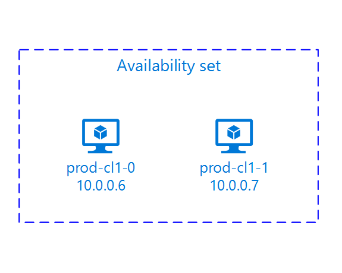

# Setting up Pacemaker on Red Hat Enterprise Linux in Azure

[planning-guide]:planning-guide.md
[deployment-guide]:deployment-guide.md
[dbms-guide]:dbms-guide.md
[sap-hana-ha]:sap-hana-high-availability.md
[1928533]:https://launchpad.support.sap.com/#/notes/1928533
[2015553]:https://launchpad.support.sap.com/#/notes/2015553
[2002167]:https://launchpad.support.sap.com/#/notes/2002167
[2009879]:https://launchpad.support.sap.com/#/notes/2009879
[2178632]:https://launchpad.support.sap.com/#/notes/2178632
[2191498]:https://launchpad.support.sap.com/#/notes/2191498
[2243692]:https://launchpad.support.sap.com/#/notes/2243692
[1999351]:https://launchpad.support.sap.com/#/notes/1999351

[virtual-machines-linux-maintenance]:../../linux/maintenance-and-updates.md#maintenance-that-doesnt-require-a-reboot

> [!TIP]
> Pacemaker on Red Hat Enterprise Linux uses the Azure Fence Agent to fence a cluster node if required. A new version of the Azure Fence Agent is available and failover no longer takes a long time, if a resource stop fails or the cluster nodes cannot communicate which each other anymore. For more information, read  [Azure VM running as a RHEL High Availability cluster member take a very long time to be fenced, or fencing fails / times-out before the VM shuts down](https://access.redhat.com/solutions/3408711)

Read the following SAP Notes and papers first:

* SAP Note [1928533], which has:
  * The list of Azure VM sizes that are supported for the deployment of SAP software.
  * Important capacity information for Azure VM sizes.
  * The supported SAP software, and operating system (OS) and database combinations.
  * The required SAP kernel version for Windows and Linux on Microsoft Azure.
* SAP Note [2015553] lists prerequisites for SAP-supported SAP software deployments in Azure.
* SAP Note [2002167] has recommended OS settings for Red Hat Enterprise Linux
* SAP Note [2009879] has SAP HANA Guidelines for Red Hat Enterprise Linux
* SAP Note [2178632] has detailed information about all monitoring metrics reported for SAP in Azure.
* SAP Note [2191498] has the required SAP Host Agent version for Linux in Azure.
* SAP Note [2243692] has information about SAP licensing on Linux in Azure.
* SAP Note [1999351] has additional troubleshooting information for the Azure Enhanced Monitoring Extension for SAP.
* [SAP Community WIKI](https://wiki.scn.sap.com/wiki/display/HOME/SAPonLinuxNotes) has all required SAP Notes for Linux.
* [Azure Virtual Machines planning and implementation for SAP on Linux][planning-guide]
* [Azure Virtual Machines deployment for SAP on Linux (this article)][deployment-guide]
* [Azure Virtual Machines DBMS deployment for SAP on Linux][dbms-guide]
* [SAP HANA system replication in pacemaker cluster](https://access.redhat.com/articles/3004101)
* General RHEL documentation
  * [High Availability Add-On Overview](https://access.redhat.com/documentation/en-us/red_hat_enterprise_linux/7/html/high_availability_add-on_overview/index)
  * [High Availability Add-On Administration](https://access.redhat.com/documentation/en-us/red_hat_enterprise_linux/7/html/high_availability_add-on_administration/index)
  * [High Availability Add-On Reference](https://access.redhat.com/documentation/en-us/red_hat_enterprise_linux/7/html/high_availability_add-on_reference/index)
* Azure specific RHEL documentation:
  * [Support Policies for RHEL High Availability Clusters - Microsoft Azure Virtual Machines as Cluster Members](https://access.redhat.com/articles/3131341)
  * [Installing and Configuring a Red Hat Enterprise Linux 7.4 (and later) High-Availability Cluster on Microsoft Azure](https://access.redhat.com/articles/3252491)
  * [Configure SAP S/4HANA ASCS/ERS with Standalone Enqueue Server 2 (ENSA2) in Pacemaker on RHEL 7.6](https://access.redhat.com/articles/3974941)

## Cluster installation



The following items are prefixed with either **[A]** - applicable to all nodes, **[1]** - only applicable to node 1 or **[2]** - only applicable to node 2.

1. **[A]** Register

   Register your virtual machines and attach it to a pool that contains repositories for RHEL 7.

   <pre><code>sudo subscription-manager register
   # List the available pools
   sudo subscription-manager list --available --matches '*SAP*'
   sudo subscription-manager attach --pool=&lt;pool id&gt;
   </code></pre>

   Note that by attaching a pool to an Azure Marketplace PAYG RHEL image, you will be effectively double-billed for your RHEL usage: once for the PAYG image, and once for the RHEL entitlement in the pool you attach. To mitigate this, Azure now provides BYOS RHEL images. More information is available [here](https://aka.ms/rhel-byos).

1. **[A]** Enable RHEL for SAP repos

   In order to install the required packages, enable the following repositories.

   <pre><code>sudo subscription-manager repos --disable "*"
   sudo subscription-manager repos --enable=rhel-7-server-rpms
   sudo subscription-manager repos --enable=rhel-ha-for-rhel-7-server-rpms
   sudo subscription-manager repos --enable=rhel-sap-for-rhel-7-server-rpms
   sudo subscription-manager repos --enable=rhel-ha-for-rhel-7-server-eus-rpms
   </code></pre>

1. **[A]** Install RHEL HA Add-On

   <pre><code>sudo yum install -y pcs pacemaker fence-agents-azure-arm nmap-ncat
   </code></pre>

   > [!IMPORTANT]
   > We recommend the following versions of Azure Fence agent (or later) for customers to benefit from a faster failover time, if a resource stop fails or the cluster nodes cannot communicate which each other anymore:  
   > RHEL 7.6: fence-agents-4.2.1-11.el7_6.8  
   > RHEL 7.5: fence-agents-4.0.11-86.el7_5.8  
   > RHEL 7.4: fence-agents-4.0.11-66.el7_4.12  
   > For more information see [Azure VM running as a RHEL High Availability cluster member take a very long time to be fenced, or fencing fails / times-out before the VM shuts down](https://access.redhat.com/solutions/3408711)

   Check the version of the Azure fence agent. If necessary update it to a version equal to or later than the stated above.
   <pre><code># Check the version of the Azure Fence Agent
    sudo yum info fence-agents-azure-arm
   </code></pre>

1. **[A]** Setup host name resolution

   You can either use a DNS server or modify the /etc/hosts on all nodes. This example shows how to use the /etc/hosts file.
   Replace the IP address and the hostname in the following commands. The benefit of using /etc/hosts is that your cluster become independent of DNS which could be a single point of failures too.

   <pre><code>sudo vi /etc/hosts
   </code></pre>

   Insert the following lines to /etc/hosts. Change the IP address and hostname to match your environment

   <pre><code># IP address of the first cluster node
   <b>10.0.0.6 prod-cl1-0</b>
   # IP address of the second cluster node
   <b>10.0.0.7 prod-cl1-1</b>
   </code></pre>

1. **[A]** Change hacluster password to the same password

   <pre><code>sudo passwd hacluster
   </code></pre>

1. **[A]** Add firewall rules for pacemaker

   Add the following firewall rules to all cluster communication between the cluster nodes.

   <pre><code>sudo firewall-cmd --add-service=high-availability --permanent
   sudo firewall-cmd --add-service=high-availability
   </code></pre>

1. **[A]** Enable basic cluster services

   Run the following commands to enable the Pacemaker service and start it.

   <pre><code>sudo systemctl start pcsd.service
   sudo systemctl enable pcsd.service
   </code></pre>

1. **[1]** Create Pacemaker cluster

   Run the following commands to authenticate the nodes and create the cluster. Set the token to 30000 to allow Memory preserving maintenance. For more information, see [this article for Linux][virtual-machines-linux-maintenance].

   <pre><code>sudo pcs cluster auth <b>prod-cl1-0</b> <b>prod-cl1-1</b> -u hacluster
   sudo pcs cluster setup --name <b>nw1-azr</b> <b>prod-cl1-0</b> <b>prod-cl1-1</b> --token 30000
   sudo pcs cluster start --all

   # Run the following command until the status of both nodes is online
   sudo pcs status

   # Cluster name: nw1-azr
   # WARNING: no stonith devices and stonith-enabled is not false
   # Stack: corosync
   # Current DC: <b>prod-cl1-1</b> (version 1.1.18-11.el7_5.3-2b07d5c5a9) - partition with quorum
   # Last updated: Fri Aug 17 09:18:24 2018
   # Last change: Fri Aug 17 09:17:46 2018 by hacluster via crmd on <b>prod-cl1-1</b>
   #
   # 2 nodes configured
   # 0 resources configured
   #
   # Online: [ <b>prod-cl1-0</b> <b>prod-cl1-1</b> ]
   #
   # No resources
   #
   #
   # Daemon Status:
   #   corosync: active/disabled
   #   pacemaker: active/disabled
   #   pcsd: active/enabled
   </code></pre>

1. **[A]** Set Expected Votes

   <pre><code>sudo pcs quorum expected-votes 2
   </code></pre>

## Create STONITH device

The STONITH device uses a Service Principal to authorize against Microsoft Azure. Follow these steps to create a Service Principal.

1. Go to <https://portal.azure.com>
1. Open the Azure Active Directory blade
   Go to Properties and write down the Directory ID. This is the **tenant ID**.
1. Click App registrations
1. Click Add
1. Enter a Name, select Application Type "Web app/API", enter a sign-on URL (for example http:\//localhost) and click Create
1. The sign-on URL is not used and can be any valid URL
1. Select the new App and click Keys in the Settings tab
1. Enter a description for a new key, select "Never expires" and click Save
1. Write down the Value. It is used as the **password** for the Service Principal
1. Write down the Application ID. It is used as the username (**login ID** in the steps below) of the Service Principal

### **[1]** Create a custom role for the fence agent

The Service Principal does not have permissions to access your Azure resources by default. You need to give the Service Principal permissions to start and stop (deallocate) all virtual machines of the cluster. If you did not already create the custom role, you can create it using [PowerShell](https://docs.microsoft.com/azure/role-based-access-control/role-assignments-powershell) or [Azure CLI](https://docs.microsoft.com/azure/role-based-access-control/role-assignments-cli)

Use the following content for the input file. You need to adapt the content to your subscriptions that is, replace c276fc76-9cd4-44c9-99a7-4fd71546436e and e91d47c4-76f3-4271-a796-21b4ecfe3624 with the Ids of your subscription. If you only have one subscription, remove the second entry in AssignableScopes.

```json
{
  "Name": "Linux Fence Agent Role",
  "Id": null,
  "IsCustom": true,
  "Description": "Allows to deallocate and start virtual machines",
  "Actions": [
    "Microsoft.Compute/*/read",
    "Microsoft.Compute/virtualMachines/deallocate/action",
    "Microsoft.Compute/virtualMachines/start/action"
  ],
  "NotActions": [
  ],
  "AssignableScopes": [
    "/subscriptions/c276fc76-9cd4-44c9-99a7-4fd71546436e",
    "/subscriptions/e91d47c4-76f3-4271-a796-21b4ecfe3624"
  ]
}
```

### **[A]** Assign the custom role to the Service Principal

Assign the custom role "Linux Fence Agent Role" that was created in the last chapter to the Service Principal. Do not use the Owner role anymore!

1. Go to https://portal.azure.com
1. Open the All resources blade
1. Select the virtual machine of the first cluster node
1. Click Access control (IAM)
1. Click Add role assignment
1. Select the role "Linux Fence Agent Role"
1. Enter the name of the application you created above
1. Click Save

Repeat the steps above for the second cluster node.

### **[1]** Create the STONITH devices

After you edited the permissions for the virtual machines, you can configure the STONITH devices in the cluster.

<pre><code>
sudo pcs property set stonith-timeout=900
</code></pre>

Use the following command to configure the fence device.

> [!NOTE]
> Option 'pcmk_host_map' is ONLY required in the command, if the RHEL host names and the Azure node names are NOT identical. Refer to the bold section in the command.

<pre><code>sudo pcs stonith create rsc_st_azure fence_azure_arm login="<b>login ID</b>" passwd="<b>password</b>" resourceGroup="<b>resource group</b>" tenantId="<b>tenant ID</b>" subscriptionId="<b>subscription id</b>" <b>pcmk_host_map="prod-cl1-0:10.0.0.6;prod-cl1-1:10.0.0.7"</b> power_timeout=240 pcmk_reboot_timeout=900</code></pre>

### **[1]** Enable the use of a STONITH device

<pre><code>sudo pcs property set stonith-enabled=true
</code></pre>

## Next steps

* [Azure Virtual Machines planning and implementation for SAP][planning-guide]
* [Azure Virtual Machines deployment for SAP][deployment-guide]
* [Azure Virtual Machines DBMS deployment for SAP][dbms-guide]
* To learn how to establish high availability and plan for disaster recovery of SAP HANA on Azure VMs, see [High Availability of SAP HANA on Azure Virtual Machines (VMs)][sap-hana-ha]
