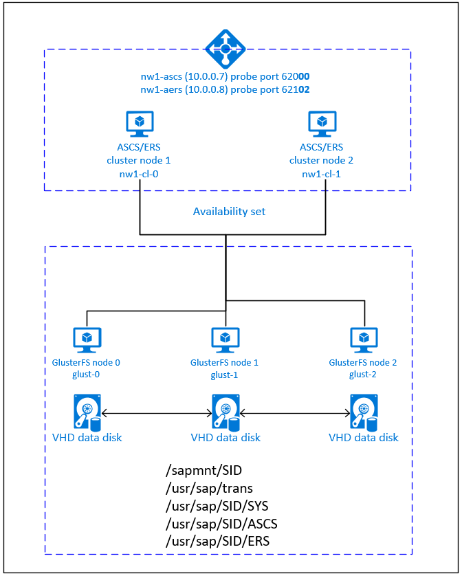

# Azure Virtual Machines high availability for SAP NetWeaver on Red Hat Enterprise Linux

[dbms-guide]:dbms-guide.md
[deployment-guide]:deployment-guide.md
[planning-guide]:planning-guide.md

[2002167]:https://launchpad.support.sap.com/#/notes/2002167
[2009879]:https://launchpad.support.sap.com/#/notes/2009879
[1928533]:https://launchpad.support.sap.com/#/notes/1928533
[2015553]:https://launchpad.support.sap.com/#/notes/2015553
[2178632]:https://launchpad.support.sap.com/#/notes/2178632
[2191498]:https://launchpad.support.sap.com/#/notes/2191498
[2243692]:https://launchpad.support.sap.com/#/notes/2243692
[1999351]:https://launchpad.support.sap.com/#/notes/1999351
[1410736]:https://launchpad.support.sap.com/#/notes/1410736

[sap-swcenter]:https://support.sap.com/en/my-support/software-downloads.html

[template-multisid-xscs]:https://portal.azure.com/#create/Microsoft.Template/uri/https%3A%2F%2Fraw.githubusercontent.com%2FAzure%2Fazure-quickstart-templates%2Fmaster%2Fsap-3-tier-marketplace-image-multi-sid-xscs-md%2Fazuredeploy.json

[sap-hana-ha]:sap-hana-high-availability-rhel.md
[glusterfs-ha]:high-availability-guide-rhel-glusterfs.md

This article describes how to deploy the virtual machines, configure the virtual machines, install the cluster framework, and install a highly available SAP NetWeaver 7.50 system.
In the example configurations, installation commands etc. ASCS instance number 00, ERS instance number 02, and SAP System ID NW1 is used. The names of the resources (for example virtual machines, virtual networks) in the example assume that you have used the [ASCS/SCS template][template-multisid-xscs] with Resource Prefix NW1 to create the resources.

Read the following SAP Notes and papers first

* SAP Note [1928533], which has:
  * List of Azure VM sizes that are supported for the deployment of SAP software
  * Important capacity information for Azure VM sizes
  * Supported SAP software, and operating system (OS) and database combinations
  * Required SAP kernel version for Windows and Linux on Microsoft Azure

* SAP Note [2015553] lists prerequisites for SAP-supported SAP software deployments in Azure.
* SAP Note [2002167] has recommended OS settings for Red Hat Enterprise Linux
* SAP Note [2009879] has SAP HANA Guidelines for Red Hat Enterprise Linux
* SAP Note [2178632] has detailed information about all monitoring metrics reported for SAP in Azure.
* SAP Note [2191498] has the required SAP Host Agent version for Linux in Azure.
* SAP Note [2243692] has information about SAP licensing on Linux in Azure.
* SAP Note [1999351] has additional troubleshooting information for the Azure Enhanced Monitoring Extension for SAP.
* [SAP Community WIKI](https://wiki.scn.sap.com/wiki/display/HOME/SAPonLinuxNotes) has all required SAP Notes for Linux.
* [Azure Virtual Machines planning and implementation for SAP on Linux][planning-guide]
* [Azure Virtual Machines deployment for SAP on Linux][deployment-guide]
* [Azure Virtual Machines DBMS deployment for SAP on Linux][dbms-guide]
* [Product Documentation for Red Hat Gluster Storage](https://access.redhat.com/documentation/red_hat_gluster_storage/)
* [SAP Netweaver in pacemaker cluster](https://access.redhat.com/articles/3150081)
* General RHEL documentation
  * [High Availability Add-On Overview](https://access.redhat.com/documentation/en-us/red_hat_enterprise_linux/7/html/high_availability_add-on_overview/index)
  * [High Availability Add-On Administration](https://access.redhat.com/documentation/en-us/red_hat_enterprise_linux/7/html/high_availability_add-on_administration/index)
  * [High Availability Add-On Reference](https://access.redhat.com/documentation/en-us/red_hat_enterprise_linux/7/html/high_availability_add-on_reference/index)
  * [Configuring ASCS/ERS for SAP Netweaver with standalone resources in RHEL 7.5](https://access.redhat.com/articles/3569681)
  * [Configure SAP S/4HANA ASCS/ERS with Standalone Enqueue Server 2 (ENSA2) in Pacemaker on RHEL
](https://access.redhat.com/articles/3974941)
* Azure specific RHEL documentation:
  * [Support Policies for RHEL High Availability Clusters - Microsoft Azure Virtual Machines as Cluster Members](https://access.redhat.com/articles/3131341)
  * [Installing and Configuring a Red Hat Enterprise Linux 7.4 (and later) High-Availability Cluster on Microsoft Azure](https://access.redhat.com/articles/3252491)

## Overview

To achieve high availability, SAP NetWeaver requires shared storage. GlusterFS is configured in a separate cluster and can be used by multiple SAP systems.

SAP NetWeaver ASCS, SAP NetWeaver SCS, SAP NetWeaver ERS, and the SAP HANA database use virtual hostname and virtual IP addresses. On Azure, a load balancer is required to use a virtual IP address. The following list shows the configuration of the (A)SCS and ERS load balancer.

> [!IMPORTANT]
> Multi-SID clustering of SAP ASCS/ERS with Red Hat Linux as guest operating system in Azure VMs is **NOT supported**. Multi-SID clustering describes the installation of multiple SAP ASCS/ERS instances with different SIDs in one Pacemaker cluster.

### (A)SCS

* Frontend configuration
  * IP address 10.0.0.7
* Backend configuration
  * Connected to primary network interfaces of all virtual machines that should be part of the (A)SCS/ERS cluster
* Probe Port
  * Port 620<strong>&lt;nr&gt;</strong>
* Load-balancing rules
  * 32<strong>&lt;nr&gt;</strong> TCP
  * 36<strong>&lt;nr&gt;</strong> TCP
  * 39<strong>&lt;nr&gt;</strong> TCP
  * 81<strong>&lt;nr&gt;</strong> TCP
  * 5<strong>&lt;nr&gt;</strong>13 TCP
  * 5<strong>&lt;nr&gt;</strong>14 TCP
  * 5<strong>&lt;nr&gt;</strong>16 TCP

### ERS

* Frontend configuration
  * IP address 10.0.0.8
* Backend configuration
  * Connected to primary network interfaces of all virtual machines that should be part of the (A)SCS/ERS cluster
* Probe Port
  * Port 621<strong>&lt;nr&gt;</strong>
* Load-balancing rules
  * 32<strong>&lt;nr&gt;</strong> TCP
  * 33<strong>&lt;nr&gt;</strong> TCP
  * 5<strong>&lt;nr&gt;</strong>13 TCP
  * 5<strong>&lt;nr&gt;</strong>14 TCP
  * 5<strong>&lt;nr&gt;</strong>16 TCP

## Setting up GlusterFS

SAP NetWeaver requires shared storage for the transport and profile directory. Read [GlusterFS on Azure VMs on Red Hat Enterprise Linux for SAP NetWeaver][glusterfs-ha] on how to set up GlusterFS for SAP NetWeaver.

## Setting up (A)SCS

You can either use an Azure Template from GitHub to deploy all required Azure resources, including the virtual machines, availability set and load balancer or you can deploy the resources manually.

### Deploy Linux via Azure Template

The Azure Marketplace contains an image for Red Hat Enterprise Linux that you can use to deploy new virtual machines. You can use one of the quickstart templates on GitHub to deploy all required resources. The template deploys the virtual machines, the load balancer, availability set etc.
Follow these steps to deploy the template:

1. Open the [ASCS/SCS template][template-multisid-xscs] on the Azure portal  
1. Enter the following parameters
   1. Resource Prefix  
      Enter the prefix you want to use. The value is used as a prefix for the resources that are deployed.
   1. Stack Type  
      Select the SAP NetWeaver stack type
   1. Os Type  
      Select one of the Linux distributions. For this example, select RHEL 7
   1. Db Type  
      Select HANA
   1. Sap System Count  
      The number of SAP system that run in this cluster. Select 1.
   1. System Availability  
      Select HA
   1. Admin Username, Admin Password or SSH key  
      A new user is created that can be used to sign in to the machine.
   1. Subnet ID  
   If you want to deploy the VM into an existing VNet where you have a subnet defined the VM should be assigned to, name the ID of that specific subnet. The ID usually looks like /subscriptions/**&lt;subscription ID&gt;**/resourceGroups/**&lt;resource group name&gt;**/providers/Microsoft.Network/virtualNetworks/**&lt;virtual network name&gt;**/subnets/**&lt;subnet name&gt;**

### Deploy Linux manually via Azure portal

You first need to create the virtual machines for this cluster. Afterwards, you create a load balancer and use the virtual machines in the backend pools.

1. Create a Resource Group
1. Create a Virtual Network
1. Create an Availability Set  
   Set max update domain
1. Create Virtual Machine 1  
   Use at least RHEL 7, in this example the Red Hat Enterprise Linux 7.4 image
   <https://portal.azure.com/#create/RedHat.RedHatEnterpriseLinux74-ARM>  
   Select Availability Set created earlier  
1. Create Virtual Machine 2  
   Use at least RHEL 7, in this example the Red Hat Enterprise Linux 7.4 image
   <https://portal.azure.com/#create/RedHat.RedHatEnterpriseLinux74-ARM>  
   Select Availability Set created earlier  
1. Add at least one data disk to both virtual machines  
   The data disks are used for the /usr/sap/`<SAPSID`> directory
1. Create a Load Balancer (internal)  
   1. Create the frontend IP addresses
      1. IP address 10.0.0.7 for the ASCS
         1. Open the load balancer, select frontend IP pool, and click Add
         1. Enter the name of the new frontend IP pool (for example **nw1-ascs-frontend**)
         1. Set the Assignment to Static and enter the IP address (for example **10.0.0.7**)
         1. Click OK
      1. IP address 10.0.0.8 for the ASCS ERS
         * Repeat the steps above to create an IP address for the ERS (for example **10.0.0.8** and **nw1-aers-backend**)
   1. Create the backend pools
      1. Create a backend pool for the ASCS
         1. Open the load balancer, select backend pools, and click Add
         1. Enter the name of the new backend pool (for example **nw1-ascs-backend**)
         1. Click Add a virtual machine.
         1. Select the Availability Set you created earlier
         1. Select the virtual machines of the (A)SCS cluster
         1. Click OK
      1. Create a backend pool for the ASCS ERS
         * Repeat the steps above to create a backend pool for the ERS (for example **nw1-aers-backend**)
   1. Create the health probes
      1. Port 620**00** for ASCS
         1. Open the load balancer, select health probes, and click Add
         1. Enter the name of the new health probe (for example **nw1-ascs-hp**)
         1. Select TCP as protocol, port 620**00**, keep Interval 5 and Unhealthy threshold 2
         1. Click OK
      1. Port 621**02** for ASCS ERS
         * Repeat the steps above to create a health probe for the ERS (for example 621**02** and **nw1-aers-hp**)
   1. Load-balancing rules
      1. 32**00** TCP for ASCS
         1. Open the load balancer, select load-balancing rules and click Add
         1. Enter the name of the new load balancer rule (for example **nw1-lb-3200**)
         1. Select the frontend IP address, backend pool, and health probe you created earlier (for example **nw1-ascs-frontend**)
         1. Keep protocol **TCP**, enter port **3200**
         1. Increase idle timeout to 30 minutes
         1. **Make sure to enable Floating IP**
         1. Click OK
      1. Additional ports for the ASCS
         * Repeat the steps above for ports 36**00**, 39**00**, 81**00**, 5**00**13, 5**00**14, 5**00**16 and TCP for the ASCS
      1. Additional ports for the ASCS ERS
         * Repeat the steps above for ports 33**02**, 5**02**13, 5**02**14, 5**02**16 and TCP for the ASCS ERS

> [!IMPORTANT]
> Do not enable TCP timestamps on Azure VMs placed behind Azure Load Balancer. Enabling TCP timestamps will cause the health probes to fail. Set parameter **net.ipv4.tcp_timestamps** to **0**. For details see [Load Balancer health probes](https://docs.microsoft.com/azure/load-balancer/load-balancer-custom-probe-overview).

### Create Pacemaker cluster

Follow the steps in [Setting up Pacemaker on Red Hat Enterprise Linux in Azure](high-availability-guide-rhel-pacemaker.md) to create a basic Pacemaker cluster for this (A)SCS server.

### Prepare for SAP NetWeaver installation

The following items are prefixed with either **[A]** - applicable to all nodes, **[1]** - only applicable to node 1 or **[2]** - only applicable to node 2.

1. **[A]** Setup host name resolution

   You can either use a DNS server or modify the /etc/hosts on all nodes. This example shows how to use the /etc/hosts file.
   Replace the IP address and the hostname in the following commands

   <pre><code>sudo vi /etc/hosts
   </code></pre>

   Insert the following lines to /etc/hosts. Change the IP address and hostname to match your environment

   <pre><code># IP addresses of the GlusterFS nodes
   <b>10.0.0.40 glust-0</b>
   <b>10.0.0.41 glust-1</b>
   <b>10.0.0.42 glust-2</b>
   # IP address of the load balancer frontend configuration for SAP NetWeaver ASCS
   <b>10.0.0.7 nw1-ascs</b>
   # IP address of the load balancer frontend configuration for SAP NetWeaver ASCS ERS
   <b>10.0.0.8 nw1-aers</b>
   </code></pre>

1. **[A]** Create the shared directories

   <pre><code>sudo mkdir -p /sapmnt/<b>NW1</b>
   sudo mkdir -p /usr/sap/trans
   sudo mkdir -p /usr/sap/<b>NW1</b>/SYS
   sudo mkdir -p /usr/sap/<b>NW1</b>/ASCS<b>00</b>
   sudo mkdir -p /usr/sap/<b>NW1</b>/ERS<b>02</b>

   sudo chattr +i /sapmnt/<b>NW1</b>
   sudo chattr +i /usr/sap/trans
   sudo chattr +i /usr/sap/<b>NW1</b>/SYS
   sudo chattr +i /usr/sap/<b>NW1</b>/ASCS<b>00</b>
   sudo chattr +i /usr/sap/<b>NW1</b>/ERS<b>02</b>
   </code></pre>

1. **[A]** Install GlusterFS client and other requirements

   <pre><code>sudo yum -y install glusterfs-fuse resource-agents resource-agents-sap
   </code></pre>

1. **[A]** Check version of resource-agents-sap

   Make sure that the version of the installed resource-agents-sap package is at least 3.9.5-124.el7
   <pre><code>sudo yum info resource-agents-sap
   
   # Loaded plugins: langpacks, product-id, search-disabled-repos
   # Repodata is over 2 weeks old. Install yum-cron? Or run: yum makecache fast
   # Installed Packages
   # Name        : resource-agents-sap
   # Arch        : x86_64
   # Version     : <b>3.9.5</b>
   # Release     : <b>124.el7</b>
   # Size        : 100 k
   # Repo        : installed
   # From repo   : rhel-sap-for-rhel-7-server-rpms
   # Summary     : SAP cluster resource agents and connector script
   # URL         : https://github.com/ClusterLabs/resource-agents
   # License     : GPLv2+
   # Description : The SAP resource agents and connector script interface with
   #          : Pacemaker to allow SAP instances to be managed in a cluster
   #          : environment.
   </code></pre>

1. **[A]** Add mount entries

   <pre><code>sudo vi /etc/fstab
   
   # Add the following lines to fstab, save and exit
   <b>glust-0</b>:/<b>NW1</b>-sapmnt /sapmnt/<b>NW1</b> glusterfs backup-volfile-servers=<b>glust-1:glust-2</b> 0 0
   <b>glust-0</b>:/<b>NW1</b>-trans /usr/sap/trans glusterfs backup-volfile-servers=<b>glust-1:glust-2</b> 0 0
   <b>glust-0</b>:/<b>NW1</b>-sys /usr/sap/<b>NW1</b>/SYS glusterfs backup-volfile-servers=<b>glust-1:glust-2</b> 0 0
   </code></pre>

   Mount the new shares

   <pre><code>sudo mount -a
   </code></pre>

1. **[A]** Configure SWAP file

   <pre><code>sudo vi /etc/waagent.conf
   
   # Set the property ResourceDisk.EnableSwap to y
   # Create and use swapfile on resource disk.
   ResourceDisk.EnableSwap=<b>y</b>
   
   # Set the size of the SWAP file with property ResourceDisk.SwapSizeMB
   # The free space of resource disk varies by virtual machine size. Make sure that you do not set a value that is too big. You can check the SWAP space with command swapon
   # Size of the swapfile.
   ResourceDisk.SwapSizeMB=<b>2000</b>
   </code></pre>

   Restart the Agent to activate the change

   <pre><code>sudo service waagent restart
   </code></pre>

1. **[A]** RHEL configuration

   Configure RHEL as described in SAP Note [2002167]

### Installing SAP NetWeaver ASCS/ERS

1. **[1]** Create a virtual IP resource and health-probe for the ASCS instance

   <pre><code>sudo pcs node standby <b>nw1-cl-1</b>
   
   sudo pcs resource create fs_<b>NW1</b>_ASCS Filesystem device='<b>glust-0</b>:/<b>NW1</b>-ascs' \
     directory='/usr/sap/<b>NW1</b>/ASCS<b>00</b>' fstype='glusterfs' \
     options='backup-volfile-servers=<b>glust-1:glust-2</b>' \
     --group g-<b>NW1</b>_ASCS
   
   sudo pcs resource create vip_<b>NW1</b>_ASCS IPaddr2 \
     ip=<b>10.0.0.7</b> cidr_netmask=<b>24</b> \
     --group g-<b>NW1</b>_ASCS
   
   sudo pcs resource create nc_<b>NW1</b>_ASCS azure-lb port=620<b>00</b> \
     --group g-<b>NW1</b>_ASCS
   </code></pre>

   Make sure that the cluster status is ok and that all resources are started. It is not important on which node the resources are running.

   <pre><code>sudo pcs status
   
   # Node <b>nw1-cl-1</b>: standby
   # Online: [ <b>nw1-cl-0</b> ]
   #
   # Full list of resources:
   #
   # rsc_st_azure    (stonith:fence_azure_arm):      Started <b>nw1-cl-0</b>
   #  Resource Group: g-<b>NW1</b>_ASCS
   #      fs_<b>NW1</b>_ASCS        (ocf::heartbeat:Filesystem):    Started <b>nw1-cl-0</b>
   #      nc_<b>NW1</b>_ASCS        (ocf::heartbeat:azure-lb):      Started <b>nw1-cl-0</b>
   #      vip_<b>NW1</b>_ASCS       (ocf::heartbeat:IPaddr2):       Started <b>nw1-cl-0</b>
   </code></pre>

1. **[1]** Install SAP NetWeaver ASCS  

   Install SAP NetWeaver ASCS as root on the first node using a virtual hostname that maps to the IP address of the load balancer frontend configuration for the ASCS, for example <b>nw1-ascs</b>, <b>10.0.0.7</b> and the instance number that you used for the probe of the load balancer, for example <b>00</b>.

   You can use the sapinst parameter SAPINST_REMOTE_ACCESS_USER to allow a non-root user to connect to sapinst.

   <pre><code># Allow access to SWPM. This rule is not permanent. If you reboot the machine, you have to run the command again.
   sudo firewall-cmd --zone=public  --add-port=4237/tcp
   
   sudo &lt;swpm&gt;/sapinst SAPINST_REMOTE_ACCESS_USER=<b>sapadmin</b>
   </code></pre>

   If the installation fails to create a subfolder in /usr/sap/**NW1**/ASCS**00**, try setting the owner and group of the ASCS**00** folder and retry.

   <pre><code>sudo chown nw1adm /usr/sap/<b>NW1</b>/ASCS<b>00</b>
   sudo chgrp sapsys /usr/sap/<b>NW1</b>/ASCS<b>00</b>
   </code></pre>

1. **[1]** Create a virtual IP resource and health-probe for the ERS instance

   <pre><code>sudo pcs node unstandby <b>nw1-cl-1</b>
   sudo pcs node standby <b>nw1-cl-0</b>
   
   sudo pcs resource create fs_<b>NW1</b>_AERS Filesystem device='<b>glust-0</b>:/<b>NW1</b>-aers' \
     directory='/usr/sap/<b>NW1</b>/ERS<b>02</b>' fstype='glusterfs' \
     options='backup-volfile-servers=<b>glust-1:glust-2</b>' \
    --group g-<b>NW1</b>_AERS
   
   sudo pcs resource create vip_<b>NW1</b>_AERS IPaddr2 \
     ip=<b>10.0.0.8</b> cidr_netmask=<b>24</b> \
    --group g-<b>NW1</b>_AERS
   
   sudo pcs resource create nc_<b>NW1</b>_AERS azure-lb port=621<b>02</b> \
    --group g-<b>NW1</b>_AERS
   </code></pre>
 
   Make sure that the cluster status is ok and that all resources are started. It is not important on which node the resources are running.

   <pre><code>sudo pcs status
   
   # Node <b>nw1-cl-0</b>: standby
   # Online: [ <b>nw1-cl-1</b> ]
   #
   # Full list of resources:
   #
   # rsc_st_azure    (stonith:fence_azure_arm):      Started <b>nw1-cl-1</b>
   #  Resource Group: g-<b>NW1</b>_ASCS
   #      fs_<b>NW1</b>_ASCS        (ocf::heartbeat:Filesystem):    Started <b>nw1-cl-1</b>
   #      nc_<b>NW1</b>_ASCS        (ocf::heartbeat:azure-lb):      Started <b>nw1-cl-1</b>
   #      vip_<b>NW1</b>_ASCS       (ocf::heartbeat:IPaddr2):       Started <b>nw1-cl-1</b>
   #  Resource Group: g-<b>NW1</b>_AERS
   #      fs_<b>NW1</b>_AERS        (ocf::heartbeat:Filesystem):    Started <b>nw1-cl-1</b>
   #      nc_<b>NW1</b>_AERS        (ocf::heartbeat:azure-lb):      Started <b>nw1-cl-1</b>
   #      vip_<b>NW1</b>_AERS       (ocf::heartbeat:IPaddr2):       Started <b>nw1-cl-1</b>
   </code></pre>

1. **[2]** Install SAP NetWeaver ERS  

   Install SAP NetWeaver ERS as root on the second node using a virtual hostname that maps to the IP address of the load balancer frontend configuration for the ERS, for example <b>nw1-aers</b>, <b>10.0.0.8</b> and the instance number that you used for the probe of the load balancer, for example <b>02</b>.

   You can use the sapinst parameter SAPINST_REMOTE_ACCESS_USER to allow a non-root user to connect to sapinst.

   <pre><code># Allow access to SWPM. This rule is not permanent. If you reboot the machine, you have to run the command again.
   sudo firewall-cmd --zone=public  --add-port=4237/tcp

   sudo &lt;swpm&gt;/sapinst SAPINST_REMOTE_ACCESS_USER=<b>sapadmin</b>
   </code></pre>

   If the installation fails to create a subfolder in /usr/sap/**NW1**/ERS**02**, try setting the owner and group of the ERS**02** folder and retry.

   <pre><code>sudo chown nw1adm /usr/sap/<b>NW1</b>/ERS<b>02</b>
   sudo chgrp sapsys /usr/sap/<b>NW1</b>/ERS<b>02</b>
   </code></pre>

1. **[1]** Adapt the ASCS/SCS and ERS instance profiles

   * ASCS/SCS profile

   <pre><code>sudo vi /sapmnt/<b>NW1</b>/profile/<b>NW1</b>_<b>ASCS00</b>_<b>nw1-ascs</b>
   
   # Change the restart command to a start command
   #Restart_Program_01 = local $(_EN) pf=$(_PF)
   Start_Program_01 = local $(_EN) pf=$(_PF)
   
   # Add the keep alive parameter
   enque/encni/set_so_keepalive = true
   </code></pre>

   * ERS profile

   <pre><code>sudo vi /sapmnt/<b>NW1</b>/profile/<b>NW1</b>_ERS<b>02</b>_<b>nw1-aers</b>
   
   # Change the restart command to a start command
   #Restart_Program_00 = local $(_ER) pf=$(_PFL) NR=$(SCSID)
   Start_Program_00 = local $(_ER) pf=$(_PFL) NR=$(SCSID)
   
   # remove Autostart from ERS profile
   # Autostart = 1
   </code></pre>

1. **[A]** Configure Keep Alive

   The communication between the SAP NetWeaver application server and the ASCS/SCS is routed through a software load balancer. The load balancer disconnects inactive connections after a configurable timeout. To prevent this, you need to set a parameter in the SAP NetWeaver ASCS/SCS profile and change the Linux system settings. Read [SAP Note 1410736][1410736] for more information.

   The ASCS/SCS profile parameter enque/encni/set_so_keepalive was already added in the last step.

   <pre><code># Change the Linux system configuration
   sudo sysctl net.ipv4.tcp_keepalive_time=120
   </code></pre>

1. **[A]** Update the /usr/sap/sapservices file

   To prevent the start of the instances by the sapinit startup script, all instances managed by Pacemaker must be commented out from /usr/sap/sapservices file. Do not comment out the SAP HANA instance if it will be used with HANA SR.

   <pre><code>
   sudo vi /usr/sap/sapservices
   
   # On the node where you installed the ASCS, comment out the following line
   # LD_LIBRARY_PATH=/usr/sap/<b>NW1</b>/ASCS<b>00</b>/exe:$LD_LIBRARY_PATH; export LD_LIBRARY_PATH; /usr/sap/<b>NW1</b>/ASCS<b>00</b>/exe/sapstartsrv pf=/usr/sap/<b>NW1</b>/SYS/profile/<b>NW1</b>_ASCS<b>00</b>_<b>nw1-ascs</b> -D -u <b>nw1</b>adm
   
   # On the node where you installed the ERS, comment out the following line
   # LD_LIBRARY_PATH=/usr/sap/<b>NW1</b>/ERS<b>02</b>/exe:$LD_LIBRARY_PATH; export LD_LIBRARY_PATH; /usr/sap/<b>NW1</b>/ERS<b>02</b>/exe/sapstartsrv pf=/usr/sap/<b>NW1</b>/ERS<b>02</b>/profile/<b>NW1</b>_ERS<b>02</b>_<b>nw1-aers</b> -D -u <b>nw1</b>adm
   </code></pre>

1. **[1]** Create the SAP cluster resources

  If using enqueue server 1 architecture (ENSA1), define the resources as follows:

   <pre><code>sudo pcs property set maintenance-mode=true
   
   sudo pcs resource create rsc_sap_<b>NW1</b>_ASCS00 SAPInstance \
    InstanceName=<b>NW1</b>_ASCS00_<b>nw1-ascs</b> START_PROFILE="/sapmnt/<b>NW1</b>/profile/<b>NW1</b>_ASCS00_<b>nw1-ascs</b>" \
    AUTOMATIC_RECOVER=false \
    meta resource-stickiness=5000 migration-threshold=1 \
    --group g-<b>NW1</b>_ASCS
   
   sudo pcs resource create rsc_sap_<b>NW1</b>_ERS<b>02</b> SAPInstance \
    InstanceName=<b>NW1</b>_ERS02_<b>nw1-aers</b> START_PROFILE="/sapmnt/<b>NW1</b>/profile/<b>NW1</b>_ERS02_<b>nw1-aers</b>" \
    AUTOMATIC_RECOVER=false IS_ERS=true \
    --group g-<b>NW1</b>_AERS
      
   sudo pcs constraint colocation add g-<b>NW1</b>_AERS with g-<b>NW1</b>_ASCS -5000
   sudo pcs constraint location rsc_sap_<b>NW1</b>_ASCS<b>00</b> rule score=2000 runs_ers_<b>NW1</b> eq 1
   sudo pcs constraint order g-<b>NW1</b>_ASCS then g-<b>NW1</b>_AERS kind=Optional symmetrical=false
   
   sudo pcs node unstandby <b>nw1-cl-0</b>
   sudo pcs property set maintenance-mode=false
   </code></pre>

   SAP introduced support for enqueue server 2, including replication, as of SAP NW 7.52. Starting with ABAP Platform 1809, enqueue server 2 is installed by default. See SAP note [2630416](https://launchpad.support.sap.com/#/notes/2630416) for enqueue server 2 support.
   If using enqueue server 2 architecture ([ENSA2](https://help.sap.com/viewer/cff8531bc1d9416d91bb6781e628d4e0/1709%20001/en-US/6d655c383abf4c129b0e5c8683e7ecd8.html)), install resource agent resource-agents-sap-4.1.1-12.el7.x86_64 or newer and define the resources as follows:

<pre><code>sudo pcs property set maintenance-mode=true
   
   sudo pcs resource create rsc_sap_<b>NW1</b>_ASCS00 SAPInstance \
    InstanceName=<b>NW1</b>_ASCS00_<b>nw1-ascs</b> START_PROFILE="/sapmnt/<b>NW1</b>/profile/<b>NW1</b>_ASCS00_<b>nw1-ascs</b>" \
    AUTOMATIC_RECOVER=false \
    meta resource-stickiness=5000 \
    --group g-<b>NW1</b>_ASCS
   
   sudo pcs resource create rsc_sap_<b>NW1</b>_ERS<b>02</b> SAPInstance \
    InstanceName=<b>NW1</b>_ERS02_<b>nw1-aers</b> START_PROFILE="/sapmnt/<b>NW1</b>/profile/<b>NW1</b>_ERS02_<b>nw1-aers</b>" \
    AUTOMATIC_RECOVER=false IS_ERS=true \
    --group g-<b>NW1</b>_AERS
      
   sudo pcs constraint colocation add g-<b>NW1</b>_AERS with g-<b>NW1</b>_ASCS -5000
   sudo pcs constraint order g-<b>NW1</b>_ASCS then g-<b>NW1</b>_AERS kind=Optional symmetrical=false
   
   sudo pcs node unstandby <b>nw1-cl-0</b>
   sudo pcs property set maintenance-mode=false
   </code></pre>

   If you are upgrading from an older version and switching to enqueue server 2, see SAP note [2641322](https://launchpad.support.sap.com/#/notes/2641322). 

   Make sure that the cluster status is ok and that all resources are started. It is not important on which node the resources are running.

   <pre><code>sudo pcs status
   
   # Online: [ <b>nw1-cl-0</b> <b>nw1-cl-1</b> ]
   #
   # Full list of resources:
   #
   # rsc_st_azure    (stonith:fence_azure_arm):      Started <b>nw1-cl-0</b>
   #  Resource Group: g-<b>NW1</b>_ASCS
   #      fs_<b>NW1</b>_ASCS        (ocf::heartbeat:Filesystem):    Started <b>nw1-cl-1</b>
   #      nc_<b>NW1</b>_ASCS        (ocf::heartbeat:azure-lb):      Started <b>nw1-cl-1</b>
   #      vip_<b>NW1</b>_ASCS       (ocf::heartbeat:IPaddr2):       Started <b>nw1-cl-1</b>
   #      rsc_sap_<b>NW1</b>_ASCS00 (ocf::heartbeat:SAPInstance):   Started <b>nw1-cl-1</b>
   #  Resource Group: g-<b>NW1</b>_AERS
   #      fs_<b>NW1</b>_AERS        (ocf::heartbeat:Filesystem):    Started <b>nw1-cl-0</b>
   #      nc_<b>NW1</b>_AERS        (ocf::heartbeat:azure-lb):      Started <b>nw1-cl-0</b>
   #      vip_<b>NW1</b>_AERS       (ocf::heartbeat:IPaddr2):       Started <b>nw1-cl-0</b>
   #      rsc_sap_<b>NW1</b>_ERS02  (ocf::heartbeat:SAPInstance):   Started <b>nw1-cl-0</b>
   </code></pre>

1. **[A]** Add firewall rules for ASCS and ERS on both nodes

   <pre><code># Probe Port of ASCS
   sudo firewall-cmd --zone=public --add-port=620<b>00</b>/tcp --permanent
   sudo firewall-cmd --zone=public --add-port=620<b>00</b>/tcp
   sudo firewall-cmd --zone=public --add-port=32<b>00</b>/tcp --permanent
   sudo firewall-cmd --zone=public --add-port=32<b>00</b>/tcp
   sudo firewall-cmd --zone=public --add-port=36<b>00</b>/tcp --permanent
   sudo firewall-cmd --zone=public --add-port=36<b>00</b>/tcp
   sudo firewall-cmd --zone=public --add-port=39<b>00</b>/tcp --permanent
   sudo firewall-cmd --zone=public --add-port=39<b>00</b>/tcp
   sudo firewall-cmd --zone=public --add-port=81<b>00</b>/tcp --permanent
   sudo firewall-cmd --zone=public --add-port=81<b>00</b>/tcp
   sudo firewall-cmd --zone=public --add-port=5<b>00</b>13/tcp --permanent
   sudo firewall-cmd --zone=public --add-port=5<b>00</b>13/tcp
   sudo firewall-cmd --zone=public --add-port=5<b>00</b>14/tcp --permanent
   sudo firewall-cmd --zone=public --add-port=5<b>00</b>14/tcp
   sudo firewall-cmd --zone=public --add-port=5<b>00</b>16/tcp --permanent
   sudo firewall-cmd --zone=public --add-port=5<b>00</b>16/tcp
   # Probe Port of ERS
   sudo firewall-cmd --zone=public --add-port=621<b>02</b>/tcp --permanent
   sudo firewall-cmd --zone=public --add-port=621<b>02</b>/tcp
   sudo firewall-cmd --zone=public --add-port=33<b>02</b>/tcp --permanent
   sudo firewall-cmd --zone=public --add-port=33<b>02</b>/tcp
   sudo firewall-cmd --zone=public --add-port=5<b>02</b>13/tcp --permanent
   sudo firewall-cmd --zone=public --add-port=5<b>02</b>13/tcp
   sudo firewall-cmd --zone=public --add-port=5<b>02</b>14/tcp --permanent
   sudo firewall-cmd --zone=public --add-port=5<b>02</b>14/tcp
   sudo firewall-cmd --zone=public --add-port=5<b>02</b>16/tcp --permanent
   sudo firewall-cmd --zone=public --add-port=5<b>02</b>16/tcp
   </code></pre>

## SAP NetWeaver application server preparation

Some databases require that the database instance installation is executed on an application server. Prepare the application server virtual machines to be able to use them in these cases.

The steps bellow assume that you install the application server on a server different from the ASCS/SCS and HANA servers. Otherwise some of the steps below (like configuring host name resolution) are not needed.

1. Setup host name resolution

   You can either use a DNS server or modify the /etc/hosts on all nodes. This example shows how to use the /etc/hosts file.
   Replace the IP address and the hostname in the following commands

   <pre><code>sudo vi /etc/hosts
   </code></pre>

   Insert the following lines to /etc/hosts. Change the IP address and hostname to match your environment

   <pre><code># IP addresses of the GlusterFS nodes
   <b>10.0.0.40 glust-0</b>
   <b>10.0.0.41 glust-1</b>
   <b>10.0.0.42 glust-2</b>
   # IP address of the load balancer frontend configuration for SAP NetWeaver ASCS
   <b>10.0.0.7 nw1-ascs</b>
   # IP address of the load balancer frontend configuration for SAP NetWeaver ASCS ERS
   <b>10.0.0.8 nw1-aers</b>
   # IP address of the load balancer frontend configuration for database
   <b>10.0.0.13 nw1-db</b>
   </code></pre>

1. Create the sapmnt directory

   <pre><code>sudo mkdir -p /sapmnt/<b>NW1</b>
   sudo mkdir -p /usr/sap/trans

   sudo chattr +i /sapmnt/<b>NW1</b>
   sudo chattr +i /usr/sap/trans
   </code></pre>

1. Install GlusterFS client and other requirements

   <pre><code>sudo yum -y install glusterfs-fuse uuidd
   </code></pre>

1. Add mount entries

   <pre><code>sudo vi /etc/fstab
   
   # Add the following lines to fstab, save and exit
   <b>glust-0</b>:/<b>NW1</b>-sapmnt /sapmnt/<b>NW1</b> glusterfs backup-volfile-servers=<b>glust-1:glust-2</b> 0 0
   <b>glust-0</b>:/<b>NW1</b>-trans /usr/sap/trans glusterfs backup-volfile-servers=<b>glust-1:glust-2</b> 0 0
   </code></pre>

   Mount the new shares

   <pre><code>sudo mount -a
   </code></pre>

1. Configure SWAP file
 
   <pre><code>
   sudo vi /etc/waagent.conf
   
   # Set the property ResourceDisk.EnableSwap to y
   # Create and use swapfile on resource disk.
   ResourceDisk.EnableSwap=<b>y</b>
   
   # Set the size of the SWAP file with property ResourceDisk.SwapSizeMB
   # The free space of resource disk varies by virtual machine size. Make sure that you do not set a value that is too big. You can check the SWAP space with command swapon
   # Size of the swapfile.
   ResourceDisk.SwapSizeMB=<b>2000</b>
   </code></pre>

   Restart the Agent to activate the change

   <pre><code>
   sudo service waagent restart
   </code></pre>

## Install database

In this example, SAP NetWeaver is installed on SAP HANA. You can use every supported database for this installation. For more information on how to install SAP HANA in Azure, see [High availability of SAP HANA on Azure VMs on Red Hat Enterprise Linux][sap-hana-ha]. For a list of supported databases, see [SAP Note 1928533][1928533].

1. Run the SAP database instance installation

   Install the SAP NetWeaver database instance as root using a virtual hostname that maps to the IP address of the load balancer frontend configuration for the database for example <b>nw1-db</b> and <b>10.0.0.13</b>.

   You can use the sapinst parameter SAPINST_REMOTE_ACCESS_USER to allow a non-root user to connect to sapinst.

   <pre><code>
   sudo &lt;swpm&gt;/sapinst SAPINST_REMOTE_ACCESS_USER=<b>sapadmin</b>
   </code></pre>

## SAP NetWeaver application server installation

Follow these steps to install an SAP application server.

1. Prepare application server

   Follow the steps in the chapter [SAP NetWeaver application server preparation](high-availability-guide-rhel.md#2d6008b0-685d-426c-b59e-6cd281fd45d7) above to prepare the application server.

1. Install SAP NetWeaver application server

   Install a primary or additional SAP NetWeaver applications server.

   You can use the sapinst parameter SAPINST_REMOTE_ACCESS_USER to allow a non-root user to connect to sapinst.

   <pre><code>
   sudo &lt;swpm&gt;/sapinst SAPINST_REMOTE_ACCESS_USER=<b>sapadmin</b>
   </code></pre>

1. Update SAP HANA secure store

   Update the SAP HANA secure store to point to the virtual name of the SAP HANA System Replication setup.

   Run the following command to list the entries as \<sapsid>adm

   <pre><code>hdbuserstore List
   </code></pre>

   This should list all entries and should look similar to
   <pre><code>
   DATA FILE       : /home/nw1adm/.hdb/nw1-di-0/SSFS_HDB.DAT
   KEY FILE        : /home/nw1adm/.hdb/nw1-di-0/SSFS_HDB.KEY
   
   KEY DEFAULT
     ENV : 10.0.0.14:<b>30313</b>
     USER: <b>SAPABAP1</b>
     DATABASE: <b>NW1</b>
   </code></pre>

   The output shows that the IP address of the default entry is pointing to the virtual machine and not to the load balancer's IP address. This entry needs to be changed to point to the virtual hostname of the load balancer. Make sure to use the same port (**30313** in the output above) and database name (**HN1** in the output above)!

   <pre><code>su - <b>nw1</b>adm
   hdbuserstore SET DEFAULT <b>nw1-db</b>:<b>30313@NW1</b> <b>SAPABAP1</b> <b>&lt;password of ABAP schema&gt;</b>
   </code></pre>

## Test the cluster setup

1. Manually migrate the ASCS instance

   Resource state before starting the test:

   <pre><code>rsc_st_azure    (stonith:fence_azure_arm):      Started nw1-cl-0
    Resource Group: g-NW1_ASCS
        fs_NW1_ASCS        (ocf::heartbeat:Filesystem):    Started nw1-cl-0
        nc_NW1_ASCS        (ocf::heartbeat:azure-lb):      Started nw1-cl-0
        vip_NW1_ASCS       (ocf::heartbeat:IPaddr2):       Started nw1-cl-0
        rsc_sap_NW1_ASCS00 (ocf::heartbeat:SAPInstance):   Started nw1-cl-0
    Resource Group: g-NW1_AERS
        fs_NW1_AERS        (ocf::heartbeat:Filesystem):    Started nw1-cl-1
        nc_NW1_AERS        (ocf::heartbeat:azure-lb):      Started nw1-cl-1
        vip_NW1_AERS       (ocf::heartbeat:IPaddr2):       Started nw1-cl-1
        rsc_sap_NW1_ERS02  (ocf::heartbeat:SAPInstance):   Started nw1-cl-1
   </code></pre>

   Run the following commands as root to migrate the ASCS instance.

   <pre><code>[root@nw1-cl-0 ~]# pcs resource move rsc_sap_NW1_ASCS00
   
   [root@nw1-cl-0 ~]# pcs resource clear rsc_sap_NW1_ASCS00
   
   # Remove failed actions for the ERS that occurred as part of the migration
   [root@nw1-cl-0 ~]# pcs resource cleanup rsc_sap_NW1_ERS02
   </code></pre>

   Resource state after the test:

   <pre><code>rsc_st_azure    (stonith:fence_azure_arm):      Started nw1-cl-0
    Resource Group: g-NW1_ASCS
        fs_NW1_ASCS        (ocf::heartbeat:Filesystem):    Started nw1-cl-1
        nc_NW1_ASCS        (ocf::heartbeat:azure-lb):      Started nw1-cl-1
        vip_NW1_ASCS       (ocf::heartbeat:IPaddr2):       Started nw1-cl-1
        rsc_sap_NW1_ASCS00 (ocf::heartbeat:SAPInstance):   Started nw1-cl-1
    Resource Group: g-NW1_AERS
        fs_NW1_AERS        (ocf::heartbeat:Filesystem):    Started nw1-cl-0
        nc_NW1_AERS        (ocf::heartbeat:azure-lb):      Started nw1-cl-0
        vip_NW1_AERS       (ocf::heartbeat:IPaddr2):       Started nw1-cl-0
        rsc_sap_NW1_ERS02  (ocf::heartbeat:SAPInstance):   Started nw1-cl-0
   </code></pre>

1. Simulate node crash

   Resource state before starting the test:

   <pre><code>rsc_st_azure    (stonith:fence_azure_arm):      Started nw1-cl-0
    Resource Group: g-NW1_ASCS
        fs_NW1_ASCS        (ocf::heartbeat:Filesystem):    Started nw1-cl-1
        nc_NW1_ASCS        (ocf::heartbeat:azure-lb):      Started nw1-cl-1
        vip_NW1_ASCS       (ocf::heartbeat:IPaddr2):       Started nw1-cl-1
        rsc_sap_NW1_ASCS00 (ocf::heartbeat:SAPInstance):   Started nw1-cl-1
    Resource Group: g-NW1_AERS
        fs_NW1_AERS        (ocf::heartbeat:Filesystem):    Started nw1-cl-0
        nc_NW1_AERS        (ocf::heartbeat:azure-lb):      Started nw1-cl-0
        vip_NW1_AERS       (ocf::heartbeat:IPaddr2):       Started nw1-cl-0
        rsc_sap_NW1_ERS02  (ocf::heartbeat:SAPInstance):   Started nw1-cl-0
   </code></pre>

   Run the following command as root on the node where the ASCS instance is running

   <pre><code>[root@nw1-cl-1 ~]# echo b > /proc/sysrq-trigger
   </code></pre>

   The status after the node is started again should look like this.

   <pre><code>Online: [ nw1-cl-0 nw1-cl-1 ]
   
   Full list of resources:
   
   rsc_st_azure    (stonith:fence_azure_arm):      Started nw1-cl-0
    Resource Group: g-NW1_ASCS
        fs_NW1_ASCS        (ocf::heartbeat:Filesystem):    Started nw1-cl-0
        nc_NW1_ASCS        (ocf::heartbeat:azure-lb):      Started nw1-cl-0
        vip_NW1_ASCS       (ocf::heartbeat:IPaddr2):       Started nw1-cl-0
        rsc_sap_NW1_ASCS00 (ocf::heartbeat:SAPInstance):   Started nw1-cl-0
    Resource Group: g-NW1_AERS
        fs_NW1_AERS        (ocf::heartbeat:Filesystem):    Started nw1-cl-1
        nc_NW1_AERS        (ocf::heartbeat:azure-lb):      Started nw1-cl-1
        vip_NW1_AERS       (ocf::heartbeat:IPaddr2):       Started nw1-cl-1
        rsc_sap_NW1_ERS02  (ocf::heartbeat:SAPInstance):   Started nw1-cl-1
   
   Failed Actions:
   * rsc_sap_NW1_ERS02_monitor_11000 on nw1-cl-0 'not running' (7): call=45, status=complete, exitreason='',
       last-rc-change='Tue Aug 21 13:52:39 2018', queued=0ms, exec=0ms
   </code></pre>

   Use the following command to clean the failed resources.

   <pre><code>[root@nw1-cl-0 ~]# pcs resource cleanup rsc_sap_NW1_ERS02
   </code></pre>

   Resource state after the test:

   <pre><code>rsc_st_azure    (stonith:fence_azure_arm):      Started nw1-cl-0
    Resource Group: g-NW1_ASCS
        fs_NW1_ASCS        (ocf::heartbeat:Filesystem):    Started nw1-cl-0
        nc_NW1_ASCS        (ocf::heartbeat:azure-lb):      Started nw1-cl-0
        vip_NW1_ASCS       (ocf::heartbeat:IPaddr2):       Started nw1-cl-0
        rsc_sap_NW1_ASCS00 (ocf::heartbeat:SAPInstance):   Started nw1-cl-0
    Resource Group: g-NW1_AERS
        fs_NW1_AERS        (ocf::heartbeat:Filesystem):    Started nw1-cl-1
        nc_NW1_AERS        (ocf::heartbeat:azure-lb):      Started nw1-cl-1
        vip_NW1_AERS       (ocf::heartbeat:IPaddr2):       Started nw1-cl-1
        rsc_sap_NW1_ERS02  (ocf::heartbeat:SAPInstance):   Started nw1-cl-1
   </code></pre>

1. Kill message server process

   Resource state before starting the test:

   <pre><code>rsc_st_azure    (stonith:fence_azure_arm):      Started nw1-cl-0
    Resource Group: g-NW1_ASCS
        fs_NW1_ASCS        (ocf::heartbeat:Filesystem):    Started nw1-cl-0
        nc_NW1_ASCS        (ocf::heartbeat:azure-lb):      Started nw1-cl-0
        vip_NW1_ASCS       (ocf::heartbeat:IPaddr2):       Started nw1-cl-0
        rsc_sap_NW1_ASCS00 (ocf::heartbeat:SAPInstance):   Started nw1-cl-0
    Resource Group: g-NW1_AERS
        fs_NW1_AERS        (ocf::heartbeat:Filesystem):    Started nw1-cl-1
        nc_NW1_AERS        (ocf::heartbeat:azure-lb):      Started nw1-cl-1
        vip_NW1_AERS       (ocf::heartbeat:IPaddr2):       Started nw1-cl-1
        rsc_sap_NW1_ERS02  (ocf::heartbeat:SAPInstance):   Started nw1-cl-1
   </code></pre>

   Run the following commands as root to identify the process of the message server and kill it.

   <pre><code>[root@nw1-cl-0 ~]# pgrep ms.sapNW1 | xargs kill -9
   </code></pre>

   If you only kill the message server once, it will be restarted by sapstart. If you kill it often enough, Pacemaker will eventually move the ASCS instance to the other node. Run the following commands as root to clean up the resource state of the ASCS and ERS instance after the test.

   <pre><code>[root@nw1-cl-0 ~]# pcs resource cleanup rsc_sap_NW1_ASCS00
   [root@nw1-cl-0 ~]# pcs resource cleanup rsc_sap_NW1_ERS02
   </code></pre>

   Resource state after the test:

   <pre><code>rsc_st_azure    (stonith:fence_azure_arm):      Started nw1-cl-0
    Resource Group: g-NW1_ASCS
        fs_NW1_ASCS        (ocf::heartbeat:Filesystem):    Started nw1-cl-1
        nc_NW1_ASCS        (ocf::heartbeat:azure-lb):      Started nw1-cl-1
        vip_NW1_ASCS       (ocf::heartbeat:IPaddr2):       Started nw1-cl-1
        rsc_sap_NW1_ASCS00 (ocf::heartbeat:SAPInstance):   Started nw1-cl-1
    Resource Group: g-NW1_AERS
        fs_NW1_AERS        (ocf::heartbeat:Filesystem):    Started nw1-cl-0
        nc_NW1_AERS        (ocf::heartbeat:azure-lb):      Started nw1-cl-0
        vip_NW1_AERS       (ocf::heartbeat:IPaddr2):       Started nw1-cl-0
        rsc_sap_NW1_ERS02  (ocf::heartbeat:SAPInstance):   Started nw1-cl-0
   </code></pre>

1. Kill enqueue server process

   Resource state before starting the test:

   <pre><code>rsc_st_azure    (stonith:fence_azure_arm):      Started nw1-cl-0
    Resource Group: g-NW1_ASCS
        fs_NW1_ASCS        (ocf::heartbeat:Filesystem):    Started nw1-cl-1
        nc_NW1_ASCS        (ocf::heartbeat:azure-lb):      Started nw1-cl-1
        vip_NW1_ASCS       (ocf::heartbeat:IPaddr2):       Started nw1-cl-1
        rsc_sap_NW1_ASCS00 (ocf::heartbeat:SAPInstance):   Started nw1-cl-1
    Resource Group: g-NW1_AERS
        fs_NW1_AERS        (ocf::heartbeat:Filesystem):    Started nw1-cl-0
        nc_NW1_AERS        (ocf::heartbeat:azure-lb):      Started nw1-cl-0
        vip_NW1_AERS       (ocf::heartbeat:IPaddr2):       Started nw1-cl-0
        rsc_sap_NW1_ERS02  (ocf::heartbeat:SAPInstance):   Started nw1-cl-0
   </code></pre>

   Run the following commands as root on the node where the ASCS instance is running to kill the enqueue server.

   <pre><code>[root@nw1-cl-1 ~]# pgrep en.sapNW1 | xargs kill -9
   </code></pre>

   The ASCS instance should immediately fail over to the other node. The ERS instance should also fail over after the ASCS instance is started. Run the following commands as root to clean up the resource state of the ASCS and ERS instance after the test.

   <pre><code>[root@nw1-cl-0 ~]# pcs resource cleanup rsc_sap_NW1_ASCS00
   [root@nw1-cl-0 ~]# pcs resource cleanup rsc_sap_NW1_ERS02
   </code></pre>

   Resource state after the test:

   <pre><code>rsc_st_azure    (stonith:fence_azure_arm):      Started nw1-cl-0
    Resource Group: g-NW1_ASCS
        fs_NW1_ASCS        (ocf::heartbeat:Filesystem):    Started nw1-cl-0
        nc_NW1_ASCS        (ocf::heartbeat:azure-lb):      Started nw1-cl-0
        vip_NW1_ASCS       (ocf::heartbeat:IPaddr2):       Started nw1-cl-0
        rsc_sap_NW1_ASCS00 (ocf::heartbeat:SAPInstance):   Started nw1-cl-0
    Resource Group: g-NW1_AERS
        fs_NW1_AERS        (ocf::heartbeat:Filesystem):    Started nw1-cl-1
        nc_NW1_AERS        (ocf::heartbeat:azure-lb):      Started nw1-cl-1
        vip_NW1_AERS       (ocf::heartbeat:IPaddr2):       Started nw1-cl-1
        rsc_sap_NW1_ERS02  (ocf::heartbeat:SAPInstance):   Started nw1-cl-1
   </code></pre>

1. Kill enqueue replication server process

   Resource state before starting the test:

   <pre><code>rsc_st_azure    (stonith:fence_azure_arm):      Started nw1-cl-0
    Resource Group: g-NW1_ASCS
        fs_NW1_ASCS        (ocf::heartbeat:Filesystem):    Started nw1-cl-0
        nc_NW1_ASCS        (ocf::heartbeat:azure-lb):      Started nw1-cl-0
        vip_NW1_ASCS       (ocf::heartbeat:IPaddr2):       Started nw1-cl-0
        rsc_sap_NW1_ASCS00 (ocf::heartbeat:SAPInstance):   Started nw1-cl-0
    Resource Group: g-NW1_AERS
        fs_NW1_AERS        (ocf::heartbeat:Filesystem):    Started nw1-cl-1
        nc_NW1_AERS        (ocf::heartbeat:azure-lb):      Started nw1-cl-1
        vip_NW1_AERS       (ocf::heartbeat:IPaddr2):       Started nw1-cl-1
        rsc_sap_NW1_ERS02  (ocf::heartbeat:SAPInstance):   Started nw1-cl-1
   </code></pre>

   Run the following command as root on the node where the ERS instance is running to kill the enqueue replication server process.

   <pre><code>[root@nw1-cl-1 ~]# pgrep er.sapNW1 | xargs kill -9
   </code></pre>

   If you only run the command once, sapstart will restart the process. If you run it often enough, sapstart will not restart the process and the resource will be in a stopped state. Run the following commands as root to clean up the resource state of the ERS instance after the test.

   <pre><code>[root@nw1-cl-0 ~]# pcs resource cleanup rsc_sap_NW1_ERS02
   </code></pre>

   Resource state after the test:

   <pre><code>rsc_st_azure    (stonith:fence_azure_arm):      Started nw1-cl-0
    Resource Group: g-NW1_ASCS
        fs_NW1_ASCS        (ocf::heartbeat:Filesystem):    Started nw1-cl-0
        nc_NW1_ASCS        (ocf::heartbeat:azure-lb):      Started nw1-cl-0
        vip_NW1_ASCS       (ocf::heartbeat:IPaddr2):       Started nw1-cl-0
        rsc_sap_NW1_ASCS00 (ocf::heartbeat:SAPInstance):   Started nw1-cl-0
    Resource Group: g-NW1_AERS
        fs_NW1_AERS        (ocf::heartbeat:Filesystem):    Started nw1-cl-1
        nc_NW1_AERS        (ocf::heartbeat:azure-lb):      Started nw1-cl-1
        vip_NW1_AERS       (ocf::heartbeat:IPaddr2):       Started nw1-cl-1
        rsc_sap_NW1_ERS02  (ocf::heartbeat:SAPInstance):   Started nw1-cl-1
   </code></pre>

1. Kill enqueue sapstartsrv process

   Resource state before starting the test:

   <pre><code>rsc_st_azure    (stonith:fence_azure_arm):      Started nw1-cl-0
    Resource Group: g-NW1_ASCS
        fs_NW1_ASCS        (ocf::heartbeat:Filesystem):    Started nw1-cl-0
        nc_NW1_ASCS        (ocf::heartbeat:azure-lb):      Started nw1-cl-0
        vip_NW1_ASCS       (ocf::heartbeat:IPaddr2):       Started nw1-cl-0
        rsc_sap_NW1_ASCS00 (ocf::heartbeat:SAPInstance):   Started nw1-cl-0
    Resource Group: g-NW1_AERS
        fs_NW1_AERS        (ocf::heartbeat:Filesystem):    Started nw1-cl-1
        nc_NW1_AERS        (ocf::heartbeat:azure-lb):      Started nw1-cl-1
        vip_NW1_AERS       (ocf::heartbeat:IPaddr2):       Started nw1-cl-1
        rsc_sap_NW1_ERS02  (ocf::heartbeat:SAPInstance):   Started nw1-cl-1
   </code></pre>

   Run the following commands as root on the node where the ASCS is running.

   <pre><code>[root@nw1-cl-0 ~]# pgrep -fl ASCS00.*sapstartsrv
   # 59545 sapstartsrv
   
   [root@nw1-cl-0 ~]# kill -9 59545
   </code></pre>

   The sapstartsrv process should always be restarted by the Pacemaker resource agent as part of the monitoring. Resource state after the test:

   <pre><code>rsc_st_azure    (stonith:fence_azure_arm):      Started nw1-cl-0
    Resource Group: g-NW1_ASCS
        fs_NW1_ASCS        (ocf::heartbeat:Filesystem):    Started nw1-cl-0
        nc_NW1_ASCS        (ocf::heartbeat:azure-lb):      Started nw1-cl-0
        vip_NW1_ASCS       (ocf::heartbeat:IPaddr2):       Started nw1-cl-0
        rsc_sap_NW1_ASCS00 (ocf::heartbeat:SAPInstance):   Started nw1-cl-0
    Resource Group: g-NW1_AERS
        fs_NW1_AERS        (ocf::heartbeat:Filesystem):    Started nw1-cl-1
        nc_NW1_AERS        (ocf::heartbeat:azure-lb):      Started nw1-cl-1
        vip_NW1_AERS       (ocf::heartbeat:IPaddr2):       Started nw1-cl-1
        rsc_sap_NW1_ERS02  (ocf::heartbeat:SAPInstance):   Started nw1-cl-1
   </code></pre>

## Next steps

* [Azure Virtual Machines planning and implementation for SAP][planning-guide]
* [Azure Virtual Machines deployment for SAP][deployment-guide]
* [Azure Virtual Machines DBMS deployment for SAP][dbms-guide]
* To learn how to establish high availability and plan for disaster recovery of SAP HANA on Azure (large instances), see [SAP HANA (large instances) high availability and disaster recovery on Azure](hana-overview-high-availability-disaster-recovery.md).
* To learn how to establish high availability and plan for disaster recovery of SAP HANA on Azure VMs, see [High Availability of SAP HANA on Azure Virtual Machines (VMs)][sap-hana-ha]
