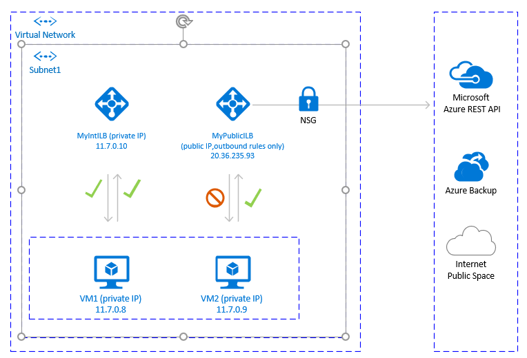
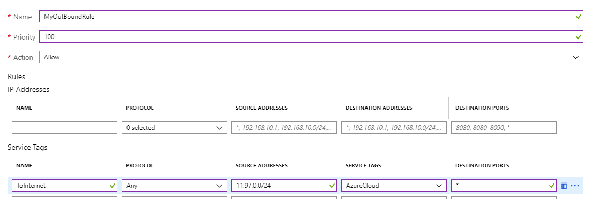

# Public endpoint connectivity for Virtual Machines using Azure Standard Load Balancer in SAP high-availability scenarios

The scope of this article is to describe configurations, that will enable outbound connectivity to public end point(s). The configurations are mainly in the context of High Availability with Pacemaker for SUSE / RHEL.  

If you are using Pacemaker with Azure fence agent in your high availability solution, then the VMs must have outbound connectivity to the Azure management API.  
The article presents several options to enable you to select the option that is best suited for your scenario.  

## Overview

When implementing high availability for SAP solutions via clustering, one of the necessary components is [Azure Load Balancer](https://docs.microsoft.com/azure/load-balancer/load-balancer-overview). Azure offers two load balancer SKUs: standard and basic.

Standard Azure load balancer offers some advantages over the Basic load balancer. For instance, it works across Azure Availability zones, it has better monitoring and logging capabilities for easier troubleshooting, reduced latency. The “HA ports” feature covers all ports, that is, it is no longer necessary to list all individual ports.  

There are some important differences between the basic and the standard SKU of Azure load balancer. One of them is the handling of outbound traffic to public end point. For full Basic versus Standard SKU load balancer comparison, see [Load Balancer SKU comparison](https://docs.microsoft.com/azure/load-balancer/load-balancer-overview).  
 
When VMs without public IP addresses are placed in the backend pool of internal (no public IP address) Standard Azure load balancer, there is no outbound connectivity to public end points, unless additional configuration is done.  

If a VM is assigned a public IP address, or the VM is in the backend pool of a load balancer with public IP address, it will have outbound connectivity to public end points.  

SAP systems often contain sensitive business data. It is rarely acceptable for VMs hosting SAP systems to have public IP addresses. At the same time, there are scenarios, which would require outbound connectivity from the VM to public end points.  

Examples of scenarios, requiring access to Azure public end point are:  
- Using Azure Fence Agent as a fencing mechanism in Pacemaker clusters
- Azure Backup
- Azure Site Recovery  
- Using public repository for patching the Operating system
- The SAP application data flow may require outbound connectivity to public end point

If your SAP deployment doesn’t require outbound connectivity to public end points, you don’t need to implement the additional configuration. It is sufficient to create internal standard SKU Azure Load Balancer for your high availability scenario, assuming that there is also no need for inbound connectivity from public end points.  

> [!Note]
> When VMs without public IP addresses are placed in the backend pool of internal (no public IP address) Standard Azure load balancer, there will be no outbound internet connectivity, unless additional configuration is performed to allow routing to public end points.  
>If the VMs have either public IP addresses or are already in the backend pool of Azure Load balancer with public IP address, the VM will already have outbound connectivity to public end points.


Read the following papers first:

* Azure Standard Load Balancer
  * [Azure Standard Load Balancer overview](https://docs.microsoft.com/azure/load-balancer/load-balancer-standard-overview) - comprehensive overview of Azure Standard Load balancer, important principles, concepts, and tutorials 
  * [Outbound connections in Azure](https://docs.microsoft.com/azure/load-balancer/load-balancer-outbound-connections#scenarios) - scenarios on how to achieve outbound connectivity in Azure
  * [Load balancer outbound rules](https://docs.microsoft.com/azure/load-balancer/load-balancer-outbound-rules-overview)- explains the concepts of load balancer outbound rules and how to create outbound rules
* Azure Firewall
  * [Azure Firewall Overview](https://docs.microsoft.com/azure/firewall/overview)- overview of Azure Firewall
  * [Tutorial: Deploy and configure Azure Firewall](https://docs.microsoft.com/azure/firewall/tutorial-firewall-deploy-portal) - instructions on how to configure Azure Firewall via Azure portal
* [Virtual Networks -User defined rules](https://docs.microsoft.com/azure/virtual-network/virtual-networks-udr-overview#user-defined) - Azure routing concepts and rules  
* [Security Groups Service Tags](https://docs.microsoft.com/azure/virtual-network/security-overview#service-tags) - how to simplify your Network Security Groups and Firewall configuration with service tags

## Additional external Azure Standard Load Balancer for outbound connections to internet

One option to achieve outbound connectivity to public end points, without allowing inbound connectivity to the VM from public end point, is to create a second load balancer with public IP address, add the VMs to the backend pool of the second load balancer and define only [outbound rules](https://docs.microsoft.com/azure/load-balancer/load-balancer-outbound-rules-overview).  
Use [Network Security Groups](https://docs.microsoft.com/azure/virtual-network/security-overview) to control the public end points, that are accessible for outbound calls from the VM.  
For more information, see Scenario 2 in document [Outbound connections](https://docs.microsoft.com/azure/load-balancer/load-balancer-outbound-connections#scenarios).  
The configuration would look like:  



### Important considerations

- You can use one additional Public Load Balancer for multiple VMs in the same subnet to achieve outbound connectivity to public end point and optimize cost  
- Use [Network Security Groups](https://docs.microsoft.com/azure/virtual-network/security-overview) to control which public end points are accessible from the VMs. You can assign the Network Security Group either to the subnet, or to each VM. Where possible, use [Service tags](https://docs.microsoft.com/azure/virtual-network/security-overview#service-tags) to reduce the complexity of the security rules.  
- Azure standard Load balancer with public IP address and outbound rules allows direct access to public end point. If you have corporate security requirements to have all outbound traffic pass via centralized corporate solution for auditing and logging, you may not be able to fulfill the requirement with this scenario.  

>[!TIP]
>Where possible, use [Service tags](https://docs.microsoft.com/azure/virtual-network/security-overview#service-tags) to reduce the complexity of the Network Security Group . 

### Deployment steps

1. Create Load Balancer  
   1. In the [Azure portal](https://portal.azure.com) , click All resources, Add, then search for **Load Balancer**  
   1. Click **Create** 
   1. Load Balancer Name **MyPublicILB**  
   1. Select **Public** as a Type, **Standard** as SKU  
   1. Select **Create Public IP address** and specify as a name **MyPublicILBFrondEndIP**  
   1. Select **Zone Redundant** as Availability zone  
   1. Click Review and Create, then click Create  
2. Create Backend pool **MyBackendPoolOfPublicILB** and add the VMs.  
   1. Select the Virtual network  
   1. Select the VMs and their IP addresses and add them to the backend pool  
3. [Create outbound rules](https://docs.microsoft.com/azure/load-balancer/configure-load-balancer-outbound-cli#create-outbound-rule). Currently it is not possible to create outbound rules from the Azure portal. You can create outbound rules with [Azure CLI](https://docs.microsoft.com/azure/cloud-shell/overview?view=azure-cli-latest).  

   ```
    az network lb outbound-rule create --address-pool MyBackendPoolOfPublicILB --frontend-ip-configs MyPublicILBFrondEndIP --idle-timeout 30 --lb-name MyPublicILB --name MyOutBoundRules  --outbound-ports 10000 --enable-tcp-reset true --protocol All --resource-group MyResourceGroup
   ```

4. Create Network Security group rules to restrict access to specific Public End Points. If there is existing Network Security Group, you can adjust it. The example below shows how to for allow access only to the Azure management API: 
   1. Navigate to the Network Security Group
   1. Click Outbound Security Rules
   1. Add a rule to **Deny** all outbound Access to **Internet**.
   1. Add a rule to **Allow** access to **AzureCloud**, with priority lower than the priority of the rule to deny all internet access.


   The outbound security rules would look like: 

   

   For more information on Azure Network security groups, see [Security Groups ](https://docs.microsoft.com/azure/virtual-network/security-overview). 

## Azure Firewall for outbound connections to internet

Another option to achieve outbound connectivity to public end points, without allowing inbound connectivity to the VM from public end points, is with Azure Firewall. Azure Firewall is a managed service, with built-in High Availability and it can span multiple Availability Zones.  
You will also need to deploy [User Defined Route](https://docs.microsoft.com/azure/virtual-network/virtual-networks-udr-overview#custom-routes), associated with subnet where VMs and the Azure load balancer are deployed, pointing to the Azure firewall, to route traffic through the Azure Firewall.  
For details on how to deploy Azure Firewall, see [Deploy And Configure Azure Firewall](https://docs.microsoft.com/azure/firewall/tutorial-firewall-deploy-portal).  

The architecture would look like:


### Important considerations

- Azure firewall is cloud native service, with built-in High Availability and it supports zonal deployment.
- Requires additional subnet that must be named AzureFirewallSubnet. 
- If transferring large data sets outbound of the virtual network where the SAP VMs are located, to a VM in another virtual network, or to public end point, it may not be cost effective solution. One such example is copying large backups across virtual networks. For details see Azure Firewall pricing.  
- If the corporate Firewall solution is not Azure Firewall, and you have security requirements to have all outbound traffic pass though centralized corporate solution, this solution may not be practical.  

>[!TIP]
>Where possible, use [Service tags](https://docs.microsoft.com/azure/virtual-network/security-overview#service-tags) to reduce the complexity of the Azure Firewall rules.  

### Deployment steps

1. The deployment steps assume that you already have Virtual network and subnet defined for your VMs.  
2. Create Subnet **AzureFirewallSubnet** in the same Virtual Network, where the VMS and the Standard Load Balancer are deployed.  
   1. In Azure portal, Navigate to the Virtual Network: Click All Resources, Search for the Virtual Network, Click on the Virtual Network, Select Subnets.  
   1. Click Add Subnet. Enter **AzureFirewallSubnet** as Name. Enter appropriate Address Range. Save.  
3. Create Azure Firewall.  
   1. In Azure portal select All resources, click Add, Firewall, Create. Select Resource group (select the same resource group, where the Virtual Network is).  
   1. Enter name for the Azure Firewall resource. For instance, **MyAzureFirewall**.  
   1. Select Region and select at least two Availability zones, aligned with the Availability zones where your VMs are deployed.  
   1. Select your Virtual Network, where the SAP VMs and Azure Standard Load balancer are deployed.  
   1. Public IP Address: Click create and enter a name. For Instance **MyFirewallPublicIP**.  
4. Create Azure Firewall Rule to allow outbound connectivity to specified public end points. The example shows how to allow access to the Azure Management API public endpoint.  
   1. Select Rules, Network Rule Collection, then click Add network rule collection.  
   1. Name: **MyOutboundRule**, enter Priority, Select Action **Allow**.  
   1. Service: Name **ToAzureAPI**.  Protocol: Select **Any**. Source Address: enter the range for your subnet,  where the VMs and Standard Load Balancer are deployed for instance: **11.97.0.0/24**. Destination ports: enter <b>*</b>.  
   1. Save
   1. As you are still positioned on the Azure Firewall, Select Overview. Note down the Private IP Address of the Azure Firewall.  
5. Create route to Azure Firewall  
   1. In Azure portal select All resources, then click Add, Route Table, Create.  
   1. Enter Name MyRouteTable, select Subscription, Resource group, and Location (matching the location of your Virtual network and Firewall).  
   1. Save  

   The firewall rule would look like:
   

6. Create User Defined Route from the subnet of your VMs to the private IP of **MyAzureFirewall**.
   1. As you are positioned on the Route Table, click Routes. Select Add. 
   1. Route name: ToMyAzureFirewall, Address prefix: **0.0.0.0/0**. Next hop type: Select Virtual Appliance. Next hop address: enter the private IP address of the firewall you configured: **11.97.1.4**.  
   1. Save

## Using Proxy for Pacemaker calls to Azure Management API

You could use proxy to allow Pacemaker calls to the Azure management API public end point.  

### Important considerations

  - If there is already corporate proxy in place, you could route outbound calls to public end points through it. Outbound calls to public end points will go through the corporate control point.  
  - Make sure the proxy configuration allows outbound connectivity to Azure management API: https://management.azure.com  
  - Make sure there is a route from the VMs to the Proxy  
  - Proxy will handle only HTTP/HTTPS calls. If there is additional need to make outbound calls to public end point over different protocols (like RFC), alternative solution will be needed  
  - The Proxy solution must be highly available, to avoid instability in the Pacemaker cluster  
  - Depending on the location of the proxy, it may introduce additional latency in the calls from the Azure Fence Agent to the Azure Management API. If your corporate proxy is still on the premises, while your Pacemaker cluster is in Azure, measure latency and consider, if this solution is suitable for you  
  - If there isn’t already highly available corporate proxy in place, we do not recommend this option as the customer would be incurring extra cost and complexity. Nevertheless, if you decide to deploy additional proxy solution, for the purpose of allowing outbound connectivity from Pacemaker to Azure Management public API, make sure the proxy is highly available, and the latency from the VMs to the proxy is low.  

### Pacemaker configuration with Proxy 

There are many different Proxy options available in the industry. Step-by-step instructions for the proxy deployment are outside of the scope of this document. In the example below, we assume that your proxy is responding to **MyProxyService** and listening to port **MyProxyPort**.  
To allow pacemaker to communicate with the Azure management API, perform the following steps on all cluster nodes:  

1. Edit the pacemaker configuration file /etc/sysconfig/pacemaker and add the following lines (all cluster nodes):  
   ```
   sudo vi /etc/sysconfig/pacemaker
   # Add the following lines
   http_proxy=http://MyProxyService:MyProxyPort
   https_proxy=http://MyProxyService:MyProxyPort
   ```

2. Restart the pacemaker service on **all** cluster nodes.  
  - SUSE  
     ```
     # Place the cluster in maintenance mode
     sudo pcs property set maintenance-mode=true
     #Restart on all nodes
     sudo systemctl restart pacemaker
     # Take the cluster out of maintenance mode
     sudo pcs property set maintenance-mode=false
     ```

  - Red Hat  
     ```
     # Place the cluster in maintenance mode
     sudo pcs property set maintenance-mode=true
     #Restart on all nodes
     sudo systemctl restart pacemaker
     # Take the cluster out of maintenance mode
     sudo pcs property set maintenance-mode=false
     ```

## Next steps

* [Learn how to configure Pacemaker on SUSE in Azure](https://docs.microsoft.com/azure/virtual-machines/workloads/sap/high-availability-guide-suse-pacemaker)
* [Learn how to configure Pacemaker on Red Hat in Azure](https://docs.microsoft.com/azure/virtual-machines/workloads/sap/high-availability-guide-rhel-pacemaker)
