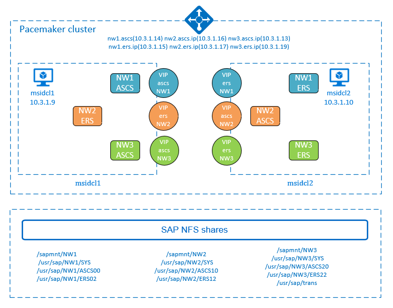
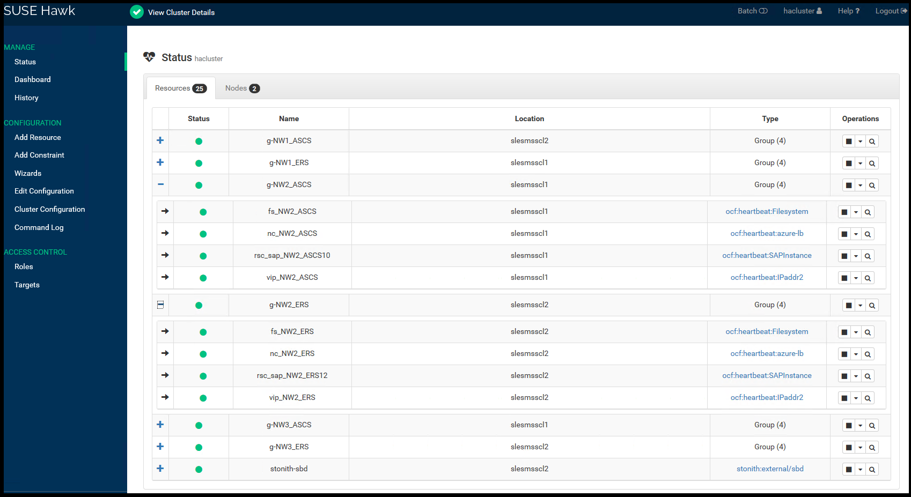

# High availability for SAP NetWeaver on Azure VMs on SUSE Linux Enterprise Server for SAP applications multi-SID guide

[dbms-guide]:dbms-guide.md
[deployment-guide]:deployment-guide.md
[planning-guide]:planning-guide.md

[2205917]:https://launchpad.support.sap.com/#/notes/2205917
[1944799]:https://launchpad.support.sap.com/#/notes/1944799
[1928533]:https://launchpad.support.sap.com/#/notes/1928533
[2015553]:https://launchpad.support.sap.com/#/notes/2015553
[2178632]:https://launchpad.support.sap.com/#/notes/2178632
[2191498]:https://launchpad.support.sap.com/#/notes/2191498
[2243692]:https://launchpad.support.sap.com/#/notes/2243692
[1984787]:https://launchpad.support.sap.com/#/notes/1984787
[1999351]:https://launchpad.support.sap.com/#/notes/1999351
[1410736]:https://launchpad.support.sap.com/#/notes/1410736

[sap-swcenter]:https://support.sap.com/en/my-support/software-downloads.html

[suse-ha-guide]:https://www.suse.com/products/sles-for-sap/resource-library/sap-best-practices/
[suse-drbd-guide]:https://www.suse.com/documentation/sle-ha-12/singlehtml/book_sleha_techguides/book_sleha_techguides.html
[suse-ha-12sp3-relnotes]:https://www.suse.com/releasenotes/x86_64/SLE-HA/12-SP3/

[template-multisid-xscs]:https://portal.azure.com/#create/Microsoft.Template/uri/https%3A%2F%2Fraw.githubusercontent.com%2FAzure%2Fazure-quickstart-templates%2Fmaster%2Fsap-3-tier-marketplace-image-multi-sid-xscs-md%2Fazuredeploy.json
[template-converged]:https://portal.azure.com/#create/Microsoft.Template/uri/https%3A%2F%2Fraw.githubusercontent.com%2FAzure%2Fazure-quickstart-templates%2Fmaster%2Fsap-3-tier-marketplace-image-converged-md%2Fazuredeploy.json
[template-file-server]:https://portal.azure.com/#create/Microsoft.Template/uri/https%3A%2F%2Fraw.githubusercontent.com%2FAzure%2Fazure-quickstart-templates%2Fmaster%2Fsap-file-server-md%2Fazuredeploy.json

[sap-hana-ha]:sap-hana-high-availability.md
[nfs-ha]:high-availability-guide-suse-nfs.md

This article describes how to deploy multiple SAP NetWeaver or S4HANA highly available systems(that is, multi-SID) in a two node cluster on Azure VMs with SUSE Linux Enterprise Server for SAP applications.  

In the example configurations, installation commands etc. three SAP NetWeaver 7.50 systems are deployed in a single, two node high availability cluster. The SAP systems SIDs are:
* **NW1**: ASCS instance number **00** and virtual host name **msnw1ascs**; ERS instance number **02** and virtual host name **msnw1ers**.  
* **NW2**: ASCS instance number **10** and virtual hostname **msnw2ascs**; ERS instance number **12** and virtual host name **msnw2ers**.  
* **NW3**: ASCS instance number **20** and virtual hostname **msnw3ascs**; ERS instance number **22** and virtual host name **msnw3ers**.  

The article doesn't cover the database layer and the deployment of the SAP NFS shares. 
In the examples in this article, we are using virtual names nw2-nfs for the NW2 NFS shares and nw3-nfs for the NW3 NFS shares, assuming that NFS cluster was deployed.  

Before you begin, refer to the following SAP Notes and papers first:

* SAP Note [1928533][1928533], which has:
  * List of Azure VM sizes that are supported for the deployment of SAP software
  * Important capacity information for Azure VM sizes
  * Supported SAP software, and operating system (OS) and database combinations
  * Required SAP kernel version for Windows and Linux on Microsoft Azure

* SAP Note [2015553][2015553] lists prerequisites for SAP-supported SAP software deployments in Azure.
* SAP Note [2205917][2205917] has recommended OS settings for SUSE Linux Enterprise Server for SAP Applications
* SAP Note [1944799][1944799] has SAP HANA Guidelines for SUSE Linux Enterprise Server for SAP Applications
* SAP Note [2178632][2178632] has detailed information about all monitoring metrics reported for SAP in Azure.
* SAP Note [2191498][2191498] has the required SAP Host Agent version for Linux in Azure.
* SAP Note [2243692][2243692] has information about SAP licensing on Linux in Azure.
* SAP Note [1984787][1984787] has general information about SUSE Linux Enterprise Server 12.
* SAP Note [1999351][1999351] has additional troubleshooting information for the Azure Enhanced Monitoring Extension for SAP.
* [SAP Community WIKI](https://wiki.scn.sap.com/wiki/display/HOME/SAPonLinuxNotes) has all required SAP Notes for Linux.
* [Azure Virtual Machines planning and implementation for SAP on Linux][planning-guide]
* [Azure Virtual Machines deployment for SAP on Linux][deployment-guide]
* [Azure Virtual Machines DBMS deployment for SAP on Linux][dbms-guide]
* [SUSE SAP HA Best Practice Guides][suse-ha-guide]
  The guides contain all required information to set up Netweaver HA and SAP HANA System Replication on-premises. Use these guides as a general baseline. They provide much more detailed information.
* [SUSE High Availability Extension 12 SP3 Release Notes][suse-ha-12sp3-relnotes]
* [SUSE Support for multi-SID cluster](https://www.suse.com/c/sap-workloads-going-green/)

## Overview

The virtual machines, that participate in the cluster must be sized to be able to run all resources, in case failover occurs. Each SAP SID can fail over independent from each other in the multi-SID high availability cluster.  If using SBD fencing, the SBD devices can be shared between multiple clusters.  

To achieve high availability, SAP NetWeaver requires highly available NFS shares. In this example we assume the SAP NFS shares are either hosted on highly available [NFS file server](https://docs.microsoft.com/azure/virtual-machines/workloads/sap/high-availability-guide-suse-nfs), which can be used by multiple SAP systems. Or the shares are deployed on [Azure NetApp files NFS volumes](https://docs.microsoft.com/azure/azure-netapp-files/azure-netapp-files-create-volumes).  



> [!IMPORTANT]
> The support for multi-SID clustering of SAP ASCS/ERS with SUSE Linux as guest operating system in Azure VMs is limited to **five** SAP SIDs on the same cluster. Each new SID increases the complexity. A mix of SAP Enqueue Replication Server 1 and Enqueue Replication Server 2 on the same cluster is **not supported**. Multi-SID clustering describes the installation of multiple SAP ASCS/ERS instances with different SIDs in one Pacemaker cluster. Currently multi-SID clustering is only supported for ASCS/ERS.  

> [!TIP]
> The multi-SID clustering of SAP ASCS/ERS is a solution with higher complexity. It is more complex to implement. It also involves higher administrative effort, when executing maintenance activities (like OS patching). Before you start the actual implementation, take time to carefully plan out the deployment and all involved components like VMs, NFS mounts, VIPs, load balancer configurations and so on.  

The NFS server, SAP NetWeaver ASCS, SAP NetWeaver SCS, SAP NetWeaver ERS, and the SAP HANA database use virtual hostname and virtual IP addresses. On Azure, a load balancer is required to use a virtual IP address. We recommend using [Standard load balancer](https://docs.microsoft.com/azure/load-balancer/quickstart-load-balancer-standard-public-portal).  

The following list shows the configuration of the (A)SCS and ERS load balancer for this multi-SID cluster example with three SAP systems. You will need separate frontend IP, health probes, and load-balancing rules for each ASCS and ERS instance for each of the SIDs. Assign all VMs, that are part of the ASCS/ASCS cluster to one backend pool.  

### (A)SCS

* Frontend configuration
  * IP address for NW1:  10.3.1.14
  * IP address for NW2:  10.3.1.16
  * IP address for NW3:  10.3.1.13
* Backend configuration
  * Connected to primary network interfaces of all virtual machines that should be part of the (A)SCS/ERS cluster
* Probe Ports
  * Port 620<strong>&lt;nr&gt;</strong>, therefore for NW1, NW2, and NW3 probe ports 620**00**, 620**10** and 620**20**
* Load-balancing rules - 
* create one for each instance, that is, NW1/ASCS, NW2/ASCS and NW3/ASCS.
  * If using Standard Load Balancer, select **HA ports**
  * If using Basic Load Balancer, create Load balancing rules for the following ports
    * 32<strong>&lt;nr&gt;</strong> TCP
    * 36<strong>&lt;nr&gt;</strong> TCP
    * 39<strong>&lt;nr&gt;</strong> TCP
    * 81<strong>&lt;nr&gt;</strong> TCP
    * 5<strong>&lt;nr&gt;</strong>13 TCP
    * 5<strong>&lt;nr&gt;</strong>14 TCP
    * 5<strong>&lt;nr&gt;</strong>16 TCP

### ERS

* Frontend configuration
  * IP address for NW1 10.3.1.15
  * IP address for NW2 10.3.1.17
  * IP address for NW3 10.3.1.19
* Backend configuration
  * Connected to primary network interfaces of all virtual machines that should be part of the (A)SCS/ERS cluster
* Probe Port
  * Port 621<strong>&lt;nr&gt;</strong>, therefore for NW1, NW2, and N# probe ports 621**02**, 621**12** and 621**22**
* Load-balancing rules - create one for each instance, that is, NW1/ERS, NW2/ERS and NW3/ERS.
  * If using Standard Load Balancer, select **HA ports**
  * If using Basic Load Balancer, create Load balancing rules for the following ports
    * 32<strong>&lt;nr&gt;</strong> TCP
    * 33<strong>&lt;nr&gt;</strong> TCP
    * 5<strong>&lt;nr&gt;</strong>13 TCP
    * 5<strong>&lt;nr&gt;</strong>14 TCP
    * 5<strong>&lt;nr&gt;</strong>16 TCP


> [!Note]
> When VMs without public IP addresses are placed in the backend pool of internal (no public IP address) Standard Azure load balancer, there will be no outbound internet connectivity, unless additional configuration is performed to allow routing to public end points. For details on how to achieve outbound connectivity see [Public endpoint connectivity for Virtual Machines using Azure Standard Load Balancer in SAP high-availability scenarios](https://docs.microsoft.com/azure/virtual-machines/workloads/sap/high-availability-guide-standard-load-balancer-outbound-connections).  

> [!IMPORTANT]
> Do not enable TCP timestamps on Azure VMs placed behind Azure Load Balancer. Enabling TCP timestamps will cause the health probes to fail. Set parameter **net.ipv4.tcp_timestamps** to **0**. For details see [Load Balancer health probes](https://docs.microsoft.com/azure/load-balancer/load-balancer-custom-probe-overview).

## SAP NFS shares

SAP NetWeaver requires shared storage for the transport, profile directory, and so on. For highly available SAP system, it is important to have highly available NFS shares. You will need to decide on the architecture for your SAP NFS shares. One option is to build [Highly available NFS cluster on Azure VMs on SUSE Linux Enterprise Server][nfs-ha], which can be shared between multiple SAP systems. 

Another option is to deploy the shares on [Azure NetApp files NFS volumes](https://docs.microsoft.com/azure/azure-netapp-files/azure-netapp-files-create-volumes).  With Azure NetApp Files, you will get built-in high availability for the SAP NFS shares.

## Deploy the first SAP system in the cluster

Now that you have decided on the architecture for the SAP NFS shares, deploy the first SAP system in the cluster, following the corresponding documentation.

* If using highly available NFS server, follow [High availability for SAP NetWeaver on Azure VMs on SUSE Linux Enterprise Server for SAP applications](https://docs.microsoft.com/azure/virtual-machines/workloads/sap/high-availability-guide-suse).  
* If using Azure NetApp Files NFS volumes, follow [High availability for SAP NetWeaver on Azure VMs on SUSE Linux Enterprise Server with Azure NetApp Files for SAP applications](https://docs.microsoft.com/azure/virtual-machines/workloads/sap/high-availability-guide-suse-netapp-files)

The documents listed above will guide you through the steps to prepare the necessary infrastructures, build the cluster, prepare the  OS for running the SAP application.  

> [!TIP]
> Always test the fail over functionality of the cluster, after the first system is deployed, before adding the additional SAP SIDs to the cluster. That way you will know that the cluster functionality works, before adding the complexity of additional SAP systems to the cluster.   

## Deploy additional SAP systems in the cluster

In this example, we assume that system **NW1** was already deployed in the cluster. We will show how to deploy in the cluster SAP systems **NW2** and **NW3**. 

The following items are prefixed with either **[A]** - applicable to all nodes, **[1]** - only applicable to node 1 or **[2]** - only applicable to node 2.

### Prerequisites 

> [!IMPORTANT]
> Before following the instructions to deploy additional SAP systems in the cluster, follow the instructions to deploy the first SAP system in the cluster, as there are steps which are only necessary during the first system deployment.  

This documentation assumes that:
* The Pacemaker cluster is already configured and running.  
* At least one SAP system (ASCS / ERS instance) is already deployed and is running in the cluster.  
* The cluster fail over functionality has been tested.  
* The NFS shares for all SAP systems are deployed.  

### Prepare for SAP NetWeaver Installation

1. Add configuration for the newly deployed system (that is, **NW2**, **NW3**) to the existing Azure Load Balancer, following the instructions [Deploy Azure Load Balancer manually via Azure portal](https://docs.microsoft.com/azure/virtual-machines/workloads/sap/high-availability-guide-suse-netapp-files#deploy-azure-load-balancer-manually-via-azure-portal). Adjust the IP addresses, health probe ports, load-balancing rules for your configuration.  

2. **[A]** Set up name resolution for the additional SAP systems. You can either use DNS server or modify `/etc/hosts` on all nodes. This example shows how to use the `/etc/hosts` file.  Adapt the IP addresses and the host names to your environment. 

    ```
    sudo vi /etc/hosts
    # IP address of the load balancer frontend configuration for NW2 ASCS
    10.3.1.16 msnw2ascs
    # IP address of the load balancer frontend configuration for NW3 ASCS
    10.3.1.13 msnw3ascs
    # IP address of the load balancer frontend configuration for NW2 ERS
    10.3.1.17 msnw2ers
    # IP address of the load balancer frontend configuration for NW3 ERS
    10.3.1.19 msnw3ers
    # IP address for virtual host name for the NFS server for NW2
    10.3.1.31 nw2-nfs
    # IP address for virtual host name for the NFS server for NW3
    10.3.1.32 nw3-nfs
   ```

3. **[A]** Create the shared directories for the additional **NW2** and **NW3** SAP systems that you are deploying to the cluster. 

    ```
    sudo mkdir -p /sapmnt/NW2
    sudo mkdir -p /usr/sap/NW2/SYS
    sudo mkdir -p /usr/sap/NW2/ASCS10
    sudo mkdir -p /usr/sap/NW2/ERS12
    sudo mkdir -p /sapmnt/NW3
    sudo mkdir -p /usr/sap/NW3/SYS
    sudo mkdir -p /usr/sap/NW3/ASCS20
    sudo mkdir -p /usr/sap/NW3/ERS22

    
    sudo chattr +i /sapmnt/NW2
    sudo chattr +i /usr/sap/NW2/SYS
    sudo chattr +i /usr/sap/NW2/ASCS10
    sudo chattr +i /usr/sap/NW2/ERS12
    sudo chattr +i /sapmnt/NW3
    sudo chattr +i /usr/sap/NW3/SYS
    sudo chattr +i /usr/sap/NW3/ASCS20
    sudo chattr +i /usr/sap/NW3/ERS22
   ```

4. **[A]** Configure `autofs` to mount the /sapmnt/SID and /usr/sap/SID/SYS file systems for the additional SAP systems that you are deploying to the cluster. In this example **NW2** and **NW3**.  

   Update file `/etc/auto.direct` with the file systems for the additional SAP systems that you are deploying to the cluster.  

   * If using NFS file server, follow the instructions [here](https://docs.microsoft.com/azure/virtual-machines/workloads/sap/high-availability-guide-suse#prepare-for-sap-netweaver-installation)
   * If using Azure NetApp Files, follow the instructions [here](https://docs.microsoft.com/azure/virtual-machines/workloads/sap/high-availability-guide-suse-netapp-files#prepare-for-sap-netweaver-installation) 

   You will need to restart the `autofs` service to mount the newly added shares.  

### Install ASCS / ERS

1. Create the virtual IP and health probe cluster resources for the ASCS instance of the additional SAP system you are deploying to the cluster. The example shown here is for **NW2** and **NW3** ASCS, using highly available NFS server.  

   > [!IMPORTANT]
   > Recent testing revealed situations, where netcat stops responding to requests due to backlog and its limitation of handling only one connection. The netcat resource stops listening to the Azure Load balancer requests and the floating IP becomes unavailable.  
   > 
   > For existing Pacemaker clusters, we recommend replacing netcat with socat, following the instructions in [Azure Load-Balancer Detection Hardening](https://www.suse.com/support/kb/doc/?id=7024128). Note that the change will require brief downtime.  

    ```
      sudo crm configure primitive fs_NW2_ASCS Filesystem device='nw2-nfs:/NW2/ASCS' directory='/usr/sap/NW2/ASCS10' fstype='nfs4' \
       op start timeout=60s interval=0 \
       op stop timeout=60s interval=0 \
       op monitor interval=20s timeout=40s
   
      sudo crm configure primitive vip_NW2_ASCS IPaddr2 \
        params ip=10.3.1.16 cidr_netmask=24 \
        op monitor interval=10 timeout=20
   
      sudo crm configure primitive nc_NW2_ASCS anything \
        params binfile="/usr/bin/socat" cmdline_options="-U TCP-LISTEN:62010,backlog=10,fork,reuseaddr /dev/null" \
        op monitor timeout=20s interval=10 depth=0
   
      sudo crm configure group g-NW2_ASCS fs_NW2_ASCS nc_NW2_ASCS vip_NW2_ASCS \
         meta resource-stickiness=3000

      sudo crm configure primitive fs_NW3_ASCS Filesystem device='nw3-nfs:/NW3/ASCS' directory='/usr/sap/NW3/ASCS20' fstype='nfs4' \
        op start timeout=60s interval=0 \
        op stop timeout=60s interval=0 \
        op monitor interval=20s timeout=40s
   
      sudo crm configure primitive vip_NW3_ASCS IPaddr2 \
       params ip=10.3.1.13 cidr_netmask=24 \
       op monitor interval=10 timeout=20
   
      sudo crm configure primitive nc_NW3_ASCS anything \
        params binfile="/usr/bin/socat" cmdline_options="-U TCP-LISTEN:62020,backlog=10,fork,reuseaddr /dev/null" \
        op monitor timeout=20s interval=10 depth=0
   
      sudo crm configure group g-NW3_ASCS fs_NW3_ASCS nc_NW3_ASCS vip_NW3_ASCS \
        meta resource-stickiness=3000
    ```

   As you creating the resources they may be assigned to different cluster resources. When you group them, they will migrate to one of the cluster nodes. Make sure the cluster status is ok and that all resources are started. It is not important on which node the resources are running.

2. **[1]** Install SAP NetWeaver ASCS  

   Install SAP NetWeaver ASCS as root, using a virtual hostname that maps to the IP address of the load balancer frontend configuration for the ASCS. For example, for system **NW2**, the virtual hostname is <b>msnw2ascs</b>, <b>10.3.1.16</b> and the instance number that you used for the probe of the load balancer, for example <b>10</b>. for system **NW3**, the virtual hostname is <b>msnw3ascs</b>, <b>10.3.1.13</b> and the instance number that you used for the probe of the load balancer, for example <b>20</b>.

   You can use the sapinst parameter SAPINST_REMOTE_ACCESS_USER to allow a non-root user to connect to sapinst. You can use parameter SAPINST_USE_HOSTNAME to install SAP, using virtual host name.  

     ```
      sudo swpm/sapinst SAPINST_REMOTE_ACCESS_USER=sapadmin SAPINST_USE_HOSTNAME=virtual_hostname
     ```

   If the installation fails to create a subfolder in /usr/sap/**SID**/ASCS**Instance#**, try setting the owner to **sid**adm and group to sapsys of the ASCS**Instance#** and retry.

3. **[1]** Create a virtual IP and health-probe cluster resources for the ERS instance of the additional SAP system you are deploying to the cluster. The example shown here is for **NW2** and **NW3** ERS, using highly available NFS server. 

   ```
    sudo crm configure primitive fs_NW2_ERS Filesystem device='nw2-nfs:/NW2/ASCSERS' directory='/usr/sap/NW2/ERS12' fstype='nfs4' \
      op start timeout=60s interval=0 \
      op stop timeout=60s interval=0 \
      op monitor interval=20s timeout=40s
   
    sudo crm configure primitive vip_NW2_ERS IPaddr2 \
      params ip=10.3.1.17 cidr_netmask=24 \
      op monitor interval=10 timeout=20
   
    sudo crm configure primitive nc_NW2_ERS anything \
     params binfile="/usr/bin/socat" cmdline_options="-U TCP-LISTEN:62112,backlog=10,fork,reuseaddr /dev/null" \
     op monitor timeout=20s interval=10 depth=0
   
    # WARNING: Resources nc_NW2_ASCS,nc_NW2_ERS violate uniqueness for parameter "binfile": "/usr/bin/socat"
    # Do you still want to commit (y/n)? y
   
    sudo crm configure group g-NW2_ERS fs_NW2_ERS nc_NW2_ERS vip_NW2_ERS

    sudo crm configure primitive fs_NW3_ERS Filesystem device='nw3-nfs:/NW3/ASCSERS' directory='/usr/sap/NW3/ERS22' fstype='nfs4' \
      op start timeout=60s interval=0 \
      op stop timeout=60s interval=0 \
      op monitor interval=20s timeout=40s
   
    sudo crm configure primitive vip_NW3_ERS IPaddr2 \
      params ip=10.3.1.19 cidr_netmask=24 \
      op monitor interval=10 timeout=20
   
    sudo crm configure primitive nc_NW3_ERS anything \
     params binfile="/usr/bin/socat" cmdline_options="-U TCP-LISTEN:62122,backlog=10,fork,reuseaddr /dev/null" \
     op monitor timeout=20s interval=10 depth=0
   
    # WARNING: Resources nc_NW3_ASCS,nc_NW3_ERS violate uniqueness for parameter "binfile": "/usr/bin/socat"
    # Do you still want to commit (y/n)? y
   
    sudo crm configure group g-NW3_ERS fs_NW3_ERS nc_NW3_ERS vip_NW3_ERS
   ```

   As you creating the resources they may be assigned to different cluster nodes. When you group them, they will migrate to one of the cluster nodes. Make sure the cluster status is ok and that all resources are started.  

   Next, make sure that the resources of the newly created ERS group, are running on the cluster node, opposite to the cluster node where the ASCS instance for the same SAP system was installed.  For example, if NW2 ASCS was installed on `slesmsscl1`, then make sure the NW2 ERS group is running on `slesmsscl2`.  You can migrate the  NW2 ERS group to `slesmsscl2` by running the following command: 

    ```
      crm resource migrate g-NW2_ERS slesmsscl2 force
    ```

4. **[2]** Install SAP NetWeaver ERS

   Install SAP NetWeaver ERS as root on the other node, using a virtual hostname that maps to the IP address of the load balancer frontend configuration for the ERS. For example for system **NW2**, the virtual host name will be <b>msnw2ers</b>, <b>10.3.1.17</b> and the instance number that you used for the probe of the load balancer, for example <b>12</b>. For system **NW3**, the virtual host name <b>msnw3ers</b>, <b>10.3.1.19</b> and the instance number that you used for the probe of the load balancer, for example <b>22</b>. 

   You can use the sapinst parameter SAPINST_REMOTE_ACCESS_USER to allow a non-root user to connect to sapinst. You can use parameter SAPINST_USE_HOSTNAME to install SAP, using virtual host name.  

    ```
     sudo swpm/sapinst SAPINST_REMOTE_ACCESS_USER=sapadmin SAPINST_USE_HOSTNAME=virtual_hostname
    ```

   > [!NOTE]
   > Use SWPM SP 20 PL 05 or higher. Lower versions do not set the permissions correctly and the installation will fail.

   If the installation fails to create a subfolder in /usr/sap/**NW2**/ERS**Instance#**, try setting the owner to **sid**adm and the group to sapsys of the ERS**Instance#** folder and retry.

   If it was necessary for you to migrate the ERS group of the newly deployed SAP system to a different cluster node, don't forget to remove the location constraint for the ERS group. You can remove the constraint by running the following command (the example is given for SAP systems **NW2** and **NW3**).  

    ```
      crm resource unmigrate g-NW2_ERS
      crm resource unmigrate g-NW3_ERS
    ```

5. **[1]** Adapt the ASCS/SCS and ERS instance profiles for the newly installed SAP system(s). The example shown below is for NW2. You will need to adapt the ASCS/SCS and ERS profiles for all SAP instances added to the cluster.  
 
 * ASCS/SCS profile

   ```
   sudo vi /sapmnt/NW2/profile/NW2_ASCS10_msnw2ascs
   
   # Change the restart command to a start command
   #Restart_Program_01 = local $(_EN) pf=$(_PF)
   Start_Program_01 = local $(_EN) pf=$(_PF)
   
   # Add the following lines
   service/halib = $(DIR_CT_RUN)/saphascriptco.so
   service/halib_cluster_connector = /usr/bin/sap_suse_cluster_connector
   
   # Add the keep alive parameter
   enque/encni/set_so_keepalive = true
   ```

 * ERS profile

   ```
   sudo vi /sapmnt/NW2/profile/NW2_ERS12_msnw2ers
   
   # Change the restart command to a start command
   #Restart_Program_00 = local $(_ER) pf=$(_PFL) NR=$(SCSID)
   Start_Program_00 = local $(_ER) pf=$(_PFL) NR=$(SCSID)
   
   # Add the following lines
   service/halib = $(DIR_CT_RUN)/saphascriptco.so
   service/halib_cluster_connector = /usr/bin/sap_suse_cluster_connector
   
   # remove Autostart from ERS profile
   # Autostart = 1
   ```

6. **[A]** Configure the SAP users for the newly deployed SAP system, in this example **NW2** and **NW3**. 

   ```
   # Add sidadm to the haclient group
   sudo usermod -aG haclient nw2adm
   sudo usermod -aG haclient nw3adm
   ```

7. Add the ASCS and ERS SAP services for the newly installed SAP system to the `sapservice` file. The example shown below is for SAP systems **NW2** and **NW3**.  

   Add the ASCS service entry to the second node and copy the ERS service entry to the first node. Execute the commands for each SAP system on the node, where the ASCS instance for the SAP system was installed.  

    ```
     # Execute the following commands on slesmsscl1,assuming the NW2 ASCS instance was installed on slesmsscl1
     cat /usr/sap/sapservices | grep ASCS10 | sudo ssh slesmsscl2 "cat >>/usr/sap/sapservices"
     sudo ssh slesmsscl2 "cat /usr/sap/sapservices" | grep ERS12 | sudo tee -a /usr/sap/sapservices
     # Execute the following commands on slesmsscl2, assuming the NW3 ASCS instance was installed on slesmsscl2
     cat /usr/sap/sapservices | grep ASCS20 | sudo ssh slesmsscl1 "cat >>/usr/sap/sapservices"
     sudo ssh slesmsscl1 "cat /usr/sap/sapservices" | grep ERS22 | sudo tee -a /usr/sap/sapservices
    ```

8. **[1]** Create the SAP cluster resources for the newly installed SAP system. 

   If using enqueue server 1 architecture (ENSA1), define the resources for SAP systems **NW2** and **NW3** as follows:

    ```
     sudo crm configure property maintenance-mode="true"
    
     sudo crm configure primitive rsc_sap_NW2_ASCS10 SAPInstance \
      operations \$id=rsc_sap_NW2_ASCS10-operations \
      op monitor interval=11 timeout=60 on_fail=restart \
      params InstanceName=NW2_ASCS10_msnw2ascs START_PROFILE="/sapmnt/NW2/profile/NW2_ASCS10_msnw2ascs" \
      AUTOMATIC_RECOVER=false \
      meta resource-stickiness=5000 failure-timeout=60 migration-threshold=1 priority=10
    
     sudo crm configure primitive rsc_sap_NW2_ERS12 SAPInstance \
      operations \$id=rsc_sap_NW2_ERS12-operations \
      op monitor interval=11 timeout=60 on_fail=restart \
      params InstanceName=NW2_ERS12_msnw2ers START_PROFILE="/sapmnt/NW2/profile/NW2_ERS12_msnw2ers" AUTOMATIC_RECOVER=false IS_ERS=true \
      meta priority=1000
    
     sudo crm configure modgroup g-NW2_ASCS add rsc_sap_NW2_ASCS10
     sudo crm configure modgroup g-NW2_ERS add rsc_sap_NW2_ERS12
    
     sudo crm configure colocation col_sap_NW2_no_both -5000: g-NW2_ERS g-NW2_ASCS
     sudo crm configure location loc_sap_NW2_failover_to_ers rsc_sap_NW2_ASCS10 rule 2000: runs_ers_NW2 eq 1
     sudo crm configure order ord_sap_NW2_first_start_ascs Optional: rsc_sap_NW2_ASCS10:start rsc_sap_NW2_ERS12:stop symmetrical=false
   
     sudo crm configure primitive rsc_sap_NW3_ASCS20 SAPInstance \
      operations \$id=rsc_sap_NW3_ASCS20-operations \
      op monitor interval=11 timeout=60 on_fail=restart \
      params InstanceName=NW3_ASCS10_msnw3ascs START_PROFILE="/sapmnt/NW3/profile/NW3_ASCS20_msnw3ascs" \
      AUTOMATIC_RECOVER=false \
      meta resource-stickiness=5000 failure-timeout=60 migration-threshold=1 priority=10
    
     sudo crm configure primitive rsc_sap_NW3_ERS22 SAPInstance \
      operations \$id=rsc_sap_NW3_ERS22-operations \
      op monitor interval=11 timeout=60 on_fail=restart \
      params InstanceName=NW3_ERS22_msnw3ers START_PROFILE="/sapmnt/NW3/profile/NW3_ERS22_msnw2ers" AUTOMATIC_RECOVER=false IS_ERS=true \
      meta priority=1000
    
     sudo crm configure modgroup g-NW3_ASCS add rsc_sap_NW3_ASCS20
     sudo crm configure modgroup g-NW3_ERS add rsc_sap_NW3_ERS22
    
     sudo crm configure colocation col_sap_NW3_no_both -5000: g-NW3_ERS g-NW3_ASCS
     sudo crm configure location loc_sap_NW3_failover_to_ers rsc_sap_NW3_ASCS10 rule 2000: runs_ers_NW3 eq 1
     sudo crm configure order ord_sap_NW3_first_start_ascs Optional: rsc_sap_NW3_ASCS20:start rsc_sap_NW3_ERS22:stop symmetrical=false
     sudo crm configure property maintenance-mode="false"
    ```

   SAP introduced support for enqueue server 2, including replication, as of SAP NW 7.52. Starting with ABAP Platform 1809, enqueue server 2 is installed by default. See SAP note [2630416](https://launchpad.support.sap.com/#/notes/2630416) for enqueue server 2 support.
   If using enqueue server 2 architecture ([ENSA2](https://help.sap.com/viewer/cff8531bc1d9416d91bb6781e628d4e0/1709%20001/en-US/6d655c383abf4c129b0e5c8683e7ecd8.html)), define the resources for SAP systems **NW2** and **NW3** as follows:

    ```
     sudo crm configure property maintenance-mode="true"
    
     sudo crm configure primitive rsc_sap_NW2_ASCS10 SAPInstance \
      operations \$id=rsc_sap_NW2_ASCS10-operations \
      op monitor interval=11 timeout=60 on_fail=restart \
      params InstanceName=NW2_ASCS10_msnw2ascs START_PROFILE="/sapmnt/NW2/profile/NW2_ASCS10_msnw2ascs" \
      AUTOMATIC_RECOVER=false \
      meta resource-stickiness=5000 
    
     sudo crm configure primitive rsc_sap_NW2_ERS12 SAPInstance \
      operations \$id=rsc_sap_NW2_ERS12-operations \
      op monitor interval=11 timeout=60 on_fail=restart \
      params InstanceName=NW2_ERS12_msnw2ers START_PROFILE="/sapmnt/NW2/profile/NW2_ERS12_msnw2ers" AUTOMATIC_RECOVER=false IS_ERS=true 
    
     sudo crm configure modgroup g-NW2_ASCS add rsc_sap_NW2_ASCS10
     sudo crm configure modgroup g-NW2_ERS add rsc_sap_NW2_ERS12
    
     sudo crm configure colocation col_sap_NW2_no_both -5000: g-NW2_ERS g-NW2_ASCS
     sudo crm configure order ord_sap_NW2_first_start_ascs Optional: rsc_sap_NW2_ASCS10:start rsc_sap_NW2_ERS12:stop symmetrical=false
   
     sudo crm configure primitive rsc_sap_NW3_ASCS20 SAPInstance \
      operations \$id=rsc_sap_NW3_ASCS20-operations \
      op monitor interval=11 timeout=60 on_fail=restart \
      params InstanceName=NW3_ASCS10_msnw3ascs START_PROFILE="/sapmnt/NW3/profile/NW3_ASCS20_msnw3ascs" \
      AUTOMATIC_RECOVER=false \
      meta resource-stickiness=5000
    
     sudo crm configure primitive rsc_sap_NW3_ERS22 SAPInstance \
      operations \$id=rsc_sap_NW3_ERS22-operations \
      op monitor interval=11 timeout=60 on_fail=restart \
      params InstanceName=NW3_ERS22_msnw3ers START_PROFILE="/sapmnt/NW3/profile/NW3_ERS22_msnw2ers" AUTOMATIC_RECOVER=false IS_ERS=true
    
     sudo crm configure modgroup g-NW3_ASCS add rsc_sap_NW3_ASCS20
     sudo crm configure modgroup g-NW3_ERS add rsc_sap_NW3_ERS22
    
     sudo crm configure colocation col_sap_NW3_no_both -5000: g-NW3_ERS g-NW3_ASCS
     sudo crm configure order ord_sap_NW3_first_start_ascs Optional: rsc_sap_NW3_ASCS20:start rsc_sap_NW3_ERS22:stop symmetrical=false
     sudo crm configure property maintenance-mode="false"
    ```

   If you are upgrading from an older version and switching to enqueue server 2, see SAP note [2641019](https://launchpad.support.sap.com/#/notes/2641019). 

   Make sure that the cluster status is ok and that all resources are started. It is not important on which node the resources are running.
   The following example shows the cluster resources status, after SAP systems **NW2** and **NW3** were added to the cluster. 

    ```
     sudo crm_mon -r
    
    # Online: [ slesmsscl1 slesmsscl2 ]
    
    #Full list of resources:
    
    #stonith-sbd     (stonith:external/sbd): Started slesmsscl1
    # Resource Group: g-NW1_ASCS
    #     fs_NW1_ASCS        (ocf::heartbeat:Filesystem):    Started slesmsscl2
    #     nc_NW1_ASCS        (ocf::heartbeat:anything):      Started slesmsscl2
    #     vip_NW1_ASCS       (ocf::heartbeat:IPaddr2):       Started slesmsscl2
    #     rsc_sap_NW1_ASCS00 (ocf::heartbeat:SAPInstance):   Started slesmsscl2
    # Resource Group: g-NW1_ERS
    #     fs_NW1_ERS (ocf::heartbeat:Filesystem):    Started slesmsscl1
    #     nc_NW1_ERS (ocf::heartbeat:anything):      Started slesmsscl1
    #     vip_NW1_ERS        (ocf::heartbeat:IPaddr2):       Started slesmsscl1
    #     rsc_sap_NW1_ERS02  (ocf::heartbeat:SAPInstance):   Started slesmsscl1
    # Resource Group: g-NW2_ASCS
    #     fs_NW2_ASCS        (ocf::heartbeat:Filesystem):    Started slesmsscl1
    #     nc_NW2_ASCS        (ocf::heartbeat:anything):      Started slesmsscl1
    #     vip_NW2_ASCS       (ocf::heartbeat:IPaddr2):       Started slesmsscl1
    #     rsc_sap_NW2_ASCS10 (ocf::heartbeat:SAPInstance):   Started slesmsscl1
    # Resource Group: g-NW2_ERS
    #     fs_NW2_ERS (ocf::heartbeat:Filesystem):    Started slesmsscl2
    #     nc_NW2_ERS (ocf::heartbeat:anything):      Started slesmsscl2
    #     vip_NW2_ERS        (ocf::heartbeat:IPaddr2):       Started slesmsscl2
    #     rsc_sap_NW2_ERS12  (ocf::heartbeat:SAPInstance):   Started slesmsscl2
    # Resource Group: g-NW3_ASCS
    #     fs_NW3_ASCS        (ocf::heartbeat:Filesystem):    Started slesmsscl1
    #     nc_NW3_ASCS        (ocf::heartbeat:anything):      Started slesmsscl1
    #     vip_NW3_ASCS       (ocf::heartbeat:IPaddr2):       Started slesmsscl1
    #     rsc_sap_NW3_ASCS20 (ocf::heartbeat:SAPInstance):   Started slesmsscl1
    # Resource Group: g-NW3_ERS
    #     fs_NW3_ERS (ocf::heartbeat:Filesystem):    Started slesmsscl2
    #     nc_NW3_ERS (ocf::heartbeat:anything):      Started slesmsscl2
    #     vip_NW3_ERS        (ocf::heartbeat:IPaddr2):       Started slesmsscl2
    #     rsc_sap_NW3_ERS22  (ocf::heartbeat:SAPInstance):   Started slesmsscl2
    ```

   The following picture shows how the resources would look like in the HA Web Konsole(Hawk), with the resources for SAP system **NW2** expanded.  

   [](./media/high-availability-guide-suse/ha-suse-multi-sid-hawk-detail.png#lightbox)

### Proceed with the SAP installation 

Complete your SAP installation by:

* [Preparing your SAP NetWeaver application servers](https://docs.microsoft.com/azure/virtual-machines/workloads/sap/high-availability-guide-suse#2d6008b0-685d-426c-b59e-6cd281fd45d7)
* [Installing a DBMS instance](https://docs.microsoft.com/azure/virtual-machines/workloads/sap/high-availability-guide-suse#install-database)
* [Installing A primary SAP application server](https://docs.microsoft.com/azure/virtual-machines/workloads/sap/high-availability-guide-suse#sap-netweaver-application-server-installation)
* Installing one or more additional SAP application instances

## Test the multi-SID cluster setup

The following tests are a subset of the test cases in the best practices guides of SUSE. They are included for your convenience. For the full list of cluster tests, reference the following documentation:

* If using highly available NFS server, follow [High availability for SAP NetWeaver on Azure VMs on SUSE Linux Enterprise Server for SAP applications](https://docs.microsoft.com/azure/virtual-machines/workloads/sap/high-availability-guide-suse).  
* If using Azure NetApp Files NFS volumes, follow [High availability for SAP NetWeaver on Azure VMs on SUSE Linux Enterprise Server with Azure NetApp Files for SAP applications](https://docs.microsoft.com/azure/virtual-machines/workloads/sap/high-availability-guide-suse-netapp-files)

Always read the SUSE best practices guides and perform all additional tests that might have been added.  
The tests that are presented are in a two node, multi-SID cluster with three SAP systems installed.  

1. Test HAGetFailoverConfig and HACheckFailoverConfig

   Run the following commands as <sapsid>adm on the node where the ASCS instance is currently running. If the commands fail with FAIL: Insufficient memory, it might be caused by dashes in your hostname. This is a known issue and will be fixed by SUSE in the sap-suse-cluster-connector package.

   ```
    slesmsscl1:nw1adm 57> sapcontrol -nr 00 -function HAGetFailoverConfig

   # 10.12.2019 21:33:08
   # HAGetFailoverConfig
   # OK
   # HAActive: TRUE
   # HAProductVersion: SUSE Linux Enterprise Server for SAP Applications 12 SP4
   # HASAPInterfaceVersion: SUSE Linux Enterprise Server for SAP Applications 12 SP4 (sap_suse_cluster_connector 3.1.0)
   # HADocumentation: https://www.suse.com/products/sles-for-sap/resource-library/sap-best-practices/
   # HAActiveNode: slesmsscl1
   # HANodes: slesmsscl1, slesmsscl2

    slesmsscl1:nw1adm 53> sapcontrol -nr 00 -function HACheckFailoverConfig

    # 19.12.2019 21:19:58
    # HACheckFailoverConfig
    # OK
    # state, category, description, comment
    # SUCCESS, SAP CONFIGURATION, SAPInstance RA sufficient version, SAPInstance includes is-ers patch

    slesmsscl2:nw2adm 35> sapcontrol -nr 10 -function HAGetFailoverConfig

   # 10.12.2019 21:37:09
   # HAGetFailoverConfig
   # OK
   # HAActive: TRUE
   # HAProductVersion: SUSE Linux Enterprise Server for SAP Applications 12 SP4
   # HASAPInterfaceVersion: SUSE Linux Enterprise Server for SAP Applications 12 SP4 (sap_suse_cluster_connector 3.1.0)
   # HADocumentation: https://www.suse.com/products/sles-for-sap/resource-library/sap-best-practices/
   # HAActiveNode: slesmsscl2
   # HANodes: slesmsscl2, slesmsscl1

    slesmsscl2:nw2adm 52> sapcontrol -nr 10 -function HACheckFailoverConfig

    # 19.12.2019 21:17:39
    # HACheckFailoverConfig
    # OK
    # state, category, description, comment
    # SUCCESS, SAP CONFIGURATION, SAPInstance RA sufficient version, SAPInstance includes is-ers patch

    slesmsscl1:nw3adm 49> sapcontrol -nr 20 -function HAGetFailoverConfig

   # 10.12.2019 23:35:36
   # HAGetFailoverConfig
   # OK
   # HAActive: TRUE
   # HAProductVersion: SUSE Linux Enterprise Server for SAP Applications 12 SP4
   # HASAPInterfaceVersion: SUSE Linux Enterprise Server for SAP Applications 12 SP4 (sap_suse_cluster_connector 3.1.0)
   # HADocumentation: https://www.suse.com/products/sles-for-sap/resource-library/sap-best-practices/
   # HAActiveNode: slesmsscl1
   # HANodes: slesmsscl1, slesmsscl2

    slesmsscl1:nw3adm 52> sapcontrol -nr 20 -function HACheckFailoverConfig

    # 19.12.2019 21:10:42
    # HACheckFailoverConfig
    # OK
    # state, category, description, comment
    # SUCCESS, SAP CONFIGURATION, SAPInstance RA sufficient version, SAPInstance includes is-ers patch
   ```

2. Manually migrate the ASCS instance. The example shows migrating the ASCS instance for SAP system NW2.  
   Resource state, before starting the test:
   ```
    Full list of resources:
    stonith-sbd     (stonith:external/sbd): Started slesmsscl1
     Resource Group: g-NW1_ASCS
         fs_NW1_ASCS        (ocf::heartbeat:Filesystem):    Started slesmsscl1
         nc_NW1_ASCS        (ocf::heartbeat:anything):      Started slesmsscl1
         vip_NW1_ASCS       (ocf::heartbeat:IPaddr2):       Started slesmsscl1
         rsc_sap_NW1_ASCS00 (ocf::heartbeat:SAPInstance):   Started slesmsscl1
     Resource Group: g-NW1_ERS
         fs_NW1_ERS (ocf::heartbeat:Filesystem):    Started slesmsscl2
         nc_NW1_ERS (ocf::heartbeat:anything):      Started slesmsscl2
         vip_NW1_ERS        (ocf::heartbeat:IPaddr2):       Started slesmsscl2
         rsc_sap_NW1_ERS02  (ocf::heartbeat:SAPInstance):   Started slesmsscl2
     Resource Group: g-NW2_ASCS
         fs_NW2_ASCS        (ocf::heartbeat:Filesystem):    Started slesmsscl1
         nc_NW2_ASCS        (ocf::heartbeat:anything):      Started slesmsscl1
         vip_NW2_ASCS       (ocf::heartbeat:IPaddr2):       Started slesmsscl1
         rsc_sap_NW2_ASCS10 (ocf::heartbeat:SAPInstance):   Started slesmsscl1
     Resource Group: g-NW2_ERS
         fs_NW2_ERS (ocf::heartbeat:Filesystem):    Started slesmsscl2
         nc_NW2_ERS (ocf::heartbeat:anything):      Started slesmsscl2
         vip_NW2_ERS        (ocf::heartbeat:IPaddr2):       Started slesmsscl2
         rsc_sap_NW2_ERS12  (ocf::heartbeat:SAPInstance):   Started slesmsscl2
     Resource Group: g-NW3_ASCS
         fs_NW3_ASCS        (ocf::heartbeat:Filesystem):    Started slesmsscl2
         nc_NW3_ASCS        (ocf::heartbeat:anything):      Started slesmsscl2
         vip_NW3_ASCS       (ocf::heartbeat:IPaddr2):       Started slesmsscl2
         rsc_sap_NW3_ASCS20 (ocf::heartbeat:SAPInstance):   Started slesmsscl2
     Resource Group: g-NW3_ERS
         fs_NW3_ERS (ocf::heartbeat:Filesystem):    Started slesmsscl1
         nc_NW3_ERS (ocf::heartbeat:anything):      Started slesmsscl1
         vip_NW3_ERS        (ocf::heartbeat:IPaddr2):       Started slesmsscl1
         rsc_sap_NW3_ERS22  (ocf::heartbeat:SAPInstance):   Started slesmsscl1
   ```

   Run the following commands as root to migrate the NW2 ASCS instance.

   ```
    crm resource migrate rsc_sap_NW2_ASCS10 force
    # INFO: Move constraint created for rsc_sap_NW2_ASCS10
    
    crm resource unmigrate rsc_sap_NW2_ASCS10
   # INFO: Removed migration constraints for rsc_sap_NW2_ASCS10
   
   # Remove failed actions for the ERS that occurred as part of the migration
    crm resource cleanup rsc_sap_NW2_ERS12
   ```

   Resource state after the test:

   ```
    Full list of resources:
    stonith-sbd     (stonith:external/sbd): Started slesmsscl1
     Resource Group: g-NW1_ASCS
         fs_NW1_ASCS        (ocf::heartbeat:Filesystem):    Started slesmsscl1
         nc_NW1_ASCS        (ocf::heartbeat:anything):      Started slesmsscl1
         vip_NW1_ASCS       (ocf::heartbeat:IPaddr2):       Started slesmsscl1
         rsc_sap_NW1_ASCS00 (ocf::heartbeat:SAPInstance):   Started slesmsscl1
     Resource Group: g-NW1_ERS
         fs_NW1_ERS (ocf::heartbeat:Filesystem):    Started slesmsscl2
         nc_NW1_ERS (ocf::heartbeat:anything):      Started slesmsscl2
         vip_NW1_ERS        (ocf::heartbeat:IPaddr2):       Started slesmsscl2
         rsc_sap_NW1_ERS02  (ocf::heartbeat:SAPInstance):   Started slesmsscl2
     Resource Group: g-NW2_ASCS
         fs_NW2_ASCS        (ocf::heartbeat:Filesystem):    Started slesmsscl2
         nc_NW2_ASCS        (ocf::heartbeat:anything):      Started slesmsscl2
         vip_NW2_ASCS       (ocf::heartbeat:IPaddr2):       Started slesmsscl2
         rsc_sap_NW2_ASCS10 (ocf::heartbeat:SAPInstance):   Started slesmsscl2
     Resource Group: g-NW2_ERS
         fs_NW2_ERS (ocf::heartbeat:Filesystem):    Started slesmsscl1
         nc_NW2_ERS (ocf::heartbeat:anything):      Started slesmsscl1
         vip_NW2_ERS        (ocf::heartbeat:IPaddr2):       Started slesmsscl1
         rsc_sap_NW2_ERS12  (ocf::heartbeat:SAPInstance):   Started slesmsscl1
     Resource Group: g-NW3_ASCS
         fs_NW3_ASCS        (ocf::heartbeat:Filesystem):    Started slesmsscl2
         nc_NW3_ASCS        (ocf::heartbeat:anything):      Started slesmsscl2
         vip_NW3_ASCS       (ocf::heartbeat:IPaddr2):       Started slesmsscl2
         rsc_sap_NW3_ASCS20 (ocf::heartbeat:SAPInstance):   Started slesmsscl2
     Resource Group: g-NW3_ERS
         fs_NW3_ERS (ocf::heartbeat:Filesystem):    Started slesmsscl1
         nc_NW3_ERS (ocf::heartbeat:anything):      Started slesmsscl1
         vip_NW3_ERS        (ocf::heartbeat:IPaddr2):       Started slesmsscl1
         rsc_sap_NW3_ERS22  (ocf::heartbeat:SAPInstance):   Started slesmsscl1
   ```

1. Test HAFailoverToNode. The test presented here shows migrating the ASCS instance for SAP system NW2.  

   Resource state before starting the test:

   ```
    Full list of resources:
    stonith-sbd     (stonith:external/sbd): Started slesmsscl1
     Resource Group: g-NW1_ASCS
         fs_NW1_ASCS        (ocf::heartbeat:Filesystem):    Started slesmsscl1
         nc_NW1_ASCS        (ocf::heartbeat:anything):      Started slesmsscl1
         vip_NW1_ASCS       (ocf::heartbeat:IPaddr2):       Started slesmsscl1
         rsc_sap_NW1_ASCS00 (ocf::heartbeat:SAPInstance):   Started slesmsscl1
     Resource Group: g-NW1_ERS
         fs_NW1_ERS (ocf::heartbeat:Filesystem):    Started slesmsscl2
         nc_NW1_ERS (ocf::heartbeat:anything):      Started slesmsscl2
         vip_NW1_ERS        (ocf::heartbeat:IPaddr2):       Started slesmsscl2
         rsc_sap_NW1_ERS02  (ocf::heartbeat:SAPInstance):   Started slesmsscl2
     Resource Group: g-NW2_ASCS
         fs_NW2_ASCS        (ocf::heartbeat:Filesystem):    Started slesmsscl2
         nc_NW2_ASCS        (ocf::heartbeat:anything):      Started slesmsscl2
         vip_NW2_ASCS       (ocf::heartbeat:IPaddr2):       Started slesmsscl2
         rsc_sap_NW2_ASCS10 (ocf::heartbeat:SAPInstance):   Started slesmsscl2
     Resource Group: g-NW2_ERS
         fs_NW2_ERS (ocf::heartbeat:Filesystem):    Started slesmsscl1
         nc_NW2_ERS (ocf::heartbeat:anything):      Started slesmsscl1
         vip_NW2_ERS        (ocf::heartbeat:IPaddr2):       Started slesmsscl1
         rsc_sap_NW2_ERS12  (ocf::heartbeat:SAPInstance):   Started slesmsscl1
     Resource Group: g-NW3_ASCS
         fs_NW3_ASCS        (ocf::heartbeat:Filesystem):    Started slesmsscl2
         nc_NW3_ASCS        (ocf::heartbeat:anything):      Started slesmsscl2
         vip_NW3_ASCS       (ocf::heartbeat:IPaddr2):       Started slesmsscl2
         rsc_sap_NW3_ASCS20 (ocf::heartbeat:SAPInstance):   Started slesmsscl2
     Resource Group: g-NW3_ERS
         fs_NW3_ERS (ocf::heartbeat:Filesystem):    Started slesmsscl1
         nc_NW3_ERS (ocf::heartbeat:anything):      Started slesmsscl1
         vip_NW3_ERS        (ocf::heartbeat:IPaddr2):       Started slesmsscl1
         rsc_sap_NW3_ERS22  (ocf::heartbeat:SAPInstance):   Started slesmsscl1
   ```

   Run the following commands as **nw2**adm to migrate the NW2 ASCS instance.

   ```
    slesmsscl2:nw2adm 53> sapcontrol -nr 10 -host msnw2ascs -user nw2adm password -function HAFailoverToNode ""
   
   # run as root
   # Remove failed actions for the ERS that occurred as part of the migration
   crm resource cleanup rsc_sap_NW2_ERS12
   # Remove migration constraints
   crm resource clear rsc_sap_NW2_ASCS10
   #INFO: Removed migration constraints for rsc_sap_NW2_ASCS10
   ```

   Resource state after the test:

   ```
    Full list of resources:
    stonith-sbd     (stonith:external/sbd): Started slesmsscl1
     Resource Group: g-NW1_ASCS
         fs_NW1_ASCS        (ocf::heartbeat:Filesystem):    Started slesmsscl1
         nc_NW1_ASCS        (ocf::heartbeat:anything):      Started slesmsscl1
         vip_NW1_ASCS       (ocf::heartbeat:IPaddr2):       Started slesmsscl1
         rsc_sap_NW1_ASCS00 (ocf::heartbeat:SAPInstance):   Started slesmsscl1
     Resource Group: g-NW1_ERS
         fs_NW1_ERS (ocf::heartbeat:Filesystem):    Started slesmsscl2
         nc_NW1_ERS (ocf::heartbeat:anything):      Started slesmsscl2
         vip_NW1_ERS        (ocf::heartbeat:IPaddr2):       Started slesmsscl2
         rsc_sap_NW1_ERS02  (ocf::heartbeat:SAPInstance):   Started slesmsscl2
     Resource Group: g-NW2_ASCS
         fs_NW2_ASCS        (ocf::heartbeat:Filesystem):    Started slesmsscl1
         nc_NW2_ASCS        (ocf::heartbeat:anything):      Started slesmsscl1
         vip_NW2_ASCS       (ocf::heartbeat:IPaddr2):       Started slesmsscl1
         rsc_sap_NW2_ASCS10 (ocf::heartbeat:SAPInstance):   Started slesmsscl1
     Resource Group: g-NW2_ERS
         fs_NW2_ERS (ocf::heartbeat:Filesystem):    Started slesmsscl2
         nc_NW2_ERS (ocf::heartbeat:anything):      Started slesmsscl2
         vip_NW2_ERS        (ocf::heartbeat:IPaddr2):       Started slesmsscl2
         rsc_sap_NW2_ERS12  (ocf::heartbeat:SAPInstance):   Started slesmsscl2
     Resource Group: g-NW3_ASCS
         fs_NW3_ASCS        (ocf::heartbeat:Filesystem):    Started slesmsscl2
         nc_NW3_ASCS        (ocf::heartbeat:anything):      Started slesmsscl2
         vip_NW3_ASCS       (ocf::heartbeat:IPaddr2):       Started slesmsscl2
         rsc_sap_NW3_ASCS20 (ocf::heartbeat:SAPInstance):   Started slesmsscl2
     Resource Group: g-NW3_ERS
         fs_NW3_ERS (ocf::heartbeat:Filesystem):    Started slesmsscl1
         nc_NW3_ERS (ocf::heartbeat:anything):      Started slesmsscl1
         vip_NW3_ERS        (ocf::heartbeat:IPaddr2):       Started slesmsscl1
         rsc_sap_NW3_ERS22  (ocf::heartbeat:SAPInstance):   Started slesmsscl1
   ```

1. Simulate node crash

   Resource state before starting the test:

   ```
    Full list of resources:
    stonith-sbd     (stonith:external/sbd): Started slesmsscl1
     Resource Group: g-NW1_ASCS
         fs_NW1_ASCS        (ocf::heartbeat:Filesystem):    Started slesmsscl2
         nc_NW1_ASCS        (ocf::heartbeat:anything):      Started slesmsscl2
         vip_NW1_ASCS       (ocf::heartbeat:IPaddr2):       Started slesmsscl2
         rsc_sap_NW1_ASCS00 (ocf::heartbeat:SAPInstance):   Started slesmsscl2
     Resource Group: g-NW1_ERS
         fs_NW1_ERS (ocf::heartbeat:Filesystem):    Started slesmsscl1
         nc_NW1_ERS (ocf::heartbeat:anything):      Started slesmsscl1
         vip_NW1_ERS        (ocf::heartbeat:IPaddr2):       Started slesmsscl1
         rsc_sap_NW1_ERS02  (ocf::heartbeat:SAPInstance):   Started slesmsscl1
     Resource Group: g-NW2_ASCS
         fs_NW2_ASCS        (ocf::heartbeat:Filesystem):    Started slesmsscl2
         nc_NW2_ASCS        (ocf::heartbeat:anything):      Started slesmsscl2
         vip_NW2_ASCS       (ocf::heartbeat:IPaddr2):       Started slesmsscl2
         rsc_sap_NW2_ASCS10 (ocf::heartbeat:SAPInstance):   Started slesmsscl2
     Resource Group: g-NW2_ERS
         fs_NW2_ERS (ocf::heartbeat:Filesystem):    Started slesmsscl1
         nc_NW2_ERS (ocf::heartbeat:anything):      Started slesmsscl1
         vip_NW2_ERS        (ocf::heartbeat:IPaddr2):       Started slesmsscl1
         rsc_sap_NW2_ERS12  (ocf::heartbeat:SAPInstance):   Started slesmsscl1
     Resource Group: g-NW3_ASCS
         fs_NW3_ASCS        (ocf::heartbeat:Filesystem):    Started slesmsscl2
         nc_NW3_ASCS        (ocf::heartbeat:anything):      Started slesmsscl2
         vip_NW3_ASCS       (ocf::heartbeat:IPaddr2):       Started slesmsscl2
         rsc_sap_NW3_ASCS20 (ocf::heartbeat:SAPInstance):   Started slesmsscl2
     Resource Group: g-NW3_ERS
         fs_NW3_ERS (ocf::heartbeat:Filesystem):    Started slesmsscl1
         nc_NW3_ERS (ocf::heartbeat:anything):      Started slesmsscl1
         vip_NW3_ERS        (ocf::heartbeat:IPaddr2):       Started slesmsscl1
         rsc_sap_NW3_ERS22  (ocf::heartbeat:SAPInstance):   Started slesmsscl1
   ```

   Run the following command as root on the node where at least one ASCS instance is running. In this example, we executed the command on `slesmsscl2`, where the ASCS instances for NW1 and NW3 are running.  

   ```
    slesmsscl2:~ # echo b > /proc/sysrq-trigger
   ```

   If you use SBD, Pacemaker should not automatically start on the killed node. The status after the node is started again should look like this.

   ```
    Online: [ slesmsscl1 ]
    OFFLINE: [ slesmsscl2 ]
    Full list of resources:

    stonith-sbd     (stonith:external/sbd): Started slesmsscl1
     Resource Group: g-NW1_ASCS
         fs_NW1_ASCS        (ocf::heartbeat:Filesystem):    Started slesmsscl1
         nc_NW1_ASCS        (ocf::heartbeat:anything):      Started slesmsscl1
         vip_NW1_ASCS       (ocf::heartbeat:IPaddr2):       Started slesmsscl1
         rsc_sap_NW1_ASCS00 (ocf::heartbeat:SAPInstance):   Started slesmsscl1
     Resource Group: g-NW1_ERS
         fs_NW1_ERS (ocf::heartbeat:Filesystem):    Started slesmsscl1
         nc_NW1_ERS (ocf::heartbeat:anything):      Started slesmsscl1
         vip_NW1_ERS        (ocf::heartbeat:IPaddr2):       Started slesmsscl1
         rsc_sap_NW1_ERS02  (ocf::heartbeat:SAPInstance):   Started slesmsscl1
     Resource Group: g-NW2_ASCS
         fs_NW2_ASCS        (ocf::heartbeat:Filesystem):    Started slesmsscl1
         nc_NW2_ASCS        (ocf::heartbeat:anything):      Started slesmsscl1
         vip_NW2_ASCS       (ocf::heartbeat:IPaddr2):       Started slesmsscl1
         rsc_sap_NW2_ASCS10 (ocf::heartbeat:SAPInstance):   Started slesmsscl1
     Resource Group: g-NW2_ERS
         fs_NW2_ERS (ocf::heartbeat:Filesystem):    Started slesmsscl1
         nc_NW2_ERS (ocf::heartbeat:anything):      Started slesmsscl1
         vip_NW2_ERS        (ocf::heartbeat:IPaddr2):       Started slesmsscl1
         rsc_sap_NW2_ERS12  (ocf::heartbeat:SAPInstance):   Started slesmsscl1
     Resource Group: g-NW3_ASCS
         fs_NW3_ASCS        (ocf::heartbeat:Filesystem):    Started slesmsscl1
         nc_NW3_ASCS        (ocf::heartbeat:anything):      Started slesmsscl1
         vip_NW3_ASCS       (ocf::heartbeat:IPaddr2):       Started slesmsscl1
         rsc_sap_NW3_ASCS20 (ocf::heartbeat:SAPInstance):   Started slesmsscl1
     Resource Group: g-NW3_ERS
         fs_NW3_ERS (ocf::heartbeat:Filesystem):    Started slesmsscl1
         nc_NW3_ERS (ocf::heartbeat:anything):      Started slesmsscl1
         vip_NW3_ERS        (ocf::heartbeat:IPaddr2):       Started slesmsscl1
         rsc_sap_NW3_ERS22  (ocf::heartbeat:SAPInstance):   Started slesmsscl1
    
    Failed Resource Actions:
    * rsc_sap_NW1_ERS02_monitor_11000 on slesmsscl1 'not running' (7): call=125, status=complete, exitreason='',
        last-rc-change='Fri Dec 13 19:32:10 2019', queued=0ms, exec=0ms
    * rsc_sap_NW2_ERS12_monitor_11000 on slesmsscl1 'not running' (7): call=126, status=complete, exitreason='',
        last-rc-change='Fri Dec 13 19:32:10 2019', queued=0ms, exec=0ms
    * rsc_sap_NW3_ERS22_monitor_11000 on slesmsscl1 'not running' (7): call=127, status=complete, exitreason='',
        last-rc-change='Fri Dec 13 19:32:10 2019', queued=0ms, exec=0ms
   ```

   Use the following commands to start Pacemaker on the killed node, clean the SBD messages, and clean the failed resources.

   ```# run as root
   # list the SBD device(s)
   slesmsscl2:~ # cat /etc/sysconfig/sbd | grep SBD_DEVICE=
   # SBD_DEVICE="/dev/disk/by-id/scsi-36001405772fe8401e6240c985857e116;/dev/disk/by-id/scsi-36001405034a84428af24ddd8c3a3e9e1;/dev/disk/by-id/scsi-36001405cdd5ac8d40e548449318510c3"
   
   slesmsscl2:~ # sbd -d /dev/disk/by-id/scsi-36001405772fe8401e6240c985857e116 -d /dev/disk/by-id/scsi-36001405034a84428af24ddd8c3a3e9e1 -d /dev/disk/by-id/scsi-36001405cdd5ac8d40e548449318510c3 message slesmsscl2 clear
   
   slesmsscl2:~ # systemctl start pacemaker
   slesmsscl2:~ # crm resource cleanup rsc_sap_NW1_ERS02
   slesmsscl2:~ # crm resource cleanup rsc_sap_NW2_ERS12
   slesmsscl2:~ # crm resource cleanup rsc_sap_NW3_ERS22
   ```

   Resource state after the test:

   ```
    Full list of resources:
    stonith-sbd     (stonith:external/sbd): Started slesmsscl1
     Resource Group: g-NW1_ASCS
         fs_NW1_ASCS        (ocf::heartbeat:Filesystem):    Started slesmsscl1
         nc_NW1_ASCS        (ocf::heartbeat:anything):      Started slesmsscl1
         vip_NW1_ASCS       (ocf::heartbeat:IPaddr2):       Started slesmsscl1
         rsc_sap_NW1_ASCS00 (ocf::heartbeat:SAPInstance):   Started slesmsscl1
     Resource Group: g-NW1_ERS
         fs_NW1_ERS (ocf::heartbeat:Filesystem):    Started slesmsscl2
         nc_NW1_ERS (ocf::heartbeat:anything):      Started slesmsscl2
         vip_NW1_ERS        (ocf::heartbeat:IPaddr2):       Started slesmsscl2
         rsc_sap_NW1_ERS02  (ocf::heartbeat:SAPInstance):   Started slesmsscl2
     Resource Group: g-NW2_ASCS
         fs_NW2_ASCS        (ocf::heartbeat:Filesystem):    Started slesmsscl1
         nc_NW2_ASCS        (ocf::heartbeat:anything):      Started slesmsscl1
         vip_NW2_ASCS       (ocf::heartbeat:IPaddr2):       Started slesmsscl1
         rsc_sap_NW2_ASCS10 (ocf::heartbeat:SAPInstance):   Started slesmsscl1
     Resource Group: g-NW2_ERS
         fs_NW2_ERS (ocf::heartbeat:Filesystem):    Started slesmsscl2
         nc_NW2_ERS (ocf::heartbeat:anything):      Started slesmsscl2
         vip_NW2_ERS        (ocf::heartbeat:IPaddr2):       Started slesmsscl2
         rsc_sap_NW2_ERS12  (ocf::heartbeat:SAPInstance):   Started slesmsscl2
     Resource Group: g-NW3_ASCS
         fs_NW3_ASCS        (ocf::heartbeat:Filesystem):    Started slesmsscl1
         nc_NW3_ASCS        (ocf::heartbeat:anything):      Started slesmsscl1
         vip_NW3_ASCS       (ocf::heartbeat:IPaddr2):       Started slesmsscl1
         rsc_sap_NW3_ASCS20 (ocf::heartbeat:SAPInstance):   Started slesmsscl1
     Resource Group: g-NW3_ERS
         fs_NW3_ERS (ocf::heartbeat:Filesystem):    Started slesmsscl2
         nc_NW3_ERS (ocf::heartbeat:anything):      Started slesmsscl2
         vip_NW3_ERS        (ocf::heartbeat:IPaddr2):       Started slesmsscl2
         rsc_sap_NW3_ERS22  (ocf::heartbeat:SAPInstance):   Started slesmsscl2
   ```

## Next steps

* [Azure Virtual Machines planning and implementation for SAP][planning-guide]
* [Azure Virtual Machines deployment for SAP][deployment-guide]
* [Azure Virtual Machines DBMS deployment for SAP][dbms-guide]
* To learn how to establish high availability and plan for disaster recovery of SAP HANA on Azure (large instances), see [SAP HANA (large instances) high availability and disaster recovery on Azure](hana-overview-high-availability-disaster-recovery.md).
* To learn how to establish high availability and plan for disaster recovery of SAP HANA on Azure VMs, see [High Availability of SAP HANA on Azure Virtual Machines (VMs)][sap-hana-ha]
