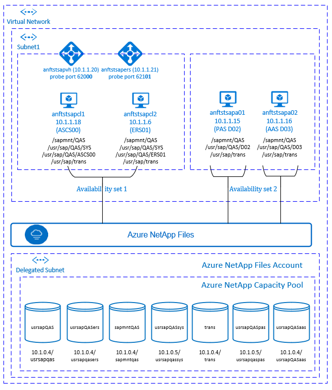

# High availability for SAP NetWeaver on Azure VMs on SUSE Linux Enterprise Server with Azure NetApp Files for SAP applications

[dbms-guide]:dbms-guide.md
[deployment-guide]:deployment-guide.md
[planning-guide]:planning-guide.md

[anf-azure-doc]:https://docs.microsoft.com/azure/azure-netapp-files/
[anf-avail-matrix]:https://azure.microsoft.com/global-infrastructure/services/?products=storage&regions=all
[anf-register]:https://docs.microsoft.com/azure/azure-netapp-files/azure-netapp-files-register
[anf-sap-applications-azure]:https://www.netapp.com/us/media/tr-4746.pdf

[2205917]:https://launchpad.support.sap.com/#/notes/2205917
[1944799]:https://launchpad.support.sap.com/#/notes/1944799
[1928533]:https://launchpad.support.sap.com/#/notes/1928533
[2015553]:https://launchpad.support.sap.com/#/notes/2015553
[2178632]:https://launchpad.support.sap.com/#/notes/2178632
[2191498]:https://launchpad.support.sap.com/#/notes/2191498
[2243692]:https://launchpad.support.sap.com/#/notes/2243692
[1984787]:https://launchpad.support.sap.com/#/notes/1984787
[1999351]:https://launchpad.support.sap.com/#/notes/1999351
[1410736]:https://launchpad.support.sap.com/#/notes/1410736

[sap-swcenter]:https://support.sap.com/en/my-support/software-downloads.html

[suse-ha-guide]:https://www.suse.com/products/sles-for-sap/resource-library/sap-best-practices/
[suse-drbd-guide]:https://www.suse.com/documentation/sle-ha-12/singlehtml/book_sleha_techguides/book_sleha_techguides.html
[suse-ha-12sp3-relnotes]:https://www.suse.com/releasenotes/x86_64/SLE-HA/12-SP3/

[template-multisid-xscs]:https://portal.azure.com/#create/Microsoft.Template/uri/https%3A%2F%2Fraw.githubusercontent.com%2FAzure%2Fazure-quickstart-templates%2Fmaster%2Fsap-3-tier-marketplace-image-multi-sid-xscs-md%2Fazuredeploy.json
[template-converged]:https://portal.azure.com/#create/Microsoft.Template/uri/https%3A%2F%2Fraw.githubusercontent.com%2FAzure%2Fazure-quickstart-templates%2Fmaster%2Fsap-3-tier-marketplace-image-converged-md%2Fazuredeploy.json
[template-file-server]:https://portal.azure.com/#create/Microsoft.Template/uri/https%3A%2F%2Fraw.githubusercontent.com%2FAzure%2Fazure-quickstart-templates%2Fmaster%2Fsap-file-server-md%2Fazuredeploy.json

[sap-hana-ha]:sap-hana-high-availability.md
[nfs-ha]:high-availability-guide-suse-nfs.md

This article describes how to deploy the virtual machines, configure the virtual machines, install the cluster framework, and install a highly available SAP NetWeaver 7.50 system, using [Azure NetApp Files](https://docs.microsoft.com/azure/azure-netapp-files/azure-netapp-files-introduction/).
In the example configurations, installation commands etc., the ASCS instance is number 00, the ERS instance number 01, the Primary Application instance (PAS) is 02 and the Application instance (AAS) is 03. SAP System ID QAS is used. 

This article explains how to achieve high availability for SAP NetWeaver application with Azure NetApp Files. The database layer isn't covered in detail in this article.

Read the following SAP Notes and papers first:

* [Azure NetApp Files documentation][anf-azure-doc] 
* SAP Note [1928533], which has:  
  * List of Azure VM sizes that are supported for the deployment of SAP software
  * Important capacity information for Azure VM sizes
  * Supported SAP software, and operating system (OS) and database combinations
  * Required SAP kernel version for Windows and Linux on Microsoft Azure
* SAP Note [2015553] lists prerequisites for SAP-supported SAP software deployments in Azure.
* SAP Note [2205917] has recommended OS settings for SUSE Linux Enterprise Server for SAP Applications
* SAP Note [1944799] has SAP HANA Guidelines for SUSE Linux Enterprise Server for SAP Applications
* SAP Note [2178632] has detailed information about all monitoring metrics reported for SAP in Azure.
* SAP Note [2191498] has the required SAP Host Agent version for Linux in Azure.
* SAP Note [2243692] has information about SAP licensing on Linux in Azure.
* SAP Note [1984787] has general information about SUSE Linux Enterprise Server 12.
* SAP Note [1999351] has additional troubleshooting information for the Azure Enhanced Monitoring Extension for SAP.
* [SAP Community WIKI](https://wiki.scn.sap.com/wiki/display/HOME/SAPonLinuxNotes) has all required SAP Notes for Linux.
* [Azure Virtual Machines planning and implementation for SAP on Linux][planning-guide]
* [Azure Virtual Machines deployment for SAP on Linux][deployment-guide]
* [Azure Virtual Machines DBMS deployment for SAP on Linux][dbms-guide]
* [SUSE SAP HA Best Practice Guides][suse-ha-guide]
  The guides contain all required information to set up Netweaver HA and SAP HANA System Replication on-premises. Use these guides as a general baseline. They provide much more detailed information.
* [SUSE High Availability Extension 12 SP3 Release Notes][suse-ha-12sp3-relnotes]
* [NetApp SAP Applications on Microsoft Azure using Azure NetApp Files][anf-sap-applications-azure]

## Overview

High availability(HA) for SAP Netweaver central services requires shared storage.
To achieve that on SUSE Linux so far it was necessary to build separate highly available NFS cluster. 

Now it is possible to achieve SAP Netweaver HA by using shared storage, deployed on Azure NetApp Files. Using Azure NetApp Files for the shared storage eliminates the need for additional [NFS cluster](https://docs.microsoft.com/azure/virtual-machines/workloads/sap/high-availability-guide-suse-nfs). Pacemaker is still needed for HA of the SAP Netweaver central services(ASCS/SCS).




SAP NetWeaver ASCS, SAP NetWeaver SCS, SAP NetWeaver ERS, and the SAP HANA database use virtual hostname and virtual IP addresses. On Azure, a [load balancer](https://docs.microsoft.com/azure/load-balancer/load-balancer-overview) is required to use a virtual IP address. The following list shows the configuration of the (A)SCS and ERS load balancer.

> [!IMPORTANT]
> Multi-SID clustering of SAP ASCS/ERS with SUSE Linux as guest operating system in Azure VMs is **NOT supported**. Multi-SID clustering describes the installation of multiple SAP ASCS/ERS instances with different SIDs in one Pacemaker cluster


### (A)SCS

* Frontend configuration
  * IP address 10.1.1.20
* Backend configuration
  * Connected to primary network interfaces of all virtual machines that should be part of the (A)SCS/ERS cluster
* Probe Port
  * Port 620<strong>&lt;nr&gt;</strong>
* Load-balancing rules
  * 32<strong>&lt;nr&gt;</strong> TCP
  * 36<strong>&lt;nr&gt;</strong> TCP
  * 39<strong>&lt;nr&gt;</strong> TCP
  * 81<strong>&lt;nr&gt;</strong> TCP
  * 5<strong>&lt;nr&gt;</strong>13 TCP
  * 5<strong>&lt;nr&gt;</strong>14 TCP
  * 5<strong>&lt;nr&gt;</strong>16 TCP

### ERS

* Frontend configuration
  * IP address 10.1.1.21
* Backend configuration
  * Connected to primary network interfaces of all virtual machines that should be part of the (A)SCS/ERS cluster
* Probe Port
  * Port 621<strong>&lt;nr&gt;</strong>
* Load-balancing rules
  * 32<strong>&lt;nr&gt;</strong> TCP
  * 33<strong>&lt;nr&gt;</strong> TCP
  * 5<strong>&lt;nr&gt;</strong>13 TCP
  * 5<strong>&lt;nr&gt;</strong>14 TCP
  * 5<strong>&lt;nr&gt;</strong>16 TCP

## Setting up the Azure NetApp Files infrastructure 

SAP NetWeaver requires shared storage for the transport and profile directory.  Before proceeding with the setup for Azure NetApp files infrastructure, familiarize yourself with the [Azure NetApp Files documentation][anf-azure-doc]. 
Check if your selected Azure region offers Azure NetApp Files. The following link shows the availability of Azure NetApp Files by Azure region: [Azure NetApp Files Availability by Azure Region][anf-avail-matrix].

Azure NetApp files is available in several [Azure regions](https://azure.microsoft.com/global-infrastructure/services/?products=netapp). Before deploying Azure NetApp Files, request onboarding to Azure NetApp Files , following the [Register for Azure NetApp files instructions][anf-register]. 

### Deploy Azure NetApp Files resources  

The steps assume that you have already deployed [Azure Virtual Network](https://docs.microsoft.com/azure/virtual-network/virtual-networks-overview). The Azure NetApp Files resources and the VMs, where the Azure NetApp Files resources will be mounted must be deployed in the same Azure Virtual Network or in peered Azure Virtual Networks.  

1. If you haven't done that already, request [onboarding to Azure NetApp Files](https://docs.microsoft.com/azure/azure-netapp-files/azure-netapp-files-register).  

2. Create the NetApp account in the selected Azure region, following the [instructions to create NetApp Account](https://docs.microsoft.com/azure/azure-netapp-files/azure-netapp-files-create-netapp-account).  
3. Set up Azure NetApp Files capacity pool, following the [instructions on how to set up Azure NetApp Files capacity pool](https://docs.microsoft.com/azure/azure-netapp-files/azure-netapp-files-set-up-capacity-pool).  
The SAP Netweaver architecture presented in this article uses single Azure NetApp Files capacity pool, Premium SKU. We recommend Azure NetApp Files Premium SKU for SAP Netweaver application workload on Azure.  

4. Delegate a subnet to Azure NetApp files as described in the [instructions Delegate a subnet to Azure NetApp Files](https://docs.microsoft.com/azure/azure-netapp-files/azure-netapp-files-delegate-subnet).  

5. Deploy Azure NetApp Files volumes, following the [instructions to create a volume for Azure NetApp Files](https://docs.microsoft.com/azure/azure-netapp-files/azure-netapp-files-create-volumes). Deploy the volumes in the designated Azure NetApp Files [subnet](https://docs.microsoft.com/rest/api/virtualnetwork/subnets). Keep in mind that the Azure NetApp Files resources and the Azure VMs must be in the same Azure Virtual Network or in peered Azure Virtual Networks. For example sapmnt<b>QAS</b>, usrsap<b>QAS</b>, etc. are the volume names and sapmnt<b>qas</b>, usrsap<b>qas</b>, etc. are the filepaths for the Azure NetApp Files volumes.  

   1. volume sapmnt<b>QAS</b> (nfs://10.1.0.4/sapmnt<b>qas</b>)
   2. volume usrsap<b>QAS</b> (nfs://10.1.0.4/usrsap<b>qas</b>)
   3. volume usrsap<b>QAS</b>sys (nfs://10.1.0.5/usrsap<b>qas</b>sys)
   4. volume usrsap<b>QAS</b>ers (nfs://10.1.0.4/usrsap<b>qas</b>ers)
   5. volume trans (nfs://10.1.0.4/trans)
   6. volume usrsap<b>QAS</b>pas (nfs://10.1.0.5/usrsap<b>qas</b>pas)
   7. volume usrsap<b>QAS</b>aas (nfs://10.1.0.4/usrsap<b>qas</b>aas)
   
In this example, we used Azure NetApp Files for all SAP Netweaver file systems to demonstrate how Azure NetApp Files can be used. The SAP file systems that don't need to be mounted via NFS can also be deployed as [Azure disk storage](https://docs.microsoft.com/azure/virtual-machines/windows/disks-types#premium-ssd) . In this example <b>a-e</b> must be on Azure NetApp Files and <b>f-g</b> (that is, /usr/sap/<b>QAS</b>/D<b>02</b>, /usr/sap/<b>QAS</b>/D<b>03</b>) could be deployed as Azure disk storage. 

### Important considerations

When considering Azure NetApp Files for the SAP Netweaver on SUSE High Availability architecture, be aware of the following important considerations:

- The minimum capacity pool is 4 TiB. The capacity pool size must be in multiples of 4 TiB.
- The minimum volume is 100 GiB
- Azure NetApp Files and all virtual machines, where Azure NetApp Files volumes will be mounted, must be in the same Azure Virtual Network or in [peered virtual networks](https://docs.microsoft.com/azure/virtual-network/virtual-network-peering-overview) in the same region. Azure NetApp Files access over VNET peering in the same region is supported now. Azure NetApp access over global peering is not yet supported.
- The selected virtual network must have a subnet, delegated to Azure NetApp Files.
- Azure NetApp Files currently supports only NFSv3 
- Azure NetApp Files offers [export policy](https://docs.microsoft.com/azure/azure-netapp-files/azure-netapp-files-configure-export-policy): you can control the allowed clients, the access type (Read&Write, Read Only, etc.). 
- Azure NetApp Files feature isn't zone aware yet. Currently Azure NetApp Files feature isn't deployed in all Availability zones in an Azure region. Be aware of the potential latency implications in some Azure regions. 

## Deploy Linux VMs manually via Azure portal

First you need to create the Azure NetApp Files volumes. Deploy the VMs. Afterwards, you create a load balancer and use the virtual machines in the backend pools.

1. Create a Resource Group
1. Create a Virtual Network
1. Create an Availability Set for ASCS  
   Set max update domain
1. Create Virtual Machine 1  
   Use at least SLES4SAP 12 SP3, in this example the SLES4SAP 12 SP3 image is used  
   Select Availability Set created earlier for ASCS  
1. Create Virtual Machine 2  
   Use at least SLES4SAP 12 SP3, in this example the SLES4SAP 12 SP3 image is used  
   Select Availability Set created earlier for ASCS  
1. Create an Availability Set for the SAP application instances (PAS, AAS)    
   Set max update domain
1. Create Virtual Machine 3  
   Use at least SLES4SAP 12 SP3, in this example the SLES4SAP 12 SP3 image is used  
   Select Availability Set created earlier for PAS/AAS   
1. Create Virtual Machine 4  
   Use at least SLES4SAP 12 SP3, in this example the SLES4SAP 12 SP3 image is used  
   Select Availability Set created earlier for PAS/AAS  

## Setting up (A)SCS

In this example, the resources were deployed manually via the [Azure portal](https://portal.azure.com/#home) .

### Deploy Azure Load Balancer manually via Azure portal

First you need to create the Azure NetApp Files volumes. Deploy the VMs. Afterwards, you create a load balancer and use the virtual machines in the backend pools.

1. Create a Load Balancer (internal)  
   1. Create the frontend IP addresses
      1. IP address 10.1.1.20 for the ASCS
         1. Open the load balancer, select frontend IP pool, and click Add
         1. Enter the name of the new frontend IP pool (for example **frontend.QAS.ASCS**)
         1. Set the Assignment to Static and enter the IP address (for example **10.1.1.20**)
         1. Click OK
      1. IP address 10.1.1.21 for the ASCS ERS
         * Repeat the steps above under "a" to create an IP address for the ERS (for example **10.1.1.21** and **frontend.QAS.ERS**)
   1. Create the backend pools
      1. Create a backend pool for the ASCS
         1. Open the load balancer, select backend pools, and click Add
         1. Enter the name of the new backend pool (for example **backend.QAS**)
         1. Click Add a virtual machine.
         1. Select the Availability Set you created earlier for ASCS 
         1. Select the virtual machines of the (A)SCS cluster
         1. Click OK
   1. Create the health probes
      1. Port 620**00** for ASCS
         1. Open the load balancer, select health probes, and click Add
         1. Enter the name of the new health probe (for example **health.QAS.ASCS**)
         1. Select TCP as protocol, port 620**00**, keep Interval 5 and Unhealthy threshold 2
         1. Click OK
      1. Port 621**01** for ASCS ERS
            * Repeat the steps above under "c" to create a health probe for the ERS (for example 621**01** and **health.QAS.ERS**)
   1. Load-balancing rules
      1. 32**00** TCP for ASCS
         1. Open the load balancer, select Load-balancing rules and click Add
         1. Enter the name of the new load balancer rule (for example **lb.QAS.ASCS.3200**)
         1. Select the frontend IP address for ASCS, backend pool, and health probe you created earlier (for example **frontend.QAS.ASCS**)
         1. Keep protocol **TCP**, enter port **3200**
         1. Increase idle timeout to 30 minutes
         1. **Make sure to enable Floating IP**
         1. Click OK
      1. Additional ports for the ASCS
         * Repeat the steps above under "d" for ports 36**00**, 39**00**, 81**00**, 5**00**13, 5**00**14, 5**00**16 and TCP for the ASCS
      1. Additional ports for the ASCS ERS
         * Repeat the steps above under "d" for ports 33**01**, 5**01**13, 5**01**14, 5**01**16 and TCP for the ASCS ERS

> [!IMPORTANT]
> Do not enable TCP timestamps on Azure VMs placed behind Azure Load Balancer. Enabling TCP timestamps will cause the health probes to fail. Set parameter **net.ipv4.tcp_timestamps** to **0**. For details see [Load Balancer health probes](https://docs.microsoft.com/azure/load-balancer/load-balancer-custom-probe-overview).

### Create Pacemaker cluster

Follow the steps in [Setting up Pacemaker on SUSE Linux Enterprise Server in Azure](high-availability-guide-suse-pacemaker.md) to create a basic Pacemaker cluster for this (A)SCS server.

### Installation

The following items are prefixed with either **[A]** - applicable to all nodes, **[1]** - only applicable to node 1 or **[2]** - only applicable to node 2.

1. **[A]** Install SUSE Connector

   <pre><code>sudo zypper install sap-suse-cluster-connector
   </code></pre>

   > [!NOTE]
   > Do not use dashes in the hostnames of your cluster nodes. Otherwise your cluster will not work. This is a known limitation and SUSE is working on a fix. The fix will be released as a patch of the sap-suse-cloud-connector package.

   Make sure that you installed the new version of the SAP SUSE cluster connector. The old one was called sap_suse_cluster_connector and the new one is called **sap-suse-cluster-connector**.

   <pre><code>sudo zypper info sap-suse-cluster-connector
   
      Information for package sap-suse-cluster-connector:
   ---------------------------------------------------
   Repository     : SLE-12-SP3-SAP-Updates
   Name           : sap-suse-cluster-connector
   Version        : 3.1.0-8.1
   Arch           : noarch
   Vendor         : SUSE LLC &lt;https://www.suse.com/&gt;
   Support Level  : Level 3
   Installed Size : 45.6 KiB
   Installed      : Yes
   Status         : up-to-date
   Source package : sap-suse-cluster-connector-3.1.0-8.1.src
   Summary        : SUSE High Availability Setup for SAP Products
   </code></pre>

2. **[A]** Update SAP resource agents  
   
   A patch for the resource-agents package is required to use the new configuration, that is described in this article. You can check, if the patch is already installed with the following command

   <pre><code>sudo grep 'parameter name="IS_ERS"' /usr/lib/ocf/resource.d/heartbeat/SAPInstance
   </code></pre>

   The output should be similar to

   <pre><code>&lt;parameter name="IS_ERS" unique="0" required="0"&gt;
   </code></pre>

   If the grep command does not find the IS_ERS parameter, you need to install the patch listed on [the SUSE download page](https://download.suse.com/patch/finder/#bu=suse&familyId=&productId=&dateRange=&startDate=&endDate=&priority=&architecture=&keywords=resource-agents)

   <pre><code># example for patch for SLES 12 SP1
   sudo zypper in -t patch SUSE-SLE-HA-12-SP1-2017-885=1
   # example for patch for SLES 12 SP2
   sudo zypper in -t patch SUSE-SLE-HA-12-SP2-2017-886=1
   </code></pre>

3. **[A]** Setup host name resolution

   You can either use a DNS server or modify the /etc/hosts on all nodes. This example shows how to use the /etc/hosts file.
   Replace the IP address and the hostname in the following commands

   <pre><code>sudo vi /etc/hosts
   </code></pre>

   Insert the following lines to /etc/hosts. Change the IP address and hostname to match your environment   

   <pre><code>
   # IP address of cluster node 1
   <b>10.1.1.18    anftstsapcl1</b>
   # IP address of cluster node 2
   <b>10.1.1.6     anftstsapcl2</b>
   # IP address of the load balancer frontend configuration for SAP Netweaver ASCS
   <b>10.1.1.20    anftstsapvh</b>
   # IP address of the load balancer frontend configuration for SAP Netweaver ERS
   <b>10.1.1.21    anftstsapers</b>
   </code></pre>

## Prepare for SAP NetWeaver installation

1. **[A]** Create the shared directories

   <pre><code>sudo mkdir -p /sapmnt/<b>QAS</b>
   sudo mkdir -p /usr/sap/trans
   sudo mkdir -p /usr/sap/<b>QAS</b>/SYS
   sudo mkdir -p /usr/sap/<b>QAS</b>/ASCS<b>00</b>
   sudo mkdir -p /usr/sap/<b>QAS</b>/ERS<b>01</b>
   
   sudo chattr +i /sapmnt/<b>QAS</b>
   sudo chattr +i /usr/sap/trans
   sudo chattr +i /usr/sap/<b>QAS</b>/SYS
   sudo chattr +i /usr/sap/<b>QAS</b>/ASCS<b>00</b>
   sudo chattr +i /usr/sap/<b>QAS</b>/ERS<b>01</b>
   </code></pre>

2. **[A]** Configure autofs

   <pre><code>
   sudo vi /etc/auto.master
   # Add the following line to the file, save and exit
   /- /etc/auto.direct
   </code></pre>

   Create a file with

   <pre><code>
   sudo vi /etc/auto.direct
   # Add the following lines to the file, save and exit
   /sapmnt/<b>QAS</b> -nfsvers=3,nobind,sync 10.1.0.4:/sapmnt<b>qas</b>
   /usr/sap/trans -nfsvers=3,nobind,sync 10.1.0.4:/trans
   /usr/sap/<b>QAS</b>/SYS -nfsvers=3,nobind,sync 10.1.0.5:/usrsap<b>qas</b>sys
   </code></pre>
   
   > [!NOTE]
   > Currently Azure NetApp Files supports only NFSv3. Don't omit the nfsvers=3 switch.
   
   Restart `autofs` to mount the new shares
    <pre><code>
      sudo systemctl enable autofs
      sudo service autofs restart
     </code></pre>

3. **[A]** Configure SWAP file

   <pre><code>sudo vi /etc/waagent.conf
   
   # Set the property ResourceDisk.EnableSwap to y
   # Create and use swapfile on resource disk.
   ResourceDisk.EnableSwap=<b>y</b>
   
   # Set the size of the SWAP file with property ResourceDisk.SwapSizeMB
   # The free space of resource disk varies by virtual machine size. Make sure that you do not set a value that is too big. You can check the SWAP space with command swapon
   # Size of the swapfile.
   ResourceDisk.SwapSizeMB=<b>2000</b>
   </code></pre>

   Restart the Agent to activate the change

   <pre><code>sudo service waagent restart
   </code></pre>


### Installing SAP NetWeaver ASCS/ERS

1. **[1]** Create a virtual IP resource and health-probe for the ASCS instance

   <pre><code>sudo crm node standby <b>anftstsapcl2</b>
   
   sudo crm configure primitive fs_<b>QAS</b>_ASCS Filesystem device='<b>10.1.0.4</b>:/usrsap<b>qas</b>' directory='/usr/sap/<b>QAS</b>/ASCS<b>00</b>' fstype='nfs' \
     op start timeout=60s interval=0 \
     op stop timeout=60s interval=0 \
     op monitor interval=20s timeout=40s
   
   sudo crm configure primitive vip_<b>QAS</b>_ASCS IPaddr2 \
     params ip=<b>10.1.1.20</b> cidr_netmask=<b>24</b> \
     op monitor interval=10 timeout=20
   
   sudo crm configure primitive nc_<b>QAS</b>_ASCS anything \
     params binfile="/usr/bin/nc" cmdline_options="-l -k 620<b>00</b>" \
     op monitor timeout=20s interval=10 depth=0
   
   sudo crm configure group g-<b>QAS</b>_ASCS fs_<b>QAS</b>_ASCS nc_<b>QAS</b>_ASCS vip_<b>QAS</b>_ASCS \
      meta resource-stickiness=3000
   </code></pre>

   Make sure that the cluster status is ok and that all resources are started. It is not important on which node the resources are running.

   <pre><code>sudo crm_mon -r
   
   # Node anftstsapcl2: standby
   # <b>Online: [ anftstsapcl1 ]</b>
   # 
   # Full list of resources:
   #
   # Resource Group: g-QAS_ASCS
   #     fs_QAS_ASCS        (ocf::heartbeat:Filesystem):    <b>Started anftstsapcl1</b>
   #     nc_QAS_ASCS        (ocf::heartbeat:anything):      <b>Started anftstsapcl1</b>
   #     vip_QAS_ASCS       (ocf::heartbeat:IPaddr2):       <b>Started anftstsapcl1</b>
   # stonith-sbd     (stonith:external/sbd): <b>Started anftstsapcl2</b>
   </code></pre>
  
2. **[1]** Install SAP NetWeaver ASCS  

   Install SAP NetWeaver ASCS as root on the first node using a virtual hostname that maps to the IP address of the load balancer frontend configuration for the ASCS, for example <b>anftstsapvh</b>, <b>10.1.1.20</b> and the instance number that you used for the probe of the load balancer, for example <b>00</b>.

   You can use the sapinst parameter SAPINST_REMOTE_ACCESS_USER to allow a non-root user to connect to sapinst. You can use parameter SAPINST_USE_HOSTNAME to install SAP, using virtual hostname.

   <pre><code>sudo &lt;swpm&gt;/sapinst SAPINST_REMOTE_ACCESS_USER=<b>sapadmin</b> SAPINST_USE_HOSTNAME=<b>virtual_hostname</b>
   </code></pre>

   If the installation fails to create a subfolder in /usr/sap/**QAS**/ASCS**00**, try setting the owner and group of the ASCS**00**  folder and retry. 

   <pre><code>
   chown <b>qas</b>adm /usr/sap/<b>QAS</b>/ASCS<b>00</b>
   chgrp sapsys /usr/sap/<b>QAS</b>/ASCS<b>00</b>
   </code></pre>

3. **[1]** Create a virtual IP resource and health-probe for the ERS instance

   <pre><code>
   sudo crm node online <b>anftstsapcl2</b>
   sudo crm node standby <b>anftstsapcl1</b>
   
   sudo crm configure primitive fs_<b>QAS</b>_ERS Filesystem device='<b>10.1.0.4</b>:/usrsap<b>qas</b>ers' directory='/usr/sap/<b>QAS</b>/ERS<b>01</b>' fstype='nfs' \
     op start timeout=60s interval=0 \
     op stop timeout=60s interval=0 \
     op monitor interval=20s timeout=40s
   
   sudo crm configure primitive vip_<b>QAS</b>_ERS IPaddr2 \
     params ip=<b>10.1.1.21</b> cidr_netmask=<b>24</b> \
     op monitor interval=10 timeout=20
   
   sudo crm configure primitive nc_<b>QAS</b>_ERS anything \
    params binfile="/usr/bin/nc" cmdline_options="-l -k 621<b>01</b>" \
    op monitor timeout=20s interval=10 depth=0
   
   # WARNING: Resources nc_QAS_ASCS,nc_QAS_ERS violate uniqueness for parameter "binfile": "/usr/bin/nc"
   # Do you still want to commit (y/n)? y
   
   sudo crm configure group g-<b>QAS</b>_ERS fs_<b>QAS</b>_ERS nc_<b>QAS</b>_ERS vip_<b>QAS</b>_ERS
   </code></pre>

   Make sure that the cluster status is ok and that all resources are started. It is not important on which node the resources are running.

   <pre><code>sudo crm_mon -r
   
   # Node <b>anftstsapcl1: standby</b>
   # <b>Online: [ anftstsapcl2 ]</b>
   # 
   # Full list of resources:
   #
   # stonith-sbd     (stonith:external/sbd): <b>Started anftstsapcl2</b>
   #  Resource Group: g-QAS_ASCS
   #      fs_QAS_ASCS        (ocf::heartbeat:Filesystem):    <b>Started anftstsapcl2</b>
   #      nc_QAS_ASCS        (ocf::heartbeat:anything):      <b>Started anftstsapcl2</b>
   #      vip_QAS_ASCS       (ocf::heartbeat:IPaddr2):       <b>Started anftstsapcl2</b>
   #  Resource Group: g-QAS_ERS
   #      fs_QAS_ERS (ocf::heartbeat:Filesystem):    <b>Started anftstsapcl2</b>
   #      nc_QAS_ERS (ocf::heartbeat:anything):      <b>Started anftstsapcl2</b>
   #      vip_QAS_ERS  (ocf::heartbeat:IPaddr2):     <b>Started anftstsapcl2</b>
   </code></pre>

4. **[2]** Install SAP NetWeaver ERS

   Install SAP NetWeaver ERS as root on the second node using a virtual hostname that maps to the IP address of the load balancer frontend configuration for the ERS, for example <b>anftstsapers</b>, <b>10.1.1.21</b> and the instance number that you used for the probe of the load balancer, for example <b>01</b>.

   You can use the sapinst parameter SAPINST_REMOTE_ACCESS_USER to allow a non-root user to connect to sapinst. You can use parameter SAPINST_USE_HOSTNAME to install SAP, using virtual hostname.

   <pre><code>sudo &lt;swpm&gt;/sapinst SAPINST_REMOTE_ACCESS_USER=<b>sapadmin</b> SAPINST_USE_HOSTNAME=<b>virtual_hostname</b>
   </code></pre>

   > [!NOTE]
   > Use SWPM SP 20 PL 05 or higher. Lower versions do not set the permissions correctly and the installation will fail.

   If the installation fails to create a subfolder in /usr/sap/**QAS**/ERS**01**, try setting the owner and group of the ERS**01** folder and retry.

   <pre><code>
   chown qasadm /usr/sap/<b>QAS</b>/ERS<b>01</b>
   chgrp sapsys /usr/sap/<b>QAS</b>/ERS<b>01</b>
   </code></pre>


5. **[1]** Adapt the ASCS/SCS and ERS instance profiles
 
   * ASCS/SCS profile

   <pre><code>
   sudo vi /sapmnt/<b>QAS</b>/profile/<b>QAS</b>_<b>ASCS00</b>_<b>anftstsapvh</b>
   
   # Change the restart command to a start command
   #Restart_Program_01 = local $(_EN) pf=$(_PF)
   Start_Program_01 = local $(_EN) pf=$(_PF)
   
   # Add the following lines
   service/halib = $(DIR_CT_RUN)/saphascriptco.so
   service/halib_cluster_connector = /usr/bin/sap_suse_cluster_connector
   
   # Add the keep alive parameter
   enque/encni/set_so_keepalive = true
   </code></pre>

   * ERS profile

   <pre><code>
   sudo vi /sapmnt/<b>QAS</b>/profile/<b>QAS</b>_ERS<b>01</b>_<b>anftstsapers</b>
   
   # Change the restart command to a start command
   #Restart_Program_00 = local $(_ER) pf=$(_PFL) NR=$(SCSID)
   Start_Program_00 = local $(_ER) pf=$(_PFL) NR=$(SCSID)
   
   # Add the following lines
   service/halib = $(DIR_CT_RUN)/saphascriptco.so
   service/halib_cluster_connector = /usr/bin/sap_suse_cluster_connector
   
   # remove Autostart from ERS profile
   # Autostart = 1
   </code></pre>

6. **[A]** Configure Keep Alive

   The communication between the SAP NetWeaver application server and the ASCS/SCS is routed through a software load balancer. The load balancer disconnects inactive connections after a configurable timeout. To prevent this you need to set a parameter in the SAP NetWeaver ASCS/SCS profile and change the Linux system settings. Read [SAP Note 1410736][1410736] for more information.

   The ASCS/SCS profile parameter enque/encni/set_so_keepalive was already added in the last step.

   <pre><code>
   # Change the Linux system configuration
   sudo sysctl net.ipv4.tcp_keepalive_time=120
   </code></pre>

7. **[A]** Configure the SAP users after the installation

   <pre><code>
   # Add sidadm to the haclient group
   sudo usermod -aG haclient <b>qas</b>adm
   </code></pre>

8. **[1]** Add the ASCS and ERS SAP services to the sapservice file

   Add the ASCS service entry to the second node and copy the ERS service entry to the first node.

   <pre><code>
   cat /usr/sap/sapservices | grep ASCS<b>00</b> | sudo ssh <b>anftstsapcl2</b> "cat >>/usr/sap/sapservices"
   sudo ssh <b>anftstsapcl2</b> "cat /usr/sap/sapservices" | grep ERS<b>01</b> | sudo tee -a /usr/sap/sapservices
   </code></pre>

9. **[1]** Create the SAP cluster resources

If using enqueue server 1 architecture (ENSA1), define the resources as follows:

   <pre><code>sudo crm configure property maintenance-mode="true"
   
   sudo crm configure primitive rsc_sap_<b>QAS</b>_ASCS<b>00</b> SAPInstance \
    operations \$id=rsc_sap_<b>QAS</b>_ASCS<b>00</b>-operations \
    op monitor interval=11 timeout=60 on_fail=restart \
    params InstanceName=<b>QAS</b>_ASCS<b>00</b>_<b>anftstsapvh</b> START_PROFILE="/sapmnt/<b>QAS</b>/profile/<b>QAS</b>_ASCS<b>00</b>_<b>anftstsapvh</b>" \
    AUTOMATIC_RECOVER=false \
    meta resource-stickiness=5000 failure-timeout=60 migration-threshold=1 priority=10
   
   sudo crm configure primitive rsc_sap_<b>QAS</b>_ERS<b>01</b> SAPInstance \
    operations \$id=rsc_sap_<b>QAS</b>_ERS<b>01</b>-operations \
    op monitor interval=11 timeout=60 on_fail=restart \
    params InstanceName=<b>QAS</b>_ERS<b>01</b>_<b>anftstsapers</b> START_PROFILE="/sapmnt/<b>QAS</b>/profile/<b>QAS</b>_ERS<b>01</b>_<b>anftstsapers</b>" AUTOMATIC_RECOVER=false IS_ERS=true \
    meta priority=1000
   
   sudo crm configure modgroup g-<b>QAS</b>_ASCS add rsc_sap_<b>QAS</b>_ASCS<b>00</b>
   sudo crm configure modgroup g-<b>QAS</b>_ERS add rsc_sap_<b>QAS</b>_ERS<b>01</b>
   
   sudo crm configure colocation col_sap_<b>QAS</b>_no_both -5000: g-<b>QAS</b>_ERS g-<b>QAS</b>_ASCS
   sudo crm configure location loc_sap_<b>QAS</b>_failover_to_ers rsc_sap_<b>QAS</b>_ASCS<b>00</b> rule 2000: runs_ers_<b>QAS</b> eq 1
   sudo crm configure order ord_sap_<b>QAS</b>_first_start_ascs Optional: rsc_sap_<b>QAS</b>_ASCS<b>00</b>:start rsc_sap_<b>QAS</b>_ERS<b>01</b>:stop symmetrical=false
   
   sudo crm node online <b>anftstsapcl1</b>
   sudo crm configure property maintenance-mode="false"
   </code></pre>

   SAP introduced support for enqueue server 2, including replication, as of SAP NW 7.52. Starting with ABAP Platform 1809, enqueue server 2 is installed by default. See SAP note [2630416](https://launchpad.support.sap.com/#/notes/2630416) for enqueue server 2 support.
   If using enqueue server 2 architecture ([ENSA2](https://help.sap.com/viewer/cff8531bc1d9416d91bb6781e628d4e0/1709%20001/en-US/6d655c383abf4c129b0e5c8683e7ecd8.html)), define the resources as follows:

   <pre><code>sudo crm configure property maintenance-mode="true"
   
   sudo crm configure primitive rsc_sap_<b>QAS</b>_ASCS<b>00</b> SAPInstance \
    operations \$id=rsc_sap_<b>QAS</b>_ASCS<b>00</b>-operations \
    op monitor interval=11 timeout=60 on_fail=restart \
    params InstanceName=<b>QAS</b>_ASCS<b>00</b>_<b>anftstsapvh</b> START_PROFILE="/sapmnt/<b>QAS</b>/profile/<b>QAS</b>_ASCS<b>00</b>_<b>anftstsapvh</b>" \
    AUTOMATIC_RECOVER=false \
    meta resource-stickiness=5000
   
   sudo crm configure primitive rsc_sap_<b>QAS</b>_ERS<b>01</b> SAPInstance \
    operations \$id=rsc_sap_<b>QAS</b>_ERS<b>01</b>-operations \
    op monitor interval=11 timeout=60 on_fail=restart \
    params InstanceName=<b>QAS</b>_ERS<b>01</b>_<b>anftstsapers</b> START_PROFILE="/sapmnt/<b>QAS</b>/profile/<b>QAS</b>_ERS<b>01</b>_<b>anftstsapers</b>" AUTOMATIC_RECOVER=false IS_ERS=true
   
   sudo crm configure modgroup g-<b>QAS</b>_ASCS add rsc_sap_<b>QAS</b>_ASCS<b>00</b>
   sudo crm configure modgroup g-<b>QAS</b>_ERS add rsc_sap_<b>QAS</b>_ERS<b>01</b>
   
   sudo crm configure colocation col_sap_<b>QAS</b>_no_both -5000: g-<b>QAS</b>_ERS g-<b>QAS</b>_ASCS
   sudo crm configure order ord_sap_<b>QAS</b>_first_start_ascs Optional: rsc_sap_<b>QAS</b>_ASCS<b>00</b>:start rsc_sap_<b>QAS</b>_ERS<b>01</b>:stop symmetrical=false
   
   sudo crm node online <b>anftstsapcl1</b>
   sudo crm configure property maintenance-mode="false"
   </code></pre>

   If you are upgrading from an older version and switching to enqueue server 2, see SAP note [2641019](https://launchpad.support.sap.com/#/notes/2641019). 

   Make sure that the cluster status is ok and that all resources are started. It is not important on which node the resources are running.

   <pre><code>sudo crm_mon -r
   # Full list of resources:
   #
   # stonith-sbd     (stonith:external/sbd): <b>Started anftstsapcl2</b>
   #  Resource Group: g-QAS_ASCS
   #      fs_QAS_ASCS        (ocf::heartbeat:Filesystem):    <b>Started anftstsapcl1</b>
   #      nc_QAS_ASCS        (ocf::heartbeat:anything):      <b>Started anftstsapcl1</b>
   #      vip_QAS_ASCS       (ocf::heartbeat:IPaddr2):       <b>Started anftstsapcl1</b>
   #      rsc_sap_QAS_ASCS00 (ocf::heartbeat:SAPInstance):   <b>Started anftstsapcl1</b>
   #  Resource Group: g-QAS_ERS
   #      fs_QAS_ERS (ocf::heartbeat:Filesystem):    <b>Started anftstsapcl2</b>
   #      nc_QAS_ERS (ocf::heartbeat:anything):      <b>Started anftstsapcl2</b>
   #      vip_QAS_ERS        (ocf::heartbeat:IPaddr2):       <b>Started anftstsapcl2</b>
   #      rsc_sap_QAS_ERS01  (ocf::heartbeat:SAPInstance):   <b>Started anftstsapcl2</b>
   </code></pre>

## <a name="2d6008b0-685d-426c-b59e-6cd281fd45d7"></a>SAP NetWeaver application server preparation 

Some databases require that the database instance installation is executed on an application server. Prepare the application server virtual machines to be able to use them in these cases.

The steps bellow assume that you install the application server on a server different from the ASCS/SCS and HANA servers. Otherwise some of the steps below (like configuring host name resolution) are not needed.

The following items are prefixed with either **[A]** - applicable to both PAS and AAS, **[P]** - only applicable to PAS or **[S]** - only applicable to AAS.


1. **[A]** Configure operating system

   Reduce the size of the dirty cache. For more information, see [Low write performance on SLES 11/12 servers with large RAM](https://www.suse.com/support/kb/doc/?id=7010287).

   <pre><code>
   sudo vi /etc/sysctl.conf
   # Change/set the following settings
   vm.dirty_bytes = 629145600
   vm.dirty_background_bytes = 314572800
   </code></pre>

1. **[A]** Setup host name resolution

   You can either use a DNS server or modify the /etc/hosts on all nodes. This example shows how to use the /etc/hosts file.
   Replace the IP address and the hostname in the following commands

   ```bash
   sudo vi /etc/hosts
   ```

   Insert the following lines to /etc/hosts. Change the IP address and hostname to match your environment

   <pre><code>
   # IP address of the load balancer frontend configuration for SAP NetWeaver ASCS/SCS
   <b>10.1.1.20 anftstsapvh</b>
   # IP address of the load balancer frontend configuration for SAP NetWeaver ERS
   <b>10.1.1.21 anftstsapers</b>
   # IP address of all application servers
   <b>10.1.1.15 anftstsapa01</b>
   <b>10.1.1.16 anftstsapa02</b>
   </code></pre>

1. **[A]** Create the sapmnt directory

   <pre><code>
   sudo mkdir -p /sapmnt/<b>QAS</b>
   sudo mkdir -p /usr/sap/trans

   sudo chattr +i /sapmnt/<b>QAS</b>
   sudo chattr +i /usr/sap/trans
   </code></pre>

1. **[P]** Create the PAS directory

   <pre><code>
   sudo mkdir -p /usr/sap/<b>QAS</b>/D<b>02</b>
   sudo chattr +i /usr/sap/<b>QAS</b>/D<b>02</b>
   </code></pre>

1. **[S]** Create the AAS directory

   <pre><code>
   sudo mkdir -p /usr/sap/<b>QAS</b>/D<b>03</b>
   sudo chattr +i /usr/sap/<b>QAS</b>/D<b>03</b>
   </code></pre>

1. **[P]** Configure autofs on PAS

   <pre><code>sudo vi /etc/auto.master
   
   # Add the following line to the file, save and exit
   /- /etc/auto.direct
   </code></pre>

   Create a new file with

   <pre><code>
   sudo vi /etc/auto.direct
   # Add the following lines to the file, save and exit
   /sapmnt/<b>QAS</b> -nfsvers=3,nobind,sync <b>10.1.0.4</b>:/sapmnt<b>qas</b>
   /usr/sap/trans -nfsvers=3,nobind,sync <b>10.1.0.4</b>:/trans
   /usr/sap/<b>QAS</b>/D<b>02</b> -nfsvers=3,nobind,sync <b>10.1.0.5</b>:/ursap<b>qas</b>pas
   </code></pre>

   Restart `autofs` to mount the new shares

   <pre><code>
   sudo systemctl enable autofs
   sudo service autofs restart
   </code></pre>

1. **[P]** Configure autofs on AAS

   <pre><code>sudo vi /etc/auto.master
   
   # Add the following line to the file, save and exit
   /- /etc/auto.direct
   </code></pre>

   Create a new file with

   <pre><code>
   sudo vi /etc/auto.direct
   # Add the following lines to the file, save and exit
   /sapmnt/<b>QAS</b> -nfsvers=3,nobind,sync <b>10.1.0.4</b>:/sapmnt<b>qas</b>
   /usr/sap/trans -nfsvers=3,nobind,sync <b>10.1.0.4</b>:/trans
   /usr/sap/<b>QAS</b>/D<b>03</b> -nfsvers=3,nobind,sync <b>10.1.0.4</b>:/usrsap<b>qas</b>aas
   </code></pre>

   Restart `autofs` to mount the new shares

   <pre><code>
   sudo systemctl enable autofs
   sudo service autofs restart
   </code></pre>

1. **[A]** Configure SWAP file

   <pre><code>
   sudo vi /etc/waagent.conf
   
   # Set the property ResourceDisk.EnableSwap to y
   # Create and use swapfile on resource disk.
   ResourceDisk.EnableSwap=<b>y</b>
   
   # Set the size of the SWAP file with property ResourceDisk.SwapSizeMB
   # The free space of resource disk varies by virtual machine size. Make sure that you do not set a value that is too big. You can check the SWAP space with command swapon
   # Size of the swapfile.
   ResourceDisk.SwapSizeMB=<b>2000</b>
   </code></pre>

   Restart the Agent to activate the change

   <pre><code>sudo service waagent restart
   </code></pre>

## Install database

In this example, SAP NetWeaver is installed on SAP HANA. You can use every supported database for this installation. For more information on how to install SAP HANA in Azure, see [High Availability of SAP HANA on Azure Virtual Machines (VMs)][sap-hana-ha]. For a list of supported databases, see [SAP Note 1928533][1928533].

* Run the SAP database instance installation

   Install the SAP NetWeaver database instance as root using a virtual hostname that maps to the IP address of the load balancer frontend configuration for the database.

   You can use the sapinst parameter SAPINST_REMOTE_ACCESS_USER to allow a non-root user to connect to sapinst.

   <pre><code>sudo &lt;swpm&gt;/sapinst SAPINST_REMOTE_ACCESS_USER=<b>sapadmin</b>
   </code></pre>

## SAP NetWeaver application server installation

Follow these steps to install an SAP application server.

1. **[A]** Prepare application server
   Follow the steps in the chapter [SAP NetWeaver application server preparation](high-availability-guide-suse-netapp-files.md#2d6008b0-685d-426c-b59e-6cd281fd45d7) above to prepare the application server.

2. **[A]** Install SAP NetWeaver application server
   Install a primary or additional SAP NetWeaver applications server.

   You can use the sapinst parameter SAPINST_REMOTE_ACCESS_USER to allow a non-root user to connect to sapinst.

   <pre><code>sudo &lt;swpm&gt;/sapinst SAPINST_REMOTE_ACCESS_USER=<b>sapadmin</b>
   </code></pre>

3. **[A]** Update SAP HANA secure store

   Update the SAP HANA secure store to point to the virtual name of the SAP HANA System Replication setup.

   Run the following command to list the entries
   <pre><code>
   hdbuserstore List
   </code></pre>

   This should list all entries and should look similar to
   <pre><code>
   DATA FILE       : /home/qasadm/.hdb/anftstsapa01/SSFS_HDB.DAT
   KEY FILE        : /home/qasadm/.hdb/anftstsapa01/SSFS_HDB.KEY
   
   KEY DEFAULT
     ENV : 10.1.1.5:<b>30313</b>
     USER: <b>SAPABAP1</b>
     DATABASE: <b>QAS</b>
   </code></pre>

   The output shows that the IP address of the default entry is pointing to the virtual machine and not to the load balancer's IP address. This entry needs to be changed to point to the virtual hostname of the load balancer. Make sure to use the same port (**30313** in the output above) and database name (**QAS** in the output above)!

   <pre><code>
   su - <b>qas</b>adm
   hdbuserstore SET DEFAULT <b>qasdb:30313@QAS</b> <b>SAPABAP1</b> <b>&lt;password of ABAP schema&gt;</b>
   </code></pre>

## Test the cluster setup

The following tests are a copy of the test cases in the [best practices guides of SUSE][suse-ha-guide]. They are copied for your convenience. Always also read the best practices guides and perform all additional tests that might have been added.

1. Test HAGetFailoverConfig, HACheckConfig, and HACheckFailoverConfig

   Run the following commands as \<sapsid>adm on the node where the ASCS instance is currently running. If the commands fail with FAIL: Insufficient memory, it might be caused by dashes in your hostname. This is a known issue and will be fixed by SUSE in the sap-suse-cluster-connector package.

   <pre><code>
   anftstsapcl1:qasadm 52> sapcontrol -nr 00 -function HAGetFailoverConfig
   07.03.2019 20:08:59
   HAGetFailoverConfig
   OK
   HAActive: TRUE
   HAProductVersion: SUSE Linux Enterprise Server for SAP Applications 12 SP3
   HASAPInterfaceVersion: SUSE Linux Enterprise Server for SAP Applications 12 SP3 (sap_suse_cluster_connector 3.1.0)
   HADocumentation: https://www.suse.com/products/sles-for-sap/resource-library/sap-best-practices/
   HAActiveNode: anftstsapcl1
   HANodes: anftstsapcl1, anftstsapcl2

   anftstsapcl1:qasadm 54> sapcontrol -nr 00 -function HACheckConfig
   07.03.2019 23:28:29
   HACheckConfig
   OK
   state, category, description, comment
   SUCCESS, SAP CONFIGURATION, Redundant ABAP instance configuration, 2 ABAP instances detected
   SUCCESS, SAP CONFIGURATION, Redundant Java instance configuration, 0 Java instances detected
   SUCCESS, SAP CONFIGURATION, Enqueue separation, All Enqueue server separated from application server
   SUCCESS, SAP CONFIGURATION, MessageServer separation, All MessageServer separated from application server
   SUCCESS, SAP CONFIGURATION, ABAP instances on multiple hosts, ABAP instances on multiple hosts detected
   SUCCESS, SAP CONFIGURATION, Redundant ABAP SPOOL service configuration, 2 ABAP instances with SPOOL service detected
   SUCCESS, SAP STATE, Redundant ABAP SPOOL service state, 2 ABAP instances with active SPOOL service detected
   SUCCESS, SAP STATE, ABAP instances with ABAP SPOOL service on multiple hosts, ABAP instances with active ABAP SPOOL service on multiple hosts detected
   SUCCESS, SAP CONFIGURATION, Redundant ABAP BATCH service configuration, 2 ABAP instances with BATCH service detected
   SUCCESS, SAP STATE, Redundant ABAP BATCH service state, 2 ABAP instances with active BATCH service detected
   SUCCESS, SAP STATE, ABAP instances with ABAP BATCH service on multiple hosts, ABAP instances with active ABAP BATCH service on multiple hosts detected
   SUCCESS, SAP CONFIGURATION, Redundant ABAP DIALOG service configuration, 2 ABAP instances with DIALOG service detected
   SUCCESS, SAP STATE, Redundant ABAP DIALOG service state, 2 ABAP instances with active DIALOG service detected
   SUCCESS, SAP STATE, ABAP instances with ABAP DIALOG service on multiple hosts, ABAP instances with active ABAP DIALOG service on multiple hosts detected
   SUCCESS, SAP CONFIGURATION, Redundant ABAP UPDATE service configuration, 2 ABAP instances with UPDATE service detected
   SUCCESS, SAP STATE, Redundant ABAP UPDATE service state, 2 ABAP instances with active UPDATE service detected
   SUCCESS, SAP STATE, ABAP instances with ABAP UPDATE service on multiple hosts, ABAP instances with active ABAP UPDATE service on multiple hosts detected
   SUCCESS, SAP STATE, SCS instance running, SCS instance status ok
   SUCCESS, SAP CONFIGURATION, SAPInstance RA sufficient version (anftstsapvh_QAS_00), SAPInstance includes is-ers patch
   SUCCESS, SAP CONFIGURATION, Enqueue replication (anftstsapvh_QAS_00), Enqueue replication enabled
   SUCCESS, SAP STATE, Enqueue replication state (anftstsapvh_QAS_00), Enqueue replication active
   
   anftstsapcl1:qasadm 55> sapcontrol -nr 00 -function HACheckFailoverConfig
   07.03.2019 23:30:48
   HACheckFailoverConfig
   OK
   state, category, description, comment
   SUCCESS, SAP CONFIGURATION, SAPInstance RA sufficient version, SAPInstance includes is-ers patch
   </code></pre>

2. Manually migrate the ASCS instance

   Resource state before starting the test:

   <pre><code>
    Resource Group: g-QAS_ASCS
        fs_QAS_ASCS        (ocf::heartbeat:Filesystem):    Started anftstsapcl2
        nc_QAS_ASCS        (ocf::heartbeat:anything):      Started anftstsapcl2
        vip_QAS_ASCS       (ocf::heartbeat:IPaddr2):       Started anftstsapcl2
        rscsap_QAS_ASCS00 (ocf::heartbeat:SAPInstance):   Started anftstsapcl2
   stonith-sbd     (stonith:external/sbd): Started anftstsapcl1
    Resource Group: g-QAS_ERS
        fs_QAS_ERS (ocf::heartbeat:Filesystem):    Started anftstsapcl1
        nc_QAS_ERS (ocf::heartbeat:anything):      Started anftstsapcl1
        vip_QAS_ERS        (ocf::heartbeat:IPaddr2):       Started anftstsapcl1
        rsc_sap_QAS_ERS01  (ocf::heartbeat:SAPInstance):   Starting anftstsapcl1
   </code></pre>

   Run the following commands as root to migrate the ASCS instance.

   <pre><code>
   anftstsapcl1:~ # crm resource migrate rsc_sap_QAS_ASCS00 force
   INFO: Move constraint created for rsc_sap_QAS_ASCS00
   
   anftstsapcl1:~ # crm resource unmigrate rsc_sap_QAS_ASCS00
   INFO: Removed migration constraints for rsc_sap_QAS_ASCS00
   
   # Remove failed actions for the ERS that occurred as part of the migration
   anftstsapcl1:~ # crm resource cleanup rsc_sap_QAS_ERS01
   </code></pre>

   Resource state after the test:

   <pre><code>
    Resource Group: g-QAS_ASCS
        fs_QAS_ASCS        (ocf::heartbeat:Filesystem):    Started anftstsapcl1
        nc_QAS_ASCS        (ocf::heartbeat:anything):      Started anftstsapcl1
        vip_QAS_ASCS       (ocf::heartbeat:IPaddr2):       Started anftstsapcl1
        rsc_sap_QAS_ASCS00 (ocf::heartbeat:SAPInstance):   Started anftstsapcl1
   stonith-sbd     (stonith:external/sbd): Started anftstsapcl1
    Resource Group: g-QAS_ERS
        fs_QAS_ERS (ocf::heartbeat:Filesystem):    Started anftstsapcl2
        nc_QAS_ERS (ocf::heartbeat:anything):      Started anftstsapcl2
        vip_QAS_ERS        (ocf::heartbeat:IPaddr2):       Started anftstsapcl2
        rsc_sap_QAS_ERS01  (ocf::heartbeat:SAPInstance):   Started anftstsapcl2
   </code></pre>

3. Test HAFailoverToNode

   Resource state before starting the test:

   <pre><code>
    Resource Group: g-QAS_ASCS
        fs_QAS_ASCS        (ocf::heartbeat:Filesystem):    Started anftstsapcl1
        nc_QAS_ASCS        (ocf::heartbeat:anything):      Started anftstsapcl1
        vip_QAS_ASCS       (ocf::heartbeat:IPaddr2):       Started anftstsapcl1
        rsc_sap_QAS_ASCS00 (ocf::heartbeat:SAPInstance):   Started anftstsapcl1
   stonith-sbd     (stonith:external/sbd): Started anftstsapcl1
    Resource Group: g-QAS_ERS
        fs_QAS_ERS (ocf::heartbeat:Filesystem):    Started anftstsapcl2
        nc_QAS_ERS (ocf::heartbeat:anything):      Started anftstsapcl2
        vip_QAS_ERS        (ocf::heartbeat:IPaddr2):       Started anftstsapcl2
        rsc_sap_QAS_ERS01  (ocf::heartbeat:SAPInstance):   Started anftstsapcl2
   </code></pre>

   Run the following commands as \<sapsid>adm to migrate the ASCS instance.

   <pre><code>
   anftstsapcl1:qasadm 53> sapcontrol -nr 00 -host anftstsapvh -user <b>qas</b>adm &lt;password&gt; -function HAFailoverToNode ""
   
   # run as root
   # Remove failed actions for the ERS that occurred as part of the migration
   anftstsapcl1:~ # crm resource cleanup rsc_sap_QAS_ERS01
   # Remove migration constraints
   anftstsapcl1:~ # crm resource clear rsc_sap_QAS_ASCS00
   #INFO: Removed migration constraints for rsc_sap_QAS_ASCS00
   </code></pre>

   Resource state after the test:

   <pre><code>
    Resource Group: g-QAS_ASCS
        fs_QAS_ASCS        (ocf::heartbeat:Filesystem):    Started anftstsapcl2
        nc_QAS_ASCS        (ocf::heartbeat:anything):      Started anftstsapcl2
        vip_QAS_ASCS       (ocf::heartbeat:IPaddr2):       Started anftstsapcl2
        rsc_sap_QAS_ASCS00 (ocf::heartbeat:SAPInstance):   Started anftstsapcl2
   stonith-sbd     (stonith:external/sbd): Started anftstsapcl1
    Resource Group: g-QAS_ERS
        fs_QAS_ERS (ocf::heartbeat:Filesystem):    Started anftstsapcl1
        nc_QAS_ERS (ocf::heartbeat:anything):      Started anftstsapcl1
        vip_QAS_ERS        (ocf::heartbeat:IPaddr2):       Started anftstsapcl1
        rsc_sap_QAS_ERS01  (ocf::heartbeat:SAPInstance):   Started anftstsapcl1
   </code></pre>

4. Simulate node crash 

   Resource state before starting the test:

   <pre><code>
    Resource Group: g-QAS_ASCS
        fs_QAS_ASCS        (ocf::heartbeat:Filesystem):    Started anftstsapcl2
        nc_QAS_ASCS        (ocf::heartbeat:anything):      Started anftstsapcl2
        vip_QAS_ASCS       (ocf::heartbeat:IPaddr2):       Started anftstsapcl2
        rsc_sap_QAS_ASCS00 (ocf::heartbeat:SAPInstance):   Started anftstsapcl2
   stonith-sbd     (stonith:external/sbd): Started anftstsapcl1
    Resource Group: g-QAS_ERS
        fs_QAS_ERS (ocf::heartbeat:Filesystem):    Started anftstsapcl1
        nc_QAS_ERS (ocf::heartbeat:anything):      Started anftstsapcl1
        vip_QAS_ERS        (ocf::heartbeat:IPaddr2):       Started anftstsapcl1
        rsc_sap_QAS_ERS01  (ocf::heartbeat:SAPInstance):   Started anftstsapcl1
   </code></pre>

   Run the following command as root on the node where the ASCS instance is running

   <pre><code>anftstsapcl2:~ # echo b > /proc/sysrq-trigger
   </code></pre>

   If you use SBD, Pacemaker should not automatically start on the killed node. The status after the node is started again should look like this.

   <pre><code>Online:
   Online: [ anftstsapcl1 ]
   OFFLINE: [ anftstsapcl2 ]

   Full list of resources:

    Resource Group: g-QAS_ASCS
        fs_QAS_ASCS        (ocf::heartbeat:Filesystem):    Started anftstsapcl1
        nc_QAS_ASCS        (ocf::heartbeat:anything):      Started anftstsapcl1
        vip_QAS_ASCS       (ocf::heartbeat:IPaddr2):       Started anftstsapcl1
        rsc_sap_QAS_ASCS00 (ocf::heartbeat:SAPInstance):   Started anftstsapcl1
   stonith-sbd     (stonith:external/sbd): Started anftstsapcl1
    Resource Group: g-QAS_ERS
        fs_QAS_ERS (ocf::heartbeat:Filesystem):    Started anftstsapcl1
        nc_QAS_ERS (ocf::heartbeat:anything):      Started anftstsapcl1
        vip_QAS_ERS        (ocf::heartbeat:IPaddr2):       Started anftstsapcl1
        rsc_sap_QAS_ERS01  (ocf::heartbeat:SAPInstance):   Started anftstsapcl1

   Failed Actions:
   * rsc_sap_QAS_ERS01_monitor_11000 on anftstsapcl1 'not running' (7): call=166, status=complete, exitreason='',
    last-rc-change='Fri Mar  8 18:26:10 2019', queued=0ms, exec=0ms
   </code></pre>

   Use the following commands to start Pacemaker on the killed node, clean the SBD messages, and clean the failed resources.

   <pre><code>
   # run as root
   # list the SBD device(s)
   anftstsapcl2:~ # cat /etc/sysconfig/sbd | grep SBD_DEVICE=
   # SBD_DEVICE="/dev/disk/by-id/scsi-36001405b730e31e7d5a4516a2a697dcf;/dev/disk/by-id/scsi-36001405f69d7ed91ef54461a442c676e;/dev/disk/by-id/scsi-360014058e5f335f2567488882f3a2c3a"

   anftstsapcl2:~ # sbd -d /dev/disk/by-id/scsi-36001405772fe8401e6240c985857e11 -d /dev/disk/by-id/scsi-36001405f69d7ed91ef54461a442c676e -d /dev/disk/by-id/scsi-360014058e5f335f2567488882f3a2c3a message anftstsapcl2 clear

   anftstsapcl2:~ # systemctl start pacemaker
   anftstsapcl2:~ # crm resource cleanup rsc_sap_QAS_ASCS00
   anftstsapcl2:~ # crm resource cleanup rsc_sap_QAS_ERS01
   </code></pre>

   Resource state after the test:

   <pre><code>
   Full list of resources:
   
    Resource Group: g-QAS_ASCS
        fs_QAS_ASCS        (ocf::heartbeat:Filesystem):    Started anftstsapcl1
        nc_QAS_ASCS        (ocf::heartbeat:anything):      Started anftstsapcl1
        vip_QAS_ASCS       (ocf::heartbeat:IPaddr2):       Started anftstsapcl1
        rsc_sap_QAS_ASCS00 (ocf::heartbeat:SAPInstance):   Started anftstsapcl1
   stonith-sbd     (stonith:external/sbd): Started anftstsapcl1
    Resource Group: g-QAS_ERS
        fs_QAS_ERS (ocf::heartbeat:Filesystem):    Started anftstsapcl2
        nc_QAS_ERS (ocf::heartbeat:anything):      Started anftstsapcl2
        vip_QAS_ERS        (ocf::heartbeat:IPaddr2):       Started anftstsapcl2
        rsc_sap_QAS_ERS01  (ocf::heartbeat:SAPInstance):   Started anftstsapcl2
   </code></pre>

5. Test manual restart of ASCS instance

   Resource state before starting the test:

   <pre><code>
    Resource Group: g-QAS_ASCS
        fs_QAS_ASCS        (ocf::heartbeat:Filesystem):    Started anftstsapcl2
        nc_QAS_ASCS        (ocf::heartbeat:anything):      Started anftstsapcl2
        vip_QAS_ASCS       (ocf::heartbeat:IPaddr2):       Started anftstsapcl2
        rsc_sap_QAS_ASCS00 (ocf::heartbeat:SAPInstance):   Started anftstsapcl2
   stonith-sbd     (stonith:external/sbd): Started anftstsapcl1
    Resource Group: g-QAS_ERS
        fs_QAS_ERS (ocf::heartbeat:Filesystem):    Started anftstsapcl1
        nc_QAS_ERS (ocf::heartbeat:anything):      Started anftstsapcl1
        vip_QAS_ERS        (ocf::heartbeat:IPaddr2):       Started anftstsapcl1
        rsc_sap_QAS_ERS01  (ocf::heartbeat:SAPInstance):   Started anftstsapcl1
   </code></pre>

   Create an enqueue lock by, for example edit a user in transaction su01. Run the following commands as <sapsid\>adm on the node where the ASCS instance is running. The commands will stop the ASCS instance and start it again. If using enqueue server 1 architecture, the enqueue lock is expected to be lost in this test. If using enqueue server 2 architecture, the enqueue will be retained. 

   <pre><code>anftstsapcl2:qasadm 51> sapcontrol -nr 00 -function StopWait 600 2
   </code></pre>

   The ASCS instance should now be disabled in Pacemaker

   <pre><code>  rsc_sap_QAS_ASCS00 (ocf::heartbeat:SAPInstance):   Stopped (disabled)
   </code></pre>

   Start the ASCS instance again on the same node.

   <pre><code>anftstsapcl2:qasadm 52> sapcontrol -nr 00 -function StartWait 600 2
   </code></pre>

   The enqueue lock of transaction su01 should be lost, if using enqueue server replication 1 architecture and the back-end should have been reset. Resource state after the test:

   <pre><code>
    Resource Group: g-QAS_ASCS
        fs_QAS_ASCS        (ocf::heartbeat:Filesystem):    Started anftstsapcl2
        nc_QAS_ASCS        (ocf::heartbeat:anything):      Started anftstsapcl2
        vip_QAS_ASCS       (ocf::heartbeat:IPaddr2):       Started anftstsapcl2
        rsc_sap_QAS_ASCS00 (ocf::heartbeat:SAPInstance):   Started anftstsapcl2
   stonith-sbd     (stonith:external/sbd): Started anftstsapcl1
    Resource Group: g-QAS_ERS
        fs_QAS_ERS (ocf::heartbeat:Filesystem):    Started anftstsapcl1
        nc_QAS_ERS (ocf::heartbeat:anything):      Started anftstsapcl1
        vip_QAS_ERS        (ocf::heartbeat:IPaddr2):       Started anftstsapcl1
        rsc_sap_QAS_ERS01  (ocf::heartbeat:SAPInstance):   Started anftstsapcl1
   </code></pre>

6. Kill message server process

   Resource state before starting the test:

   <pre><code>
    Resource Group: g-QAS_ASCS
        fs_QAS_ASCS        (ocf::heartbeat:Filesystem):    Started anftstsapcl2
        nc_QAS_ASCS        (ocf::heartbeat:anything):      Started anftstsapcl2
        vip_QAS_ASCS       (ocf::heartbeat:IPaddr2):       Started anftstsapcl2
        rsc_sap_QAS_ASCS00 (ocf::heartbeat:SAPInstance):   Started anftstsapcl2
   stonith-sbd     (stonith:external/sbd): Started anftstsapcl1
    Resource Group: g-QAS_ERS
        fs_QAS_ERS (ocf::heartbeat:Filesystem):    Started anftstsapcl1
        nc_QAS_ERS (ocf::heartbeat:anything):      Started anftstsapcl1
        vip_QAS_ERS        (ocf::heartbeat:IPaddr2):       Started anftstsapcl1
        rsc_sap_QAS_ERS01  (ocf::heartbeat:SAPInstance):   Started anftstsapcl1
   </code></pre>

   Run the following commands as root to identify the process of the message server and kill it.

   <pre><code>anftstsapcl2:~ # pgrep ms.sapQAS | xargs kill -9
   </code></pre>

   If you only kill the message server once, it will be restarted by sapstart. If you kill it often enough, Pacemaker will eventually move the ASCS instance to the other node. Run the following commands as root to clean up the resource state of the ASCS and ERS instance after the test.

   <pre><code>
   anftstsapcl2:~ # crm resource cleanup rsc_sap_QAS_ASCS00
   anftstsapcl2:~ # crm resource cleanup rsc_sap_QAS_ERS01
   </code></pre>

   Resource state after the test:

   <pre><code>
    Resource Group: g-QAS_ASCS
        fs_QAS_ASCS        (ocf::heartbeat:Filesystem):    Started anftstsapcl1
        nc_QAS_ASCS        (ocf::heartbeat:anything):      Started anftstsapcl1
        vip_QAS_ASCS       (ocf::heartbeat:IPaddr2):       Started anftstsapcl1
        rsc_sap_QAS_ASCS00 (ocf::heartbeat:SAPInstance):   Started anftstsapcl1
   stonith-sbd     (stonith:external/sbd): Started anftstsapcl1
    Resource Group: g-QAS_ERS
        fs_QAS_ERS (ocf::heartbeat:Filesystem):    Started anftstsapcl2
        nc_QAS_ERS (ocf::heartbeat:anything):      Started anftstsapcl2
        vip_QAS_ERS        (ocf::heartbeat:IPaddr2):       Started anftstsapcl2
        rsc_sap_QAS_ERS01  (ocf::heartbeat:SAPInstance):   Started anftstsapcl2
   </code></pre>

7. Kill enqueue server process

   Resource state before starting the test:

   <pre><code>
    Resource Group: g-QAS_ASCS
        fs_QAS_ASCS        (ocf::heartbeat:Filesystem):    Started anftstsapcl1
        nc_QAS_ASCS        (ocf::heartbeat:anything):      Started anftstsapcl1
        vip_QAS_ASCS       (ocf::heartbeat:IPaddr2):       Started anftstsapcl1
        rsc_sap_QAS_ASCS00 (ocf::heartbeat:SAPInstance):   Started anftstsapcl1
   stonith-sbd     (stonith:external/sbd): Started anftstsapcl1
    Resource Group: g-QAS_ERS
        fs_QAS_ERS (ocf::heartbeat:Filesystem):    Started anftstsapcl2
        nc_QAS_ERS (ocf::heartbeat:anything):      Started anftstsapcl2
        vip_QAS_ERS        (ocf::heartbeat:IPaddr2):       Started anftstsapcl2
        rsc_sap_QAS_ERS01  (ocf::heartbeat:SAPInstance):   Started anftstsapcl2
   </code></pre>

   Run the following commands as root on the node where the ASCS instance is running to kill the enqueue server.

   <pre><code>anftstsapcl1:~ # pgrep en.sapQAS | xargs kill -9
   </code></pre>

   The ASCS instance should immediately fail over to the other node. The ERS instance should also fail over after the ASCS instance is started. Run the following commands as root to clean up the resource state of the ASCS and ERS instance after the test.

   <pre><code>
   anftstsapcl1:~ # crm resource cleanup rsc_sap_QAS_ASCS00
   anftstsapcl1:~ # crm resource cleanup rsc_sap_QAS_ERS01
   </code></pre>

   Resource state after the test:

   <pre><code>
    Resource Group: g-QAS_ASCS
        fs_QAS_ASCS        (ocf::heartbeat:Filesystem):    Started anftstsapcl2
        nc_QAS_ASCS        (ocf::heartbeat:anything):      Started anftstsapcl2
        vip_QAS_ASCS       (ocf::heartbeat:IPaddr2):       Started anftstsapcl2
        rsc_sap_QAS_ASCS00 (ocf::heartbeat:SAPInstance):   Started anftstsapcl2
   stonith-sbd     (stonith:external/sbd): Started anftstsapcl1
    Resource Group: g-QAS_ERS
        fs_QAS_ERS (ocf::heartbeat:Filesystem):    Started anftstsapcl1
        nc_QAS_ERS (ocf::heartbeat:anything):      Started anftstsapcl1
        vip_QAS_ERS        (ocf::heartbeat:IPaddr2):       Started anftstsapcl1
        rsc_sap_QAS_ERS01  (ocf::heartbeat:SAPInstance):   Started anftstsapcl1
   </code></pre>

8. Kill enqueue replication server process

   Resource state before starting the test:

   <pre><code>
    Resource Group: g-QAS_ASCS
        fs_QAS_ASCS        (ocf::heartbeat:Filesystem):    Started anftstsapcl2
        nc_QAS_ASCS        (ocf::heartbeat:anything):      Started anftstsapcl2
        vip_QAS_ASCS       (ocf::heartbeat:IPaddr2):       Started anftstsapcl2
        rsc_sap_QAS_ASCS00 (ocf::heartbeat:SAPInstance):   Started anftstsapcl2
   stonith-sbd     (stonith:external/sbd): Started anftstsapcl1
    Resource Group: g-QAS_ERS
        fs_QAS_ERS (ocf::heartbeat:Filesystem):    Started anftstsapcl1
        nc_QAS_ERS (ocf::heartbeat:anything):      Started anftstsapcl1
        vip_QAS_ERS        (ocf::heartbeat:IPaddr2):       Started anftstsapcl1
        rsc_sap_QAS_ERS01  (ocf::heartbeat:SAPInstance):   Started anftstsapcl1
   </code></pre>

   Run the following command as root on the node where the ERS instance is running to kill the enqueue replication server process.

   <pre><code>anftstsapcl1:~ # pgrep er.sapQAS | xargs kill -9
   </code></pre>

   If you only run the command once, `sapstart` will restart the process. If you run it often enough, `sapstart` will not restart the process and the resource will be in a stopped state. Run the following commands as root to clean up the resource state of the ERS instance after the test.

   <pre><code>anftstsapcl1:~ # crm resource cleanup rsc_sap_QAS_ERS01
   </code></pre>

   Resource state after the test:

   <pre><code>
    Resource Group: g-QAS_ASCS
        fs_QAS_ASCS        (ocf::heartbeat:Filesystem):    Started anftstsapcl2
        nc_QAS_ASCS        (ocf::heartbeat:anything):      Started anftstsapcl2
        vip_QAS_ASCS       (ocf::heartbeat:IPaddr2):       Started anftstsapcl2
        rsc_sap_QAS_ASCS00 (ocf::heartbeat:SAPInstance):   Started anftstsapcl2
   stonith-sbd     (stonith:external/sbd): Started anftstsapcl1
    Resource Group: g-QAS_ERS
        fs_QAS_ERS (ocf::heartbeat:Filesystem):    Started anftstsapcl1
        nc_QAS_ERS (ocf::heartbeat:anything):      Started anftstsapcl1
        vip_QAS_ERS        (ocf::heartbeat:IPaddr2):       Started anftstsapcl1
        rsc_sap_QAS_ERS01  (ocf::heartbeat:SAPInstance):   Started anftstsapcl1
   </code></pre>

9. Kill enqueue sapstartsrv process

   Resource state before starting the test:

   <pre><code>
    Resource Group: g-QAS_ASCS
        fs_QAS_ASCS        (ocf::heartbeat:Filesystem):    Started anftstsapcl2
        nc_QAS_ASCS        (ocf::heartbeat:anything):      Started anftstsapcl2
        vip_QAS_ASCS       (ocf::heartbeat:IPaddr2):       Started anftstsapcl2
        rsc_sap_QAS_ASCS00 (ocf::heartbeat:SAPInstance):   Started anftstsapcl2
   stonith-sbd     (stonith:external/sbd): Started anftstsapcl1
    Resource Group: g-QAS_ERS
        fs_QAS_ERS (ocf::heartbeat:Filesystem):    Started anftstsapcl1
        nc_QAS_ERS (ocf::heartbeat:anything):      Started anftstsapcl1
        vip_QAS_ERS        (ocf::heartbeat:IPaddr2):       Started anftstsapcl1
        rsc_sap_QAS_ERS01  (ocf::heartbeat:SAPInstance):   Started anftstsapcl1
   </code></pre>

   Run the following commands as root on the node where the ASCS is running.

   <pre><code>
   anftstsapcl2:~ # pgrep -fl ASCS00.*sapstartsrv
   #67625 sapstartsrv
   
   anftstsapcl2:~ # kill -9 67625
   </code></pre>

   The sapstartsrv process should always be restarted by the Pacemaker resource agent. Resource state after the test:

   <pre><code>
    Resource Group: g-QAS_ASCS
        fs_QAS_ASCS        (ocf::heartbeat:Filesystem):    Started anftstsapcl2
        nc_QAS_ASCS        (ocf::heartbeat:anything):      Started anftstsapcl2
        vip_QAS_ASCS       (ocf::heartbeat:IPaddr2):       Started anftstsapcl2
        rsc_sap_QAS_ASCS00 (ocf::heartbeat:SAPInstance):   Started anftstsapcl2
   stonith-sbd     (stonith:external/sbd): Started anftstsapcl1
    Resource Group: g-QAS_ERS
        fs_QAS_ERS (ocf::heartbeat:Filesystem):    Started anftstsapcl1
        nc_QAS_ERS (ocf::heartbeat:anything):      Started anftstsapcl1
        vip_QAS_ERS        (ocf::heartbeat:IPaddr2):       Started anftstsapcl1
        rsc_sap_QAS_ERS01  (ocf::heartbeat:SAPInstance):   Started anftstsapcl1
   </code></pre>

## Next steps

* [Azure Virtual Machines planning and implementation for SAP][planning-guide]
* [Azure Virtual Machines deployment for SAP][deployment-guide]
* [Azure Virtual Machines DBMS deployment for SAP][dbms-guide]
* To learn how to establish high availability and plan for disaster recovery of SAP 
* HANA on Azure (large instances), see [SAP HANA (large instances) high availability and disaster recovery on Azure](hana-overview-high-availability-disaster-recovery.md).
* To learn how to establish high availability and plan for disaster recovery of SAP HANA on Azure VMs, see [High Availability of SAP HANA on Azure Virtual Machines (VMs)][sap-hana-ha]
