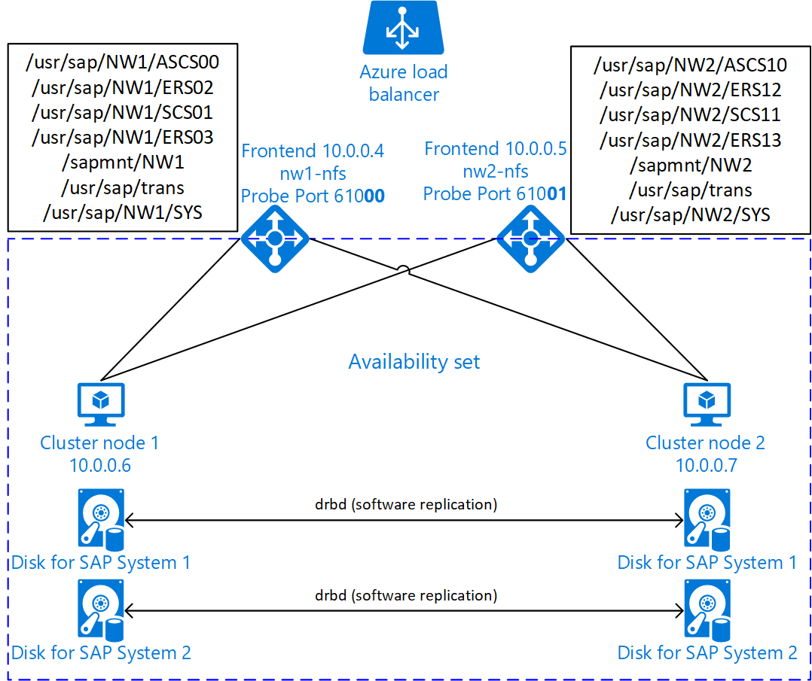

# High availability for NFS on Azure VMs on SUSE Linux Enterprise Server

[dbms-guide]:dbms-guide.md
[deployment-guide]:deployment-guide.md
[planning-guide]:planning-guide.md

[2205917]:https://launchpad.support.sap.com/#/notes/2205917
[1944799]:https://launchpad.support.sap.com/#/notes/1944799
[1928533]:https://launchpad.support.sap.com/#/notes/1928533
[2015553]:https://launchpad.support.sap.com/#/notes/2015553
[2178632]:https://launchpad.support.sap.com/#/notes/2178632
[2191498]:https://launchpad.support.sap.com/#/notes/2191498
[2243692]:https://launchpad.support.sap.com/#/notes/2243692
[1984787]:https://launchpad.support.sap.com/#/notes/1984787
[1999351]:https://launchpad.support.sap.com/#/notes/1999351
[1410736]:https://launchpad.support.sap.com/#/notes/1410736

[sap-swcenter]:https://support.sap.com/en/my-support/software-downloads.html

[sles-hae-guides]:https://www.suse.com/documentation/sle-ha-12/
[sles-for-sap-bp]:https://www.suse.com/documentation/sles-for-sap-12/

[template-multisid-xscs]:https://portal.azure.com/#create/Microsoft.Template/uri/https%3A%2F%2Fraw.githubusercontent.com%2FAzure%2Fazure-quickstart-templates%2Fmaster%2Fsap-3-tier-marketplace-image-multi-sid-xscs-md%2Fazuredeploy.json
[template-converged]:https://portal.azure.com/#create/Microsoft.Template/uri/https%3A%2F%2Fraw.githubusercontent.com%2FAzure%2Fazure-quickstart-templates%2Fmaster%2Fsap-3-tier-marketplace-image-converged-md%2Fazuredeploy.json
[template-file-server]:https://portal.azure.com/#create/Microsoft.Template/uri/https%3A%2F%2Fraw.githubusercontent.com%2FAzure%2Fazure-quickstart-templates%2Fmaster%2Fsap-file-server-md%2Fazuredeploy.json

[sap-hana-ha]:sap-hana-high-availability.md

This article describes how to deploy the virtual machines, configure the virtual machines, install the cluster framework, and install a highly available NFS server that can be used to store the shared data of a highly available SAP system.
This guide describes how to set up a highly available NFS server that is used by two SAP systems, NW1 and NW2. The names of the resources (for example virtual machines, virtual networks) in the example assume that you have used the [SAP file server template][template-file-server] with resource prefix **prod**.

Read the following SAP Notes and papers first

* SAP Note [1928533], which has:
  * List of Azure VM sizes that are supported for the deployment of SAP software
  * Important capacity information for Azure VM sizes
  * Supported SAP software, and operating system (OS) and database combinations
  * Required SAP kernel version for Windows and Linux on Microsoft Azure

* SAP Note [2015553] lists prerequisites for SAP-supported SAP software deployments in Azure.
* SAP Note [2205917] has recommended OS settings for SUSE Linux Enterprise Server for SAP Applications
* SAP Note [1944799] has SAP HANA Guidelines for SUSE Linux Enterprise Server for SAP Applications
* SAP Note [2178632] has detailed information about all monitoring metrics reported for SAP in Azure.
* SAP Note [2191498] has the required SAP Host Agent version for Linux in Azure.
* SAP Note [2243692] has information about SAP licensing on Linux in Azure.
* SAP Note [1984787] has general information about SUSE Linux Enterprise Server 12.
* SAP Note [1999351] has additional troubleshooting information for the Azure Enhanced Monitoring Extension for SAP.
* [SAP Community WIKI](https://wiki.scn.sap.com/wiki/display/HOME/SAPonLinuxNotes) has all required SAP Notes for Linux.
* [Azure Virtual Machines planning and implementation for SAP on Linux][planning-guide]
* [Azure Virtual Machines deployment for SAP on Linux (this article)][deployment-guide]
* [Azure Virtual Machines DBMS deployment for SAP on Linux][dbms-guide]
* [SUSE Linux Enterprise High Availability Extension 12 SP3 best practices guides][sles-hae-guides]
  * Highly Available NFS Storage with DRBD and Pacemaker
* [SUSE Linux Enterprise Server for SAP Applications 12 SP3 best practices guides][sles-for-sap-bp]

## Overview

To achieve high availability, SAP NetWeaver requires an NFS server. The NFS server is configured in a separate cluster and can be used by multiple SAP systems.



The NFS server uses a dedicated virtual hostname and virtual IP addresses for every SAP system that uses this NFS server. On Azure, a load balancer is required to use a virtual IP address. The following list shows the configuration of the load balancer.        

* Frontend configuration
  * IP address 10.0.0.4 for NW1
  * IP address 10.0.0.5 for NW2
* Backend configuration
  * Connected to primary network interfaces of all virtual machines that should be part of the NFS cluster
* Probe Port
  * Port 61000 for NW1
  * Port 61001 for NW2
* Loadbalancing rules
  * 2049 TCP for NW1
  * 2049 UDP for NW1
  * 2049 TCP for NW2
  * 2049 UDP for NW2

## Set up a highly available NFS server

You can either use an Azure Template from GitHub to deploy all required Azure resources, including the virtual machines, availability set, and load balancer or you can deploy the resources manually.

### Deploy Linux via Azure Template

The Azure Marketplace contains an image for SUSE Linux Enterprise Server for SAP Applications 12 that you can use to deploy new virtual machines.
You can use one of the quickstart templates on GitHub to deploy all required resources. The template deploys the virtual machines, the load balancer, availability set etc.
Follow these steps to deploy the template:

1. Open the [SAP file server template][template-file-server] in the Azure portal   
1. Enter the following parameters
   1. Resource Prefix  
      Enter the prefix you want to use. The value is used as a prefix for the resources that are deployed.
   2. SAP System Count  
      Enter the number of SAP systems that will use this file server. This will deploy the required amount of frontend configurations, load balancing rules, probe ports, disks etc.
   3. Os Type  
      Select one of the Linux distributions. For this example, select SLES 12
   4. Admin Username and Admin Password  
      A new user is created that can be used to log on to the machine.
   5. Subnet ID  
      If you want to deploy the VM into an existing VNet where you have a subnet defined the VM should be assigned to, name the ID of that specific subnet. The ID usually looks like /subscriptions/**&lt;subscription ID&gt;**/resourceGroups/**&lt;resource group name&gt;**/providers/Microsoft.Network/virtualNetworks/**&lt;virtual network name&gt;**/subnets/**&lt;subnet name&gt;**

### Deploy Linux manually via Azure portal

You first need to create the virtual machines for this NFS cluster. Afterwards, you create a load balancer and use the virtual machines in the backend pools.

1. Create a Resource Group
1. Create a Virtual Network
1. Create an Availability Set  
   Set max update domain
1. Create Virtual Machine 1
   Use at least SLES4SAP 12 SP3, in this example the SLES4SAP 12 SP3 BYOS image
   SLES For SAP Applications 12 SP3 (BYOS) is used  
   Select Availability Set created earlier  
1. Create Virtual Machine 2
   Use at least SLES4SAP 12 SP3, in this example the SLES4SAP 12 SP3 BYOS image  
   SLES For SAP Applications 12 SP3 (BYOS) is used  
   Select Availability Set created earlier  
1. Add one data disk for each SAP system to both virtual machines.
1. Create a Load Balancer (internal)  
   1. Create the frontend IP addresses
      1. IP address 10.0.0.4 for NW1
         1. Open the load balancer, select frontend IP pool, and click Add
         1. Enter the name of the new frontend IP pool (for example **nw1-frontend**)
         1. Set the Assignment to Static and enter the IP address (for example **10.0.0.4**)
         1. Click OK
      1. IP address 10.0.0.5 for NW2
         * Repeat the steps above for NW2
   1. Create the backend pools
      1. Connected to primary network interfaces of all virtual machines that should be part of the NFS cluster for NW1
         1. Open the load balancer, select backend pools, and click Add
         1. Enter the name of the new backend pool (for example **nw1-backend**)
         1. Click Add a virtual machine
         1. Select the Availability Set you created earlier
         1. Select the virtual machines of the NFS cluster
         1. Click OK
      1. Connected to primary network interfaces of all virtual machines that should be part of the NFS cluster for NW2
         * Repeat the steps above to create a backend pool for NW2
   1. Create the health probes
      1. Port 61000 for NW1
         1. Open the load balancer, select health probes, and click Add
         1. Enter the name of the new health probe (for example **nw1-hp**)
         1. Select TCP as protocol, port 610**00**, keep Interval 5 and Unhealthy threshold 2
         1. Click OK
      1. Port 61001 for NW2
         * Repeat the steps above to create a health probe for NW2
   1. Loadbalancing rules
      1. 2049 TCP for NW1
         1. Open the load balancer, select load balancing rules and click Add
         1. Enter the name of the new load balancer rule (for example **nw1-lb-2049**)
         1. Select the frontend IP address, backend pool, and health probe you created earlier (for example **nw1-frontend**)
         1. Keep protocol **TCP**, enter port **2049**
         1. Increase idle timeout to 30 minutes
         1. **Make sure to enable Floating IP**
         1. Click OK
      1. 2049 UDP for NW1
         * Repeat the steps above for port 2049 and UDP for NW1
      1. 2049 TCP for NW2
         * Repeat the steps above for port 2049 and TCP for NW2
      1. 2049 UDP for NW2
         * Repeat the steps above for port 2049 and UDP for NW2

### Create Pacemaker cluster

Follow the steps in [Setting up Pacemaker on SUSE Linux Enterprise Server in Azure](high-availability-guide-suse-pacemaker.md) to create a basic Pacemaker cluster for this NFS server.

### Configure NFS server

The following items are prefixed with either **[A]** - applicable to all nodes, **[1]** - only applicable to node 1 or **[2]** - only applicable to node 2.

1. **[A]** Setup host name resolution

   You can either use a DNS server or modify the /etc/hosts on all nodes. This example shows how to use the /etc/hosts file.
   Replace the IP address and the hostname in the following commands

   <pre><code>sudo vi /etc/hosts
   </code></pre>
   
   Insert the following lines to /etc/hosts. Change the IP address and hostname to match your environment
   
   <pre><code># IP address of the load balancer frontend configuration for NFS
   <b>10.0.0.4 nw1-nfs</b>
   <b>10.0.0.5 nw2-nfs</b>
   </code></pre>

1. **[A]** Enable NFS server

   Create the root NFS export entry

   <pre><code>sudo sh -c 'echo /srv/nfs/ *\(rw,no_root_squash,fsid=0\)>/etc/exports'
   
   sudo mkdir /srv/nfs/
   </code></pre>

1. **[A]** Install drbd components

   <pre><code>sudo zypper install drbd drbd-kmp-default drbd-utils
   </code></pre>

1. **[A]** Create a partition for the drbd devices

   List all available data disks

   <pre><code>sudo ls /dev/disk/azure/scsi1/
   </code></pre>

   Example output
   
   ```
   lun0  lun1
   ```

   Create partitions for every data disk

   <pre><code>sudo sh -c 'echo -e "n\n\n\n\n\nw\n" | fdisk /dev/disk/azure/scsi1/lun0'
   sudo sh -c 'echo -e "n\n\n\n\n\nw\n" | fdisk /dev/disk/azure/scsi1/lun1'
   </code></pre>

1. **[A]** Create LVM configurations

   List all available partitions

   <pre><code>ls /dev/disk/azure/scsi1/lun*-part*
   </code></pre>

   Example output
   
   ```
   /dev/disk/azure/scsi1/lun0-part1  /dev/disk/azure/scsi1/lun1-part1
   ```

   Create LVM volumes for every partition

   <pre><code>sudo pvcreate /dev/disk/azure/scsi1/lun0-part1  
   sudo vgcreate vg-<b>NW1</b>-NFS /dev/disk/azure/scsi1/lun0-part1
   sudo lvcreate -l 100%FREE -n <b>NW1</b> vg-<b>NW1</b>-NFS

   sudo pvcreate /dev/disk/azure/scsi1/lun1-part1
   sudo vgcreate vg-<b>NW2</b>-NFS /dev/disk/azure/scsi1/lun1-part1
   sudo lvcreate -l 100%FREE -n <b>NW2</b> vg-<b>NW2</b>-NFS
   </code></pre>

1. **[A]** Configure drbd

   <pre><code>sudo vi /etc/drbd.conf
   </code></pre>

   Make sure that the drbd.conf file contains the following two lines

   <pre><code>include "drbd.d/global_common.conf";
   include "drbd.d/*.res";
   </code></pre>

   Change the global drbd configuration

   <pre><code>sudo vi /etc/drbd.d/global_common.conf
   </code></pre>

   Add the following entries to the handler and net section.

   <pre><code>global {
        usage-count no;
   }
   common {
        handlers {
             fence-peer "/usr/lib/drbd/crm-fence-peer.sh";
             after-resync-target "/usr/lib/drbd/crm-unfence-peer.sh";
             split-brain "/usr/lib/drbd/notify-split-brain.sh root";
             pri-lost-after-sb "/usr/lib/drbd/notify-pri-lost-after-sb.sh; /usr/lib/drbd/notify-emergency-reboot.sh; echo b > /proc/sysrq-trigger ; reboot -f";
        }
        startup {
             wfc-timeout 0;
        }
        options {
        }
        disk {
             md-flushes yes;
             disk-flushes yes;
             c-plan-ahead 1;
             c-min-rate 100M;
             c-fill-target 20M;
             c-max-rate 4G;
        }
        net {
             after-sb-0pri discard-younger-primary;
             after-sb-1pri discard-secondary;
             after-sb-2pri call-pri-lost-after-sb;
             protocol     C;
             tcp-cork yes;
             max-buffers 20000;
             max-epoch-size 20000;
             sndbuf-size 0;
             rcvbuf-size 0;
        }
   }
   </code></pre>

1. **[A]** Create the NFS drbd devices

   <pre><code>sudo vi /etc/drbd.d/<b>NW1</b>-nfs.res
   </code></pre>

   Insert the configuration for the new drbd device and exit

   <pre><code>resource <b>NW1</b>-nfs {
        protocol     C;
        disk {
             on-io-error       detach;
        }
        on <b>prod-nfs-0</b> {
             address   <b>10.0.0.6:7790</b>;
             device    /dev/drbd<b>0</b>;
             disk      /dev/<b>vg-NW1-NFS</b>/<b>NW1</b>;
             meta-disk internal;
        }
        on <b>prod-nfs-1</b> {
             address   <b>10.0.0.7:7790</b>;
             device    /dev/drbd<b>0</b>;
             disk      /dev/<b>vg-NW1-NFS</b>/<b>NW1</b>;
             meta-disk internal;
        }
   }
   </code></pre>

   <pre><code>sudo vi /etc/drbd.d/<b>NW2</b>-nfs.res
   </code></pre>

   Insert the configuration for the new drbd device and exit

   <pre><code>resource <b>NW2</b>-nfs {
        protocol     C;
        disk {
             on-io-error       detach;
        }
        on <b>prod-nfs-0</b> {
             address   <b>10.0.0.6:7791</b>;
             device    /dev/drbd<b>1</b>;
             disk      /dev/<b>vg-NW2-NFS</b>/<b>NW2</b>;
             meta-disk internal;
        }
        on <b>prod-nfs-1</b> {
             address   <b>10.0.0.7:7791</b>;
             device    /dev/drbd<b>1</b>;
             disk      /dev/<b>vg-NW2-NFS</b>/<b>NW2</b>;
             meta-disk internal;
        }
   }
   </code></pre>

   Create the drbd device and start it

   <pre><code>sudo drbdadm create-md <b>NW1</b>-nfs
   sudo drbdadm create-md <b>NW2</b>-nfs
   sudo drbdadm up <b>NW1</b>-nfs
   sudo drbdadm up <b>NW2</b>-nfs
   </code></pre>

1. **[1]** Skip initial synchronization

   <pre><code>sudo drbdadm new-current-uuid --clear-bitmap <b>NW1</b>-nfs
   sudo drbdadm new-current-uuid --clear-bitmap <b>NW2</b>-nfs
   </code></pre>

1. **[1]** Set the primary node

   <pre><code>sudo drbdadm primary --force <b>NW1</b>-nfs
   sudo drbdadm primary --force <b>NW2</b>-nfs
   </code></pre>

1. **[1]** Wait until the new drbd devices are synchronized

   <pre><code>sudo drbdsetup wait-sync-resource NW1-nfs
   sudo drbdsetup wait-sync-resource NW2-nfs
   </code></pre>

1. **[1]** Create file systems on the drbd devices

   <pre><code>sudo mkfs.xfs /dev/drbd0
   sudo mkdir /srv/nfs/NW1
   sudo chattr +i /srv/nfs/NW1
   sudo mount -t xfs /dev/drbd0 /srv/nfs/NW1
   sudo mkdir /srv/nfs/NW1/sidsys
   sudo mkdir /srv/nfs/NW1/sapmntsid
   sudo mkdir /srv/nfs/NW1/trans
   sudo mkdir /srv/nfs/NW1/ASCS
   sudo mkdir /srv/nfs/NW1/ASCSERS
   sudo mkdir /srv/nfs/NW1/SCS
   sudo mkdir /srv/nfs/NW1/SCSERS
   sudo umount /srv/nfs/NW1

   sudo mkfs.xfs /dev/drbd1
   sudo mkdir /srv/nfs/NW2
   sudo chattr +i /srv/nfs/NW2
   sudo mount -t xfs /dev/drbd1 /srv/nfs/NW2
   sudo mkdir /srv/nfs/NW2/sidsys
   sudo mkdir /srv/nfs/NW2/sapmntsid
   sudo mkdir /srv/nfs/NW2/trans
   sudo mkdir /srv/nfs/NW2/ASCS
   sudo mkdir /srv/nfs/NW2/ASCSERS
   sudo mkdir /srv/nfs/NW2/SCS
   sudo mkdir /srv/nfs/NW2/SCSERS
   sudo umount /srv/nfs/NW2
   </code></pre>

1. **[A]** Setup drbd split-brain detection

   When using drbd to synchronize data from one host to another, a so called split brain can occur. A split brain is a scenario where both cluster nodes promoted the drbd device to be the primary and went out of sync. It might be a rare situation but you still want to handle and resolve a split brain as fast as possible. It is therefore important to be notified when a split brain happened.

   Read [the official drbd documentation](http://docs.linbit.com/doc/users-guide-83/s-configure-split-brain-behavior/#s-split-brain-notification) on how to set up a split brain notification.

   It is also possible to automatically recover from a split brain scenario. For more information, read [Automatic split brain recovery policies](http://docs.linbit.com/doc/users-guide-83/s-configure-split-brain-behavior/#s-automatic-split-brain-recovery-configuration)
   
### Configure Cluster Framework

1. **[1]** Add the NFS drbd devices for SAP system NW1 to the cluster configuration

   <pre><code>sudo crm configure rsc_defaults resource-stickiness="200"

   # Enable maintenance mode
   sudo crm configure property maintenance-mode=true
   
   sudo crm configure primitive drbd_<b>NW1</b>_nfs \
     ocf:linbit:drbd \
     params drbd_resource="<b>NW1</b>-nfs" \
     op monitor interval="15" role="Master" \
     op monitor interval="30" role="Slave"
   
   sudo crm configure ms ms-drbd_<b>NW1</b>_nfs drbd_<b>NW1</b>_nfs \
     meta master-max="1" master-node-max="1" clone-max="2" \
     clone-node-max="1" notify="true" interleave="true"
   
   sudo crm configure primitive fs_<b>NW1</b>_sapmnt \
     ocf:heartbeat:Filesystem \
     params device=/dev/drbd0 \
     directory=/srv/nfs/<b>NW1</b>  \
     fstype=xfs \
     op monitor interval="10s"
   
   sudo crm configure primitive nfsserver systemd:nfs-server \
     op monitor interval="30s"
   sudo crm configure clone cl-nfsserver nfsserver

   sudo crm configure primitive exportfs_<b>NW1</b> \
     ocf:heartbeat:exportfs \
     params directory="/srv/nfs/<b>NW1</b>" \
     options="rw,no_root_squash,crossmnt" clientspec="*" fsid=1 wait_for_leasetime_on_stop=true op monitor interval="30s"
   
   sudo crm configure primitive vip_<b>NW1</b>_nfs \
     IPaddr2 \
     params ip=<b>10.0.0.4</b> cidr_netmask=<b>24</b> op monitor interval=10 timeout=20
   
   sudo crm configure primitive nc_<b>NW1</b>_nfs \
     anything \
     params binfile="/usr/bin/nc" cmdline_options="-l -k <b>61000</b>" op monitor timeout=20s interval=10 depth=0
   
   sudo crm configure group g-<b>NW1</b>_nfs \
     fs_<b>NW1</b>_sapmnt exportfs_<b>NW1</b> nc_<b>NW1</b>_nfs vip_<b>NW1</b>_nfs
   
   sudo crm configure order o-<b>NW1</b>_drbd_before_nfs inf: \
     ms-drbd_<b>NW1</b>_nfs:promote g-<b>NW1</b>_nfs:start
   
   sudo crm configure colocation col-<b>NW1</b>_nfs_on_drbd inf: \
     g-<b>NW1</b>_nfs ms-drbd_<b>NW1</b>_nfs:Master
   </code></pre>

1. **[1]** Add the NFS drbd devices for SAP system NW2 to the cluster configuration

   <pre><code># Enable maintenance mode
   sudo crm configure property maintenance-mode=true
   
   sudo crm configure primitive drbd_<b>NW2</b>_nfs \
     ocf:linbit:drbd \
     params drbd_resource="<b>NW2</b>-nfs" \
     op monitor interval="15" role="Master" \
     op monitor interval="30" role="Slave"
   
   sudo crm configure ms ms-drbd_<b>NW2</b>_nfs drbd_<b>NW2</b>_nfs \
     meta master-max="1" master-node-max="1" clone-max="2" \
     clone-node-max="1" notify="true" interleave="true"
   
   sudo crm configure primitive fs_<b>NW2</b>_sapmnt \
     ocf:heartbeat:Filesystem \
     params device=/dev/drbd1 \
     directory=/srv/nfs/<b>NW2</b>  \
     fstype=xfs \
     op monitor interval="10s"
   
   sudo crm configure primitive exportfs_<b>NW2</b> \
     ocf:heartbeat:exportfs \
     params directory="/srv/nfs/<b>NW2</b>" \
     options="rw,no_root_squash" clientspec="*" fsid=2 wait_for_leasetime_on_stop=true op monitor interval="30s"
   
   sudo crm configure primitive vip_<b>NW2</b>_nfs \
     IPaddr2 \
     params ip=<b>10.0.0.5</b> cidr_netmask=<b>24</b> op monitor interval=10 timeout=20
   
   sudo crm configure primitive nc_<b>NW2</b>_nfs \
     anything \
     params binfile="/usr/bin/nc" cmdline_options="-l -k <b>61001</b>" op monitor timeout=20s interval=10 depth=0
   
   sudo crm configure group g-<b>NW2</b>_nfs \
     fs_<b>NW2</b>_sapmnt exportfs_<b>NW2</b> nc_<b>NW2</b>_nfs vip_<b>NW2</b>_nfs
   
   sudo crm configure order o-<b>NW2</b>_drbd_before_nfs inf: \
     ms-drbd_<b>NW2</b>_nfs:promote g-<b>NW2</b>_nfs:start
   
   sudo crm configure colocation col-<b>NW2</b>_nfs_on_drbd inf: \
     g-<b>NW2</b>_nfs ms-drbd_<b>NW2</b>_nfs:Master
   </code></pre>

1. **[1]** Disable maintenance mode
   
   <pre><code>sudo crm configure property maintenance-mode=false
   </code></pre>

## Next steps

* [Install the SAP ASCS and database](high-availability-guide-suse.md)
* [Azure Virtual Machines planning and implementation for SAP][planning-guide]
* [Azure Virtual Machines deployment for SAP][deployment-guide]
* [Azure Virtual Machines DBMS deployment for SAP][dbms-guide]
* To learn how to establish high availability and plan for disaster recovery of SAP HANA on Azure (large instances), see [SAP HANA (large instances) high availability and disaster recovery on Azure](hana-overview-high-availability-disaster-recovery.md).
* To learn how to establish high availability and plan for disaster recovery of SAP HANA on Azure VMs, see [High Availability of SAP HANA on Azure Virtual Machines (VMs)][sap-hana-ha]
