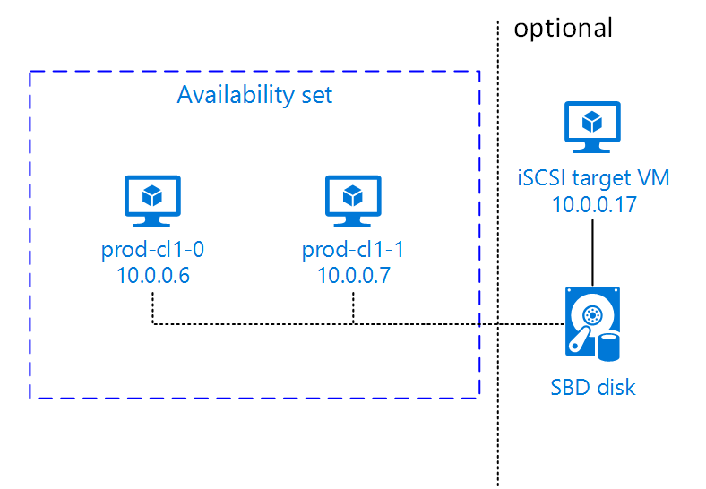

# Setting up Pacemaker on SUSE Linux Enterprise Server in Azure

[planning-guide]:planning-guide.md
[deployment-guide]:deployment-guide.md
[dbms-guide]:dbms-guide.md
[sap-hana-ha]:sap-hana-high-availability.md
[virtual-machines-linux-maintenance]:../../maintenance-and-updates.md#maintenance-that-doesnt-require-a-reboot
[virtual-machines-windows-maintenance]:../../maintenance-and-updates.md#maintenance-that-doesnt-require-a-reboot
[sles-nfs-guide]:high-availability-guide-suse-nfs.md
[sles-guide]:high-availability-guide-suse.md

There are two options to set up a Pacemaker cluster in Azure. You can either use a fencing agent, which takes care of restarting a failed node via the Azure APIs or you can use an SBD device.

The SBD device requires at least one additional virtual machine that acts as an iSCSI target server and provides an SBD device. These iSCSI target servers can however be shared with other Pacemaker clusters. The advantage of using an SBD device is a faster failover time and, if you are using SBD devices on-premises, doesn't require any changes on how you operate the pacemaker cluster. You can use up to three SBD devices for a Pacemaker cluster to allow an SBD device to become unavailable, for example during OS patching of the iSCSI target server. If you want to use more than one SBD device per Pacemaker, make sure to deploy multiple iSCSI target servers and connect one SBD from each iSCSI target server. We recommend using either one SBD device or three. Pacemaker will not be able to automatically fence a cluster node if you only configure two SBD devices and one of them is not available. If you want to be able to fence when one iSCSI target server is down, you have to use three SBD devices and therefore three iSCSI target servers.

If you don't want to invest in one additional virtual machine, you can also use the Azure Fence agent. The downside is that a failover can take between 10 to 15 minutes if a resource stop fails or the cluster nodes cannot communicate which each other anymore.



>[!IMPORTANT]
> When planning and deploying Linux Pacemaker clustered nodes and SBD devices, it is essential for the overall reliability of the complete cluster configuration that the routing between the VMs involved and the VM(s) hosting the SBD device(s) is not passing through any other devices like [NVAs](https://azure.microsoft.com/solutions/network-appliances/). Otherwise, issues and maintenance events with the NVA can have a negative impact on the stability and reliability of the overall cluster configuration. In order to avoid such obstacles, don't define routing rules of NVAs or [User Defined Routing rules](https://docs.microsoft.com/azure/virtual-network/virtual-networks-udr-overview) that route traffic between clustered nodes and SBD devices through NVAs and similar devices when planning and deploying Linux Pacemaker clustered nodes and SBD devices. 
>

## SBD fencing

Follow these steps if you want to use an SBD device for fencing.

### Set up iSCSI target servers

You first need to create the iSCSI target virtual machines. iSCSI target servers can be shared with multiple Pacemaker clusters.

1. Deploy new SLES 12 SP1 or higher virtual machines and connect to them via ssh. The machines don't need to be large. A virtual machine size like Standard_E2s_v3 or Standard_D2s_v3 is sufficient. Make sure to use Premium storage the OS disk.

Run the following commands on all **iSCSI target virtual machines**.

1. Update SLES

   <pre><code>sudo zypper update
   </code></pre>

   > [!NOTE]
   > You might need to reboot the OS after you upgrade or update the OS. 

1. Remove packages

   To avoid a known issue with targetcli and SLES 12 SP3, uninstall the following packages. You can ignore errors about packages that cannot be found

   <pre><code>sudo zypper remove lio-utils python-rtslib python-configshell targetcli
   </code></pre>

1. Install iSCSI target packages

   <pre><code>sudo zypper install targetcli-fb dbus-1-python
   </code></pre>

1. Enable the iSCSI target service

   <pre><code>sudo systemctl enable targetcli
   sudo systemctl start targetcli
   </code></pre>

### Create iSCSI device on iSCSI target server

Run the following commands on all **iSCSI target virtual machines** to create the iSCSI disks for the clusters used by your SAP systems. In the following example, SBD devices for  multiple clusters are created. It shows you how you would use one iSCSI target server for multiple clusters. The SBD devices are placed on the OS disk. Make sure that you have enough space.

**`nfs`** is used to identify the NFS cluster, **ascsnw1** is used to identify the ASCS cluster of **NW1**, **dbnw1** is used to identify the database cluster of **NW1**, **nfs-0** and **nfs-1** are the hostnames of the NFS cluster nodes, **nw1-xscs-0** and **nw1-xscs-1** are the hostnames of the **NW1** ASCS cluster nodes, and **nw1-db-0** and **nw1-db-1** are the hostnames of the database cluster nodes. Replace them with the hostnames of your cluster nodes and the SID of your SAP system.

<pre><code># Create the root folder for all SBD devices
sudo mkdir /sbd

# Create the SBD device for the NFS server
sudo targetcli backstores/fileio create sbdnfs /sbd/sbdnfs 50M write_back=false
sudo targetcli iscsi/ create iqn.2006-04.nfs.local:nfs
sudo targetcli iscsi/iqn.2006-04.nfs.local:nfs/tpg1/luns/ create /backstores/fileio/sbdnfs
sudo targetcli iscsi/iqn.2006-04.nfs.local:nfs/tpg1/acls/ create iqn.2006-04.<b>nfs-0.local:nfs-0</b>
sudo targetcli iscsi/iqn.2006-04.nfs.local:nfs/tpg1/acls/ create iqn.2006-04.<b>nfs-1.local:nfs-1</b>

# Create the SBD device for the ASCS server of SAP System NW1
sudo targetcli backstores/fileio create sbdascs<b>nw1</b> /sbd/sbdascs<b>nw1</b> 50M write_back=false
sudo targetcli iscsi/ create iqn.2006-04.ascs<b>nw1</b>.local:ascs<b>nw1</b>
sudo targetcli iscsi/iqn.2006-04.ascs<b>nw1</b>.local:ascs<b>nw1</b>/tpg1/luns/ create /backstores/fileio/sbdascs<b>nw1</b>
sudo targetcli iscsi/iqn.2006-04.ascs<b>nw1</b>.local:ascs<b>nw1</b>/tpg1/acls/ create iqn.2006-04.<b>nw1-xscs-0.local:nw1-xscs-0</b>
sudo targetcli iscsi/iqn.2006-04.ascs<b>nw1</b>.local:ascs<b>nw1</b>/tpg1/acls/ create iqn.2006-04.<b>nw1-xscs-1.local:nw1-xscs-1</b>

# Create the SBD device for the database cluster of SAP System NW1
sudo targetcli backstores/fileio create sbddb<b>nw1</b> /sbd/sbddb<b>nw1</b> 50M write_back=false
sudo targetcli iscsi/ create iqn.2006-04.db<b>nw1</b>.local:db<b>nw1</b>
sudo targetcli iscsi/iqn.2006-04.db<b>nw1</b>.local:db<b>nw1</b>/tpg1/luns/ create /backstores/fileio/sbddb<b>nw1</b>
sudo targetcli iscsi/iqn.2006-04.db<b>nw1</b>.local:db<b>nw1</b>/tpg1/acls/ create iqn.2006-04.<b>nw1-db-0.local:nw1-db-0</b>
sudo targetcli iscsi/iqn.2006-04.db<b>nw1</b>.local:db<b>nw1</b>/tpg1/acls/ create iqn.2006-04.<b>nw1-db-1.local:nw1-db-1</b>

# save the targetcli changes
sudo targetcli saveconfig
</code></pre>

You can check if everything was set up correctly with

<pre><code>sudo targetcli ls

o- / .......................................................................................................... [...]
  o- backstores ............................................................................................... [...]
  | o- block ................................................................................... [Storage Objects: 0]
  | o- fileio .................................................................................. [Storage Objects: 3]
  | | o- <b>sbdascsnw1</b> ................................................ [/sbd/sbdascsnw1 (50.0MiB) write-thru activated]
  | | | o- alua .................................................................................... [ALUA Groups: 1]
  | | |   o- default_tg_pt_gp ........................................................ [ALUA state: Active/optimized]
  | | o- <b>sbddbnw1</b> .................................................... [/sbd/sbddbnw1 (50.0MiB) write-thru activated]
  | | | o- alua .................................................................................... [ALUA Groups: 1]
  | | |   o- default_tg_pt_gp ........................................................ [ALUA state: Active/optimized]
  | | o- <b>sbdnfs</b> ........................................................ [/sbd/sbdnfs (50.0MiB) write-thru activated]
  | |   o- alua .................................................................................... [ALUA Groups: 1]
  | |     o- default_tg_pt_gp ........................................................ [ALUA state: Active/optimized]
  | o- pscsi ................................................................................... [Storage Objects: 0]
  | o- ramdisk ................................................................................. [Storage Objects: 0]
  o- iscsi ............................................................................................. [Targets: 3]
  | o- <b>iqn.2006-04.ascsnw1.local:ascsnw1</b> .................................................................. [TPGs: 1]
  | | o- tpg1 ................................................................................ [no-gen-acls, no-auth]
  | |   o- acls ........................................................................................... [ACLs: 2]
  | |   | o- <b>iqn.2006-04.nw1-xscs-0.local:nw1-xscs-0</b> ............................................... [Mapped LUNs: 1]
  | |   | | o- mapped_lun0 ............................................................ [lun0 fileio/<b>sbdascsnw1</b> (rw)]
  | |   | o- <b>iqn.2006-04.nw1-xscs-1.local:nw1-xscs-1</b> ............................................... [Mapped LUNs: 1]
  | |   |   o- mapped_lun0 ............................................................ [lun0 fileio/<b>sbdascsnw1</b> (rw)]
  | |   o- luns ........................................................................................... [LUNs: 1]
  | |   | o- lun0 .......................................... [fileio/sbdascsnw1 (/sbd/sbdascsnw1) (default_tg_pt_gp)]
  | |   o- portals ..................................................................................... [Portals: 1]
  | |     o- 0.0.0.0:3260 ...................................................................................... [OK]
  | o- <b>iqn.2006-04.dbnw1.local:dbnw1</b> ...................................................................... [TPGs: 1]
  | | o- tpg1 ................................................................................ [no-gen-acls, no-auth]
  | |   o- acls ........................................................................................... [ACLs: 2]
  | |   | o- <b>iqn.2006-04.nw1-db-0.local:nw1-db-0</b> ................................................... [Mapped LUNs: 1]
  | |   | | o- mapped_lun0 .............................................................. [lun0 fileio/<b>sbddbnw1</b> (rw)]
  | |   | o- <b>iqn.2006-04.nw1-db-1.local:nw1-db-1</b> ................................................... [Mapped LUNs: 1]
  | |   |   o- mapped_lun0 .............................................................. [lun0 fileio/<b>sbddbnw1</b> (rw)]
  | |   o- luns ........................................................................................... [LUNs: 1]
  | |   | o- lun0 .............................................. [fileio/sbddbnw1 (/sbd/sbddbnw1) (default_tg_pt_gp)]
  | |   o- portals ..................................................................................... [Portals: 1]
  | |     o- 0.0.0.0:3260 ...................................................................................... [OK]
  | o- <b>iqn.2006-04.nfs.local:nfs</b> .......................................................................... [TPGs: 1]
  |   o- tpg1 ................................................................................ [no-gen-acls, no-auth]
  |     o- acls ........................................................................................... [ACLs: 2]
  |     | o- <b>iqn.2006-04.nfs-0.local:nfs-0</b> ......................................................... [Mapped LUNs: 1]
  |     | | o- mapped_lun0 ................................................................ [lun0 fileio/<b>sbdnfs</b> (rw)]
  |     | o- <b>iqn.2006-04.nfs-1.local:nfs-1</b> ......................................................... [Mapped LUNs: 1]
  |     |   o- mapped_lun0 ................................................................ [lun0 fileio/<b>sbdnfs</b> (rw)]
  |     o- luns ........................................................................................... [LUNs: 1]
  |     | o- lun0 .................................................. [fileio/sbdnfs (/sbd/sbdnfs) (default_tg_pt_gp)]
  |     o- portals ..................................................................................... [Portals: 1]
  |       o- 0.0.0.0:3260 ...................................................................................... [OK]
  o- loopback .......................................................................................... [Targets: 0]
  o- vhost ............................................................................................. [Targets: 0]
  o- xen-pvscsi ........................................................................................ [Targets: 0]
</code></pre>

### Set up SBD device

Connect to the iSCSI device that was created in the last step from the cluster.
Run the following commands on the nodes of the new cluster you want to create.
The following items are prefixed with either **[A]** - applicable to all nodes, **[1]** - only applicable to node 1 or **[2]** - only applicable to node 2.

1. **[A]** Connect to the iSCSI devices

   First, enable the iSCSI and SBD services.

   <pre><code>sudo systemctl enable iscsid
   sudo systemctl enable iscsi
   sudo systemctl enable sbd
   </code></pre>

1. **[1]** Change the initiator name on the first node

   <pre><code>sudo vi /etc/iscsi/initiatorname.iscsi
   </code></pre>

   Change the content of the file to match the ACLs you used when creating the iSCSI device on the iSCSI target server, for example for the NFS server.

   <pre><code>InitiatorName=<b>iqn.2006-04.nfs-0.local:nfs-0</b>
   </code></pre>

1. **[2]** Change the initiator name on the second node

   <pre><code>sudo vi /etc/iscsi/initiatorname.iscsi
   </code></pre>

   Change the content of the file to match the ACLs you used when creating the iSCSI device on the iSCSI target server

   <pre><code>InitiatorName=<b>iqn.2006-04.nfs-1.local:nfs-1</b>
   </code></pre>

1. **[A]** Restart the iSCSI service

   Now restart the iSCSI service to apply the change

   <pre><code>sudo systemctl restart iscsid
   sudo systemctl restart iscsi
   </code></pre>

   Connect the iSCSI devices. In the example below, 10.0.0.17 is the IP address of the iSCSI target server and 3260 is the default port. <b>iqn.2006-04.nfs.local:nfs</b> is one of the target names that is listed when you run the first command below (iscsiadm -m discovery).

   <pre><code>sudo iscsiadm -m discovery --type=st --portal=<b>10.0.0.17:3260</b>   
   sudo iscsiadm -m node -T <b>iqn.2006-04.nfs.local:nfs</b> --login --portal=<b>10.0.0.17:3260</b>
   sudo iscsiadm -m node -p <b>10.0.0.17:3260</b> --op=update --name=node.startup --value=automatic
   
   # If you want to use multiple SBD devices, also connect to the second iSCSI target server
   sudo iscsiadm -m discovery --type=st --portal=<b>10.0.0.18:3260</b>   
   sudo iscsiadm -m node -T <b>iqn.2006-04.nfs.local:nfs</b> --login --portal=<b>10.0.0.18:3260</b>
   sudo iscsiadm -m node -p <b>10.0.0.18:3260</b> --op=update --name=node.startup --value=automatic
   
   # If you want to use multiple SBD devices, also connect to the third iSCSI target server
   sudo iscsiadm -m discovery --type=st --portal=<b>10.0.0.19:3260</b>   
   sudo iscsiadm -m node -T <b>iqn.2006-04.nfs.local:nfs</b> --login --portal=<b>10.0.0.19:3260</b>
   sudo iscsiadm -m node -p <b>10.0.0.19:3260</b> --op=update --name=node.startup --value=automatic
   </code></pre>

   Make sure that the iSCSI devices are available and note down the device name (in the following example /dev/sde)

   <pre><code>lsscsi
   
   # [2:0:0:0]    disk    Msft     Virtual Disk     1.0   /dev/sda
   # [3:0:1:0]    disk    Msft     Virtual Disk     1.0   /dev/sdb
   # [5:0:0:0]    disk    Msft     Virtual Disk     1.0   /dev/sdc
   # [5:0:0:1]    disk    Msft     Virtual Disk     1.0   /dev/sdd
   # <b>[6:0:0:0]    disk    LIO-ORG  sbdnfs           4.0   /dev/sdd</b>
   # <b>[7:0:0:0]    disk    LIO-ORG  sbdnfs           4.0   /dev/sde</b>
   # <b>[8:0:0:0]    disk    LIO-ORG  sbdnfs           4.0   /dev/sdf</b>
   </code></pre>

   Now, retrieve the IDs of the iSCSI devices.

   <pre><code>ls -l /dev/disk/by-id/scsi-* | grep <b>sdd</b>
   
   # lrwxrwxrwx 1 root root  9 Aug  9 13:20 /dev/disk/by-id/scsi-1LIO-ORG_sbdnfs:afb0ba8d-3a3c-413b-8cc2-cca03e63ef42 -> ../../sdd
   # <b>lrwxrwxrwx 1 root root  9 Aug  9 13:20 /dev/disk/by-id/scsi-36001405afb0ba8d3a3c413b8cc2cca03 -> ../../sdd</b>
   # lrwxrwxrwx 1 root root  9 Aug  9 13:20 /dev/disk/by-id/scsi-SLIO-ORG_sbdnfs_afb0ba8d-3a3c-413b-8cc2-cca03e63ef42 -> ../../sdd
   
   ls -l /dev/disk/by-id/scsi-* | grep <b>sde</b>
   
   # lrwxrwxrwx 1 root root  9 Feb  7 12:39 /dev/disk/by-id/scsi-1LIO-ORG_cl1:3fe4da37-1a5a-4bb6-9a41-9a4df57770e4 -> ../../sde
   # <b>lrwxrwxrwx 1 root root  9 Feb  7 12:39 /dev/disk/by-id/scsi-360014053fe4da371a5a4bb69a419a4df -> ../../sde</b>
   # lrwxrwxrwx 1 root root  9 Feb  7 12:39 /dev/disk/by-id/scsi-SLIO-ORG_cl1_3fe4da37-1a5a-4bb6-9a41-9a4df57770e4 -> ../../sde
   
   ls -l /dev/disk/by-id/scsi-* | grep <b>sdf</b>
   
   # lrwxrwxrwx 1 root root  9 Aug  9 13:32 /dev/disk/by-id/scsi-1LIO-ORG_sbdnfs:f88f30e7-c968-4678-bc87-fe7bfcbdb625 -> ../../sdf
   # <b>lrwxrwxrwx 1 root root  9 Aug  9 13:32 /dev/disk/by-id/scsi-36001405f88f30e7c9684678bc87fe7bf -> ../../sdf</b>
   # lrwxrwxrwx 1 root root  9 Aug  9 13:32 /dev/disk/by-id/scsi-SLIO-ORG_sbdnfs_f88f30e7-c968-4678-bc87-fe7bfcbdb625 -> ../../sdf
   </code></pre>

   The command list three device IDs for every SBD device. We recommend using the ID that starts with scsi-3, in the example above this is

   * **/dev/disk/by-id/scsi-36001405afb0ba8d3a3c413b8cc2cca03**
   * **/dev/disk/by-id/scsi-360014053fe4da371a5a4bb69a419a4df**
   * **/dev/disk/by-id/scsi-36001405f88f30e7c9684678bc87fe7bf**

1. **[1]** Create the SBD device

   Use the device ID of the iSCSI devices to create the new SBD devices on the first cluster node.

   <pre><code>sudo sbd -d <b>/dev/disk/by-id/scsi-36001405afb0ba8d3a3c413b8cc2cca03</b> -1 60 -4 120 create

   # Also create the second and third SBD devices if you want to use more than one.
   sudo sbd -d <b>/dev/disk/by-id/scsi-360014053fe4da371a5a4bb69a419a4df</b> -1 60 -4 120 create
   sudo sbd -d <b>/dev/disk/by-id/scsi-36001405f88f30e7c9684678bc87fe7bf</b> -1 60 -4 120 create
   </code></pre>

1. **[A]** Adapt the SBD config

   Open the SBD config file

   <pre><code>sudo vi /etc/sysconfig/sbd
   </code></pre>

   Change the property of the SBD device, enable the pacemaker integration, and change the start mode of SBD.

   <pre><code>[...]
   <b>SBD_DEVICE="/dev/disk/by-id/scsi-36001405afb0ba8d3a3c413b8cc2cca03;/dev/disk/by-id/scsi-360014053fe4da371a5a4bb69a419a4df;/dev/disk/by-id/scsi-36001405f88f30e7c9684678bc87fe7bf"</b>
   [...]
   <b>SBD_PACEMAKER="yes"</b>
   [...]
   <b>SBD_STARTMODE="always"</b>
   [...]
   </code></pre>

   Create the `softdog` configuration file

   <pre><code>echo softdog | sudo tee /etc/modules-load.d/softdog.conf
   </code></pre>

   Now load the module

   <pre><code>sudo modprobe -v softdog
   </code></pre>

## Cluster installation

The following items are prefixed with either **[A]** - applicable to all nodes, **[1]** - only applicable to node 1 or **[2]** - only applicable to node 2.

1. **[A]** Update SLES

   <pre><code>sudo zypper update
   </code></pre>

1. **[A]** Install component, needed for cluster resources

   <pre><code>sudo zypper in socat
   </code></pre>

1. **[A]** Install azure-lb component, needed for cluster resources

   <pre><code>sudo zypper in resource-agents
   </code></pre>

   > [!NOTE]
   > Check the version of package resource-agents and make sure the minimum version requirements are met:  
   > - For SLES 12 SP4/SP5, the version must be at least resource-agents-4.3.018.a7fb5035-3.30.1.  
   > - For SLES 15/15 SP1, the version must be at least resource-agents-4.3.0184.6ee15eb2-4.13.1.  

1. **[A]** Configure the operating system

   In some cases, Pacemaker creates many processes and thereby exhausts the allowed number  of processes. In such a case, a heartbeat between the cluster nodes might fail and lead to failover of your resources. We recommend increasing the maximum allowed processes by setting the following parameter.

   <pre><code># Edit the configuration file
   sudo vi /etc/systemd/system.conf
   
   # Change the DefaultTasksMax
   #DefaultTasksMax=512
   DefaultTasksMax=4096
   
   #and to activate this setting
   sudo systemctl daemon-reload
   
   # test if the change was successful
   sudo systemctl --no-pager show | grep DefaultTasksMax
   </code></pre>

   Reduce the size of the dirty cache. For more information, see [Low write performance on SLES 11/12 servers with large RAM](https://www.suse.com/support/kb/doc/?id=7010287).

   <pre><code>sudo vi /etc/sysctl.conf

   # Change/set the following settings
   vm.dirty_bytes = 629145600
   vm.dirty_background_bytes = 314572800
   </code></pre>

1. **[A]** Configure cloud-netconfig-azure for HA Cluster

   >[!NOTE]
   > Check the installed version of package **cloud-netconfig-azure** by running **zypper info cloud-netconfig-azure**. If the version in your environment is 1.3 or higher, it is no longer necessary to suppress the management of network interfaces by the cloud network plugin. If the version is lower than 1.3, we suggest to update package **cloud-netconfig-azure** to the latest available version.  

   Change the configuration file for the network interface as shown below to prevent the cloud network plugin from removing the virtual IP address (Pacemaker must control the VIP assignment). For more information, see [SUSE KB 7023633](https://www.suse.com/support/kb/doc/?id=7023633). 

   <pre><code># Edit the configuration file
   sudo vi /etc/sysconfig/network/ifcfg-eth0 
   
   # Change CLOUD_NETCONFIG_MANAGE
   # CLOUD_NETCONFIG_MANAGE="yes"
   CLOUD_NETCONFIG_MANAGE="no"
   </code></pre>

1. **[1]** Enable ssh access

   <pre><code>sudo ssh-keygen
   
   # Enter file in which to save the key (/root/.ssh/id_rsa): -> Press ENTER
   # Enter passphrase (empty for no passphrase): -> Press ENTER
   # Enter same passphrase again: -> Press ENTER
   
   # copy the public key
   sudo cat /root/.ssh/id_rsa.pub
   </code></pre>

1. **[2]** Enable ssh access

   <pre><code>
   sudo ssh-keygen
   
   # Enter file in which to save the key (/root/.ssh/id_rsa): -> Press ENTER
   # Enter passphrase (empty for no passphrase): -> Press ENTER
   # Enter same passphrase again: -> Press ENTER
   
   # insert the public key you copied in the last step into the authorized keys file on the second server
   sudo vi /root/.ssh/authorized_keys   
   
   # copy the public key
   sudo cat /root/.ssh/id_rsa.pub
   </code></pre>

1. **[1]** Enable ssh access

   <pre><code># insert the public key you copied in the last step into the authorized keys file on the first server
   sudo vi /root/.ssh/authorized_keys
   </code></pre>

1. **[A]** Install Fence agents
   
   <pre><code>sudo zypper install fence-agents
   </code></pre>

   >[!IMPORTANT]
   > If using Suse Linux Enterprise Server for SAP 15, be aware that you need to activate additional module and install additional component, that is prerequisite for using Azure Fence Agent. To learn more about SUSE modules and extensions see [Modules and Extensions explained](https://www.suse.com/documentation/sles-15/singlehtml/art_modules/art_modules.html). Follow the instructions bellow to install Azure Python SDK. 

   The following instructions on how to install Azure Python SDK are only applicable for Suse Enterprise Server for SAP **15**.  

    - If you are using Bring-Your-Own-Subscription, follow these instructions  

    <pre><code>
    #Activate module PackageHub/15/x86_64
    sudo SUSEConnect -p PackageHub/15/x86_64
    #Install Azure Python SDK
    sudo zypper in python3-azure-sdk
    </code></pre>

     - If you are using Pay-As-You-Go subscription, follow these instructions  

    <pre><code>#Activate module PackageHub/15/x86_64
    zypper ar https://download.opensuse.org/repositories/openSUSE:/Backports:/SLE-15/standard/ SLE15-PackageHub
    #Install Azure Python SDK
    sudo zypper in python3-azure-sdk
    </code></pre>

1. **[A]** Setup host name resolution

   You can either use a DNS server or modify the /etc/hosts on all nodes. This example shows how to use the /etc/hosts file.
   Replace the IP address and the hostname in the following commands. The benefit of using /etc/hosts is that your cluster becomes independent of DNS, which could be a single point of failures too.

   <pre><code>sudo vi /etc/hosts
   </code></pre>

   Insert the following lines to /etc/hosts. Change the IP address and hostname to match your environment   

   <pre><code># IP address of the first cluster node
   <b>10.0.0.6 prod-cl1-0</b>
   # IP address of the second cluster node
   <b>10.0.0.7 prod-cl1-1</b>
   </code></pre>

1. **[1]** Install Cluster

   <pre><code>sudo ha-cluster-init -u
   
   # ! NTP is not configured to start at system boot.
   # Do you want to continue anyway (y/n)? <b>y</b>
   # /root/.ssh/id_rsa already exists - overwrite (y/n)? <b>n</b>
   # Address for ring0 [10.0.0.6] <b>Press ENTER</b>
   # Port for ring0 [5405] <b>Press ENTER</b>
   # SBD is already configured to use /dev/disk/by-id/scsi-36001405639245768818458b930abdf69;/dev/disk/by-id/scsi-36001405afb0ba8d3a3c413b8cc2cca03;/dev/disk/by-id/scsi-36001405f88f30e7c9684678bc87fe7bf - overwrite (y/n)? <b>n</b>
   # Do you wish to configure an administration IP (y/n)? <b>n</b>
   </code></pre>

1. **[2]** Add node to cluster

   <pre><code>sudo ha-cluster-join
   
   # ! NTP is not configured to start at system boot.
   # Do you want to continue anyway (y/n)? <b>y</b>
   # IP address or hostname of existing node (e.g.: 192.168.1.1) []<b>10.0.0.6</b>
   # /root/.ssh/id_rsa already exists - overwrite (y/n)? <b>n</b>
   </code></pre>

1. **[A]** Change hacluster password to the same password

   <pre><code>sudo passwd hacluster
   </code></pre>

1. **[A]** Adjust corosync settings.  

   <pre><code>sudo vi /etc/corosync/corosync.conf
   </code></pre>

   Add the following bold content to the file if the values are not there or different. Make sure to change the token to 30000 to allow Memory preserving maintenance. For more information, see [this article for Linux][virtual-machines-linux-maintenance] or [Windows][virtual-machines-windows-maintenance].

   <pre><code>[...]
     <b>token:          30000
     token_retransmits_before_loss_const: 10
     join:           60
     consensus:      36000
     max_messages:   20</b>
     
     interface { 
        [...] 
     }
     transport:      udpu
   } 
   nodelist {
     node {
      ring0_addr:10.0.0.6
     }
     node {
      ring0_addr:10.0.0.7
     } 
   }
   logging {
     [...]
   }
   quorum {
        # Enable and configure quorum subsystem (default: off)
        # see also corosync.conf.5 and votequorum.5
        provider: corosync_votequorum
        <b>expected_votes: 2</b>
        <b>two_node: 1</b>
   }
   </code></pre>

   Then restart the corosync service

   <pre><code>sudo service corosync restart
   </code></pre>

## Create Azure Fence agent STONITH device

The STONITH device uses a Service Principal to authorize against Microsoft Azure. Follow these steps to create a Service Principal.

1. Go to <https://portal.azure.com>
1. Open the Azure Active Directory blade  
   Go to Properties and write down the Directory ID. This is the **tenant ID**.
1. Click App registrations
1. Click New Registration
1. Enter a Name, select "Accounts in this organization directory only" 
2. Select Application Type "Web", enter a sign-on URL (for example http:\//localhost) and click Add  
   The sign-on URL is not used and can be any valid URL
1. Select Certificates and Secrets, then click New client secret
1. Enter a description for a new key, select "Never expires" and click Add
1. Write down the Value. It is used as the **password** for the Service Principal
1. Select Overview. Write down the Application ID. It is used as the username (**login ID** in the steps below) of the Service Principal

### **[1]** Create a custom role for the fence agent

The Service Principal doesn't have permissions to access your Azure resources by default. You need to give the Service Principal permissions to start and stop (deallocate) all virtual machines of the cluster. If you did not already create the custom role, you can create it using [PowerShell](https://docs.microsoft.com/azure/role-based-access-control/custom-roles-powershell#create-a-custom-role) or [Azure CLI](https://docs.microsoft.com/azure/role-based-access-control/custom-roles-cli)

Use the following content for the input file. You need to adapt the content to your subscriptions that is, replace c276fc76-9cd4-44c9-99a7-4fd71546436e and e91d47c4-76f3-4271-a796-21b4ecfe3624 with the Ids of your subscription. If you only have one subscription, remove the second entry in AssignableScopes.

```json
{
  "Name": "Linux Fence Agent Role",
  "Id": null,
  "IsCustom": true,
  "Description": "Allows to deallocate and start virtual machines",
  "Actions": [
    "Microsoft.Compute/*/read",
    "Microsoft.Compute/virtualMachines/deallocate/action",
    "Microsoft.Compute/virtualMachines/start/action", 
    "Microsoft.Compute/virtualMachines/powerOff/action" 
  ],
  "NotActions": [
  ],
  "AssignableScopes": [
    "/subscriptions/c276fc76-9cd4-44c9-99a7-4fd71546436e",
    "/subscriptions/e91d47c4-76f3-4271-a796-21b4ecfe3624"
  ]
}
```

### **[A]** Assign the custom role to the Service Principal

Assign the custom role "Linux Fence Agent Role" that was created in the last chapter to the Service Principal. Don't use the Owner role anymore!

1. Go to [https://portal.azure.com](https://portal.azure.com)
1. Open the All resources blade
1. Select the virtual machine of the first cluster node
1. Click Access control (IAM)
1. Click Add role assignment
1. Select the role "Linux Fence Agent Role"
1. Enter the name of the application you created above
1. Click Save

Repeat the steps above for the second cluster node.

### **[1]** Create the STONITH devices

After you edited the permissions for the virtual machines, you can configure the STONITH devices in the cluster.

<pre><code># replace the bold string with your subscription ID, resource group, tenant ID, service principal ID and password
sudo crm configure primitive rsc_st_azure stonith:fence_azure_arm \
   params subscriptionId="<b>subscription ID</b>" resourceGroup="<b>resource group</b>" tenantId="<b>tenant ID</b>" login="<b>login ID</b>" passwd="<b>password</b>"

sudo crm configure property stonith-timeout=900
sudo crm configure property stonith-enabled=true
</code></pre>

> [!TIP]
>Azure Fence Agent requires outbound connectivity to public end points as documented, along with possible solutions, in [Public endpoint connectivity for VMs using standard ILB](https://docs.microsoft.com/azure/virtual-machines/workloads/sap/high-availability-guide-standard-load-balancer-outbound-connections).  

## Default Pacemaker configuration for SBD

1. **[1]** Enable the use of a STONITH device and set the fence delay

<pre><code>sudo crm configure property stonith-timeout=144
sudo crm configure property stonith-enabled=true

# List the resources to find the name of the SBD device
sudo crm resource list
sudo crm resource stop stonith-sbd
sudo crm configure delete <b>stonith-sbd</b>
sudo crm configure primitive <b>stonith-sbd</b> stonith:external/sbd \
   params pcmk_delay_max="15" \
   op monitor interval="15" timeout="15"
</code></pre>

## Pacemaker configuration for Azure scheduled events

Azure offers [scheduled events](https://docs.microsoft.com/azure/virtual-machines/linux/scheduled-events). Scheduled events are provided via meta-data service and allow time for the application to prepare for events like VM shutdown, VM redeployment, etc. Resource agent **[azure-events](https://github.com/ClusterLabs/resource-agents/pull/1161)** monitors for scheduled Azure events. If events are detected, the agent will attempt to stop all resources on the impacted VM and move them to another node in the cluster. To achieve that additional Pacemaker resources must be configured. 

1. **[A]** Make sure the package for the **azure-events** agent is already installed and up to date. 

<pre><code>sudo zypper info resource-agents
</code></pre>

2. **[1]** Configure the resources in Pacemaker. 

<pre><code>
#Place the cluster in maintenance mode
sudo crm configure property maintenance-mode=true

#Create Pacemaker resources for the Azure agent
sudo crm configure primitive rsc_azure-events ocf:heartbeat:azure-events op monitor interval=10s
sudo crm configure clone cln_azure-events rsc_azure-events

#Take the cluster out of maintenance mode
sudo crm configure property maintenance-mode=false
</code></pre>

   > [!NOTE]
   > After you configure the Pacemaker resources for azure-events agent, when you place the cluster in or out of maintenance mode, you may get warning messages like:  
     WARNING: cib-bootstrap-options: unknown attribute 'hostName_ <strong> hostname</strong>'  
     WARNING: cib-bootstrap-options: unknown attribute 'azure-events_globalPullState'  
     WARNING: cib-bootstrap-options: unknown attribute 'hostName_ <strong>hostname</strong>'  
   > These warning messages can be ignored.

## Next steps

* [Azure Virtual Machines planning and implementation for SAP][planning-guide]
* [Azure Virtual Machines deployment for SAP][deployment-guide]
* [Azure Virtual Machines DBMS deployment for SAP][dbms-guide]
* [High availability for NFS on Azure VMs on SUSE Linux Enterprise Server][sles-nfs-guide]
* [High availability for SAP NetWeaver on Azure VMs on SUSE Linux Enterprise Server for SAP applications][sles-guide]
* To learn how to establish high availability and plan for disaster recovery of SAP HANA on Azure VMs, see [High Availability of SAP HANA on Azure Virtual Machines (VMs)][sap-hana-ha]
