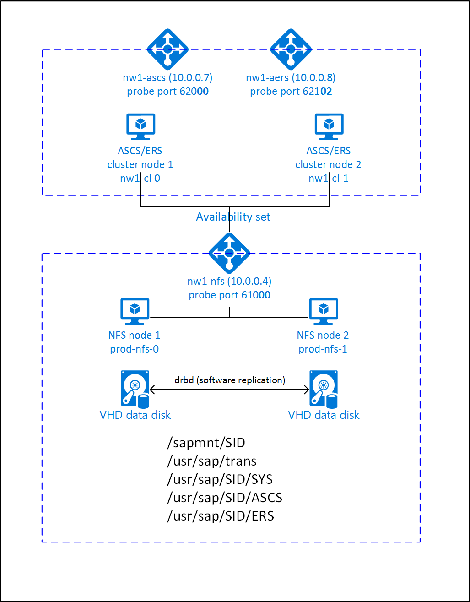

# High availability for SAP NetWeaver on Azure VMs on SUSE Linux Enterprise Server for SAP applications

[dbms-guide]:dbms-guide.md
[deployment-guide]:deployment-guide.md
[planning-guide]:planning-guide.md

[2205917]:https://launchpad.support.sap.com/#/notes/2205917
[1944799]:https://launchpad.support.sap.com/#/notes/1944799
[1928533]:https://launchpad.support.sap.com/#/notes/1928533
[2015553]:https://launchpad.support.sap.com/#/notes/2015553
[2178632]:https://launchpad.support.sap.com/#/notes/2178632
[2191498]:https://launchpad.support.sap.com/#/notes/2191498
[2243692]:https://launchpad.support.sap.com/#/notes/2243692
[1984787]:https://launchpad.support.sap.com/#/notes/1984787
[1999351]:https://launchpad.support.sap.com/#/notes/1999351
[1410736]:https://launchpad.support.sap.com/#/notes/1410736

[sap-swcenter]:https://support.sap.com/en/my-support/software-downloads.html

[suse-ha-guide]:https://www.suse.com/products/sles-for-sap/resource-library/sap-best-practices/
[suse-drbd-guide]:https://www.suse.com/documentation/sle-ha-12/singlehtml/book_sleha_techguides/book_sleha_techguides.html
[suse-ha-12sp3-relnotes]:https://www.suse.com/releasenotes/x86_64/SLE-HA/12-SP3/

[template-multisid-xscs]:https://portal.azure.com/#create/Microsoft.Template/uri/https%3A%2F%2Fraw.githubusercontent.com%2FAzure%2Fazure-quickstart-templates%2Fmaster%2Fsap-3-tier-marketplace-image-multi-sid-xscs-md%2Fazuredeploy.json
[template-converged]:https://portal.azure.com/#create/Microsoft.Template/uri/https%3A%2F%2Fraw.githubusercontent.com%2FAzure%2Fazure-quickstart-templates%2Fmaster%2Fsap-3-tier-marketplace-image-converged-md%2Fazuredeploy.json
[template-file-server]:https://portal.azure.com/#create/Microsoft.Template/uri/https%3A%2F%2Fraw.githubusercontent.com%2FAzure%2Fazure-quickstart-templates%2Fmaster%2Fsap-file-server-md%2Fazuredeploy.json

[sap-hana-ha]:sap-hana-high-availability.md
[nfs-ha]:high-availability-guide-suse-nfs.md

This article describes how to deploy the virtual machines, configure the virtual machines, install the cluster framework, and install a highly available SAP NetWeaver 7.50 system.
In the example configurations, installation commands etc. ASCS instance number 00, ERS instance number 02, and SAP System ID NW1 is used. The names of the resources (for example virtual machines, virtual networks) in the example assume that you have used the [converged template][template-converged] with SAP system ID NW1 to create the resources.

Read the following SAP Notes and papers first

* SAP Note [1928533][1928533], which has:
  * List of Azure VM sizes that are supported for the deployment of SAP software
  * Important capacity information for Azure VM sizes
  * Supported SAP software, and operating system (OS) and database combinations
  * Required SAP kernel version for Windows and Linux on Microsoft Azure

* SAP Note [2015553][2015553] lists prerequisites for SAP-supported SAP software deployments in Azure.
* SAP Note [2205917][2205917] has recommended OS settings for SUSE Linux Enterprise Server for SAP Applications
* SAP Note [1944799][1944799] has SAP HANA Guidelines for SUSE Linux Enterprise Server for SAP Applications
* SAP Note [2178632][2178632] has detailed information about all monitoring metrics reported for SAP in Azure.
* SAP Note [2191498][2191498] has the required SAP Host Agent version for Linux in Azure.
* SAP Note [2243692][2243692] has information about SAP licensing on Linux in Azure.
* SAP Note [1984787][1984787] has general information about SUSE Linux Enterprise Server 12.
* SAP Note [1999351][1999351] has additional troubleshooting information for the Azure Enhanced Monitoring Extension for SAP.
* [SAP Community WIKI](https://wiki.scn.sap.com/wiki/display/HOME/SAPonLinuxNotes) has all required SAP Notes for Linux.
* [Azure Virtual Machines planning and implementation for SAP on Linux][planning-guide]
* [Azure Virtual Machines deployment for SAP on Linux][deployment-guide]
* [Azure Virtual Machines DBMS deployment for SAP on Linux][dbms-guide]
* [SUSE SAP HA Best Practice Guides][suse-ha-guide]
  The guides contain all required information to set up Netweaver HA and SAP HANA System Replication on-premises. Use these guides as a general baseline. They provide much more detailed information.
* [SUSE High Availability Extension 12 SP3 Release Notes][suse-ha-12sp3-relnotes]

## Overview

To achieve high availability, SAP NetWeaver requires an NFS server. The NFS server is configured in a separate cluster and can be used by multiple SAP systems.



The NFS server, SAP NetWeaver ASCS, SAP NetWeaver SCS, SAP NetWeaver ERS, and the SAP HANA database use virtual hostname and virtual IP addresses. On Azure, a load balancer is required to use a virtual IP address. We recommend using [Standard load balancer](https://docs.microsoft.com/azure/load-balancer/quickstart-load-balancer-standard-public-portal). The following list shows the configuration of the (A)SCS and ERS load balancer.

### (A)SCS

* Frontend configuration
  * IP address 10.0.0.7
* Probe Port
  * Port 620<strong>&lt;nr&gt;</strong>
* Load balancing rules
  * If using Standard Load Balancer, select **HA ports**
  * If using Basic Load Balancer, create Load balancing rules for the following ports
    * 32<strong>&lt;nr&gt;</strong> TCP
    * 36<strong>&lt;nr&gt;</strong> TCP
    * 39<strong>&lt;nr&gt;</strong> TCP
    * 81<strong>&lt;nr&gt;</strong> TCP
    * 5<strong>&lt;nr&gt;</strong>13 TCP
    * 5<strong>&lt;nr&gt;</strong>14 TCP
    * 5<strong>&lt;nr&gt;</strong>16 TCP

### ERS

* Frontend configuration
  * IP address 10.0.0.8
* Probe Port
  * Port 621<strong>&lt;nr&gt;</strong>
* Load-balancing rules
  * If using Standard Load Balancer, select **HA ports**
  * If using Basic Load Balancer, create Load balancing rules for the following ports
    * 32<strong>&lt;nr&gt;</strong> TCP
    * 33<strong>&lt;nr&gt;</strong> TCP
    * 5<strong>&lt;nr&gt;</strong>13 TCP
    * 5<strong>&lt;nr&gt;</strong>14 TCP
    * 5<strong>&lt;nr&gt;</strong>16 TCP

* Backend configuration
  * Connected to primary network interfaces of all virtual machines that should be part of the (A)SCS/ERS cluster


## Setting up a highly available NFS server

SAP NetWeaver requires shared storage for the transport and profile directory. Read [High availability for NFS on Azure VMs on SUSE Linux Enterprise Server][nfs-ha] on how to set up an NFS server for SAP NetWeaver.

## Setting up (A)SCS

You can either use an Azure Template from GitHub to deploy all required Azure resources, including the virtual machines, availability set and load balancer or you can deploy the resources manually.

### Deploy Linux via Azure Template

The Azure Marketplace contains an image for SUSE Linux Enterprise Server for SAP Applications 12 that you can use to deploy new virtual machines. The marketplace image contains the resource agent for SAP NetWeaver.

You can use one of the quickstart templates on GitHub to deploy all required resources. The template deploys the virtual machines, the load balancer, availability set etc.
Follow these steps to deploy the template:

1. Open the [ASCS/SCS Multi SID template][template-multisid-xscs] or the [converged template][template-converged] on the Azure portal. 
   The ASCS/SCS template only creates the load-balancing rules for the SAP NetWeaver ASCS/SCS and ERS (Linux only) instances whereas the converged template also creates the load-balancing rules for a database (for example Microsoft SQL Server or SAP HANA). If you plan to install an SAP NetWeaver based system and you also want to install the database on the same machines, use the [converged template][template-converged].
1. Enter the following parameters
   1. Resource Prefix (ASCS/SCS Multi SID template only)  
      Enter the prefix you want to use. The value is used as a prefix for the resources that are deployed.
   3. Sap System ID (converged template only)  
      Enter the SAP system ID of the SAP system you want to install. The ID is used as a prefix for the resources that are deployed.
   4. Stack Type  
      Select the SAP NetWeaver stack type
   5. Os Type  
      Select one of the Linux distributions. For this example, select SLES 12 BYOS
   6. Db Type  
      Select HANA
   7. Sap System Size.  
      The amount of SAPS the new system provides. If you are not sure how many SAPS the system requires, ask your SAP Technology Partner or System Integrator
   8. System Availability  
      Select HA
   9. Admin Username and Admin Password  
      A new user is created that can be used to log on to the machine.
   10. Subnet ID  
   If you want to deploy the VM into an existing VNet where you have a subnet defined the VM should be assigned to, name the ID of that specific subnet. The ID usually looks like /subscriptions/**&lt;subscription ID&gt;**/resourceGroups/**&lt;resource group name&gt;**/providers/Microsoft.Network/virtualNetworks/**&lt;virtual network name&gt;**/subnets/**&lt;subnet name&gt;**

### Deploy Linux manually via Azure portal

You first need to create the virtual machines for this NFS cluster. Afterwards, you create a load balancer and use the virtual machines in the backend pool.

1. Create a Resource Group
1. Create a Virtual Network
1. Create an Availability Set  
   Set max update domain
1. Create Virtual Machine 1  
   Use at least SLES4SAP 12 SP1, in this example the SLES4SAP 12 SP1 image
   https://portal.azure.com/#create/SUSE.SUSELinuxEnterpriseServerforSAPApplications12SP1PremiumImage-ARM  
   SLES For SAP Applications 12 SP1 is used  
   Select Availability Set created earlier  
1. Create Virtual Machine 2  
   Use at least SLES4SAP 12 SP1, in this example the SLES4SAP 12 SP1 image
   https://portal.azure.com/#create/SUSE.SUSELinuxEnterpriseServerforSAPApplications12SP1PremiumImage-ARM  
   SLES For SAP Applications 12 SP1 is used  
   Select Availability Set created earlier  
1. Add at least one data disk to both virtual machines  
   The data disks are used for the /usr/sap/`<SAPSID`> directory
1. Create load balancer (internal, standard):  
   1. Create the frontend IP addresses
      1. IP address 10.0.0.7 for the ASCS
         1. Open the load balancer, select frontend IP pool, and click Add
         1. Enter the name of the new frontend IP pool (for example **nw1-ascs-frontend**)
         1. Set the Assignment to Static and enter the IP address (for example **10.0.0.7**)
         1. Click OK
      1. IP address 10.0.0.8 for the ASCS ERS
         * Repeat the steps above to create an IP address for the ERS (for example **10.0.0.8** and **nw1-aers-backend**)
   1. Create the backend pool
      1. Open the load balancer, select backend pools, and click Add
      1. Enter the name of the new backend pool (for example **nw1-backend**)
      1. Click Add a virtual machine.
      1. Select Virtual Machine
      1. Select the virtual machines of the (A)SCS cluster and their IP addresses.
      1. Click Add
   1. Create the health probes
      1. Port 620**00** for ASCS
         1. Open the load balancer, select health probes, and click Add
         1. Enter the name of the new health probe (for example **nw1-ascs-hp**)
         1. Select TCP as protocol, port 620**00**, keep Interval 5 and Unhealthy threshold 2
         1. Click OK
      1. Port 621**02** for ASCS ERS
         * Repeat the steps above to create a health probe for the ERS (for example 621**02** and **nw1-aers-hp**)
   1. Load-balancing rules
      1. Load-balancing rules for ASCS
         1. Open the load balancer, select load-balancing rules and click Add
         1. Enter the name of the new load balancer rule (for example **nw1-lb-ascs**)
         1. Select the frontend IP address, backend pool, and health probe you created earlier (for example **nw1-ascs-frontend**, **nw1-backend** and **nw1-ascs-hp**)
         1. Select **HA ports**
         1. Increase idle timeout to 30 minutes
         1. **Make sure to enable Floating IP**
         1. Click OK
         * Repeat the steps above to create load balancing rules for ERS (for example **nw1-lb-ers**)
1. Alternatively, if your scenario requires basic load balancer (internal), follow these steps:  
   1. Create the frontend IP addresses
      1. IP address 10.0.0.7 for the ASCS
         1. Open the load balancer, select frontend IP pool, and click Add
         1. Enter the name of the new frontend IP pool (for example **nw1-ascs-frontend**)
         1. Set the Assignment to Static and enter the IP address (for example **10.0.0.7**)
         1. Click OK
      1. IP address 10.0.0.8 for the ASCS ERS
         * Repeat the steps above to create an IP address for the ERS (for example **10.0.0.8** and **nw1-aers-frontend**)
   1. Create the backend pool
      1. Open the load balancer, select backend pools, and click Add
      1. Enter the name of the new backend pool (for example **nw1-backend**)
      1. Click Add a virtual machine.
      1. Select the Availability Set you created earlier
      1. Select the virtual machines of the (A)SCS cluster
      1. Click OK
   1. Create the health probes
      1. Port 620**00** for ASCS
         1. Open the load balancer, select health probes, and click Add
         1. Enter the name of the new health probe (for example **nw1-ascs-hp**)
         1. Select TCP as protocol, port 620**00**, keep Interval 5 and Unhealthy threshold 2
         1. Click OK
      1. Port 621**02** for ASCS ERS
         * Repeat the steps above to create a health probe for the ERS (for example 621**02** and **nw1-aers-hp**)
   1. Load-balancing rules
      1. 32**00** TCP for ASCS
         1. Open the load balancer, select load-balancing rules and click Add
         1. Enter the name of the new load balancer rule (for example **nw1-lb-3200**)
         1. Select the frontend IP address, backend pool, and health probe you created earlier (for example **nw1-ascs-frontend**)
         1. Keep protocol **TCP**, enter port **3200**
         1. Increase idle timeout to 30 minutes
         1. **Make sure to enable Floating IP**
         1. Click OK
      1. Additional ports for the ASCS
         * Repeat the steps above for ports 36**00**, 39**00**, 81**00**, 5**00**13, 5**00**14, 5**00**16 and TCP for the ASCS
      1. Additional ports for the ASCS ERS
         * Repeat the steps above for ports 33**02**, 5**02**13, 5**02**14, 5**02**16 and TCP for the ASCS ERS

> [!Note]
> When VMs without public IP addresses are placed in the backend pool of internal (no public IP address) Standard Azure load balancer, there will be no outbound internet connectivity, unless additional configuration is performed to allow routing to public end points. For details on how to achieve outbound connectivity see [Public endpoint connectivity for Virtual Machines using Azure Standard Load Balancer in SAP high-availability scenarios](https://docs.microsoft.com/azure/virtual-machines/workloads/sap/high-availability-guide-standard-load-balancer-outbound-connections).  

> [!IMPORTANT]
> Do not enable TCP timestamps on Azure VMs placed behind Azure Load Balancer. Enabling TCP timestamps will cause the health probes to fail. Set parameter **net.ipv4.tcp_timestamps** to **0**. For details see [Load Balancer health probes](https://docs.microsoft.com/azure/load-balancer/load-balancer-custom-probe-overview).

### Create Pacemaker cluster

Follow the steps in [Setting up Pacemaker on SUSE Linux Enterprise Server in Azure](high-availability-guide-suse-pacemaker.md) to create a basic Pacemaker cluster for this (A)SCS server.

### Installation

The following items are prefixed with either **[A]** - applicable to all nodes, **[1]** - only applicable to node 1 or **[2]** - only applicable to node 2.

1. **[A]** Install SUSE Connector

   <pre><code>sudo zypper install sap-suse-cluster-connector
   </code></pre>

   > [!NOTE]
   > The known issue with using a dash in host names is fixed with version **3.1.1** of package **sap-suse-cluster-connector**. Make sure that you are using at least version 3.1.1 of package sap-suse-cluster-connector, if using cluster nodes with dash in the host name. Otherwise your cluster will not work. 

   Make sure that you installed the new version of the SAP SUSE cluster connector. The old one was called sap_suse_cluster_connector and the new one is called **sap-suse-cluster-connector**.

   ```
   sudo zypper info sap-suse-cluster-connector
   
   Information for package sap-suse-cluster-connector:
   ---------------------------------------------------
   Repository     : SLE-12-SP3-SAP-Updates
   Name           : sap-suse-cluster-connector
   <b>Version        : 3.0.0-2.2</b>
   Arch           : noarch
   Vendor         : SUSE LLC <https://www.suse.com/>
   Support Level  : Level 3
   Installed Size : 41.6 KiB
   <b>Installed      : Yes</b>
   Status         : up-to-date
   Source package : sap-suse-cluster-connector-3.0.0-2.2.src
   Summary        : SUSE High Availability Setup for SAP Products
   ```

1. **[A]** Update SAP resource agents  
   
   A patch for the resource-agents package is required to use the new configuration, that is described in this article. You can check, if the patch is already installed with the following command

   <pre><code>sudo grep 'parameter name="IS_ERS"' /usr/lib/ocf/resource.d/heartbeat/SAPInstance
   </code></pre>

   The output should be similar to

   <pre><code>&lt;parameter name="IS_ERS" unique="0" required="0"&gt;
   </code></pre>

   If the grep command does not find the IS_ERS parameter, you need to install the patch listed on [the SUSE download page](https://download.suse.com/patch/finder/#bu=suse&familyId=&productId=&dateRange=&startDate=&endDate=&priority=&architecture=&keywords=resource-agents)

   <pre><code># example for patch for SLES 12 SP1
   sudo zypper in -t patch SUSE-SLE-HA-12-SP1-2017-885=1
   # example for patch for SLES 12 SP2
   sudo zypper in -t patch SUSE-SLE-HA-12-SP2-2017-886=1
   </code></pre>

1. **[A]** Setup host name resolution

   You can either use a DNS server or modify the /etc/hosts on all nodes. This example shows how to use the /etc/hosts file.
   Replace the IP address and the hostname in the following commands

   <pre><code>sudo vi /etc/hosts
   </code></pre>

   Insert the following lines to /etc/hosts. Change the IP address and hostname to match your environment   

   <pre><code># IP address of the load balancer frontend configuration for NFS
   <b>10.0.0.4 nw1-nfs</b>
   # IP address of the load balancer frontend configuration for SAP NetWeaver ASCS
   <b>10.0.0.7 nw1-ascs</b>
   # IP address of the load balancer frontend configuration for SAP NetWeaver ASCS ERS
   <b>10.0.0.8 nw1-aers</b>
   # IP address of the load balancer frontend configuration for database
   <b>10.0.0.13 nw1-db</b>
   </code></pre>

## Prepare for SAP NetWeaver installation

1. **[A]** Create the shared directories

   <pre><code>sudo mkdir -p /sapmnt/<b>NW1</b>
   sudo mkdir -p /usr/sap/trans
   sudo mkdir -p /usr/sap/<b>NW1</b>/SYS
   sudo mkdir -p /usr/sap/<b>NW1</b>/ASCS<b>00</b>
   sudo mkdir -p /usr/sap/<b>NW1</b>/ERS<b>02</b>
   
   sudo chattr +i /sapmnt/<b>NW1</b>
   sudo chattr +i /usr/sap/trans
   sudo chattr +i /usr/sap/<b>NW1</b>/SYS
   sudo chattr +i /usr/sap/<b>NW1</b>/ASCS<b>00</b>
   sudo chattr +i /usr/sap/<b>NW1</b>/ERS<b>02</b>
   </code></pre>

1. **[A]** Configure autofs

   <pre><code>sudo vi /etc/auto.master
   
   # Add the following line to the file, save and exit
   +auto.master
   /- /etc/auto.direct
   </code></pre>

   Create a file with

   <pre><code>sudo vi /etc/auto.direct
   
   # Add the following lines to the file, save and exit
   /sapmnt/<b>NW1</b> -nfsvers=4,nosymlink,sync <b>nw1-nfs</b>:/<b>NW1</b>/sapmntsid
   /usr/sap/trans -nfsvers=4,nosymlink,sync <b>nw1-nfs</b>:/<b>NW1</b>/trans
   /usr/sap/<b>NW1</b>/SYS -nfsvers=4,nosymlink,sync <b>nw1-nfs</b>:/<b>NW1</b>/sidsys
   </code></pre>

   Restart autofs to mount the new shares

   <pre><code>sudo systemctl enable autofs
   sudo service autofs restart
   </code></pre>

1. **[A]** Configure SWAP file

   <pre><code>sudo vi /etc/waagent.conf
   
   # Set the property ResourceDisk.EnableSwap to y
   # Create and use swapfile on resource disk.
   ResourceDisk.EnableSwap=<b>y</b>
   
   # Set the size of the SWAP file with property ResourceDisk.SwapSizeMB
   # The free space of resource disk varies by virtual machine size. Make sure that you do not set a value that is too big. You can check the SWAP space with command swapon
   # Size of the swapfile.
   ResourceDisk.SwapSizeMB=<b>2000</b>
   </code></pre>

   Restart the Agent to activate the change

   <pre><code>sudo service waagent restart
   </code></pre>


### Installing SAP NetWeaver ASCS/ERS

1. **[1]** Create a virtual IP resource and health-probe for the ASCS instance

   > [!IMPORTANT]
   > Recent testing revealed situations, where netcat stops responding to requests due to backlog and its limitation of handling only one connection. The netcat resource stops listening to the Azure Load balancer requests and the floating IP becomes unavailable.  
   > For existing Pacemaker clusters, we recommended in the past replacing netcat with socat. Currently we recommend using azure-lb resource agent, which is part of package resource-agents, with the following package version requirements:
   > - For SLES 12 SP4/SP5, the version must be at least resource-agents-4.3.018.a7fb5035-3.30.1.  
   > - For SLES 15/15 SP1, the version must be at least resource-agents-4.3.0184.6ee15eb2-4.13.1.  
   >
   > Note that the change will require brief downtime.  
   > For existing Pacemaker clusters, if the configuration was already changed to use socat as described in [Azure Load-Balancer Detection Hardening](https://www.suse.com/support/kb/doc/?id=7024128), there is no requirement to switch immediately to azure-lb resource agent.

   <pre><code>sudo crm node standby <b>nw1-cl-1</b>
   
   sudo crm configure primitive fs_<b>NW1</b>_ASCS Filesystem device='<b>nw1-nfs</b>:/<b>NW1</b>/ASCS' directory='/usr/sap/<b>NW1</b>/ASCS<b>00</b>' fstype='nfs4' \
     op start timeout=60s interval=0 \
     op stop timeout=60s interval=0 \
     op monitor interval=20s timeout=40s
   
   sudo crm configure primitive vip_<b>NW1</b>_ASCS IPaddr2 \
     params ip=<b>10.0.0.7</b> cidr_netmask=<b>24</b> \
     op monitor interval=10 timeout=20
   
   sudo crm configure primitive nc_<b>NW1</b>_ASCS azure-lb port=620<b>00</b>
   
   sudo crm configure group g-<b>NW1</b>_ASCS fs_<b>NW1</b>_ASCS nc_<b>NW1</b>_ASCS vip_<b>NW1</b>_ASCS \
      meta resource-stickiness=3000
   </code></pre>

   Make sure that the cluster status is ok and that all resources are started. It is not important on which node the resources are running.

   <pre><code>sudo crm_mon -r
   
   # Node nw1-cl-1: standby
   # <b>Online: [ nw1-cl-0 ]</b>
   # 
   # Full list of resources:
   # 
   # stonith-sbd     (stonith:external/sbd): <b>Started nw1-cl-0</b>
   #  Resource Group: g-NW1_ASCS
   #      fs_NW1_ASCS        (ocf::heartbeat:Filesystem):    <b>Started nw1-cl-0</b>
   #      nc_NW1_ASCS        (ocf::heartbeat:azure-lb):      <b>Started nw1-cl-0</b>
   #      vip_NW1_ASCS       (ocf::heartbeat:IPaddr2):       <b>Started nw1-cl-0</b>
   </code></pre>

1. **[1]** Install SAP NetWeaver ASCS  

   Install SAP NetWeaver ASCS as root on the first node using a virtual hostname that maps to the IP address of the load balancer frontend configuration for the ASCS, for example <b>nw1-ascs</b>, <b>10.0.0.7</b> and the instance number that you used for the probe of the load balancer, for example <b>00</b>.

   You can use the sapinst parameter SAPINST_REMOTE_ACCESS_USER to allow a non-root user to connect to sapinst.

   <pre><code>sudo &lt;swpm&gt;/sapinst SAPINST_REMOTE_ACCESS_USER=<b>sapadmin</b>
   </code></pre>

   If the installation fails to create a subfolder in /usr/sap/**NW1**/ASCS**00**, try setting the owner and group of the ASCS**00** folder and retry.

   <pre><code>chown nw1adm /usr/sap/<b>NW1</b>/ASCS<b>00</b>
   chgrp sapsys /usr/sap/<b>NW1</b>/ASCS<b>00</b>
   </code></pre>

1. **[1]** Create a virtual IP resource and health-probe for the ERS instance

   <pre><code>sudo crm node online <b>nw1-cl-1</b>
   sudo crm node standby <b>nw1-cl-0</b>
   
   sudo crm configure primitive fs_<b>NW1</b>_ERS Filesystem device='<b>nw1-nfs</b>:/<b>NW1</b>/ASCSERS' directory='/usr/sap/<b>NW1</b>/ERS<b>02</b>' fstype='nfs4' \
     op start timeout=60s interval=0 \
     op stop timeout=60s interval=0 \
     op monitor interval=20s timeout=40s
   
   sudo crm configure primitive vip_<b>NW1</b>_ERS IPaddr2 \
     params ip=<b>10.0.0.8</b> cidr_netmask=<b>24</b> \
     op monitor interval=10 timeout=20
   
   sudo crm configure primitive nc_<b>NW1</b>_ERS azure-lb port=621<b>02</b>
   
   sudo crm configure group g-<b>NW1</b>_ERS fs_<b>NW1</b>_ERS nc_<b>NW1</b>_ERS vip_<b>NW1</b>_ERS
   </code></pre>

   Make sure that the cluster status is ok and that all resources are started. It is not important on which node the resources are running.

   <pre><code>sudo crm_mon -r
   
   # Node <b>nw1-cl-0: standby</b>
   # <b>Online: [ nw1-cl-1 ]</b>
   # 
   # Full list of resources:
   #
   # stonith-sbd     (stonith:external/sbd): <b>Started nw1-cl-1</b>
   #  Resource Group: g-NW1_ASCS
   #      fs_NW1_ASCS        (ocf::heartbeat:Filesystem):    <b>Started nw1-cl-1</b>
   #      nc_NW1_ASCS        (ocf::heartbeat:azure-lb):      <b>Started nw1-cl-1</b>
   #      vip_NW1_ASCS       (ocf::heartbeat:IPaddr2):       <b>Started nw1-cl-1</b>
   #  Resource Group: g-NW1_ERS
   #      fs_NW1_ERS (ocf::heartbeat:Filesystem):    <b>Started nw1-cl-1</b>
   #      nc_NW1_ERS (ocf::heartbeat:azure-lb):      <b>Started nw1-cl-1</b>
   #      vip_NW1_ERS        (ocf::heartbeat:IPaddr2):       <b>Started nw1-cl-1</b>
   </code></pre>

1. **[2]** Install SAP NetWeaver ERS

   Install SAP NetWeaver ERS as root on the second node using a virtual hostname that maps to the IP address of the load balancer frontend configuration for the ERS, for example <b>nw1-aers</b>, <b>10.0.0.8</b> and the instance number that you used for the probe of the load balancer, for example <b>02</b>.

   You can use the sapinst parameter SAPINST_REMOTE_ACCESS_USER to allow a non-root user to connect to sapinst.

   <pre><code>sudo &lt;swpm&gt;/sapinst SAPINST_REMOTE_ACCESS_USER=<b>sapadmin</b>
   </code></pre>

   > [!NOTE]
   > Use SWPM SP 20 PL 05 or higher. Lower versions do not set the permissions correctly and the installation will fail.

   If the installation fails to create a subfolder in /usr/sap/**NW1**/ERS**02**, try setting the owner and group of the ERS**02** folder and retry.

   <pre><code>chown nw1adm /usr/sap/<b>NW1</b>/ERS<b>02</b>
   chgrp sapsys /usr/sap/<b>NW1</b>/ERS<b>02</b>
   </code></pre>


1. **[1]** Adapt the ASCS/SCS and ERS instance profiles
 
   * ASCS/SCS profile

   <pre><code>sudo vi /sapmnt/<b>NW1</b>/profile/<b>NW1</b>_<b>ASCS00</b>_<b>nw1-ascs</b>
   
   # Change the restart command to a start command
   #Restart_Program_01 = local $(_EN) pf=$(_PF)
   Start_Program_01 = local $(_EN) pf=$(_PF)
   
   # Add the following lines
   service/halib = $(DIR_CT_RUN)/saphascriptco.so
   service/halib_cluster_connector = /usr/bin/sap_suse_cluster_connector
   
   # Add the keep alive parameter
   enque/encni/set_so_keepalive = true
   </code></pre>

   * ERS profile

   <pre><code>sudo vi /sapmnt/<b>NW1</b>/profile/<b>NW1</b>_ERS<b>02</b>_<b>nw1-aers</b>
   
   # Change the restart command to a start command
   #Restart_Program_00 = local $(_ER) pf=$(_PFL) NR=$(SCSID)
   Start_Program_00 = local $(_ER) pf=$(_PFL) NR=$(SCSID)
   
   # Add the following lines
   service/halib = $(DIR_CT_RUN)/saphascriptco.so
   service/halib_cluster_connector = /usr/bin/sap_suse_cluster_connector
   
   # remove Autostart from ERS profile
   # Autostart = 1
   </code></pre>

1. **[A]** Configure Keep Alive

   The communication between the SAP NetWeaver application server and the ASCS/SCS is routed through a software load balancer. The load balancer disconnects inactive connections after a configurable timeout. To prevent this you need to set a parameter in the SAP NetWeaver ASCS/SCS profile and change the Linux system settings. Read [SAP Note 1410736][1410736] for more information.

   The ASCS/SCS profile parameter enque/encni/set_so_keepalive was already added in the last step.

   <pre><code># Change the Linux system configuration
   sudo sysctl net.ipv4.tcp_keepalive_time=120
   </code></pre>

1. **[A]** Configure the SAP users after the installation

   <pre><code># Add sidadm to the haclient group
   sudo usermod -aG haclient <b>nw1</b>adm
   </code></pre>

1. **[1]** Add the ASCS and ERS SAP services to the sapservice file

   Add the ASCS service entry to the second node and copy the ERS service entry to the first node.

   <pre><code>cat /usr/sap/sapservices | grep ASCS<b>00</b> | sudo ssh <b>nw1-cl-1</b> "cat >>/usr/sap/sapservices"
   sudo ssh <b>nw1-cl-1</b> "cat /usr/sap/sapservices" | grep ERS<b>02</b> | sudo tee -a /usr/sap/sapservices
   </code></pre>

1. **[1]** Create the SAP cluster resources

If using enqueue server 1 architecture (ENSA1), define the resources as follows:

   <pre><code>sudo crm configure property maintenance-mode="true"
   
   sudo crm configure primitive rsc_sap_<b>NW1</b>_ASCS<b>00</b> SAPInstance \
    operations \$id=rsc_sap_<b>NW1</b>_ASCS<b>00</b>-operations \
    op monitor interval=11 timeout=60 on-fail=restart \
    params InstanceName=<b>NW1</b>_ASCS<b>00</b>_<b>nw1-ascs</b> START_PROFILE="/sapmnt/<b>NW1</b>/profile/<b>NW1</b>_ASCS<b>00</b>_<b>nw1-ascs</b>" \
    AUTOMATIC_RECOVER=false \
    meta resource-stickiness=5000 failure-timeout=60 migration-threshold=1 priority=10
   
   sudo crm configure primitive rsc_sap_<b>NW1</b>_ERS<b>02</b> SAPInstance \
    operations \$id=rsc_sap_<b>NW1</b>_ERS<b>02</b>-operations \
    op monitor interval=11 timeout=60 on-fail=restart \
    params InstanceName=<b>NW1</b>_ERS<b>02</b>_<b>nw1-aers</b> START_PROFILE="/sapmnt/<b>NW1</b>/profile/<b>NW1</b>_ERS<b>02</b>_<b>nw1-aers</b>" AUTOMATIC_RECOVER=false IS_ERS=true \
    meta priority=1000
   
   sudo crm configure modgroup g-<b>NW1</b>_ASCS add rsc_sap_<b>NW1</b>_ASCS<b>00</b>
   sudo crm configure modgroup g-<b>NW1</b>_ERS add rsc_sap_<b>NW1</b>_ERS<b>02</b>
   
   sudo crm configure colocation col_sap_<b>NW1</b>_no_both -5000: g-<b>NW1</b>_ERS g-<b>NW1</b>_ASCS
   sudo crm configure location loc_sap_<b>NW1</b>_failover_to_ers rsc_sap_<b>NW1</b>_ASCS<b>00</b> rule 2000: runs_ers_<b>NW1</b> eq 1
   sudo crm configure order ord_sap_<b>NW1</b>_first_start_ascs Optional: rsc_sap_<b>NW1</b>_ASCS<b>00</b>:start rsc_sap_<b>NW1</b>_ERS<b>02</b>:stop symmetrical=false
   
   sudo crm node online <b>nw1-cl-0</b>
   sudo crm configure property maintenance-mode="false"
   </code></pre>

  SAP introduced support for enqueue server 2, including replication, as of SAP NW 7.52. Starting with ABAP Platform 1809, enqueue server 2 is installed by default. See SAP note [2630416](https://launchpad.support.sap.com/#/notes/2630416) for enqueue server 2 support.
  If using enqueue server 2 architecture ([ENSA2](https://help.sap.com/viewer/cff8531bc1d9416d91bb6781e628d4e0/1709%20001/en-US/6d655c383abf4c129b0e5c8683e7ecd8.html)), define the resources as follows:

<pre><code>sudo crm configure property maintenance-mode="true"
   
   sudo crm configure primitive rsc_sap_<b>NW1</b>_ASCS<b>00</b> SAPInstance \
    operations \$id=rsc_sap_<b>NW1</b>_ASCS<b>00</b>-operations \
    op monitor interval=11 timeout=60 on-fail=restart \
    params InstanceName=<b>NW1</b>_ASCS<b>00</b>_<b>nw1-ascs</b> START_PROFILE="/sapmnt/<b>NW1</b>/profile/<b>NW1</b>_ASCS<b>00</b>_<b>nw1-ascs</b>" \
    AUTOMATIC_RECOVER=false \
    meta resource-stickiness=5000
   
   sudo crm configure primitive rsc_sap_<b>NW1</b>_ERS<b>02</b> SAPInstance \
    operations \$id=rsc_sap_<b>NW1</b>_ERS<b>02</b>-operations \
    op monitor interval=11 timeout=60 on-fail=restart \
    params InstanceName=<b>NW1</b>_ERS<b>02</b>_<b>nw1-aers</b> START_PROFILE="/sapmnt/<b>NW1</b>/profile/<b>NW1</b>_ERS<b>02</b>_<b>nw1-aers</b>" AUTOMATIC_RECOVER=false IS_ERS=true 
   
   sudo crm configure modgroup g-<b>NW1</b>_ASCS add rsc_sap_<b>NW1</b>_ASCS<b>00</b>
   sudo crm configure modgroup g-<b>NW1</b>_ERS add rsc_sap_<b>NW1</b>_ERS<b>02</b>
   
   sudo crm configure colocation col_sap_<b>NW1</b>_no_both -5000: g-<b>NW1</b>_ERS g-<b>NW1</b>_ASCS
   sudo crm configure order ord_sap_<b>NW1</b>_first_start_ascs Optional: rsc_sap_<b>NW1</b>_ASCS<b>00</b>:start rsc_sap_<b>NW1</b>_ERS<b>02</b>:stop symmetrical=false
   
   sudo crm node online <b>nw1-cl-0</b>
   sudo crm configure property maintenance-mode="false"
   </code></pre>

  If you are upgrading from an older version and switching to enqueue server 2, see SAP note [2641019](https://launchpad.support.sap.com/#/notes/2641019). 

   Make sure that the cluster status is ok and that all resources are started. It is not important on which node the resources are running.


   <pre><code>sudo crm_mon -r
   
   # Online: <b>[ nw1-cl-0 nw1-cl-1 ]</b>
   #
   # Full list of resources:
   #
   # stonith-sbd     (stonith:external/sbd): <b>Started nw1-cl-1</b>
   #  Resource Group: g-NW1_ASCS
   #      fs_NW1_ASCS        (ocf::heartbeat:Filesystem):    <b>Started nw1-cl-1</b>
   #      nc_NW1_ASCS        (ocf::heartbeat:azure-lb):      <b>Started nw1-cl-1</b>
   #      vip_NW1_ASCS       (ocf::heartbeat:IPaddr2):       <b>Started nw1-cl-1</b>
   #      rsc_sap_NW1_ASCS00 (ocf::heartbeat:SAPInstance):   <b>Started nw1-cl-1</b>
   #  Resource Group: g-NW1_ERS
   #      fs_NW1_ERS (ocf::heartbeat:Filesystem):    <b>Started nw1-cl-0</b>
   #      nc_NW1_ERS (ocf::heartbeat:azure-lb):      <b>Started nw1-cl-0</b>
   #      vip_NW1_ERS        (ocf::heartbeat:IPaddr2):       <b>Started nw1-cl-0</b>
   #      rsc_sap_NW1_ERS02  (ocf::heartbeat:SAPInstance):   <b>Started nw1-cl-0</b>
   </code></pre>

## <a name="2d6008b0-685d-426c-b59e-6cd281fd45d7"></a>SAP NetWeaver application server preparation

Some databases require that the database instance installation is executed on an application server. Prepare the application server virtual machines to be able to use them in these cases.

The steps bellow assume that you install the application server on a server different from the ASCS/SCS and HANA servers. Otherwise some of the steps below (like configuring host name resolution) are not needed.

1. Configure operating system

   Reduce the size of the dirty cache. For more information, see [Low write performance on SLES 11/12 servers with large RAM](https://www.suse.com/support/kb/doc/?id=7010287).

   <pre><code>sudo vi /etc/sysctl.conf

   # Change/set the following settings
   vm.dirty_bytes = 629145600
   vm.dirty_background_bytes = 314572800
   </code></pre>

1. Setup host name resolution

   You can either use a DNS server or modify the /etc/hosts on all nodes. This example shows how to use the /etc/hosts file.
   Replace the IP address and the hostname in the following commands

   ```bash
   sudo vi /etc/hosts
   ```

   Insert the following lines to /etc/hosts. Change the IP address and hostname to match your environment

   <pre><code># IP address of the load balancer frontend configuration for NFS
   <b>10.0.0.4 nw1-nfs</b>
   # IP address of the load balancer frontend configuration for SAP NetWeaver ASCS/SCS
   <b>10.0.0.7 nw1-ascs</b>
   # IP address of the load balancer frontend configuration for SAP NetWeaver ERS
   <b>10.0.0.8 nw1-aers</b>
   # IP address of the load balancer frontend configuration for database
   <b>10.0.0.13 nw1-db</b>
   # IP address of all application servers
   <b>10.0.0.20 nw1-di-0</b>
   <b>10.0.0.21 nw1-di-1</b>
   </code></pre>

1. Create the sapmnt directory

   <pre><code>sudo mkdir -p /sapmnt/<b>NW1</b>
   sudo mkdir -p /usr/sap/trans

   sudo chattr +i /sapmnt/<b>NW1</b>
   sudo chattr +i /usr/sap/trans
   </code></pre>

1. Configure autofs

   <pre><code>sudo vi /etc/auto.master
   
   # Add the following line to the file, save and exit
   +auto.master
   /- /etc/auto.direct
   </code></pre>

   Create a new file with

   <pre><code>sudo vi /etc/auto.direct
   
   # Add the following lines to the file, save and exit
   /sapmnt/<b>NW1</b> -nfsvers=4,nosymlink,sync <b>nw1-nfs</b>:/<b>NW1</b>/sapmntsid
   /usr/sap/trans -nfsvers=4,nosymlink,sync <b>nw1-nfs</b>:/<b>NW1</b>/trans
   </code></pre>

   Restart autofs to mount the new shares

   <pre><code>sudo systemctl enable autofs
   sudo service autofs restart
   </code></pre>

1. Configure SWAP file

   <pre><code>sudo vi /etc/waagent.conf
   
   # Set the property ResourceDisk.EnableSwap to y
   # Create and use swapfile on resource disk.
   ResourceDisk.EnableSwap=<b>y</b>
   
   # Set the size of the SWAP file with property ResourceDisk.SwapSizeMB
   # The free space of resource disk varies by virtual machine size. Make sure that you do not set a value that is too big. You can check the SWAP space with command swapon
   # Size of the swapfile.
   ResourceDisk.SwapSizeMB=<b>2000</b>
   </code></pre>

   Restart the Agent to activate the change

   <pre><code>sudo service waagent restart
   </code></pre>

## Install database

In this example, SAP NetWeaver is installed on SAP HANA. You can use every supported database for this installation. For more information on how to install SAP HANA in Azure, see [High Availability of SAP HANA on Azure Virtual Machines (VMs)][sap-hana-ha]. For a list of supported databases, see [SAP Note 1928533][1928533].

1. Run the SAP database instance installation

   Install the SAP NetWeaver database instance as root using a virtual hostname that maps to the IP address of the load balancer frontend configuration for the database for example <b>nw1-db</b> and <b>10.0.0.13</b>.

   You can use the sapinst parameter SAPINST_REMOTE_ACCESS_USER to allow a non-root user to connect to sapinst.

   <pre><code>sudo &lt;swpm&gt;/sapinst SAPINST_REMOTE_ACCESS_USER=<b>sapadmin</b>
   </code></pre>

## SAP NetWeaver application server installation

Follow these steps to install an SAP application server.

1. Prepare application server

   Follow the steps in the chapter [SAP NetWeaver application server preparation](high-availability-guide-suse.md#2d6008b0-685d-426c-b59e-6cd281fd45d7) above to prepare the application server.

1. Install SAP NetWeaver application server

   Install a primary or additional SAP NetWeaver applications server.

   You can use the sapinst parameter SAPINST_REMOTE_ACCESS_USER to allow a non-root user to connect to sapinst.

   <pre><code>sudo &lt;swpm&gt;/sapinst SAPINST_REMOTE_ACCESS_USER=<b>sapadmin</b>
   </code></pre>

1. Update SAP HANA secure store

   Update the SAP HANA secure store to point to the virtual name of the SAP HANA System Replication setup.

   Run the following command to list the entries
   <pre><code>hdbuserstore List
   </code></pre>

   This should list all entries and should look similar to
   <pre><code>DATA FILE       : /home/nw1adm/.hdb/nw1-di-0/SSFS_HDB.DAT
   KEY FILE        : /home/nw1adm/.hdb/nw1-di-0/SSFS_HDB.KEY
   
   KEY DEFAULT
     ENV : 10.0.0.14:<b>30313</b>
     USER: <b>SAPABAP1</b>
     DATABASE: <b>HN1</b>
   </code></pre>

   The output shows that the IP address of the default entry is pointing to the virtual machine and not to the load balancer's IP address. This entry needs to be changed to point to the virtual hostname of the load balancer. Make sure to use the same port (**30313** in the output above) and database name (**HN1** in the output above)!

   <pre><code>su - <b>nw1</b>adm
   hdbuserstore SET DEFAULT <b>nw1-db:30313@HN1</b> <b>SAPABAP1</b> <b>&lt;password of ABAP schema&gt;</b>
   </code></pre>

## Test the cluster setup

The following tests are a copy of the test cases in the best practices guides of SUSE. They are copied for your convenience. Always also read the best practices guides and perform all additional tests that might have been added.

1. Test HAGetFailoverConfig, HACheckConfig and HACheckFailoverConfig

   Run the following commands as \<sapsid>adm on the node where the ASCS instance is currently running. If the commands fail with FAIL: Insufficient memory, it might be caused by dashes in your hostname. This is a known issue and will be fixed by SUSE in the sap-suse-cluster-connector package.

   <pre><code>nw1-cl-0:nw1adm 54> sapcontrol -nr <b>00</b> -function HAGetFailoverConfig
   
   # 15.08.2018 13:50:36
   # HAGetFailoverConfig
   # OK
   # HAActive: TRUE
   # HAProductVersion: Toolchain Module
   # HASAPInterfaceVersion: Toolchain Module (sap_suse_cluster_connector 3.0.1)
   # HADocumentation: https://www.suse.com/products/sles-for-sap/resource-library/sap-best-practices/
   # HAActiveNode:
   # HANodes: nw1-cl-0, nw1-cl-1
   
   nw1-cl-0:nw1adm 55> sapcontrol -nr 00 -function HACheckConfig
   
   # 15.08.2018 14:00:04
   # HACheckConfig
   # OK
   # state, category, description, comment
   # SUCCESS, SAP CONFIGURATION, Redundant ABAP instance configuration, 2 ABAP instances detected
   # SUCCESS, SAP CONFIGURATION, Redundant Java instance configuration, 0 Java instances detected
   # SUCCESS, SAP CONFIGURATION, Enqueue separation, All Enqueue server separated from application server
   # SUCCESS, SAP CONFIGURATION, MessageServer separation, All MessageServer separated from application server
   # SUCCESS, SAP CONFIGURATION, ABAP instances on multiple hosts, ABAP instances on multiple hosts detected
   # SUCCESS, SAP CONFIGURATION, Redundant ABAP SPOOL service configuration, 2 ABAP instances with SPOOL service detected
   # SUCCESS, SAP STATE, Redundant ABAP SPOOL service state, 2 ABAP instances with active SPOOL service detected
   # SUCCESS, SAP STATE, ABAP instances with ABAP SPOOL service on multiple hosts, ABAP instances with active ABAP SPOOL service on multiple hosts detected
   # SUCCESS, SAP CONFIGURATION, Redundant ABAP BATCH service configuration, 2 ABAP instances with BATCH service detected
   # SUCCESS, SAP STATE, Redundant ABAP BATCH service state, 2 ABAP instances with active BATCH service detected
   # SUCCESS, SAP STATE, ABAP instances with ABAP BATCH service on multiple hosts, ABAP instances with active ABAP BATCH service on multiple hosts detected
   # SUCCESS, SAP CONFIGURATION, Redundant ABAP DIALOG service configuration, 2 ABAP instances with DIALOG service detected
   # SUCCESS, SAP STATE, Redundant ABAP DIALOG service state, 2 ABAP instances with active DIALOG service detected
   # SUCCESS, SAP STATE, ABAP instances with ABAP DIALOG service on multiple hosts, ABAP instances with active ABAP DIALOG service on multiple hosts detected
   # SUCCESS, SAP CONFIGURATION, Redundant ABAP UPDATE service configuration, 2 ABAP instances with UPDATE service detected
   # SUCCESS, SAP STATE, Redundant ABAP UPDATE service state, 2 ABAP instances with active UPDATE service detected
   # SUCCESS, SAP STATE, ABAP instances with ABAP UPDATE service on multiple hosts, ABAP instances with active ABAP UPDATE service on multiple hosts detected
   # SUCCESS, SAP STATE, SCS instance running, SCS instance status ok
   # SUCCESS, SAP CONFIGURATION, SAPInstance RA sufficient version (nw1-ascs_NW1_00), SAPInstance includes is-ers patch
   # SUCCESS, SAP CONFIGURATION, Enqueue replication (nw1-ascs_NW1_00), Enqueue replication enabled
   # SUCCESS, SAP STATE, Enqueue replication state (nw1-ascs_NW1_00), Enqueue replication active
   
   nw1-cl-0:nw1adm 56> sapcontrol -nr 00 -function HACheckFailoverConfig
   
   # 15.08.2018 14:04:08
   # HACheckFailoverConfig
   # OK
   # state, category, description, comment
   # SUCCESS, SAP CONFIGURATION, SAPInstance RA sufficient version, SAPInstance includes is-ers patch
   </code></pre>

1. Manually migrate the ASCS instance

   Resource state before starting the test:

   <pre><code>stonith-sbd     (stonith:external/sbd): Started nw1-cl-0
    Resource Group: g-NW1_ASCS
        fs_NW1_ASCS        (ocf::heartbeat:Filesystem):    Started nw1-cl-0
        nc_NW1_ASCS        (ocf::heartbeat:azure-lb):      Started nw1-cl-0
        vip_NW1_ASCS       (ocf::heartbeat:IPaddr2):       Started nw1-cl-0
        rsc_sap_NW1_ASCS00 (ocf::heartbeat:SAPInstance):   Started nw1-cl-0
    Resource Group: g-NW1_ERS
        fs_NW1_ERS (ocf::heartbeat:Filesystem):    Started nw1-cl-1
        nc_NW1_ERS (ocf::heartbeat:azure-lb):      Started nw1-cl-1
        vip_NW1_ERS        (ocf::heartbeat:IPaddr2):       Started nw1-cl-1
        rsc_sap_NW1_ERS02  (ocf::heartbeat:SAPInstance):   Started nw1-cl-1
   </code></pre>

   Run the following commands as root to migrate the ASCS instance.

   <pre><code>nw1-cl-0:~ # crm resource migrate rsc_sap_NW1_ASCS00 force
   # INFO: Move constraint created for rsc_sap_NW1_ASCS00
   
   nw1-cl-0:~ # crm resource unmigrate rsc_sap_NW1_ASCS00
   # INFO: Removed migration constraints for rsc_sap_NW1_ASCS00
   
   # Remove failed actions for the ERS that occurred as part of the migration
   nw1-cl-0:~ # crm resource cleanup rsc_sap_NW1_ERS02
   </code></pre>

   Resource state after the test:

   <pre><code>stonith-sbd     (stonith:external/sbd): Started nw1-cl-0
    Resource Group: g-NW1_ASCS
        fs_NW1_ASCS        (ocf::heartbeat:Filesystem):    Started nw1-cl-1
        nc_NW1_ASCS        (ocf::heartbeat:azure-lb):      Started nw1-cl-1
        vip_NW1_ASCS       (ocf::heartbeat:IPaddr2):       Started nw1-cl-1
        rsc_sap_NW1_ASCS00 (ocf::heartbeat:SAPInstance):   Started nw1-cl-1
    Resource Group: g-NW1_ERS
        fs_NW1_ERS (ocf::heartbeat:Filesystem):    Started nw1-cl-0
        nc_NW1_ERS (ocf::heartbeat:azure-lb):      Started nw1-cl-0
        vip_NW1_ERS        (ocf::heartbeat:IPaddr2):       Started nw1-cl-0
        rsc_sap_NW1_ERS02  (ocf::heartbeat:SAPInstance):   Started nw1-cl-0
   </code></pre>

1. Test HAFailoverToNode

   Resource state before starting the test:

   <pre><code>stonith-sbd     (stonith:external/sbd): Started nw1-cl-0
    Resource Group: g-NW1_ASCS
        fs_NW1_ASCS        (ocf::heartbeat:Filesystem):    Started nw1-cl-1
        nc_NW1_ASCS        (ocf::heartbeat:azure-lb):      Started nw1-cl-1
        vip_NW1_ASCS       (ocf::heartbeat:IPaddr2):       Started nw1-cl-1
        rsc_sap_NW1_ASCS00 (ocf::heartbeat:SAPInstance):   Started nw1-cl-1
    Resource Group: g-NW1_ERS
        fs_NW1_ERS (ocf::heartbeat:Filesystem):    Started nw1-cl-0
        nc_NW1_ERS (ocf::heartbeat:azure-lb):      Started nw1-cl-0
        vip_NW1_ERS        (ocf::heartbeat:IPaddr2):       Started nw1-cl-0
        rsc_sap_NW1_ERS02  (ocf::heartbeat:SAPInstance):   Started nw1-cl-0
   </code></pre>

   Run the following commands as \<sapsid>adm to migrate the ASCS instance.

   <pre><code>nw1-cl-0:nw1adm 55> sapcontrol -nr 00 -host nw1-ascs -user nw1adm &lt;password&gt; -function HAFailoverToNode ""
   
   # run as root
   # Remove failed actions for the ERS that occurred as part of the migration
   nw1-cl-0:~ # crm resource cleanup rsc_sap_NW1_ERS02
   # Remove migration constraints
   nw1-cl-0:~ # crm resource clear rsc_sap_NW1_ASCS00
   #INFO: Removed migration constraints for rsc_sap_NW1_ASCS00
   </code></pre>

   Resource state after the test:

   <pre><code>stonith-sbd     (stonith:external/sbd): Started nw1-cl-0
    Resource Group: g-NW1_ASCS
        fs_NW1_ASCS        (ocf::heartbeat:Filesystem):    Started nw1-cl-0
        nc_NW1_ASCS        (ocf::heartbeat:azure-lb):      Started nw1-cl-0
        vip_NW1_ASCS       (ocf::heartbeat:IPaddr2):       Started nw1-cl-0
        rsc_sap_NW1_ASCS00 (ocf::heartbeat:SAPInstance):   Started nw1-cl-0
    Resource Group: g-NW1_ERS
        fs_NW1_ERS (ocf::heartbeat:Filesystem):    Started nw1-cl-1
        nc_NW1_ERS (ocf::heartbeat:azure-lb):      Started nw1-cl-1
        vip_NW1_ERS        (ocf::heartbeat:IPaddr2):       Started nw1-cl-1
        rsc_sap_NW1_ERS02  (ocf::heartbeat:SAPInstance):   Started nw1-cl-1
   </code></pre>

1. Simulate node crash

   Resource state before starting the test:

   <pre><code>stonith-sbd     (stonith:external/sbd): Started nw1-cl-0
    Resource Group: g-NW1_ASCS
        fs_NW1_ASCS        (ocf::heartbeat:Filesystem):    Started nw1-cl-0
        nc_NW1_ASCS        (ocf::heartbeat:azure-lb):      Started nw1-cl-0
        vip_NW1_ASCS       (ocf::heartbeat:IPaddr2):       Started nw1-cl-0
        rsc_sap_NW1_ASCS00 (ocf::heartbeat:SAPInstance):   Started nw1-cl-0
    Resource Group: g-NW1_ERS
        fs_NW1_ERS (ocf::heartbeat:Filesystem):    Started nw1-cl-1
        nc_NW1_ERS (ocf::heartbeat:azure-lb):      Started nw1-cl-1
        vip_NW1_ERS        (ocf::heartbeat:IPaddr2):       Started nw1-cl-1
        rsc_sap_NW1_ERS02  (ocf::heartbeat:SAPInstance):   Started nw1-cl-1
   </code></pre>

   Run the following command as root on the node where the ASCS instance is running

   <pre><code>nw1-cl-0:~ # echo b > /proc/sysrq-trigger
   </code></pre>

   If you use SBD, Pacemaker should not automatically start on the killed node. The status after the node is started again should look like this.

   <pre><code>Online: [ nw1-cl-1 ]
   OFFLINE: [ nw1-cl-0 ]
   
   Full list of resources:
   
   stonith-sbd     (stonith:external/sbd): Started nw1-cl-1
    Resource Group: g-NW1_ASCS
        fs_NW1_ASCS        (ocf::heartbeat:Filesystem):    Started nw1-cl-1
        nc_NW1_ASCS        (ocf::heartbeat:azure-lb):      Started nw1-cl-1
        vip_NW1_ASCS       (ocf::heartbeat:IPaddr2):       Started nw1-cl-1
        rsc_sap_NW1_ASCS00 (ocf::heartbeat:SAPInstance):   Started nw1-cl-1
    Resource Group: g-NW1_ERS
        fs_NW1_ERS (ocf::heartbeat:Filesystem):    Started nw1-cl-1
        nc_NW1_ERS (ocf::heartbeat:azure-lb):      Started nw1-cl-1
        vip_NW1_ERS        (ocf::heartbeat:IPaddr2):       Started nw1-cl-1
        rsc_sap_NW1_ERS02  (ocf::heartbeat:SAPInstance):   Started nw1-cl-1
   
   Failed Actions:
   * rsc_sap_NW1_ERS02_monitor_11000 on nw1-cl-1 'not running' (7): call=219, status=complete, exitreason='none',
       last-rc-change='Wed Aug 15 14:38:38 2018', queued=0ms, exec=0ms
   </code></pre>

   Use the following commands to start Pacemaker on the killed node, clean the SBD messages, and clean the failed resources.

   <pre><code># run as root
   # list the SBD device(s)
   nw1-cl-0:~ # cat /etc/sysconfig/sbd | grep SBD_DEVICE=
   # SBD_DEVICE="/dev/disk/by-id/scsi-36001405772fe8401e6240c985857e116;/dev/disk/by-id/scsi-36001405034a84428af24ddd8c3a3e9e1;/dev/disk/by-id/scsi-36001405cdd5ac8d40e548449318510c3"
   
   nw1-cl-0:~ # sbd -d /dev/disk/by-id/scsi-36001405772fe8401e6240c985857e116 -d /dev/disk/by-id/scsi-36001405034a84428af24ddd8c3a3e9e1 -d /dev/disk/by-id/scsi-36001405cdd5ac8d40e548449318510c3 message nw1-cl-0 clear
   
   nw1-cl-0:~ # systemctl start pacemaker
   nw1-cl-0:~ # crm resource cleanup rsc_sap_NW1_ASCS00
   nw1-cl-0:~ # crm resource cleanup rsc_sap_NW1_ERS02
   </code></pre>

   Resource state after the test:

   <pre><code>stonith-sbd     (stonith:external/sbd): Started nw1-cl-1
    Resource Group: g-NW1_ASCS
        fs_NW1_ASCS        (ocf::heartbeat:Filesystem):    Started nw1-cl-1
        nc_NW1_ASCS        (ocf::heartbeat:azure-lb):      Started nw1-cl-1
        vip_NW1_ASCS       (ocf::heartbeat:IPaddr2):       Started nw1-cl-1
        rsc_sap_NW1_ASCS00 (ocf::heartbeat:SAPInstance):   Started nw1-cl-1
    Resource Group: g-NW1_ERS
        fs_NW1_ERS (ocf::heartbeat:Filesystem):    Started nw1-cl-0
        nc_NW1_ERS (ocf::heartbeat:azure-lb):      Started nw1-cl-0
        vip_NW1_ERS        (ocf::heartbeat:IPaddr2):       Started nw1-cl-0
        rsc_sap_NW1_ERS02  (ocf::heartbeat:SAPInstance):   Started nw1-cl-0
   </code></pre>

1. Test manual restart of ASCS instance

   Resource state before starting the test:

   <pre><code>stonith-sbd     (stonith:external/sbd): Started nw1-cl-1
    Resource Group: g-NW1_ASCS
        fs_NW1_ASCS        (ocf::heartbeat:Filesystem):    Started nw1-cl-1
        nc_NW1_ASCS        (ocf::heartbeat:azure-lb):      Started nw1-cl-1
        vip_NW1_ASCS       (ocf::heartbeat:IPaddr2):       Started nw1-cl-1
        rsc_sap_NW1_ASCS00 (ocf::heartbeat:SAPInstance):   Started nw1-cl-1
    Resource Group: g-NW1_ERS
        fs_NW1_ERS (ocf::heartbeat:Filesystem):    Started nw1-cl-0
        nc_NW1_ERS (ocf::heartbeat:azure-lb):      Started nw1-cl-0
        vip_NW1_ERS        (ocf::heartbeat:IPaddr2):       Started nw1-cl-0
        rsc_sap_NW1_ERS02  (ocf::heartbeat:SAPInstance):   Started nw1-cl-0
   </code></pre>

   Create an enqueue lock by, for example edit a user in transaction su01. Run the following commands as \<sapsid>adm on the node where the ASCS instance is running. The commands will stop the ASCS instance and start it again. If using enqueue server 1 architecture, the enqueue lock is expected to be lost in this test. If using enqueue server 2 architecture, the enqueue will be retained. 

   <pre><code>nw1-cl-1:nw1adm 54> sapcontrol -nr 00 -function StopWait 600 2
   </code></pre>

   The ASCS instance should now be disabled in Pacemaker

   <pre><code>rsc_sap_NW1_ASCS00 (ocf::heartbeat:SAPInstance):   Stopped (disabled)
   </code></pre>

   Start the ASCS instance again on the same node.

   <pre><code>nw1-cl-1:nw1adm 54> sapcontrol -nr 00 -function StartWait 600 2
   </code></pre>

   The enqueue lock of transaction su01 should be lost and the back-end should have been reset. Resource state after the test:

   <pre><code>stonith-sbd     (stonith:external/sbd): Started nw1-cl-1
    Resource Group: g-NW1_ASCS
        fs_NW1_ASCS        (ocf::heartbeat:Filesystem):    Started nw1-cl-1
        nc_NW1_ASCS        (ocf::heartbeat:azure-lb):      Started nw1-cl-1
        vip_NW1_ASCS       (ocf::heartbeat:IPaddr2):       Started nw1-cl-1
        rsc_sap_NW1_ASCS00 (ocf::heartbeat:SAPInstance):   Started nw1-cl-1
    Resource Group: g-NW1_ERS
        fs_NW1_ERS (ocf::heartbeat:Filesystem):    Started nw1-cl-0
        nc_NW1_ERS (ocf::heartbeat:azure-lb):      Started nw1-cl-0
        vip_NW1_ERS        (ocf::heartbeat:IPaddr2):       Started nw1-cl-0
        rsc_sap_NW1_ERS02  (ocf::heartbeat:SAPInstance):   Started nw1-cl-0
   </code></pre>

1. Kill message server process

   Resource state before starting the test:

   <pre><code>stonith-sbd     (stonith:external/sbd): Started nw1-cl-1
    Resource Group: g-NW1_ASCS
        fs_NW1_ASCS        (ocf::heartbeat:Filesystem):    Started nw1-cl-1
        nc_NW1_ASCS        (ocf::heartbeat:azure-lb):      Started nw1-cl-1
        vip_NW1_ASCS       (ocf::heartbeat:IPaddr2):       Started nw1-cl-1
        rsc_sap_NW1_ASCS00 (ocf::heartbeat:SAPInstance):   Started nw1-cl-1
    Resource Group: g-NW1_ERS
        fs_NW1_ERS (ocf::heartbeat:Filesystem):    Started nw1-cl-0
        nc_NW1_ERS (ocf::heartbeat:azure-lb):      Started nw1-cl-0
        vip_NW1_ERS        (ocf::heartbeat:IPaddr2):       Started nw1-cl-0
        rsc_sap_NW1_ERS02  (ocf::heartbeat:SAPInstance):   Started nw1-cl-0
   </code></pre>

   Run the following commands as root to identify the process of the message server and kill it.

   <pre><code>nw1-cl-1:~ # pgrep ms.sapNW1 | xargs kill -9
   </code></pre>

   If you only kill the message server once, it will be restarted by sapstart. If you kill it often enough, Pacemaker will eventually move the ASCS instance to the other node. Run the following commands as root to clean up the resource state of the ASCS and ERS instance after the test.

   <pre><code>nw1-cl-0:~ # crm resource cleanup rsc_sap_NW1_ASCS00
   nw1-cl-0:~ # crm resource cleanup rsc_sap_NW1_ERS02
   </code></pre>

   Resource state after the test:

   <pre><code>stonith-sbd     (stonith:external/sbd): Started nw1-cl-1
    Resource Group: g-NW1_ASCS
        fs_NW1_ASCS        (ocf::heartbeat:Filesystem):    Started nw1-cl-0
        nc_NW1_ASCS        (ocf::heartbeat:azure-lb):      Started nw1-cl-0
        vip_NW1_ASCS       (ocf::heartbeat:IPaddr2):       Started nw1-cl-0
        rsc_sap_NW1_ASCS00 (ocf::heartbeat:SAPInstance):   Started nw1-cl-0
    Resource Group: g-NW1_ERS
        fs_NW1_ERS (ocf::heartbeat:Filesystem):    Started nw1-cl-1
        nc_NW1_ERS (ocf::heartbeat:azure-lb):      Started nw1-cl-1
        vip_NW1_ERS        (ocf::heartbeat:IPaddr2):       Started nw1-cl-1
        rsc_sap_NW1_ERS02  (ocf::heartbeat:SAPInstance):   Started nw1-cl-1
   </code></pre>

1. Kill enqueue server process

   Resource state before starting the test:

   <pre><code>stonith-sbd     (stonith:external/sbd): Started nw1-cl-1
    Resource Group: g-NW1_ASCS
        fs_NW1_ASCS        (ocf::heartbeat:Filesystem):    Started nw1-cl-0
        nc_NW1_ASCS        (ocf::heartbeat:azure-lb):      Started nw1-cl-0
        vip_NW1_ASCS       (ocf::heartbeat:IPaddr2):       Started nw1-cl-0
        rsc_sap_NW1_ASCS00 (ocf::heartbeat:SAPInstance):   Started nw1-cl-0
    Resource Group: g-NW1_ERS
        fs_NW1_ERS (ocf::heartbeat:Filesystem):    Started nw1-cl-1
        nc_NW1_ERS (ocf::heartbeat:azure-lb):      Started nw1-cl-1
        vip_NW1_ERS        (ocf::heartbeat:IPaddr2):       Started nw1-cl-1
        rsc_sap_NW1_ERS02  (ocf::heartbeat:SAPInstance):   Started nw1-cl-1
   </code></pre>

   Run the following commands as root on the node where the ASCS instance is running to kill the enqueue server.

   <pre><code>nw1-cl-0:~ # pgrep en.sapNW1 | xargs kill -9
   </code></pre>

   The ASCS instance should immediately fail over to the other node. The ERS instance should also fail over after the ASCS instance is started. Run the following commands as root to clean up the resource state of the ASCS and ERS instance after the test.

   <pre><code>nw1-cl-0:~ # crm resource cleanup rsc_sap_NW1_ASCS00
   nw1-cl-0:~ # crm resource cleanup rsc_sap_NW1_ERS02
   </code></pre>

   Resource state after the test:

   <pre><code>stonith-sbd     (stonith:external/sbd): Started nw1-cl-1
    Resource Group: g-NW1_ASCS
        fs_NW1_ASCS        (ocf::heartbeat:Filesystem):    Started nw1-cl-1
        nc_NW1_ASCS        (ocf::heartbeat:azure-lb):      Started nw1-cl-1
        vip_NW1_ASCS       (ocf::heartbeat:IPaddr2):       Started nw1-cl-1
        rsc_sap_NW1_ASCS00 (ocf::heartbeat:SAPInstance):   Started nw1-cl-1
    Resource Group: g-NW1_ERS
        fs_NW1_ERS (ocf::heartbeat:Filesystem):    Started nw1-cl-0
        nc_NW1_ERS (ocf::heartbeat:azure-lb):      Started nw1-cl-0
        vip_NW1_ERS        (ocf::heartbeat:IPaddr2):       Started nw1-cl-0
        rsc_sap_NW1_ERS02  (ocf::heartbeat:SAPInstance):   Started nw1-cl-0
   </code></pre>

1. Kill enqueue replication server process

   Resource state before starting the test:

   <pre><code>stonith-sbd     (stonith:external/sbd): Started nw1-cl-1
    Resource Group: g-NW1_ASCS
        fs_NW1_ASCS        (ocf::heartbeat:Filesystem):    Started nw1-cl-1
        nc_NW1_ASCS        (ocf::heartbeat:azure-lb):      Started nw1-cl-1
        vip_NW1_ASCS       (ocf::heartbeat:IPaddr2):       Started nw1-cl-1
        rsc_sap_NW1_ASCS00 (ocf::heartbeat:SAPInstance):   Started nw1-cl-1
    Resource Group: g-NW1_ERS
        fs_NW1_ERS (ocf::heartbeat:Filesystem):    Started nw1-cl-0
        nc_NW1_ERS (ocf::heartbeat:azure-lb):      Started nw1-cl-0
        vip_NW1_ERS        (ocf::heartbeat:IPaddr2):       Started nw1-cl-0
        rsc_sap_NW1_ERS02  (ocf::heartbeat:SAPInstance):   Started nw1-cl-0
   </code></pre>

   Run the following command as root on the node where the ERS instance is running to kill the enqueue replication server process.

   <pre><code>nw1-cl-0:~ # pgrep er.sapNW1 | xargs kill -9
   </code></pre>

   If you only run the command once, sapstart will restart the process. If you run it often enough, sapstart will not restart the process and the resource will be in a stopped state. Run the following commands as root to clean up the resource state of the ERS instance after the test.

   <pre><code>nw1-cl-0:~ # crm resource cleanup rsc_sap_NW1_ERS02
   </code></pre>

   Resource state after the test:

   <pre><code>stonith-sbd     (stonith:external/sbd): Started nw1-cl-1
    Resource Group: g-NW1_ASCS
        fs_NW1_ASCS        (ocf::heartbeat:Filesystem):    Started nw1-cl-1
        nc_NW1_ASCS        (ocf::heartbeat:azure-lb):      Started nw1-cl-1
        vip_NW1_ASCS       (ocf::heartbeat:IPaddr2):       Started nw1-cl-1
        rsc_sap_NW1_ASCS00 (ocf::heartbeat:SAPInstance):   Started nw1-cl-1
    Resource Group: g-NW1_ERS
        fs_NW1_ERS (ocf::heartbeat:Filesystem):    Started nw1-cl-0
        nc_NW1_ERS (ocf::heartbeat:azure-lb):      Started nw1-cl-0
        vip_NW1_ERS        (ocf::heartbeat:IPaddr2):       Started nw1-cl-0
        rsc_sap_NW1_ERS02  (ocf::heartbeat:SAPInstance):   Started nw1-cl-0
   </code></pre>

1. Kill enqueue sapstartsrv process

   Resource state before starting the test:

   <pre><code>stonith-sbd     (stonith:external/sbd): Started nw1-cl-1
    Resource Group: g-NW1_ASCS
        fs_NW1_ASCS        (ocf::heartbeat:Filesystem):    Started nw1-cl-1
        nc_NW1_ASCS        (ocf::heartbeat:azure-lb):      Started nw1-cl-1
        vip_NW1_ASCS       (ocf::heartbeat:IPaddr2):       Started nw1-cl-1
        rsc_sap_NW1_ASCS00 (ocf::heartbeat:SAPInstance):   Started nw1-cl-1
    Resource Group: g-NW1_ERS
        fs_NW1_ERS (ocf::heartbeat:Filesystem):    Started nw1-cl-0
        nc_NW1_ERS (ocf::heartbeat:azure-lb):      Started nw1-cl-0
        vip_NW1_ERS        (ocf::heartbeat:IPaddr2):       Started nw1-cl-0
        rsc_sap_NW1_ERS02  (ocf::heartbeat:SAPInstance):   Started nw1-cl-0
   </code></pre>

   Run the following commands as root on the node where the ASCS is running.

   <pre><code>nw1-cl-1:~ # pgrep -fl ASCS00.*sapstartsrv
   # 59545 sapstartsrv
   
   nw1-cl-1:~ # kill -9 59545
   </code></pre>

   The sapstartsrv process should always be restarted by the Pacemaker resource agent. Resource state after the test:

   <pre><code>stonith-sbd     (stonith:external/sbd): Started nw1-cl-1
    Resource Group: g-NW1_ASCS
        fs_NW1_ASCS        (ocf::heartbeat:Filesystem):    Started nw1-cl-1
        nc_NW1_ASCS        (ocf::heartbeat:azure-lb):      Started nw1-cl-1
        vip_NW1_ASCS       (ocf::heartbeat:IPaddr2):       Started nw1-cl-1
        rsc_sap_NW1_ASCS00 (ocf::heartbeat:SAPInstance):   Started nw1-cl-1
    Resource Group: g-NW1_ERS
        fs_NW1_ERS (ocf::heartbeat:Filesystem):    Started nw1-cl-0
        nc_NW1_ERS (ocf::heartbeat:azure-lb):      Started nw1-cl-0
        vip_NW1_ERS        (ocf::heartbeat:IPaddr2):       Started nw1-cl-0
        rsc_sap_NW1_ERS02  (ocf::heartbeat:SAPInstance):   Started nw1-cl-0
   </code></pre>

## Next steps

* [HA for SAP NW on Azure VMs on SLES for SAP applications multi-SID guide](https://docs.microsoft.com/azure/virtual-machines/workloads/sap/high-availability-guide-suse-multi-sid)
* [Azure Virtual Machines planning and implementation for SAP][planning-guide]
* [Azure Virtual Machines deployment for SAP][deployment-guide]
* [Azure Virtual Machines DBMS deployment for SAP][dbms-guide]
* To learn how to establish high availability and plan for disaster recovery of SAP HANA on Azure VMs, see [High Availability of SAP HANA on Azure Virtual Machines (VMs)][sap-hana-ha]
