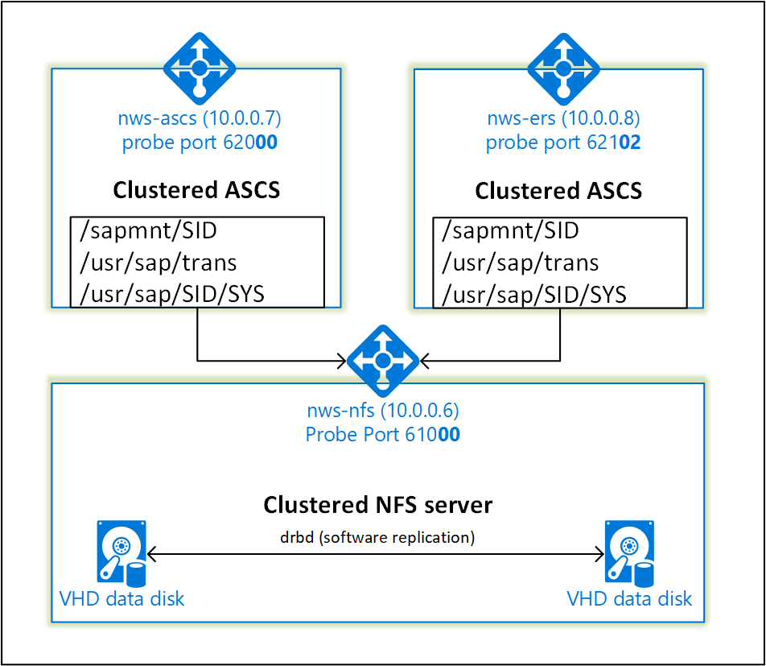

# High availability for SAP NetWeaver on Azure VMs on SUSE Linux Enterprise Server for SAP applications

[dbms-guide]:dbms-guide.md
[deployment-guide]:deployment-guide.md
[planning-guide]:planning-guide.md

[2205917]:https://launchpad.support.sap.com/#/notes/2205917
[1944799]:https://launchpad.support.sap.com/#/notes/1944799
[1928533]:https://launchpad.support.sap.com/#/notes/1928533
[2015553]:https://launchpad.support.sap.com/#/notes/2015553
[2178632]:https://launchpad.support.sap.com/#/notes/2178632
[2191498]:https://launchpad.support.sap.com/#/notes/2191498
[2243692]:https://launchpad.support.sap.com/#/notes/2243692
[1984787]:https://launchpad.support.sap.com/#/notes/1984787
[1999351]:https://launchpad.support.sap.com/#/notes/1999351

[suse-hana-ha-guide]:https://www.suse.com/docrep/documents/ir8w88iwu7/suse_linux_enterprise_server_for_sap_applications_12_sp1.pdf
[suse-drbd-guide]:https://www.suse.com/documentation/sle-ha-12/singlehtml/book_sleha_techguides/book_sleha_techguides.html

[template-multisid-xscs]:https://portal.azure.com/#create/Microsoft.Template/uri/https%3A%2F%2Fraw.githubusercontent.com%2FAzure%2Fazure-quickstart-templates%2Fmaster%2Fsap-3-tier-marketplace-image-multi-sid-xscs%2Fazuredeploy.json
[template-converged]:https://portal.azure.com/#create/Microsoft.Template/uri/https%3A%2F%2Fraw.githubusercontent.com%2FAzure%2Fazure-quickstart-templates%2Fmaster%2Fsap-3-tier-marketplace-image-converged%2Fazuredeploy.json

[sap-hana-ha]:sap-hana-high-availability.md

This article describes how to deploy the virtual machines, configure the virtual machines, install the cluster framework and install a highly available SAP NetWeaver 7.50 system.
In the example configurations, installation commands etc. ASCS instance number 00, ERS instance number 02 and SAP System ID NWS is used. The names of the resources (for example virtual machines, virtual networks) in the example assume that you have used the  [converged template][template-converged] with SAP system ID NWS to create the resources.

Read the following SAP Notes and papers first

* SAP Note [1928533], which has:
  * List of Azure VM sizes that are supported for the deployment of SAP software
  * Important capacity information for Azure VM sizes
  * Supported SAP software, and operating system (OS) and database combinations
  * Required SAP kernel version for Windows and Linux on Microsoft Azure

* SAP Note [2015553] lists prerequisites for SAP-supported SAP software deployments in Azure.
* SAP Note [2205917] has recommended OS settings for SUSE Linux Enterprise Server for SAP Applications
* SAP Note [1944799] has SAP HANA Guidelines for SUSE Linux Enterprise Server for SAP Applications
* SAP Note [2178632] has detailed information about all monitoring metrics reported for SAP in Azure.
* SAP Note [2191498] has the required SAP Host Agent version for Linux in Azure.
* SAP Note [2243692] has information about SAP licensing on Linux in Azure.
* SAP Note [1984787] has general information about SUSE Linux Enterprise Server 12.
* SAP Note [1999351] has additional troubleshooting information for the Azure Enhanced Monitoring Extension for SAP.
* [SAP Community WIKI](https://wiki.scn.sap.com/wiki/display/HOME/SAPonLinuxNotes) has all required SAP Notes for Linux.
* [Azure Virtual Machines planning and implementation for SAP on Linux][planning-guide]
* [Azure Virtual Machines deployment for SAP on Linux (this article)][deployment-guide]
* [Azure Virtual Machines DBMS deployment for SAP on Linux][dbms-guide]
* [SAP HANA SR Performance Optimized Scenario][suse-hana-ha-guide]  
  The guide contains all required information to set up SAP HANA System Replication on-premises. Use this guide as a baseline.
* [Highly Available NFS Storage with DRBD and Pacemaker][suse-drbd-guide]
  The guide contains all required information to set up a highly available NFS server. Use this guide as a baseline.


## Overview

To achieve high availability, SAP NetWeaver requires an NFS server. To reduce the number of virtual machines, the NFS server is configured in the same cluster together with the SAP NetWeaver ASCS/SCS and ERS. The NFS shares are mounted using autofs.



The NFS server, SAP NetWeaver ASCS, SAP NetWeaver SCS, SAP NetWeaver ERS and the SAP HANA database use virtual hostname and virtual IP addresses. On Azure, a load balancer is required to use a virtual IP address. The following list shows the configuration of the load balancer.

### NFS Server
* Frontend configuration
  * IP address 10.0.0.6
* Backend configuration
  * Connected to primary network interfaces of all virtual machines that should be part of the cluster
* Probe Port
  * Port 61000
* Loadbalancing rules
  * 2049 TCP 
  * 2049 UDP
  * 111 TCP
  * 111 UDP

### ASCS
* Frontend configuration
  * IP address 10.0.0.7
* Backend configuration
  * Connected to primary network interfaces of all virtual machines that should be part of the cluster
* Probe Port
  * Port 620**&lt;nr&gt;**
* Loadbalancing rules
  * 32**&lt;nr&gt;** TCP
  * 36**&lt;nr&gt;** TCP
  * 39**&lt;nr&gt;** TCP
  * 81**&lt;nr&gt;** TCP
  * 5**&lt;nr&gt;**13 TCP
  * 5**&lt;nr&gt;**14 TCP
  * 5**&lt;nr&gt;**16 TCP

### ERS
* Frontend configuration
  * IP address 10.0.0.8
* Backend configuration
  * Connected to primary network interfaces of all virtual machines that should be part of the cluster
* Probe Port
  * Port 621**&lt;nr&gt;**
* Loadbalancing rules
  * 33**&lt;nr&gt;** TCP
  * 5**&lt;nr&gt;**13 TCP
  * 5**&lt;nr&gt;**14 TCP
  * 5**&lt;nr&gt;**16 TCP

### SAP HANA
* Frontend configuration
  * IP address 10.0.0.9
* Backend configuration
  * Connected to primary network interfaces of all virtual machines that should be part of the cluster
* Probe Port
  * Port 625**&lt;nr&gt;**
* Loadbalancing rules
  * 3**&lt;nr&gt;**15 TCP
  * 3**&lt;nr&gt;**17 TCP

## Deploying Linux

The resource agent for SAP NetWeaver is included in SUSE Linux Enterprise Server for SAP Applications.
The Azure Marketplace contains an image for SUSE Linux Enterprise Server for SAP Applications 12 that you can use to deploy new virtual machines.

You can use one of the quick start templates on github to deploy all required resources. The template deploys the virtual machines, the load balancer, availability set etc.
Follow these steps to deploy the template:

1. Open the [ASCS/SCS Multi SID template][template-multisid-xscs] or the [converged template][template-converged] on the Azure portal
   The ASCS/SCS template only creates the load-balancing rules for the SAP NetWeaver ASCS/SCS and ERS (Linux only) instances whereas the converged template also creates the load-balancing rules for a database (for example Microsoft SQL Server or SAP HANA). If you plan to install an SAP NetWeaver based system and you also want to install the database on the same machines, use the [converged template][template-converged].
1. Enter the following parameters
    1. Resource Prefix (ASCS/SCS Multi SID template only)  
       Enter the prefix you want to use. The value is used as a prefix for the resources that are deployed.
    3. Sap System Id (converged template only)
       Enter the SAP system Id of the SAP system you want to install. The Id is used as a prefix for the resources that are deployed.
    4. Stack Type
       Select the SAP NetWeaver stack type
    5. Os Type
       Select one of the Linux distributions. For this example, select SLES 12 BYOS
    6. Db Type
       Select HANA
    7. Sap System Size
       The amount of SAPS the new system provides. If you are not sure how many SAPS the system requires, please ask your SAP Technology Partner or System Integrator
    8. System Availability
       Select HA
    9. Admin Username and Admin Password
       A new user is created that can be used to log on to the machine.
    10. New Or Existing Subnet
       Determines whether a new virtual network and subnet should be created or an existing subnet should be used. If you already have a virtual network that is connected to your on-premises network, select existing.
    11. Subnet Id
    The ID of the subnet to which the virtual machines should be connected to. Select the subnet of your VPN or Express Route virtual network to connect the virtual machine to your on-premises network. The ID usually looks like /subscriptions/**&lt;subscription id&gt;**/resourceGroups/**&lt;resource group name&gt;**/providers/Microsoft.Network/virtualNetworks/**&lt;virtual network name&gt;**/subnets/**&lt;subnet name&gt;**

## Setting up a highly available NFS server

The following items are prefixed with either **[A]** - applicable to all nodes, **[1]** - only applicable to node 1 or **[2]** - only applicable to node 2.

1. **[A]** Update SLES

    <pre><code>
    sudo zypper update
    </code></pre>

1. **[1]** Enable ssh access

    <pre><code>
    sudo ssh-keygen -tdsa
    
    # Enter file in which to save the key (/root/.ssh/id_dsa): -> ENTER
    # Enter passphrase (empty for no passphrase): -> ENTER
    # Enter same passphrase again: -> ENTER
    
    # copy the public key
    sudo cat /root/.ssh/id_dsa.pub
    </code></pre>

2. **[2]** Enable ssh access

    <pre><code>
    sudo ssh-keygen -tdsa

    # insert the public key you copied in the last step into the authorized keys file on the second server
    sudo vi /root/.ssh/authorized_keys
    
    # Enter file in which to save the key (/root/.ssh/id_dsa): -> ENTER
    # Enter passphrase (empty for no passphrase): -> ENTER
    # Enter same passphrase again: -> ENTER
    
    # copy the public key    
    sudo cat /root/.ssh/id_dsa.pub
    </code></pre>

1. **[1]** Enable ssh access

    <pre><code>
    # insert the public key you copied in the last step into the authorized keys file on the first server
    sudo vi /root/.ssh/authorized_keys
    </code></pre>

1. **[A]** Install HA extension
    
    <pre><code>
    sudo zypper install sle-ha-release fence-agents
    </code></pre>

1. **[A]** Setup host name resolution    

    You can either use a DNS server or modify the /etc/hosts on all nodes. This example shows how to use the /etc/hosts file.
    Replace the IP address and the hostname in the following commands

    <pre><code>
    sudo vi /etc/hosts
    </code></pre>
    
    Insert the following lines to /etc/hosts. Change the IP address and hostname to match your environment    
    
    <pre><code>
    # IP address of the load balancer frontend configuration for NFS
    <b>10.0.0.6 nws-nfs</b>
    # IP address of the load balancer frontend configuration for SAP NetWeaver ASCS/SCS
    <b>10.0.0.7 nws-ascs</b>
    # IP address of the load balancer frontend configuration for SAP NetWeaver ERS
    <b>10.0.0.8 nws-ers</b>
    # IP address of the load balancer frontend configuration for database
    <b>10.0.0.9 nws-db</b>
    # IP address of cluster nodes
    <b>10.0.0.10 nws-cl-0</b>
    <b>10.0.0.11 nws-cl-1</b>
    </code></pre>

1. **[1]** Install Cluster
    
    <pre><code>
    sudo ha-cluster-init
    
    # Do you want to continue anyway? [y/N] -> y
    # Network address to bind to (for example: 192.168.1.0) [10.79.227.0] -> ENTER
    # Multicast address (for example: 239.x.x.x) [239.174.218.125] -> ENTER
    # Multicast port [5405] -> ENTER
    # Do you wish to use SBD? [y/N] -> N
    # Do you wish to configure an administration IP? [y/N] -> N
    </code></pre>
        
1. **[2]** Add node to cluster
    
    <pre><code> 
    sudo ha-cluster-join
        
    # WARNING: NTP is not configured to start at system boot.
    # WARNING: No watchdog device found. If SBD is used, the cluster will be unable to start without a watchdog.
    # Do you want to continue anyway? [y/N] -> y
    # IP address or hostname of existing node (for example: 192.168.1.1) [] -> IP address of node 1 for example 10.0.0.8
    # /root/.ssh/id_dsa already exists - overwrite? [y/N] N
    </code></pre>

1. **[A]** Change hacluster password to the same password
    
    <pre><code> 
    sudo passwd hacluster
    </code></pre>

1. **[A]** Configure corosync to use other transport and add nodelist. Cluster will not work otherwise.
    
    <pre><code> 
    sudo vi /etc/corosync/corosync.conf    
    </code></pre>

    Add the following bold content to the file.
    
    <pre><code> 
    [...]
      interface { 
          [...] 
      }
      <b>transport:      udpu</b>
    } 
    <b>nodelist {
      node {
        ring0_addr:     < ip address of node 1 >
      }
      node {
        ring0_addr:     < ip address of node 2 > 
      } 
    }</b>
    logging {
      [...]
    </code></pre>

    Then restart the corosync service

    <pre><code>
    sudo service corosync restart
    </code></pre>

1. **[A]** Install drbd components

    <pre><code>
    sudo zypper install drbd drbd-kmp-default drbd-utils
    </code></pre>

1. **[A]** Create a partition for the drbd device

    <pre><code>
    sudo sh -c 'echo -e "n\n\n\n\n\nw\n" | fdisk /dev/sdc'
    </code></pre>

1. **[A]** Create an LVM configuration

    <pre><code>
    sudo pvcreate /dev/sdc1    
    sudo vgcreate vg_<b>NWS</b> /dev/sdc1
    sudo lvcreate -l 100%FREE -n <b>NWS</b> vg_<b>NWS</b>
    </code></pre>

1. **[A]** Create the drbd device

    <pre><code>
    sudo vi /etc/drbd.d/<b>NWS</b>_nfs.res
    </code></pre>

    Insert the configuration for the new drbd device and exit

    <pre><code>
	resource <b>NWS</b>_nfs {
	   protocol     C;
	   disk {
	      on-io-error       pass_on;
	   }
	   on <b>nws-cl-0</b> {
	      address   <b>10.0.0.10</b>:7790;
	      device    /dev/drbd0;
	      disk      /dev/vg_NWS/NWS;
	      meta-disk internal;
	   }
	   on <b>nws-cl-1</b> {
	      address   <b>10.0.0.11</b>:7790;
	      device    /dev/drbd0;
	      disk      /dev/vg_NWS/NWS;
	      meta-disk internal;
	   }
	}
    </code></pre>

    Create the drbd device and start it

    <pre><code>
    sudo drbdadm create-md <b>NWS</b>_nfs
    sudo drbdadm up <b>NWS</b>_nfs
    </code></pre>

1. **[1]** Set the primary node

    <pre><code>
    sudo drbdadm primary --force <b>NWS</b>_nfs
    </code></pre>

1. **[1]** Wait until the new drbd device is synchronized

    <pre><code>
    sudo cat /proc/drbd

    # version: 8.4.6 (api:1/proto:86-101)
    # GIT-hash: 833d830e0152d1e457fa7856e71e11248ccf3f70 build by abuild@sheep14, 2016-05-09 23:14:56
    #  0: cs:<b>Connected</b> ro:Primary/Secondary ds:<b>UpToDate/UpToDate</b> C r-----
    #    ns:109074576 nr:0 dw:134209500 dr:109077792 al:540 bm:0 lo:0 pe:0 ua:0 ap:0 ep:1 wo:f oos:0

    </code></pre>

1. **[1]** Create a file system on the drbd device

    <pre><code>
    sudo mkfs.xfs /dev/drbd0
    </code></pre>


### Configure Cluster Framework

1. **[1]** Change the default settings

    <pre><code>
    sudo crm configure

    crm(live)configure# rsc_defaults resource-stickiness="200"

    crm(live)configure# commit
    crm(live)configure# exit
    </code></pre>

1. **[1]** Add the drbd device to the cluster configuration

    <pre><code>
    sudo crm configure

    crm(live)configure# primitive drbd_<b>NWS</b>_nfs \
      ocf:linbit:drbd \
      params drbd_resource="<b>NWS</b>_nfs" \
      op monitor interval="15" role="Master" \
      op monitor interval="30" role="Slave"

    crm(live)configure# ms ms-drbd_<b>NWS</b>_nfs drbd_<b>NWS</b>_nfs \
      meta master-max="1" master-node-max="1" clone-max="2" \
      clone-node-max="1" notify="true"

    crm(live)configure# commit
    crm(live)configure# exit
    </code></pre>

1. **[1]** Create the NFS server

    <pre><code>
    sudo crm configure

    crm(live)configure# primitive nfsserver \
      systemd:nfs-server \
      op monitor interval="30s"

    crm(live)configure# clone cl-nfsserver nfsserver

    crm(live)configure# commit
    crm(live)configure# exit
    </code></pre>

1. **[1]** Create the File System resources

    <pre><code>
    sudo crm configure

    crm(live)configure# primitive fs_<b>NWS</b>_sapmnt \
      ocf:heartbeat:Filesystem \
      params device=/dev/drbd0 \
      directory=/srv/nfs/<b>NWS</b>  \
      fstype=xfs \
      op monitor interval="10s"

    crm(live)configure# group g-<b>NWS</b>_nfs fs_<b>NWS</b>_sapmnt

    crm(live)configure# order o-<b>NWS</b>_drbd_before_nfs inf: \
      ms-drbd_<b>NWS</b>_nfs:promote g-<b>NWS</b>_nfs:start
    
    crm(live)configure# colocation col-<b>NWS</b>_nfs_on_drbd inf: \
      g-<b>NWS</b>_nfs ms-drbd_<b>NWS</b>_nfs:Master

    crm(live)configure# commit
    crm(live)configure# exit
    </code></pre>

1. **[1]** Create the NFS exports

    <pre><code>
    sudo mkdir /srv/nfs/NWS/sidsys
    sudo mkdir /srv/nfs/NWS/sapmntsid
    sudo mkdir /srv/nfs/NWS/trans

    sudo crm configure

    crm(live)configure# primitive exportfs_<b>NWS</b> \
      ocf:heartbeat:exportfs \
      params directory="/srv/nfs/<b>NWS</b>" \
      options="rw,no_root_squash" \
      clientspec="*" fsid=0 \
      wait_for_leasetime_on_stop=true \
      op monitor interval="30s"

    crm(live)configure# modgroup g-<b>NWS</b>_nfs add exportfs_<b>NWS</b>

    crm(live)configure# commit
    crm(live)configure# exit
    </code></pre>

1. **[1]** Create a virtual IP resource and health-probe for the internal load balancer

    <pre><code>
    sudo crm configure

    crm(live)configure# primitive vip_<b>NWS</b>_nfs IPaddr2 \
      params ip=10.0.0.6 cidr_netmask=24 \
      op monitor interval=10 timeout=20

	crm(live)configure# primitive nc_<b>NWS</b>_nfs anything \
	        params binfile="/usr/bin/nc" cmdline_options="-l -k 610<b>00</b>" \
	        op monitor timeout=20s interval=10 depth=0

    crm(live)configure# modgroup g-<b>NWS</b>_nfs add nc_<b>NWS</b>_nfs
    crm(live)configure# modgroup g-<b>NWS</b>_nfs add vip_<b>NWS</b>_nfs

    crm(live)configure# commit
    crm(live)configure# exit
    </code></pre>

## Prepare for SAP NetWeaver installation

1. **[A]** Create the shared directories

    <pre><code>
    sudo mkdir -p /sapmnt/<b>NWS</b>
    sudo mkdir -p /usr/sap/trans
    sudo mkdir -p /usr/sap/<b>NWS</b>/SYS

    sudo chattr +i /sapmnt/<b>NWS</b>
    sudo chattr +i /usr/sap/trans
    sudo chattr +i /usr/sap/<b>NWS</b>/SYS
    </code></pre>

1. **[A]** Configure autofs
 
    <pre><code>
    sudo vi /etc/auto.master

    # Add the following line to the file, save and exit
    +auto.master
    /- /etc/auto.direct
    </code></pre>

    Create a file with

    <pre><code>
    sudo vi /etc/auto.direct

    # Add the following lines to the file, save and exit
    /sapmnt/<b>NWS</b> -nfsvers=4,nosymlink,sync <b>nws-nfs</b>:/sapmntsid
    /usr/sap/trans -nfsvers=4,nosymlink,sync <b>nws-nfs</b>:/trans
    /usr/sap/<b>NWS</b>/SYS -nfsvers=4,nosymlink,sync <b>nws-nfs</b>:/sidsys
    </code></pre>

    Restart autofs to mount the new shares

    <pre><code>
    sudo systemctl enable autofs
    sudo service autofs restart
    </code></pre>

1. **[A]** Configure SWAP file
 
    <pre><code>
    sudo vi /etc/waagent.conf

    # Set the property ResourceDisk.EnableSwap to y
    # Create and use swapfile on resource disk.
    ResourceDisk.EnableSwap=<b>y</b>

    # Set the size of the SWAP file with property ResourceDisk.SwapSizeMB
    # The free space of resource disk varies by virtual machine size. Make sure that you do not set a value that is too big. You can check the SWAP space with command swapon
    # Size of the swapfile.
    ResourceDisk.SwapSizeMB=<b>2000</b>
    </code></pre>

    Restart the Agent to activate the change

    <pre><code>
    sudo service waagent restart
    </code></pre>

## Installing SAP NetWeaver ASCS/ERS

1. **[1]** Create a virtual IP resource and health-probe for the internal load balancer

    <pre><code>
    sudo crm configure

    crm(live)configure# primitive vip_<b>NWS</b>_ASCS IPaddr2 \
      params ip=<b>10.0.0.7</b> cidr_netmask=24 \
      op monitor interval=10 timeout=20

	crm(live)configure# primitive nc_<b>NWS</b>_ASCS anything \
	        params binfile="/usr/bin/nc" cmdline_options="-l -k 620<b>00</b>" \
	        op monitor timeout=20s interval=10 depth=0

    crm(live)configure# primitive vip_<b>NWS</b>_ERS IPaddr2 \
      params ip=<b>10.0.0.8</b> cidr_netmask=24 \
      op monitor interval=10 timeout=20

	crm(live)configure# primitive nc_<b>NWS</b>_ERS anything \
	        params binfile="/usr/bin/nc" cmdline_options="-l -k 621<b>02</b>" \
	        op monitor timeout=20s interval=10 depth=0

    crm(live)configure# group g-<b>NWS</b>_ASCS nc_<b>NWS</b>_ASCS vip_<b>NWS</b>_ASCS

    crm(live)configure# group g-<b>NWS</b>_ERS nc_<b>NWS</b>_ERS vip_<b>NWS</b>_ERS

    crm(live)configure# commit

    # WARNING: Resources nc_NWS_ASCS,nc_NWS_ERS,nc_NWS_nfs violate uniqueness for parameter "binfile": "/usr/bin/nc"
    # Do you still want to commit (y/n)? y
    crm(live)configure# exit

    # Make sure that the IP address resources are running on the host where you plan to install the ASCS/SCS and ERS.
    sudo crm resource move g-<b>NWS</b>_ASCS <b>nws-cl-0</b>
    sudo crm resource move g-<b>NWS</b>_ERS <b>nws-cl-0</b>
    </code></pre>

1. **[1]** Install SAP NetWeaver ASCS  

    Install SAP NetWeaver ASCS as root using a virtual hostname that maps to the IP address of the load balancer frontend configuration for the ASCS for example <b>nws-ascs</b>, <b>10.0.0.7</b> and the instance number that you used for the probe of the load balancer for example <b>00</b>.

    You can use the sapinst parameter SAPINST_REMOTE_ACCESS_USER to allow a non-root user to connect to sapinst.

    <pre><code>
    sudo sapinst SAPINST_REMOTE_ACCESS_USER=<b>sapadmin</b>
    </code></pre>

1. **[1]** Install SAP NetWeaver ERS  

    Install SAP NetWeaver ERS as root using a virtual hostname that maps to the IP address of the load balancer frontend configuration for the ERS for example <b>nws-ers</b>, <b>10.0.0.8</b> and the instance number that you used for the probe of the load balancer for example <b>02</b>.

    You can use the sapinst parameter SAPINST_REMOTE_ACCESS_USER to allow a non-root user to connect to sapinst.

    <pre><code>
    sudo sapinst SAPINST_REMOTE_ACCESS_USER=<b>sapadmin</b>
    </code></pre>

1. **[1]** Adapt the ASCS/SCS and ERS instance profiles
 
    * ASCS/SCS profile

    <pre><code> 
    sudo vi /sapmnt/<b>NWS</b>/profile/<b>NWS</b>_<b>ASCS00</b>_<b>nws-ascs</b>

    # Change the restart command to a start command
    #Restart_Program_01 = local $(_EN) pf=$(_PF)
	Start_Program_01 = local $(_EN) pf=$(_PF)

    # Add the following lines
    service/halib = $(DIR_CT_RUN)/saphascriptco.so
    service/halib_cluster_connector = /usr/bin/sap_suse_cluster_connector

    # Add the keep alive parameter
    enque/encni/set_so_keepalive = true
    </code></pre>

    * ERS profile

    <pre><code> 
    sudo vi /sapmnt/<b>NWS</b>/profile/<b>NWS</b>_ERS<b>02</b>_<b>nws-ers</b>

    # Add the following lines
    service/halib = $(DIR_CT_RUN)/saphascriptco.so
    service/halib_cluster_connector = /usr/bin/sap_suse_cluster_connector
    </code></pre>


1. **[A]** Configure Keep Alive

    The communication between the SAP NetWeaver application server and the ASCS/SCS is routed through a software load balancer. The load balancer disconnects inactive connections after a configurable timout. To prevent this you need to set a parameter in the SAP NetWeaver ASCS/SCS profile and change the Linux system settings. Please read [SAP Note 1410736][1410736] for more information.
    
    The ASCS/SCS profile was parameter enque/encni/set_so_keepalive was already added in the last step.

    <pre><code> 
    # Change the Linux system configuration
    sudo sysctl net.ipv4.tcp_keepalive_time=120
    </code></pre>

1. **[1]** Create the SAP users and groups
 
    <pre><code>
    # Add sidadm to the haclient group
    sudo usermod -aG haclient <b>nws</b>adm

    sapsysid=$(sudo cat /etc/group | grep -Eo 'sapsys:x:(.*)' | grep -oe '\([0-9.]*\)';); sudo ssh <b>nws-cl-1</b> "groupadd -g $sapsysid sapsys"
    sapinstid=$(sudo cat /etc/group | grep -Eo 'sapinst:x:(.*)' | grep -oe '\([0-9.]*\)';); sudo ssh <b>nws-cl-1</b> "groupadd -g $sapinstid sapinst"

    sidid=$(sudo cat /etc/passwd | grep -Eo '<b>nws</b>adm:x:([^:]*):' | grep -oe '\([0-9.]*\)';); sudo ssh <b>nws-cl-1</b> "useradd -u $sidid -g $sapsysid -G $sapinstid <b>nws</b>adm"
    sapid=$(sudo cat /etc/passwd | grep -Eo 'sapadm:x:([^:]*):' | grep -oe '\([0-9.]*\)';); sudo ssh <b>nws-cl-1</b> "useradd -u $sapid -g $sapsysid sapadm"
    </code></pre>

1. **[2]** Configure the SAP users on the second node

    <pre><code>
    # Add sidadm to the haclient group
    sudo usermod -aG haclient <b>nws</b>adm

    # Set passwords
    sudo passwd <b>nws</b>adm
    sudo passwd sapadm

    # Change the default shell
    sudo chsh -s /bin/csh <b>nws</b>adm

    # Disable sapadm login
    sudo chsh -s /bin/false sapadm
    </code></pre>

1. **[1]** Copy the SAP directories to second node

    <pre><code>
    sudo rsync -av /home/<b>nws</b>adm/ <b>nws-cl-1</b>:/home/<b>nws</b>adm
    host0=$(hostname);sudo ssh <b>nws-cl-1</b> "find /home/<b>nws</b>adm/.*$host0.* -type f -exec rename -v $host0 <b>nws-cl-1</b> {} \;"

    sudo rsync -av /usr/sap/<b>NWS</b>/ERS<b>02</b>/ <b>nws-cl-1</b>:/usr/sap/<b>NWS</b>/ERS<b>02</b>
    sudo rsync -av /usr/sap/<b>NWS</b>/ASCS<b>00</b>/ <b>nws-cl-1</b>:/usr/sap/<b>NWS</b>/ASCS<b>00</b>

    # Copy the services for example copy the complete file
    sudo rsync -av /etc/services <b>nws-cl-1</b>:/etc

    # Copy the SAP services for example copy the complete file
    sudo rsync -av /usr/sap/sapservices <b>nws-cl-1</b>:/usr/sap/
    </code></pre>

1. **[1]** Create the SAP cluster resources

    <pre><code>
    sudo crm configure

    crm(live)configure# primitive rsc_sap_<b>NWS</b>_ASCS<b>00</b> SAPInstance \
	  operations $id=rsc_sap_<b>NWS</b>_ASCS<b>00</b>-operations \
	  op monitor interval=11 timeout=60 on_fail=restart \
	  params InstanceName=<b>NWS</b>_ASCS<b>00</b>_<b>nws-ascs</b> START_PROFILE="/sapmnt/<b>NWS</b>/profile/<b>NWS</b>_ASCS<b>00</b>_<b>nws-ascs</b>" \
	  meta resource-stickiness=5000 failure-timeout=60 migration-threshold=1 target-role=Started priority=10

    crm(live)configure# primitive rsc_sap_<b>NWS</b>_ERS<b>02</b> SAPInstance \
	  operations $id=rsc_sap_<b>NWS</b>_ERS<b>02</b>-operations \
	  op monitor interval=11 timeout=60 on_fail=restart \
	  params InstanceName=<b>NWS</b>_ERS<b>02</b>_<b>nws-ers</b> START_PROFILE="/sapmnt/<b>NWS</b>/profile/<b>NWS</b>_ERS<b>02</b>_<b>nws-ers</b>" IS_ERS=yes \
	  meta target-role=Started priority=1000

    crm(live)configure# modgroup g-<b>NWS</b>_ASCS add rsc_sap_<b>NWS</b>_ASCS<b>00</b>
    crm(live)configure# modgroup g-<b>NWS</b>_ERS add rsc_sap_<b>NWS</b>_ERS<b>02</b>

    crm(live)configure# colocation col_NOT_BOTH -5000: g-<b>NWS</b>_ERS g-<b>NWS</b>_ASCS
    crm(live)configure# location lala2 rsc_sap_<b>NWS</b>_ASCS<b>00</b> rule 2000: runs_ers_<b>NWS</b> eq 1
    crm(live)configure# order ord_TAKEOVER Optional: rsc_sap_<b>NWS</b>_ASCS<b>00</b>:start rsc_sap_<b>NWS</b>_ERS<b>02</b>:stop symmetrical=false

    crm(live)configure# order o-<b>NWS</b>_nfs_before_ASCS inf: g-<b>NWS</b>_nfs:start g-<b>NWS</b>_ASCS
    crm(live)configure# order o-<b>NWS</b>_nfs_before_ERS inf: g-<b>NWS</b>_nfs:start g-<b>NWS</b>_ERS

    crm(live)configure# commit
    crm(live)configure# exit
    </code></pre>

1. **[1]** Remove location restriction

    <pre><code>
    sudo crm configure delete cli-prefer-g-NWS_ASCS
    sudo crm configure delete cli-prefer-g-NWS_ERS
    </code></pre>

## Create STONITH device

The STONITH device uses a Service Principal to authorize against Microsoft Azure. Follow these steps to create a Service Principal.

1. Go to <https://portal.azure.com>
1. Open the Azure Active Directory blade  
   Go to Properties and write down the Directory Id. This is the **tenant id**.
1. Click App registrations
1. Click Add
1. Enter a Name, select Application Type "Web app/API", enter a sign-on URL (for example http://localhost) and click Create
1. The sign-on URL is not used and can be any valid URL
1. Select the new App and click Keys in the Settings tab
1. Enter a description for a new key, select "Never expires" and click Save
1. Write down the Value. It is used as the **password** for the Service Principal
1. Write down the Application Id. It is used as the username (**login id** in the steps below) of the Service Principal

The Service Principal does not have permissions to access your Azure resources by default. You need to give the Service Principal permissions to start and stop (deallocate) all virtual machines of the cluster.

1. Go to https://portal.azure.com
1. Open the All resources blade
1. Select the virtual machine
1. Click Access control (IAM)
1. Click Add
1. Select the role Owner
1. Enter the name of the application you created above
1. Click OK

After you edited the permissions for the virtual machines, you can configure the STONITH devices in the cluster.

<pre><code>
sudo vi crm-fencing.txt
# enter the following to crm-fencing.txt
# replace the bold string with your subscription id, resource group, tenant id, service principal id and password

primitive rsc_st_azure_1 stonith:fence_azure_arm \
    params subscriptionId="<b>subscription id</b>" resourceGroup="<b>resource group</b>" tenantId="<b>tenant id</b>" login="<b>login id</b>" passwd="<b>password</b>"

primitive rsc_st_azure_2 stonith:fence_azure_arm \
    params subscriptionId="<b>subscription id</b>" resourceGroup="<b>resource group</b>" tenantId="<b>tenant id</b>" login="<b>login id</b>" passwd="<b>password</b>"

colocation col_st_azure -2000: rsc_st_azure_1:Started rsc_st_azure_2:Started

# now we load the file to the cluster
sudo crm configure load update crm-fencing.txt
</code></pre>

Enable the use of a STONITH device

<pre><code>
crm configure property stonith-enabled=true 
</code></pre>

## Install database

In this example an SAP HANA System Replication is installed and configured. SAP HANA will run in the same cluster as the SAP NetWeaver ASCS/SCS and ERS. You can also install SAP HANA on a dedicated cluster. See [High Availability of SAP HANA on Azure Virtual Machines (VMs)][sap-hana-ha] for more information.

1. **[A]** Setup disk layout
    1. LVM  
    We generally recommend to using LVM for volumes that store data and log files. The example below assumes that the virtual machines have four data disks attached that should be used to create two volumes.

    Create physical volumes for all disks that you want to use.

    <pre><code>
    sudo pvcreate /dev/sdd
    sudo pvcreate /dev/sde
    sudo pvcreate /dev/sdf
    sudo pvcreate /dev/sdg
    </code></pre>

    Create a volume group for the data files, one volume group for the log files and one for the shared directory of SAP HANA

    <pre><code>
    sudo vgcreate vg_hana_data /dev/sdd /dev/sde
    sudo vgcreate vg_hana_log /dev/sdf
    sudo vgcreate vg_hana_shared /dev/sdg
    </code></pre>

    Create the logical volumes

    <pre><code>
    sudo lvcreate -l 100%FREE -n hana_data vg_hana_data
    sudo lvcreate -l 100%FREE -n hana_log vg_hana_log
    sudo lvcreate -l 100%FREE -n hana_shared vg_hana_shared
    sudo mkfs.xfs /dev/vg_hana_data/hana_data
    sudo mkfs.xfs /dev/vg_hana_log/hana_log
    sudo mkfs.xfs /dev/vg_hana_shared/hana_shared
    </code></pre>

    Create the mount directories and copy the UUID of all logical volumes

    <pre><code>
    sudo mkdir -p /hana/data
    sudo mkdir -p /hana/log
    sudo mkdir -p /hana/shared
    sudo chattr +i /hana/data
    sudo chattr +i /hana/log
    sudo chattr +i /hana/shared
    # write down the id of /dev/vg_hana_data/hana_data, /dev/vg_hana_log/hana_log and /dev/vg_hana_shared/hana_shared
    sudo blkid
    </code></pre>

    Create autofs entries for the three logical volumes

    <pre><code>
    sudo vi /etc/auto.direct
    </code></pre>

    Insert this line to sudo vi /etc/auto.direct

    <pre><code>
    /hana/data -fstype=xfs :UUID=<b>&lt;UUID of /dev/vg_hana_data/hana_data&gt;</b>
    /hana/log -fstype=xfs :UUID=<b>&lt;UUID of /dev/vg_hana_log/hana_log&gt;</b>
    /hana/shared -fstype=xfs :UUID=<b>&lt;UUID of /dev/vg_hana_shared/hana_shared&gt;</b>
    </code></pre>

    Mount the new volumes

    <pre><code>
    sudo service autofs restart 
    </code></pre>

    1. Plain Disks  
       For small or demo systems, you can place your HANA data and log files on one disk. The following commands create a partition on /dev/sdc and format it with xfs.
    ```bash
    sudo fdisk /dev/sdc
    sudo mkfs.xfs /dev/sdc1
    
    # write down the id of /dev/sdc1
    sudo /sbin/blkid
    sudo vi /etc/auto.direct
    ```

    Insert this line to /etc/auto.direct
    <pre><code>
    /hana -fstype=xfs :UUID=<b>&lt;UUID&gt;</b>
    </code></pre>

    Create the target directory and mount the disk.

    <pre><code>
    sudo mkdir /hana
    sudo chattr +i /hana
    sudo service autofs restart
    </code></pre>

1. **[A]** Installing SAP HANA

    The following steps are based on chapter 4 of the [SAP HANA SR Performance Optimized Scenario guide][suse-hana-ha-guide] to install SAP HANA System Replication. Please read it before you continue the installation.

    1. **[A]** Run hdblcm from the HANA DVD

    Use a virtual hostname for the installation that maps to the IP address of the load balancer frontend configuration for the database.
    <pre><code>
    sudo
    sudo hdblcm --sid=<b>HDB</b> --number=<b>03</b> --action=install --batch --password=<b>&lt;password&gt;</b> --system_user_password=<b>&lt;password for system user&gt;</b>
    </code></pre>

    1. **[A]** Upgrade SAP Host Agent

    Download the latest SAP Host Agent archive from the [SAP Softwarecenter][sap-swcenter] and run the following command to upgrade the agent. Replace the path to the archive to point to the file you downloaded.
    <pre><code>
    sudo /usr/sap/hostctrl/exe/saphostexec -upgrade -archive <b>&lt;path to SAP Host Agent SAR&gt;</b> 
    </code></pre>

    1. **[1]** Create HANA replication (as root)  

    Run the following command. Make sure to replace bold strings (HANA System ID HDB and instance number 03) with the values of your SAP HANA installation.
    <pre><code>
    PATH="$PATH:/usr/sap/<b>HDB</b>/HDB<b>03</b>/exe"
    hdbsql -u system -i <b>03</b> 'CREATE USER <b>hdb</b>hasync PASSWORD "<b>passwd</b>"' 
    hdbsql -u system -i <b>03</b> 'GRANT DATA ADMIN TO <b>hdb</b>hasync' 
    hdbsql -u system -i <b>03</b> 'ALTER USER <b>hdb</b>hasync DISABLE PASSWORD LIFETIME' 
    </code></pre>

    1. **[A]** Create keystore entry (as root)

    <pre><code>
    PATH="$PATH:/usr/sap/<b>HDB</b>/HDB<b>03</b>/exe"
    hdbuserstore SET <b>hdb</b>haloc localhost:3<b>03</b>15 <b>hdb</b>hasync <b>passwd</b>
    </code></pre>

    1. **[1]** Backup database (as root)

    <pre><code>
    PATH="$PATH:/usr/sap/<b>HDB</b>/HDB<b>03</b>/exe"
    hdbsql -u system -i <b>03</b> "BACKUP DATA USING FILE ('<b>initialbackup</b>')" 
    </code></pre>

    1. **[1]** Switch to the sapsid user (for example hdbadm) and create the primary site.

    <pre><code>
    su - <b>hdb</b>adm
    hdbnsutil -sr_enable –-name=<b>SITE1</b>
    </code></pre>

    1. **[2]** Switch to the sapsid user (for example hdbadm) and create the secondary site.

    <pre><code>
    su - <b>hdb</b>adm
    sapcontrol -nr <b>03</b> -function StopWait 600 10
    hdbnsutil -sr_register --remoteHost=<b>nws-cl-0</b> --remoteInstance=<b>03</b> --replicationMode=sync --name=<b>SITE2</b> 
    </code></pre>

    1. **[1]** Create SAP HANA cluster resources

    First, create the topology.

    <pre><code>
    sudo vi crm-saphanatop.txt
    # enter the following to crm-saphana.txt
    # replace the bold string with your instance number and HANA system id

    primitive rsc_SAPHanaTopology_<b>HDB</b>_HDB<b>03</b> ocf:suse:SAPHanaTopology \
      operations $id="rsc_sap2_<b>HDB</b>_HDB<b>03</b>-operations" \
      op monitor interval="10" timeout="600" \
      op start interval="0" timeout="600" \
      op stop interval="0" timeout="300" \
      params SID="<b>HDB</b>" InstanceNumber="<b>03</b>"

    clone cln_SAPHanaTopology_<b>HDB</b>_HDB<b>03</b> rsc_SAPHanaTopology_<b>HDB</b>_HDB<b>03</b> \
      meta is-managed="true" clone-node-max="1" target-role="Started" interleave="true"

    # now we load the file to the cluster
    sudo crm configure load update crm-saphanatop.txt
    </code></pre>

    Next, create the HANA resources

    <pre><code>
    sudo vi crm-saphana.txt
    # enter the following to crm-saphana.txt
    # replace the bold string with your instance number, HANA system id and the frontend IP address of the Azure load balancer. 
    
    primitive rsc_SAPHana_<b>HDB</b>_HDB<b>03</b> ocf:suse:SAPHana \
      operations $id="rsc_sap_<b>HDB</b>_HDB<b>03</b>-operations" \
      op start interval="0" timeout="3600" \
      op stop interval="0" timeout="3600" \
      op promote interval="0" timeout="3600" \
      op monitor interval="60" role="Master" timeout="700" \
      op monitor interval="61" role="Slave" timeout="700" \
      params SID="<b>HDB</b>" InstanceNumber="<b>03</b>" PREFER_SITE_TAKEOVER="true" \
      DUPLICATE_PRIMARY_TIMEOUT="7200" AUTOMATED_REGISTER="false"

    ms msl_SAPHana_<b>HDB</b>_HDB<b>03</b> rsc_SAPHana_<b>HDB</b>_HDB<b>03</b> \
      meta is-managed="true" notify="true" clone-max="2" clone-node-max="1" \
      target-role="Started" interleave="true"

    primitive rsc_ip_<b>HDB</b>_HDB<b>03</b> ocf:heartbeat:IPaddr2 \ 
      meta target-role="Started" is-managed="true" \ 
      operations $id="rsc_ip_<b>HDB</b>_HDB<b>03</b>-operations" \ 
      op monitor interval="10s" timeout="20s" \ 
      params ip="<b>10.0.0.9</b>" 
    primitive rsc_nc_<b>HDB</b>_HDB<b>03</b> anything \ 
      params binfile="/usr/bin/nc" cmdline_options="-l -k 625<b>03</b>" \ 
      op monitor timeout=20s interval=10 depth=0 
    group g_ip_<b>HDB</b>_HDB<b>03</b> rsc_ip_<b>HDB</b>_HDB<b>03</b> rsc_nc_<b>HDB</b>_HDB<b>03</b>
 
    colocation col_saphana_ip_<b>HDB</b>_HDB<b>03</b> 2000: g_ip_<b>HDB</b>_HDB<b>03</b>:Started \ 
      msl_SAPHana_<b>HDB</b>_HDB<b>03</b>:Master  
    order ord_SAPHana_<b>HDB</b>_HDB<b>03</b> 2000: cln_SAPHanaTopology_<b>HDB</b>_HDB<b>03</b> \ 
      msl_SAPHana_<b>HDB</b>_HDB<b>03</b>

    # now we load the file to the cluster
    sudo crm configure load update crm-saphana.txt
    </code></pre>

1. **[1]** Install the SAP NetWeaver database instance

    Install the SAP NetWeaver database instance as root using a virtual hostname that maps to the IP address of the load balancer frontend configuration for the database for example <b>nws-db</b> and <b>10.0.0.9</b>.

    You can use the sapinst parameter SAPINST_REMOTE_ACCESS_USER to allow a non-root user to connect to sapinst.

    <pre><code>
    sudo sapinst SAPINST_REMOTE_ACCESS_USER=<b>sapadmin</b>
    </code></pre>

## SAP NetWeaver application server installation

1. Setup host name resolution    
    You can either use a DNS server or modify the /etc/hosts on all nodes. This example shows how to use the /etc/hosts file.
    Replace the IP address and the hostname in the following commands
    ```bash
    sudo vi /etc/hosts
    ```
    Insert the following lines to /etc/hosts. Change the IP address and hostname to match your environment    
    
    <pre><code>
    # IP address of the load balancer frontend configuration for NFS
    <b>10.0.0.6 nws-nfs</b>
    # IP address of the load balancer frontend configuration for SAP NetWeaver ASCS/SCS
    <b>10.0.0.7 nws-ascs</b>
    # IP address of the load balancer frontend configuration for SAP NetWeaver ERS
    <b>10.0.0.8 nws-ers</b>
    # IP address of the load balancer frontend configuration for database
    <b>10.0.0.9 nws-db</b>
    # IP address of this host
    <b>10.0.0.4 nws-di-0</b>
    </code></pre>

1. Create the sapmnt directory

    <pre><code>
    sudo mkdir -p /sapmnt/<b>NWS</b>
    sudo mkdir -p /usr/sap/trans

    sudo chattr +i /sapmnt/<b>NWS</b>
    sudo chattr +i /usr/sap/trans
    </code></pre>

1. Configure autofs
 
    <pre><code>
    sudo vi /etc/auto.master

    # Add the following line to the file, save and exit
    +auto.master
    /- /etc/auto.direct
    </code></pre>

    Create a new file with

    <pre><code>
    sudo vi /etc/auto.direct

    # Add the following lines to the file, save and exit
    /sapmnt/<b>NWS</b> -nfsvers=4,nosymlink,sync <b>nws-nfs</b>:/sapmntsid
    /usr/sap/trans -nfsvers=4,nosymlink,sync <b>nws-nfs</b>:/trans
    </code></pre>

    Restart autofs to mount the new shares

    <pre><code>
    sudo systemctl enable autofs
    sudo service autofs restart
    </code></pre>

1. Configure SWAP file
 
    <pre><code>
    sudo vi /etc/waagent.conf

    # Set the property ResourceDisk.EnableSwap to y
    # Create and use swapfile on resource disk.
    ResourceDisk.EnableSwap=<b>y</b>

    # Set the size of the SWAP file with property ResourceDisk.SwapSizeMB
    # The free space of resource disk varies by virtual machine size. Make sure that you do not set a value that is too big. You can check the SWAP space with command swapon
    # Size of the swapfile.
    ResourceDisk.SwapSizeMB=<b>2000</b>
    </code></pre>

    Restart the Agent to activate the change

    <pre><code>
    sudo service waagent restart
    </code></pre>

1. Install SAP NetWeaver application server

    Install a primary or additional SAP NetWeaver applications server.

    You can use the sapinst parameter SAPINST_REMOTE_ACCESS_USER to allow a non-root user to connect to sapinst.

    <pre><code>
    sudo sapinst SAPINST_REMOTE_ACCESS_USER=<b>sapadmin</b>
    </code></pre>

1. Update SAP HANA secure store

    Update the SAP HANA secure store to point to the virtual name of the SAP HANA System Replication setup.
    <pre><code>
    su - <b>nws</b>adm
    hdbuserstore SET DEFAULT <b>nws-db</b>:3<b>03</b>15 <b>SAPABAP1</b> <b>&lt;password of ABAP schema&gt;</b>
    </code></pre>

## Next steps
* [Azure Virtual Machines planning and implementation for SAP][planning-guide]
* [Azure Virtual Machines deployment for SAP][deployment-guide]
* [Azure Virtual Machines DBMS deployment for SAP][dbms-guide]
* To learn how to establish high availability and plan for disaster recovery of SAP HANA on Azure (large instances), see [SAP HANA (large instances) high availability and disaster recovery on Azure](hana-overview-high-availability-disaster-recovery.md).
* To learn how to establish high availability and plan for disaster recovery of SAP HANA on Azure VMs, see [High Availability of SAP HANA on Azure Virtual Machines (VMs)][sap-hana-ha]