# Using Windows DFS-N to support flexible SAPMNT share creation for SMB based file share

## Introduction

In SAP instances like ASCS/SCS based on WSFC certain naming conventions need to be followed. In this particular scenario this is \\\SAPGLOBALHOST\sapmnt\
This can at time be quite restrictive. DFS-N allows to create virtual share names which can be assigned to different directory.

## Microsoft DFS-N

An introduction and the installation instructions for DFS-N can be found [here](https://docs.microsoft.com/en-us/windows-server/storage/dfs-namespaces/dfs-overview)

## Setting up Folder Targets for Azure NetApp Files SMB

Folder Targets for Azure NetApp Files SMB are volumes technically created the same way as without using DFS-N. However for increasing the throughput of the volume, a large volume size with subsequent sharing via DFS-N might be beneficial. 
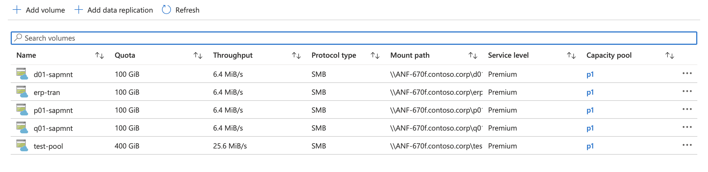Azure portal screenshot with existing ANF volumes.
## Setting up Folder Targets for Azure Files Premium SMB

## Configuring DFS-N for SAPMNT
The following shows the individual steps of initially configuring DFS-N. 
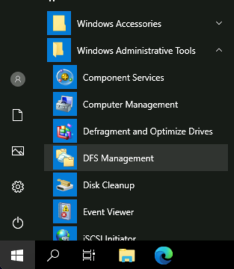

Start the DFS Management console from the Windows Administrative Tools in the Windows Server Start Menu.

This screen shows the opening DFS screen.

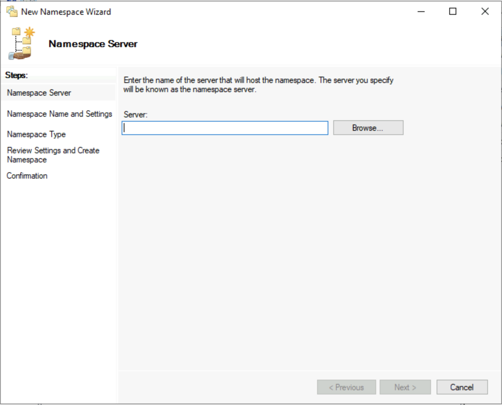

In this screen an AD joined Windows Server with DFS installed has to be selected.

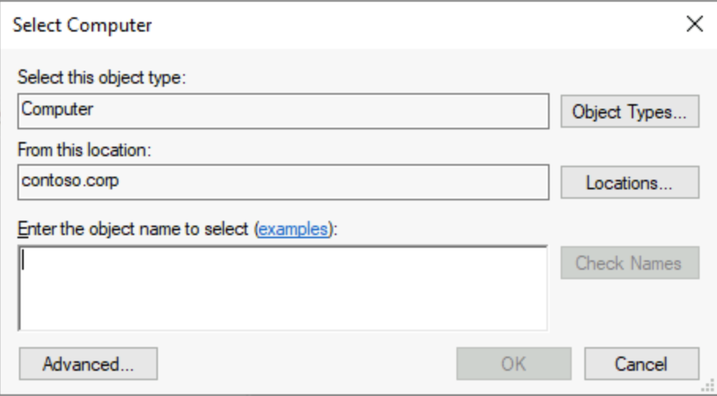

Pushing the **Browse...** opens the **Select Computer** dialog sequence which shows a list of all domain joined servers. This list may include servers where the DFS-N Role is not installed. Please ensure to choose a server where the DFS-N Role is installed.
 

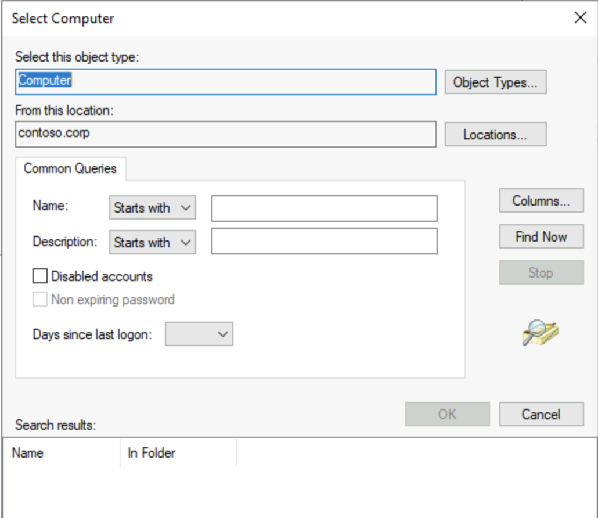

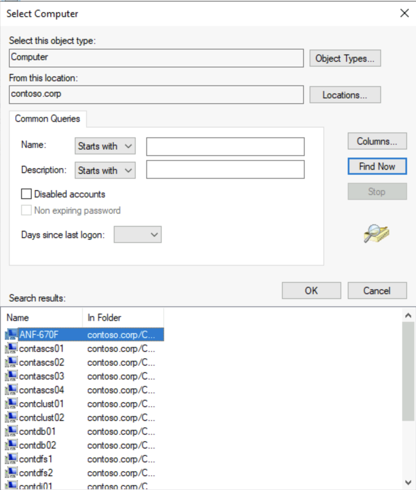

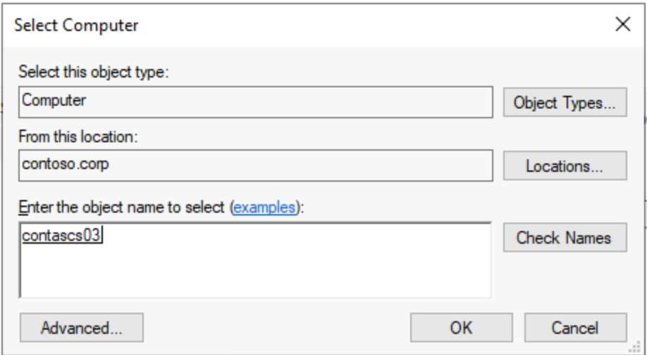

Push the **Next** button to confirm the selection of the DFS server.

In this screen the name of the second part of the Namespace root is defined. Here **sapmnt** has to be supplied. This is part of the SAP naming convention.

In this step the namespace type is defined. This also determines the name of the first part of Namespace root. DFS supports domain-based or stand-alone namespaces. In Windows-based installation, domain-based is the default. Therefore the setup of the namespace server needs to be domain-based. Based on this choice, the domain name will become the first part of the Namespace root. In this since the AD/domain name is contoso.corp the Namespace root is \\\contoso.corp\sapmnt.

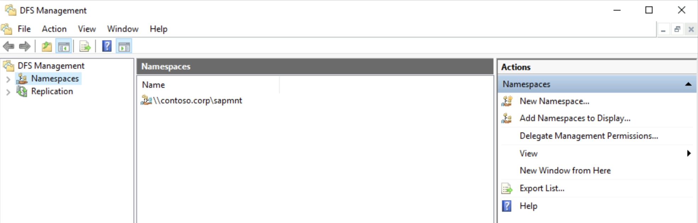

Under the Namespace root numerous Namespace folders can be created. Each of them points to a Folder Target. While the name of the Folder Target can be chosen freely, the name of the Namespace folder has to match a valid SAP SID. In combination this will create a valid SWPM usable UNC share. This mechanism is also be used to create the trans-directory in order to provide a SAP transport directory. The screenshot shows an example for such a configuration.

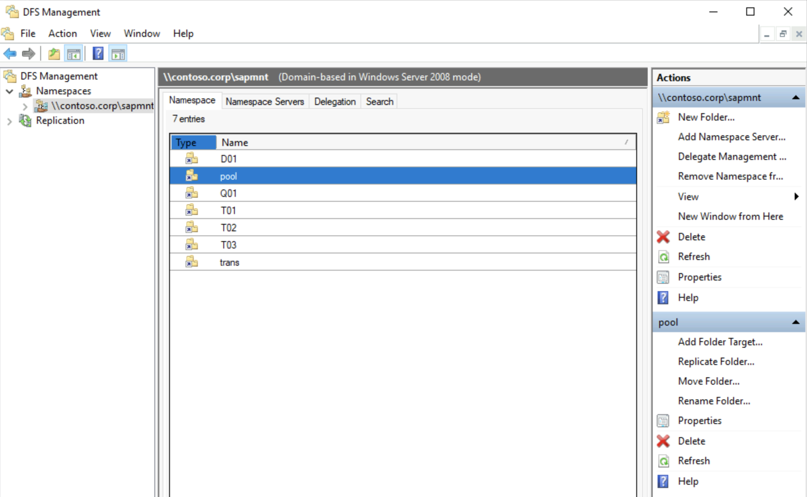

## Adding folders to Azure NetApp Files SMB based Namespace root

The following sequence shows how create folders in DFS-N and assign them to Folder Targets.

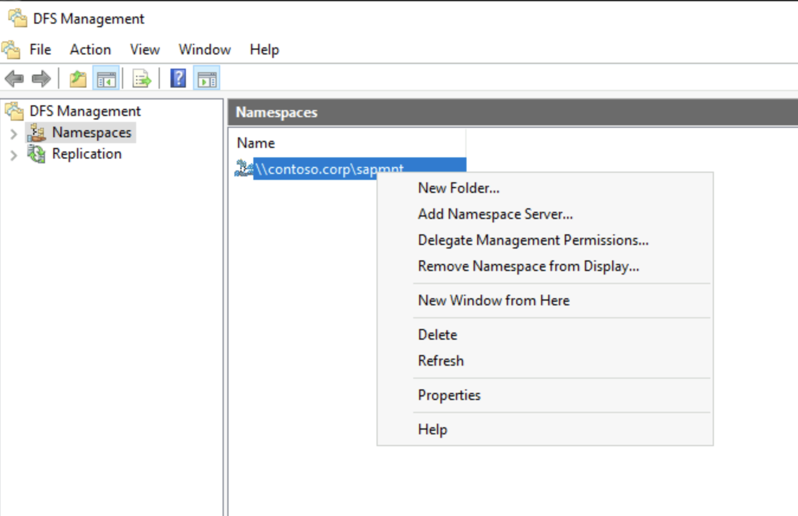

In the DFS Management console right-click on the Namespace root and select New Folder 

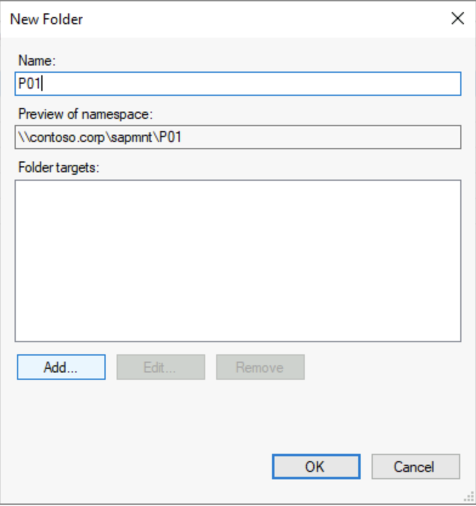

This open the New Folder dialog. Supply either a valid SID like in this case P01 or use trans if the intention is to create a transport directory.

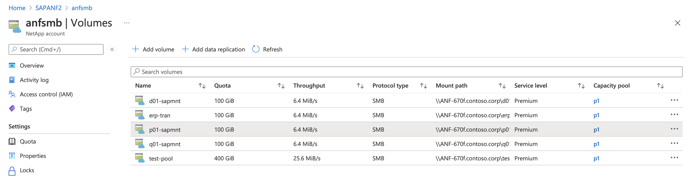

In the Azure Portal choose the volume you want to use as a folder target and click on the entry. 

In the next screen click on Mount instructions on the left side of the screen. This shows under **Mapping your network drive** under 4. the UNC name of the Target Folder. Copy or write down the name.  

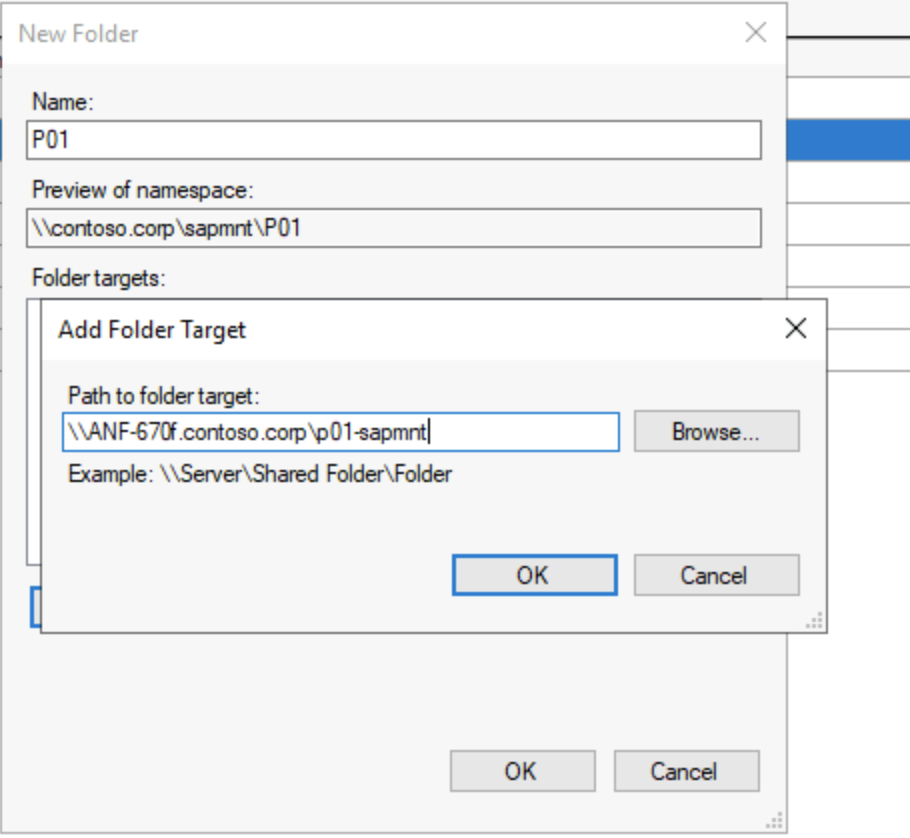

Push the *Add...* button in the already open New Folder dialog and paste in the UNC name for the previous step.

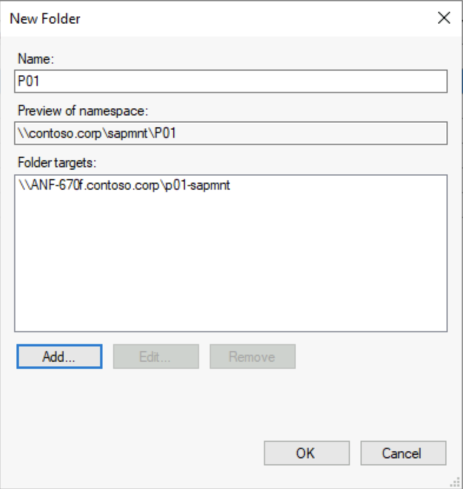

Confirm your input by clicking the **OK** button.

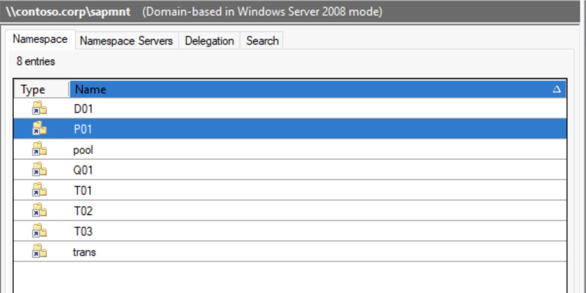

This screen shows the newly added folder.

## Adding additional DFS namespace servers to increase resiliency

The domain-based Namespace server setup easily allows adding additional Namespace servers. Similar to having multiple domain controllers for redundancy in Active Directories where critical information is replicated between the domain controllers, adding additional Namespace servers does the same for DFS-N. This is allowed for domain controllers, locally for cluster nodes or stand alone domain-joined servers. Before using any of them the DFS-N Role need to be installed.
The following screenshot show how this is done.

This screenshot shows a AD where already 3 Namespace servers are added. 

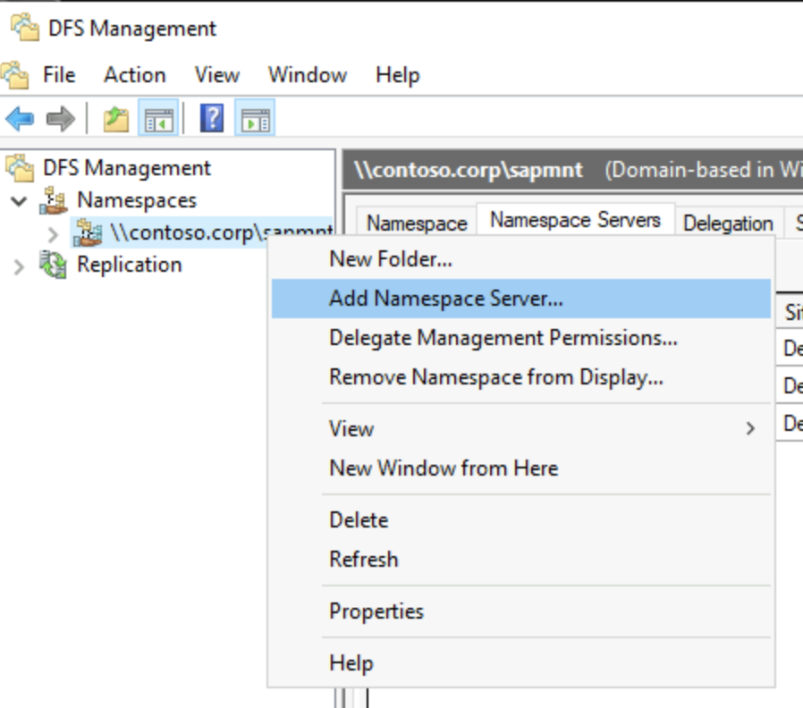

By right-clicking on the Namespace root, the Add Namespace Server dialog is opened.

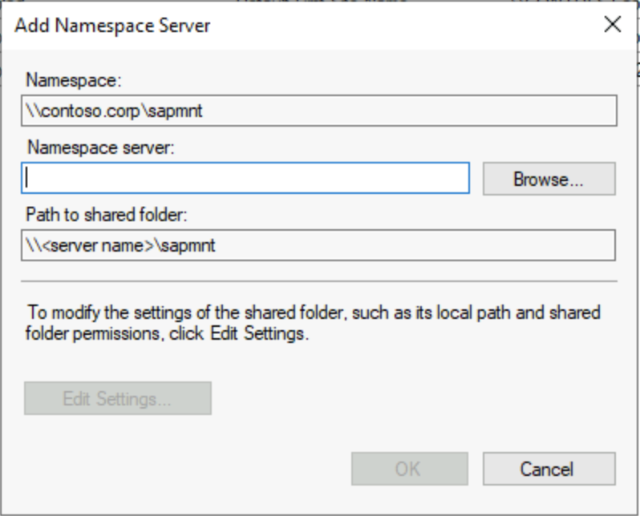

In this screen the name of the Namespace server can be directly supplied. Alternatively the Browse button can be pushed to list already existing servers will be shown.

After supplying a host with the DFS-N Role already installed, pushing the **Add** button will trigger the addition.

This screen shows the successful addition of an additional Namespace server.