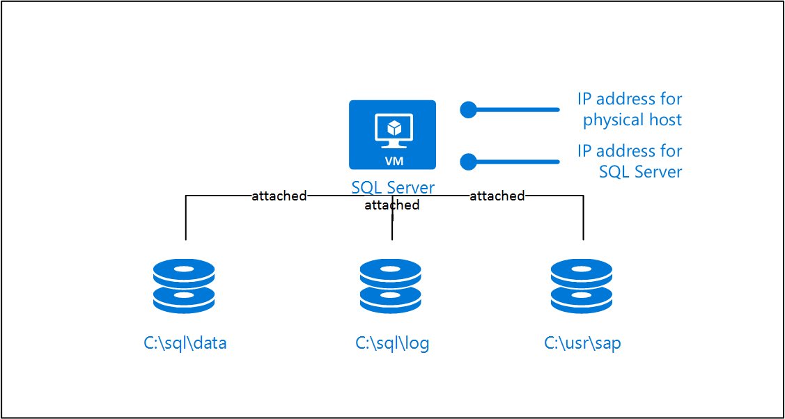

# SAP LaMa connector for Azure

[1877727]:https://launchpad.support.sap.com/#/notes/1877727
[2343511]:https://launchpad.support.sap.com/#/notes/2343511
[2350235]:https://launchpad.support.sap.com/#/notes/2350235
[2562184]:https://launchpad.support.sap.com/#/notes/2562184
[2628497]:https://launchpad.support.sap.com/#/notes/2628497
[2445033]:https://launchpad.support.sap.com/#/notes/2445033
[Logo_Linux]:media/virtual-machines-shared-sap-shared/Linux.png
[Logo_Windows]:media/virtual-machines-shared-sap-shared/Windows.png
[dbms-guide]:dbms-guide.md
[deployment-guide]:deployment-guide.md
[planning-guide]:planning-guide.md
[hana-ops-guide]:hana-vm-operations.md

> [!NOTE]
> General Support Statement: Please always open an incident with SAP on component BC-VCM-LVM-HYPERV if you need support for SAP LaMa or the Azure connector.

SAP LaMa is used by many customers to operate and monitor their SAP landscape. Since SAP LaMa 3.0 SP05, it ships with a connector to Azure by default. You can use this connector to deallocate and start virtual machines, copy and relocate managed disks, and delete managed disks. With these basic operations, you can relocate, copy, clone, and refresh SAP systems using SAP LaMa.

This guide describes how you set up the Azure connector for SAP LaMa, create virtual machines that can be used to install adaptive SAP systems and how to configure them.

> [!NOTE]
> The connector is only available in the SAP LaMa Enterprise Edition

## Resources

The following SAP Notes are related to the topic of SAP LaMa on Azure:

| Note number | Title |
| --- | --- |
| [2343511] |Microsoft Azure connector for SAP Landscape Management (LaMa) |
| [2350235] |SAP Landscape Management 3.0 - Enterprise edition |

Also read the [SAP Help Portal for SAP LaMa](https://help.sap.com/viewer/p/SAP_LANDSCAPE_MANAGEMENT_ENTERPRISE).

## General remarks

* Make sure to enable *Automatic Mountpoint Creation* in Setup -> Settings -> Engine  
  If SAP LaMa mounts volumes using the SAP Adaptive Extensions on a virtual machine, the mount point must exist if this setting is not enabled.

* Use separate subnet and don't use dynamic IP addresses to prevent IP address "stealing" when deploying new VMs and SAP instances are unprepared  
  If you use dynamic IP address allocation in the subnet, which is also used by SAP LaMa, preparing an SAP system with SAP LaMa might fail. If an SAP system is unprepared, the IP addresses are not reserved and might get allocated to other virtual machines.

* If you log on to managed hosts, make sure to not block file systems from being unmounted  
  If you log on to a Linux virtual machines and change the working directory to a directory in a mount point, for example /usr/sap/AH1/ASCS00/exe, the volume cannot be unmounted and a relocate or unprepare fails.

## Set up Azure connector for SAP LaMa

The Azure connector is shipped as of SAP LaMa 3.0 SP05. We recommend always installing the latest support package and patch for SAP LaMa 3.0. The Azure connector uses a Service Principal to authorize against Microsoft Azure. Follow these steps to create a Service Principal for SAP Landscape Management (LaMa).

1. Go to https://portal.azure.com
1. Open the Azure Active Directory blade
1. Click on App registrations
1. Click on Add
1. Enter a Name, select Application Type "Web app/API", enter a sign-on URL (for example http://localhost) and click on Create
1. The sign-on URL is not used and can be any valid URL
1. Select the new App and click on Keys in the Settings tab
1. Enter a description for a new key, select "Never expires" and click on Save
1. Write down the Value. It is used as the password for the Service Principal
1. Write down the Application ID. It is used as the username of the Service Principal

The Service Principal does not have permissions to access your Azure resources by default. You need to give the Service Principal permissions to access them.

1. Go to https://portal.azure.com
1. Open the Resource Groups blade
1. Select the resource group you want to use
1. Click on Access control (IAM)
1. Click on Add
1. Select the role Contributor
1. Enter the name of the application you created above
1. Click on OK
1. Repeat step 3 to 8 for all resource groups you want to use in SAP LaMa

Open the SAP LaMa website and navigate to Infrastructure. Go to tab Cloud Managers and click on Add. Select the Microsoft Azure Cloud Adapter and click Next. Enter the following information:

* Label: Choose a name for the connector instance
* User Name: Service Principal Application ID
* Password: Service Principal key/password
* URL: Keep default https://management.azure.com/
* Monitoring Interval (Seconds): Should be at least 300
* Subscription ID: Azure subscription ID
* Azure Active Directory Tenant ID: ID of the Active Directory tenant
* Proxy host: Hostname of the proxy if SAP LaMa needs a proxy to connect to the internet
* Proxy port: TCP port of the proxy

Click on Test Configuration to validate your input. You should see

Connection successful: Connection to Microsoft cloud was successful. 7 resource groups found (only 10 groups requested)

at the bottom of the website.

## Provision a new adaptive SAP system

You can manually deploy a new virtual machine or use one of the Azure templates in the [quickstart repository](https://github.com/Azure/azure-quickstart-templates). It contains templates for [SAP NetWeaver ASCS](https://github.com/Azure/azure-quickstart-templates/tree/master/sap-lama-ascs), [SAP NetWeaver application servers](https://github.com/Azure/azure-quickstart-templates/tree/master/sap-lama-apps), and the [database](https://github.com/Azure/azure-quickstart-templates/tree/master/sap-lama-db). You can also use these templates to provision new hosts as part of a system copy/clone etc.

We recommend using a separate subnet for all virtual machines that you want to manage with SAP LaMa and don’t use dynamic IP addresses to prevent IP address "stealing" when deploying new virtual machines and SAP instances are unprepared.

> [!NOTE]
> If possible, remove all virtual machine extensions as they might cause long runtimes for detaching disks from a virtual machine.

Make sure that user \<hanasid>adm, \<sapsid>adm and group sapsys exist on the target machine with the same ID and gid or use LDAP. Enable and start the NFS server on the virtual machines that should be used to run the SAP NetWeaver (A)SCS.

### Manual Deployment

SAP LaMa communicates with the virtual machine using the SAP Host Agent. If you deploy the virtual machines manually or not using the Azure Resource Manager template from the quickstart repository, make sure to install the latest SAP Host Agent and the SAP Adaptive Extensions. For more information about the required patch levels for Azure, see SAP Note [2343511].

#### Manual deployment of a Linux Virtual Machine

Create a new virtual machine with one of the supported operation systems listed in SAP Note [2343511]. Add additional IP configurations for the SAP instances. Each instance needs at least on IP address and must be installed using a virtual hostname.

The SAP NetWeaver ASCS instance needs disks for /sapmnt/\<SAPSID>, /usr/sap/\<SAPSID>, /usr/sap/trans, and /usr/sap/\<sapsid>adm. The SAP NetWeaver application servers do not need additional disks. Everything related to the SAP instance must be stored on the ASCS and exported via NFS. Otherwise, it is currently not possible to add additional application servers using SAP LaMa.


#### Manual deployment for SAP HANA

Create a new virtual machine with one of the supported operation systems for SAP HANA as listed in SAP Note [2343511]. Add one additional IP configuration for SAP HANA and one per HANA tenant.

SAP HANA needs disks for /hana/shared, /hana/backup, /hana/data, and /hana/log


#### Manual deployment for Oracle Database on Linux

Create a new virtual machine with one of the supported operation systems for Oracle databases as listed in SAP Note [2343511]. Add one additional IP configuration for the Oracle database.

The Oracle database needs disks for /oracle, /home/oraod1, and /home/oracle


#### Manual deployment for Microsoft SQL Server

Create a new virtual machine with one of the supported operation systems for Microsoft SQL Server as listed in SAP Note [2343511]. Add one additional IP configuration for the SQL Server instance.

The SQL Server database server needs disks for the database data and log files and disks for c:\usr\sap.



Make sure to install a supported Microsoft ODBC driver for SQL Server on a virtual machine that you want to use to relocate an SAP NetWeaver application server to or as a system copy/clone target.

SAP LaMa cannot relocate SQL Server itself so a virtual machine that you want to use to relocate a database instance to or as a system copy/clone target needs SQL Server preinstalled.

### Deploy Virtual Machine Using an Azure Template

Download the following latest available archives from the [SAP Software Marketplace](https://support.sap.com/swdc) for the operating system of the virtual machines:

1. SAPCAR 7.21
1. SAP HOST AGENT 7.21
1. SAP ADAPTIVE EXTENSION 1.0 EXT

Also download the following components from the [Microsoft Download Center](https://www.microsoft.com/download)

1. Microsoft Visual C++ 2010 Redistributable Package (x64) (Windows only)
1. Microsoft ODBC Driver for SQL Server (SQL Server only)

The components are required to deploy the template. The easiest way to make them available to the template is to upload them to an Azure storage account and create a Shared Access Signature (SAS).

The templates have the following parameters:

* sapSystemId: The SAP system ID. It is used to create the disk layout (for example /usr/sap/\<sapsid>).

* computerName: The computer name of the new virtual machine. This parameter is also used by SAP LaMa. When you use this template to provision a new virtual machine as part of a system copy, SAP LaMa waits until the host with this computer name can be reached.

* osType: The type of the operating system you want to deploy.

* dbtype: The type of the database. This parameter is used to determine how many additional IP configurations need to be added and how the disk layout should look like.

* sapSystemSize: The size of the SAP System you want to deploy. It is used to determine the virtual machine instance type and size.

* adminUsername: Username for the virtual machine.

* adminPassword: Password for the virtual machine. You can also provide a public key for SSH.

* sshKeyData: Public SSH key for the virtual machines. Only supported for Linux operating systems.

* subnetId: The ID of the subnet you want to use.

* deployEmptyTarget: You can deploy an empty target if you want to use the virtual machine as a target for an instance relocate or similar. In this case, no additional disks or IP configurations are attached.

* sapcarLocation: The location for the sapcar application that matches the operating system you deploy. sapcar is used to extract the archives you provide in other parameters.

* sapHostAgentArchiveLocation: The location of the SAP Host Agent archive. SAP Host Agent is deployed as part of this template deployment.

* sapacExtLocation: The location of the SAP Adaptive Extensions. SAP Note [2343511] lists the minimum patch level required for Azure.

* vcRedistLocation: The location of the VC Runtime that is required to install the SAP Adaptive Extensions. This parameter is only required for Windows.

* odbcDriverLocation: The location of the ODBC driver you want to install. Only Microsoft ODBC driver for SQL Server is supported.

* sapadmPassword: The password for the sapadm user.

* sapadmId: The Linux User ID of the sapadm user. Not required for Windows.

* sapsysGid: The Linux group ID of the sapsys group. Not required for Windows.

* _artifactsLocation: The base URI, where artifacts required by this template are located. When the template is deployed using the accompanying scripts, a private location in the subscription will be used and this value will be automatically generated. Only needed if you do not deploy the template from GitHub.

* _artifactsLocationSasToken: The sasToken required to access _artifactsLocation. When the template is deployed using the accompanying scripts, a sasToken will be automatically generated. Only needed if you do not deploy the template from GitHub.

### SAP HANA

In the examples below, we assume that you install SAP HANA with system ID HN1 and the SAP NetWeaver system with system ID AH1. The virtual hostnames are hn1-db for the HANA instance, ah1-db for the HANA tenant used by the SAP NetWeaver system, ah1-ascs for the SAP NetWeaver ASCS and ah1-di-0 for the first SAP NetWeaver application server.

#### Install SAP NetWeaver ASCS for SAP HANA

Before you start the SAP Software Provisioning Manager (SWPM), you need to mount the IP address of virtual hostname of the ASCS. The recommended way is to use sapacext. If you mount the IP address using sapacext, make sure to remount the IP address after a reboot.

![Linux][Logo_Linux] Linux

```bash
# /usr/sap/hostctrl/exe/sapacext -a ifup -i <network interface> -h <virtual hostname or IP address> -n <subnet mask>
/usr/sap/hostctrl/exe/sapacext -a ifup -i eth0 -h ah1-ascs -n 255.255.255.128
```

![Windows][Logo_Windows] Windows

```bash
# C:\Program Files\SAP\hostctrl\exe\sapacext.exe -a ifup -i <network interface> -h <virtual hostname or IP address> -n <subnet mask>
C:\Program Files\SAP\hostctrl\exe\sapacext.exe -a ifup -i "Ethernet 3" -h ah1-ascs -n 255.255.255.128
```

Run SWPM and use *ah1-ascs* for the *ASCS Instance Host Name*.

![Linux][Logo_Linux] Linux  
Add the following profile parameter to the SAP Host Agent profile, which is located at /usr/sap/hostctrl/exe/host_profile. For more information, see SAP Note [2628497].
```
acosprep/nfs_paths=/home/ah1adm,/usr/sap/trans,/sapmnt/AH1,/usr/sap/AH1
```

#### Install SAP HANA

If you install SAP HANA using the commandline tool hdblcm, use parameter --hostname to provide a virtual hostname. You need to add the IP address of the virtual hostname of the database to a network interface. The recommended way is to use sapacext. If you mount the IP address using sapacext, make sure to remount the IP address after a reboot.

Add another virtual hostname and IP address for the name that is used by the application servers to connect to the HANA tenant.

```bash
# /usr/sap/hostctrl/exe/sapacext -a ifup -i <network interface> -h <virtual hostname or IP address> -n <subnet mask>
/usr/sap/hostctrl/exe/sapacext -a ifup -i eth0 -h hn1-db -n 255.255.255.128
/usr/sap/hostctrl/exe/sapacext -a ifup -i eth0 -h ah1-db -n 255.255.255.128
```

Run the database instance installation of SWPM on the application server virtual machine, not on the HANA virtual machine. Use *ah1-db* for the *Database Host* in dialog *Database for SAP System*.

#### Install SAP NetWeaver Application Server for SAP HANA

Before you start the SAP Software Provisioning Manager (SWPM), you need to mount the IP address of virtual hostname of the application server. The recommended way is to use sapacext. If you mount the IP address using sapacext, make sure to remount the IP address after a reboot.

![Linux][Logo_Linux] Linux

```bash
# /usr/sap/hostctrl/exe/sapacext -a ifup -i <network interface> -h <virtual hostname or IP address> -n <subnet mask>
/usr/sap/hostctrl/exe/sapacext -a ifup -i eth0 -h ah1-di-0 -n 255.255.255.128
```

![Windows][Logo_Windows] Windows

```bash
# C:\Program Files\SAP\hostctrl\exe\sapacext.exe -a ifup -i <network interface> -h <virtual hostname or IP address> -n <subnet mask>
C:\Program Files\SAP\hostctrl\exe\sapacext.exe -a ifup -i "Ethernet 3" -h ah1-di-0 -n 255.255.255.128
```

It is recommended to use SAP NetWeaver profile parameter dbs/hdb/hdb_use_ident to set the identity that is used to find the key in the HDB userstore. You can add this parameter manually after the database instance installation with SWPM or run SWPM with

```bash
# from https://blogs.sap.com/2015/04/14/sap-hana-client-software-different-ways-to-set-the-connectivity-data/
/sapdb/DVDs/IM_LINUX_X86_64/sapinst HDB_USE_IDENT=SYSTEM_COO
```

If you set it manually, you also need to create new HDB userstore entries.

```bash
# run as <sapsid>adm
/usr/sap/AH1/hdbclient/hdbuserstore LIST
# reuse the port that was listed from the command above, in this example 35041
/usr/sap/AH1/hdbclient/hdbuserstore SET DEFAULT ah1-db:35041@AH1 SAPABAP1 <password>
```

Use *ah1-di-0* for the *PAS Instance Host Name* in dialog *Primary Application Server Instance*.

#### Post-Installation Steps for SAP HANA

Make sure to back up the SYSTEMDB and all tenant databases before you try to do a tenant copy, tenant move or create a system replication.

### Microsoft SQL Server

In the examples below, we assume that you install the SAP NetWeaver system with system ID AS1. The virtual hostnames are as1-db for the SQL Server instance used by the SAP NetWeaver system, as1-ascs for the SAP NetWeaver ASCS and as1-di-0 for the first SAP NetWeaver application server.

#### Install SAP NetWeaver ASCS for SQL Server

Before you start the SAP Software Provisioning Manager (SWPM), you need to mount the IP address of virtual hostname of the ASCS. The recommended way is to use sapacext. If you mount the IP address using sapacext, make sure to remount the IP address after a reboot.

```bash
# C:\Program Files\SAP\hostctrl\exe\sapacext.exe -a ifup -i <network interface> -h <virtual hostname or IP address> -n <subnet mask>
C:\Program Files\SAP\hostctrl\exe\sapacext.exe -a ifup -i "Ethernet 3" -h as1-ascs -n 255.255.255.128
```

Run SWPM and use *as1-ascs* for the *ASCS Instance Host Name*.

#### Install SQL Server

You need to add the IP address of the virtual hostname of the database to a network interface. The recommended way is to use sapacext. If you mount the IP address using sapacext, make sure to remount the IP address after a reboot.

```bash
# C:\Program Files\SAP\hostctrl\exe\sapacext.exe -a ifup -i <network interface> -h <virtual hostname or IP address> -n <subnet mask>
C:\Program Files\SAP\hostctrl\exe\sapacext.exe -a ifup -i "Ethernet 3" -h as1-db -n 255.255.255.128
```

Run the database instance installation of SWPM on the SQL server virtual machine. Use SAPINST_USE_HOSTNAME=*as1-db* to override the hostname used to connect to SQL Server. If you deployed the virtual machine using the Azure Resource Manager template, make sure to set the directory used for the database data files to *C:\sql\data* and database log file to *C:\sql\log*.

Make sure that the user *NT AUTHORITY\SYSTEM* has access to the SQL Server and has the server role *sysadmin*. For more information, see SAP Note [1877727] and [2562184].

#### Install SAP NetWeaver Application Server

Before you start the SAP Software Provisioning Manager (SWPM), you need to mount the IP address of virtual hostname of the application server. The recommended way is to use sapacext. If you mount the IP address using sapacext, make sure to remount the IP address after a reboot.

```bash
# C:\Program Files\SAP\hostctrl\exe\sapacext.exe -a ifup -i <network interface> -h <virtual hostname or IP address> -n <subnet mask>
C:\Program Files\SAP\hostctrl\exe\sapacext.exe -a ifup -i "Ethernet 3" -h as1-di-0 -n 255.255.255.128
```

Use *as1-di-0* for the *PAS Instance Host Name* in dialog *Primary Application Server Instance*.

## Troubleshooting

### Errors and Warnings during Discover

* The SELECT permission was denied
  * [Microsoft][ODBC SQL Server Driver][SQL Server]The SELECT permission was denied on the object 'log_shipping_primary_databases', database 'msdb', schema 'dbo'. [SOAPFaultException]  
  The SELECT permission was denied on the object 'log_shipping_primary_databases', database 'msdb', schema 'dbo'.
  * Solution  
    Make sure that *NT AUTHORITY\SYSTEM* can access the SQL Server. See SAP Note [2562184]


### Errors and Warnings for Instance Validation

* An exception was raised in validation of the HDB userstore  
  * see Log Viewer  
    com.sap.nw.lm.aci.monitor.api.validation.RuntimeValidationException: Exception in validator with ID 'RuntimeHDBConnectionValidator' (Validation: 'VALIDATION_HDB_USERSTORE'): Could not retrieve the hdbuserstore  
    HANA userstore is not in the correct location
  * Solution  
    Make sure that /usr/sap/AH1/hdbclient/install/installation.ini is correct

### Errors and Warnings during a System Copy

* An error occurred when validating the system provisioning step
  * Caused by: com.sap.nw.lm.aci.engine.base.api.util.exception.HAOperationException
    Calling '/usr/sap/hostctrl/exe/sapacext -a ShowHanaBackups -m HN1 -f 50 -h hn1-db -o level=0\;status=5\;port=35013 pf=/usr/sap/hostctrl/exe/host_profile -R -T dev_lvminfo -u SYSTEM -p hook -r' | /usr/sap/hostctrl/exe/sapacext -a ShowHanaBackups -m HN1 -f 50 -h hn1-db -o level=0\;status=5\;port=35013 pf=/usr/sap/hostctrl/exe/host_profile -R -T dev_lvminfo -u SYSTEM -p hook -r
  * Solution  
    Take backup of all databases in source HANA system

* System Copy Step *Start* of database instance
  * Host Agent Operation '000D3A282BC91EE8A1D76CF1F92E2944' failed (OperationException. FaultCode: '127', Message: 'Command execution failed. : [Microsoft][ODBC SQL Server Driver][SQL Server]User does not have permission to alter database 'AS2', the database does not exist, or the database is not in a state that allows access checks.')
  * Solution  
    Make sure that *NT AUTHORITY\SYSTEM* can access the SQL Server. See SAP Note [2562184]

### Errors and Warnings during a System Clone

* Error occurred when trying to register instance agent in step *Forced Register and Start Instance Agent* of application server or ASCS
  * Error occurred when trying to register instance agent. (RemoteException: 'Failed to load instance data from profile '\\as1-ascs\sapmnt\AS1\SYS\profile\AS1_D00_as1-di-0':  Cannot access profile '\\as1-ascs\sapmnt\AS1\SYS\profile\AS1_D00_as1-di-0': No such file or directory.')
  * Solution  
   Make sure that the sapmnt share on the ASCS/SCS has Full Access for SAP_AS1_GlobalAdmin

* Error in step *Enable Startup Protection for Clone*
  * Failed to open file '\\as1-ascs\sapmnt\AS1\SYS\profile\AS1_D00_as1-di-0' Cause: No such file or directory
  * Solution  
    The computer account of the application server needs write access to the profile

### Errors and Warnings during Create System Replication

* Exception when clicking on Create System Replication
  * Caused by: com.sap.nw.lm.aci.engine.base.api.util.exception.HAOperationException
      Calling '/usr/sap/hostctrl/exe/sapacext -a ShowHanaBackups -m HN1 -f 50 -h hn1-db -o level=0\;status=5\;port=35013 pf=/usr/sap/hostctrl/exe/host_profile -R -T dev_lvminfo -u SYSTEM -p hook -r' | /usr/sap/hostctrl/exe/sapacext -a ShowHanaBackups -m HN1 -f 50 -h hn1-db -o level=0\;status=5\;port=35013 pf=/usr/sap/hostctrl/exe/host_profile -R -T dev_lvminfo -u SYSTEM -p hook -r
  * Solution  
    Test if sapacext can be executed as `<hanasid`>adm

* Error when full copy is not enabled in Storage Step
  * An error occurred when reporting a context attribute message for path IStorageCopyData.storageVolumeCopyList:1 and field targetStorageSystemId
  * Solution  
    Ignore Warnings in step and try again. This issue will be fixed in a new support package/patch of SAP LaMa.

### Errors and Warnings during Relocate

* Path '/usr/sap/AH1' is not allowed for nfs reexports.
  * Check SAP Note [2628497] for details.
  * Solution  
    Add ASCS exports to ASCS HostAgent Profile. See SAP Note [2628497]

* Function not implemented when relocating ASCS
  * Command Output: exportfs: host:/usr/sap/AX1: Function not implemented
  * Solution  
    Make sure that the NFS server service is enabled on the relocate target virtual machine

### Errors and Warnings during Application Server Installation

* Error executing SAPinst step: getProfileDir
  * ERROR: (Last error reported by the step: Caught ESAPinstException in module call: Validator of step '|NW_DI|ind|ind|ind|ind|0|0|NW_GetSidFromProfiles|ind|ind|ind|ind|getSid|0|NW_readProfileDir|ind|ind|ind|ind|readProfile|0|getProfileDir' reported an error: Node \\\as1-ascs\sapmnt\AS1\SYS\profile does not exist. Start SAPinst in interactive mode to solve this problem)
  * Solution  
    Make sure that SWPM is running with a user that has access to the profile. This user can be configured in the Application Server Installation wizard

* Error executing SAPinst step: askUnicode
  * ERROR: (Last error reported by the step: Caught ESAPinstException in module call: Validator of step '|NW_DI|ind|ind|ind|ind|0|0|NW_GetSidFromProfiles|ind|ind|ind|ind|getSid|0|NW_getUnicode|ind|ind|ind|ind|unicode|0|askUnicode' reported an error: Start SAPinst in interactive mode to solve this problem)
  * Solution  
    If you use a recent SAP kernel, SWPM cannot determine whether the system is a unicode system anymore using the message server of the ASCS. See SAP Note [2445033] for more details.  
    This issue will be fixed in a new support package/patch of SAP LaMa.  
    Set profile parameter OS_UNICODE=uc in the default profile of your SAP system to work around this issue.

* Error executing SAPinst step: dCheckGivenServer
  * Error executing SAPinst step: dCheckGivenServer" version="1.0" ERROR: (Last error reported by the step: \<p> Installation was canceled by user. \</p>
  * Solution  
    Make sure that SWPM is running with a user that has access to the profile. This user can be configured in the Application Server Installation wizard

* Error executing SAPinst step: checkClient
  * Error executing SAPinst step: checkClient" version="1.0" ERROR: (Last error reported by the step: \<p> Installation was canceled by user. \</p>)
  * Solution  
    Make sure that the Microsoft ODBC driver for SQL Server is installed on the virtual machine on which you want to install the application server

* Error executing SAPinst step: copyScripts
  * Last error reported by the step: System call failed. DETAILS: Error 13 (0x0000000d) (Permission denied) in execution of system call 'fopenU' with parameter (\\\as1-ascs/sapmnt/AS1/SYS/exe/uc/NTAMD64/strdbs.cmd, w), line (494) in file (\bas/bas/749_REL/bc_749_REL/src/ins/SAPINST/impl/src/syslib/filesystem/syxxcfstrm2.cpp), stack trace:  
  CThrThread.cpp: 85: CThrThread::threadFunction()  
  CSiServiceSet.cpp: 63: CSiServiceSet::executeService()  
  CSiStepExecute.cpp: 913: CSiStepExecute::execute()  
  EJSController.cpp: 179: EJSControllerImpl::executeScript()  
  JSExtension.hpp: 1136: CallFunctionBase::call()  
  iaxxcfile.cpp: 183: iastring CIaOsFileConnect::callMemberFunction(iastring const& name, args_t const& args)  
  iaxxcfile.cpp: 1849: iastring CIaOsFileConnect::newFileStream(args_t const& _args)  
  iaxxbfile.cpp: 773: CIaOsFile::newFileStream_impl(4)  
  syxxcfile.cpp: 233: CSyFileImpl::openStream(ISyFile::eFileOpenMode)  
  syxxcfstrm.cpp: 29: CSyFileStreamImpl::CSyFileStreamImpl(CSyFileStream*,iastring,ISyFile::eFileOpenMode)  
  syxxcfstrm.cpp: 265: CSyFileStreamImpl::open()  
  syxxcfstrm2.cpp: 58: CSyFileStream2Impl::CSyFileStream2Impl(const CSyPath & \\\aw1-ascs/sapmnt/AW1/SYS/exe/uc/NTAMD64/strdbs.cmd, 0x4)  
  syxxcfstrm2.cpp: 456: CSyFileStream2Impl::open()
  * Solution  
    Make sure that SWPM is running with a user that has access to the profile. This user can be configured in the Application Server Installation wizard

* Error executing SAPinst step: askPasswords
  * Last error reported by the step: System call failed. DETAILS: Error 5 (0x00000005) (Access is denied.) in execution of system call 'NetValidatePasswordPolicy' with parameter (...), line (359) in file (\bas/bas/749_REL/bc_749_REL/src/ins/SAPINST/impl/src/syslib/account/synxcaccmg.cpp), stack trace:  
  CThrThread.cpp: 85: CThrThread::threadFunction()  
  CSiServiceSet.cpp: 63: CSiServiceSet::executeService()  
  CSiStepExecute.cpp: 913: CSiStepExecute::execute()  
  EJSController.cpp: 179: EJSControllerImpl::executeScript()  
  JSExtension.hpp: 1136: CallFunctionBase::call()  
  CSiStepExecute.cpp: 764: CSiStepExecute::invokeDialog()  
  DarkModeGuiEngine.cpp: 56: DarkModeGuiEngine::showDialogCalledByJs()  
  DarkModeDialog.cpp: 85: DarkModeDialog::submit()  
  EJSController.cpp: 179: EJSControllerImpl::executeScript()  
  JSExtension.hpp: 1136: CallFunctionBase::call()  
  iaxxcaccount.cpp: 107: iastring CIaOsAccountConnect::callMemberFunction(iastring const& name, args_t const& args)  
  iaxxcaccount.cpp: 1186: iastring CIaOsAccountConnect::validatePasswordPolicy(args_t const& _args)  
  iaxxbaccount.cpp: 430: CIaOsAccount::validatePasswordPolicy_impl()  
  synxcaccmg.cpp: 297: ISyAccountMgt::PasswordValidationMessage CSyAccountMgtImpl::validatePasswordPolicy(saponazure,*****) const )
  * Solution  
    Make sure to add a Host rule in step *Isolation* to allow communication from the VM to the domain controller

## Next steps
* [SAP HANA on Azure operations guide][hana-ops-guide]
* [Azure Virtual Machines planning and implementation for SAP][planning-guide]
* [Azure Virtual Machines deployment for SAP][deployment-guide]
* [Azure Virtual Machines DBMS deployment for SAP][dbms-guide]