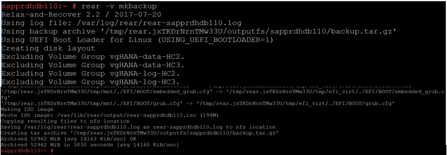
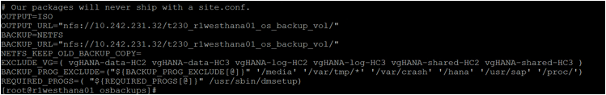

# OS backup and restore

This article walks through the steps to do an operating system (OS) file-level backup and restore. The procedure differs depending on parameters like Type I or Type II, Revision 3 or above, location, and so on. Check with Microsoft operations to get the values for these parameters for your resources.

## OS backup and restore for Type II SKUs of Revision 3 stamps

The information below describes the steps to do an operating system file-level backup and restore for **Type II  SKUs** of HANA Large Instances Revision 3.

>[!Important]
> **This article does not apply to Type II SKU deployments in Revision 4 HANA Large Instance stamps.** Boot LUNS of Type II HANA Large Instances deployed in Revision 4 HANA Large Instance stamps can be backed up with storage snapshots, which is true of Type I SKUs already in Revision 3 stamps.


>[!NOTE]
>The OS backup scripts uses the ReaR software, which is pre-installed in the server.  

After provisioning is complete by the Microsoft Service Management team, by default, the server is configured with two schedules to back up the file-system level of the OS. You can check the schedules of the backup jobs by using the following command:

```
#crontab –l
```
You can change the backup schedule anytime by using the following command:
```
#crontab -e
```
### Take a manual backup

The OS file system backup is scheduled using a **cron job** already. However, you can do the operating system file-level backup manually as well. To do a manual backup, run the following command:

```
#rear -v mkbackup
```
The following screen show shows the sample manual backup:




### Restore a backup

You can restore a full backup or an individual file from a backup. To restore, use the following command:

```
#tar  -xvf  <backup file>  [Optional <file to restore>]
```
After the restore, the file is recovered in the current working directory.

The following command shows the restore of the file */etc/fstab* from the backup file *backup.tar.gz*:
```
#tar  -xvf  /osbackups/hostname/backup.tar.gz  etc/fstab 
```
>[!NOTE] 
>You need to copy the file to the desired location after it is restored from the backup.

The following screenshot shows the restore of a complete backup.


### Install the ReaR tool and change the configuration 

The Relax-and-Recover (ReaR) packages are **pre-installed** in the **Type II SKUs** of HANA Large Instances. No action is needed from you. You can directly start using the ReaR tool for the operating system backup.

However, in circumstances where you need to install the packages on your own, you can use the following steps to install and configure the ReaR tool.

To install the **ReaR** backup packages, use the following commands:

For the **SLES** operating system, use the following command:
```
#zypper install <rear rpm package>
```
For the **RHEL** operating system, use the following command: 

```
#yum install rear -y
```
To configure the ReaR tool, you need to update parameters **OUTPUT_URL**  and **BACKUP_URL**  in the *file /etc/rear/local.conf*.

```
OUTPUT=ISO
ISO_MKISOFS_BIN=/usr/bin/ebiso
BACKUP=NETFS
OUTPUT_URL="nfs://nfsip/nfspath/"
BACKUP_URL="nfs://nfsip/nfspath/"
BACKUP_OPTIONS="nfsvers=4,nolock"
NETFS_KEEP_OLD_BACKUP_COPY=
EXCLUDE_VG=( vgHANA-data-HC2 vgHANA-data-HC3 vgHANA-log-HC2 vgHANA-log-HC3 vgHANA-shared-HC2 vgHANA-shared-HC3 )
BACKUP_PROG_EXCLUDE=("${BACKUP_PROG_EXCLUDE[@]}" '/media' '/var/tmp/*' '/var/crash' '/hana' '/usr/sap'  ‘/proc’)
```

The following screenshot shows the restore of a complete backup:



## OS backup and restore for all other SKUs

The information below describes the steps to do an operating system file-level backup and restore for all SKUs of all Revisions except **Type II  SKUs** of the HANA Large Instances of Revision 3.

### Take a manual backup

Get the latest Microsoft Snapshot Tools for SAP HANA as explained in a series of articles starting with [What is Azure Application Consistent Snapshot tool](../../../azure-netapp-files/azacsnap-introduction.md) and configure and test them as described in these articles:

- [Configure Azure Application Consistent Snapshot tool](../../../azure-netapp-files/azacsnap-cmd-ref-configure.md)
- [Test Azure Application Consistent Snapshot tool](../../../azure-netapp-files/azacsnap-cmd-ref-test.md) 

to run regularly via `crontab` as described in [Back up using Azure Application Consistent Snapshot tool](../../../azure-netapp-files/azacsnap-cmd-ref-backup.md). 

For more information, see these references:

- [Install Azure Application Consistent Snapshot tool](../../../azure-netapp-files/azacsnap-installation.md)
- [Configure Azure Application Consistent Snapshot tool](../../../azure-netapp-files/azacsnap-cmd-ref-configure.md)
- [Test Azure Application Consistent Snapshot tool](../../../azure-netapp-files/azacsnap-cmd-ref-test.md)
- [Back up using Azure Application Consistent Snapshot tool](../../../azure-netapp-files/azacsnap-cmd-ref-backup.md)
- [Obtain details using Azure Application Consistent Snapshot tool](../../../azure-netapp-files/azacsnap-cmd-ref-details.md)
- [Delete using Azure Application Consistent Snapshot tool](../../../azure-netapp-files/azacsnap-cmd-ref-delete.md)
- [Restore using Azure Application Consistent Snapshot tool](../../../azure-netapp-files/azacsnap-cmd-ref-restore.md)
- [Disaster recovery using Azure Application Consistent Snapshot tool](../../../azure-netapp-files/azacsnap-disaster-recovery.md)
- [Troubleshoot Azure Application Consistent Snapshot tool](../../../azure-netapp-files/azacsnap-troubleshoot.md)
- [Tips and tricks for using Azure Application Consistent Snapshot tool](../../../azure-netapp-files/azacsnap-tips.md)


### Restore a backup

The restore operation cannot be done from the OS itself. You'll need to raise a support ticket with Microsoft operations. The restore operation requires the HANA Large Instance (HLI) to be in powered off state, so schedule accordingly.

### Managed OS snapshots

Azure can automatically take OS backups for your HLI resources. These backups are taken once daily, and Azure keeps up to the latest three such backups. These backups are enabled by default for all customers in the following regions:
- West US
- Australia East
- Australia Southeast
- South Central US
- East US 2

This facility is partially available in the following regions:
- East US
- North Europe
- West Europe

The frequency or retention period of the backups taken by this facility can't be altered. If a different OS backup strategy is needed for your HLI resources, you may opt out of this facility by raising a support ticket with Microsoft operations. Then configure Microsoft Snapshot Tools for SAP HANA to take OS backups by using the instructions provided earlier in the section, [Take a manual backup](#take-a-manual-backup).

## Next steps

Learn how to enable kdump for HANA Large Instances.

> [!div class="nextstepaction"]
> [kdump for SAP HANA on Azure Large Instances](hana-large-instance-enable-kdump.md)
