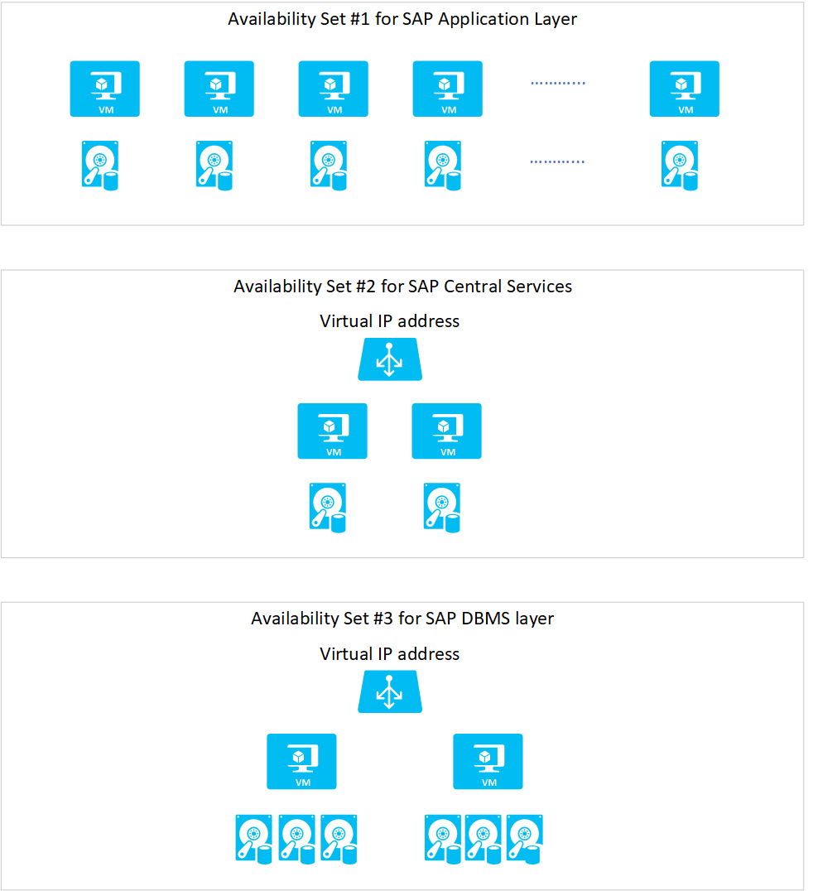

# SAP workload configurations with Azure Availability Zones
[Azure Availability Zones](https://docs.microsoft.com/azure/availability-zones/az-overview) is one of the high-availability features that Azure provides. Using Availability Zones improves the overall availability of SAP workloads on Azure. This feature is already available in some [Azure regions](https://azure.microsoft.com/global-infrastructure/regions/). In the future, it will be available in more regions.

This graphic shows the basic architecture of SAP high availability:

The SAP application layer is deployed across one Azure [availability set](https://docs.microsoft.com/azure/virtual-machines/windows/manage-availability). For high availability of SAP Central Services, you can deploy two VMs in a separate availability set. Use Windows Server Failover Clustering or Pacemaker (Linux) as a high-availability framework with automatic failover in case of an infrastructure or software problem. To learn more about these deployments, see:

- [Cluster an SAP ASCS/SCS instance on a Windows failover cluster by using a cluster shared disk](https://docs.microsoft.com/azure/virtual-machines/workloads/sap/sap-high-availability-guide-wsfc-shared-disk)
- [Cluster an SAP ASCS/SCS instance on a Windows failover cluster by using file share](https://docs.microsoft.com/azure/virtual-machines/workloads/sap/sap-high-availability-guide-wsfc-file-share)
- [High availability for SAP NetWeaver on Azure VMs on SUSE Linux Enterprise Server for SAP applications](https://docs.microsoft.com/azure/virtual-machines/workloads/sap/high-availability-guide-suse)
- [Azure Virtual Machines high availability for SAP NetWeaver on Red Hat Enterprise Linux](https://docs.microsoft.com/azure/virtual-machines/workloads/sap/high-availability-guide-rhel)

A similar architecture applies for the DBMS layer of SAP NetWeaver, S/4HANA, or Hybris systems. You deploy the DBMS layer in an active/passive mode with a failover cluster solution to protect from infrastructure or software failure. The failover cluster solution could be a DBMS-specific failover framework, Windows Server Failover Clustering, or Pacemaker.

To deploy the same architecture by using Azure Availability Zones, you need to make some changes to the architecture outlined earlier. This article describes these changes.

## Considerations for deploying across Availability Zones

Consider the following when you use Availability Zones:

- There are no guarantees regarding the distances between various Availability Zones within an Azure region.
- Availability Zones are not an ideal DR solution. Natural disasters can cause widespread damage in world regions, including heavy damage to power infrastructures. The distances between various zones might not be large enough to constitute a proper DR solution.
- The network latency across Availability Zones is not the same in all Azure regions. In some cases, you can deploy and run the SAP application layer across different zones because the network latency from one zone to the active DBMS VM is acceptable. But in some Azure regions, the latency between the active DBMS VM and the SAP application instance, when deployed in different zones, might not be acceptable for SAP business processes. In these cases, the deployment architecture needs to be different, with an active/active architecture for the application or an active/passive architecture where cross-zone network latency is too high.
- When deciding where to use Availability Zones, base your decision on the network latency between the zones. Network latency plays an important role in two areas:
	- Latency between the two DBMS instances that need to have synchronous replication. The higher the network latency, the more likely it will affect the scalability of your workload.
	- The difference in network latency between a VM running an SAP dialog instance in-zone with the active DBMS instance and a similar VM in another zone. As this difference increases, the influence on the running time of business processes and batch jobs also increases, dependent on whether they run in-zone with the DBMS or in a different zone.

When you deploy Azure VMs across Availability Zones and establish failover solutions within the same Azure region, some restrictions apply:

- You must use [Azure Managed Disks](https://azure.microsoft.com/services/managed-disks/) when you deploy to Azure Availability Zones. 
- The mapping of zone enumerations to the physical zones is fixed on an Azure subscription basis. If you're using different subscriptions to deploy your SAP systems, you need to define the ideal zones for each subscription.
- You can't deploy Azure availability sets within an Azure Availability Zone unless you use [Azure Proximity Placement Group](https://docs.microsoft.com/azure/virtual-machines/linux/co-location). The way how you can deploy the SAP DBMS layer and the central services across zones and at the same time deploy the SAP application layer using availability sets and still achieve close proximity of the VMs is documented in the article [Azure Proximity Placement Groups for optimal network latency with SAP applications](sap-proximity-placement-scenarios.md). If you are not leveraging Azure proximity placement groups, you need to choose one or the other as a deployment framework for virtual machines.
- You can't use an [Azure Basic Load Balancer](https://docs.microsoft.com/azure/load-balancer/load-balancer-overview) to create failover cluster solutions based on Windows Server Failover Clustering or Linux Pacemaker. Instead, you need to use the [Azure Standard Load Balancer SKU](https://docs.microsoft.com/azure/load-balancer/load-balancer-standard-availability-zones).

## The ideal Availability Zones combination
Before you decide how to use Availability Zones, you need to determine:

- The network latency among the three zones of an Azure region. This will enable you to choose the zones with the least network latency in cross-zone network traffic.
- The difference between VM-to-VM latency within one of the zones, of your choosing, and the network latency across two zones of your choosing.
- A determination of whether the VM types that you need to deploy are available in the two zones that you selected. With some VMs, especially M-Series VMs, you might encounter situations in which some SKUs are available in only two of the three zones.

## Network latency between and within zones
To determine the latency between the different zones, you need to:

- Deploy the VM SKU you want to use for your DBMS instance in all three zones. Make sure [Azure Accelerated Networking](https://azure.microsoft.com/blog/maximize-your-vm-s-performance-with-accelerated-networking-now-generally-available-for-both-windows-and-linux/) is enabled when you take this measurement.
- When you find the two zones with the least network latency, deploy another three VMs of the VM SKU that you want to use as the application layer VM across the three Availability Zones. Measure the network latency against the two DBMS VMs in the two DBMS zones that you selected. 
- Use **niping** as a measuring tool. This tool, from SAP, is described in SAP support notes [#500235](https://launchpad.support.sap.com/#/notes/500235) and [#1100926](https://launchpad.support.sap.com/#/notes/1100926/E). Focus on the commands documented for latency measurements. Because **ping** doesn't work through the Azure Accelerated Networking code paths, we don't recommend that you use it.

You don't need to perform these tests manually. You can find a PowerShell procedure [Availability Zone Latency Test](https://github.com/Azure/SAP-on-Azure-Scripts-and-Utilities/tree/master/AvZone-Latency-Test) that automates the latency tests described. 

Based on your measurements and the availability of your VM SKUs in the Availability Zones, you need to make some decisions:

- Define the ideal zones for the DBMS layer.
- Determine whether you want to distribute your active SAP application layer across one, two, or all three zones, based on differences of network latency in-zone versus across zones.
- Determine whether you want to deploy an active/passive configuration or an active/active configuration, from an application point of view. (These configurations are explained later in this article.)

In making these decisions, also take into account SAP's network latency recommendations, as documented in SAP note [#1100926](https://launchpad.support.sap.com/#/notes/1100926/E).

> [!IMPORTANT]
> The measurements and decisions you make are valid for the Azure subscription you used when you took the measurements. If you use another Azure subscription, you need to repeat the measurements. The mapping of enumerated zones might be different for another Azure subscription.

> [!IMPORTANT]
> It's expected that the measurements described earlier will provide different results in every Azure region that supports [Availability Zones](https://docs.microsoft.com/azure/availability-zones/az-overview). Even if your network latency requirements are the same, you might need to adopt different deployment strategies in different Azure regions because the network latency between zones can be different. In some Azure regions, the network latency among the three different zones can be vastly different. In other regions, the network latency among the three different zones might be more uniform. The claim that there is always a network latency  between 1 and 2 milliseconds  is not correct. The network latency across Availability Zones in Azure regions can't be generalized.

## Active/Active deployment
This deployment architecture is called active/active because you deploy your active SAP application servers across two or three zones. The SAP Central Services instance that uses enqueue replication will be deployed between two zones. The same is true for the DBMS layer, which will be deployed across the same zones as SAP Central Service.

When considering this configuration, you need to find the two Availability Zones in your region that offer cross-zone network latency that's acceptable for your workload and your synchronous DBMS replication. You also want to be sure the delta between network latency within the zones you selected and the cross-zone network latency isn't too large. This is because you don't want large variations, depending on whether a job runs in-zone with the DBMS server or across zones, in the running times of your business processes or batch jobs. Some variations are acceptable, but not factors of difference.

A simplified schema of an active/active deployment across two zones could look like this:

The following considerations apply for this configuration:

- Not using [Azure Proximity Placement Group](https://docs.microsoft.com/azure/virtual-machines/linux/co-location), you treat the Azure Availability Zones as fault and update domains for all the VMs because availability sets can't be deployed in Azure Availability Zones.
- If you want to combine zonal deployments for the DBMS layer and central services, but want to use Azure availability sets for the application layer, you need to use Azure proximity groups as described in the article [Azure Proximity Placement Groups for optimal network latency with SAP applications](sap-proximity-placement-scenarios.md).
- For the load balancers of the failover clusters of SAP Central Services and the DBMS layer, you need to use the [Standard SKU Azure Load Balancer](https://docs.microsoft.com/azure/load-balancer/load-balancer-standard-availability-zones). The Basic Load Balancer won't work across zones.
- The Azure virtual network that you deployed to host the SAP system, together with its subnets, is stretched across zones. You don't need separate virtual networks for each zone.
- For all virtual machines you deploy, you need to use [Azure Managed Disks](https://azure.microsoft.com/services/managed-disks/). Unmanaged disks aren't supported for zonal deployments.
- Azure Premium Storage and [Ultra SSD storage](https://docs.microsoft.com/azure/virtual-machines/windows/disks-ultra-ssd) don't support any type of storage replication across zones. The application (DBMS or SAP Central Services) must replicate important data.
- The same is true for the shared sapmnt directory, which is a shared disk (Windows), a CIFS share (Windows), or an NFS share (Linux). You need to use a technology that replicates these shared disks or shares between the zones. These technologies are supported:
  - For Windows, a cluster solution that uses SIOS DataKeeper, as documented in [Cluster an SAP ASCS/SCS instance on a Windows failover cluster by using a cluster shared disk in Azure](https://docs.microsoft.com/azure/virtual-machines/workloads/sap/sap-high-availability-guide-wsfc-shared-disk).
  - For SUSE Linux, an NFS share that's built as documented in [High availability for NFS on Azure VMs on SUSE Linux Enterprise Server](https://docs.microsoft.com/azure/virtual-machines/workloads/sap/high-availability-guide-suse-nfs).
	
    Currently, the solution that uses Microsoft Scale-Out File Server, as documented in [Prepare Azure infrastructure for SAP high availability by using a Windows failover cluster and file share for SAP ASCS/SCS instances](https://docs.microsoft.com/azure/virtual-machines/workloads/sap/sap-high-availability-infrastructure-wsfc-file-share), is not supported across zones.
- The third zone is used to host the SBD device in case you build a [SUSE Linux Pacemaker cluster](https://docs.microsoft.com/azure/virtual-machines/workloads/sap/high-availability-guide-suse-pacemaker#create-azure-fence-agent-stonith-device) or additional application instances.
- To achieve run time consistency for critical business processes, you can try to direct certain batch jobs and users to application instances that are in-zone with the active DBMS instance by using SAP batch server groups, SAP logon groups, or RFC groups. However, in the case of a zonal failover, you would need to manually move these groups to instances running on VMs that are in-zone with the active DB VM.  
- You might want to deploy dormant dialog instances in each of the zones. This is to enable an immediate return to the former resource capacity if a zone used by part of your application instances is out of service.

## Active/Passive deployment
If you can't find an acceptable delta between the network latency within one zone and the latency of cross-zone network traffic, you can deploy an architecture that has an active/passive character from the SAP application layer point of view. You define an *active* zone, which is the zone where you deploy the complete application layer and where you attempt to run both the active DBMS and the SAP Central Services instance. With such a configuration, you need to make sure you don't have extreme run time variations, depending on whether a job runs in-zone with the active DBMS instance or not, in business transactions and batch jobs.

The basic layout of the architecture looks like this:

The following considerations apply for this configuration:

- Availability sets can't be deployed in Azure Availability Zones. To compensate for that, you can use Azure proximity placement groups as documented in  the article [Azure Proximity Placement Groups for optimal network latency with SAP applications](sap-proximity-placement-scenarios.md).
- When you use this architecture, you need to monitor the status closely and try to keep the active DBMS and SAP Central Services instances in the same zone as your deployed application layer. In case of a failover of SAP Central Service or the DBMS instance, you want to make sure that you can manually fail back into the zone with the SAP application layer deployed as quickly as possible.
- For the load balancers of the failover clusters of SAP Central Services and the DBMS layer, you need to use the [Standard SKU Azure Load Balancer](https://docs.microsoft.com/azure/load-balancer/load-balancer-standard-availability-zones). The Basic Load Balancer won't work across zones.
- The Azure virtual network that you deployed to host the SAP system, together with its subnets, is stretched across zones. You don't need separate virtual networks for each zone.
- For all virtual machines you deploy, you need to use [Azure Managed Disks](https://azure.microsoft.com/services/managed-disks/). Unmanaged disks aren't supported for zonal deployments.
- Azure Premium Storage and [Ultra SSD storage](https://docs.microsoft.com/azure/virtual-machines/windows/disks-ultra-ssd) don't support any type of storage replication across zones. The application (DBMS or SAP Central Services) must replicate important data.
- The same is true for the shared sapmnt directory, which is a shared disk (Windows), a CIFS share (Windows), or an NFS share (Linux). You need to use a technology that replicates these shared disks or shares between the zones. These technologies are supported:
	- For Windows, a cluster solution that uses SIOS DataKeeper, as documented in [Cluster an SAP ASCS/SCS instance on a Windows failover cluster by using a cluster shared disk in Azure](https://docs.microsoft.com/azure/virtual-machines/workloads/sap/sap-high-availability-guide-wsfc-shared-disk).
	- For SUSE Linux, an NFS share that's built as documented in [High availability for NFS on Azure VMs on SUSE Linux Enterprise Server](https://docs.microsoft.com/azure/virtual-machines/workloads/sap/high-availability-guide-suse-nfs).
	
  Currently, the solution that uses Microsoft Scale-Out File Server, as documented in [Prepare Azure infrastructure for SAP high availability by using a Windows failover cluster and file share for SAP ASCS/SCS instances](https://docs.microsoft.com/azure/virtual-machines/workloads/sap/sap-high-availability-infrastructure-wsfc-file-share), is not supported across zones.
- The third zone is used to host the SBD device in case you build a [SUSE Linux Pacemaker cluster](https://docs.microsoft.com/azure/virtual-machines/workloads/sap/high-availability-guide-suse-pacemaker#create-azure-fence-agent-stonith-device) or additional application instances.
- You should deploy dormant VMs in the passive zone (from a DBMS point of view) so you can start application resources in case of a zone failure.
	- [Azure Site Recovery](https://azure.microsoft.com/services/site-recovery/) is currently unable to replicate active VMs to dormant VMs between zones. 
- You should invest in automation that allows you, in case of a zone failure, to automatically start the SAP application layer in the second zone.

## Combined high availability and disaster recovery configuration
Microsoft doesn't share any information about geographical distances between the facilities that host different Azure Availability Zones in an Azure region. Still, some customers are using zones for a combined HA and DR configuration that promises a recovery point objective (RPO) of zero. This means that you shouldn't lose any committed database transactions even in the case of disaster recovery. 

> [!NOTE]
> We recommend that you use a configuration like this only in certain circumstances. For example, you might use it when data can't leave the Azure region for security or compliance reasons. 

Here's one example of how such a configuration might look:

The following considerations apply for this configuration:

- You're either assuming that there's a significant distance between the facilities hosting an Availability Zone or you're forced to stay within a certain Azure region. Availability sets can't be deployed in Azure Availability Zones. To compensate for that, you can use Azure proximity placement groups as documented in  the article [Azure Proximity Placement Groups for optimal network latency with SAP applications](sap-proximity-placement-scenarios.md).
- When you use this architecture, you need to monitor the status closely and try to keep the active DBMS and SAP Central Services instances in the same zone as your deployed application layer. In case of a failover of SAP Central Service or the DBMS instance, you want to make sure that you can manually fail back into the zone with the SAP application layer deployed as quickly as possible.
- You should have production application instances pre-installed in the VMs that run the active QA application instances.
- In case of a zone failure, shut down the QA application instances and start the production instances instead. Note that you need to use virtual names for the application instances to make this work.
- For the load balancers of the failover clusters of SAP Central Services and the DBMS layer, you need to use the [Standard SKU Azure Load Balancer](https://docs.microsoft.com/azure/load-balancer/load-balancer-standard-availability-zones). The Basic Load Balancer won't work across zones.
- The Azure virtual network that you deployed to host the SAP system, together with its subnets, is stretched across zones. You don't need separate virtual networks for each zone.
- For all virtual machines you deploy, you need to use [Azure Managed Disks](https://azure.microsoft.com/services/managed-disks/). Unmanaged disks aren't supported for zonal deployments.
- Azure Premium Storage and [Ultra SSD storage](https://docs.microsoft.com/azure/virtual-machines/windows/disks-ultra-ssd) don't support any type of storage replication across zones. The application (DBMS or SAP Central Services) must replicate important data.
- The same is true for the shared sapmnt directory, which is a shared disk (Windows), a CIFS share (Windows), or an NFS share (Linux). You need to use a technology that replicates these shared disks or shares between the zones. These technologies are supported:
	- For Windows, a cluster solution that uses SIOS DataKeeper, as documented in [Cluster an SAP ASCS/SCS instance on a Windows failover cluster by using a cluster shared disk in Azure](https://docs.microsoft.com/azure/virtual-machines/workloads/sap/sap-high-availability-guide-wsfc-shared-disk).
	- For SUSE Linux, an NFS share that's built as documented in [High availability for NFS on Azure VMs on SUSE Linux Enterprise Server](https://docs.microsoft.com/azure/virtual-machines/workloads/sap/high-availability-guide-suse-nfs).

  Currently, the solution that uses Microsoft Scale-Out File Server, as documented in [Prepare Azure infrastructure for SAP high availability by using a Windows failover cluster and file share for SAP ASCS/SCS instances](https://docs.microsoft.com/azure/virtual-machines/workloads/sap/sap-high-availability-infrastructure-wsfc-file-share), is not supported across zones.
- The third zone is used to host the SBD device in case you build a [SUSE Linux Pacemaker cluster](https://docs.microsoft.com/azure/virtual-machines/workloads/sap/high-availability-guide-suse-pacemaker#create-azure-fence-agent-stonith-device) or additional application instances.

## Next steps
Here are some next steps for deploying across Azure Availability Zones:

- [Cluster an SAP ASCS/SCS instance on a Windows failover cluster by using a cluster shared disk in Azure](https://docs.microsoft.com/azure/virtual-machines/workloads/sap/sap-high-availability-guide-wsfc-shared-disk)
- [Prepare Azure infrastructure for SAP high availability by using a Windows failover cluster and file share for SAP ASCS/SCS instances](https://docs.microsoft.com/azure/virtual-machines/workloads/sap/sap-high-availability-infrastructure-wsfc-file-share)

