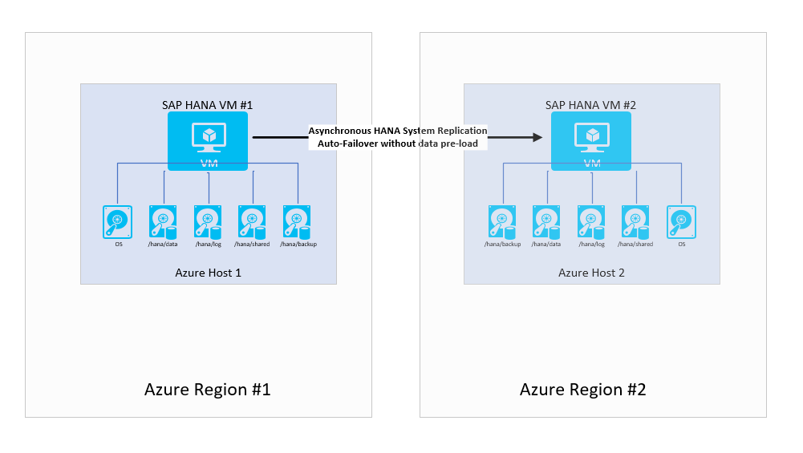
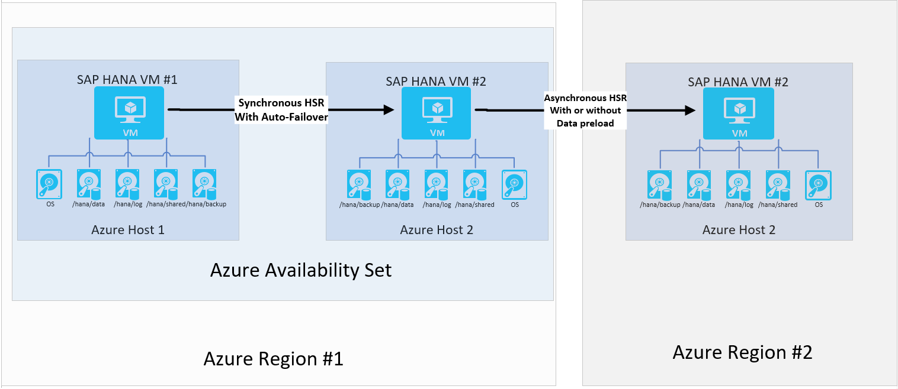

# SAP HANA Availability across Azure regions
In this article scenarios around SAP HANA availability across different Azure regions are described and discussed. Given the fact that separate Azure regions have larger distance between them, there are special considerations that are listed in this article.

## Motivation to deploy across multiple Azure regions
Different Azure regions are separated by a larger distance. Dependent on geopolitical region, this could be hundreds of miles or even several thousand miles, like in the United States. Due to the distance between the different Azure Regions, network traffic between assets deployed in two different Azure regions experiences significant network roundtrip latency. Significant enough to exclude synchronous data exchange between two SAP HANA instances under typical SAP workload. 
On the other side, you often are faced with the fact that there is defined requirement on distance between your primary datacenter and a secondary datacenter in order to provide availability in case of natural disaster hitting a wider area. Such as Hurricanes that hit the Caribbean and Florida area in September and October 2017. Or at least a minimum distance requirement. In most of the customer cases, this minimum distance definition requires you to design for availability across [Azure Regions](https://azure.microsoft.com/regions/). Since the distance is too large between two Azure regions to use synchronous replication mode of HANA, requirements of RTO and RPO might force you to deploy availability configurations within one region and then supplement with additional deployments in a second region.

Another aspect to be considered in these configurations is the failover and the client redirect. The assumption is that a failover between SAP HANA instances in two different Azure regions always is a manual failover. Since the replication mode of SAP HANA System Replication is set to asynchronous, there is a potential that data committed in the primary HANA instance has not made it yet to the secondary HANA instance. Therefore automatic failover can't be accepted for configurations where the replication is asynchronous. Even with manual controlled failover, as in a failover exercise, you need to take measures to make sure that all the committed data on the primary side made it to the secondary instance before manually moving over to the other Azure region.
 
Since you operate with a different IP address range in the Azure VNets, which are deployed in the second Azure region, the SAP HANA clients either need to be changed in their configuration or way better you need to put steps in place to change the name resolution. So, that the clients are getting redirected to the new secondary's server IP address. The SAP article on [Client Connection Recovery after Takeover](https://help.sap.com/doc/6b94445c94ae495c83a19646e7c3fd56/2.0.02/en-US/c93a723ceedc45da9a66ff47672513d3.html) goes into more details.   

## Simple availability between two Azure regions
In this scenario, you decided not to put any availability configuration in place within a single region. But you have the demand to have the workload served in case of a disaster. Typical cases for systems like that are non-production systems. Though you can sustain to have the system down for half a day or even a day, you cannot allow the system to be not available for 48 hours or more. In order to make the setup less costly, you run another system that is even less important ion the VM that functions as a destination, or you size the VM in secondary region smaller and choose not to pre-load the data. Since the failover is going to be manual and entails many more steps to failover the complete application stack as well, the additional time to bring down the VM, resize it and start the VM again, is acceptable.

> [!NOTE]
> Even without data pre-load in the HANA System Replication target, you need at least 64GB memory and beyond that enough memory to keep the rowstore data in memory of the target instance.

> [!NOTE]
> In this configuration, you can't provide an RPO=0 since your HANA System Replication mode is asynchronous. If you need to provide an RPO=0, this configuration is not the configuration of choice.

A small change on the configuration could be to configure data pre-loading. However given the manual nature of failover and the fact that application layers need to move to the second region as well, it may not make sense to pre-load data. 

## Combine Availability within one region and across regions 
A combination of availability within and across regions can be driven by:

- Requirement for RPO=0 within an Azure Region.
- Not willing or able to have global operations of the company being affected by a major natural catastrophe  that affects a larger region. As it was the case by some hurricanes that hit the Caribbean over the last few years.
- Regulations that demand distances between primary and secondary site that are clearly beyond what Azure Availability zones can provide.

 
In such cases, you would configure what SAP calls an [SAP HANA Multitier System Replication configuration](https://help.sap.com/viewer/6b94445c94ae495c83a19646e7c3fd56/2.0.02/en-US/ca6f4c62c45b4c85a109c7faf62881fc.html) with HANA System Replication. The architecture would look like:

This configuration provides an RPO=0 with small RTO times within the primary region and additionally provides descend RPO in case of a move over to the second region. The RTO times in the second region are dependent on whether you configure data pre-load or not. In many customer cases, the VM in the secondary region is used to run a test system. As a result of that usage the data can't be pre-loaded.

> [!NOTE]
> Since you are using the logreplay operation mode for HANA System Replication going from Tier 1 to Tier 2 (synchronous replication in primary region), the replication between Tier 2 and Tier 3 (replication to secondary site) can't be in delta_datashipping operation mode. Details of operation modes and some restrictions are documented by SAP in [Operation Modes for SAP HANA System Replication](https://help.sap.com/viewer/6b94445c94ae495c83a19646e7c3fd56/2.0.02/en-US/627bd11e86c84ec2b9fcdf585d24011c.html). 

## Next steps
If you need step by step guidance on how to set up such a configuration in Azure, read the articles:

- [Setup SAP HANA System Replication in Azure VMs](sap-hana-high-availability.md)
- [Your SAP on Azure – Part 4 – High Availability for SAP HANA using System Replication](https://blogs.sap.com/2018/01/08/your-sap-on-azure-part-4-high-availability-for-sap-hana-using-system-replication/)

 

 
  
