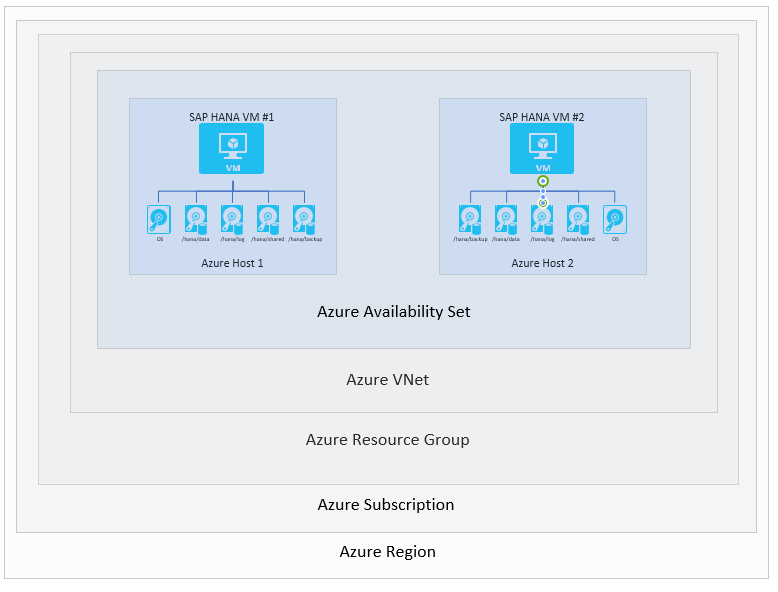
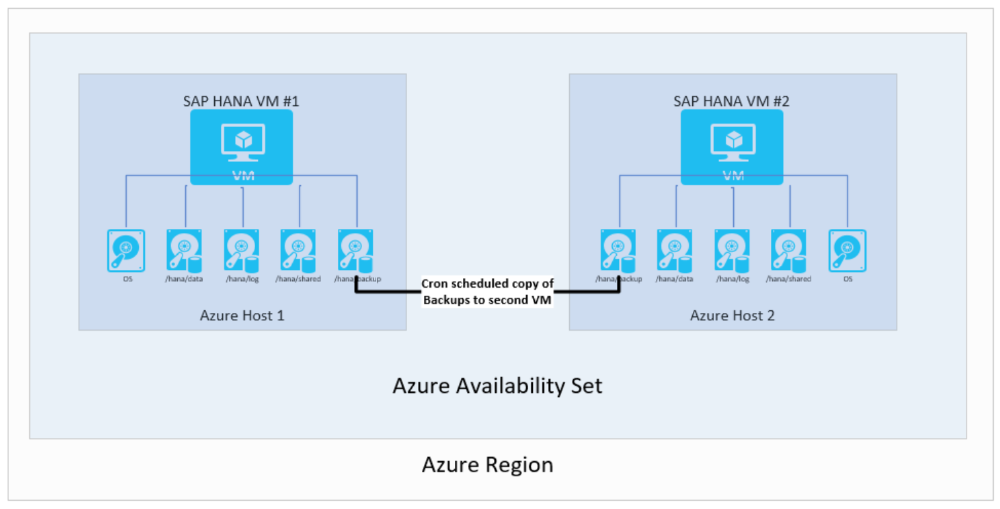
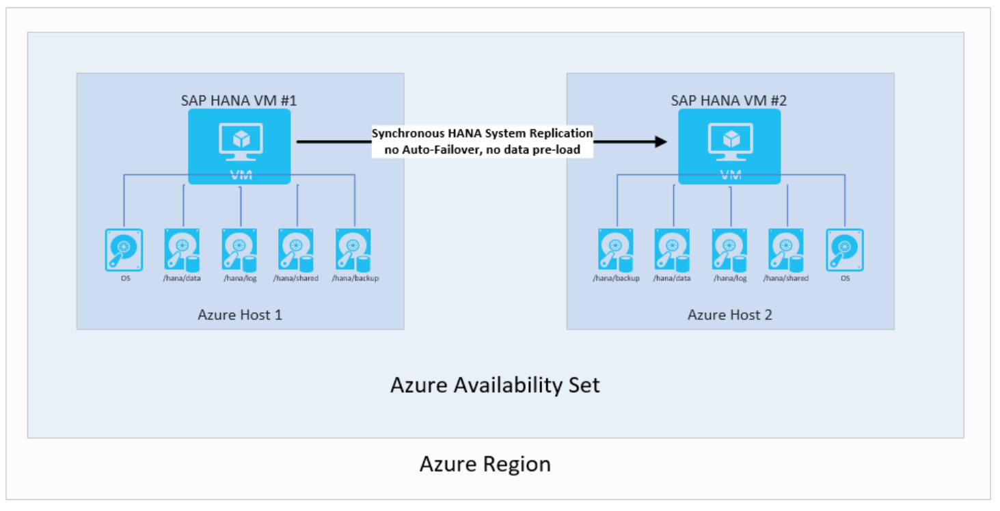
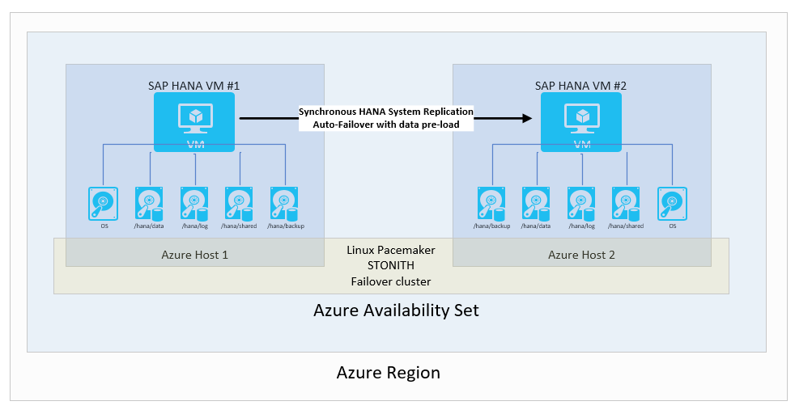

# SAP HANA Availability within one Azure region
In this section several scenarios, which describe availability scenarios within one Azure Region are presented. Azure has many regions, which are spread all over the world. For the list of Azure regions, consult the [Azure Regions](https://azure.microsoft.com/regions/) article. Deploying SAP HANA on VMs within one Azure Region, Microsoft offers the deployment of a single VM with a HANA instance. Or for increased availability you can deploy two VMs with two HANA instances within an [Azure Availability Set](https://docs.microsoft.com/azure/virtual-machines/windows/tutorial-availability-sets) that are using HANA System Replication for availability purposes. Azure has a public preview of [Azure Availability Zones](https://docs.microsoft.com/azure/availability-zones/az-overview). These Availability Zones are not going to be discussed in detail yet. Except some general thoughts around the usage of Availability Sets versus Availability Zones.

What is the difference between Azure Availability Sets and Availability Zones? For Azure Regions where Availability Zones are going to be offered, the regions have multiple data centers, which are independent in supply of power source, cooling, and network. Reason for offering different zones within a single Azure region is to enable you to deploy applications across tow or three Availability Zones offered. Assuming that issues in power sources and/or network would affect one Availability Zone infrastructure only, your application deployment within an Azure region is still fully functional. Eventually with some reduced capacity since some VMs in one zone might be lost. But VMs in the other two zones are still up and running. 
 
Whereas, an Azure Availability Set is a logical grouping capability that you can use in Azure to ensure that the VM resources you place within it are failure isolated from each other when they are deployed within an Azure datacenter. Azure ensures that the VMs you place within an Availability Set run across multiple physical servers, compute racks, storage units, and network switches. Or as in some other Azure documentation, it is referred to as placements in different [Update and Fault Domains](https://docs.microsoft.com/azure/virtual-machines/windows/manage-availability). These placements usually are within an Azure datacenter. Assuming that issues in power sources and/or network would affect the datacenter you are deployed, all your capacity in one Azure Region would be affected.

The placement of datacenters that represent Azure Availability Zones is a compromise between delivering network latency between services deployed in different zones that are acceptable for most applications and a certain distance between the datacenters. So that natural catastrophes ideally would not impact the power and network supply and infrastructure for all Availability Zones in this region. However, as monumental natural catastrophes showed, Availability Zones might not always be able to provide the availability within one region as desired. Think about hurricane Maria that hit the island of Puerto Rico on 08/20/2017 and basically caused a near 100% black-out on the 90-miles wide island.   
  

## Single VM scenario
In this scenario, you have created an Azure Virtual machine for the SAP HANA instance. You used Azure Premium Storage for hosting the operating System disk and all the data disks. The up-time SLA of 99.9% by Azure and the SLAs of other Azure components is sufficient for you to fulfill your availability SLAs towards your customers. In this scenario, you have no need to leverage an Azure Availability Set for VMs that run the DBMS layer. In this scenario you rely on two different features:

- Azure VM Auto Restart (also referenced as Azure Service Healing)
- SAP HANA Auto-Restart

Azure VM Auto Restart or 'service healing' is a functionality in Azure that works on two levels:

- Azure server host checking the health of a VM hosted on the server host
- Azure Fabric Controller monitoring the health and availability of the server host

For every VM hosted on an Azure server host, a health check functionality is monitoring the health of the hosted VM(s). In case VMs fall into a non-healthy state, a reboot of the VM can be initiated by the Azure host agent that checks the health of the VM. The Azure Fabric Controller is checking the health of the host by checking many different parameters indicating issues with the host hardware, but also checks on the accessibility of host via the network. An indication of problems with the host can lead to actions like:

- Reboot of the host and restart of the VMs that were running on the host if the host signals a bad health state
- Reboot of the host and restart of the VM(s) that were originally hosted on the host on a healthy host in case the host is not in a healthy state after the reboot. In this case, the host is going to be be marked as not healthy and not used for further deployments until cleared or replaced.
- Immediate restart of the VMs on a healthy host in cases where the unhealthy host has problems in the reboot process. 

With the host and VM monitoring provided by Azure, Azure VMs that suffer on host issues are automatically restarted on a healthy Azure host 

The second feature you rely on in such a scenario is the fact that your HANA service that runs within such a restarted VM is starting automatically after the reboot of the VM. The [HANA Service Auto-Restart](https://help.sap.com/viewer/6b94445c94ae495c83a19646e7c3fd56/2.0.01/en-US/cf10efba8bea4e81b1dc1907ecc652d3.html) can be configured through the watchdog services of the different HANA services.

This single VM scenario could get improved by adding a cold failover node to an SAP HANA configuration. Or as it is called out in the SAP HANA documentation as [Host Auto-Failover](https://help.sap.com/viewer/6b94445c94ae495c83a19646e7c3fd56/2.0.01/en-US/ae60cab98173431c97e8724856641207.html).This configuration can make sense in on-premise deployment situations where the server hardware is limited and you dedicate a single server node as Host Auto-Failover node for a set of production hosts. However for situations like Azure where the underlying infrastructure of Azure is providing a healthy target server for a successful restart of a VM, the SAP HANA Host Auto-Failover scenario does not make sense to deploy. 

As a result, we have no reference architecture that foresees a Standby node for HANA Host Auto-Failover. This also applies for SAP HANA scale-out configurations.

## Availability scenarios involving two different VMs
Using two Azure VMs within Azure Availability Sets enable you to increase the up-time between these two VMs if those VMS are placed in an Azure Availability Set within one Azure region. The base setup in Azure would look like the graphics shown here:

In order to illustrate the different availability scenarios, a few of the layers above are cut and the graphics limited to the layers of VMs, hosts, Availability Sets and Azure Regions. Azure VNets, Resource Groups, and subscriptions don't play a role for the scenarios described.

### Replicating backups to second virtual machine
One of the most rudimentary setups is to have backups, especially transaction log backups shipped from one VM to another Azure Virtual machine. You have the choice of any Azure Storage type. You would be responsible for scripting the copy of scheduled backups conducted on the first VM to the second VM. In case of using requiring the instances of the second VM, you would need to restore the full, incremental/differential, and transaction log backups to the point you need. 
The architecture would look like:
 

This setup is not too suitable for achieving great RPO and RTO times. Especially RTO times would suffer due to the need of fully restoring the complete database with the copied backups. However this setup is usable to recover from unintended data deletion on the main instances. with such a setup you are able at any time to restore to a certain point in time, extract the data, and import the deleted data into your main instance. Hence it can make sense to use such backup copy method in combination with other high availability functionality. During the time when just the backups are copied, you might get along with a smaller VM than the main SAP HANA instances is running in. But keep in mind that smaller VMs have lower number of VHDs that can be attached. Check [Sizes for Linux virtual machines in Azure](https://docs.microsoft.com/azure/virtual-machines/linux/sizes) for limits of individual VM types.

### Using SAP HANA System Replication without automatic failover
For the following scenarios, you are using SAP HANA System replication. SAP issued documentation can be found starting with the article [System Replication](https://help.sap.com/viewer/6b94445c94ae495c83a19646e7c3fd56/2.0.01/en-US/b74e16a9e09541749a745f41246a065e.html). Between two Azure VMs in a single Azure region there are two different configurations that have some differences in the Recovery Time Objective. In general, the scenarios with not having automatic failover might not be too relevant for scenarios within one Azure region. Reason for that is that in most failure situations in Azure infrastructure, the Azure Service healing is going to restart the primary VM on another host. There are only some edge cases where such a configuration might help in terms of failure scenarios. Or some cases you as a customer want to realize, especially around efficiency.

#### Using HANA System Replication without auto failover and without data pre-load 
This is a scenario where you use SAP HANA System Replication for the purpose of moving data in a synchronous manner to achieve a Recovery Point Objective (RPO) of 0. On the other side, you have a long enough Recovery Time Objective (RTO), so, that you don't need either failover or pre-load of the data into the HANA instance cache. In such a case, you have the possibilities to drive further economics into your configuration by:

- You can run another SAP HANA instance in the second VM that takes most of the memory of the virtual machine. Usually such an instance would be an instance that in case of a fail-over to the second VM could be shut down. So, that the replicated data can be loaded into the cache of the targeted HANA instance in the second VM.
- You could use a smaller VM size as the second VM. In case of a failover, you'd have a step before the manual failover where you would resize the VM to the size of the source VM. The scenario looks like:

> [!NOTE]
> Even without data pre-load in the HANA System Replication target, you need at least 64GB memory and beyond that enough memory to keep the rowstore data in memory of the target instance.

#### Using HANA System Replication without auto failover and with data pre-load
The difference to the scenario introduced before is that the data, which gets replicated to the HANA Instance in the second VM is pre-loaded. This would eliminate the two advantages you can have with the scenario of not pre-loading data. In this case, you can't run another SAP HANA system on the second VM. Nor could you use a smaller VM size. Hence, this is a scenario hardly implemented with customers

### Using SAP HANA System Replication with automatic failover

The standard availability configuration within one Azure region, most customers are implementing with SAP HANA, is a configuration where the two Azure virtual machines running SLES Linux have a failover cluster defined. The Linux cluster of SLES is based on the [Pacemaker](http://www.linux-ha.org/wiki/Pacemaker) framework in conjunction with a [STONITH](http://linux-ha.org/wiki/STONITH) device. 
From an SAP HANA perspective, the replication mode used is synchronized and an automatic failover is configured. In the second VM, the SAP HANA instance acts as a hot standby node, which receives a synchronous stream of change records from the primary SAP HANA instance. As transactions get committed by the application at the HANA primary node, the primary HANA node waits to confirm the commit to the application until the secondary SAP HANA node confirmed having received the commit record. SAP HANA two different synchronous replication modes. For details and differences on these two synchronous replication modes, read the article [Replication modes for SAP HANA System Replication](https://help.sap.com/viewer/6b94445c94ae495c83a19646e7c3fd56/2.0.02/en-US/c039a1a5b8824ecfa754b55e0caffc01.html)

The overall configuration looks like

This solution is chosen because it enables you to achieve an RPO=0 and an extreme low RTO times. Configure the SAP HANA client connectivity in a way that the SAP HANA clients use the virtual IP address to connect to the HANA System Replication configuration. This eliminates a need to reconfigure the application in case of a failover to the secondary node. In this solution, the Azure VM SKUs for the primary or secondary need to be the same.  

## Next Steps
If you need step by step guidance on how to set up such a configuration in Azure, read the articles:

- [Setup SAP HANA System Replication in Azure VMs](sap-hana-high-availability.md)
- [Your SAP on Azure – Part 4 – High Availability for SAP HANA using System Replication](https://blogs.sap.com/2018/01/08/your-sap-on-azure-part-4-high-availability-for-sap-hana-using-system-replication/)

If you need more information on SAP HANA availability across Azure regions, read:

- [SAP HANA Availability across Azure regions](https://docs.microsoft.com/en-us/azure/virtual-machines/workloads/sap/sap-hana-availability-across-regions) 

