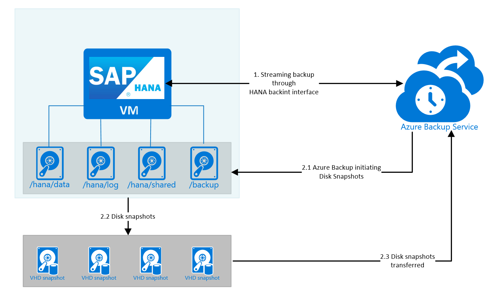
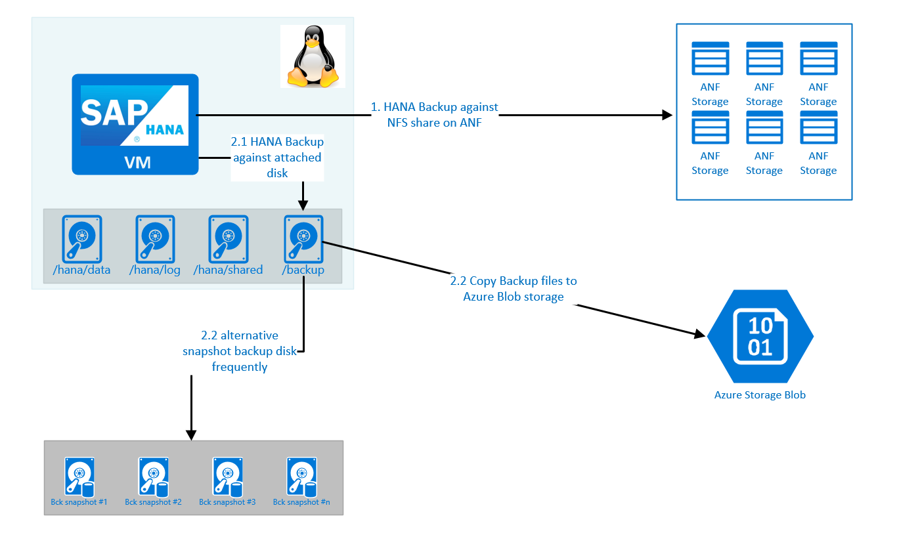

# Backup guide for SAP HANA on Azure Virtual Machines

## Getting Started

The backup guide for SAP HANA running on Azure virtual Machines will only describe Azure-specific topics. For general SAP HANA backup related items, check the SAP HANA documentation. We expect you to be familiar with principle database backup strategies, the reasons, and motivations to have a sound and valid backup strategy, and are aware of the requirements your company has for the backup procedure, retention period of backups and restore procedure.

SAP HANA is officially supported on various Azure VM types, like Azure M-Series. For a complete list of SAP HANA certified Azure VMs and HANA Large Instance units, check out [Find Certified IaaS Platforms](https://www.sap.com/dmc/exp/2014-09-02-hana-hardware/enEN/iaas.html#categories=Microsoft%20Azure). Microsoft Azure offers a number of units where SAP HANA runs non-virtualized on physical servers. This service is called [HANA Large Instances](hana-overview-architecture.md). This guide will not cover backup processes and tools for HANA Large Instances. But is going to be limited to Azure virtual machines. For details about backup/restore processes with HANA Large Instances, read the article [HLI Backup and Restore](https://docs.microsoft.com/azure/virtual-machines/workloads/sap/hana-backup-restore).

The focus of this article is on three backup possibilities for SAP HANA on Azure virtual machines:

- HANA backup through [Azure Backup Services](https://docs.microsoft.com/azure/backup/backup-overview) 
- HANA backup to the file system in an Azure Linux Virtual Machine (see [SAP HANA Azure Backup on file level](sap-hana-backup-file-level.md))
- HANA backup based on storage snapshots using the Azure storage blob snapshot feature manually or Azure Backup service

SAP HANA offers a backup API, which allows third-party backup tools to integrate directly with SAP HANA. Products like Azure Backup service, or [Commvault](https://azure.microsoft.com/resources/protecting-sap-hana-in-azure/) are using this proprietary interface to trigger SAP HANA database or redo log backups. 

Information on how you can find what SAP software is supported on Azure can be found in the article [What SAP software is supported for Azure deployments](https://docs.microsoft.com/azure/virtual-machines/workloads/sap/sap-supported-product-on-azure).

## Azure Backup Service

The first scenario shown is a scenario where Azure Backup Service is either using the SAP HANA `backint` interface to perform a streaming backup with from an SAP HANA database. Or you use a more generic capability of Azure Backup service to create an application consistent disk snapshot and have that one transferred to the Azure Backup service.

Azure Backup integrates and is certified as backup solution for SAP HANA using the proprietary SAP HANA interface called [backint](https://www.sap.com/dmc/exp/2013_09_adpd/enEN/#/d/solutions?id=8f3fd455-a2d7-4086-aa28-51d8870acaa5). For more details of the solution, its capabilities and the Azure regions where it is available, read the article [Support matrix for backup of SAP HANA databases on Azure VMs](https://docs.microsoft.com/azure/backup/sap-hana-backup-support-matrix#scenario-support). For details and principles about Azure Backup service for HANA, read the article [About SAP HANA database backup in Azure VMs](https://docs.microsoft.com/azure/backup/sap-hana-db-about). 

The second possibility to leverage Azure Backup service is to create an application consistent backup using disk snapshots of Azure Premium Storage. Other HANA certified Azure storages, like [Azure Ultra disk](https://docs.microsoft.com/azure/virtual-machines/linux/disks-enable-ultra-ssd) and [Azure NetApp Files](https://azure.microsoft.com/services/netapp/) are not supporting this kind of snapshot through Azure Backup service. Reading these articles:

- [Plan your VM backup infrastructure in Azure](https://docs.microsoft.com/azure/backup/backup-azure-vms-introduction)
- [Application-consistent backup of Azure Linux VMs](https://docs.microsoft.com/azure/backup/backup-azure-linux-app-consistent) 

this sequence of activity emerges:

- Azure Backup needs to execute a pre-snapshot script that puts the application, in this case SAP HANA, in a consistent state
- As this consistent state is confirmed, Azure Backup will execute the disk snapshots
- After finishing the snapshots, Azure Backup will undo the activity it did in the pre-snapshot script
- After successful execution, Azure Backup will stream the data into the Backup vault

In case of SAP HANA, most customers are using Azure Write Accelerator for the volumes that contain the SAP HANA redo log. Azure Backup service will automatically exclude these volumes from the snapshots. This exclusion does not harm the ability of HANA to restore. Though it would block the ability to restore with nearly all other SAP supported DBMS.

The downside of this possibility is the fact that you need to develop your own pre- and post-snapshot script. The pre-snapshot script needs to create a HANA snapshot and handle eventual exception cases. Whereas the post-snapshot script needs to delete the HANA snapshot again. For more details on the logic required, start with [SAP support note #2039883](https://launchpad.support.sap.com/#/notes/2039883). The considerations of the section 'SAP HANA data consistency when taking storage snapshots' in this article do fully apply to this kind of backup.

> [!NOTE]
> Disk snapshot based backups for SAP HANA in deployments where multiple database containers are used, require a minimum release of HANA 2.0 SP04
> 

See details about storage snapshots later in this document.

## Other HANA backup methods
There are three other backup methods or paths that can be considered:

- Backing up against an NFS share that is based on Azure NetApp Files (ANF). ANF again has the ability to create snapshots of those volumes you store backups on. Given the throughput that you eventually require to write the backups, this solution could become an expensive method. Though easy to establish since HANA can write the backups directly into the Azure native NFS share
- Executing the HANA Backup against VM attached disks of Standard SSD or Azure Premium Storage. As next step you can copy those backup files against Azure Blob storage. This strategy might be price wise attractive
- Executing the HANA Backup against VM attached disks of Standard SSD or Azure Premium Storage. As next step the disk gets snapshotted on a regular basis. After the first snapshot, incremental snapshots can be used to reduce costs

This figure shows options for taking an SAP HANA file backup inside the VM, and then storing it HANA backup files somewhere else using different tools. However, all solutions not involving a third-party backup service or Azure Backup service have several hurdles in common. Some of them can be listed, like retention administration, automatic restore process and providing automatic point-in-time recovery as Azure Backup service or other specialized third-party backup suites and services provide. Many of those third-party services being able to run on Azure. 

## SAP resources for HANA backup

### SAP HANA backup documentation

- [Introduction to SAP HANA Administration](https://help.sap.com/viewer/6b94445c94ae495c83a19646e7c3fd56/2.0.00/en-US)
- [Planning Your Backup and Recovery Strategy](https://help.sap.com/saphelp_hanaplatform/helpdata/en/ef/085cd5949c40b788bba8fd3c65743e/content.htm)
- [Schedule HANA Backup using ABAP DBACOCKPIT](https://www.hanatutorials.com/p/schedule-hana-backup-using-abap.html)
- [Schedule Data Backups (SAP HANA Cockpit)](https://help.sap.com/saphelp_hanaplatform/helpdata/en/6d/385fa14ef64a6bab2c97a3d3e40292/frameset.htm)
- FAQ about SAP HANA backup in [SAP Note 1642148](https://launchpad.support.sap.com/#/notes/1642148)
- FAQ about SAP HANA database and storage snapshots in [SAP Note 2039883](https://launchpad.support.sap.com/#/notes/2039883)
- Unsuitable network file systems for backup and recovery in [SAP Note 1820529](https://launchpad.support.sap.com/#/notes/1820529)

### How to verify correctness of SAP HANA backup
Independent of your backup method, running a test restore against a different system is an absolute necessity. This approach provides a way to ensure that a backup is correct, and internal processes for backup and restore work as expected. While restoring backups could be a hurdle on-premises due to its infrastructure requirement, it is much easier to accomplish in the cloud by providing necessary resources temporarily for this purpose. It is correct that there are tools provided with HANA that can check backup files on ability to restore. However, the purpose of frequent restore exercises is to test the process of a database restore and train that process with the operations staff.

Keep in mind that doing a simple restore and checking if HANA is up and running is not sufficient. You should run a table consistency check to be sure that the restored database is fine. SAP HANA offers several kinds of consistency checks described in [SAP Note 1977584](https://launchpad.support.sap.com/#/notes/1977584).

Information about the table consistency check can also be found on the SAP website at [Table and Catalog Consistency Checks](https://help.sap.com/saphelp_hanaplatform/helpdata/en/25/84ec2e324d44529edc8221956359ea/content.htm#loio9357bf52c7324bee9567dca417ad9f8b).

### Pros and cons of HANA backup versus storage snapshot

SAP doesn&#39;t give preference to either HANA backup versus storage snapshot. It lists their pros and cons, so one can determine which to use depending on the situation and available storage technology (see [Planning Your Backup and Recovery Strategy](https://help.sap.com/saphelp_hanaplatform/helpdata/en/ef/085cd5949c40b788bba8fd3c65743e/content.htm)).

On Azure, be aware of the fact that the Azure blob snapshot feature doesn&#39;t provide file system consistency across multiple disks (see [Using blob snapshots with PowerShell](https://blogs.msdn.microsoft.com/cie/2016/05/17/using-blob-snapshots-with-powershell/)). 

In addition, one has to understand the billing implications when working frequently with blob snapshots as described in this article: [Understanding How Snapshots Accrue Charges](/rest/api/storageservices/understanding-how-snapshots-accrue-charges)—it isn&#39;t as obvious as using Azure virtual disks.

### SAP HANA data consistency when taking storage snapshots

As documented earlier, describing the snapshot backup capabilities of Azure Backup, file system and application consistency is mandatory when taking storage snapshots. The easiest way to avoid problems would be to shut down SAP HANA, or maybe even the whole virtual machine. Something that is not feasible for a production instance.

> [!NOTE]
> Disk snapshot based backups for SAP HANA in deployments where multiple database containers are used, require a minimum release of HANA 2.0 SP04
> 

Azure storage, does not provide file system consistency across multiple disks or volumes that are attached to a VM during the snapshot process. That means the application consistency during the snapshot needs to be delivered by the application, in this case SAP HANA itself. [SAP Note 2039883](https://launchpad.support.sap.com/#/notes/2039883) has important information about SAP HANA backups by storage snapshots. For example, with XFS file systems, it is necessary to run **xfs\_freeze** before starting a storage snapshot to provide application consistency (see [xfs\_freeze(8) - Linux man page](https://linux.die.net/man/8/xfs_freeze) for details on **xfs\_freeze**).

Assuming there is an XFS file system spanning four Azure virtual disks, the following steps provide a consistent snapshot that represents the HANA data area:

1. Create HANA data snapshot prepare
1. Freeze the file systems of all disks/volumes (for example, use **xfs\_freeze**)
1. Create all necessary blob snapshots on Azure
1. Unfreeze the file system
1. Confirm the HANA data snapshot (will delete the snapshot)

When using the Azure Backup's capability to perform application consistent snapshot backups, steps #1 need to be coded/scripted by you in for the pre-snapshot script. Azure Backup service will execute steps #2 and #3. Steps #4 and #5 need to be again provided by your code in the post-snapshot script. If you are not using Azure backup service, you also need to code/script step #2 and #3 on your own.
More information on creating HANA data snapshots can be found in these articles:

- [HANA data snapshots](https://help.sap.com/viewer/6b94445c94ae495c83a19646e7c3fd56/2.0.04/en-US/ac114d4b34d542b99bc390b34f8ef375.html
- More details to perform step #1 can be found in article [Create a Data Snapshot (Native SQL)](https://help.sap.com/viewer/6b94445c94ae495c83a19646e7c3fd56/2.0.04/en-US/9fd1c8bb3b60455caa93b7491ae6d830.html) 
- Details to confirm/delete HANA data snapshots as need in step #5 can be found in the article [Create a Data Snapshot (Native SQL)](https://help.sap.com/viewer/6b94445c94ae495c83a19646e7c3fd56/2.0.04/en-US/9fd1c8bb3b60455caa93b7491ae6d830.html) 

It is important to confirm the HANA snapshot. Due to the &quot;Copy-on-Write,&quot; SAP HANA might not require additional disk space while in this snapshot-prepare mode. It&#39;s also not possible to start new backups until the SAP HANA snapshot is confirmed.

### SAP HANA backup scheduling strategy

The SAP HANA article [Planning Your Backup and Recovery Strategy](https://help.sap.com/saphelp_hanaplatform/helpdata/en/ef/085cd5949c40b788bba8fd3c65743e/content.htm) states a basic plan to do backups. Rely on SAP documentation around HANA and your experiences with other DBMS in defining the backup/restore strategy and process for SAP HANA. The sequence of different types of backups, and the retention period are highly dependent on the SLAs you need to provide.

### SAP HANA backup encryption

SAP HANA offers encryption of data and log. If SAP HANA data and log are not encrypted, then the backups are not encrypted by default. However, SAP HANA offers a separate backup encryption as documented in [SAP HANA Backup Encryption](https://help.sap.com/viewer/6b94445c94ae495c83a19646e7c3fd56/2.0.03/en-US/5f837a57ce5e468d9db21c8683bc84da.html). If you are running older releases of SAP HANA, you might need to check whether backup encryption was part of the functionality provided already.  

## Next steps
* [SAP HANA Azure Backup on file level](sap-hana-backup-file-level.md) describes the file-based backup option.
* To learn how to establish high availability and plan for disaster recovery of SAP HANA on Azure (large instances), see [SAP HANA (large instances) high availability and disaster recovery on Azure](hana-overview-high-availability-disaster-recovery.md).
