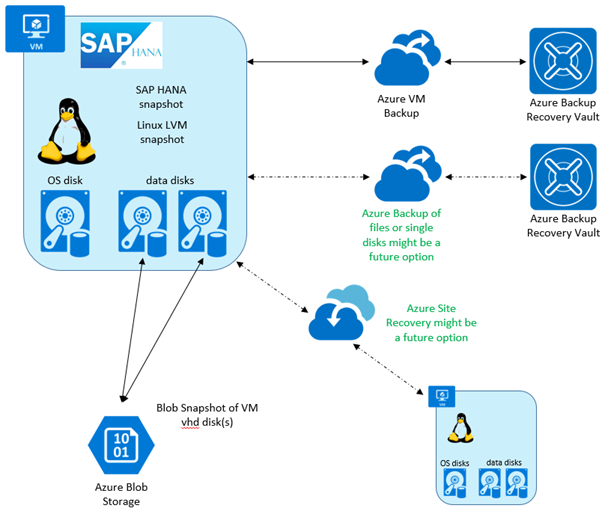
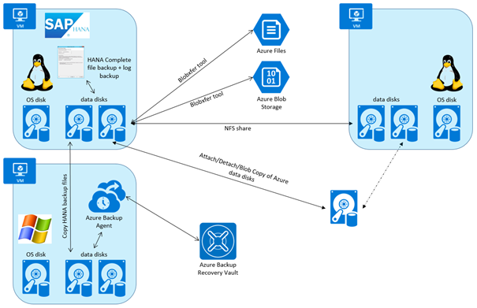
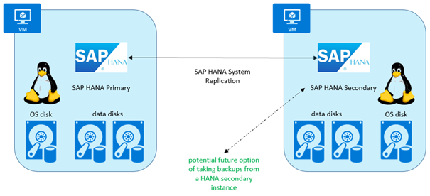
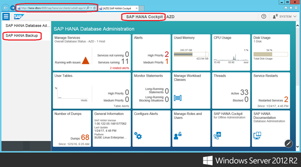
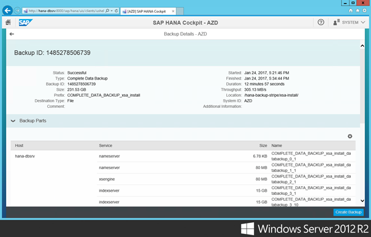
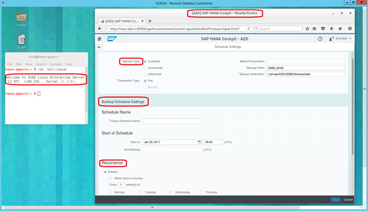
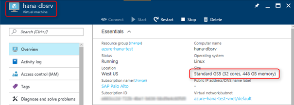
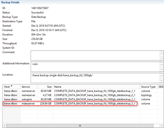
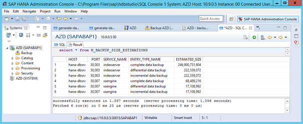
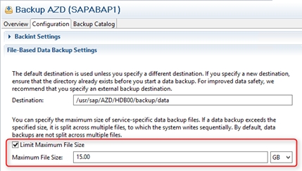

# Backup guide for SAP HANA on Azure Virtual Machines

## Getting Started

The backup guide for SAP HANA running on Azure virtual Machines will only describe Azure-specific topics. For general SAP HANA backup related items, check the SAP HANA documentation (see _SAP HANA backup documentation_ later in this article).

The focus of this article is on two major backup possibilities for SAP HANA on Azure virtual machines:

- HANA backup to the file system in an Azure Linux Virtual Machine (see [SAP HANA Azure Backup on file level](sap-hana-backup-file-level.md))
- HANA backup based on storage snapshots using the Azure storage blob snapshot feature manually or Azure Backup Service (see [SAP HANA backup based on storage snapshots](sap-hana-backup-storage-snapshots.md))

SAP HANA offers a backup API, which allows third-party backup tools to integrate directly with SAP HANA. (That is not within the scope of this guide.) There is no direct integration of SAP HANA with Azure Backup service available right now based on this API.

SAP HANA is officially supported on various Azure VM types, like Azure M-Series. For a complete list of SAP HANA certified Azure VMs, check out [Find Certified IaaS Platforms](https://www.sap.com/dmc/exp/2014-09-02-hana-hardware/enEN/iaas.html#categories=Microsoft%20Azure). This article will be updated as new offerings for SAP HANA on Azure become available.

There is also an SAP HANA hybrid solution available on Azure, where SAP HANA runs non-virtualized on physical servers. However, this SAP HANA Azure backup guide covers a pure Azure environment where SAP HANA runs in an Azure VM, not SAP HANA running on &quot;large instances.&quot; See [SAP HANA (large instances) overview and architecture on Azure](hana-overview-architecture.md) for more information about this backup solution on &quot;large instances&quot; based on storage snapshots.

General information about SAP products supported on Azure can be found in [SAP Note 1928533](https://launchpad.support.sap.com/#/notes/1928533).

The following three figures give an overview of the SAP HANA backup options using native Azure capabilities currently, and also show three potential future backup scenarios. The related articles [SAP HANA Azure Backup on file level](sap-hana-backup-file-level.md) and [SAP HANA backup based on storage snapshots](sap-hana-backup-storage-snapshots.md) describe these options in more detail, including size and performance considerations for SAP HANA backups that are multi-terabytes in size.

This figure shows the possibility of saving the current VM state, either via Azure Backup service or manual snapshot of VM disks. With this approach, one doesn&#39;t have to manage SAP HANA backups. The challenge of the disk snapshot scenario is file system consistency, and an application-consistent disk state. The consistency topic is discussed in the section _SAP HANA data consistency when taking storage snapshots_ later in this article. Capabilities and restrictions of Azure Backup service related to SAP HANA backups are also discussed later in this article.

This figure shows options for taking an SAP HANA file backup inside the VM, and then storing it HANA backup files somewhere else using different tools. Taking a HANA backup requires more time than a snapshot-based backup solution, but it has advantages regarding integrity and consistency. More details are provided later in this article.

This figure shows a potential future SAP HANA backup scenario. If SAP HANA allowed taking backups from a replication secondary, it would add additional options for backup strategies. Currently it isn't possible according to a post in the SAP HANA Wiki:

_&quot;Is it possible to take backups on the secondary side?_

_No, currently you can only take data and log backups on the primary side. If automatic log backup
is enabled, after takeover to the secondary side, the log backups will automatically be written there.&quot;_

## SAP resources for HANA backup

### SAP HANA backup documentation

- [Introduction to SAP HANA Administration](https://help.sap.com/viewer/6b94445c94ae495c83a19646e7c3fd56/2.0.00/en-US)
- [Planning Your Backup and Recovery Strategy](https://help.sap.com/saphelp_hanaplatform/helpdata/en/ef/085cd5949c40b788bba8fd3c65743e/content.htm)
- [Schedule HANA Backup using ABAP DBACOCKPIT](https://www.hanatutorials.com/p/schedule-hana-backup-using-abap.html)
- [Schedule Data Backups (SAP HANA Cockpit)](https://help.sap.com/saphelp_hanaplatform/helpdata/en/6d/385fa14ef64a6bab2c97a3d3e40292/frameset.htm)
- FAQ about SAP HANA backup in [SAP Note 1642148](https://launchpad.support.sap.com/#/notes/1642148)
- FAQ about SAP HANA database and storage snapshots in [SAP Note 2039883](https://launchpad.support.sap.com/#/notes/2039883)
- Unsuitable network file systems for backup and recovery in [SAP Note 1820529](https://launchpad.support.sap.com/#/notes/1820529)

### Why SAP HANA backup?

Azure storage offers availability and reliability out of the box (see [Introduction to Microsoft Azure Storage](../../../storage/common/storage-introduction.md) for more information about Azure storage).

The minimum for &quot;backup&quot; is to rely on the Azure SLAs, keeping the SAP HANA data and log files on Azure VHDs attached to the SAP HANA server VM. This approach covers VM failures, but not potential damage to the SAP HANA data and log files, or logical errors like deleting data or files by accident. Backups are also required for compliance or legal reasons. In short, there is always a need for SAP HANA backups.

### How to verify correctness of SAP HANA backup
When using storage snapshots, running a test restore on a different system is recommended. This approach provides a way to ensure that a backup is correct, and internal processes for backup and restore work as expected. While this is a significant hurdle on-premises, it is much easier to accomplish in the cloud by providing necessary resources temporarily for this purpose.

Keep in mind that doing a simple restore and checking if HANA is up and running is not sufficient. Ideally, one should run a table consistency check to be sure that the restored database is fine. SAP HANA offers several kinds of consistency checks described in [SAP Note 1977584](https://launchpad.support.sap.com/#/notes/1977584).

Information about the table consistency check can also be found on the SAP website at [Table and Catalog Consistency Checks](https://help.sap.com/saphelp_hanaplatform/helpdata/en/25/84ec2e324d44529edc8221956359ea/content.htm#loio9357bf52c7324bee9567dca417ad9f8b).

For standard file backups, a test restore is not necessary. There are two SAP HANA tools that help to check which backup can be used for restore: hdbbackupdiag and hdbbackupcheck. See [Manually Checking Whether a Recovery is Possible](https://help.sap.com/saphelp_hanaplatform/helpdata/en/77/522ef1e3cb4d799bab33e0aeb9c93b/content.htm) for more information about these tools.

### Pros and cons of HANA backup versus storage snapshot

SAP doesn&#39;t give preference to either HANA backup versus storage snapshot. It lists their pros and cons, so one can determine which to use depending on the situation and available storage technology (see [Planning Your Backup and Recovery Strategy](https://help.sap.com/saphelp_hanaplatform/helpdata/en/ef/085cd5949c40b788bba8fd3c65743e/content.htm)).

On Azure, be aware of the fact that the Azure blob snapshot feature doesn&#39;t guarantee file system consistency (see [Using blob snapshots with PowerShell](https://blogs.msdn.microsoft.com/cie/2016/05/17/using-blob-snapshots-with-powershell/)). The next section, _SAP HANA data consistency when taking storage snapshots_, discusses some considerations regarding this feature.

In addition, one has to understand the billing implications when working frequently with blob snapshots as described in this article: [Understanding How Snapshots Accrue Charges](/rest/api/storageservices/understanding-how-snapshots-accrue-charges)—it isn&#39;t as obvious as using Azure virtual disks.

### SAP HANA data consistency when taking storage snapshots

File system and application consistency is a complex issue when taking storage snapshots. The easiest way to avoid problems would be to shut down SAP HANA, or maybe even the whole virtual machine. A shutdown might be doable with a demo or prototype, or even a development system, but it is not an option for a production system.

On Azure, one has to keep in mind that the Azure blob snapshot feature doesn&#39;t guarantee file system consistency. It works fine however by using the SAP HANA snapshot feature, as long as there is only a single virtual disk involved. But even with a single disk, additional items have to be checked. [SAP Note 2039883](https://launchpad.support.sap.com/#/notes/2039883) has important information about SAP HANA backups via storage snapshots. For example, it mentions that, with the XFS file system, it is necessary to run **xfs\_freeze** before starting a storage snapshot to guarantee consistency (see [xfs\_freeze(8) - Linux man page](https://linux.die.net/man/8/xfs_freeze) for details on **xfs\_freeze**).

The topic of consistency becomes even more challenging in a case where a single file system spans multiple disks/volumes. For example, by using mdadm or LVM and striping. The SAP Note mentioned above states:

_&quot;But keep in mind that the storage system has to guarantee I/O consistency while creating a storage snapshot per SAP HANA data volume, i.e. snapshotting of an SAP HANA service-specific data volume must be an atomic operation.&quot;_

Assuming there is an XFS file system spanning four Azure virtual disks, the following steps provide a consistent snapshot that represents the HANA data area:

- HANA snapshot prepare
- Freeze the file system (for example, use **xfs\_freeze**)
- Create all necessary blob snapshots on Azure
- Unfreeze the file system
- Confirm the HANA snapshot

Recommendation is to use the procedure above in all cases to be on the safe side, no matter which file system. Or if it is a single disk or striping, via mdadm or LVM across multiple disks.

It is important to confirm the HANA snapshot. Due to the &quot;Copy-on-Write,&quot; SAP HANA might not require additional disk space while in this snapshot-prepare mode. It&#39;s also not possible to start new backups until the SAP HANA snapshot is confirmed.

Azure Backup service uses Azure VM extensions to take care of the file system consistency. These VM extensions are not available for standalone usage. One still has to manage SAP HANA consistency. See the related article [SAP HANA Azure Backup on file level](sap-hana-backup-file-level.md) for more information.

### SAP HANA backup scheduling strategy

The SAP HANA article [Planning Your Backup and Recovery Strategy](https://help.sap.com/saphelp_hanaplatform/helpdata/en/ef/085cd5949c40b788bba8fd3c65743e/content.htm) states a basic plan to do backups:

- Storage snapshot (daily)
- Complete data backup using file or bacint format (once a week)
- Automatic log backups

Optionally, one could go completely without storage snapshots; they could be replaced by HANA delta backups, like incremental or differential backups (see [Delta Backups](https://help.sap.com/saphelp_hanaplatform/helpdata/en/c3/bb7e33bb571014a03eeabba4e37541/content.htm)).

The HANA Administration guide provides an example list. It suggests that one recover SAP HANA to a specific point in time using the following sequence of backups:

1. Full data backup
2. Differential backup
3. Incremental backup 1
4. Incremental backup 2
5. Log backups

Regarding an exact schedule as to when and how often a specific backup type should happen, it is not possible to give a general guideline—it is too customer-specific, and depends on how many data changes occur in the system. One basic recommendation from SAP side, which can be seen as general guidance, is to make one full HANA backup once a week.
Regarding log backups, see the SAP HANA documentation [Log Backups](https://help.sap.com/saphelp_hanaplatform/helpdata/en/c3/bb7e33bb571014a03eeabba4e37541/content.htm).

SAP also recommends doing some housekeeping of the backup catalog to keep it from growing infinitely (see [Housekeeping for Backup Catalog and Backup Storage](https://help.sap.com/saphelp_hanaplatform/helpdata/en/ca/c903c28b0e4301b39814ef41dbf568/content.htm)).

### SAP HANA configuration files

As stated in the FAQ in [SAP Note 1642148](https://launchpad.support.sap.com/#/notes/1642148), the SAP HANA configuration files are not part of a standard HANA backup. They are not essential to restore a system. The HANA configuration could be changed manually after the restore. In case one would like to get the same custom configuration during the restore process, it is necessary to back up the HANA configuration files separately.

If standard HANA backups are going to a dedicated HANA backup file system, one could also copy the configuration files to the same backup filesystem, and then copy everything together to the final storage destination like cool blob storage.

### SAP HANA Cockpit

SAP HANA Cockpit offers the possibility of monitoring and managing SAP HANA via a browser. It also allows handling of SAP HANA backups, and therefore can be used as an alternative to SAP HANA Studio and ABAP DBACOCKPIT (see [SAP HANA Cockpit](https://help.sap.com/saphelp_hanaplatform/helpdata/en/73/c37822444344f3973e0e976b77958e/content.htm) for more information).

This figure shows the SAP HANA Cockpit Database Administration Screen, and the backup tile on the left. Seeing the backup tile requires appropriate user permissions for login account.

Backups can be monitored in SAP HANA Cockpit while they are ongoing and, once it is finished, all the backup details are available.

The previous screenshots were made from an Azure Windows VM. This one is an example using Firefox on an Azure SLES 12 VM with Gnome desktop. It shows the option to define SAP HANA backup schedules in SAP HANA Cockpit. As one can also see, it suggests date/time as a prefix for the backup files. In SAP HANA Studio, the default prefix is &quot;COMPLETE\_DATA\_BACKUP&quot; when doing a full file backup. Using a unique prefix is recommended.

### SAP HANA backup encryption

SAP HANA offers encryption of data and log. If SAP HANA data and log are not encrypted, then the backups are also not encrypted. It is up to the customer to use some form of third-party solution to encrypt the SAP HANA backups. See [Data and Log Volume Encryption](https://help.sap.com/saphelp_hanaplatform/helpdata/en/dc/01f36fbb5710148b668201a6e95cf2/content.htm) to find out more about SAP HANA encryption.

On Microsoft Azure, a customer could use the IaaS VM encryption feature to encrypt. For example, one could use dedicated data disks attached to the VM, which are used to store SAP HANA backups, then make copies of these disks.

Azure Backup service can handle encrypted VMs/disks (see [How to back up and restore encrypted virtual machines with Azure Backup](../../../backup/backup-azure-vms-encryption.md)).

Another option would be to maintain the SAP HANA VM and its disks without encryption, and store the SAP HANA backup files in a storage account for which encryption was enabled (see [Azure Storage Service Encryption for Data at Rest](../../../storage/common/storage-service-encryption.md)).

## Test setup

### Test Virtual Machine on Azure

In order to perform our tests, an SAP HANA installation in an Azure GS5 VM was used for the following backup/restore tests. The principles are the same as for M-Series VMs.

This figure shows part of the Azure portal overview for the HANA test VM.

### Test backup size

A dummy table was filled up with data to get a total data backup size of over 200 GB to derive realistic performance data. The figure was taken from the backup console in HANA Studio and shows the backup file size of 229 GB for the HANA index server. For the tests, the default backup prefix "COMPLETE_DATA_BACKUP" in SAP HANA Studio was used. In real production systems, a more useful prefix should be defined. SAP HANA Cockpit suggests date/time.

### Test tool to copy files directly to Azure storage

To transfer SAP HANA backup files directly to Azure blob storage, or Azure file shares, the blobxfer tool was used because it supports both targets and it can be easily integrated into automation scripts due to its command-line interface. The blobxfer tool is available on [GitHub](https://github.com/Azure/blobxfer).

### Test backup size estimation

It is important to estimate the backup size of SAP HANA. This estimate helps to improve performance by defining the max backup file size for a number of backup files, due to parallelism during a file copy. (Those details are explained later in this article.) One must also decide whether to do a full backup or a delta backup (incremental or differential).

Fortunately, there is a simple SQL statement that estimates the size of the backup files: **select \* from M\_BACKUP\_SIZE\_ESTIMATIONS** (see [Estimate the Space Needed in the File System for a Data Backup](https://help.sap.com/saphelp_hanaplatform/helpdata/en/7d/46337b7a9c4c708d965b65bc0f343c/content.htm)).

For the test system, the output of this SQL statement matches almost exactly the real size of the full data backup on disk.

### Test HANA backup file size

The HANA Studio backup console allows one to restrict the max file size of HANA backup files. In the sample environment, that feature makes it possible to get multiple smaller backup files instead of one 230-GB backup file. Smaller file size has a significant impact on performance (see the related article [SAP HANA Azure Backup on file level](sap-hana-backup-file-level.md)).

## Summary

Based on the test results the following tables show pros and cons of solutions to back up an SAP HANA database running on Azure virtual machines.

**Back up SAP HANA to the file system and copy backup files afterwards to the final backup destination**

|Solution                                           |Pros                                 |Cons                                  |
|---------------------------------------------------|-------------------------------------|--------------------------------------|
|Keep HANA backups on VM disks                      |No additional management efforts     |Eats up local VM disk space           |
|Blobxfer tool to copy backup files to blob storage |Parallelism to copy multiple files, choice to use cool blob storage | Additional tool maintenance and custom scripting | 
|Blob copy via Powershell or CLI                    |No additional tool necessary, can be accomplished via Azure Powershell or CLI |manual process, customer has to take care of scripting and management of copied blobs for restore|
|Copy to NFS share                                  |Post-processing of backup files on other VM without impact on the HANA server|Slow copy process|
|Blobxfer copy to Azure File Service                |Doesn't eat up space on local VM disks|No direct write support by HANA backup, size restriction of file share currently at 5 TB|
|Azure Backup Agent                                 | Would be preferred solution         | Currently not available on Linux    |

**Backup SAP HANA based on storage snapshots**

|Solution                                           |Pros                                 |Cons                                  |
|---------------------------------------------------|-------------------------------------|--------------------------------------|
|Azure Backup Service                               | Allows VM backup based on blob snapshots | When not using file level restore, it requires the creation of a new VM for the restore process, which then implies the need of a new SAP HANA license key|
|Manual blob snapshots                              | Flexibility to create and restore specific VM disks without changing the unique VM ID|All manual work, which has to be done by the customer|

## Next steps
* [SAP HANA Azure Backup on file level](sap-hana-backup-file-level.md) describes the file-based backup option.
* [SAP HANA backup based on storage snapshots](sap-hana-backup-storage-snapshots.md) describes the storage snapshot-based backup option.
* To learn how to establish high availability and plan for disaster recovery of SAP HANA on Azure (large instances), see [SAP HANA (large instances) high availability and disaster recovery on Azure](hana-overview-high-availability-disaster-recovery.md).
