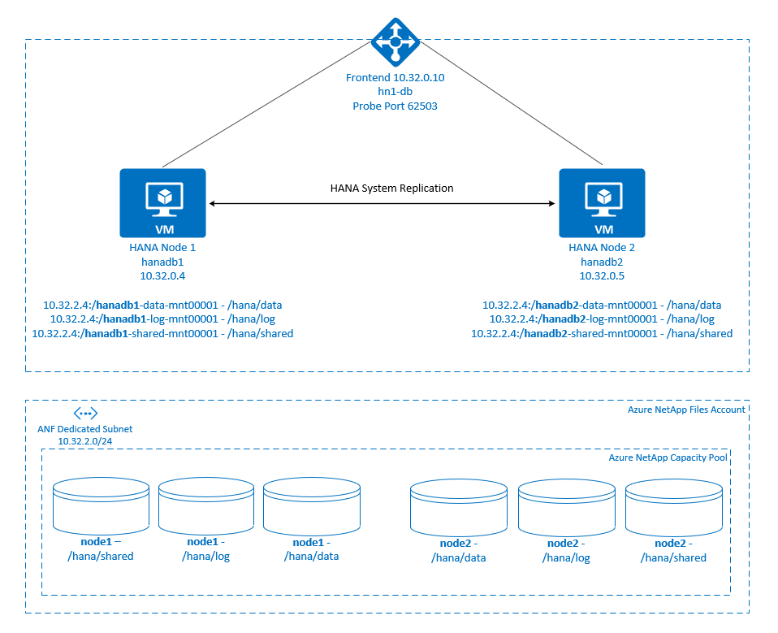

# High availability of SAP HANA Scale-up with Azure NetApp Files on Red Hat Enterprise Linux

[dbms-guide]:dbms-guide.md
[deployment-guide]:deployment-guide.md
[planning-guide]:planning-guide.md

[anf-azure-doc]:https://docs.microsoft.com/azure/azure-netapp-files/
[anf-avail-matrix]:https://azure.microsoft.com/global-infrastructure/services/?products=netapp&regions=all 
[anf-register]:https://docs.microsoft.com/azure/azure-netapp-files/azure-netapp-files-register
[anf-sap-applications-azure]:https://www.netapp.com/us/media/tr-4746.pdf

[2205917]:https://launchpad.support.sap.com/#/notes/2205917
[1944799]:https://launchpad.support.sap.com/#/notes/1944799
[1928533]:https://launchpad.support.sap.com/#/notes/1928533
[2015553]:https://launchpad.support.sap.com/#/notes/2015553
[2178632]:https://launchpad.support.sap.com/#/notes/2178632
[2191498]:https://launchpad.support.sap.com/#/notes/2191498
[2243692]:https://launchpad.support.sap.com/#/notes/2243692
[1984787]:https://launchpad.support.sap.com/#/notes/1984787
[1999351]:https://launchpad.support.sap.com/#/notes/1999351
[1410736]:https://launchpad.support.sap.com/#/notes/1410736
[1900823]:https://launchpad.support.sap.com/#/notes/1900823
[2292690]:https://launchpad.support.sap.com/#/notes/2292690
[2455582]:https://launchpad.support.sap.com/#/notes/2455582
[2593824]:https://launchpad.support.sap.com/#/notes/2593824
[2009879]:https://launchpad.support.sap.com/#/notes/2009879

[sap-swcenter]:https://support.sap.com/en/my-support/software-downloads.html

[sap-hana-ha]:sap-hana-high-availability.md
[nfs-ha]:high-availability-guide-suse-nfs.md

This article describes how to configure SAP HANA System Replication in Scale-up deployment, when the HANA file systems are mounted via NFS, using Azure NetApp Files (ANF). In the example configurations and installation commands, instance number **03**, and HANA System ID **HN1** are used. SAP HANA Replication consists of one primary node and at least one secondary node.

When steps in this document are marked with the following prefixes, the meaning is as follows:

- **[A]**: The step applies to all nodes
- **[1]**: The step applies to node1 only
- **[2]**: The step applies to node2 only
 
Read the following SAP Notes and papers first:

- SAP Note [1928533](https://launchpad.support.sap.com/#/notes/1928533), which has:
	- The list of Azure VM sizes that are supported for the deployment of SAP software.
	- Important capacity information for Azure VM sizes.
	- The supported SAP software, and operating system (OS) and database combinations.
	- The required SAP kernel version for Windows and Linux on Microsoft Azure.
- SAP Note [2015553](https://launchpad.support.sap.com/#/notes/2015553) lists prerequisites for SAP-supported SAP software deployments in Azure.
- SAP Note [405827](https://launchpad.support.sap.com/#/notes/405827) lists out recommended file system for HANA environment.
- SAP Note [2002167](https://launchpad.support.sap.com/#/notes/2002167) has recommended OS settings for Red Hat Enterprise Linux.
- SAP Note [2009879](https://launchpad.support.sap.com/#/notes/2009879) has SAP HANA Guidelines for Red Hat Enterprise Linux.
- SAP Note [2178632](https://launchpad.support.sap.com/#/notes/2178632) has detailed information about all monitoring metrics reported for SAP in Azure.
- SAP Note [2191498](https://launchpad.support.sap.com/#/notes/2191498) has the required SAP Host Agent version for Linux in Azure.
- SAP Note [2243692](https://launchpad.support.sap.com/#/notes/2243692) has information about SAP licensing on Linux in Azure.
- SAP Note [1999351](https://launchpad.support.sap.com/#/notes/1999351) has additional troubleshooting information for the Azure Enhanced Monitoring Extension for SAP.
- [SAP Community Wiki](https://wiki.scn.sap.com/wiki/display/HOME/SAPonLinuxNotes) has all required SAP Notes for Linux.
- [Azure Virtual Machines planning and implementation for SAP on Linux][planning-guide]
- [Azure Virtual Machines deployment for SAP on Linux][deployment-guide]
- [Azure Virtual Machines DBMS deployment for SAP on Linux][dbms-guide]
- [SAP HANA system replication in pacemaker cluster.](https://access.redhat.com/articles/3004101)
- General RHEL documentation
	- [High Availability Add-On Overview](https://access.redhat.com/documentation/en-us/red_hat_enterprise_linux/7/html/high_availability_add-on_overview/index)
	- [High Availability Add-On Administration.](https://access.redhat.com/documentation/en-us/red_hat_enterprise_linux/7/html/high_availability_add-on_administration/index)
	- [High Availability Add-On Reference.](https://access.redhat.com/documentation/en-us/red_hat_enterprise_linux/7/html/high_availability_add-on_reference/index)
	- [Configure SAP HANA System Replication in Scale-Up in a Pacemaker cluster when the HANA filesystems are on NFS shares](https://access.redhat.com/solutions/5156571)
- Azure-specific RHEL documentation:
	- [Support Policies for RHEL High Availability Clusters - Microsoft Azure Virtual Machines as Cluster Members.](https://access.redhat.com/articles/3131341)
	- [Installing and Configuring a Red Hat Enterprise Linux 7.4 (and later) High-Availability Cluster on Microsoft Azure.](https://access.redhat.com/articles/3252491)
	- [Install SAP HANA on Red Hat Enterprise Linux for Use in Microsoft Azure.](https://access.redhat.com/solutions/3193782)
	- [Configure SAP HANA scale-up system replication up Pacemaker cluster when the HANA file systems are on NFS shares](https://access.redhat.com/solutions/5156571)
- [NetApp SAP Applications on Microsoft Azure using Azure NetApp Files](https://www.netapp.com/us/media/tr-4746.pdf)
- [NFS v4.1 volumes on Azure NetApp Files for SAP HANA](./hana-vm-operations-netapp.md)

## Overview

Traditionally in scale-up environment all file systems for SAP HANA are mounted from local storage. Setting up High Availability of SAP HANA System Replication on Red Hat Enterprise Linux is published in guide [Set up SAP HANA System Replication on RHEL](./sap-hana-high-availability-rhel.md)

In order to achieve SAP HANA High Availability of scale-up system on [Azure NetApp Files](../../../azure-netapp-files/index.yml) NFS shares, we need some additional resource configuration in the cluster, in order for HANA resources to recover, when one node loses access to the NFS shares on ANF.  The cluster manages the NFS mounts, allowing it to monitor the health of the resources. The dependencies between the file system mounts and the SAP HANA resources are enforced.  



SAP HANA filesystems are mounted on NFS shares using Azure NetApp Files on each node. File systems /hana/data, /hana/log, and /hana/shared are unique to each node. 

Mounted on node1 (**hanadb1**)

- 10.32.2.4:/**hanadb1**-data-mnt00001 on /hana/data
- 10.32.2.4:/**hanadb1**-log-mnt00001 on /hana/log
- 10.32.2.4:/**hanadb1**-shared-mnt00001 on /hana/shared

Mounted on node2 (**hanadb2**)

- 10.32.2.4:/**hanadb2**-data-mnt00001 on /hana/data
- 10.32.2.4:/**hanadb2**-log-mnt00001 on /hana/log
- 10.32.2.4:/**hanadb2**-shared-mnt00001 on /hana/shared

> [!NOTE]
> File systems /hana/shared, /hana/data and /hana/log are not shared between the two nodes. Each cluster node has its own, separate file systems.   

The SAP HANA System Replication configuration uses a dedicated virtual hostname and virtual IP addresses. On Azure, a load balancer is required to use a virtual IP address. The following list shows the configuration of the load balancer:

- Front-end configuration: IP address 10.32.0.10 for hn1-db
- Back-end configuration: Connected to primary network interfaces of all virtual machines that should be part of HANA System Replication
- Probe Port: Port 62503
- Load-balancing rules: 30313 TCP, 30315 TCP, 30317 TCP, 30340 TCP, 30341 TCP, 30342 TCP (if using Basic Azure Load balancer)  

## Set up the Azure NetApp File infrastructure

Before you proceed with the set up for Azure NetApp Files infrastructure, familiarize yourself with the Azure [NetApp Files documentation](../../../azure-netapp-files/index.yml).

Azure NetApp Files is available in several [Azure regions](https://azure.microsoft.com/global-infrastructure/services/?products=netapp). Check to see whether your selected Azure region offers Azure NetApp Files.

For information about the availability of Azure NetApp Files by Azure region, see [Azure NetApp Files Availability by Azure Region](https://azure.microsoft.com/global-infrastructure/services/?products=netapp&regions=all).

Before you deploy Azure NetApp Files, request onboarding to Azure NetApp Files by going to [Register for Azure NetApp Files instructions](../../../azure-netapp-files/azure-netapp-files-register.md).

### Deploy Azure NetApp Files resources

The following instructions assume that you've already deployed your [Azure virtual network](../../../virtual-network/virtual-networks-overview.md). The Azure NetApp Files resources and VMs, where the Azure NetApp Files resources will be mounted, must be deployed in the same Azure virtual network or in peered Azure virtual networks.

1. If you haven't already deployed the resources, request [onboarding to Azure NetApp Files](../../../azure-netapp-files/azure-netapp-files-register.md).

2. Create a NetApp account in your selected Azure region by following the instructions in [Create a NetApp account](../../../azure-netapp-files/azure-netapp-files-create-netapp-account.md).

3.	Set up an Azure NetApp Files capacity pool by following the instructions in [Set up an Azure NetApp Files capacity pool](../../../azure-netapp-files/azure-netapp-files-set-up-capacity-pool.md).

	The HANA architecture presented in this article uses a single Azure NetApp Files capacity pool at the *Ultra* Service level. For HANA workloads on Azure, we recommend using an Azure NetApp Files *Ultra* or *Premium* [service Level](../../../azure-netapp-files/azure-netapp-files-service-levels.md).

4.	Delegate a subnet to Azure NetApp Files, as described in the instructions in [Delegate a subnet to Azure NetApp Files](../../../azure-netapp-files/azure-netapp-files-delegate-subnet.md).

5.	Deploy Azure NetApp Files volumes by following the instructions in [Create an NFS volume for Azure NetApp Files](../../../azure-netapp-files/azure-netapp-files-create-volumes.md).

	As you are deploying the volumes, be sure to select the NFSv4.1 version. Deploy the volumes in the designated Azure NetApp Files subnet. The IP addresses of the Azure NetApp volumes are assigned automatically.

	Keep in mind that the Azure NetApp Files resources and the Azure VMs must be in the same Azure virtual network or in peered Azure virtual networks. For example, hanadb1-data-mnt00001, hanadb1-log-mnt00001, and so on, are the volume names and nfs://10.32.2.4/hanadb1-data-mnt00001, nfs://10.32.2.4/hanadb1-log-mnt00001, and so on, are the file paths for the Azure NetApp Files volumes.
	
	On **hanadb1**

	- Volume hanadb1-data-mnt00001 (nfs://10.32.2.4:/hanadb1-data-mnt00001) 
	- Volume hanadb1-log-mnt00001 (nfs://10.32.2.4:/hanadb1-log-mnt00001)
	- Volume hanadb1-shared-mnt00001 (nfs://10.32.2.4:/hanadb1-shared-mnt00001)
	
	On **hanadb2**

	- Volume hanadb2-data-mnt00001 (nfs://10.32.2.4:/hanadb2-data-mnt00001)
	- Volume hanadb2-log-mnt00001 (nfs://10.32.2.4:/hanadb2-log-mnt00001)
	- Volume hanadb2-shared-mnt00001 (nfs://10.32.2.4:/hanadb2-shared-mnt00001)

### Important considerations

As you are creating your Azure NetApp Files for SAP HANA Scale-up systems, be aware of the following consideration:

- The minimum capacity pool is 4 tebibytes (TiB).
- The minimum volume size is 100 gibibytes (GiB).
- Azure NetApp Files and all virtual machines where the Azure NetApp Files volumes will be mounted must be in the same Azure virtual network or in [peered virtual networks](../../../virtual-network/virtual-network-peering-overview.md) in the same region.
- The selected virtual network must have a subnet that is delegated to Azure NetApp Files.
- The throughput of an Azure NetApp Files volume is a function of the volume quota and service level, as documented in [Service level for Azure NetApp Files](../../../azure-netapp-files/azure-netapp-files-service-levels.md). When you are sizing the HANA Azure NetApp volumes, make sure that the resulting throughput meets the HANA system requirements.
- With the Azure NetApp Files [export policy](../../../azure-netapp-files/azure-netapp-files-configure-export-policy.md), you can control the allowed clients, the access type (read-write, read only, and so on).
- The Azure NetApp Files feature is not zone-aware yet. Currently, the feature is not deployed in all availability zones in an Azure region. Be aware of the potential latency implications in some Azure regions.

> [!IMPORTANT]
> For SAP HANA workloads, low latency is critical. Work with your Microsoft representative to ensure that the virtual machines and the Azure NetApp Files volumes are deployed in proximity.

### Sizing of HANA database on Azure NetApp Files

The throughput of an Azure NetApp Files volume is a function of the volume size and service level, as documented in [Service level for Azure NetApp Files](../../../azure-netapp-files/azure-netapp-files-service-levels.md).

As you design the infrastructure for SAP in Azure, be aware of some minimum storage requirements by SAP, which translate into minimum throughput characteristics:

- Read-write on /hana/log of 250 megabytes per second (MB/s) with 1-MB I/O sizes.
- Read activity of at least 400 MB/s for /hana/data for 16-MB and 64-MB I/O sizes.
- Write activity of at least 250 MB/s for /hana/data with 16-MB and 64-MB I/O sizes.

The [Azure NetApp Files throughput limits](../../../azure-netapp-files/azure-netapp-files-service-levels.md) per 1 TiB of volume quota are:

- Premium Storage tier - 64 MiB/s.
- Ultra Storage tier - 128 MiB/s.

To meet the SAP minimum throughput requirements for /hana/data and /hana/log, and the guidelines for /hana/shared, the recommended sizes would be:

|    Volume    | Size of Premium Storage Tier | Size of Ultra Storage Tier | Supported NFS Protocol |
| :----------: | :--------------------------: | :------------------------: | :--------------------: |
|  /hana/log   |            4 TiB             |           2 TiB            |          v4.1          |
|  /hana/data  |           6.3 TiB            |          3.2 TiB           |          v4.1          |
| /hana/shared |           1 x RAM            |          1 x RAM           |          v3 or v4.1    |


> [!NOTE]
> The Azure NetApp Files sizing recommendations stated here are targeted to meet the minimum requirements that SAP recommends for their infrastructure providers. In real customer deployments and workload scenarios, these sizes may not be sufficient. Use these recommendations as a starting point and adapt, based on the requirements of your specific workload.

> [!TIP]
> You can resize Azure NetApp Files volumes dynamically, without having to *unmount* the volumes, stop the virtual machines, or stop SAP HANA. This approach allows flexibility to meet both the expected and unforeseen throughput demands of your application.

> [!NOTE]
> All commands to mount /hana/shared in this article are presented for NFSv4.1 /hana/shared volumes.
> If you deployed the /hana/shared volumes as NFSv3 volumes, don't forget to adjust the mount commands for /hana/shared for NFSv3.


## Deploy Linux virtual machine via Azure portal 

First you need to create the Azure NetApp Files volumes. Then do the following steps:

1.	Create a resource group.
2.	Create a virtual network.
3.	Create an availability set. Set the max update domain.
4.	Create a load balancer (internal). We recommend standard load balancer.
	Select the virtual network created in step 2.
5.	Create Virtual Machine 1 (**hanadb1**). 
6.	Create Virtual Machine 2 (**hanadb2**).  
7.	While creating virtual machine, we will not be adding any disk as all our mount points will be on NFS shares from Azure NetApp Files. 

> [!IMPORTANT]
> Floating IP is not supported on a NIC secondary IP configuration in load-balancing scenarios. For details see [Azure Load balancer Limitations](../../../load-balancer/load-balancer-multivip-overview.md#limitations). If you need additional IP address for the VM, deploy a second NIC.    

> [!NOTE] 
> When VMs without public IP addresses are placed in the backend pool of internal (no public IP address) Standard Azure load balancer, there will be no outbound internet connectivity, unless additional configuration is performed to allow routing to public end points. For details on how to achieve outbound connectivity see [Public endpoint connectivity for Virtual Machines using Azure Standard Load Balancer in SAP high-availability scenarios](./high-availability-guide-standard-load-balancer-outbound-connections.md).

8.	If using standard load balancer, follow these configuration steps:
	1.	First, create a front-end IP pool:
		1.	Open the load balancer, select **frontend IP pool**, and select **Add**.
		1.	Enter the name of the new front-end IP pool (for example, **hana-frontend**).
		1.	Set the **Assignment** to **Static** and enter the IP address (for example, **10.32.0.10**).
		1.	Select **OK**.
		1.	After the new front-end IP pool is created, note the pool IP address.
	1.	Next, create a back-end pool:
		1.	Open the load balancer, select **backend pools**, and select **Add**.
		1.	Enter the name of the new back-end pool (for example, **hana-backend**).
		1.	Select **Add a virtual machine**.
		1.	Select ** Virtual machine**.
		1.	Select the virtual machines of the SAP HANA cluster and their IP addresses.
		1.	Select **Add**.
	1.	Next, create a health probe:
		1.	Open the load balancer, select **health probes**, and select **Add**.
		1.	Enter the name of the new health probe (for example, **hana-hp**).
		1.	Select TCP as the protocol and port 625**03**. Keep the **Interval** value set to 5, and the **Unhealthy threshold** value set to 2.
		1.	Select **OK**.
	1.	Next, create the load-balancing rules:
		1.	Open the load balancer, select **load balancing rules**, and select **Add**.
		1.	Enter the name of the new load balancer rule (for example, **hana-lb**).
		1.	Select the front-end IP address, the back-end pool, and the health probe that you created earlier (for example, **hana-frontend**, **hana-backend** and **hana-hp**).
		1.	Select **HA Ports**.
		1.	Increase the **idle timeout** to 30 minutes.
		1.	Make sure to **enable Floating IP**.
		1.	Select **OK**.


9. Alternatively, if your scenario dictates using basic load balancer, follow these configuration steps:
	1.	Configure the load balancer. First, create a front-end IP pool:
		1.	Open the load balancer, select **frontend IP pool**, and select **Add**.
		1.	Enter the name of the new front-end IP pool (for example, **hana-frontend**).
		1.	Set the **Assignment** to **Static** and enter the IP address (for example, **10.32.0.10**).
		1.	Select **OK**.
		1.	After the new front-end IP pool is created, note the pool IP address.
	1.	Next, create a back-end pool:
		1.	Open the load balancer, select **backend pools**, and select **Add**.
		1.	Enter the name of the new back-end pool (for example, **hana-backend**).
		1.	Select **Add a virtual machine**.
		1.	Select the availability set created in step 3.
		1.	Select the virtual machines of the SAP HANA cluster.
		1.	Select **OK**.
	1.	Next, create a health probe:
		1.	Open the load balancer, select **health probes**, and select **Add**.
		1.	Enter the name of the new health probe (for example, **hana-hp**).
		1.	Select **TCP** as the protocol and port 625**03**. Keep the **Interval** value set to 5, and the **Unhealthy threshold** value set to 2.
		1.	Select **OK**.
	1.	For SAP HANA 1.0, create the load-balancing rules:
		1.	Open the load balancer, select **load balancing rules**, and select **Add**.
		1.	Enter the name of the new load balancer rule (for example, hana-lb-3**03**15).
		1.	Select the front-end IP address, the back-end pool, and the health probe that you created earlier (for example, **hana-frontend**).
		1.	Keep the **Protocol** set to **TCP**, and enter port 3**03**15.
		1.	Increase the **idle timeout** to 30 minutes.
		1.	Make sure to **enable Floating IP**.
		1.	Select **OK**.
		1.	Repeat these steps for port 3**03**17.
	1.	For SAP HANA 2.0, create the load-balancing rules for the system database:
		1.	Open the load balancer, select **load balancing rules**, and select **Add**.
		1.	Enter the name of the new load balancer rule (for example, hana-lb-3**03**13).
		1.	Select the front-end IP address, the back-end pool, and the health probe that you created earlier (for example, **hana-frontend**).
		1.	Keep the **Protocol** set to **TCP**, and enter port 3**03**13.
		1.	Increase the **idle timeout** to 30 minutes.
		1.	Make sure to **enable Floating IP**.
		1.	Select **OK**.
		1.	Repeat these steps for port 3**03**14.
	1.	For SAP HANA 2.0, first create the load-balancing rules for the tenant database:
		1.	Open the load balancer, select **load balancing rules**, and select **Add**.
		1.	Enter the name of the new load balancer rule (for example, hana-lb-3**03**40).
		1.	Select the frontend IP address, backend pool, and health probe you created earlier (for example, **hana-frontend**).
		1.	Keep the **Protocol** set to **TCP**, and enter port 3**03**40.
		1.	Increase the **idle timeout** to 30 minutes.
		1.	Make sure to **enable Floating IP**.
		1.	Select **OK**.
		1.	Repeat these steps for ports 3**03**41 and 3**03**42.

For more information about the required ports for SAP HANA, read the chapter [Connections to Tenant Databases](https://help.sap.com/viewer/78209c1d3a9b41cd8624338e42a12bf6/latest/en-US/7a9343c9f2a2436faa3cfdb5ca00c052.html) in the [SAP HANA Tenant Databases](https://help.sap.com/viewer/78209c1d3a9b41cd8624338e42a12bf6) guide or SAP Note [2388694](https://launchpad.support.sap.com/#/notes/2388694).

> [!IMPORTANT]
> Do not enable TCP timestamps on Azure VMs placed behind Azure Load Balancer. Enabling TCP timestamps will cause the health probes to fail. Set parameter **net.ipv4.tcp_timestamps** to **0**. For details see [Load Balancer health probes](../../../load-balancer/load-balancer-custom-probe-overview.md). See also SAP note [2382421](https://launchpad.support.sap.com/#/notes/2382421).

## Mount the Azure NetApp Files volume

1. **[A]** Create mount points for the HANA database volumes. 

    ```
    mkdir -p /hana/data
    mkdir -p /hana/log
    mkdir -p /hana/shared
    ```

2. **[A]** Verify the NFS domain setting. Make sure that the domain is configured as the default Azure NetApp Files domain, i.e. **defaultv4iddomain.com** and the mapping is set to **nobody**.

    ```
    sudo cat /etc/idmapd.conf
    # Example
    [General]
    Domain = defaultv4iddomain.com
    [Mapping]
    Nobody-User = nobody
    Nobody-Group = nobody
    ```

    > [!IMPORTANT]    
    > Make sure to set the NFS domain in /etc/idmapd.conf on the VM to match the default domain configuration on Azure NetApp Files: **defaultv4iddomain.com**. If there's a mismatch between the domain configuration on the NFS client (i.e. the VM) and the NFS server, i.e. the Azure NetApp configuration, then the permissions for files on Azure NetApp volumes that are mounted on the VMs will be displayed as nobody.
    

3. **[1]** Mount the node-specific volumes on node1 (**hanadb1**) 

    ```
    sudo mount -o rw,vers=4,minorversion=1,hard,timeo=600,rsize=262144,wsize=262144,intr,noatime,lock,_netdev,sec=sys 10.32.2.4:/hanadb1-shared-mnt00001 /hana/shared
    sudo mount -o rw,vers=4,minorversion=1,hard,timeo=600,rsize=262144,wsize=262144,intr,noatime,lock,_netdev,sec=sys 10.32.2.4:/hanadb1-log-mnt00001 /hana/log
    sudo mount -o rw,vers=4,minorversion=1,hard,timeo=600,rsize=262144,wsize=262144,intr,noatime,lock,_netdev,sec=sys 10.32.2.4:/hanadb1-data-mnt00001 /hana/data
    ```
    
4.  **[2]** Mount the node-specific volumes on node2 (**hanadb2**)
    
    ```
    sudo mount -o rw,vers=4,minorversion=1,hard,timeo=600,rsize=262144,wsize=262144,intr,noatime,lock,_netdev,sec=sys 10.32.2.4:/hanadb2-shared-mnt00001 /hana/shared
    sudo mount -o rw,vers=4,minorversion=1,hard,timeo=600,rsize=262144,wsize=262144,intr,noatime,lock,_netdev,sec=sys 10.32.2.4:/hanadb2-log-mnt00001 /hana/log
    sudo mount -o rw,vers=4,minorversion=1,hard,timeo=600,rsize=262144,wsize=262144,intr,noatime,lock,_netdev,sec=sys 10.32.2.4:/hanadb2-data-mnt00001 /hana/data
    ```

5. **[A]** Verify that all HANA volumes are mounted with NFS protocol version NFSv4.

    ```
    sudo nfsstat -m
    
    # Verify that flag vers is set to 4.1 
    # Example from hanadb1
    
    /hana/log from 10.32.2.4:/hanadb1-log-mnt00001
    Flags: rw,noatime,vers=4.1,rsize=262144,wsize=262144,namlen=255,hard,proto=tcp,timeo=600,retrans=2,sec=sys,clientaddr=10.32.0.4,local_lock=none,addr=10.32.2.4
    /hana/data from 10.32.2.4:/hanadb1-data-mnt00001
    Flags: rw,noatime,vers=4.1,rsize=262144,wsize=262144,namlen=255,hard,proto=tcp,timeo=600,retrans=2,sec=sys,clientaddr=10.32.0.4,local_lock=none,addr=10.32.2.4
    /hana/shared from 10.32.2.4:/hanadb1-shared-mnt00001
    Flags: rw,noatime,vers=4.1,rsize=262144,wsize=262144,namlen=255,hard,proto=tcp,timeo=600,retrans=2,sec=sys,clientaddr=10.32.0.4,local_lock=none,addr=10.32.2.4
    ```

6. **[A]** Verify **nfs4_disable_idmapping**. It should be set to **Y**. To create the directory structure where **nfs4_disable_idmapping** is located, execute the mount command. You won't be able to manually create the directory under /sys/modules, because access is reserved for the kernel / drivers.

    ```
    # Check nfs4_disable_idmapping 
    cat /sys/module/nfs/parameters/nfs4_disable_idmapping
    
    # If you need to set nfs4_disable_idmapping to Y
    echo "Y" > /sys/module/nfs/parameters/nfs4_disable_idmapping
    
    # Make the configuration permanent
    echo "options nfs nfs4_disable_idmapping=Y" >> /etc/modprobe.d/nfs.conf
    ```

   ​For more details on how to change **nfs_disable_idmapping** parameter, see [https://access.redhat.com/solutions/1749883](https://access.redhat.com/solutions/1749883). 


## SAP HANA installation

1. **[A]** Set up host name resolution for all hosts.

   You can either use a DNS server or modify the /etc/hosts file on all nodes. This example shows you how to use the /etc/hosts file. Replace the IP address and the hostname in the following commands:

   ```
   sudo vi /etc/hosts
   # Insert the following lines in the /etc/hosts file. Change the IP address and hostname to match your environment  
   10.32.0.4   hanadb1
   10.32.0.5   hanadb2
   ```

2. **[A]** RHEL for HANA Configuration

   Configure RHEL as described in below SAP Note based on your RHEL version

   - [2292690 - SAP HANA DB: Recommended OS settings for RHEL 7](https://launchpad.support.sap.com/#/notes/2292690)
   - [2777782 - SAP HANA DB: Recommended OS Settings for RHEL 8](https://launchpad.support.sap.com/#/notes/2777782)
   - [2455582 - Linux: Running SAP applications compiled with GCC 6.x](https://launchpad.support.sap.com/#/notes/2455582)
   - [2593824 - Linux: Running SAP applications compiled with GCC 7.x](https://launchpad.support.sap.com/#/notes/2593824) 
   - [2886607 - Linux: Running SAP applications compiled with GCC 9.x](https://launchpad.support.sap.com/#/notes/2886607)

3. **[A]** Install the SAP HANA

   Started with HANA 2.0 SPS 01, MDC is the default option. When you install HANA system, SYSTEMDB and a tenant with same SID will be created together. In some case you do not want the default tenant. In case, if you don’t want to create initial tenant along with the installation you can follow SAP Note [2629711](https://launchpad.support.sap.com/#/notes/2629711)

	Run the **hdblcm** program from the HANA DVD. Enter the following values at the prompt:  
	Choose installation: Enter **1** (for install)  
	Select additional components for installation: Enter **1**.  
	Enter Installation Path [/hana/shared]: press Enter to accept the default  
	Enter Local Host Name [..]: Press Enter to accept the default  
	Do you want to add additional hosts to the system? (y/n) [n]: **n**  
	Enter SAP HANA System ID: Enter **HN1**.  
	Enter Instance Number [00]: Enter **03**  
	Select Database Mode / Enter Index [1]: press Enter to accept the default  
	Select System Usage / Enter Index [4]: enter **4** (for custom)  
	Enter Location of Data Volumes [/hana/data]: press Enter to accept the default  
	Enter Location of Log Volumes [/hana/log]: press Enter to accept the default  
	Restrict maximum memory allocation? [n]: press Enter to accept the default  
	Enter Certificate Host Name For Host '...' [...]: press Enter to accept the default  
	Enter SAP Host Agent User (sapadm) Password: Enter the host agent user password  
	Confirm SAP Host Agent User (sapadm) Password: Enter the host agent user password again to confirm  
	Enter System Administrator (hn1adm) Password: Enter the system administrator password  
	Confirm System Administrator (hn1adm) Password: Enter the system administrator password again to confirm  
	Enter System Administrator Home Directory [/usr/sap/HN1/home]: press Enter to accept the default  
	Enter System Administrator Login Shell [/bin/sh]: press Enter to accept the default  
	Enter System Administrator User ID [1001]: press Enter to accept the default  
	Enter ID of User Group (sapsys) [79]: press Enter to accept the default  
	Enter Database User (SYSTEM) Password: Enter the database user password  
	Confirm Database User (SYSTEM) Password: Enter the database user password again to confirm  
	Restart system after machine reboot? [n]: press Enter to accept the default  
	Do you want to continue? (y/n): Validate the summary. Enter **y** to continue  

4. **[A]** Upgrade SAP Host Agent

   Download the latest SAP Host Agent archive from the [SAP Software Center](https://launchpad.support.sap.com/#/softwarecenter) and run the following command to upgrade the agent. Replace the path to the archive to point to the file that you downloaded:

   ```
   sudo /usr/sap/hostctrl/exe/saphostexec -upgrade -archive <path to SAP Host Agent SAR>
   ```

5. **[A]** Configure firewall

   Create the firewall rule for the Azure load balancer probe port.

   ```
   sudo firewall-cmd --zone=public --add-port=62503/tcp
   sudo firewall-cmd --zone=public --add-port=62503/tcp –permanent
   ```

## Configure SAP HANA system replication

Follow the steps in Set up [SAP HANA System Replication](./sap-hana-high-availability-rhel.md#configure-sap-hana-20-system-replication) to configure SAP HANA System Replication. 

## Cluster configuration

This section describes necessary steps required for cluster to operate seamlessly when SAP HANA is installed on NFS shares using Azure NetApp Files. 

### Create a Pacemaker cluster

Follow the steps in [Setting up Pacemaker on Red Hat Enterprise Linux](./high-availability-guide-rhel-pacemaker.md) in Azure to create a basic Pacemaker cluster for this HANA server.

### Configure filesystem resources

In this example each cluster node has its own HANA NFS filesystems /hana/shared, /hana/data, and /hana/log.   

1. **[1]** Put the cluster in maintenance mode.

   ```
   pcs property set maintenance-mode=true
   ```

2. **[1]** Create the Filesystem resources for the **hanadb1** mounts.

    ```
    pcs resource create hana_data1 ocf:heartbeat:Filesystem device=10.32.2.4:/hanadb1-data-mnt00001 directory=/hana/data fstype=nfs options=rw,vers=4,minorversion=1,hard,timeo=600,rsize=262144,wsize=262144,intr,noatime,lock,_netdev,sec=sys op monitor interval=20s on-fail=fence timeout=40s OCF_CHECK_LEVEL=20 --group hanadb1_nfs
    pcs resource create hana_log1 ocf:heartbeat:Filesystem device=10.32.2.4:/hanadb1-log-mnt00001 directory=/hana/log fstype=nfs options=rw,vers=4,minorversion=1,hard,timeo=600,rsize=262144,wsize=262144,intr,noatime,lock,_netdev,sec=sys op monitor interval=20s on-fail=fence timeout=40s OCF_CHECK_LEVEL=20 --group hanadb1_nfs
    pcs resource create hana_shared1 ocf:heartbeat:Filesystem device=10.32.2.4:/hanadb1-shared-mnt00001 directory=/hana/shared fstype=nfs options=rw,vers=4,minorversion=1,hard,timeo=600,rsize=262144,wsize=262144,intr,noatime,lock,_netdev,sec=sys op monitor interval=20s on-fail=fence timeout=40s OCF_CHECK_LEVEL=20 --group hanadb1_nfs
    ```

3. **[2]** Create the Filesystem resources for the **hanadb2** mounts.

    ```
    pcs resource create hana_data2 ocf:heartbeat:Filesystem device=10.32.2.4:/hanadb2-data-mnt00001 directory=/hana/data fstype=nfs options=rw,vers=4,minorversion=1,hard,timeo=600,rsize=262144,wsize=262144,intr,noatime,lock,_netdev,sec=sys op monitor interval=20s on-fail=fence timeout=40s OCF_CHECK_LEVEL=20 --group hanadb2_nfs
    pcs resource create hana_log2 ocf:heartbeat:Filesystem device=10.32.2.4:/hanadb2-log-mnt00001 directory=/hana/log fstype=nfs options=rw,vers=4,minorversion=1,hard,timeo=600,rsize=262144,wsize=262144,intr,noatime,lock,_netdev,sec=sys op monitor interval=20s on-fail=fence timeout=40s OCF_CHECK_LEVEL=20 --group hanadb2_nfs
    pcs resource create hana_shared2 ocf:heartbeat:Filesystem device=10.32.2.4:/hanadb2-shared-mnt00001 directory=/hana/shared fstype=nfs options=rw,vers=4,minorversion=1,hard,timeo=600,rsize=262144,wsize=262144,intr,noatime,lock,_netdev,sec=sys op monitor interval=20s on-fail=fence timeout=40s OCF_CHECK_LEVEL=20 --group hanadb2_nfs
    ```

    `OCF_CHECK_LEVEL=20` attribute is added to the monitor operation so that each monitor performs a read/write test on the filesystem. Without this attribute, the monitor operation only verifies that the filesystem is mounted. This can be a problem because when connectivity is lost, the filesystem may remain mounted despite being inaccessible.

    `on-fail=fence` attribute is also added to the monitor operation. With this option, if the monitor operation fails on a node, that node is immediately fenced. Without this option, the default behavior is to stop all resources that depend on the failed resource, then restart the failed resource, then start all the resources that depend on the failed resource. Not only can this behavior take a long time when an SAPHana resource depends on the failed resource, but it also can fail altogether. The SAPHana resource cannot stop successfully if the NFS server holding the HANA executables is inaccessible.

4. **[1]** Configuring Location Constraints

   Configure location constraints to ensure that the resources that manage hanadb1 unique mounts can never run on hanadb2, and vice-versa.

    ```
    pcs constraint location hanadb1_nfs rule score=-INFINITY resource-discovery=never \#uname eq hanadb2
    pcs constraint location hanadb2_nfs rule score=-INFINITY resource-discovery=never \#uname eq hanadb1
    ```

    The `resource-discovery=never` option is set because the unique mounts for each node share the same mount point. For example, `hana_data1` uses mount point `/hana/data`, and `hana_data2` also uses mount point `/hana/data`. This can cause a false positive for a probe operation, when resource state is checked at cluster startup, and this can in turn cause unnecessary recovery behavior. This can be avoided by setting `resource-discovery=never`

5. **[1]** Configuring Attribute Resources

   Configure attribute resources. These attributes will be set to true if all of a node's NFS mounts (/hana/data, /hana/log, and /hana/data) are mounted and will be set to false otherwise.

   ```
   pcs resource create hana_nfs1_active ocf:pacemaker:attribute active_value=true inactive_value=false name=hana_nfs1_active
   pcs resource create hana_nfs2_active ocf:pacemaker:attribute active_value=true inactive_value=false name=hana_nfs2_active
   ```

6. **[1]** Configuring Location Constraints

   Configure location constraints to ensure that hanadb1’s attribute resource never runs on hanadb2, and vice-versa.

   ```
   pcs constraint location hana_nfs1_active avoids hanadb2
   pcs constraint location hana_nfs2_active avoids hanadb1
   ```

7. **[1]** Creating Ordering Constraints

   Configure ordering constraints so that a node's attribute resources start only after all of the node's NFS mounts are mounted.
   
    ```
    pcs constraint order hanadb1_nfs then hana_nfs1_active
    pcs constraint order hanadb2_nfs then hana_nfs2_active
    ```

   > [!TIP]
   > If your configuration includes file systems, outside of group `hanadb1_nfs` or `hanadb2_nfs`, then include the `sequential=false` option, so that there are no ordering dependencies among the file systems. All file systems must start before `hana_nfs1_active`, but they do not need to start in any order relative to each other. For more details see [How do I configure SAP HANA System Replication in Scale-Up in a Pacemaker cluster when the HANA filesystems are on NFS shares](https://access.redhat.com/solutions/5156571)

### Configure SAP HANA cluster resources

1. Follow the steps in [Create SAP HANA cluster resources](./sap-hana-high-availability-rhel.md#create-sap-hana-cluster-resources) to create the SAP HANA Resources in the cluster. Once SAP HANA resources are created, we need to create a location rule constraint between SAP HANA resources and Filesystems (NFS Mounts)

2. **[1]** Configure constraints between the SAP HANA resources and the NFS mounts

   Location rule constraints will be set so that the SAP HANA resources can run on a node only if all of the node's NFS mounts are mounted.

    ```
    pcs constraint location SAPHanaTopology_HN1_03-clone rule score=-INFINITY hana_nfs1_active ne true and hana_nfs2_active ne true
    # On RHEL 7.x
    pcs constraint location SAPHana_HN1_03-master rule score=-INFINITY hana_nfs1_active ne true and hana_nfs2_active ne true
    # On RHEL 8.x
    pcs constraint location SAPHana_HN1_03-clone rule score=-INFINITY hana_nfs1_active ne true and hana_nfs2_active ne true
    # Take the cluster out of maintenance mode
    sudo pcs property set maintenance-mode=false
    ```

   Check the status of cluster and all the resources
   > [!NOTE]
   > This article contains references to the term *slave*, a term that Microsoft no longer uses. When the term is removed from the software, we’ll remove it from this article.
   
    ```
    sudo pcs status
    
    Online: [ hanadb1 hanadb2 ]
    
    Full list of resources:
    
    rsc_hdb_azr_agt(stonith:fence_azure_arm):  Started hanadb1
    
    Resource Group: hanadb1_nfs
    hana_data1 (ocf::heartbeat:Filesystem):Started hanadb1
    hana_log1  (ocf::heartbeat:Filesystem):Started hanadb1
    hana_shared1   (ocf::heartbeat:Filesystem):Started hanadb1
    
    Resource Group: hanadb2_nfs
    hana_data2 (ocf::heartbeat:Filesystem):Started hanadb2
    hana_log2  (ocf::heartbeat:Filesystem):Started hanadb2
    hana_shared2   (ocf::heartbeat:Filesystem):Started hanadb2
    
    hana_nfs1_active   (ocf::pacemaker:attribute): Started hanadb1
    hana_nfs2_active   (ocf::pacemaker:attribute): Started hanadb2
    
    Clone Set: SAPHanaTopology_HN1_03-clone [SAPHanaTopology_HN1_03]
    Started: [ hanadb1 hanadb2 ]
    
    Master/Slave Set: SAPHana_HN1_03-master [SAPHana_HN1_03]
    Masters: [ hanadb1 ]
    Slaves: [ hanadb2 ]
    
    Resource Group: g_ip_HN1_03
    nc_HN1_03  (ocf::heartbeat:azure-lb):  Started hanadb1
    vip_HN1_03 (ocf::heartbeat:IPaddr2):   Started hanadb1
    ```

## Configure HANA active/read enabled system replication in Pacemaker cluster

Starting with SAP HANA 2.0 SPS 01 SAP allows Active/Read-Enabled setups for SAP HANA System Replication, where the secondary systems of SAP HANA system replication can be used actively for read-intense workloads. To support such setup in a cluster a second virtual IP address is required which allows clients to access the secondary read-enabled SAP HANA database. To ensure that the secondary replication site can still be accessed after a takeover has occurred the cluster needs to move the virtual IP address around with the secondary of the SAPHana resource.

The additional configuration, required to manage HANA Active/Read enabled system replication in a Red Hat high availability cluster with second virtual IP is described in [Configure HANA Active/Read Enabled System Replication in Pacemaker cluster](https://docs.microsoft.com/azure/virtual-machines/workloads/sap/sap-hana-high-availability-rhel#configure-hana-activeread-enabled-system-replication-in-pacemaker-cluster).  

Before proceeding further, make sure you have fully configured Red Hat High Availability Cluster managing SAP HANA database as described in above segments of the documentation.    


## Test the cluster setup

This section describes how you can test your setup. 

1. Before you start a test, make sure that Pacemaker does not have any failed action (via pcs status), there are no unexpected location constraints (for example leftovers of a migration test) and that HANA system replication is sync state, for example with systemReplicationStatus:

    ```
    sudo su - hn1adm -c "python /usr/sap/HN1/HDB03/exe/python_support/systemReplicationStatus.py"
    ```

2. Verify the cluster configuration for a failure scenario when a node loses access to the NFS share (/hana/shared)

   The SAP HANA resource agents depend on binaries, stored on `/hana/shared` to perform operations during failover. File system  `/hana/shared` is mounted over NFS in the presented scenario.  
   It is difficult to simulate a failure, where one of the servers loses access to the NFS share. A test that can be performed is to re-mount the file system as read-only.
   This approach validates that the cluster will be able to failover, if access to `/hana/shared` is lost on the active node.     


   **Expected Result:** On making `/hana/shared` as read-only file system, the `OCF_CHECK_LEVEL` attribute of the resource `hana_shared1` which performs read/write operation on file system will fail as it is not able to write anything on the file system and will perform HANA resource failover.  The same result is expected when your HANA node loses access to the NFS shares. 

   Resource state before starting the test:

    ```
    sudo pcs status
    # Example output
    Full list of resources:
     rsc_hdb_azr_agt        (stonith:fence_azure_arm):      Started hanadb1

     Resource Group: hanadb1_nfs
         hana_data1 (ocf::heartbeat:Filesystem):    Started hanadb1
         hana_log1  (ocf::heartbeat:Filesystem):    Started hanadb1
         hana_shared1       (ocf::heartbeat:Filesystem):    Started hanadb1

    Resource Group: hanadb2_nfs
         hana_data2 (ocf::heartbeat:Filesystem):    Started hanadb2
         hana_log2  (ocf::heartbeat:Filesystem):    Started hanadb2
         hana_shared2       (ocf::heartbeat:Filesystem):    Started hanadb2

     hana_nfs1_active       (ocf::pacemaker:attribute):     Started hanadb1
     hana_nfs2_active       (ocf::pacemaker:attribute):     Started hanadb2

     Clone Set: SAPHanaTopology_HN1_03-clone [SAPHanaTopology_HN1_03]
         Started: [ hanadb1 hanadb2 ]

     Master/Slave Set: SAPHana_HN1_03-master [SAPHana_HN1_03]
         Masters: [ hanadb1 ]
         Slaves: [ hanadb2 ]

     Resource Group: g_ip_HN1_03
         nc_HN1_03  (ocf::heartbeat:azure-lb):      Started hanadb1
         vip_HN1_03 (ocf::heartbeat:IPaddr2):       Started hanadb1
    ```

   You can place /hana/shared in read-only mode on the active cluster node, using below command:

    ```
    sudo mount -o ro 10.32.2.4:/hanadb1-shared-mnt00001 /hana/shared
    ```

   hanadb1 will either reboot or poweroff based on the action set on stonith (`pcs property show stonith-action`).  Once the server (hanadb1) is down, HANA resource move to hanadb2. You can check the status of cluster from hanadb2.

    ```
    pcs status

    Full list of resources:

     rsc_hdb_azr_agt        (stonith:fence_azure_arm):      Started hanadb2

     Resource Group: hanadb1_nfs
         hana_data1 (ocf::heartbeat:Filesystem):    Stopped
         hana_log1  (ocf::heartbeat:Filesystem):    Stopped
         hana_shared1       (ocf::heartbeat:Filesystem):    Stopped

     Resource Group: hanadb2_nfs
         hana_data2 (ocf::heartbeat:Filesystem):    Started hanadb2
         hana_log2  (ocf::heartbeat:Filesystem):    Started hanadb2
         hana_shared2       (ocf::heartbeat:Filesystem):    Started hanadb2

     hana_nfs1_active       (ocf::pacemaker:attribute):     Stopped
     hana_nfs2_active       (ocf::pacemaker:attribute):     Started hanadb2

     Clone Set: SAPHanaTopology_HN1_03-clone [SAPHanaTopology_HN1_03]
         Started: [ hanadb2 ]
         Stopped: [ hanadb1 ]

     Master/Slave Set: SAPHana_HN1_03-master [SAPHana_HN1_03]
         Masters: [ hanadb2 ]
         Stopped: [ hanadb1 ]

     Resource Group: g_ip_HN1_03
         nc_HN1_03  (ocf::heartbeat:azure-lb):      Started hanadb2
         vip_HN1_03 (ocf::heartbeat:IPaddr2):       Started hanadb2
    ```

   We recommend to thoroughly test the SAP HANA cluster configuration, by also performing the tests described in [Setup SAP HANA System Replication on RHEL](./sap-hana-high-availability-rhel.md#test-the-cluster-setup).

## Next steps

* [Azure Virtual Machines planning and implementation for SAP][planning-guide]
* [Azure Virtual Machines deployment for SAP][deployment-guide]
* [Azure Virtual Machines DBMS deployment for SAP][dbms-guide]
* [NFS v4.1 volumes on Azure NetApp Files for SAP HANA](./hana-vm-operations-netapp.md)