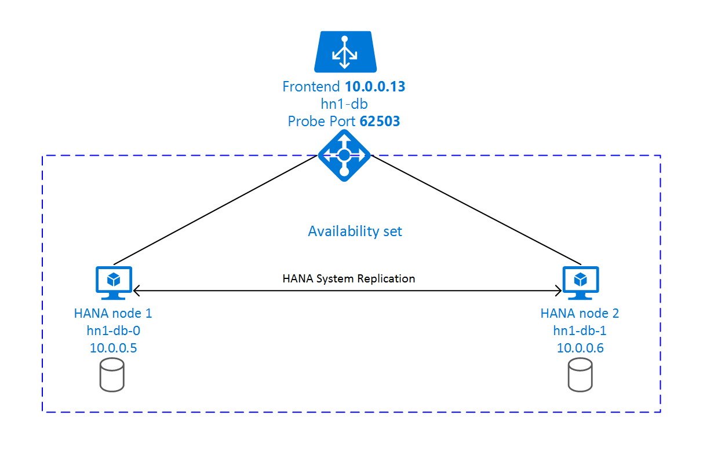

# High availability of SAP HANA on Azure VMs on Red Hat Enterprise Linux

[dbms-guide]:dbms-guide.md
[deployment-guide]:deployment-guide.md
[planning-guide]:planning-guide.md

[2205917]:https://launchpad.support.sap.com/#/notes/2205917
[1944799]:https://launchpad.support.sap.com/#/notes/1944799
[1928533]:https://launchpad.support.sap.com/#/notes/1928533
[2015553]:https://launchpad.support.sap.com/#/notes/2015553
[2178632]:https://launchpad.support.sap.com/#/notes/2178632
[2191498]:https://launchpad.support.sap.com/#/notes/2191498
[2243692]:https://launchpad.support.sap.com/#/notes/2243692
[1984787]:https://launchpad.support.sap.com/#/notes/1984787
[1999351]:https://launchpad.support.sap.com/#/notes/1999351
[2388694]:https://launchpad.support.sap.com/#/notes/2388694
[2292690]:https://launchpad.support.sap.com/#/notes/2292690
[2455582]:https://launchpad.support.sap.com/#/notes/2455582
[2002167]:https://launchpad.support.sap.com/#/notes/2002167
[2009879]:https://launchpad.support.sap.com/#/notes/2009879

[sap-swcenter]:https://launchpad.support.sap.com/#/softwarecenter
[template-multisid-db]:https://portal.azure.com/#create/Microsoft.Template/uri/https%3A%2F%2Fraw.githubusercontent.com%2FAzure%2Fazure-quickstart-templates%2Fmaster%2Fsap-3-tier-marketplace-image-multi-sid-db-md%2Fazuredeploy.json

For on-premises development, you can use either HANA System Replication or use shared storage to establish high availability for SAP HANA.
On Azure virtual machines (VMs), HANA System Replication on Azure is currently the only supported high availability function.
SAP HANA Replication consists of one primary node and at least one secondary node. Changes to the data on the primary node are replicated to the secondary node synchronously or asynchronously.

This article describes how to deploy and configure the virtual machines, install the cluster framework, and install and configure SAP HANA System Replication.
In the example configurations, installation commands, instance number **03**, and HANA System ID **HN1** are used.

Read the following SAP Notes and papers first:

* SAP Note [1928533], which has:
  * The list of Azure VM sizes that are supported for the deployment of SAP software.
  * Important capacity information for Azure VM sizes.
  * The supported SAP software, and operating system (OS) and database combinations.
  * The required SAP kernel version for Windows and Linux on Microsoft Azure.
* SAP Note [2015553] lists prerequisites for SAP-supported SAP software deployments in Azure.
* SAP Note [2002167] has recommended OS settings for Red Hat Enterprise Linux
* SAP Note [2009879] has SAP HANA Guidelines for Red Hat Enterprise Linux
* SAP Note [2178632] has detailed information about all monitoring metrics reported for SAP in Azure.
* SAP Note [2191498] has the required SAP Host Agent version for Linux in Azure.
* SAP Note [2243692] has information about SAP licensing on Linux in Azure.
* SAP Note [1999351] has additional troubleshooting information for the Azure Enhanced Monitoring Extension for SAP.
* [SAP Community WIKI](https://wiki.scn.sap.com/wiki/display/HOME/SAPonLinuxNotes) has all required SAP Notes for Linux.
* [Azure Virtual Machines planning and implementation for SAP on Linux][planning-guide]
* [Azure Virtual Machines deployment for SAP on Linux (this article)][deployment-guide]
* [Azure Virtual Machines DBMS deployment for SAP on Linux][dbms-guide]
* [SAP HANA system replication in pacemaker cluster](https://access.redhat.com/articles/3004101)
* General RHEL documentation
  * [High Availability Add-On Overview](https://access.redhat.com/documentation/en-us/red_hat_enterprise_linux/7/html/high_availability_add-on_overview/index)
  * [High Availability Add-On Administration](https://access.redhat.com/documentation/en-us/red_hat_enterprise_linux/7/html/high_availability_add-on_administration/index)
  * [High Availability Add-On Reference](https://access.redhat.com/documentation/en-us/red_hat_enterprise_linux/7/html/high_availability_add-on_reference/index)
* Azure specific RHEL documentation:
  * [Support Policies for RHEL High Availability Clusters - Microsoft Azure Virtual Machines as Cluster Members](https://access.redhat.com/articles/3131341)
  * [Installing and Configuring a Red Hat Enterprise Linux 7.4 (and later) High-Availability Cluster on Microsoft Azure](https://access.redhat.com/articles/3252491)
  * [Install SAP HANA on Red Hat Enterprise Linux for Use in Microsoft Azure](https://access.redhat.com/solutions/3193782)

## Overview

To achieve high availability, SAP HANA is installed on two virtual machines. The data is replicated by using HANA System Replication.

SAP HANA System Replication setup uses a dedicated virtual hostname and virtual IP addresses. On Azure, a load balancer is required to use a virtual IP address. The following list shows the configuration of the load balancer:

* Front-end configuration: IP address 10.0.0.13 for hn1-db
* Back-end configuration: Connected to primary network interfaces of all virtual machines that should be part of HANA System Replication
* Probe Port: Port 62503
* Load-balancing rules: 30313 TCP, 30315 TCP, 30317 TCP, 30340 TCP, 30341 TCP, 30342 TCP

## Deploy for Linux

The Azure Marketplace contains an image for Red Hat Enterprise Linux 7.4 for SAP HANA that you can use to deploy new virtual machines.

### Deploy with a template

You can use one of the quickstart templates that are on GitHub to deploy all the required resources. The template deploys the virtual machines, the load balancer, the availability set, and so on.
To deploy the template, follow these steps:

1. Open the [database template][template-multisid-db] on the Azure portal.
1. Enter the following parameters:
    * **Sap System ID**: Enter the SAP system ID of the SAP system you want to install. The ID is used as a prefix for the resources that are deployed.
    * **Os Type**: Select one of the Linux distributions. For this example, select **RHEL 7**.
    * **Db Type**: Select **HANA**.
    * **Sap System Size**: Enter the number of SAPS that the new system is going to provide. If you're not sure how many SAPS the system requires, ask your SAP Technology Partner or System Integrator.
    * **System Availability**: Select **HA**.
    * **Admin Username, Admin Password or SSH key**: A new user is created that can be used to sign in to the machine.
    * **Subnet ID**: If you want to deploy the VM into an existing VNet where you have a subnet defined the VM should be assigned to, name the ID of that specific subnet. The ID usually looks like **/subscriptions/\<subscription ID>/resourceGroups/\<resource group name>/providers/Microsoft.Network/virtualNetworks/\<virtual network name>/subnets/\<subnet name>**. Leave empty, if you want to create a new virtual network

### Manual deployment

1. Create a resource group.
1. Create a virtual network.
1. Create an availability set.  
   Set the max update domain.
1. Create a load balancer (internal). We recommend [standard load balancer](https://docs.microsoft.com/azure/load-balancer/load-balancer-standard-overview).
   * Select the virtual network created in step 2.
1. Create virtual machine 1.  
   Use at least Red Hat Enterprise Linux 7.4 for SAP HANA. This example uses the Red Hat Enterprise Linux 7.4 for SAP HANA image <https://portal.azure.com/#create/RedHat.RedHatEnterpriseLinux75forSAP-ARM>
   Select the availability set created in step 3.
1. Create virtual machine 2.  
   Use at least Red Hat Enterprise Linux 7.4 for SAP HANA. This example uses the Red Hat Enterprise Linux 7.4 for SAP HANA image <https://portal.azure.com/#create/RedHat.RedHatEnterpriseLinux75forSAP-ARM>
   Select the availability set created in step 3.
1. Add data disks.
1. If using standard load balancer, follow these configuration steps:
   1. First, create a front-end IP pool:

      1. Open the load balancer, select **frontend IP pool**, and select **Add**.
      1. Enter the name of the new front-end IP pool (for example, **hana-frontend**).
      1. Set the **Assignment** to **Static** and enter the IP address (for example, **10.0.0.13**).
      1. Select **OK**.
      1. After the new front-end IP pool is created, note the pool IP address.

   1. Next, create a back-end pool:

      1. Open the load balancer, select **backend pools**, and select **Add**.
      1. Enter the name of the new back-end pool (for example, **hana-backend**).
      1. Select **Add a virtual machine**.
      1. Select ** Virtual machine**.
      1. Select the virtual machines of the SAP HANA cluster and their IP addresses.
      1. Select **Add**.

   1. Next, create a health probe:

      1. Open the load balancer, select **health probes**, and select **Add**.
      1. Enter the name of the new health probe (for example, **hana-hp**).
      1. Select **TCP** as the protocol and port 625**03**. Keep the **Interval** value set to 5, and the **Unhealthy threshold** value set to 2.
      1. Select **OK**.

   1. Next, create the load-balancing rules:
   
      1. Open the load balancer, select **load balancing rules**, and select **Add**.
      1. Enter the name of the new load balancer rule (for example, **hana-lb**).
      1. Select the front-end IP address, the back-end pool, and the health probe that you created earlier (for example, **hana-frontend**, **hana-backend** and **hana-hp**).
      1. Select **HA Ports**.
      1. Increase the **idle timeout** to 30 minutes.
      1. Make sure to **enable Floating IP**.
      1. Select **OK**.

   > [!Note]
   > When VMs without public IP addresses are placed in the backend pool of internal (no public IP address) Standard Azure load balancer, there will be no outbound internet connectivity, unless additional configuration is performed to allow routing to public end points. For details on how to achieve outbound connectivity see [Public endpoint connectivity for Virtual Machines using Azure Standard Load Balancer in SAP high-availability scenarios](https://docs.microsoft.com/azure/virtual-machines/workloads/sap/high-availability-guide-standard-load-balancer-outbound-connections).  

1. Alternatively, if your scenario dictates using basic load balancer, follow these configuration steps:
   1. Configure the load balancer. First, create a front-end IP pool:

      1. Open the load balancer, select **frontend IP pool**, and select **Add**.
      1. Enter the name of the new front-end IP pool (for example, **hana-frontend**).
      1. Set the **Assignment** to **Static** and enter the IP address (for example, **10.0.0.13**).
      1. Select **OK**.
      1. After the new front-end IP pool is created, note the pool IP address.

   1. Next, create a back-end pool:

      1. Open the load balancer, select **backend pools**, and select **Add**.
      1. Enter the name of the new back-end pool (for example, **hana-backend**).
      1. Select **Add a virtual machine**.
      1. Select the availability set created in step 3.
      1. Select the virtual machines of the SAP HANA cluster.
      1. Select **OK**.

   1. Next, create a health probe:

      1. Open the load balancer, select **health probes**, and select **Add**.
      1. Enter the name of the new health probe (for example, **hana-hp**).
      1. Select **TCP** as the protocol and port 625**03**. Keep the **Interval** value set to 5, and the **Unhealthy threshold** value set to 2.
      1. Select **OK**.

   1. For SAP HANA 1.0, create the load-balancing rules:

      1. Open the load balancer, select **load balancing rules**, and select **Add**.
      1. Enter the name of the new load balancer rule (for example, hana-lb-3**03**15).
      1. Select the front-end IP address, the back-end pool, and the health probe that you created earlier (for example, **hana-frontend**).
      1. Keep the **Protocol** set to **TCP**, and enter port 3**03**15.
      1. Increase the **idle timeout** to 30 minutes.
      1. Make sure to **enable Floating IP**.
      1. Select **OK**.
      1. Repeat these steps for port 3**03**17.

   1. For SAP HANA 2.0, create the load-balancing rules for the system database:

      1. Open the load balancer, select **load balancing rules**, and select **Add**.
      1. Enter the name of the new load balancer rule (for example, hana-lb-3**03**13).
      1. Select the front-end IP address, the back-end pool, and the health probe that you created earlier (for example, **hana-frontend**).
      1. Keep the **Protocol** set to **TCP**, and enter port 3**03**13.
      1. Increase the **idle timeout** to 30 minutes.
      1. Make sure to **enable Floating IP**.
      1. Select **OK**.
      1. Repeat these steps for port 3**03**14.

   1. For SAP HANA 2.0, first create the load-balancing rules for the tenant database:

      1. Open the load balancer, select **load balancing rules**, and select **Add**.
      1. Enter the name of the new load balancer rule (for example, hana-lb-3**03**40).
      1. Select the frontend IP address, backend pool, and health probe you created earlier (for example, **hana-frontend**).
      1. Keep the **Protocol** set to **TCP**, and enter port 3**03**40.
      1. Increase the **idle timeout** to 30 minutes.
      1. Make sure to **enable Floating IP**.
      1. Select **OK**.
      1. Repeat these steps for ports 3**03**41 and 3**03**42.

For more information about the required ports for SAP HANA, read the chapter [Connections to Tenant Databases](https://help.sap.com/viewer/78209c1d3a9b41cd8624338e42a12bf6/latest/en-US/7a9343c9f2a2436faa3cfdb5ca00c052.html) in the [SAP HANA Tenant Databases](https://help.sap.com/viewer/78209c1d3a9b41cd8624338e42a12bf6) guide or [SAP Note 2388694][2388694].

> [!IMPORTANT]
> Do not enable TCP timestamps on Azure VMs placed behind Azure Load Balancer. Enabling TCP timestamps will cause the health probes to fail. Set parameter **net.ipv4.tcp_timestamps** to **0**. For details see [Load Balancer health probes](https://docs.microsoft.com/azure/load-balancer/load-balancer-custom-probe-overview).
> See also SAP note [2382421](https://launchpad.support.sap.com/#/notes/2382421). 

## Install SAP HANA

The steps in this section use the following prefixes:

* **[A]**: The step applies to all nodes.
* **[1]**: The step applies to node 1 only.
* **[2]**: The step applies to node 2 of the Pacemaker cluster only.

1. **[A]** Set up the disk layout: **Logical Volume Manager (LVM)**.

   We recommend that you use LVM for volumes that store data and log files. The following example assumes that the virtual machines have four data disks attached that are used to create two volumes.

   List all of the available disks:

   <pre><code>ls /dev/disk/azure/scsi1/lun*
   </code></pre>

   Example output:

   <pre><code>
   /dev/disk/azure/scsi1/lun0  /dev/disk/azure/scsi1/lun1  /dev/disk/azure/scsi1/lun2  /dev/disk/azure/scsi1/lun3
   </code></pre>

   Create physical volumes for all of the disks that you want to use:

   <pre><code>sudo pvcreate /dev/disk/azure/scsi1/lun0
   sudo pvcreate /dev/disk/azure/scsi1/lun1
   sudo pvcreate /dev/disk/azure/scsi1/lun2
   sudo pvcreate /dev/disk/azure/scsi1/lun3
   </code></pre>

   Create a volume group for the data files. Use one volume group for the log files and one for the shared directory of SAP HANA:

   <pre><code>sudo vgcreate vg_hana_data_<b>HN1</b> /dev/disk/azure/scsi1/lun0 /dev/disk/azure/scsi1/lun1
   sudo vgcreate vg_hana_log_<b>HN1</b> /dev/disk/azure/scsi1/lun2
   sudo vgcreate vg_hana_shared_<b>HN1</b> /dev/disk/azure/scsi1/lun3
   </code></pre>

   Create the logical volumes. A linear volume is created when you use `lvcreate` without the `-i` switch. We suggest that you create a striped volume for better I/O performance, and align the stripe sizes to the values documented in [SAP HANA VM storage configurations](https://docs.microsoft.com/azure/virtual-machines/workloads/sap/hana-vm-operations-storage). The `-i` argument should be the number of the underlying physical volumes and the `-I` argument is the stripe size. In this document, two physical volumes are used for the data volume, so the `-i` switch argument is set to **2**. The stripe size for the data volume is **256KiB**. One physical volume is used for the log volume, so no `-i` or `-I` switches are explicitly used for the log volume commands.  

   > [!IMPORTANT]
   > Use the `-i` switch and set it to the number of the underlying physical volume when you use more than one physical volume for each data, log, or shared volumes. Use the `-I` switch to specify the stripe size, when creating a striped volume.  
   > See [SAP HANA VM storage configurations](https://docs.microsoft.com/azure/virtual-machines/workloads/sap/hana-vm-operations-storage) for recommended storage configurations, including stripe sizes and number of disks.  

   <pre><code>sudo lvcreate <b>-i 2</b> <b>-I 256</b> -l 100%FREE -n hana_data vg_hana_data_<b>HN1</b>
   sudo lvcreate -l 100%FREE -n hana_log vg_hana_log_<b>HN1</b>
   sudo lvcreate -l 100%FREE -n hana_shared vg_hana_shared_<b>HN1</b>
   sudo mkfs.xfs /dev/vg_hana_data_<b>HN1</b>/hana_data
   sudo mkfs.xfs /dev/vg_hana_log_<b>HN1</b>/hana_log
   sudo mkfs.xfs /dev/vg_hana_shared_<b>HN1</b>/hana_shared
   </code></pre>

   Create the mount directories and copy the UUID of all of the logical volumes:

   <pre><code>sudo mkdir -p /hana/data/<b>HN1</b>
   sudo mkdir -p /hana/log/<b>HN1</b>
   sudo mkdir -p /hana/shared/<b>HN1</b>
   # Write down the ID of /dev/vg_hana_data_<b>HN1</b>/hana_data, /dev/vg_hana_log_<b>HN1</b>/hana_log, and /dev/vg_hana_shared_<b>HN1</b>/hana_shared
   sudo blkid
   </code></pre>

   Create `fstab` entries for the three logical volumes:

   <pre><code>sudo vi /etc/fstab
   </code></pre>

   Insert the following line in the `/etc/fstab` file:

   <pre><code>/dev/disk/by-uuid/<b>&lt;UUID of /dev/mapper/vg_hana_data_<b>HN1</b>-hana_data&gt;</b> /hana/data/<b>HN1</b> xfs  defaults,nofail  0  2
   /dev/disk/by-uuid/<b>&lt;UUID of /dev/mapper/vg_hana_log_<b>HN1</b>-hana_log&gt;</b> /hana/log/<b>HN1</b> xfs  defaults,nofail  0  2
   /dev/disk/by-uuid/<b>&lt;UUID of /dev/mapper/vg_hana_shared_<b>HN1</b>-hana_shared&gt;</b> /hana/shared/<b>HN1</b> xfs  defaults,nofail  0  2
   </code></pre>

   Mount the new volumes:

   <pre><code>sudo mount -a
   </code></pre>

1. **[A]** Set up the disk layout: **Plain Disks**.

   For demo systems, you can place your HANA data and log files on one disk. Create a partition on /dev/disk/azure/scsi1/lun0 and format it with xfs:

   <pre><code>sudo sh -c 'echo -e "n\n\n\n\n\nw\n" | fdisk /dev/disk/azure/scsi1/lun0'
   sudo mkfs.xfs /dev/disk/azure/scsi1/lun0-part1
   
   # Write down the ID of /dev/disk/azure/scsi1/lun0-part1
   sudo /sbin/blkid
   sudo vi /etc/fstab
   </code></pre>

   Insert this line in the /etc/fstab file:

   <pre><code>/dev/disk/by-uuid/<b>&lt;UUID&gt;</b> /hana xfs  defaults,nofail  0  2
   </code></pre>

   Create the target directory and mount the disk:

   <pre><code>sudo mkdir /hana
   sudo mount -a
   </code></pre>

1. **[A]** Set up host name resolution for all hosts.

   You can either use a DNS server or modify the /etc/hosts file on all nodes. This example shows you how to use the /etc/hosts file.
   Replace the IP address and the hostname in the following commands:

   <pre><code>sudo vi /etc/hosts
   </code></pre>

   Insert the following lines in the /etc/hosts file. Change the IP address and hostname to match your environment:

   <pre><code><b>10.0.0.5 hn1-db-0</b>
   <b>10.0.0.6 hn1-db-1</b>
   </code></pre>

1. **[A]** RHEL for HANA configuration

   Configure RHEL as described in SAP Note [2292690] and [2455582] and <https://access.redhat.com/solutions/2447641>.

1. **[A]** Install the SAP HANA

   To install SAP HANA System Replication, follow <https://access.redhat.com/articles/3004101>.

   * Run the **hdblcm** program from the HANA DVD. Enter the following values at the prompt:
   * Choose installation: Enter **1**.
   * Select additional components for installation: Enter **1**.
   * Enter Installation Path [/hana/shared]: Select Enter.
   * Enter Local Host Name [..]: Select Enter.
   * Do you want to add additional hosts to the system? (y/n) [n]: Select Enter.
   * Enter SAP HANA System ID: Enter the SID of HANA, for example: **HN1**.
   * Enter Instance Number [00]: Enter the HANA Instance number. Enter **03** if you used the Azure template or followed the manual deployment section of this article.
   * Select Database Mode / Enter Index [1]: Select Enter.
   * Select System Usage / Enter Index [4]: Select the system usage value.
   * Enter Location of Data Volumes [/hana/data/HN1]: Select Enter.
   * Enter Location of Log Volumes [/hana/log/HN1]: Select Enter.
   * Restrict maximum memory allocation? [n]: Select Enter.
   * Enter Certificate Host Name For Host '...' [...]: Select Enter.
   * Enter SAP Host Agent User (sapadm) Password: Enter the host agent user password.
   * Confirm SAP Host Agent User (sapadm) Password: Enter the host agent user password again to confirm.
   * Enter System Administrator (hdbadm) Password: Enter the system administrator password.
   * Confirm System Administrator (hdbadm) Password: Enter the system administrator password again to confirm.
   * Enter System Administrator Home Directory [/usr/sap/HN1/home]: Select Enter.
   * Enter System Administrator Login Shell [/bin/sh]: Select Enter.
   * Enter System Administrator User ID [1001]: Select Enter.
   * Enter ID of User Group (sapsys) [79]: Select Enter.
   * Enter Database User (SYSTEM) Password: Enter the database user password.
   * Confirm Database User (SYSTEM) Password: Enter the database user password again to confirm.
   * Restart system after machine reboot? [n]: Select Enter.
   * Do you want to continue? (y/n): Validate the summary. Enter **y** to continue.

1. **[A]** Upgrade the SAP Host Agent.

   Download the latest SAP Host Agent archive from the [SAP Software Center][sap-swcenter] and run the following command to upgrade the agent. Replace the path to the archive to point to the file that you downloaded:

   <pre><code>sudo /usr/sap/hostctrl/exe/saphostexec -upgrade -archive &lt;path to SAP Host Agent SAR&gt;
   </code></pre>

1. **[A]** Configure firewall

   Create the firewall rule for the Azure load balancer probe port.

   <pre><code>sudo firewall-cmd --zone=public --add-port=625<b>03</b>/tcp
   sudo firewall-cmd --zone=public --add-port=625<b>03</b>/tcp --permanent
   </code></pre>

## Configure SAP HANA 2.0 System Replication

The steps in this section use the following prefixes:

* **[A]**: The step applies to all nodes.
* **[1]**: The step applies to node 1 only.
* **[2]**: The step applies to node 2 of the Pacemaker cluster only.

1. **[A]** Configure firewall

   Create firewall rules to allow HANA System Replication and client traffic. The required ports are listed on [TCP/IP Ports of All SAP Products](https://help.sap.com/viewer/ports). The following commands are just an example to allow HANA 2.0 System Replication and client traffic to database SYSTEMDB, HN1 and NW1.

   <pre><code>sudo firewall-cmd --zone=public --add-port=40302/tcp --permanent
   sudo firewall-cmd --zone=public --add-port=40302/tcp
   sudo firewall-cmd --zone=public --add-port=40301/tcp --permanent
   sudo firewall-cmd --zone=public --add-port=40301/tcp
   sudo firewall-cmd --zone=public --add-port=40307/tcp --permanent
   sudo firewall-cmd --zone=public --add-port=40307/tcp
   sudo firewall-cmd --zone=public --add-port=40303/tcp --permanent
   sudo firewall-cmd --zone=public --add-port=40303/tcp
   sudo firewall-cmd --zone=public --add-port=40340/tcp --permanent
   sudo firewall-cmd --zone=public --add-port=40340/tcp
   sudo firewall-cmd --zone=public --add-port=30340/tcp --permanent
   sudo firewall-cmd --zone=public --add-port=30340/tcp
   sudo firewall-cmd --zone=public --add-port=30341/tcp --permanent
   sudo firewall-cmd --zone=public --add-port=30341/tcp
   sudo firewall-cmd --zone=public --add-port=30342/tcp --permanent
   sudo firewall-cmd --zone=public --add-port=30342/tcp
   </code></pre>

1. **[1]** Create the tenant database.

   If you're using SAP HANA 2.0 or MDC, create a tenant database for your SAP NetWeaver system. Replace **NW1** with the SID of your SAP system.

   Execute as <hanasid\>adm the following command:

   <pre><code>hdbsql -u SYSTEM -p "<b>passwd</b>" -i <b>03</b> -d SYSTEMDB 'CREATE DATABASE <b>NW1</b> SYSTEM USER PASSWORD "<b>passwd</b>"'
   </code></pre>

1. **[1]** Configure System Replication on the first node:

   Backup the databases as <hanasid\>adm:

   <pre><code>hdbsql -d SYSTEMDB -u SYSTEM -p "<b>passwd</b>" -i <b>03</b> "BACKUP DATA USING FILE ('<b>initialbackupSYS</b>')"
   hdbsql -d <b>HN1</b> -u SYSTEM -p "<b>passwd</b>" -i <b>03</b> "BACKUP DATA USING FILE ('<b>initialbackupHN1</b>')"
   hdbsql -d <b>NW1</b> -u SYSTEM -p "<b>passwd</b>" -i <b>03</b> "BACKUP DATA USING FILE ('<b>initialbackupNW1</b>')"
   </code></pre>

   Copy the system PKI files to the secondary site:

   <pre><code>scp /usr/sap/<b>HN1</b>/SYS/global/security/rsecssfs/data/SSFS_<b>HN1</b>.DAT   <b>hn1-db-1</b>:/usr/sap/<b>HN1</b>/SYS/global/security/rsecssfs/data/
   scp /usr/sap/<b>HN1</b>/SYS/global/security/rsecssfs/key/SSFS_<b>HN1</b>.KEY  <b>hn1-db-1</b>:/usr/sap/<b>HN1</b>/SYS/global/security/rsecssfs/key/
   </code></pre>

   Create the primary site:

   <pre><code>hdbnsutil -sr_enable --name=<b>SITE1</b>
   </code></pre>

1. **[2]** Configure System Replication on the second node:
    
   Register the second node to start the system replication. Run the following command as <hanasid\>adm:

   <pre><code>sapcontrol -nr <b>03</b> -function StopWait 600 10
   hdbnsutil -sr_register --remoteHost=<b>hn1-db-0</b> --remoteInstance=<b>03</b> --replicationMode=sync --name=<b>SITE2</b>
   </code></pre>

1. **[1]** Check replication status

   Check the replication status and wait until all databases are in sync. If the status remains UNKNOWN, check your firewall settings.

   <pre><code>sudo su - <b>hn1</b>adm -c "python /usr/sap/<b>HN1</b>/HDB<b>03</b>/exe/python_support/systemReplicationStatus.py"
   # | Database | Host     | Port  | Service Name | Volume ID | Site ID | Site Name | Secondary | Secondary | Secondary | Secondary | Secondary     | Replication | Replication | Replication    |
   # |          |          |       |              |           |         |           | Host      | Port      | Site ID   | Site Name | Active Status | Mode        | Status      | Status Details |
   # | -------- | -------- | ----- | ------------ | --------- | ------- | --------- | --------- | --------- | --------- | --------- | ------------- | ----------- | ----------- | -------------- |
   # | SYSTEMDB | <b>hn1-db-0</b> | 30301 | nameserver   |         1 |       1 | <b>SITE1</b>     | <b>hn1-db-1</b>  |     30301 |         2 | <b>SITE2</b>     | YES           | SYNC        | ACTIVE      |                |
   # | <b>HN1</b>      | <b>hn1-db-0</b> | 30307 | xsengine     |         2 |       1 | <b>SITE1</b>     | <b>hn1-db-1</b>  |     30307 |         2 | <b>SITE2</b>     | YES           | SYNC        | ACTIVE      |                |
   # | <b>NW1</b>      | <b>hn1-db-0</b> | 30340 | indexserver  |         2 |       1 | <b>SITE1</b>     | <b>hn1-db-1</b>  |     30340 |         2 | <b>SITE2</b>     | YES           | SYNC        | ACTIVE      |                |
   # | <b>HN1</b>      | <b>hn1-db-0</b> | 30303 | indexserver  |         3 |       1 | <b>SITE1</b>     | <b>hn1-db-1</b>  |     30303 |         2 | <b>SITE2</b>     | YES           | SYNC        | ACTIVE      |                |
   #
   # status system replication site "2": ACTIVE
   # overall system replication status: ACTIVE
   #
   # Local System Replication State
   # ~~~~~~~~~~~~~~~~~~~~~~~~~~~~~~
   #
   # mode: PRIMARY
   # site id: 1
   # site name: <b>SITE1</b>
   </code></pre>

## Configure SAP HANA 1.0 System Replication

The steps in this section use the following prefixes:

* **[A]**: The step applies to all nodes.
* **[1]**: The step applies to node 1 only.
* **[2]**: The step applies to node 2 of the Pacemaker cluster only.

1. **[A]** Configure firewall

   Create firewall rules to allow HANA System Replication and client traffic. The required ports are listed on [TCP/IP Ports of All SAP Products](https://help.sap.com/viewer/ports). The following commands are just an example to allow HANA 2.0 System Replication. Adapt it to your SAP HANA 1.0 installation.

   <pre><code>sudo firewall-cmd --zone=public --add-port=40302/tcp --permanent
   sudo firewall-cmd --zone=public --add-port=40302/tcp
   </code></pre>

1. **[1]** Create the required users.

   Run the following command as root. Make sure to replace bold strings (HANA System ID **HN1** and instance number **03**) with the values of your SAP HANA installation:

   <pre><code>PATH="$PATH:/usr/sap/<b>HN1</b>/HDB<b>03</b>/exe"
   hdbsql -u system -i <b>03</b> 'CREATE USER <b>hdb</b>hasync PASSWORD "<b>passwd</b>"'
   hdbsql -u system -i <b>03</b> 'GRANT DATA ADMIN TO <b>hdb</b>hasync'
   hdbsql -u system -i <b>03</b> 'ALTER USER <b>hdb</b>hasync DISABLE PASSWORD LIFETIME'
   </code></pre>

1. **[A]** Create the keystore entry.

   Run the following command as root to create a new keystore entry:

   <pre><code>PATH="$PATH:/usr/sap/<b>HN1</b>/HDB<b>03</b>/exe"
   hdbuserstore SET <b>hdb</b>haloc localhost:3<b>03</b>15 <b>hdb</b>hasync <b>passwd</b>
   </code></pre>

1. **[1]** Back up the database.

   Back up the databases as root:

   <pre><code>PATH="$PATH:/usr/sap/<b>HN1</b>/HDB<b>03</b>/exe"
   hdbsql -d SYSTEMDB -u system -i <b>03</b> "BACKUP DATA USING FILE ('<b>initialbackup</b>')"
   </code></pre>

   If you use a multi-tenant installation, also back up the tenant database:

   <pre><code>hdbsql -d <b>HN1</b> -u system -i <b>03</b> "BACKUP DATA USING FILE ('<b>initialbackup</b>')"
   </code></pre>

1. **[1]** Configure System Replication on the first node.

   Create the primary site as <hanasid\>adm:

   <pre><code>su - <b>hdb</b>adm
   hdbnsutil -sr_enable –-name=<b>SITE1</b>
   </code></pre>

1. **[2]** Configure System Replication on the secondary node.

   Register the secondary site as <hanasid\>adm:

   <pre><code>HDB stop
   hdbnsutil -sr_register --remoteHost=<b>hn1-db-0</b> --remoteInstance=<b>03</b> --replicationMode=sync --name=<b>SITE2</b>
   HDB start
   </code></pre>

## Create a Pacemaker cluster

Follow the steps in [Setting up Pacemaker on Red Hat Enterprise Linux in Azure](high-availability-guide-rhel-pacemaker.md) to create a basic Pacemaker cluster for this HANA server.

## Create SAP HANA cluster resources

Install the SAP HANA resource agents on **all nodes**. Make sure to enable a repository that contains the package.

<pre><code># Enable repository that contains SAP HANA resource agents
sudo subscription-manager repos --enable="rhel-sap-hana-for-rhel-7-server-rpms"
   
sudo yum install -y resource-agents-sap-hana
</code></pre>

Next, create the HANA topology. Run the following commands on one of the Pacemaker cluster nodes:

<pre><code>sudo pcs property set maintenance-mode=true

# Replace the bold string with your instance number and HANA system ID
sudo pcs resource create SAPHanaTopology_<b>HN1</b>_<b>03</b> SAPHanaTopology SID=<b>HN1</b> InstanceNumber=<b>03</b> \
op start timeout=600 op stop timeout=300 op monitor interval=10 timeout=600 \
--clone clone-max=2 clone-node-max=1 interleave=true
</code></pre>

Next, create the HANA resources:

<pre><code># Replace the bold string with your instance number, HANA system ID, and the front-end IP address of the Azure load balancer.

sudo pcs resource create SAPHana_<b>HN1</b>_<b>03</b> SAPHana SID=<b>HN1</b> InstanceNumber=<b>03</b> PREFER_SITE_TAKEOVER=true DUPLICATE_PRIMARY_TIMEOUT=7200 AUTOMATED_REGISTER=false \
op start timeout=3600 op stop timeout=3600 \
op monitor interval=61 role="Slave" timeout=700 \
op monitor interval=59 role="Master" timeout=700 \
op promote timeout=3600 op demote timeout=3600 \
master notify=true clone-max=2 clone-node-max=1 interleave=true

sudo pcs resource create vip_<b>HN1</b>_<b>03</b> IPaddr2 ip="<b>10.0.0.13</b>"

sudo pcs resource create nc_<b>HN1</b>_<b>03</b> azure-lb port=625<b>03</b>

sudo pcs resource group add g_ip_<b>HN1</b>_<b>03</b> nc_<b>HN1</b>_<b>03</b> vip_<b>HN1</b>_<b>03</b>

sudo pcs constraint order SAPHanaTopology_<b>HN1</b>_<b>03</b>-clone then SAPHana_<b>HN1</b>_<b>03</b>-master symmetrical=false

sudo pcs constraint colocation add g_ip_<b>HN1</b>_<b>03</b> with master SAPHana_<b>HN1</b>_<b>03</b>-master 4000

sudo pcs property set maintenance-mode=false
</code></pre>

Make sure that the cluster status is ok and that all of the resources are started. It's not important on which node the resources are running.

> [!NOTE]
> The timeouts in the above configuration are just examples and may need to be adapted to the specific HANA setup. For instance, you may need to increase the start timeout, if it takes longer to start the SAP HANA database.  

<pre><code>sudo pcs status

# Online: [ hn1-db-0 hn1-db-1 ]
#
# Full list of resources:
#
# azure_fence     (stonith:fence_azure_arm):      Started hn1-db-0
#  Clone Set: SAPHanaTopology_HN1_03-clone [SAPHanaTopology_HN1_03]
#      Started: [ hn1-db-0 hn1-db-1 ]
#  Master/Slave Set: SAPHana_HN1_03-master [SAPHana_HN1_03]
#      Masters: [ hn1-db-0 ]
#      Slaves: [ hn1-db-1 ]
#  Resource Group: g_ip_HN1_03
#      nc_HN1_03  (ocf::heartbeat:azure-lb):      Started hn1-db-0
#      vip_HN1_03 (ocf::heartbeat:IPaddr2):       Started hn1-db-0
</code></pre>

## Test the cluster setup

This section describes how you can test your setup. Before you start a test, make sure that Pacemaker does not have any failed action (via pcs status), there are no unexpected location constraints (for example leftovers of a migration test) and that HANA is sync state, for example with systemReplicationStatus:

<pre><code>[root@hn1-db-0 ~]# sudo su - hn1adm -c "python /usr/sap/HN1/HDB03/exe/python_support/systemReplicationStatus.py"
</code></pre>

### Test the migration

Resource state before starting the test:

<pre><code>Clone Set: SAPHanaTopology_HN1_03-clone [SAPHanaTopology_HN1_03]
    Started: [ hn1-db-0 hn1-db-1 ]
Master/Slave Set: SAPHana_HN1_03-master [SAPHana_HN1_03]
    Masters: [ hn1-db-0 ]
    Slaves: [ hn1-db-1 ]
Resource Group: g_ip_HN1_03
    nc_HN1_03  (ocf::heartbeat:azure-lb):      Started hn1-db-0
    vip_HN1_03 (ocf::heartbeat:IPaddr2):       Started hn1-db-0
</code></pre>

You can migrate the SAP HANA master node by executing the following command:

<pre><code>[root@hn1-db-0 ~]# pcs resource move SAPHana_HN1_03-master
</code></pre>

If you set `AUTOMATED_REGISTER="false"`, this command should migrate the SAP HANA master node and the group that contains the virtual IP address to hn1-db-1.

Once the migration is done, the 'sudo pcs status' output looks like this

<pre><code>Clone Set: SAPHanaTopology_HN1_03-clone [SAPHanaTopology_HN1_03]
    Started: [ hn1-db-0 hn1-db-1 ]
Master/Slave Set: SAPHana_HN1_03-master [SAPHana_HN1_03]
    Masters: [ hn1-db-1 ]
    Stopped: [ hn1-db-0 ]
Resource Group: g_ip_HN1_03
    nc_HN1_03  (ocf::heartbeat:azure-lb):      Started hn1-db-1
    vip_HN1_03 (ocf::heartbeat:IPaddr2):       Started hn1-db-1
</code></pre>

The SAP HANA resource on hn1-db-0 is stopped. In this case, configure the HANA instance as secondary by executing this command:

<pre><code>[root@hn1-db-0 ~]# su - hn1adm

# Stop the HANA instance just in case it is running
hn1adm@hn1-db-0:/usr/sap/HN1/HDB03> sapcontrol -nr 03 -function StopWait 600 10
hn1adm@hn1-db-0:/usr/sap/HN1/HDB03> hdbnsutil -sr_register --remoteHost=hn1-db-1 --remoteInstance=03 --replicationMod
e=sync --name=SITE1
</code></pre>

The migration creates location constraints that need to be deleted again:

<pre><code># Switch back to root
exit
[root@hn1-db-0 ~]# pcs resource clear SAPHana_HN1_03-master
</code></pre>

Monitor the state of the HANA resource using 'pcs status'. Once HANA is started on hn1-db-0, the output should look like this

<pre><code>Clone Set: SAPHanaTopology_HN1_03-clone [SAPHanaTopology_HN1_03]
    Started: [ hn1-db-0 hn1-db-1 ]
Master/Slave Set: SAPHana_HN1_03-master [SAPHana_HN1_03]
    Masters: [ hn1-db-1 ]
    Slaves: [ hn1-db-0 ]
Resource Group: g_ip_HN1_03
    nc_HN1_03  (ocf::heartbeat:azure-lb):      Started hn1-db-1
    vip_HN1_03 (ocf::heartbeat:IPaddr2):       Started hn1-db-1
</code></pre>

### Test the Azure fencing agent

Resource state before starting the test:

<pre><code>Clone Set: SAPHanaTopology_HN1_03-clone [SAPHanaTopology_HN1_03]
    Started: [ hn1-db-0 hn1-db-1 ]
Master/Slave Set: SAPHana_HN1_03-master [SAPHana_HN1_03]
    Masters: [ hn1-db-1 ]
    Slaves: [ hn1-db-0 ]
Resource Group: g_ip_HN1_03
    nc_HN1_03  (ocf::heartbeat:azure-lb):      Started hn1-db-1
    vip_HN1_03 (ocf::heartbeat:IPaddr2):       Started hn1-db-1
</code></pre>

You can test the setup of the Azure fencing agent by disabling the network interface on the node where SAP HANA is running as Master.
See [Red Hat Knowledgebase article 79523](https://access.redhat.com/solutions/79523) for a description on how to simulate a network failure. In this example we use the net_breaker script to block all access to the network.

<pre><code>[root@hn1-db-1 ~]# sh ./net_breaker.sh BreakCommCmd 10.0.0.6
</code></pre>

The virtual machine should now restart or stop depending on your cluster configuration.
If you set the `stonith-action` setting to off, the virtual machine is stopped and the resources are migrated to the running virtual machine.

After you start the virtual machine again, the SAP HANA resource fails to start as secondary if you set `AUTOMATED_REGISTER="false"`. In this case, configure the HANA instance as secondary by executing this command:

<pre><code>su - <b>hn1</b>adm

# Stop the HANA instance just in case it is running
hn1adm@hn1-db-1:/usr/sap/HN1/HDB03> sapcontrol -nr <b>03</b> -function StopWait 600 10
hn1adm@hn1-db-1:/usr/sap/HN1/HDB03> hdbnsutil -sr_register --remoteHost=<b>hn1-db-0</b> --remoteInstance=<b>03</b> --replicationMode=sync --name=<b>SITE2</b>

# Switch back to root and clean up the failed state
exit
[root@hn1-db-1 ~]# pcs resource cleanup SAPHana_HN1_03-master
</code></pre>

Resource state after the test:

<pre><code>Clone Set: SAPHanaTopology_HN1_03-clone [SAPHanaTopology_HN1_03]
    Started: [ hn1-db-0 hn1-db-1 ]
Master/Slave Set: SAPHana_HN1_03-master [SAPHana_HN1_03]
    Masters: [ hn1-db-0 ]
    Slaves: [ hn1-db-1 ]
Resource Group: g_ip_HN1_03
    nc_HN1_03  (ocf::heartbeat:azure-lb):      Started hn1-db-0
    vip_HN1_03 (ocf::heartbeat:IPaddr2):       Started hn1-db-0
</code></pre>

### Test a manual failover

Resource state before starting the test:

<pre><code>Clone Set: SAPHanaTopology_HN1_03-clone [SAPHanaTopology_HN1_03]
    Started: [ hn1-db-0 hn1-db-1 ]
Master/Slave Set: SAPHana_HN1_03-master [SAPHana_HN1_03]
    Masters: [ hn1-db-0 ]
    Slaves: [ hn1-db-1 ]
Resource Group: g_ip_HN1_03
    nc_HN1_03  (ocf::heartbeat:azure-lb):      Started hn1-db-0
    vip_HN1_03 (ocf::heartbeat:IPaddr2):       Started hn1-db-0
</code></pre>

You can test a manual failover by stopping the cluster on the hn1-db-0 node:

<pre><code>[root@hn1-db-0 ~]# pcs cluster stop
</code></pre>

After the failover, you can start the cluster again. If you set `AUTOMATED_REGISTER="false"`, the SAP HANA resource on the hn1-db-0 node fails to start as secondary. In this case, configure the HANA instance as secondary by executing this command:

<pre><code>[root@hn1-db-0 ~]# pcs cluster start
[root@hn1-db-0 ~]# su - hn1adm

# Stop the HANA instance just in case it is running
hn1adm@hn1-db-0:/usr/sap/HN1/HDB03> sapcontrol -nr 03 -function StopWait 600 10
hn1adm@hn1-db-0:/usr/sap/HN1/HDB03> hdbnsutil -sr_register --remoteHost=<b>hn1-db-1</b> --remoteInstance=<b>03</b> --replicationMode=sync --name=<b>SITE1</b>

# Switch back to root and clean up the failed state
hn1adm@hn1-db-0:/usr/sap/HN1/HDB03> exit
[root@hn1-db-1 ~]# pcs resource cleanup SAPHana_HN1_03-master
</code></pre>

Resource state after the test:

<pre><code>Clone Set: SAPHanaTopology_HN1_03-clone [SAPHanaTopology_HN1_03]
    Started: [ hn1-db-0 hn1-db-1 ]
Master/Slave Set: SAPHana_HN1_03-master [SAPHana_HN1_03]
    Masters: [ hn1-db-1 ]
     Slaves: [ hn1-db-0 ]
Resource Group: g_ip_HN1_03
    nc_HN1_03  (ocf::heartbeat:azure-lb):      Started hn1-db-1
    vip_HN1_03 (ocf::heartbeat:IPaddr2):       Started hn1-db-1
</code></pre>

### Test a manual failover

Resource state before starting the test:

<pre><code>Clone Set: SAPHanaTopology_HN1_03-clone [SAPHanaTopology_HN1_03]
    Started: [ hn1-db-0 hn1-db-1 ]
Master/Slave Set: SAPHana_HN1_03-master [SAPHana_HN1_03]
    Masters: [ hn1-db-0 ]
    Slaves: [ hn1-db-1 ]
Resource Group: g_ip_HN1_03
    nc_HN1_03  (ocf::heartbeat:azure-lb):      Started hn1-db-0
    vip_HN1_03 (ocf::heartbeat:IPaddr2):       Started hn1-db-0
</code></pre>

You can test a manual failover by stopping the cluster on the hn1-db-0 node:

<pre><code>[root@hn1-db-0 ~]# pcs cluster stop
</code></pre>

## Next steps

* [Azure Virtual Machines planning and implementation for SAP][planning-guide]
* [Azure Virtual Machines deployment for SAP][deployment-guide]
* [Azure Virtual Machines DBMS deployment for SAP][dbms-guide]
* [SAP HANA VM storage configurations](https://docs.microsoft.com/azure/virtual-machines/workloads/sap/hana-vm-operations-storage)