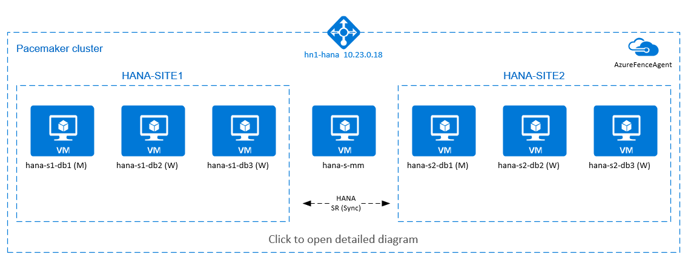

# High availability of SAP HANA scale-out system on Red Hat Enterprise Linux 

[dbms-guide]:dbms-guide.md
[deployment-guide]:deployment-guide.md
[planning-guide]:planning-guide.md

[anf-azure-doc]:https://docs.microsoft.com/azure/azure-netapp-files/
[anf-avail-matrix]:https://azure.microsoft.com/global-infrastructure/services/?products=netapp&regions=all 
[anf-register]:https://docs.microsoft.com/azure/azure-netapp-files/azure-netapp-files-register
[anf-sap-applications-azure]:https://www.netapp.com/us/media/tr-4746.pdf

[2205917]:https://launchpad.support.sap.com/#/notes/2205917
[1944799]:https://launchpad.support.sap.com/#/notes/1944799
[1928533]:https://launchpad.support.sap.com/#/notes/1928533
[2015553]:https://launchpad.support.sap.com/#/notes/2015553
[2178632]:https://launchpad.support.sap.com/#/notes/2178632
[2191498]:https://launchpad.support.sap.com/#/notes/2191498
[2243692]:https://launchpad.support.sap.com/#/notes/2243692
[1984787]:https://launchpad.support.sap.com/#/notes/1984787
[1999351]:https://launchpad.support.sap.com/#/notes/1999351
[1410736]:https://launchpad.support.sap.com/#/notes/1410736
[1900823]:https://launchpad.support.sap.com/#/notes/1900823
[2292690]:https://launchpad.support.sap.com/#/notes/2292690
[2455582]:https://launchpad.support.sap.com/#/notes/2455582
[2593824]:https://launchpad.support.sap.com/#/notes/2593824
[2009879]:https://launchpad.support.sap.com/#/notes/2009879

[sap-swcenter]:https://support.sap.com/en/my-support/software-downloads.html

[sap-hana-ha]:sap-hana-high-availability.md
[nfs-ha]:high-availability-guide-suse-nfs.md


This article describes how to deploy a highly available SAP HANA system in a scale-out configuration with HANA system replication (HSR) and Pacemaker on Azure Red Hat Enterprise Linux virtual machines (VMs). The shared file systems in the presented architecture are provided by [Azure NetApp Files](../../../azure-netapp-files/azure-netapp-files-introduction.md) and are mounted over NFS.  

In the example configurations, installation commands, and so on, the HANA instance is **03** and the HANA system ID is **HN1**. The examples are based on HANA 2.0 SP4 and Red Hat Enterprise Linux for SAP 7.6. 

Before you begin, refer to the following SAP notes and papers:

* SAP Note [1928533] includes:  
  * A list of Azure VM sizes that are supported for the deployment of SAP software
  * Important capacity information for Azure VM sizes
  * Supported SAP software, and operating system (OS) and database combinations
  * The required SAP kernel version for Windows and Linux on Microsoft Azure
* SAP Note [2015553]: Lists prerequisites for SAP-supported SAP software deployments in Azure
* SAP Note [2002167] has recommended OS settings for Red Hat Enterprise Linux
* SAP Note [2009879] has SAP HANA Guidelines for Red Hat Enterprise Linux
* SAP Note [2178632]: Contains detailed information about all monitoring metrics reported for SAP in Azure
* SAP Note [2191498]: Contains the required SAP Host Agent version for Linux in Azure
* SAP Note [2243692]: Contains information about SAP licensing on Linux in Azure
* SAP Note [1999351]: Contains additional troubleshooting information for the Azure Enhanced Monitoring Extension for SAP
* SAP Note [1900823]: Contains information about SAP HANA storage requirements
* [SAP Community Wiki](https://wiki.scn.sap.com/wiki/display/HOME/SAPonLinuxNotes): Contains all required SAP notes for Linux
* [Azure Virtual Machines planning and implementation for SAP on Linux][planning-guide]
* [Azure Virtual Machines deployment for SAP on Linux][deployment-guide]
* [Azure Virtual Machines DBMS deployment for SAP on Linux][dbms-guide]
* [SAP HANA Network Requirements](https://www.sap.com/documents/2016/08/1cd2c2fb-807c-0010-82c7-eda71af511fa.html)
* General RHEL documentation
  * [High Availability Add-On Overview](https://access.redhat.com/documentation/en-us/red_hat_enterprise_linux/7/html/high_availability_add-on_overview/index)
  * [High Availability Add-On Administration](https://access.redhat.com/documentation/en-us/red_hat_enterprise_linux/7/html/high_availability_add-on_administration/index)
  * [High Availability Add-On Reference](https://access.redhat.com/documentation/en-us/red_hat_enterprise_linux/7/html/high_availability_add-on_reference/index)
  * [Red Hat Enterprise Linux Networking Guide](https://access.redhat.com/documentation/en-us/red_hat_enterprise_linux/7/html/networking_guide)
  * [How do I configure SAP HANA Scale-Out System Replication in a Pacemaker cluster with HANA file systems on NFS shares](https://access.redhat.com/solutions/5423971)
* Azure-specific RHEL documentation:
  * [Install SAP HANA on Red Hat Enterprise Linux for Use in Microsoft Azure](https://access.redhat.com/public-cloud/microsoft-azure)
  * [Red Hat Enterprise Linux Solution for SAP HANA Scale-Out and System Replication](https://access.redhat.com/solutions/4386601)
* [NetApp SAP Applications on Microsoft Azure using Azure NetApp Files][anf-sap-applications-azure]
* [Azure NetApp Files documentation][anf-azure-doc] 
* [NFS v4.1 volumes on Azure NetApp Files for SAP HANA](./hana-vm-operations-netapp.md)

## Overview

One method to achieve HANA high availability for HANA scale-out installations, is to configure HANA system replication and protect the solution with Pacemaker cluster to allow automatic failover. When an active node fails, the cluster fails over the HANA resources to the other site.  
The presented configuration shows three HANA nodes on each site, plus majority maker node to prevent split-brain scenario. The instructions can be adapted, to include more VMs as HANA DB nodes.  

The HANA shared file system `/hana/shared` in the presented architecture is provided by [Azure NetApp Files](../../../azure-netapp-files/azure-netapp-files-introduction.md). It is mounted via NFSv4.1 on each HANA node in the same HANA system replication site. File systems `/hana/data` and `/hana/log` are local file systems and are not shared between the HANA DB nodes. SAP HANA will be installed in non-shared mode. 

> [!TIP]
> For recommended SAP HANA storage configurations, see [SAP HANA Azure VMs storage configurations](./hana-vm-operations-storage.md).   

[](./media/sap-hana-high-availability-rhel/sap-hana-high-availability-scale-out-hsr-rhel-detail.png#lightbox)

In the preceding diagram, three subnets are represented within one Azure virtual network, following the SAP HANA network recommendations: 
* for client communication - `client` 10.23.0.0/24  
* for internal HANA inter-node communication - `inter` 10.23.1.128/26  
* for HANA system replication - `hsr` 10.23.1.192/26  

As `/hana/data` and `/hana/log` are deployed on local disks, it is not necessary to deploy separate subnet and separate virtual network cards for communication to the storage.  

The Azure NetApp volumes are deployed in a separate subnet, [delegated to Azure NetApp Files](https://docs.microsoft.com/azure/azure-netapp-files/azure-netapp-files-delegate-subnet: `anf` 10.23.1.0/26.   

## Set up the infrastructure

In the instructions that follow, we assume that you've already created the resource group, the Azure virtual network with three Azure network subnets: `client`, `inter` and `hsr`.

### Deploy Linux virtual machines via the Azure portal
1. Deploy the Azure VMs.  
For the configuration presented in this document, deploy seven virtual machines: 
   - three virtual machines to serve as HANA DB nodes for HANA replication site 1: **hana-s1-db1**, **hana-s1-db2** and **hana-s1-db3**  
   - three virtual machines to serve as HANA DB nodes for HANA replication site 2: **hana-s2-db1**, **hana-s2-db2** and **hana-s2-db3**  
   - a small virtual machine to serve as *majority maker*: **hana-s-mm**

   The VMs, deployed as SAP DB HANA nodes should be certified by SAP for HANA as published in the [SAP HANA Hardware directory](https://www.sap.com/dmc/exp/2014-09-02-hana-hardware/enEN/iaas.html#categories=Microsoft%20Azure). When deploying the HANA DB nodes, make sure that [Accelerated Network](../../../virtual-network/create-vm-accelerated-networking-cli.md) is selected.  
  
   For the majority maker node, you can deploy a small VM, as this VM doesn't run any of the SAP HANA resources. The majority maker VM is used in the cluster configuration to achieve odd number of cluster nodes in a split-brain scenario. The majority maker VM only needs one virtual network interface in the `client` subnet in this example.        

   Deploy local managed disks for `/hana/data` and `/hana/log`. The minimum recommended storage configuration for `/hana/data` and `/hana/log` is described in [SAP HANA Azure VMs storage configurations](./hana-vm-operations-storage.md).

   Deploy the primary network interface for each VM in the `client` virtual network subnet.  
   When the VM is deployed via Azure portal, the network interface name is automatically generated. In these instructions for simplicity we'll refer to the automatically generated, primary network interfaces, which are attached to the `client` Azure virtual network subnet as **hana-s1-db1-client**, **hana-s1-db2-client**, **hana-s1-db3-client**, and so on.  


   > [!IMPORTANT]
   > Make sure that the OS you select is SAP-certified for SAP HANA on the specific VM types you're using. For a list of SAP HANA certified VM types and OS releases for those types, go to the [SAP HANA certified IaaS platforms](https://www.sap.com/dmc/exp/2014-09-02-hana-hardware/enEN/iaas.html#categories=Microsoft%20Azure) site. Click into the details of the listed VM type to get the complete list of SAP HANA-supported OS releases for that type.  
  

2. Create six network interfaces, one for each HANA DB virtual machine, in the `inter` virtual network subnet (in this example, **hana-s1-db1-inter**, **hana-s1-db2-inter**, **hana-s1-db3-inter**, **hana-s2-db1-inter**, **hana-s2-db2-inter**, and **hana-s2-db3-inter**).  

3. Create six network interfaces, one for each HANA DB virtual machine, in the `hsr` virtual network subnet (in this example, **hana-s1-db1-hsr**, **hana-s1-db2-hsr**, **hana-s1-db3-hsr**, **hana-s2-db1-hsr**, **hana-s2-db2-hsr**, and **hana-s2-db3-hsr**).  

4. Attach the newly created virtual network interfaces to the corresponding virtual machines:  

    a. Go to the virtual machine in the [Azure portal](https://portal.azure.com/#home).  

    b. In the left pane, select **Virtual Machines**. Filter on the virtual machine name (for example, **hana-s1-db1**), and then select the virtual machine.  

    c. In the **Overview** pane, select **Stop** to deallocate the virtual machine.  

    d. Select **Networking**, and then attach the network interface. In the **Attach network interface** drop-down list, select the already created network interfaces for the `inter` and `hsr` subnets.  
    
    e. Select **Save**. 
 
    f. Repeat steps b through e for the remaining virtual machines (in our example,  **hana-s1-db2**, **hana-s1-db3**, **hana-s2-db1**, **hana-s2-db2** and **hana-s2-db3**).
 
    g. Leave the virtual machines in stopped state for now. Next, we'll enable [accelerated networking](../../../virtual-network/create-vm-accelerated-networking-cli.md) for all newly attached network interfaces.  

5. Enable accelerated networking for the additional network interfaces for the `inter` and `hsr` subnets by doing the following steps:  

    a. Open [Azure Cloud Shell](https://azure.microsoft.com/features/cloud-shell/) in the [Azure portal](https://portal.azure.com/#home).  

    b. Execute the following commands to enable accelerated networking for the additional network interfaces, which are attached to the `inter` and `hsr` subnets.  

    ```azurecli
    az network nic update --id /subscriptions/your subscription/resourceGroups/your resource group/providers/Microsoft.Network/networkInterfaces/hana-s1-db1-inter --accelerated-networking true
    az network nic update --id /subscriptions/your subscription/resourceGroups/your resource group/providers/Microsoft.Network/networkInterfaces/hana-s1-db2-inter --accelerated-networking true
    az network nic update --id /subscriptions/your subscription/resourceGroups/your resource group/providers/Microsoft.Network/networkInterfaces/hana-s1-db3-inter --accelerated-networking true
    az network nic update --id /subscriptions/your subscription/resourceGroups/your resource group/providers/Microsoft.Network/networkInterfaces/hana-s2-db1-inter --accelerated-networking true
    az network nic update --id /subscriptions/your subscription/resourceGroups/your resource group/providers/Microsoft.Network/networkInterfaces/hana-s2-db2-inter --accelerated-networking true
    az network nic update --id /subscriptions/your subscription/resourceGroups/your resource group/providers/Microsoft.Network/networkInterfaces/hana-s2-db3-inter --accelerated-networking true
    
    az network nic update --id /subscriptions/your subscription/resourceGroups/your resource group/providers/Microsoft.Network/networkInterfaces/hana-s1-db1-hsr --accelerated-networking true
    az network nic update --id /subscriptions/your subscription/resourceGroups/your resource group/providers/Microsoft.Network/networkInterfaces/hana-s1-db2-hsr --accelerated-networking true
    az network nic update --id /subscriptions/your subscription/resourceGroups/your resource group/providers/Microsoft.Network/networkInterfaces/hana-s1-db3-hsr --accelerated-networking true
    az network nic update --id /subscriptions/your subscription/resourceGroups/your resource group/providers/Microsoft.Network/networkInterfaces/hana-s2-db1-hsr --accelerated-networking true
    az network nic update --id /subscriptions/your subscription/resourceGroups/your resource group/providers/Microsoft.Network/networkInterfaces/hana-s2-db2-hsr --accelerated-networking true
    az network nic update --id /subscriptions/your subscription/resourceGroups/your resource group/providers/Microsoft.Network/networkInterfaces/hana-s2-db3-hsr --accelerated-networking true
    ```

7. Start the HANA DB virtual machines

### Deploy Azure Load Balancer

1. We recommend using standard load balancer. Follow these configuration steps to deploy standard load balancer:
   1. First, create a front-end IP pool:

      1. Open the load balancer, select **frontend IP pool**, and select **Add**.
      1. Enter the name of the new front-end IP pool (for example, **hana-frontend**).
      1. Set the **Assignment** to **Static** and enter the IP address (for example, **10.23.0.18**).
      1. Select **OK**.
      1. After the new front-end IP pool is created, note the pool IP address.

   1. Next, create a back-end pool and add all cluster VMs to the backend pool:

      1. Open the load balancer, select **backend pools**, and select **Add**.
      1. Enter the name of the new back-end pool (for example, **hana-backend**).
      1. Select **Add a virtual machine**.
      1. Select **Virtual machine**.
      1. Select the virtual machines of the SAP HANA cluster and their IP addresses for the `client` subnet.
      1. Select **Add**.

   1. Next, create a health probe:

      1. Open the load balancer, select **health probes**, and select **Add**.
      1. Enter the name of the new health probe (for example, **hana-hp**).
      1. Select **TCP** as the protocol and port 625**03**. Keep the **Interval** value set to 5, and the **Unhealthy threshold** value set to 2.
      1. Select **OK**.

   1. Next, create the load-balancing rules:
   
      1. Open the load balancer, select **load balancing rules**, and select **Add**.
      1. Enter the name of the new load balancer rule (for example, **hana-lb**).
      1. Select the front-end IP address, the back-end pool, and the health probe that you created earlier (for example, **hana-frontend**, **hana-backend** and **hana-hp**).
      1. Select **HA Ports**.
      1. Increase the **idle timeout** to 30 minutes.
      1. Make sure to **enable Floating IP**.
      1. Select **OK**.

   > [!IMPORTANT]
   > Floating IP is not supported on a NIC secondary IP configuration in load-balancing scenarios. For details see [Azure Load balancer Limitations](../../../load-balancer/load-balancer-multivip-overview.md#limitations). If you need additional IP address for the VM, deploy a second NIC.    
   
   > [!Note]
   > When VMs without public IP addresses are placed in the backend pool of internal (no public IP address) Standard Azure load balancer, there will be no outbound internet connectivity, unless additional configuration is performed to allow routing to public end points. For details on how to achieve outbound connectivity see [Public endpoint connectivity for Virtual Machines using Azure Standard Load Balancer in SAP high-availability scenarios](./high-availability-guide-standard-load-balancer-outbound-connections.md).  


   > [!IMPORTANT]
   > Do not enable TCP timestamps on Azure VMs placed behind Azure Load Balancer. Enabling TCP timestamps will cause the health probes to fail. Set parameter **net.ipv4.tcp_timestamps** to **0**. For details see [Load Balancer health probes](../../../load-balancer/load-balancer-custom-probe-overview.md).
   > See also SAP note [2382421](https://launchpad.support.sap.com/#/notes/2382421).  

### Deploy the Azure NetApp Files infrastructure 

Deploy the ANF volumes for the `/hana/shared` file system. You will need a separate `/hana/shared` volume for each HANA system replication site. For more information, see [Set up the Azure NetApp Files infrastructure](./sap-hana-scale-out-standby-netapp-files-rhel.md#set-up-the-azure-netapp-files-infrastructure).

In this example, the following Azure NetApp Files volumes were used: 

* volume **HN1**-shared-s1 (nfs://10.23.1.7/**HN1**-shared-s1)
* volume **HN1**-shared-s2 (nfs://10.23.1.7/**HN1**-shared-s2)

## Operating system configuration and preparation

The instructions in the next sections are prefixed with one of the following abbreviations:
* **[A]**: 		Applicable to all nodes
* **[AH]**: 	Applicable to all HANA DB nodes
* **[M]**: 		Applicable to the majority maker node
* **[AH1]**:	Applicable to all HANA DB nodes on SITE 1
* **[AH2]**:	Applicable to all HANA DB nodes on SITE 2
* **[1]**: 		Applicable only to HANA DB node 1, SITE 1
* **[2]**: 		Applicable only to HANA DB node 1, SITE 2


Configure and prepare your OS by doing the following steps:

1. **[A]** Maintain the host files on the virtual machines. Include entries for all subnets. The following entries were added to `/etc/hosts` for this example.  

    ```bash
     # Client subnet
     10.23.0.11 hana-s1-db1
     10.23.0.12 hana-s1-db1
     10.23.0.13 hana-s1-db2
     10.23.0.14 hana-s2-db1
     10.23.0.15 hana-s2-db2
     10.23.0.16 hana-s2-db3
     10.23.0.17 hana-s-mm
     # Internode subnet
     10.23.1.138 hana-s1-db1-inter
     10.23.1.139 hana-s1-db2-inter
     10.23.1.140 hana-s1-db3-inter
     10.23.1.141 hana-s2-db1-inter
     10.23.1.142 hana-s2-db2-inter
     10.23.1.143 hana-s2-db3-inter
     # HSR subnet
     10.23.1.202 hana-s1-db1-hsr
     10.23.1.203 hana-s1-db2-hsr
     10.23.1.204 hana-s1-db3-hsr
     10.23.1.205 hana-s2-db1-hsr
     10.23.1.206 hana-s2-db2-hsr
     10.23.1.207 hana-s2-db3-hsr
    ```


2. **[A]** Install the NFS client package.  

    ```yum install nfs-utils ```


3. **[AH]** Red Hat for HANA configuration.  

    Configure RHEL as described in <https://access.redhat.com/solutions/2447641> and in the following SAP notes:  
   - [2292690 - SAP HANA DB: Recommended OS settings for RHEL 7](https://launchpad.support.sap.com/#/notes/2292690)
   - [2777782 - SAP HANA DB: Recommended OS Settings for RHEL 8](https://launchpad.support.sap.com/#/notes/2777782)
   - [2455582 - Linux: Running SAP applications compiled with GCC 6.x](https://launchpad.support.sap.com/#/notes/2455582)
   - [2593824 - Linux: Running SAP applications compiled with GCC 7.x](https://launchpad.support.sap.com/#/notes/2593824) 
   - [2886607 - Linux: Running SAP applications compiled with GCC 9.x](https://launchpad.support.sap.com/#/notes/2886607)

## Prepare the file systems
### Mount the shared file systems

In this example, the shared HANA file systems are deployed on Azure NetApp Files and mounted over NFSv4.  

1. **[AH]** Create mount points for the HANA database volumes.  

    ```bash
    mkdir -p /hana/shared
    ```

2. **[AH]** Verify the NFS domain setting. Make sure that the domain is configured as the default Azure NetApp Files domain, that is, **`defaultv4iddomain.com`** and the mapping is set to **nobody**.  
   This step is only needed, if using Azure NetAppFiles NFSv4.1.  

    > [!IMPORTANT]
    > Make sure to set the NFS domain in `/etc/idmapd.conf` on the VM to match the default domain configuration on Azure NetApp Files: **`defaultv4iddomain.com`**. If there's a mismatch between the domain configuration on the NFS client (i.e. the VM) and the NFS server, i.e. the Azure NetApp configuration, then the permissions for files on Azure NetApp volumes that are mounted on the VMs will be displayed as `nobody`.  

    ```bash
    sudo cat /etc/idmapd.conf
    # Example
    [General]
    Domain = defaultv4iddomain.com
    [Mapping]
    Nobody-User = nobody
    Nobody-Group = nobody
    ```

3. **[AH]** Verify `nfs4_disable_idmapping`. It should be set to **Y**. To create the directory structure where `nfs4_disable_idmapping` is located, execute the mount command. You won't be able to manually create the directory under /sys/modules, because access is reserved for the kernel / drivers.  
   This step is only needed, if using Azure NetAppFiles NFSv4.1.  

    ```bash
    # Check nfs4_disable_idmapping 
    cat /sys/module/nfs/parameters/nfs4_disable_idmapping
    # If you need to set nfs4_disable_idmapping to Y
    mkdir /mnt/tmp
    mount 10.9.0.4:/HN1-shared /mnt/tmp
    umount  /mnt/tmp
    echo "Y" > /sys/module/nfs/parameters/nfs4_disable_idmapping
    # Make the configuration permanent
    echo "options nfs nfs4_disable_idmapping=Y" >> /etc/modprobe.d/nfs.conf
    ```

   For more information on how to change `nfs4_disable_idmapping` parameter, see https://access.redhat.com/solutions/1749883.

4. **[AH1]** Mount the shared Azure NetApp Files volumes on the SITE1 HANA DB VMs.  

    ```bash
    sudo mount -o rw,vers=4,minorversion=1,hard,timeo=600,rsize=262144,wsize=262144,intr,noatime,lock,_netdev,sec=sys 10.23.1.7:/HN1-shared-s1 /hana/shared
    ```

5. **[AH2]** Mount the shared Azure NetApp Files volumes on the SITE2 HANA DB VMs.  

    ```bash
    sudo mount -o rw,vers=4,minorversion=1,hard,timeo=600,rsize=262144,wsize=262144,intr,noatime,lock,_netdev,sec=sys 10.23.1.7:/HN1-shared-s2 /hana/shared
    ```


10. **[AH]** Verify that the corresponding `/hana/shared/` file systems are mounted on all HANA DB VMs with NFS protocol version **NFSv4**.  

    ```bash
    sudo nfsstat -m
    # Verify that flag vers is set to 4.1 
    # Example from SITE 1, hana-s1-db1
    /hana/shared from 10.23.1.7:/HN1-shared-s1
     Flags: rw,noatime,vers=4.1,rsize=262144,wsize=262144,namlen=255,hard,proto=tcp,timeo=600,retrans=2,sec=sys,clientaddr=10.23.0.11,local_lock=none,addr=10.23.1.7
    # Example from SITE 2, hana-s2-db1
    /hana/shared from 10.23.1.7:/HN1-shared-s2
     Flags: rw,noatime,vers=4.1,rsize=262144,wsize=262144,namlen=255,hard,proto=tcp,timeo=600,retrans=2,sec=sys,clientaddr=10.23.0.14,local_lock=none,addr=10.23.1.7
    ```

### Prepare the data and log local file systems
In the presented configuration, file systems `/hana/data` and `/hana/log` are deployed on managed disk and are locally attached to each HANA DB VM. 
You will need to execute the steps to create the local data and log volumes on each HANA DB virtual machine. 

Set up the disk layout with  **Logical Volume Manager (LVM)**. The following example assumes that each HANA virtual machine has three data disks attached, that are used to create two volumes.

1. **[AH]** List all of the available disks:
    ```bash
    ls /dev/disk/azure/scsi1/lun*
    ```

   Example output:

    ```bash
    /dev/disk/azure/scsi1/lun0  /dev/disk/azure/scsi1/lun1  /dev/disk/azure/scsi1/lun2 
    ```

2. **[AH]** Create physical volumes for all of the disks that you want to use:
    ```bash
    sudo pvcreate /dev/disk/azure/scsi1/lun0
    sudo pvcreate /dev/disk/azure/scsi1/lun1
    sudo pvcreate /dev/disk/azure/scsi1/lun2
    ```

3. **[AH]** Create a volume group for the data files. Use one volume group for the log files and one for the shared directory of SAP HANA:
    ```bash
    sudo vgcreate vg_hana_data_HN1 /dev/disk/azure/scsi1/lun0 /dev/disk/azure/scsi1/lun1
    sudo vgcreate vg_hana_log_HN1 /dev/disk/azure/scsi1/lun2
    ```

4. **[AH]** Create the logical volumes. 
   A linear volume is created when you use `lvcreate` without the `-i` switch. We suggest that you create a striped volume for better I/O performance, and align the stripe sizes to the values documented in [SAP HANA VM storage configurations](./hana-vm-operations-storage.md). The `-i` argument should be the number of the underlying physical volumes and the `-I` argument is the stripe size. In this document, two physical volumes are used for the data volume, so the `-i` switch argument is set to **2**. The stripe size for the data volume is **256 KiB**. One physical volume is used for the log volume, so no `-i` or `-I` switches are explicitly used for the log volume commands.  

   > [!IMPORTANT]
   > Use the `-i` switch and set it to the number of the underlying physical volume when you use more than one physical volume for each data or log volumes. Use the `-I` switch to specify the stripe size, when creating a striped volume.  
   > See [SAP HANA VM storage configurations](./hana-vm-operations-storage.md) for recommended storage configurations, including stripe sizes and number of disks.  

    ```bash
    sudo lvcreate -i 2 -I 256 -l 100%FREE -n hana_data vg_hana_data_HN1
    sudo lvcreate -l 100%FREE -n hana_log vg_hana_log_HN1
    sudo mkfs.xfs /dev/vg_hana_data_HN1/hana_data
    sudo mkfs.xfs /dev/vg_hana_log_HN1/hana_log
    ```

5. **[AH]** Create the mount directories and copy the UUID of all of the logical volumes:
    ```bash
    sudo mkdir -p /hana/data/HN1
    sudo mkdir -p /hana/log/HN1
    # Write down the ID of /dev/vg_hana_data_HN1/hana_data and /dev/vg_hana_log_HN1/hana_log
    sudo blkid
    ```

6. **[AH]** Create `fstab` entries for the logical volumes and mount:
    ```bash
    sudo vi /etc/fstab
    ```

   Insert the following line in the `/etc/fstab` file:

    ```bash
    /dev/disk/by-uuid/UUID of /dev/mapper/vg_hana_data_HN1-hana_data /hana/data/HN1 xfs  defaults,nofail  0  2
    /dev/disk/by-uuid/UUID of /dev/mapper/vg_hana_log_HN1-hana_log /hana/log/HN1 xfs  defaults,nofail  0  2
    ```

   Mount the new volumes:

    ```bash
    sudo mount -a
    ```

## Installation  

In this example for deploying SAP HANA in scale-out configuration with HSR on Azure VMs, we've used HANA 2.0 SP4.  

### Prepare for HANA installation

1. **[AH]** Before the HANA installation, set the root password. You can disable the root password after the installation has been completed. Execute as `root` command `passwd`.  

2. **[1,2]** Change the permissions on `/hana/shared` 
    ```bash
    chmod 775 /hana/shared
    ```

3. **[1]** Verify that you can log in via SSH to the HANA DB VMs in this site **hana-s1-db2** and **hana-s1-db3**, without being prompted for a password.  
   If that is not the case, exchange  ssh keys, as documented in [Using Key-based Authentication](https://access.redhat.com/documentation/en-us/red_hat_enterprise_linux/6/html/deployment_guide/s2-ssh-configuration-keypairs).  
    ```bash
    ssh root@hana-s1-db2
    ssh root@hana-s1-db3
    ```

4. **[2]** Verify that you can log in via SSH to the HANA DB VMs in this site **hana-s2-db2** and **hana-s2-db3**, without being prompted for a password.  
   If that is not the case, exchange  ssh keys, as documented in [Using Key-based Authentication](https://access.redhat.com/documentation/en-us/red_hat_enterprise_linux/6/html/deployment_guide/s2-ssh-configuration-keypairs).  
    ```bash
    ssh root@hana-s2-db2
    ssh root@hana-s2-db3
    ```

5. **[AH]** Install additional packages, which are required for HANA 2.0 SP4. For more information, see SAP Note [2593824](https://launchpad.support.sap.com/#/notes/2593824) for RHEL 7. 

    ```bash
    # If using RHEL 7
    yum install libgcc_s1 libstdc++6 compat-sap-c++-7 libatomic1
    # If using RHEL 8
    yum install libatomic libtool-ltdl.x86_64
    ```


6. **[A]** Disable the firewall temporarily, so that it doesn't interfere with the HANA installation. You can re-enable it, after the HANA installation is done. 
    ```bash
    # Execute as root
    systemctl stop firewalld
    systemctl disable firewalld
    ```

### HANA installation on the first node on each site

1. **[1]** Install SAP HANA by following the instructions in the [SAP HANA 2.0 Installation and Update guide](https://help.sap.com/viewer/2c1988d620e04368aa4103bf26f17727/2.0.04/en-US/7eb0167eb35e4e2885415205b8383584.html). In the instructions that follow, we show the SAP HANA installation on the first node on SITE 1.   

   a. Start the **hdblcm** program as `root` from the HANA installation software directory. Use the `internal_network` parameter and pass the address space for subnet, which is used for the internal HANA inter-node communication.  

    ```bash
    ./hdblcm --internal_network=10.23.1.128/26
    ```

   b. At the prompt, enter the following values:

     * For **Choose an action**: enter **1** (for install)
     * For **Additional components for installation**: enter **2, 3**
     * For installation path: press Enter (defaults to /hana/shared)
     * For **Local Host Name**: press Enter to accept the default
     * For **Do you want to add hosts to the system?**: enter **n**
     * For **SAP HANA System ID**: enter **HN1**
     * For **Instance number** [00]: enter **03**
     * For **Local Host Worker Group** [default]: press Enter to accept the default
     * For **Select System Usage / Enter index [4]**: enter **4** (for custom)
     * For **Location of Data Volumes** [/hana/data/HN1]: press Enter to accept the default
     * For **Location of Log Volumes** [/hana/log/HN1]: press Enter to accept the default
     * For **Restrict maximum memory allocation?** [n]: enter **n**
     * For **Certificate Host Name For Host hana-s1-db1** [hana-s1-db1]: press Enter to accept the default
     * For **SAP Host Agent User (sapadm) Password**: enter the password
     * For **Confirm SAP Host Agent User (sapadm) Password**: enter the password
     * For **System Administrator (hn1adm) Password**: enter the password
     * For **System Administrator Home Directory** [/usr/sap/HN1/home]: press Enter to accept the default
	 * For **System Administrator Login Shell** [/bin/sh]: press Enter to accept the default
	 * For **System Administrator User ID** [1001]: press Enter to accept the default
	 * For **Enter ID of User Group (sapsys)** [79]: press Enter to accept the default
     * For **System Database User (system) Password**: enter the system's password
     * For **Confirm System Database User (system) Password**: enter system's password
     * For **Restart system after machine reboot?** [n]: enter **n** 
     * For **Do you want to continue (y/n)**: validate the summary and if everything looks good, enter **y**

2. **[2]** Repeat the preceding step to install SAP HANA on the first node on SITE 2.   

3. **[1,2]** Verify global.ini  

   Display global.ini, and ensure that the configuration for the internal SAP HANA inter-node communication is in place. Verify the **communication** section. It should have the address space for the `inter` subnet, and `listeninterface` should be set to `.internal`. Verify the **internal_hostname_resolution** section. It should have the IP addresses for the HANA virtual machines that belong to the `inter` subnet.  

   ```bash
     sudo cat /usr/sap/HN1/SYS/global/hdb/custom/config/global.ini
     # Example from SITE1 
     [communication]
     internal_network = 10.23.1.128/26
     listeninterface = .internal
     [internal_hostname_resolution]
     10.23.1.138 = hana-s1-db1
     10.23.1.139 = hana-s1-db2
     10.23.1.140 = hana-s1-db3
   ```

4. **[1,2]** Prepare `global.ini` for installation in non-shared environment, as described in SAP note [2080991](https://launchpad.support.sap.com/#/notes/0002080991).  

   ```bash
    sudo vi /usr/sap/HN1/SYS/global/hdb/custom/config/global.ini
    [persistence]
    basepath_shared = no
   ```

4. **[1,2]** Restart SAP HANA to activate the changes.  

   ```bash
    sudo -u hn1adm /usr/sap/hostctrl/exe/sapcontrol -nr 03 -function StopSystem
    sudo -u hn1adm /usr/sap/hostctrl/exe/sapcontrol -nr 03 -function StartSystem
   ```

6. **[1,2]** Verify that the client interface will be using the IP addresses from the `client` subnet for communication.  

    ```bash
    # Execute as hn1adm
    /usr/sap/HN1/HDB03/exe/hdbsql -u SYSTEM -p "password" -i 03 -d SYSTEMDB 'select * from SYS.M_HOST_INFORMATION'|grep net_publicname
    # Expected result - example from SITE 2
    "hana-s2-db1","net_publicname","10.23.0.14"
   ```

   For information about how to verify the configuration, see SAP Note [2183363 - Configuration of SAP HANA internal network](https://launchpad.support.sap.com/#/notes/2183363).  

7. **[AH]** Change permissions on the data and log directories to avoid HANA installation error.  

   ```bash
    sudo chmod o+w -R /hana/data /hana/log
   ```

8. **[1]** Install the secondary HANA nodes. The example instructions in this step are for SITE 1.  
   a. Start the resident **hdblcm** program as `root`.    
    ```bash
     cd /hana/shared/HN1/hdblcm
     ./hdblcm 
    ```

   b. At the prompt, enter the following values:

     * For **Choose an action**: enter **2** (for add hosts)
     * For **Enter comma separated host names to add**: hana-s1-db2, hana-s1-db3
     * For **Additional components for installation**: enter **2, 3**
     * For **Enter Root User Name [root]**: press Enter to accept the default
     * For **Select roles for host 'hana-s1-db2' [1]**: 1 (for worker)
     * For **Enter Host Failover Group for host 'hana-s1-db2' [default]**: press Enter to accept the default
     * For **Enter Storage Partition Number for host 'hana-s1-db2' [<<assign automatically>>]**: press Enter to accept the default
     * For **Enter Worker Group for host 'hana-s1-db2' [default]**: press Enter to accept the default
     * For **Select roles for host 'hana-s1-db3' [1]**: 1 (for worker)
     * For **Enter Host Failover Group for host 'hana-s1-db3' [default]**: press Enter to accept the default
     * For **Enter Storage Partition Number for host 'hana-s1-db3' [<<assign automatically>>]**: press Enter to accept the default
     * For **Enter Worker Group for host 'hana-s1-db3' [default]**: press Enter to accept the default
     * For **System Administrator (hn1adm) Password**: enter the password
     * For **Enter SAP Host Agent User (sapadm) Password**: enter the password
     * For **Confirm SAP Host Agent User (sapadm) Password**: enter the password
     * For **Certificate Host Name For Host hana-s1-db2** [hana-s1-db2]: press Enter to accept the default
     * For **Certificate Host Name For Host hana-s1-db3** [hana-s1-db3]: press Enter to accept the default
     * For **Do you want to continue (y/n)**: validate the summary and if everything looks good, enter **y**

9. **[2]** Repeat the preceding step to install the secondary SAP HANA nodes on SITE 2.   

## Configure SAP HANA 2.0 System Replication

1. **[1]** Configure System Replication on SITE 1:

   Back up the databases as **hn1**adm:

    ```bash
    hdbsql -d SYSTEMDB -u SYSTEM -p "passwd" -i 03 "BACKUP DATA USING FILE ('initialbackupSYS')"
    hdbsql -d HN1 -u SYSTEM -p "passwd" -i 03 "BACKUP DATA USING FILE ('initialbackupHN1')"
    ```

   Copy the system PKI files to the secondary site:

    ```bash
    scp /usr/sap/HN1/SYS/global/security/rsecssfs/data/SSFS_HN1.DAT hana-s2-db1:/usr/sap/HN1/SYS/global/security/rsecssfs/data/
    scp /usr/sap/HN1/SYS/global/security/rsecssfs/key/SSFS_HN1.KEY  hana-s2-db1:/usr/sap/HN1/SYS/global/security/rsecssfs/key/
    ```

   Create the primary site:

    ```bash
    hdbnsutil -sr_enable --name=HANA_S1
    ```

2. **[2]** Configure System Replication on SITE 2:
    
   Register the second site to start the system replication. Run the following command as <hanasid\>adm:

    ```bash
    sapcontrol -nr 03 -function StopWait 600 10
    hdbnsutil -sr_register --remoteHost=hana-s1-db1 --remoteInstance=03 --replicationMode=sync --name=HANA_S2
    sapcontrol -nr 03 -function StartSystem
    ```

3. **[1]** Check replication status

   Check the replication status and wait until all databases are in sync.

    ```bash
    sudo su - hn1adm -c "python /usr/sap/HN1/HDB03/exe/python_support/systemReplicationStatus.py"
   	# | Database | Host          | Port  | Service Name | Volume ID | Site ID | Site Name | Secondary     | Secondary | Secondary | Secondary | Secondary     | Replication | Replication | Replication    |
	# |          |               |       |              |           |         |           | Host          | Port      | Site ID   | Site Name | Active Status | Mode        | Status      | Status Details |
	# | -------- | ------------- | ----- | ------------ | --------- | ------- | --------- | ------------- | --------- | --------- | --------- | ------------- | ----------- | ----------- | -------------- |
	# | HN1      | hana-s1-db3   | 30303 | indexserver  |         5 |       1 | HANA_S1   | hana-s2-db3   |     30303 |         2 | HANA_S2   | YES           | SYNC        | ACTIVE      |                |
	# | SYSTEMDB | hana-s1-db1   | 30301 | nameserver   |         1 |       1 | HANA_S1   | hana-s2-db1   |     30301 |         2 | HANA_S2   | YES           | SYNC        | ACTIVE      |                |
	# | HN1      | hana-s1-db1   | 30307 | xsengine     |         2 |       1 | HANA_S1   | hana-s2-db1   |     30307 |         2 | HANA_S2   | YES           | SYNC        | ACTIVE      |                |
	# | HN1      | hana-s1-db1   | 30303 | indexserver  |         3 |       1 | HANA_S1   | hana-s2-db1   |     30303 |         2 | HANA_S2   | YES           | SYNC        | ACTIVE      |                |
	# | HN1      | hana-s1-db2   | 30303 | indexserver  |         4 |       1 | HANA_S1   | hana-s2-db2   |     30303 |         2 | HANA_S2   | YES           | SYNC        | ACTIVE      |                |
	#
	# status system replication site "2": ACTIVE
	# overall system replication status: ACTIVE
	#
	# Local System Replication State
	#	
	# mode: PRIMARY
	# site id: 1
	# site name: HANA_S1
    ```

4. **[1,2]** Change the HANA configuration so that communication for HANA system replication if directed though the HANA system replication virtual network interfaces.   
   - Stop HANA on both sites
    ```bash
    sudo -u hn1adm /usr/sap/hostctrl/exe/sapcontrol -nr 03 -function StopSystem HDB
    ```

   - Edit global.ini to add the host mapping for HANA system replication: use the IP addresses from the `hsr` subnet.  
    ```bash
    sudo vi /usr/sap/HN1/SYS/global/hdb/custom/config/global.ini
    #Add the section
    [system_replication_hostname_resolution]
    10.23.1.202 = hana-s1-db1
    10.23.1.203 = hana-s1-db2
    10.23.1.204 = hana-s1-db3
    10.23.1.205 = hana-s2-db1
    10.23.1.206 = hana-s2-db2
    10.23.1.207 = hana-s2-db3
    ```

   - Start HANA on both sites
   ```bash
    sudo -u hn1adm /usr/sap/hostctrl/exe/sapcontrol -nr 03 -function StartSystem HDB
   ```

   For more information, see [Host Name resolution for System Replication](https://help.sap.com/viewer/eb3777d5495d46c5b2fa773206bbfb46/1.0.12/en-US/c0cba1cb2ba34ec89f45b48b2157ec7b.html).  

5. **[AH]** Re-enable the firewall.  
   - Re-enable the firewall
       ```bash
       # Execute as root
       systemctl start firewalld
       systemctl enable firewalld
       ```

   - Open the necessary firewall ports. You will need to adjust the ports for your HANA instance number.  

       > [!IMPORTANT]
       > Create firewall rules to allow HANA inter node communication and client traffic. The required ports are listed on [TCP/IP Ports of All SAP Products](https://help.sap.com/viewer/ports). The following commands are just an example. In this scenario with used system number 03.

       ```bash
        # Execute as root
        sudo firewall-cmd --zone=public --add-port=30301/tcp --permanent
        sudo firewall-cmd --zone=public --add-port=30301/tcp
        sudo firewall-cmd --zone=public --add-port=30303/tcp --permanent
        sudo firewall-cmd --zone=public --add-port=30303/tcp
        sudo firewall-cmd --zone=public --add-port=30306/tcp --permanent
        sudo firewall-cmd --zone=public --add-port=30306/tcp
        sudo firewall-cmd --zone=public --add-port=30307/tcp --permanent
        sudo firewall-cmd --zone=public --add-port=30307/tcp
        sudo firewall-cmd --zone=public --add-port=30313/tcp --permanent
        sudo firewall-cmd --zone=public --add-port=30313/tcp
        sudo firewall-cmd --zone=public --add-port=30315/tcp --permanent
        sudo firewall-cmd --zone=public --add-port=30315/tcp
        sudo firewall-cmd --zone=public --add-port=30317/tcp --permanent
        sudo firewall-cmd --zone=public --add-port=30317/tcp
        sudo firewall-cmd --zone=public --add-port=30340/tcp --permanent
        sudo firewall-cmd --zone=public --add-port=30340/tcp
        sudo firewall-cmd --zone=public --add-port=30341/tcp --permanent
        sudo firewall-cmd --zone=public --add-port=30341/tcp
        sudo firewall-cmd --zone=public --add-port=30342/tcp --permanent
        sudo firewall-cmd --zone=public --add-port=30342/tcp
        sudo firewall-cmd --zone=public --add-port=1128/tcp --permanent
        sudo firewall-cmd --zone=public --add-port=1128/tcp
        sudo firewall-cmd --zone=public --add-port=1129/tcp --permanent
        sudo firewall-cmd --zone=public --add-port=1129/tcp
        sudo firewall-cmd --zone=public --add-port=40302/tcp --permanent
        sudo firewall-cmd --zone=public --add-port=40302/tcp
        sudo firewall-cmd --zone=public --add-port=40301/tcp --permanent
        sudo firewall-cmd --zone=public --add-port=40301/tcp
        sudo firewall-cmd --zone=public --add-port=40307/tcp --permanent
        sudo firewall-cmd --zone=public --add-port=40307/tcp
        sudo firewall-cmd --zone=public --add-port=40303/tcp --permanent
        sudo firewall-cmd --zone=public --add-port=40303/tcp
        sudo firewall-cmd --zone=public --add-port=40340/tcp --permanent
        sudo firewall-cmd --zone=public --add-port=40340/tcp
        sudo firewall-cmd --zone=public --add-port=50313/tcp --permanent
        sudo firewall-cmd --zone=public --add-port=50313/tcp
        sudo firewall-cmd --zone=public --add-port=50314/tcp --permanent
        sudo firewall-cmd --zone=public --add-port=50314/tcp
        sudo firewall-cmd --zone=public --add-port=30310/tcp --permanent
        sudo firewall-cmd --zone=public --add-port=30310/tcp
        sudo firewall-cmd --zone=public --add-port=30302/tcp --permanent
        sudo firewall-cmd --zone=public --add-port=30302/tcp
       ```

## Create a Pacemaker cluster

Follow the steps in [Setting up Pacemaker on Red Hat Enterprise Linux in Azure](high-availability-guide-rhel-pacemaker.md) to create a basic Pacemaker cluster for this HANA server.
Include all virtual machines, including the majority maker in the cluster.  

> [!IMPORTANT]
> Don't set `quorum expected-votes` to 2, as this is not a two node cluster.  
> Make sure that cluster property `concurrent-fencing`  is enabled, so that node fencing is deserialized.   

## Create file system resources

1. **[1,2]** Stop SAP HANA on both replication sites. Execute as <sid\>adm.  

    ```bash
    sapcontrol -nr 03 -function StopSystem
    ```

2. **[AH]** Un-mount file system `/hana/shared`, which was temporarily mounted for the installation on all HANA DB VMs. You will need to stop any processes and sessions, that are using the file system, before you can un-mount it. 
 
    ```bash
    umount /hana/shared 
    ```

3. **[1]** Create the file system cluster resources for `/hana/shared` in disabled state. The resources are created with the option `--disabled`, because you have to define the location constraints, before the mounts are enabled.  

    ```bash
    # /hana/shared file system for site 1
    pcs resource create fs_hana_shared_s1 --disabled ocf:heartbeat:Filesystem device=10.23.1.7:/HN1-shared-s1  directory=/hana/shared \
    fstype=nfs options='defaults,rw,hard,timeo=600,rsize=262144,wsize=262144,proto=tcp,intr,noatime,sec=sys,vers=4.1,lock,_netdev' op monitor interval=20s on-fail=fence timeout=40s OCF_CHECK_LEVEL=20 \
    op start interval=0 timeout=120 op stop interval=0 timeout=120

    # /hana/shared file system for site 2	
    pcs resource create fs_hana_shared_s2 --disabled ocf:heartbeat:Filesystem device=10.23.1.7:/HN1-shared-s1 directory=/hana/shared \
    fstype=nfs options='defaults,rw,hard,timeo=600,rsize=262144,wsize=262144,proto=tcp,intr,noatime,sec=sys,vers=4.1,lock,_netdev' op monitor interval=20s on-fail=fence timeout=40s OCF_CHECK_LEVEL=20 \
    op start interval=0 timeout=120 op stop interval=0 timeout=120

	# clone the /hana/shared file system resources for both site1 and site2
    pcs resource clone fs_hana_shared_s1 meta clone-node-max=1 interleave=true
    pcs resource clone fs_hana_shared_s2 meta clone-node-max=1 interleave=true
    ```
 
   `OCF_CHECK_LEVEL=20` attribute is added to the monitor operation, so that monitor operations perform a read/write test on the file system. Without this attribute, the monitor operation only verifies that the file system is mounted. This can be a problem because when connectivity is lost, the file system may remain mounted, despite being inaccessible.  

   `on-fail=fence` attribute is also added to the monitor operation. With this option, if the monitor operation fails on a node, that node is immediately fenced. Without this option, the default behavior is to stop all resources that depend on the failed resource, then restart the failed resource, then start all the resources that depend on the failed resource. Not only can this behavior take a long time when an SAPHana resource depends on the failed resource, but it also can fail altogether. The SAPHana resource cannot stop successfully, if the NFS share holding the HANA binaries is inaccessible.  

4. **[1]** Configure and verify the node attributes. All SAP HANA DB nodes on replication site 1 are assigned attribute `S1`, and all SAP HANA DB nodes on replication site 2 are assigned attribute `S2`.  

    ```bash
    # HANA replication site 1
    pcs node attribute hana-s1-db1 NFS_SID_SITE=S1
    pcs node attribute hana-s1-db2 NFS_SID_SITE=S1
    pcs node attribute hana-s1-db3 NFS_SID_SITE=S1
	# HANA replication site 2
    pcs node attribute hana-s2-db1 NFS_SID_SITE=S2
    pcs node attribute hana-s2-db2 NFS_SID_SITE=S2
    pcs node attribute hana-s2-db3 NFS_SID_SITE=S2
	#To verify the attribute assignment to nodes execute
    pcs node attribute
    ```

5. **[1]** Configure the constraints, that determine where the NFS file systems will be mounted and enable the file system resources.  
    ```bash
    # Configure the constraints
    pcs constraint location fs_hana_shared_s1-clone rule resource-discovery=never score=-INFINITY NFS_SID_SITE ne S1
    pcs constraint location fs_hana_shared_s2-clone rule resource-discovery=never score=-INFINITY NFS_SID_SITE ne S2
    # Enable the file system resources
    pcs resource enable fs_hana_shared_s1
    pcs resource enable fs_hana_shared_s2
    ```

   When you enable the file system resources, the cluster will mount the `/hana/shared` file systems.
 
6. **[AH]** Verify that the ANF volumes are mounted under `/hana/shared` on all HANA DB VMs on both sites.

    ```bash
    sudo nfsstat -m
    # Verify that flag vers is set to 4.1 
    # Example from SITE 1, hana-s1-db1
    /hana/shared from 10.23.1.7:/HN1-shared-s1
     Flags: rw,noatime,vers=4.1,rsize=262144,wsize=262144,namlen=255,hard,proto=tcp,timeo=600,retrans=2,sec=sys,clientaddr=10.23.0.11,local_lock=none,addr=10.23.1.7
    # Example from SITE 2, hana-s2-db1
    /hana/shared from 10.23.1.7:/HN1-shared-s2
     Flags: rw,noatime,vers=4.1,rsize=262144,wsize=262144,namlen=255,hard,proto=tcp,timeo=600,retrans=2,sec=sys,clientaddr=10.23.0.14,local_lock=none,addr=10.23.1.7
    ```

7. **[1]** Configure the attribute resources. Configure the constraints, that will set the attributes to `true`, if the NFS mounts for `hana/shared` are mounted.  

    ```bash
    # Configure the attribure resources
    pcs resource create hana_nfs_s1_active ocf:pacemaker:attribute active_value=true inactive_value=false name=hana_nfs_s1_active
    pcs resource create hana_nfs_s2_active ocf:pacemaker:attribute active_value=true inactive_value=false name=hana_nfs_s2_active
	# Clone the attribure resources
    pcs resource clone hana_nfs_s1_active meta clone-node-max=1 interleave=true
    pcs resource clone hana_nfs_s2_active meta clone-node-max=1 interleave=true
	# Configure the constraints, which will set the attribute values
    pcs constraint order fs_hana_shared_s1-clone then hana_nfs_s1_active-clone
    pcs constraint order fs_hana_shared_s2-clone then hana_nfs_s2_active-clone
    ```

   > [!TIP]
   > If your configuration includes other file systems, besides /`hana/shared`, which are NFS mounted, then include `sequential=false` option, so that there are no ordering dependencies among the file systems. All NFS mounted file systems must start, before the corresponding attribute resource, but they do not need to start in any order relative to each other. For more information see [How do I configure SAP HANA Scale-Out HSR in a pacemaker cluster when the HANA file systems are NFS shares](https://access.redhat.com/solutions/5423971).  

8. **[1]** Place pacemaker in maintenance mode, in preparation for the creation of the HANA cluster resources.  
    ```bash
    pcs property set maintenance-mode=true
    ```

## Create SAP HANA cluster resources

1. **[A]** Install the HANA scale-out resource agent on all cluster nodes, including the majority maker.    

    ```bash
    yum install -y resource-agents-sap-hana-scaleout 
    ```


   > [!NOTE]
   > Consult [Support Policies for RHEL HA clusters - Management of SAP HANA in a cluster](https://access.redhat.com/articles/3397471) for the minimum supported version of package `resource-agents-sap-hana-scaleout` for your OS release.  

2. **[1,2]** Install the HANA "system replication hook". The hook needs to be installed on one HANA DB node on each system replication site. SAP HANA should be still down.        

   1. Prepare the hook as `root` 
    ```bash
     mkdir -p /hana/shared/myHooks
     cp /usr/share/SAPHanaSR-ScaleOut/SAPHanaSR.py /hana/shared/myHooks
     chown -R hn1adm:sapsys /hana/shared/myHooks
    ```

   2. Adjust `global.ini`
    ```bash
    # add to global.ini
    [ha_dr_provider_SAPHanaSR]
    provider = SAPHanaSR
    path = /hana/shared/myHooks
    execution_order = 1
    
    [trace]
    ha_dr_saphanasr = info
    ```

3. **[AH]** The cluster requires sudoers configuration on the cluster node for <sid\>adm. In this example that is achieved by creating a new file. Execute the commands as `root`.    
    ```bash
    cat << EOF > /etc/sudoers.d/20-saphana
    # SAPHanaSR-ScaleOut needs for srHook
     Cmnd_Alias SOK = /usr/sbin/crm_attribute -n hana_hn1_glob_srHook -v SOK -t crm_config -s SAPHanaSR
     Cmnd_Alias SFAIL = /usr/sbin/crm_attribute -n hana_hn1_glob_srHook -v SFAIL -t crm_config -s SAPHanaSR
     hn1adm ALL=(ALL) NOPASSWD: SOK, SFAIL
     EOF
    ```

4. **[1,2]** Start SAP HANA on both replication sites. Execute as <sid\>adm.  

    ```bash
    sapcontrol -nr 03 -function StartSystem 
    ```

5. **[1]** Verify the hook installation. Execute as <sid\>adm on the active HANA system replication site.   

    ```bash
    cdtrace
     awk '/ha_dr_SAPHanaSR.*crm_attribute/ \
     { printf "%s %s %s %s\n",$2,$3,$5,$16 }' nameserver_*

     # Example entries
	 # 2020-07-21 22:04:32.364379 ha_dr_SAPHanaSR SFAIL
	 # 2020-07-21 22:04:46.905661 ha_dr_SAPHanaSR SFAIL
     # 2020-07-21 22:04:52.092016 ha_dr_SAPHanaSR SFAIL
     # 2020-07-21 22:04:52.782774 ha_dr_SAPHanaSR SFAIL
     # 2020-07-21 22:04:53.117492 ha_dr_SAPHanaSR SFAIL
     # 2020-07-21 22:06:35.599324 ha_dr_SAPHanaSR SOK
    ```

6. **[1]** Create the HANA cluster resources. Execute the following commands as `root`.    
   1. Make sure the cluster is already maintenance mode.  
    
   2. Next, create the HANA Topology resource.  
      If building RHEL **7.x** cluster, use the following commands:  
      ```bash
      pcs resource create SAPHanaTopology_HN1_HDB03 SAPHanaTopologyScaleOut \
       SID=HN1 InstanceNumber=03 \
       op start timeout=600 op stop timeout=300 op monitor interval=10 timeout=600

      pcs resource clone SAPHanaTopology_HN1_HDB03 meta clone-node-max=1 interleave=true
      ```

      If building RHEL **8.x** cluster, use the following commands:  
      ```bash
      pcs resource create SAPHanaTopology_HN1_HDB03 SAPHanaTopology \
       SID=HN1 InstanceNumber=03 meta clone-node-max=1 interleave=true \
       op methods interval=0s timeout=5 \
       op start timeout=600 op stop timeout=300 op monitor interval=10 timeout=600

      pcs resource clone SAPHanaTopology_HN1_HDB03 meta clone-node-max=1 interleave=true
      ```

   3. Next, create the HANA instance resource.  
      > [!NOTE]
      > This article contains references to the term *slave*, a term that Microsoft no longer uses. When the term is removed from the software, we’ll remove it from this article.  
 
      If building RHEL **7.x** cluster, use the following commands:    
      ```bash
      pcs resource create SAPHana_HN1_HDB03 SAPHanaController \
       SID=HN1 InstanceNumber=03 PREFER_SITE_TAKEOVER=true DUPLICATE_PRIMARY_TIMEOUT=7200 AUTOMATED_REGISTER=false \
       op start interval=0 timeout=3600 op stop interval=0 timeout=3600 op promote interval=0 timeout=3600 \
       op monitor interval=60 role="Master" timeout=700 op monitor interval=61 role="Slave" timeout=700
     
      pcs resource master msl_SAPHana_HN1_HDB03 SAPHana_HN1_HDB03 \
       meta master-max="1" clone-node-max=1 interleave=true
      ```

      If building RHEL **8.x** cluster, use the following commands:  
      ```bash
      pcs resource create SAPHana_HN1_HDB03 SAPHanaController \
       SID=HN1 InstanceNumber=03 PREFER_SITE_TAKEOVER=true DUPLICATE_PRIMARY_TIMEOUT=7200 AUTOMATED_REGISTER=false \
       op demote interval=0s timeout=320 op methods interval=0s timeout=5 \
       op start interval=0 timeout=3600 op stop interval=0 timeout=3600 op promote interval=0 timeout=3600 \
       op monitor interval=60 role="Master" timeout=700 op monitor interval=61 role="Slave" timeout=700
     
      pcs resource promotable SAPHana_HN1_HDB03 \
       meta master-max="1" clone-node-max=1 interleave=true
      ```
      > [!IMPORTANT]
      > We recommend as a best practice that you only set AUTOMATED_REGISTER to **no**, while performing thorough fail-over tests, to prevent failed primary instance to automatically register as secondary. Once the fail-over tests have completed successfully, set AUTOMATED_REGISTER to **yes**, so that after takeover system replication can resume automatically. 

   4. Create Virtual IP and associated resources.  
      ```bash
      pcs resource create vip_HN1_03 ocf:heartbeat:IPaddr2 ip=10.23.0.18 op monitor interval="10s" timeout="20s"
      sudo pcs resource create nc_HN1_03 azure-lb port=62503
      sudo pcs resource group add g_ip_HN1_03 nc_HN1_03 vip_HN1_03
      ```

   5. Create the cluster constraints  
      If building RHEL **7.x** cluster, use the following commands:  
      ```bash
      #Start HANA topology, before the HANA instance
      pcs constraint order SAPHanaTopology_HN1_HDB03-clone then msl_SAPHana_HN1_HDB03

      pcs constraint colocation add g_ip_HN1_03 with master msl_SAPHana_HN1_HDB03 4000
      #HANA resources are only allowed to run on a node, if the node's NFS file systems are mounted. The constraint also avoids the majority maker node
      pcs constraint location SAPHanaTopology_HN1_HDB03-clone rule resource-discovery=never score=-INFINITY hana_nfs_s1_active ne true and hana_nfs_s2_active ne true
      ```
 
      If building RHEL **8.x** cluster, use the following commands:  
      ```bash
      #Start HANA topology, before the HANA instance
      pcs constraint order SAPHanaTopology_HN1_HDB03-clone then SAPHana_HN1_HDB03-clone

      pcs constraint colocation add g_ip_HN1_03 with master SAPHana_HN1_HDB03-clone 4000
      #HANA resources are only allowed to run on a node, if the node's NFS file systems are mounted. The constraint also avoids the majority maker node
      pcs constraint location SAPHanaTopology_HN1_HDB03-clone rule resource-discovery=never score=-INFINITY hana_nfs_s1_active ne true and hana_nfs_s2_active ne true
      ```

7. **[1]** Place the cluster out of maintenance mode. Make sure that the cluster status is ok and that all of the resources are started.  
    ```bash
    sudo pcs property set maintenance-mode=false
    #If there are failed cluster resources, you may need to run the next command
    pcs resource cleanup
    ```
  
   > [!NOTE]
   > The timeouts in the above configuration are just examples and may need to be adapted to the specific HANA setup. For instance, you may need to increase the start timeout, if it takes longer to start the SAP HANA database.
  
## Test SAP HANA failover 

1. Before you start a test, check the cluster and SAP HANA system replication status.  

   a. Verify that there are no failed cluster actions  
     ```bash
     #Verify that there are no failed cluster actions
     pcs status
     # Example
     #Stack: corosync
     #Current DC: hana-s-mm (version 1.1.19-8.el7_6.5-c3c624ea3d) - partition with quorum
     #Last updated: Thu Sep 24 06:00:20 2020
     #Last change: Thu Sep 24 05:59:17 2020 by root via crm_attribute on hana-s1-db1
     #
     #7 nodes configured
     #45 resources configured
     #
     #Online: [ hana-s-mm hana-s1-db1 hana-s1-db2 hana-s1-db3 hana-s2-db1 hana-s2-db2 hana-s2-db3 ]
     #
     #Active resources:
     #
     #rsc_st_azure    (stonith:fence_azure_arm):      Started hana-s-mm
     #Clone Set: fs_hana_shared_s1-clone [fs_hana_shared_s1]
     #    Started: [ hana--s1-db1 hana-s1-db2 hana-s1-db3 ]
     #Clone Set: fs_hana_shared_s2-clone [fs_hana_shared_s2]
     #    Started: [ hana-s2-db1 hana-s2-db2 hana-s2-db3 ]
     #Clone Set: hana_nfs_s1_active-clone [hana_nfs_s1_active]
     #    Started: [ hana-s1-db1 hana-s1-db2 hana-s1-db3 ]
     #Clone Set: hana_nfs_s2_active-clone [hana_nfs_s2_active]
     #    Started: [ hana-s2-db1 hana-s2-db2 hana-s2-db3 ]
     #Clone Set: SAPHanaTopology_HN1_HDB03-clone [SAPHanaTopology_HN1_HDB03]
     #    Started: [ hana-s1-db1 hana-s1-db2 hana-s1-db3 hana-s2-db1 hana-s2-db2 hana-s2-db3 ]
     #Master/Slave Set: msl_SAPHana_HN1_HDB03 [SAPHana_HN1_HDB03]
     #    Masters: [ hana-s1-db1 ]
     #    Slaves: [ hana-s1-db2 hana-s1-db3 hana-s2-db1 hana-s2-db2 hana-s2-db3 ]
     #Resource Group: g_ip_HN1_03
     #    nc_HN1_03  (ocf::heartbeat:azure-lb):      Started hana-s1-db1
     #    vip_HN1_03 (ocf::heartbeat:IPaddr2):       Started hana-s1-db1
     ```

   b. Verify that SAP HANA system replication is in sync

      ```bash
      # Verify HANA HSR is in sync
      sudo su - hn1adm -c "python /usr/sap/HN1/HDB03/exe/python_support/systemReplicationStatus.py"
      #| Database | Host        | Port  | Service Name | Volume ID | Site ID | Site Name | Secondary     | Secondary| Secondary | Secondary | Secondary     | Replication | Replication | Replication    |
      #|          |             |       |              |           |         |           | Host          | Port     | Site ID   | Site Name | Active Status | Mode        | Status      | Status Details |
      #| -------- | ----------- | ----- | ------------ | --------- | ------- | --------- | ------------- | -------- | --------- | --------- | ------------- | ----------- | ----------- | -------------- |
      #| HN1      | hana-s1-db3 | 30303 | indexserver  |         5 |       2 | HANA_S1   | hana-s2-db3 |     30303  |         1 | HANA_S2   | YES           | SYNC        | ACTIVE      |                |
      #| HN1      | hana-s1-db2 | 30303 | indexserver  |         4 |       2 | HANA_S1   | hana-s2-db2 |     30303  |         1 | HANA_S2   | YES           | SYNC        | ACTIVE      |                |  
      #| SYSTEMDB | hana-s1-db1 | 30301 | nameserver   |         1 |       2 | HANA_S1   | hana-s2-db1 |     30301  |         1 | HANA_S2   | YES           | SYNC        | ACTIVE      |                |
      #| HN1      | hana-s1-db1 | 30307 | xsengine     |         2 |       2 | HANA_S1   | hana-s2-db1 |     30307  |         1 | HANA_S2   | YES           | SYNC        | ACTIVE      |                |
      #| HN1      | hana-s1-db1 | 30303 | indexserver  |         3 |       2 | HANA_S1   | hana-s2-db1 |     30303  |         1 | HANA_S2   | YES           | SYNC        | ACTIVE      |                |

      #status system replication site "1": ACTIVE
      #overall system replication status: ACTIVE

      #Local System Replication State
      #~~~~~~~~~~~~~~~~~~~~~~~~~~~~~~

      #mode: PRIMARY
      #site id: 1
      #site name: HANA_S1
      ```

2. Verify the cluster configuration for a failure scenario, when a node loses access to the NFS share (`/hana/shared`).  

   The SAP HANA resource agents depend on binaries, stored on `/hana/shared` to perform operations during failover. File system `/hana/shared` is mounted over NFS in the presented configuration. A test that can be performed, is to remount the `/hana/shared` file system as *Read only*. This approach validates that the cluster will fail over, if access to `/hana/shared` is lost on the active system replication site.  

   **Expected result**: When you remount `/hana/shared` as *Read only*, the monitoring operation that performs read/write operation on file system, will fail, as it is not able to write to the file system and will trigger HANA resource failover. The same result is expected when your HANA node loses access to the NFS share.  
     
   You can check the state of the cluster resources by executing `crm_mon` or `pcs status`. Resource state before starting the test:
      ```bash
      # Output of crm_mon
      #7 nodes configured
      #45 resources configured

      #Online: [ hana-s-mm hana-s1-db1 hana-s1-db2 hana-s1-db3 hana-s2-db1 hana-s2-db2 hana-s2-db3 ]
      #
      #Active resources:

      #rsc_st_azure    (stonith:fence_azure_arm):      Started hana-s-mm
      # Clone Set: fs_hana_shared_s1-clone [fs_hana_shared_s1]
      #    Started: [ hana-s1-db1 hana-s1-db2 hana-s1-db3 ]
      # Clone Set: fs_hana_shared_s2-clone [fs_hana_shared_s2]
      #     Started: [ hana-s2-db1 hana-s2-db2 hana-s2-db3 ]
      # Clone Set: hana_nfs_s1_active-clone [hana_nfs_s1_active]
      #     Started: [ hana-s1-db1 hana-s1-db2 hana-s1-db3 ]
      # Clone Set: hana_nfs_s2_active-clone [hana_nfs_s2_active]
      #     Started: [ hana-s2-db1 hana-s2-db2 hana-s2-db3 ]
      # Clone Set: SAPHanaTopology_HN1_HDB03-clone [SAPHanaTopology_HN1_HDB03]
      #     Started: [ hana-s1-db1 hana-s1-db2 hana-s1-db3 hana-s2-db1 hana-s2-db2 hana-s2-db3 ]
      # Master/Slave Set: msl_SAPHana_HN1_HDB03 [SAPHana_HN1_HDB03]
      #     Masters: [ hana-s1-db1 ]
      #     Slaves: [ hana-s1-db2 hana-s1-db3 hana-s2-db1 hana-s2-db2 hana-s2-db3 ]
      # Resource Group: g_ip_HN1_03
      #     nc_HN1_03  (ocf::heartbeat:azure-lb):      Started hana-s1-db1
      #     vip_HN1_03 (ocf::heartbeat:IPaddr2):       Started hana-s1-db1
      ```

   To simulate failure for `/hana/shared` on one of the primary replication site VMs, execute the following command:
      ```bash
      # Execute as root 
      mount -o ro /hana/shared
      # Or if the above command returns an error
      sudo mount -o ro 10.23.1.7/HN1-shared-s1 /hana/shared
      ```
  
   The HANA VM, that lost access to to `/hana/shared` should restart or stop, depending on the cluster configuration. The cluster resources are migrated to the other HANA system replication site.  
         
   If the cluster has not started on the VM, that was restarted, start the cluster by executing: 

      ```bash
      # Start the cluster 
      pcs cluster start
      ```
   
   When the cluster starts, file system `/hana/shared` will be automatically mounted.     
   If you set AUTOMATED_REGISTER="false", you will need to configure SAP HANA system replication on secondary site. In this case, you can execute these commands to reconfigure SAP HANA as secondary.   

      ```bash
      # Execute on the secondary 
      su - hn1adm
      # Make sure HANA is not running on the secondary site. If it is started, stop HANA
      sapcontrol -nr 03 -function StopWait 600 10
      # Register the HANA secondary site
      hdbnsutil -sr_register --name=HANA_S1 --remoteHost=hana-s2-db1 --remoteInstance=03 --replicationMode=sync
      # Switch back to root and cleanup failed resources
      pcs resource cleanup SAPHana_HN1_HDB03
      ```

   The state of the resources, after the test: 

      ```bash
      # Output of crm_mon
      #7 nodes configured
      #45 resources configured
	
      #Online: [ hana-s-mm hana-s1-db1 hana-s1-db2 hana-s1-db3 hana-s2-db1 hana-s2-db2 hana-s2-db3 ]
	  
      #Active resources:
	
      #rsc_st_azure    (stonith:fence_azure_arm):      Started hana-s-mm
      # Clone Set: fs_hana_shared_s1-clone [fs_hana_shared_s1]
      #    Started: [ hana-s1-db1 hana-s1-db2 hana-s1-db3 ]
      # Clone Set: fs_hana_shared_s2-clone [fs_hana_shared_s2]
      #     Started: [ hana-s2-db1 hana-s2-db2 hana-s2-db3 ]
      # Clone Set: hana_nfs_s1_active-clone [hana_nfs_s1_active]
      #     Started: [ hana-s1-db1 hana-s1-db2 hana-s1-db3 ]
      # Clone Set: hana_nfs_s2_active-clone [hana_nfs_s2_active]
      #     Started: [ hana-s2-db1 hana-s2-db2 hana-s2-db3 ]
      # Clone Set: SAPHanaTopology_HN1_HDB03-clone [SAPHanaTopology_HN1_HDB03]
      #     Started: [ hana-s1-db1 hana-s1-db2 hana-s1-db3 hana-s2-db1 hana-s2-db2 hana-s2-db3 ]
      # Master/Slave Set: msl_SAPHana_HN1_HDB03 [SAPHana_HN1_HDB03]
      #     Masters: [ hana-s2-db1 ]
      #     Slaves: [ hana-s1-db1 hana-s1-db2 hana-s1-db3 hana-s2-db2 hana-s2-db3 ]
      # Resource Group: g_ip_HN1_03
      #     nc_HN1_03  (ocf::heartbeat:azure-lb):      Started hana-s2-db1
      #     vip_HN1_03 (ocf::heartbeat:IPaddr2):       Started hana-s2-db1
      ```


We recommend to thoroughly test the SAP HANA cluster configuration, by also performing the tests, documented in [HA for SAP HANA on Azure VMs on RHEL](./sap-hana-high-availability-rhel.md#test-the-cluster-setup).


## Next steps

* [Azure Virtual Machines planning and implementation for SAP][planning-guide]
* [Azure Virtual Machines deployment for SAP][deployment-guide]
* [Azure Virtual Machines DBMS deployment for SAP][dbms-guide]
* [NFS v4.1 volumes on Azure NetApp Files for SAP HANA](./hana-vm-operations-netapp.md)
* To learn how to establish high availability and plan for disaster recovery of SAP HANA on Azure VMs, see [High Availability of SAP HANA on Azure Virtual Machines (VMs)][sap-hana-ha].