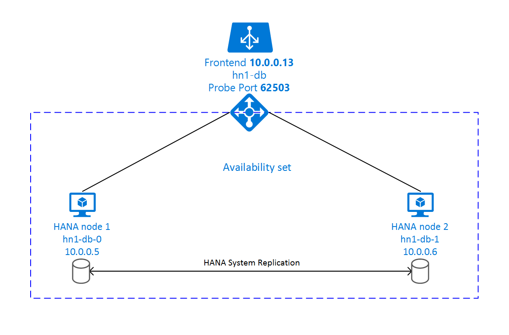

# High Availability of SAP HANA on Azure Virtual Machines (VMs)

[dbms-guide]:dbms-guide.md
[deployment-guide]:deployment-guide.md
[planning-guide]:planning-guide.md

[2205917]:https://launchpad.support.sap.com/#/notes/2205917
[1944799]:https://launchpad.support.sap.com/#/notes/1944799
[1928533]:https://launchpad.support.sap.com/#/notes/1928533
[2015553]:https://launchpad.support.sap.com/#/notes/2015553
[2178632]:https://launchpad.support.sap.com/#/notes/2178632
[2191498]:https://launchpad.support.sap.com/#/notes/2191498
[2243692]:https://launchpad.support.sap.com/#/notes/2243692
[1984787]:https://launchpad.support.sap.com/#/notes/1984787
[1999351]:https://launchpad.support.sap.com/#/notes/1999351
[2388694]:https://launchpad.support.sap.com/#/notes/2388694

[hana-ha-guide-replication]:sap-hana-high-availability.md#14c19f65-b5aa-4856-9594-b81c7e4df73d
[hana-ha-guide-shared-storage]:sap-hana-high-availability.md#498de331-fa04-490b-997c-b078de457c9d

[suse-hana-ha-guide]:https://www.suse.com/docrep/documents/ir8w88iwu7/suse_linux_enterprise_server_for_sap_applications_12_sp1.pdf
[sap-swcenter]:https://launchpad.support.sap.com/#/softwarecenter
[template-multisid-db]:https://portal.azure.com/#create/Microsoft.Template/uri/https%3A%2F%2Fraw.githubusercontent.com%2FAzure%2Fazure-quickstart-templates%2Fmaster%2Fsap-3-tier-marketplace-image-multi-sid-db-md%2Fazuredeploy.json
[template-converged]:https://portal.azure.com/#create/Microsoft.Template/uri/https%3A%2F%2Fraw.githubusercontent.com%2FAzure%2Fazure-quickstart-templates%2Fmaster%2Fsap-3-tier-marketplace-image-converged%2Fazuredeploy.json

On-premises, you can use either HANA System Replication or use shared storage to establish high availability for SAP HANA.
On Azure VMs  HANA System Replication on Azure is the only supported High Availability function so far. 
SAP HANA Replication consists of one primary node and at least one secondary node. Changes to the data on the primary node are replicated to the secondary node synchronously or asynchronously.

This article describes how to deploy the virtual machines, configure the virtual machines, install the cluster framework, install and configure SAP HANA System Replication.
In the example configurations, installation commands etc. instance number 03 and HANA System ID HN1 is used.

Read the following SAP Notes and papers first

* SAP Note [1928533], which has:
  * List of Azure VM sizes that are supported for the deployment of SAP software
  * Important capacity information for Azure VM sizes
  * Supported SAP software, and operating system (OS) and database combinations
  * Required SAP kernel version for Windows and Linux on Microsoft Azure
* SAP Note [2015553] lists prerequisites for SAP-supported SAP software deployments in Azure.
* SAP Note [2205917] has recommended OS settings for SUSE Linux Enterprise Server for SAP Applications
* SAP Note [1944799] has SAP HANA Guidelines for SUSE Linux Enterprise Server for SAP Applications
* SAP Note [2178632] has detailed information about all monitoring metrics reported for SAP in Azure.
* SAP Note [2191498] has the required SAP Host Agent version for Linux in Azure.
* SAP Note [2243692] has information about SAP licensing on Linux in Azure.
* SAP Note [1984787] has general information about SUSE Linux Enterprise Server 12.
* SAP Note [1999351] has additional troubleshooting information for the Azure Enhanced Monitoring Extension for SAP.
* [SAP Community WIKI](https://wiki.scn.sap.com/wiki/display/HOME/SAPonLinuxNotes) has all required SAP Notes for Linux.
* [Azure Virtual Machines planning and implementation for SAP on Linux][planning-guide]
* [Azure Virtual Machines deployment for SAP on Linux (this article)][deployment-guide]
* [Azure Virtual Machines DBMS deployment for SAP on Linux][dbms-guide]
* [SAP HANA SR Performance Optimized Scenario][suse-hana-ha-guide]
  The guide contains all required information to set up SAP HANA System Replication on-premises. Use this guide as a baseline.

## Overview

To achieve high availability, SAP HANA is installed on two virtual machines. The data is replicated using HANA System Replication.



The SAP HANA SR setup uses a dedicated virtual hostname and virtual IP addresses. On Azure, a load balancer is required to use a virtual IP address. The following list shows the configuration of the load balancer.

* Frontend configuration
  * IP address 10.0.0.13 for hn1-db
* Backend configuration
  * Connected to primary network interfaces of all virtual machines that should be part of HANA System Replication
* Probe Port
  * Port 62503
* Loadbalancing rules
  * 30313 TCP
  * 30315 TCP
  * 30317 TCP

## Deploying Linux

The resource agent for SAP HANA is included in SUSE Linux Enterprise Server for SAP Applications.
The Azure Marketplace contains an image for SUSE Linux Enterprise Server for SAP Applications 12 that you can use to deploy new virtual machines.

### Deploy with template
You can use one of the quickstart templates on github to deploy all required resources. The template deploys the virtual machines, the load balancer, availability set etc.
To deploy the template, follow these steps:

1. Open the [database template][template-multisid-db] or the [converged template][template-converged] on the Azure portal. 
   The database template only creates the load-balancing rules for a database whereas the converged template also creates the load-balancing rules for an ASCS/SCS and ERS (Linux only) instance. If you plan to install an SAP NetWeaver based system and you also want to install the ASCS/SCS instance on the same machines, use the [converged template][template-converged].
1. Enter the following parameters
    1. Sap System ID  
       Enter the SAP system ID of the SAP system you want to install. The ID is going to be used as a prefix for the resources that are deployed.
    1. Stack Type (only applicable if you use the converged template)   
       Select the SAP NetWeaver stack type
    1. Os Type  
       Select one of the Linux distributions. For this example, select SLES 12
    1. Db Type  
       Select HANA
    1. Sap System Size  
       The amount of SAPS the new system is going to provide. If you are not sure how many SAPS the system requires, ask your SAP Technology Partner or System Integrator
    1. System Availability  
       Select HA
    1. Admin Username and Admin Password  
       A new user is created that can be used to log on to the machine.
    1. New Or Existing Subnet  
       Determines whether a new virtual network and subnet should be created or an existing subnet should be used. If you already have a virtual network that is connected to your on-premises network, select existing.
    1. Subnet ID  
    The ID of the subnet to which the virtual machines should be connected to. To connect the virtual machine to your on-premises network, select the subnet of your VPN or Express Route virtual network. The ID usually looks like /subscriptions/`<subscription ID`>/resourceGroups/`<resource group name`>/providers/Microsoft.Network/virtualNetworks/`<virtual network name`>/subnets/`<subnet name`>

### Manual Deployment

1. Create a Resource Group
1. Create a Virtual Network
1. Create an Availability Set  
   Set max update domain
1. Create a Load Balancer (internal)  
   Select VNET created in the second
1. Create Virtual Machine 1  
   Use at least SLES4SAP 12 SP1, in this example we will use the SLES4SAP 12 SP2 image
   https://ms.portal.azure.com/#create/SUSE.SUSELinuxEnterpriseServerforSAPApplications12SP2PremiumImage-ARM  
   SLES for SAP 12 SP2 (Premium)  
   Select Availability Set created earlier  
1. Create Virtual Machine 2  
   Use at least SLES4SAP 12 SP1, in this example we will use the SLES4SAP 12 SP1 BYOS image
   https://ms.portal.azure.com/#create/SUSE.SUSELinuxEnterpriseServerforSAPApplications12SP2PremiumImage-ARM  
   SLES for SAP 12 SP2 (Premium)  
   Select Availability Set created earlier  
1. Add Data Disks
1. Configure the load balancer
    1. Create a frontend IP pool
        1. Open the load balancer, select frontend IP pool, and click Add
        1. Enter the name of the new frontend IP pool (for example hana-frontend)
        1. Set the Assignment to Static and enter the IP address (for example **10.0.0.13**)
        1. Click OK
        1. After the new frontend IP pool is created, write down its IP address
    1. Create a backend pool
        1. Open the load balancer, select backend pools, and click Add
        1. Enter the name of the new backend pool (for example hana-backend)
        1. Click Add a virtual machine
        1. Select the Availability Set you created earlier
        1. Select the virtual machines of the SAP HANA cluster
        1. Click OK
    1. Create a health probe
        1. Open the load balancer, select health probes, and click Add
        1. Enter the name of the new health probe (for example hana-hp)
        1. Select TCP as protocol, port 625**03**, keep Interval 5 and Unhealthy threshold 2
        1. Click OK
    1. SAP HANA 1.0: Create load balancing rules
        1. Open the load balancer, select load balancing rules and click Add
        1. Enter the name of the new load balancer rule (for example hana-lb-3**03**15)
        1. Select the frontend IP address, backend pool, and health probe you created earlier (for example hana-frontend)
        1. Keep protocol TCP, enter port 3**03**15
        1. Increase idle timeout to 30 minutes
        1. **Make sure to enable Floating IP**
        1. Click OK
        1. Repeat the steps above for port 3**03**17
    1. SAP HANA 2.0: Create load balancing rules for system database
        1. Open the load balancer, select load balancing rules and click Add
        1. Enter the name of the new load balancer rule (for example hana-lb-3**03**13)
        1. Select the frontend IP address, backend pool, and health probe you created earlier (for example hana-frontend)
        1. Keep protocol TCP, enter port 3**03**13
        1. Increase idle timeout to 30 minutes
        1. **Make sure to enable Floating IP**
        1. Click OK
        1. Repeat the steps above for port 3**03**14
    1. SAP HANA 2.0: Create load balancing rules for first the tenant database
        1. Open the load balancer, select load balancing rules and click Add
        1. Enter the name of the new load balancer rule (for example hana-lb-3**03**40)
        1. Select the frontend IP address, backend pool, and health probe you created earlier (for example hana-frontend)
        1. Keep protocol TCP, enter port 3**03**40
        1. Increase idle timeout to 30 minutes
        1. **Make sure to enable Floating IP**
        1. Click OK
        1. Repeat the steps above for port  3**03**41 and 3**03**42

For more information about the required ports for SAP HANA, read chapter [Connections to Tenant Databases](https://help.sap.com/viewer/78209c1d3a9b41cd8624338e42a12bf6/latest/en-US/7a9343c9f2a2436faa3cfdb5ca00c052.html) of the [SAP HANA Tenant Databases](https://help.sap.com/viewer/78209c1d3a9b41cd8624338e42a12bf6) guide or [SAP Note 2388694][2388694].


## Create Pacemaker cluster

Follow the steps in [Setting up Pacemaker on SUSE Linux Enterprise Server in Azure](high-availability-guide-suse-pacemaker.md) to create a basic Pacemaker cluster for this HANA server. You can also use the same Pacemaker cluster for SAP HANA and SAP NetWeaver (A)SCS.

## Installing SAP HANA

The following items are prefixed with either **[A]** - applicable to all nodes, **[1]** - only applicable to node 1 or **[2]** - only applicable to node 2 of the Pacemaker cluster.

1. **[A]** Setup disk layout
    1. LVM  
       
       We generally recommend using LVM for volumes that store data and log files. The example following assumes that the virtual machines have four data disks attached that should be used to create two volumes.

       List all available disks
       
       <pre><code>
       ls /dev/disk/azure/scsi1/lun*
       </code></pre>
       
       Example output
       
       ```
       /dev/disk/azure/scsi1/lun0  /dev/disk/azure/scsi1/lun1  /dev/disk/azure/scsi1/lun2  /dev/disk/azure/scsi1/lun3
       ```
       
       Create physical volumes for all disks that you want to use.    
       <pre><code>
       sudo pvcreate /dev/disk/azure/scsi1/lun0
       sudo pvcreate /dev/disk/azure/scsi1/lun1
       sudo pvcreate /dev/disk/azure/scsi1/lun2
       sudo pvcreate /dev/disk/azure/scsi1/lun3
       </code></pre>

       Create a volume group for the data files, one volume group for the log files and one for the shared directory of SAP HANA

       <pre><code>
       sudo vgcreate vg_hana_data_<b>HN1</b> /dev/disk/azure/scsi1/lun0 /dev/disk/azure/scsi1/lun1
       sudo vgcreate vg_hana_log_<b>HN1</b> /dev/disk/azure/scsi1/lun2
       sudo vgcreate vg_hana_shared_<b>HN1</b> /dev/disk/azure/scsi1/lun3
       </code></pre>
       
       Create the logical volumes

       <pre><code>
       sudo lvcreate -l 100%FREE -n hana_data vg_hana_data_<b>HN1</b>
       sudo lvcreate -l 100%FREE -n hana_log vg_hana_log_<b>HN1</b>
       sudo lvcreate -l 100%FREE -n hana_shared vg_hana_shared_<b>HN1</b>
       sudo mkfs.xfs /dev/vg_hana_data_<b>HN1</b>/hana_data
       sudo mkfs.xfs /dev/vg_hana_log_<b>HN1</b>/hana_log
       sudo mkfs.xfs /dev/vg_hana_shared_<b>HN1</b>/hana_shared
       </code></pre>
       
       Create the mount directories and copy the UUID of all logical volumes
       
       <pre><code>
       sudo mkdir -p /hana/data/<b>HN1</b>
       sudo mkdir -p /hana/log/<b>HN1</b>
       sudo mkdir -p /hana/shared/<b>HN1</b>
       # write down the ID of /dev/vg_hana_data_<b>HN1</b>/hana_data, /dev/vg_hana_log_<b>HN1</b>/hana_log and /dev/vg_hana_shared_<b>HN1</b>/hana_shared
       sudo blkid
       </code></pre>
       
       Create fstab entries for the three logical volumes
       
       <pre><code>
       sudo vi /etc/fstab
       </code></pre>
       
       Insert this line to /etc/fstab
       
       <pre><code>
       /dev/disk/by-uuid/<b>&lt;UUID of /dev/mapper/vg_hana_data_<b>HN1</b>-hana_data&gt;</b> /hana/data/<b>HN1</b> xfs  defaults,nofail  0  2
       /dev/disk/by-uuid/<b>&lt;UUID of /dev/mapper/vg_hana_log_<b>HN1</b>-hana_log&gt;</b> /hana/log/<b>HN1</b> xfs  defaults,nofail  0  2
       /dev/disk/by-uuid/<b>&lt;UUID of /dev/mapper/vg_hana_shared_<b>HN1</b>-hana_shared&gt;</b> /hana/shared/<b>HN1</b> xfs  defaults,nofail  0  2
       </code></pre>
       
       Mount the new volumes
       
       <pre><code>
       sudo mount -a
       </code></pre>
    
    1. Plain Disks  
       For demo systems, you can place your HANA data and log files on one disk. The following commands create a partition on /dev/disk/azure/scsi1/lun0 and format it with xfs.

       <pre><code>
       sudo sh -c 'echo -e "n\n\n\n\n\nw\n" | fdisk /dev/disk/azure/scsi1/lun0'
       sudo mkfs.xfs /dev/disk/azure/scsi1/lun0-part1
       
       # write down the ID of /dev/disk/azure/scsi1/lun0-part1
       sudo /sbin/blkid
       sudo vi /etc/fstab
       </code></pre>

       Insert this line to /etc/fstab
       <pre><code>
       /dev/disk/by-uuid/<b>&lt;UUID&gt;</b> /hana xfs  defaults,nofail  0  2
       </code></pre>

       Create the target directory and mount the disk.

       <pre><code>
       sudo mkdir /hana
       sudo mount -a
       </code></pre>

1. **[A]** Setup host name resolution for all hosts  
    You can either use a DNS server or modify the /etc/hosts on all nodes. This example shows how to use the /etc/hosts file.
    Replace the IP address and the hostname in the following commands
    ```bash
    sudo vi /etc/hosts
    ```
    Insert the following lines to /etc/hosts. Change the IP address and hostname to match your environment    
    
   <pre><code>
   <b>10.0.0.5 hn1-db-0</b>
   <b>10.0.0.6 hn1-db-1</b>
   </code></pre>

1. **[A]** Install HANA HA packages  
    ```bash
    sudo zypper install SAPHanaSR
    
    ```

To install SAP HANA System Replication, follow chapter 4 of the SAP HANA SR Performance Optimized Scenario guide at https://www.suse.com/products/sles-for-sap/resource-library/sap-best-practices/

1. **[A]** Run hdblcm from the HANA DVD
    * Choose installation -> 1
    * Select additional components for installation -> 1
    * Enter Installation Path [/hana/shared]: -> ENTER
    * Enter Local Host Name [..]: -> ENTER
    * Do you want to add additional hosts to the system? (y/n) [n]: -> ENTER
    * Enter SAP HANA System ID: <SID of HANA e.g. HN1>
    * Enter Instance Number [00]:   
  HANA Instance number. Use 03 if you used the Azure Template or followed the manual deployment
    * Select Database Mode / Enter Index [1]: -> ENTER
    * Select System Usage / Enter Index [4]:  
  Select the system Usage
    * Enter Location of Data Volumes [/hana/data/HN1]: -> ENTER
    * Enter Location of Log Volumes [/hana/log/HN1]: -> ENTER
    * Restrict maximum memory allocation? [n]: -> ENTER
    * Enter Certificate Host Name For Host '...' [...]: -> ENTER
    * Enter SAP Host Agent User (sapadm) Password:
    * Confirm SAP Host Agent User (sapadm) Password:
    * Enter System Administrator (hdbadm) Password:
    * Confirm System Administrator (hdbadm) Password:
    * Enter System Administrator Home Directory [/usr/sap/HN1/home]: -> ENTER
    * Enter System Administrator Login Shell [/bin/sh]: -> ENTER
    * Enter System Administrator User ID [1001]: -> ENTER
    * Enter ID of User Group (sapsys) [79]: -> ENTER
    * Enter Database User (SYSTEM) Password:
    * Confirm Database User (SYSTEM) Password:
    * Restart system after machine reboot? [n]: -> ENTER
    * Do you want to continue? (y/n):   
  Validate the summary and enter y to continue

1. **[A]** Upgrade SAP Host Agent  
  Download the latest SAP Host Agent archive from the [SAP Softwarecenter][sap-swcenter] and run the following command to upgrade the agent. Replace the path to the archive to point to the file you downloaded.
    ```bash
    sudo /usr/sap/hostctrl/exe/saphostexec -upgrade -archive <path to SAP Host Agent SAR>
    ```

## Configure SAP HANA 2.0 System Replication

The following items are prefixed with either **[A]** - applicable to all nodes, **[1]** - only applicable to node 1 or **[2]** - only applicable to node 2 of the Pacemaker cluster.

1. **[1]** Create Tenant Database

   If you are using SAP HANA 2.0 or MDC, create a tenant database for your SAP NetWeaver system. Replace NW1 with the SID of your SAP system.

   Log in as `<hanasid`>adm and execute the following command

   <pre><code>
   hdbsql -u SYSTEM -p "<b>passwd</b>" -i <b>03</b> -d SYSTEMDB 'CREATE DATABASE <b>NW1</b> SYSTEM USER PASSWORD "<b>passwd</b>"'
   </code></pre>

1. **[1]** Configure System Replication on First Node
   
   Log in as `<hanasid`>adm and backup the databases

   <pre><code>
   hdbsql -d SYSTEMDB -u SYSTEM -p "<b>passwd</b>" -i <b>03</b> "BACKUP DATA USING FILE ('<b>initialbackupSYS</b>')"
   hdbsql -d <b>HN1</b> -u SYSTEM -p "<b>passwd</b>" -i <b>03</b> "BACKUP DATA USING FILE ('<b>initialbackupHN1</b>')"
   hdbsql -d <b>NW1</b> -u SYSTEM -p "<b>passwd</b>" -i <b>03</b> "BACKUP DATA USING FILE ('<b>initialbackupNW1</b>')"
   </code></pre>

   Copy the system PKI files to secondary

   <pre><code>
   scp /usr/sap/<b>HN1</b>/SYS/global/security/rsecssfs/data/SSFS_<b>HN1</b>.DAT <b>hn1-db-1</b>:/usr/sap/<b>HN1</b>/SYS/global/security/rsecssfs/data/
   scp /usr/sap/<b>HN1</b>/SYS/global/security/rsecssfs/key/SSFS_<b>HN1</b>.KEY <b>hn1-db-1</b>:/usr/sap/<b>HN1</b>/SYS/global/security/rsecssfs/key/
   </code></pre>

   Create the primary site.

   <pre><code>
   hdbnsutil -sr_enable –-name=<b>SITE1</b>
   </code></pre>

1. **[2]** Configure System Replication on Second Node
    
    Register the second node to start the system replication. Log in as `<hanasid`>adm and run the following command

    <pre><code>
    sapcontrol -nr <b>03</b> -function StopWait 600 10
    hdbnsutil -sr_register --remoteHost=<b>hn1-db-0</b> --remoteInstance=<b>03</b> --replicationMode=sync --name=<b>SITE2</b> 
    </code></pre>

## Configure SAP HANA 1.0 System Replication

1. **[1]** Create the Required Users

    Log in as root and run the following command. Make sure to replace bold strings (HANA System ID HN1 and instance number 03) with the values of your SAP HANA installation.

    <pre><code>
    PATH="$PATH:/usr/sap/<b>HN1</b>/HDB<b>03</b>/exe"
    hdbsql -u system -i <b>03</b> 'CREATE USER <b>hdb</b>hasync PASSWORD "<b>passwd</b>"' 
    hdbsql -u system -i <b>03</b> 'GRANT DATA ADMIN TO <b>hdb</b>hasync' 
    hdbsql -u system -i <b>03</b> 'ALTER USER <b>hdb</b>hasync DISABLE PASSWORD LIFETIME' 
    </code></pre>

1. **[A]** Create keystore entry
   
    Log in as root and run the following command to create a new keystore entry.

    <pre><code>
    PATH="$PATH:/usr/sap/<b>HN1</b>/HDB<b>03</b>/exe"
    hdbuserstore SET <b>hdb</b>haloc localhost:3<b>03</b>15 <b>hdb</b>hasync <b>passwd</b>
    </code></pre>

1. **[1]** Backup database

   Log in as root and backup the databases

   <pre><code>
   PATH="$PATH:/usr/sap/<b>HN1</b>/HDB<b>03</b>/exe"
   hdbsql -d SYSTEMDB -u system -i <b>03</b> "BACKUP DATA USING FILE ('<b>initialbackup</b>')"
   </code></pre>

   If you use a multi-tenant installation, also backup the tenant database

   <pre><code>   
   hdbsql -d <b>HN1</b> -u system -i <b>03</b> "BACKUP DATA USING FILE ('<b>initialbackup</b>')"
   </code></pre>

1. **[1]** Configure System Replication on First Node
    
    Log in as `<hanasid`>adm and create the primary site.

    <pre><code>
    su - <b>hdb</b>adm
    hdbnsutil -sr_enable –-name=<b>SITE1</b>
    </code></pre>

1. **[2]** Configure System Replication on Secondary Node.

    Log in as `<hanasid`>adm and register the secondary site.

    <pre><code>
    sapcontrol -nr <b>03</b> -function StopWait 600 10
    hdbnsutil -sr_register --remoteHost=<b>hn1-db-0</b> --remoteInstance=<b>03</b> --replicationMode=sync --name=<b>SITE2</b> 
    </code></pre>

## Create SAP HANA cluster resources

   First, create the HANA topology. Run the following commands on one of the Pacemaker cluster nodes.
   
   <pre><code>
   sudo crm configure property maintenance-mode=true

   # replace the bold string with your instance number and HANA system ID
   
   sudo crm configure primitive rsc_SAPHanaTopology_<b>HN1</b>_HDB<b>03</b> ocf:suse:SAPHanaTopology \
     operations \$id="rsc_sap2_<b>HN1</b>_HDB<b>03</b>-operations" \
     op monitor interval="10" timeout="600" \
     op start interval="0" timeout="600" \
     op stop interval="0" timeout="300" \
     params SID="<b>HN1</b>" InstanceNumber="<b>03</b>"
   
   sudo crm configure clone cln_SAPHanaTopology_<b>HN1</b>_HDB<b>03</b> rsc_SAPHanaTopology_<b>HN1</b>_HDB<b>03</b> \
     meta is-managed="true" clone-node-max="1" target-role="Started" interleave="true"
   </code></pre>
   
   Next, create the HANA resources.
   
   <pre><code>
   # replace the bold string with your instance number, HANA system ID and the frontend IP address of the Azure load balancer. 
      
   sudo crm configure primitive rsc_SAPHana_<b>HN1</b>_HDB<b>03</b> ocf:suse:SAPHana \
     operations \$id="rsc_sap_<b>HN1</b>_HDB<b>03</b>-operations" \
     op start interval="0" timeout="3600" \
     op stop interval="0" timeout="3600" \
     op promote interval="0" timeout="3600" \
     op monitor interval="60" role="Master" timeout="700" \
     op monitor interval="61" role="Slave" timeout="700" \
     params SID="<b>HN1</b>" InstanceNumber="<b>03</b>" PREFER_SITE_TAKEOVER="true" \
     DUPLICATE_PRIMARY_TIMEOUT="7200" AUTOMATED_REGISTER="false"
   
   sudo crm configure ms msl_SAPHana_<b>HN1</b>_HDB<b>03</b> rsc_SAPHana_<b>HN1</b>_HDB<b>03</b> \
     meta is-managed="true" notify="true" clone-max="2" clone-node-max="1" \
     target-role="Started" interleave="true"
   
   sudo crm configure primitive rsc_ip_<b>HN1</b>_HDB<b>03</b> ocf:heartbeat:IPaddr2 \
     meta target-role="Started" is-managed="true" \
     operations \$id="rsc_ip_<b>HN1</b>_HDB<b>03</b>-operations" \
     op monitor interval="10s" timeout="20s" \
     params ip="<b>10.0.0.13</b>"
   
   sudo crm configure primitive rsc_nc_<b>HN1</b>_HDB<b>03</b> anything \
     params binfile="/usr/bin/nc" cmdline_options="-l -k 625<b>03</b>" \
     op monitor timeout=20s interval=10 depth=0
   
   sudo crm configure group g_ip_<b>HN1</b>_HDB<b>03</b> rsc_ip_<b>HN1</b>_HDB<b>03</b> rsc_nc_<b>HN1</b>_HDB<b>03</b>
   
   sudo crm configure colocation col_saphana_ip_<b>HN1</b>_HDB<b>03</b> 2000: g_ip_<b>HN1</b>_HDB<b>03</b>:Started \
     msl_SAPHana_<b>HN1</b>_HDB<b>03</b>:Master  
   
   sudo crm configure order ord_SAPHana_<b>HN1</b>_HDB<b>03</b> 2000: cln_SAPHanaTopology_<b>HN1</b>_HDB<b>03</b> \
     msl_SAPHana_<b>HN1</b>_HDB<b>03</b>
   
   # Cleanup the HANA resources. The HANA resources might have failed because of a known issue.
   sudo crm resource cleanup rsc_SAPHana_<b>HN1</b>_HDB<b>03</b>

   sudo crm configure property maintenance-mode=false
   </code></pre>

   Make sure that the cluster status is ok and that all resources are started. It is not important on which node the resources are running.

   <pre><code>
   sudo crm_mon -r
   
   # Online: [ hn1-db-0 hn1-db-1 ]
   #
   # Full list of resources:
   #
   # stonith-sbd     (stonith:external/sbd): Started hn1-db-0
   # rsc_st_azure    (stonith:fence_azure_arm):      Started hn1-db-1
   # Clone Set: cln_SAPHanaTopology_HN1_HDB03 [rsc_SAPHanaTopology_HN1_HDB03]
   #     Started: [ hn1-db-0 hn1-db-1 ]
   # Master/Slave Set: msl_SAPHana_HN1_HDB03 [rsc_SAPHana_HN1_HDB03]
   #     Masters: [ hn1-db-0 ]
   #     Slaves: [ hn1-db-1 ]
   # Resource Group: g_ip_HN1_HDB03
   #     rsc_ip_HN1_HDB03   (ocf::heartbeat:IPaddr2):       Started hn1-db-0
   #     rsc_nc_HN1_HDB03   (ocf::heartbeat:anything):      Started hn1-db-0
   </code></pre>

### Test cluster setup
This chapter describes how you can test your setup. Every test assumes that you are root and the SAP HANA master is running on the virtual machine hn1-db-0.

#### Fencing Test

You can test the setup of the fencing agent by disabling the network interface on node hn1-db-0.

<pre><code>
sudo ifdown eth0
</code></pre>

The virtual machine should now get restarted or stopped depending on your cluster configuration.
If you set the stonith-action to off, the virtual machine is going to be stopped and the resources are migrated to the running virtual machine.

Once you start the virtual machine again, the SAP HANA resource fails to start as secondary if you set AUTOMATED_REGISTER="false". In this case, configure the HANA instance as secondary by executing this  command:

<pre><code>
su - <b>hn1</b>adm

# Stop the HANA instance just in case it is running
sapcontrol -nr <b>03</b> -function StopWait 600 10
hdbnsutil -sr_register --remoteHost=<b>hn1-db-1</b> --remoteInstance=<b>03</b> --replicationMode=sync --name=<b>SITE1</b>

# switch back to root and cleanup the failed state
exit
crm resource cleanup msl_SAPHana_<b>HN1</b>_HDB<b>03</b> <b>hn1-db-0</b>
</code></pre>

#### Testing a manual failover

You can test a manual failover by stopping the pacemaker service on node hn1-db-0.
<pre><code>
service pacemaker stop
</code></pre>

After the failover, you can start the service again. If you set AUTOMATED_REGISTER="false", the SAP HANA resource on hn1-db-0 fails to start as secondary. In this case, configure the HANA instance as secondary by executing this command:

<pre><code>
service pacemaker start
su - <b>hn1</b>adm

# Stop the HANA instance just in case it is running
sapcontrol -nr <b>03</b> -function StopWait 600 10
hdbnsutil -sr_register --remoteHost=<b>hn1-db-1</b> --remoteInstance=<b>03</b> --replicationMode=sync --name=<b>SITE1</b> 


# Switch back to root and cleanup the failed state
exit
crm resource cleanup msl_SAPHana_<b>HN1</b>_HDB<b>03</b> <b>hn1-db-0</b>
</code></pre>

#### Testing a migration

You can migrate the SAP HANA master node by executing the following command
<pre><code>
crm resource migrate msl_SAPHana_<b>HN1</b>_HDB<b>03</b> <b>hn1-db-1</b>
crm resource migrate g_ip_<b>HN1</b>_HDB<b>03</b> <b>hn1-db-1</b>
</code></pre>

if you set AUTOMATED_REGISTER="false", this sequence of commands should migrate the SAP HANA master node and the group that contains the virtual IP address to hn1-db-1.
The SAP HANA resource on hn1-db-0 fails to start as secondary. In this case, configure the HANA instance as secondary by executing this command:

<pre><code>
su - <b>hn1</b>adm

# Stop the HANA instance just in case it is running
sapcontrol -nr <b>03</b> -function StopWait 600 10
hdbnsutil -sr_register --remoteHost=<b>hn1-db-1</b> --remoteInstance=<b>03</b> --replicationMode=sync --name=<b>SITE1</b> 
</code></pre>

The migration creates location constraints that need to be deleted again.

<pre><code>
crm configure edited

# Delete location constraints that are named like the following contraint. You should have two constraints, one for the SAP HANA resource and one for the IP address group.
location cli-prefer-g_ip_<b>HN1</b>_HDB<b>03</b> g_ip_<b>HN1</b>_HDB<b>03</b> role=Started inf: <b>hn1-db-1</b>
</code></pre>

You also need to clean up the state of the secondary node resource

<pre><code>
# Switch back to root and cleanup the failed state
exit
crm resource cleanup msl_SAPHana_<b>HN1</b>_HDB<b>03</b> <b>hn1-db-0</b>
</code></pre>

## Next steps
* [Azure Virtual Machines planning and implementation for SAP][planning-guide]
* [Azure Virtual Machines deployment for SAP][deployment-guide]
* [Azure Virtual Machines DBMS deployment for SAP][dbms-guide]
* To learn how to establish high availability and plan for disaster recovery of SAP HANA on Azure (large instances), see [SAP HANA (large instances) high availability and disaster recovery on Azure](hana-overview-high-availability-disaster-recovery.md). 
