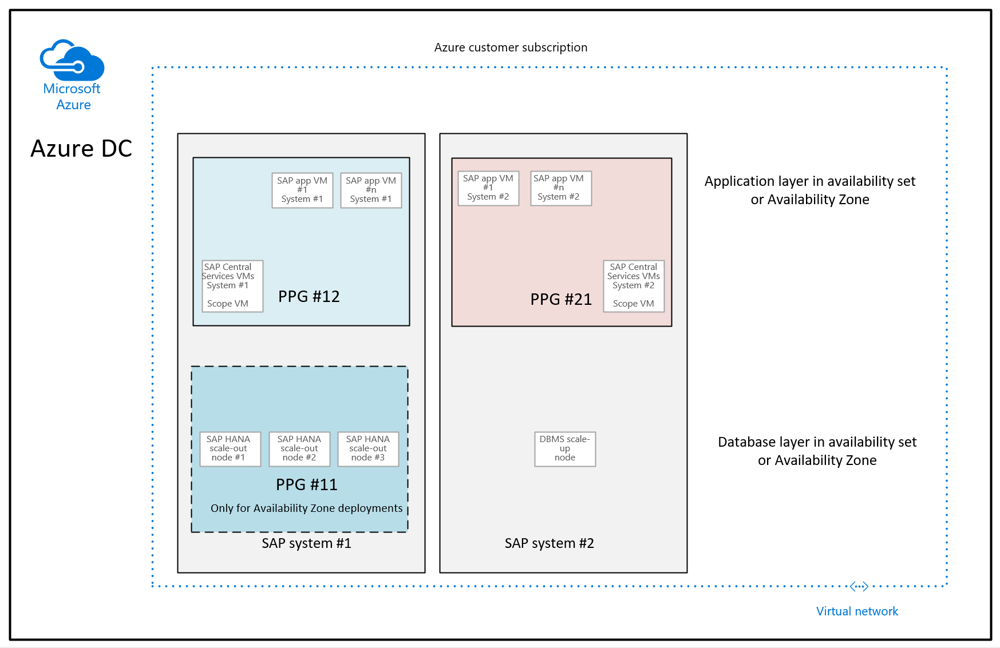
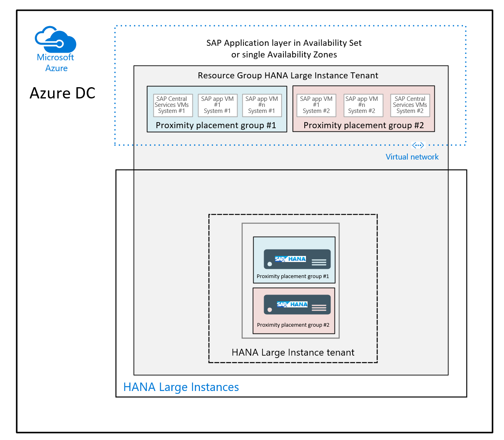

# Azure proximity placement groups for optimal network latency with SAP applications
SAP applications based on the SAP NetWeaver or SAP S/4HANA architecture are sensitive to network latency between the SAP application tier and the SAP database tier. This sensitivity is the result of most of the business logic running in the application layer. Because the SAP application layer runs the business logic, it issues queries to the database tier at a high frequency, at a rate of thousands or tens of thousands per second. In most cases, the nature of these queries is simple. They can often be run on the database tier in 500 microseconds or less.

The time spent on the network to send such a query from the application tier to the database tier and receive the result set back has a major impact on the time it takes to run business processes. This sensitivity to network latency is why you need to achieve optimal network latency in SAP deployment projects. See [SAP Note #1100926 - FAQ: Network performance](https://launchpad.support.sap.com/#/notes/1100926/E) for guidelines on how to classify the network latency.

In many Azure regions, the number of datacenters has grown. This growth has also been triggered by the introduction of Availability Zones. At the same time, customers, especially for high-end SAP systems, are using more special VM SKUs in the M-Series family, or HANA Large Instances. These Azure virtual machine types aren't available in all the datacenters in a specific Azure region. Because of these two tendencies, customers have experienced network latency that isn't in the optimal range. In some cases, this latency results in suboptimal performance of their SAP systems.

To prevent these problems, Azure offers [proximity placement groups](https://docs.microsoft.com/azure/virtual-machines/linux/co-location). This new functionality has already been used to deploy various SAP systems. For restrictions on proximity placement groups, see the article referred to at the start of this paragraph. This article covers the SAP scenarios in which Azure proximity placement groups can or should be used.

## What are proximity placement groups? 
An Azure proximity placement group is a logical construct. When one is defined, it's bound to an Azure region and an Azure resource group. When VMs are deployed, a proximity placement group is referenced by:

- The first Azure VM deployed in the datacenter. You can think of the first virtual machine as an "scope VM" that's deployed in a datacenter based on Azure allocation algorithms that are eventually combined with user definitions for a specific Availability Zone.
- All subsequent VMs deployed that reference the proximity placement group, to place all subsequently deployed Azure VMs in the same datacenter as the first virtual machine.

> [!NOTE]
> If there is no host hardware deployed that could run a specific VM type in the datacenter where the first VM was placed, the deployment of the requested VM type won’t succeed. You’ll get a failure message.

A single [Azure resource group](https://docs.microsoft.com/azure/azure-resource-manager/manage-resources-portal) can have multiple proximity placement groups assigned to it. But a proximity placement group can be assigned to only one Azure resource group.

When you use proximity placement groups, keep these considerations in mind:

- When you aim for optimal performance for your SAP system and limit yourself to a single Azure datacenter for the system by using proximity placement groups, you might not be able to combine all types of VM families within the placement group. These limitations occur because the host hardware that’s needed to run a certain VM type might not be present in the datacenter to which the "scoped VM" of the placement group was deployed.
- During the life cycle of such an SAP system, you could be forced to move the system to another datacenter. This move could be required if you decide your scale-out HANA DBMS layer should, for example, move from four nodes to 16 nodes, and there's not enough capacity to get an additional 12 VMs of the type you used in the datacenter.
- Because of decommissioning of hardware, Microsoft might build up capacities for a VM type you used in a different datacenter, rather than the one that you initially used. In that scenario, you might need to move the all the proximity placement group's VMs into another datacenter.

## Proximity placement groups with SAP systems that use only Azure VMs
Most SAP NetWeaver and S/4HANA system deployments on Azure don't use [HANA Large Instances](https://docs.microsoft.com/azure/virtual-machines/workloads/sap/hana-overview-architecture). For deployments that don't use HANA Large Instances, it's important to provide optimal performance between the SAP application layer and the DBMS tier. To do so, define an Azure proximity placement group just for the system.

In most customer deployments, customers build a single [Azure resource group](https://docs.microsoft.com/azure/azure-resource-manager/manage-resources-portal) for SAP systems. In that case, there's a one-to-one relationship between, for example, the production ERP system resource group and its proximity placement group. In other cases, customers organize their resource groups horizontally and collect all production systems in a single resource group. In this case, you'd have a one-to-many relationship between your resource group for production SAP systems and several proximity placement groups for your production SAP ERP, SAP BW, and so on.

Avoid bundling several SAP production or non-production systems in a single proximity placement group. When a small number of SAP systems or an SAP system and some surrounding applications need to have low latency network communication, you might consider moving these systems into one proximity placement group. You should avoid bundles of systems because the more systems you group in a proximity placement group, the higher the chances:

- That you require a VM type that can't be run in the specific datacenter into which the proximity placement group was scoped to.
- That resources of non-mainstream VMs, like M-Series VMs, could eventually be unfulfilled when you need more because you're adding software to a proximity placement group over time.

Here's what the ideal configuration, as described, looks like:

In this case, single SAP systems are grouped in one resource group each, with one proximity placement group each. There's no dependency on whether you use HANA scale-out or DBMS scale-up configurations.

## Proximity placement groups and HANA Large Instances
If some of your SAP systems rely on [HANA Large Instances](https://docs.microsoft.com/azure/virtual-machines/workloads/sap/hana-overview-architecture) for the application layer, you can experience significant improvements in network latency between the HANA Large Instances unit and Azure VMs when you're using HANA Large Instances units that are deployed in [Revision 4 rows or stamps](https://docs.microsoft.com/azure/virtual-machines/workloads/sap/hana-network-architecture#networking-architecture-for-hana-large-instance). One improvement is that HANA Large Instances units, as they're deployed, deploy with a proximity placement group. You can use that proximity placement group to deploy your application layer VMs. As a result, those VMs will be deployed in the same datacenter that hosts your HANA Large Instances unit.

To determine whether your HANA Large Instances unit is deployed in a Revision 4 stamp or row, check the article [Azure HANA Large Instances control through Azure portal](https://docs.microsoft.com/azure/virtual-machines/workloads/sap/hana-li-portal#look-at-attributes-of-single-hli-unit). In the attributes overview of your HANA Large Instances unit, you can also determine the name of the proximity placement group because it was created when your HANA Large Instances unit was deployed. The name that appears in the attributes overview is the name of the proximity placement group that you should deploy your application layer VMs into.

As compared to SAP systems that use only Azure virtual machines, when you use HANA Large Instances, you have less flexibility in deciding how many [Azure resource groups](https://docs.microsoft.com/azure/azure-resource-manager/manage-resources-portal) to use. All the HANA Large Instances units of a [HANA Large Instances tenant](https://docs.microsoft.com/azure/virtual-machines/workloads/sap/hana-know-terms) are grouped in a single resource group, as described [this article](https://docs.microsoft.com/azure/virtual-machines/workloads/sap/hana-li-portal#display-of-hana-large-instance-units-in-the-azure-portal). Unless you deploy into different tenants to separate, for example, production and non-production systems or other systems, all your HANA Large Instances units will be deployed in one HANA Large Instances tenant. This tenant has a one-to-one relationship with a resource group. But a separate proximity placement group will be defined for each of the single units.

As a result, the relationships among Azure resource groups and proximity placement groups for a single tenant will be as shown here:

## Example of deployment with proximity placement groups
Following are some PowerShell commands that you can use to deploy your VMs with Azure proximity placement groups.

The first step, after you sign in to [Azure Cloud Shell](https://azure.microsoft.com/features/cloud-shell/), is to check whether you're in the Azure subscription that you want to use for the deployment:

<pre><code>
Get-AzureRmContext
</code></pre>

If you need to change to a different subscription, you can do so by running this command:

<pre><code>
Set-AzureRmContext -Subscription "my PPG test subscription"
</code></pre>

Create a new Azure resource group by running this command:

<pre><code>
New-AzResourceGroup -Name "myfirstppgexercise" -Location "westus2"
</code></pre>

Create the new proximity placement group by running this command:

<pre><code>
New-AzProximityPlacementGroup -ResourceGroupName "myfirstppgexercise" -Name "letsgetclose" -Location "westus2"
</code></pre>

Deploy your first VM into the proximity placement group by using a command like this one:

<pre><code>
New-AzVm -ResourceGroupName "myfirstppgexercise" -Name "myppganchorvm" -Location "westus2" -OpenPorts 80,3389 -ProximityPlacementGroup "letsgetclose" -Size "Standard_DS11_v2"
</code></pre>

The preceding command deploys a Windows-based VM. After this VM deployment succeeds, the datacenter scope of the proximity placement group is defined within the Azure region. All subsequent VM deployments that reference the proximity placement group, as shown in the preceding command, will be deployed in the same Azure datacenter, as long as the VM type can be hosted on hardware placed in that datacenter and capacity for that VM type is available.

## Combine availability sets and Availability Zones with proximity placement groups
One of the disadvantages to using Availability Zones for SAP system deployments is that you can’t deploy the SAP application layer by using availability sets within the specific zone. You want the SAP application layer to be deployed in the same zones as the DBMS layer. Referencing an Availability Zone and an availability set when deploying a single VM isn't supported. So, previously, you were forced to deploy your application layer by referencing a zone. You lost the ability to make sure the application layer VMs were spread across different update and failure domains.

By using proximity placement groups, you can bypass this restriction. Here's the deployment sequence:

- Create a proximity placement group.
- Deploy your anchor VM, usually the DBMS server, by referencing an Availability Zone.
- Create an availability set that references the Azure proximity group. (See the command later in this article.)
- Deploy the application layer VMs by referencing the availability set and the proximity placement group.

Instead of deploying the first VM as demonstrated in the previous section, you reference an Availability Zone and the proximity placement group when you deploy the VM:

<pre><code>
New-AzVm -ResourceGroupName "myfirstppgexercise" -Name "myppganchorvm" -Location "westus2" -OpenPorts 80,3389 -Zone "1" -ProximityPlacementGroup "letsgetclose" -Size "Standard_E16_v3"
</code></pre>

A successful deployment of this virtual machine would host the database instance of the SAP system in one Availability Zone. The scope of the proximity placement group is fixed to one of the datacenters that represent the Availability Zone you defined.

Assume you deploy the Central Services VMs in the same way as the DBMS VMs, referencing the same zone or zones and the same proximity placement groups. In the next step, you need to create the availability sets you want to use for the application layer of your SAP system.

You need to define and create the proximity placement group. The command for creating the availability set requires an additional reference to the proximity placement group ID (not the name). You can get the ID of the proximity placement group by using this command:

<pre><code>
Get-AzProximityPlacementGroup -ResourceGroupName "myfirstppgexercise" -Name "letsgetclose"
</code></pre>

When you create the availability set, you need to consider additional parameters when you're using managed disks (default unless specified otherwise) and proximity placement groups:

<pre><code>
New-AzAvailabilitySet -ResourceGroupName "myfirstppgexercise" -Name "myppgavset" -Location "westus2" -ProximityPlacementGroupId "/subscriptions/my very long ppg id string" -sku "aligned" -PlatformUpdateDomainCount 3 -PlatformFaultDomainCount 2 
</code></pre>

Ideally, you should use three fault domains. But the number of supported fault domains can vary from region to region. In this case, the maximum number of fault domains possible for the specific regions is two. To deploy your application layer VMs, you need to add a reference to your availability set name and the proximity placement group name, as shown here:

<pre><code>
New-AzVm -ResourceGroupName "myfirstppgexercise" -Name "myppgavsetappvm" -Location "westus2" -OpenPorts 80,3389 -AvailabilitySetName "myppgavset" -ProximityPlacementGroup "letsgetclose" -Size "Standard_DS11_v2"
</code></pre>

The result of this deployment is:
- A DBMS layer and Central Services for your SAP system that's located in a specific Availability Zone or Availability Zones.
- An SAP application layer that's located through availability sets in the same Azure datacenters as the DBMS VM or VMs.

> [!NOTE]
> Because you deploy one DBMS VM into one zone and the second DBMS VM into another zone to create a high availability configuration, you'll need a different proximity placement group for each of the zones. The same is true for any availability set that you use.

## Move an existing system into proximity placement groups
If you already have SAP systems deployed, you might want to optimize the network latency of some of your critical systems and locate the application layer and the DBMS layer in the same datacenter. To move the VMs of a complete Azure availability set to an existing proximity placement group that is scoped already, you need to shutdown all VMs of the availability set and assign the availability set to the existing proximity placement group through Azure portal, PowerShell or CLI. If you want to move a VM that is not part of an availability set into an existing proximity placement group, you just need to shutdown the VM and assign it to an existing proximity placement group. 

## Next steps
Check out the documentation:

- [SAP workloads on Azure: planning and deployment checklist](https://docs.microsoft.com/azure/virtual-machines/workloads/sap/sap-deployment-checklist)
- [Preview: Deploy VMs to proximity placement groups using Azure CLI](https://docs.microsoft.com/azure/virtual-machines/linux/proximity-placement-groups)
- [Preview: Deploy VMs to proximity placement groups using PowerShell](https://docs.microsoft.com/azure/virtual-machines/windows/proximity-placement-groups)
- [Considerations for Azure Virtual Machines DBMS deployment for SAP workloads](https://docs.microsoft.com/azure/virtual-machines/workloads/sap/dbms_guide_general)

