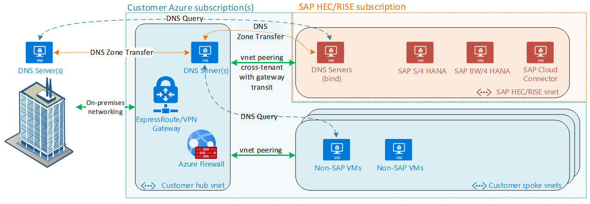
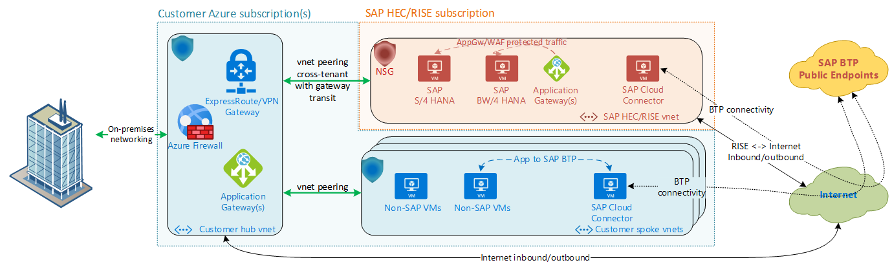
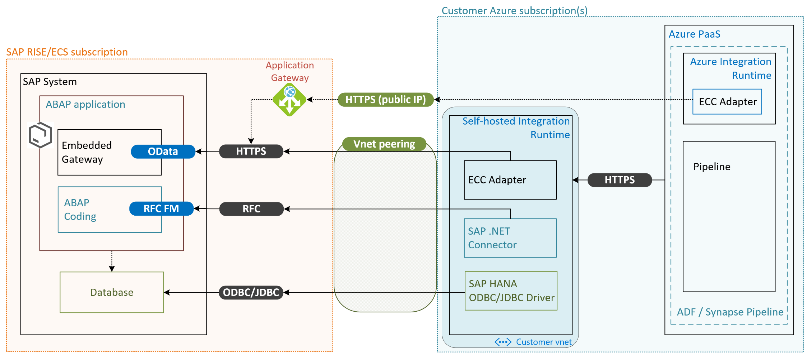
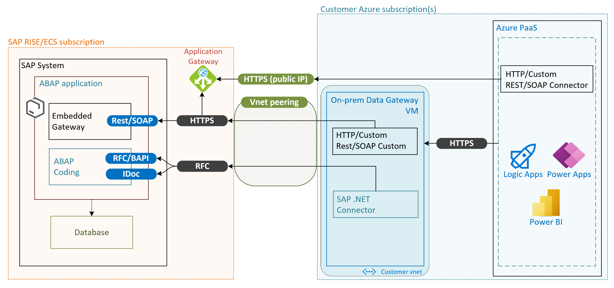

# Integrating Azure with SAP RISE managed workloads

For customers with SAP solutions such as RISE with SAP Enterprise Cloud Services (ECS) and SAP S/4HANA Cloud, private edition (PCE) which are deployed on Azure, integrating the SAP managed environment with their own Azure ecosystem and third party applications is of particular importance. The following article explains the concepts utilized and best practices to follow for a secure and performant solution.

RISE with SAP S/4HANA Cloud, private edition and SAP Enterprise Cloud Services are SAP managed services of your SAP landscape, in an Azure subscription owned by SAP. The virtual network (vnet) utilized by these managed systems should fit well in your overall network concept and your available IP address space. Requirements for private IP range for RISE PCE or ECS environments are coming from SAP reference deployments. Customers specify the chosen RFC1918 CIDR IP address range to SAP. To facilitate connectivity between SAP and customers owned Azure subscriptions/vnets, a direct vnet peering can be set up. Another option is the use of a VPN vnet-to-vnet connection.

> [!IMPORTANT]
> For all details about RISE with SAP Enterprise Cloud Services and SAP S/4HANA Cloud, private edition please contact your SAP representative.

## Virtual network peering with SAP RISE/ECS

A vnet peering is the most performant way to connect securely and privately two standalone vnets, utilizing the Microsoft private backbone network. The peered networks appear as one for connectivity purposes, allowing applications to talk to each other. Applications running in different vnets, subscriptions, Azure tenants or regions are enabled to communicate directly. Like network traffic on a single vnet, vnet peering traffic remains on Microsoft’s private network and doesn't traverse the internet.

For SAP RISE/ECS deployments, virtual peering is the preferred way to establish connectivity with customer’s existing Azure environment. Both the SAP vnet and customer vnet(s) are protected with network security groups (NSG), enabling communication on SAP and database ports through the vnet peering. Communication between the peered vnets is secured through these NSGs, limiting communication to customer’s  SAP environment. For details and a list of open ports, contact your SAP representative.

SAP managed workload is preferably deployed in the same [Azure region](https://azure.microsoft.com/global-infrastructure/geographies/) as customer’s central infrastructure and applications accessing it. Virtual network peering can be set up within the same region as your SAP managed environment, but also through [global virtual network peering](../../../virtual-network/virtual-network-peering-overview.md) between any two Azure regions. With SAP RISE/ECS available in many Azure regions, the region ideally should be matched with workload running in customer vnets due to latency and vnet peering cost considerations. However, some of the scenarios (for example, central S/4HANA deployment for a multi-national, globally presented company) also require to peer networks globally.

:::image type="complex" source="./media/sap-rise-integration/sap-rise-peering.png" alt-text="Customer peering with SAP RISE/ECS":::
   This diagram shows a typical SAP customer's hub and spoke virtual networks. Cross-tenant virtual network peering connects SAP RISE vnet to customer's hub vnet.
:::image-end:::

Since SAP RISE/ECS runs in SAP’s Azure tenant and subscriptions, the virtual network peering needs to be set up between [different tenants](../../../virtual-network/create-peering-different-subscriptions.md). This can be accomplished by setting up the peering with the SAP provided network’s Azure resource ID and have SAP approve the peering. Add a user from the opposite AAD tenant as a guest user, accept the guest user invitation and follow process documented at [Create a VNet peering - different subscriptions](../../../virtual-network/create-peering-different-subscriptions.md#cli). Contact your SAP representative for the exact steps required. Engage the respective team(s) within your organization that deal with network, user administration and architecture to enable this process to be completed swiftly.

## VPN Vnet-to-Vnet

As an alternative to vnet peering, virtual private network (VPN) connection can be established between VPN gateways, deployed both in the SAP RISE/ECS subscription and customers own. A vnet-to-vnet connection will be established between these two VPN gateways, enabling fast communication between the two separate vnets. The respective vnets and gateways can be located in different Azure regions.

:::image type="complex" source="./media/sap-rise-integration/sap-rise-vpn.png" alt-text="Diagram ofSAP RISE/ECS VPN connection to customer vnet.":::
   This diagram shows a typical SAP customer's hub and spoke virtual networks. VPN gateway located in SAP RISE vnet connects through vnet-to-vnet connection into gateway contained in customer's hub vnet.
:::image-end:::

While vnet peering is the recommended and more typical deployment model, a VPN vnet-to-vnet can potentially simplify a complex virtual peering between customer and SAP RISE/ECS virtual networks. The VPN Gateway acts as only point of entry into the customer’s network and is managed and secured by a central team.

Network Security Groups are in effect on both customer and SAP vnet, identically to vnet peering architecture enabling communication to SAP NetWeaver and HANA ports as required. For details how to set up the VPN connection and which settings should be used, contact your SAP representative.

## Connectivity back to on-premises

With an existing customer Azure deployment, on-premises network is already connected through ExpressRoute (ER) or VPN. The same on-premises network path is typically used for SAP RISE/ECS managed workloads. Preferred architecture is to use existing ER/VPN Gateways in customer’s hub vnet for this purpose, with connected SAP RISE vnet seen as a spoke network connected to customer’s vnet hub.

:::image type="complex" source="./media/sap-rise-integration/sap-rise-on-premises.png" alt-text="Example diagram of SAP RISE/ECS as spoke network peered to customer's vnet hub and on-premises.":::
   This diagram shows a typical SAP customer's hub and spoke virtual networks. It's connected to on-premises with a connection. Cross tenant virtual network peering connects SAP RISE vnet to customer's hub vnet. The vnet peering has remote gateway transit enabled, enabling SAP RISE vnet to be accessed from on-premises.
:::image-end:::

With this architecture, central policies and security rules governing network connectivity to customer workloads also apply to SAP RISE/ECS managed workloads. The same on-premises network path is used for both customer's vnets and SAP RISE/ECS vnet.

If there's no currently existing Azure to on-premises connectivity, contact your SAP representative for details which connections models are possible to be established. Any on-premises to SAP RISE/ECS connection is then for reaching the SAP managed vnet only. The on-premises to SAP RISE/ECS connection isn't used to access customer's own Azure vnets.

**Important to note**: A virtual network can have [only have one gateway](../../../virtual-network/virtual-network-peering-overview.md#gateways-and-on-premises-connectivity), local or remote. With vnet peering established between SAP RISE/ECS using remote gateway transit like in above architecture, no gateways can be added in the SAP RISE/ECS vnet. A combination of vnet peering with remote gateway transit together with another VPN gateway in the SAP RISE/ECS vnet isn't possible.

## Virtual WAN with SAP RISE/ECS managed workloads

Similarly to using a hub and spoke network architecture with connectivity to both SAP RISE/ECS vnet and on-premises, the Azure Virtual Wan (vWAN) hub can be used for same purpose. Both connection options described earlier – vnet peering as well as VPN vnet-to-vnet – are available to be connected to vWAN hub.

The vWAN network hub is deployed and managed entirely by customer in customer subscription and vnet. On-premise connection and routing through vWAN network hub are also managed entirely by customer.

Again, contact your SAP representative for details and steps needed to establish this connectivity.

## DNS integration with SAP RISE/ECS managed workloads

Integration of customer owned networks with Cloud-based infrastructure and providing a seamless name resolution concept is a vital part of a successful project implementation.

This diagram describes one of the common integration scenarios of SAP owned subscriptions, VNets and DNS infrastructure with customer’s local network and DNS services. In this setup on-premises DNS servers are holding all DNS entries. The DNS infrastructure is capable to resolve DNS requests coming from all sources (on-premises clients, customer’s Azure services and SAP managed environments).

Design description and specifics:

  - Custom DNS configuration for SAP-owned VNets

  - Two VMs in the RISE/STE/ECS Azure vnet hosting DNS servers

  - Customers must provide and delegate to SAP a subdomain/zone (for example, \*ecs.contoso.com) which will be used to assign names and create forward and reverse DNS entries for the virtual machines that run SAP managed environment. SAP DNS servers are holding a master DNS role for the delegated zone

  - DNS zone transfer from SAP DNS server to customer’s DNS servers is the primary method to replicate DNS entries from RISE/STE/ECS environment to on-premises DNS

  - Customer-owned Azure vnets are also using custom DNS configuration referring to customer DNS servers located in Azure Hub vnet.

  - Optionally, customers can set up a DNS forwarder within their Azure vnets. Such forwarder then pushes DNS requests coming from Azure services to SAP DNS servers that are targeted to the delegated zone (\*ecs.contoso.com).

Alternatively, DNS zone transfer from SAP DNS servers could be performed to a customer’s DNS servers located in Azure Hub VNet (diagram above). This is applicable for the designs when customers operate custom DNS solution (e.g. [AD DS](/windows-server/identity/ad-ds/active-directory-domain-services) or BIND servers) within their Hub VNet.

**Important to note**, that both Azure provided DNS and Azure private zones **do not** support DNS zone transfer capability, hence, can't be used to accept DNS replication from SAP RISE/STE/ECS DNS servers. Additionally, external DNS service providers are typically not supported by SAP RISE/ECS.

To further read about the usage of Azure DNS for SAP, outside the usage with SAP RISE/ECS see details in following [blog post](https://www.linkedin.com/posts/k-popov_sap-on-azure-dns-integration-whitepaper-activity-6841398577495977984-ui9V/).

## Internet outbound and inbound connections with SAP RISE/ECS

SAP workloads communicating with external applications or inbound connections from a company’s user base (for example, SAP Fiori) could require a network path to the Internet, depending on customer’s requirements. Within SAP RISE/ECS managed workloads, work with your SAP representative to explore needs for such https/RFC/other communication paths. Network communication to/from the Internet is by default not enabled for SAP RISE/ECS customers and default networking is utilizing private IP ranges only. Internet connectivity requires planning with SAP, to optimally protect customer’s SAP landscape.

Should you enable Internet bound or incoming traffic with your SAP representatives, the network communication is protected through various Azure technologies such as NSGs, ASGs, Application Gateway with Web Application Firewall (WAF), proxy servers and others. These services are entirely managed through SAP within the SAP RISE/ECS vnet and subscription. The network path SAP RISE/ECS to and from Internet remains typically within the SAP RISE/ECS vnet only and doesn't transit into/from customer’s own vnet(s).

Applications within a customer’s own vnet connect to the Internet directly from respective vnet or through customer’s centrally managed services such as Azure Firewall, Azure Application Gateway, NAT Gateway and others. Connectivity to SAP BTP from non-SAP RISE/ECS applications takes the same network Internet bound path. Should an SAP Cloud Connecter be needed for such integration, it's placed with customer’s non-SAP VMs requiring SAP BTP communication and network path managed by customer themselves.

## SAP BTP Connectivity

SAP Business Technology Platform (BTP) provides a multitude of applications that are mostly accessed by public IP/hostname via the Internet.
Customer services running in their Azure subscriptions access them either directly through VM/Azure service internet connection, or through User Defined Routes forcing all Internet bound traffic to go through a centrally managed firewall or other network virtual appliances. Few SAP BTP services, such as SAP Data Intelligence, however is by design accessed through a [separate vnet peering](https://help.sap.com/docs/SAP_DATA_INTELLIGENCE/ca509b7635484070a655738be408da63/a7d98ac925e443ea9d4a716a91e0a604.html) instead of a public endpoint typically used for BTP application.

SAP offers [Private Link Service](https://blogs.sap.com/2022/06/22/sap-private-link-service-on-azure-is-now-generally-available-ga/) for customers using SAP BTP on Azure. The SAP Private Link Service connects SAP BTP services through a private IP range into customer’s Azure network and thus accessible privately through the private link service instead of through the Internet. Contact SAP for availability of this service for SAP RISE/ECS workloads.

See [SAP's documentation](https://help.sap.com/docs/PRIVATE_LINK) and a series of blog posts on the architecture of the SAP BTP Private Link Service and private connectivity methods, dealing with DNS and certificates in following SAP blog series [Getting Started with BTP Private Link Service for Azure](https://blogs.sap.com/2021/12/29/getting-started-with-btp-private-link-service-for-azure/). 

## Integration with Azure services

Your SAP landscape runs within SAP RISE/ECS subscription, you can access the SAP system through available ports. Each application communicating with your SAP system might require different ports to access it.

For SAP Fiori, standalone or embedded within the SAP S/4 HANA or NetWeaver system, the customer can connect applications through OData or REST API. Both use https for incoming requests to the SAP system. Applications running on-premises or within the customer’s own Azure subscription and vnet, use the established vnet peering or VPN vnet-to-vnet connection through a private IP address. Applications accessing a publicly available IP, exposed through SAP RISE managed Azure application gateway, are also able to contact the SAP system through https. For details and security for the application gateway and NSG open ports, contact SAP.

Applications using remote function calls (RFC) or direct database connections using JDBC/ODBC protocols are only possible through private networks and thus via the vnet peering or VPN from customer’s vnet(s).

:::image type="complex" source="./media/sap-rise-integration/sap-rise-open-ports.png" alt-text="Diagram of SAP's open ports for integration with SAP services":::
   Diagram of open ports on a SAP RISE/ECS system. RFC connections for BAPI and IDoc, htps for OData and Rest/SOAP. ODBC/JDBC for direct database connections to SAP HANA. All connnections through the private vnet peering. Application Gateway with public IP for https as a potential option, managed through SAP.
:::image-end:::

With the information about available interfaces to the SAP RISE/ECS landscape, several methods of integration with Azure Services are possible. For data scenarios with Azure Data Factory or Synapse Analytics a self-hosted integration runtime or Azure Integration Runtime is available and described in the next chapter. For Logic Apps, Power Apps, Power BI the intermediary between the SAP RISE system and Azure service is through the on-premises data gateway, described in further chapters. Most services in the [Azure Integration Services](https://azure.microsoft.com/product-categories/integration/) do not require any intermediary gateway and thus can communicate directly with these available SAP interfaces.

## Integration with self-hosted integration runtime

Integrating your SAP system with Azure cloud native services such as Azure Data Factory or Azure Synapse would use these communication channels to the SAP RISE/ECS managed environment.

The following high-level architecture shows possible integration scenario with Azure data services such as [Data Factory](../../../data-factory/index.yml) or [Synapse Analytics](../../../synapse-analytics/index.yml). For these Azure services either a self-hosted integration runtime (self-hosted IR or IR) or Azure integration runtime (Azure IR) can be used. The use of either integration runtime depends on the [chosen data connector](../../../data-factory/copy-activity-overview.md#supported-data-stores-and-formats), most SAP connectors are only available for the self-hosted IR. [SAP ECC connector](../../../data-factory/connector-sap-ecc.md?tabs=data-factory) is capable of being using through both Azure IR and self-hosted IR. The choice of IR governs the network path taken. SAP .NET connector is used for [SAP table connector](../../../data-factory/connector-sap-ecc.md?tabs=data-factory), [SAP BW](../../../data-factory/connector-sap-business-warehouse.md?tabs=data-factory) and [SAP OpenHub](../../../data-factory/connector-sap-business-warehouse-open-hub.md) connectors alike. All these connectors use SAP function modules (FM) on the SAP system, executed through RFC connections. Last if direct database access has been agreed with SAP, along with users and connection path opened, ODBC/JDBC connector for [SAP HANA](../../../data-factory/connector-sap-hana.md?tabs=data-factory) can be used from the self-hosted IR as well.

For data connectors using the Azure IR, this IR accesses your SAP environment through a public IP address. SAP RISE/ECS provides this endpoint through an application gateway for use and the communication and data movement is through https.

Data connectors within the self-hosted integration runtime communicate with the SAP system within SAP RISE/ECS subscription and vnet through the established vnet peering and private network address only. The established network security group rules limit which application can communicate with the SAP system.

The customer is responsible for deployment and operation of the self-hosted integration runtime within their subscription and vnet. The communication between Azure PaaS services such as Data Factory or Synapse Analytics and self-hosted integration runtime is within the customer’s subscription. SAP RISE/ECS exposes the communication ports for these applications to use but has no knowledge or support about any details of the connected application or service.

> [!Note]
> Contact SAP for details on communication paths available to you with SAP RISE and the necessary steps to open them. SAP must also be contacted for any SAP license details for any implications accessing SAP data through any Azure Data Factory or Synapse connectors.

To learn the overall support on SAP data integration scenario, see [SAP data integration using Azure Data Factory whitepaper](https://github.com/Azure/Azure-DataFactory/blob/master/whitepaper/SAP%20Data%20Integration%20using%20Azure%20Data%20Factory.pdf) with detailed introduction on each SAP connector, comparison and guidance.

## On-premise data gateway
Further Azure Services such as [Logic Apps](../../../logic-apps/logic-apps-using-sap-connector.md), [Power Apps](/connectors/saperp/) or [Power BI](/power-bi/connect-data/desktop-sap-bw-connector) communicate and exchange data with SAP systems through an on-premises data gateway. The on-premises data gateway is a virtual machine, running in Azure or on-premises. It provides secure data transfer between these Azure Services and your SAP systems.

With SAP RISE, the on-premises data gateway can connect to Azure Services running in customer’s Azure subscription. This VM running the data gateway is deployed and operated by the customer. With below high-level architecture as overview, similar method can be used for either service.

The SAP RISE environment here provides access to the SAP ports for RFC and https described earlier. The communication ports are accessed by the private network address through the vnet peering or VPN site-to-site connection. The on-premises data gateway VM running in customer’s Azure subscription uses the [SAP .NET connector](https://support.sap.com/en/product/connectors/msnet.html) to run RFC, BAPI or IDoc calls through the RFC connection. Additionally, depending on service and way the communication is setup, a way to connect to public IP of the SAP systems REST API through https might be required. The https connection to a public IP can be exposed through SAP RISE/ECS managed application gateway. This high level architecture shows the possible integration scenario. Alternatives to it such as using Logic Apps single tenant and [private endpoints](../../../logic-apps/secure-single-tenant-workflow-virtual-network-private-endpoint.md) to secure the communication and other can be seen as extension and are not described here in.

SAP RISE/ECS exposes the communication ports for these applications to use but has no knowledge about any details of the connected application or service running in a customer’s subscription.

> [!Note]
> SAP must be contacted for any SAP license details for any implications accessing SAP data through Azure service connecting to the SAP system or database.

## Azure Monitoring for SAP with SAP RISE

[Azure Monitoring for SAP](./monitor-sap-on-azure.md) is an Azure-native solution for monitoring your SAP system. It extends the Azure monitor platform monitoring capability with support to gather data about SAP NetWeaver, database, and operating system details.

> [!Note]
> SAP RISE/ECS is a fully managed service for your SAP landscape and thus Azure Monitoring for SAP is not intended to be utilized for such managed environment.

SAP RISE/ECS doesn't support any integration with Azure Monitoring for SAP. SAP RISE/ECS’s own monitoring and reporting is provided to the customer as defined by your service description with SAP.

## Next steps
Check out the documentation:

- [SAP workloads on Azure: planning and deployment checklist](./sap-deployment-checklist.md)
- [Virtual network peering](../../../virtual-network/virtual-network-peering-overview.md)
- [Public endpoint connectivity for Virtual Machines using Azure Standard Load Balancer in SAP high-availability scenarios](./high-availability-guide-standard-load-balancer-outbound-connections.md)
- [SAP Data Integration Using Azure Data Factory](https://github.com/Azure/Azure-DataFactory/blob/main/whitepaper/SAP%20Data%20Integration%20using%20Azure%20Data%20Factory.pdf)
