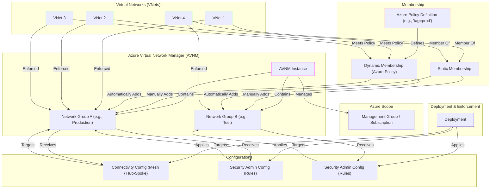

# What is a network group in Azure Virtual Network Manager?

In this article, you learn about *network groups* and how they can help you group virtual networks together for easier management. Also, you learn about *Static group membership* and *Dynamic group membership* and how to use each type of membership.

## Network group

A *network group* is global container that includes a set of virtual network resources from any region. Then, configurations are applied to target the network group, which applies the configuration to all members of the group.

## Group membership

Group membership is a many-to-many relationship, such that one group holds many virtual networks and any given virtual network can participate in multiple network groups. As part of a network group, the virtual network receives any configurations applied to the group and deployed to the virtual networks region. 

A virtual network can be set to join a network group in multiple ways. The two types are group memberships are *static* and *dynamic* memberships.

### Static membership

Static membership allows you to explicitly add virtual networks to a group by manually selecting individual virtual networks. The list of virtual networks is dependent on the scope (management group or subscription) defined at the time of the Azure Virtual Network Manager deployment. This method is useful when you have a few virtual networks you want to add to the network group. Static membership also allows you to 'patch' the network group contents by adding or removing a virtual network from the group.

### Dynamic membership

Dynamic membership gives you the flexibility of selecting multiple virtual networks at scale if they meet the conditional statements you defined in Azure Policy. This membership type is useful for scenarios where you have large number of virtual networks, or if membership is dictated by a condition instead of an explicit list. Learn about [How Azure Policy works with Network Groups](concept-azure-policy-integration.md).

### Membership visibility

All group membership is recorded in Azure Resource Graph and available for your use. Each virtual network receives a single entry in the graph. This entry specifies all the groups the virtual network is a member of, and what contributing sources are responsible for that membership, such as static members or various policy resources. Learn how to [view applied configurations](how-to-view-applied-configurations.md#network-group-membership).

## Network groups and Azure Policy

When you create a network group, an Azure Policy is created so that Azure Virtual Network Manager gets notified about changes made to virtual network membership.

To create, edit, or delete Azure Virtual Network Manager dynamic group policies, you need:

- Read and write role-based access control permissions to the underlying policy.
- Role-based access control permissions to join the network group (Classic Admin authorization isn't supported).

For more information on required permissions for Azure Virtual Network Manager dynamic group policies, review [required permissions](concept-azure-policy-integration.md#required-permissions).

## Illustrative relationship between components

### Diagram Explanation:

1.  **Azure Scope**: Azure Virtual Network Manager (AVNM) operates within a defined **scope**, which can be a **Management Group** or a **Subscription**. This determines which VNets AVNM can "see" and manage.
2.  **AVNM Instance**: This is the main Azure Virtual Network Manager resource. Network groups and configurations are created and managed from here.
3.  **Network Groups**:
    * These are **logical containers** for your Virtual Networks (VNets).
    * They allow you to group VNets with common characteristics (environment, region, etc.).
    * A VNet can belong to multiple network groups.
4.  **Membership**: How VNets are added to Network Groups:
    * **Static Membership**: You add VNets **manually**, selecting them one by one.
    * **Dynamic Membership**: Uses **Azure Policy** to automatically add VNets that meet certain criteria (like tags, names, locations). VNets matching the policy are dynamically added (and removed) from the group.
5.  **Virtual Networks (VNets)**: These are the Azure virtual networks that are being managed.
6.  **Configurations**: AVNM allows you to apply two main types of configurations to Network Groups:
    * **Connectivity Config**: Defines how VNets connect within a group (or between groups). You can create topologies like **Mesh** (all connected to each other) or **Hub-and-Spoke** (a central VNet connected to several "spoke" VNets).
    * **Security Admin Config**: Allows you to define high-level **security rules** that apply to the VNets in a group. These rules can **override** Network Security Group (NSG) rules, enabling centralized and mandatory security policies.
7.  **Deployment & Enforcement**:
    * The created configurations (connectivity and security) must be **Deployed**.
    * During deployment, AVNM translates these configurations and applies them to the VNets that are members of the target network groups in the selected regions.
    * Once deployed, the VNets within the groups **receive** and **apply** (Enforced) these configurations, establishing the defined connections and security rules.

 ## Next steps

- Create an [Azure Virtual Network Manager](create-virtual-network-manager-portal.md) instance using the Azure portal
- Learn how to create a [Hub and spoke topology](how-to-create-hub-and-spoke.md) with Azure Virtual Network Manager
- Learn how to block network traffic with a [Security admin configuration](how-to-block-network-traffic-portal.md)
- Review [Azure Policy basics](../governance/policy/overview.md)
