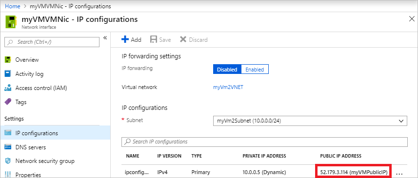

---
title: Associate a public IP address to a virtual machine
titlesuffix: Azure Virtual Network
description: Learn how to associate a public IP address to a virtual machine.
services: virtual-network
documentationcenter: ''
author: KumudD
ms.service: virtual-network
ms.devlang: na
ms.topic: article
ms.tgt_pltfrm: na
ms.workload: infrastructure-services
ms.date: 02/21/2019
ms.author: kumud

---

# Associate a public IP address to a virtual machine

In this article, you learn how to associate a public IP address to an existing virtual machine (VM). If you want to connect to a VM from the internet, the VM must have a public IP address associated to it. If you want to create a new VM with a public IP address, you can do so using the [Azure portal](virtual-network-deploy-static-pip-arm-portal.md), the [Azure command-line interface (CLI)](virtual-network-deploy-static-pip-arm-cli.md), or [PowerShell](virtual-network-deploy-static-pip-arm-ps.md). Public IP addresses have a nominal fee. For details, see [pricing](https://azure.microsoft.com/pricing/details/ip-addresses/). There is a limit to the number of public IP addresses that you can use per subscription. For details, see [limits](../azure-subscription-service-limits.md?toc=%2fazure%2fvirtual-network%2ftoc.json#publicip-address).

You can use the [Azure portal](#azure-portal), the Azure [command-line interface](#azure-cli) (CLI), or [PowerShell](#powershell) to associate a public IP address to a VM.

## Azure portal

1. Sign in to the [Azure portal](https://portal.azure.com).
2. Browse to, or search for the virtual machine that you want to add the public IP address to and then select it.
3. Under **Settings**, select **Networking**, and then select the network interface you want to add the public IP address to, as shown in the following picture:

   

   > [!NOTE]
   > Public IP addresses are associated to network interfaces attached to a VM. In the previous picture, the VM only has one network interface. If the VM had multiple network interfaces, they would all appear, and you'd select the network interface you want to associate the public IP address to.

4. Select **IP configurations** and then select an IP configuration, as shown in the following picture:

   

   > [!NOTE]
   > Public IP addresses are associated to IP configurations for a network interface. In the previous picture, the network interface has one IP configuration. If the network interface had multiple IP configurations, they would all appear in the list, and you'd select the IP configuration that you want to associate the public IP address to.

5. Select **Enabled**, then select **IP address (*Configure required settings*)**. Choose an existing public IP address, which automatically closes the **Choose public IP address** box. If you don't have any available public IP addresses listed, you need to create one. To learn how, see [Create a public IP address](virtual-network-public-ip-address.md#create-a-public-ip-address). Select **Save**, as shown in the picture that follows, and then close the box for the IP configuration.

   

   > [!NOTE]
   > The public IP addresses that appear are those that exist in the same region as the VM. If you have multiple public IP addresses created in the region, all will appear here. If any are grayed out, it's because the address is already associated to a different resource.

6. View the public IP address assigned to the IP configuration, as shown in the picture that follows. It may take a few seconds for an IP address to appear.

   

   > [!NOTE]
   > The address is assigned from a pool of addresses used in each Azure region. To see a list of address pools used in each region, see [Microsoft Azure Datacenter IP Ranges](https://www.microsoft.com/download/details.aspx?id=41653). The address assigned can be any address in the pools used for the region. If you need the address to be assigned from a specific pool in the region, use a [Public IP address prefix](public-ip-address-prefix.md).

7. [Allow network traffic to the VM](#allow-network-traffic-to-the-vm) with security rules in a network security group.

## Azure CLI

Install the [Azure CLI](/cli/azure/install-azure-cli?toc=%2fazure%2fvirtual-network%2ftoc.json), or use the Azure Cloud Shell. The Azure Cloud Shell is a free Bash shell that you can run directly within the Azure portal. It has the Azure CLI preinstalled and configured to use with your account. Select the **Try it** button in the CLI commands that follow. Selecting **Try it** invokes a Cloud Shell that you can sign in to your Azure account with.

1. If using the CLI locally in Bash, sign in to Azure with `az login`.
2. A public IP address is associated to an IP configuration of a network interface attached to a VM. Use the [az network nic-ip-config update](/cli/azure/network/nic/ip-config?view=azure-cli-latest#az-network-nic-ip-config-update) command to associate a public IP address to an IP configuration. The following example associates an existing public IP address named *myVMPublicIP* to the IP configuration named *ipconfigmyVM* of an existing network interface named *myVMVMNic* that exists in a resource group named *myResourceGroup*.
  
   ```azurecli-interactive
   az network nic ip-config update \
     --name ipconfigmyVM \
     --nic-name myVMVMNic \
     --resource-group myResourceGroup \
     --public-ip-address myVMPublicIP
   ```

   - If you don't have an existing public IP address, use the [az network public-ip create](/cli/azure/network/public-ip?view=azure-cli-latest#az-network-public-ip-create) command to create one. For example, the following command creates a public IP address named *myVMPublicIP* in a resource group named *myResourceGroup*.
  
     ```azurecli-interactive
     az network public-ip create --name myVMPublicIP --resource-group myResourceGroup
     ```

     > [!NOTE]
     > The previous command creates a public IP address with default values for several settings that you may want to customize. To learn more about all public IP address settings, see [Create a public IP address](virtual-network-public-ip-address.md#create-a-public-ip-address). The address is assigned from a pool of public IP addresses used for each Azure region. To see a list of address pools used in each region, see [Microsoft Azure Datacenter IP Ranges](https://www.microsoft.com/download/details.aspx?id=41653).

   - If you don't know the name of a network interface attached to your VM, use the [az vm nic list](/cli/azure/vm/nic?view=azure-cli-latest#az-vm-nic-list) command to view them. For example, the following command lists the names of the network interfaces attached to a VM named *myVM* in a resource group named *myResourceGroup*:

     ```azurecli-interactive
     az vm nic list --vm-name myVM --resource-group myResourceGroup
     ```

     The output includes one or more lines that are similar to the following example:
  
     ```
     "id": "/subscriptions/00000000-0000-0000-0000-000000000000/resourceGroups/myResourceGroup/providers/Microsoft.Network/networkInterfaces/myVMVMNic",
     ```

     In the previous example, *myVMVMNic* is the name of the network interface.

   - If you don't know the name of an IP configuration for a network interface, use the [az network nic ip-config list](/cli/azure/network/nic/ip-config?view=azure-cli-latest#az-network-nic-ip-config-list) command to retrieve them. For example, the following command lists the names of the IP configurations for a network interface named *myVMVMNic* in a resource group named *myResourceGroup*:

     ```azurecli-interactive
     az network nic ip-config list --nic-name myVMVMNic --resource-group myResourceGroup --out table
     ```

3. View the public IP address assigned to the IP configuration with the [az vm list-ip-addresses](/cli/azure/vm?view=azure-cli-latest#az-vm-list-ip-addresses) command. The following example shows the IP addresses assigned to an existing VM named *myVM* in a resource group named *myResourceGroup*.

   ```azurecli-interactive
   az vm list-ip-addresses --name myVM --resource-group myResourceGroup --out table
   ```

   > [!NOTE]
   > The address is assigned from a pool of addresses used in each Azure region. To see a list of address pools used in each region, see [Microsoft Azure Datacenter IP Ranges](https://www.microsoft.com/download/details.aspx?id=41653). The address assigned can be any address in the pools used for the region. If you need the address to be assigned from a specific pool in the region, use a [Public IP address prefix](public-ip-address-prefix.md).

4. [Allow network traffic to the VM](#allow-network-traffic-to-the-vm) with security rules in a network security group.

## PowerShell

Install [PowerShell](/powershell/azure/install-az-ps), or use the Azure Cloud Shell. The Azure Cloud Shell is a free shell that you can run directly within the Azure portal. It has PowerShell preinstalled and configured to use with your account. Select the **Try it** button in the PowerShell commands that follow. Selecting **Try it** invokes a Cloud Shell that you can sign in to your Azure account with.

1. If using PowerShell locally, sign in to Azure with `Connect-AzAccount`.
2. A public IP address is associated to an IP configuration of a network interface attached to a VM. Use the [Get-AzVirtualNetwork](/powershell/module/Az.Network/Get-AzVirtualNetwork) and [Get-AzVirtualNetworkSubnetConfig](/powershell/module/Az.Network/Get-AzVirtualNetworkSubnetConfig) commands to get the virtual network and subnet that the network interface is in. Next, use the [Get-AzNetworkInterface](/powershell/module/Az.Network/Get-AzNetworkInterface) command to get a network interface and the [Get-AzPublicIpAddress](/powershell/module/az.network/get-azpublicipaddress) command to get an existing public IP address. Then use the [Set-AzNetworkInterfaceIpConfig](/powershell/module/Az.Network/Set-AzNetworkInterfaceIpConfig) command to associate the public IP address to the IP configuration and the [Set-AzNetworkInterface](/powershell/module/Az.Network/Set-AzNetworkInterface) command to write the new IP configuration to the network interface.

   The following example associates an existing public IP address named *myVMPublicIP* to the IP configuration named *ipconfigmyVM* of an existing network interface named *myVMVMNic* that exists in a subnet named *myVMSubnet* in a virtual network named *myVMVNet*. All resources are in a resource group named *myResourceGroup*.
  
   ```azurepowershell-interactive
   $vnet = Get-AzVirtualNetwork -Name myVMVNet -ResourceGroupName myResourceGroup
   $subnet = Get-AzVirtualNetworkSubnetConfig -Name myVMSubnet -VirtualNetwork $vnet
   $nic = Get-AzNetworkInterface -Name myVMVMNic -ResourceGroupName myResourceGroup
   $pip = Get-AzPublicIpAddress -Name myVMPublicIP -ResourceGroupName myResourceGroup
   $nic | Set-AzNetworkInterfaceIpConfig -Name ipconfigmyVM -PublicIPAddress $pip -Subnet $subnet
   $nic | Set-AzNetworkInterface
   ```

   - If you don't have an existing public IP address, use the [New-AzPublicIpAddress](/powershell/module/Az.Network/New-AzPublicIpAddress) command to create one. For example, the following command creates a *dynamic* public IP address named *myVMPublicIP* in a resource group named *myResourceGroup* in the *eastus* region.
  
     ```azurepowershell-interactive
     New-AzPublicIpAddress -Name myVMPublicIP -ResourceGroupName myResourceGroup -AllocationMethod Dynamic -Location eastus
     ```

     > [!NOTE]
     > The previous command creates a public IP address with default values for several settings that you may want to customize. To learn more about all public IP address settings, see [Create a public IP address](virtual-network-public-ip-address.md#create-a-public-ip-address). The address is assigned from a pool of public IP addresses used for each Azure region. To see a list of address pools used in each region, see [Microsoft Azure Datacenter IP Ranges](https://www.microsoft.com/download/details.aspx?id=41653).

   - If you don't know the name of a network interface attached to your VM, use the [Get-AzVM](/powershell/module/Az.Compute/Get-AzVM) command to view them. For example, the following command lists the names of the network interfaces attached to a VM named *myVM* in a resource group named *myResourceGroup*:

     ```azurepowershell-interactive
     $vm = Get-AzVM -name myVM -ResourceGroupName myResourceGroup
     $vm.NetworkProfile
     ```

     The output includes one or more lines that are similar to the example that follows. In the example output, *myVMVMNic* is the name of the network interface.
  
     ```
     "id": "/subscriptions/00000000-0000-0000-0000-000000000000/resourceGroups/myResourceGroup/providers/Microsoft.Network/networkInterfaces/myVMVMNic",
     ```

   - If you don't know the name of the virtual network or subnet that the network interface is in, use the `Get-AzNetworkInterface` command to view the information. For example, the following command gets the virtual network and subnet information for a network interface named *myVMVMNic* in a resource group named *myResourceGroup*:

     ```azurepowershell-interactive
     $nic = Get-AzNetworkInterface -Name myVMVMNic -ResourceGroupName myResourceGroup
     $ipConfigs = $nic.IpConfigurations
     $ipConfigs.Subnet | Select Id
     ```

     The output includes one or more lines that are similar to the example that follows. In the example output, *myVMVNET* is the name of the virtual network and *myVMSubnet* is the name of the subnet.
  
     ```
     "/subscriptions/00000000-0000-0000-0000-000000000000/resourceGroups/myResourceGroup/providers/Microsoft.Network/virtualNetworks/myVMVNET/subnets/myVMSubnet",
     ```

   - If you don't know the name of an IP configuration for a network interface, use the [Get-AzNetworkInterface](/powershell/module/Az.Network/Get-AzNetworkInterface) command to retrieve them. For example, the following command lists the names of the IP configurations for a network interface named *myVMVMNic* in a resource group named *myResourceGroup*:

     ```azurepowershell-interactive
     $nic = Get-AzNetworkInterface -Name myVMVMNic -ResourceGroupName myResourceGroup
     $nic.IPConfigurations
     ```

     The output includes one or more lines that are similar to the example that follows. In the example output, *ipconfigmyVM* is the name of an IP configuration.
  
     ```
     Id     : /subscriptions/00000000-0000-0000-0000-000000000000/resourceGroups/myResourceGroup/providers/Microsoft.Network/networkInterfaces/myVMVMNic/ipConfigurations/ipconfigmyVM
     ```

3. View the public IP address assigned to the IP configuration with the [Get-AzPublicIpAddress](/powershell/module/az.network/get-azpublicipaddress) command. The following example shows the address assigned to a public IP address named *myVMPublicIP* in a resource group named *myResourceGroup*.

   ```azurepowershell-interactive
   Get-AzPublicIpAddress -Name myVMPublicIP -ResourceGroupName myResourceGroup | Select IpAddress
   ```

   If you don't know the name of the public IP address assigned to an IP configuration, run the following commands to get it:

   ```azurepowershell-interactive
   $nic = Get-AzNetworkInterface -Name myVMVMNic -ResourceGroupName myResourceGroup
   $nic.IPConfigurations
   $address = $nic.IPConfigurations.PublicIpAddress
   $address | Select Id
   ```

   The output includes one or more lines that are similar to the example that follows. In the example output, *myVMPublicIP* is the name of the public IP address assigned to the IP configuration.

   ```
   "/subscriptions/00000000-0000-0000-0000-000000000000/resourceGroups/myResourceGroup/providers/Microsoft.Network/publicIPAddresses/myVMPublicIP"
   ```

   > [!NOTE]
   > The address is assigned from a pool of addresses used in each Azure region. To see a list of address pools used in each region, see [Microsoft Azure Datacenter IP Ranges](https://www.microsoft.com/download/details.aspx?id=41653). The address assigned can be any address in the pools used for the region. If you need the address to be assigned from a specific pool in the region, use a [Public IP address prefix](public-ip-address-prefix.md).

4. [Allow network traffic to the VM](#allow-network-traffic-to-the-vm) with security rules in a network security group.

## Allow network traffic to the VM

Before you can connect to the public IP address from the internet, ensure that you have the necessary ports open in any network security group that you might have associated to the network interface, the subnet the network interface is in, or both. Though security groups filter traffic to the private IP address of the network interface, once inbound internet traffic arrives at the public IP address, Azure translates the public address to the private IP address, so if a network security group prevents the traffic flow, the communication with the public IP address fails. You can view the effective security rules for a network interface and its subnet using the [Portal](diagnose-network-traffic-filter-problem.md#diagnose-using-azure-portal), [CLI](diagnose-network-traffic-filter-problem.md#diagnose-using-azure-cli), or [PowerShell](diagnose-network-traffic-filter-problem.md#diagnose-using-powershell).

## Next steps

Allow inbound internet traffic to your VM with a network security group. To learn how to create a network security group, see [Work with network security groups](manage-network-security-group.md#work-with-network-security-groups). To learn more about network security groups, see [Security groups](security-overview.md).
