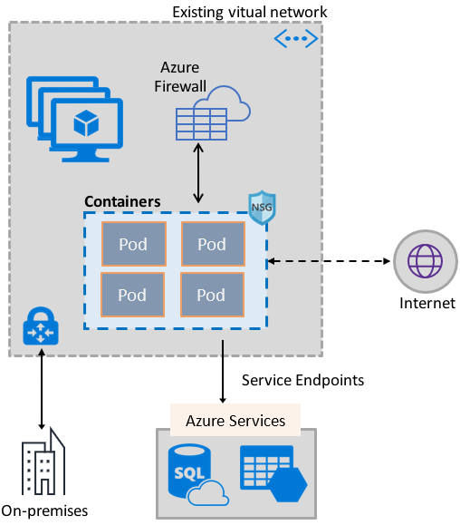
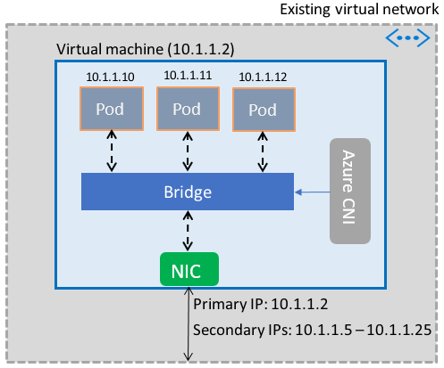

# Enable containers to use Azure Virtual Network capabilities

Bring the rich set of Azure network capabilities to containers, by utilizing the same software defined networking stack that powers virtual machines. The Azure Virtual Network container network interface (CNI) plug-in installs in an Azure Virtual Machine. The plug-in assigns IP addresses from a virtual network to containers brought up in the virtual machine, attaching them to the virtual network, and connecting them directly to other containers and virtual network resources. The plug-in doesn’t rely on overlay networks, or routes, for connectivity, and provides the same performance as virtual machines. At a high level, the plug-in provides the following capabilities:

- A virtual network IP address is assigned to every Pod, which could consist of one or more containers.
- Pods can connect to peered virtual networks and to on-premises over ExpressRoute or a site-to-site VPN. Pods are also reachable from peered and on-premises networks.
- Pods can access services such as Azure Storage and Azure SQL Database, that are protected by virtual network service endpoints.
- Network security groups and routes can be applied directly to Pods.
- Pods can be placed directly behind an Azure internal or public Load Balancer, just like virtual machines
- Pods can be assigned a public IP address, which makes them directly accessible from the internet. Pods can also access the internet themselves.
- Works seamlessly with Kubernetes resources such as Services, Ingress controllers, and Kube DNS. A Kubernetes Service can also be exposed internally or externally through the Azure Load Balancer.

The following picture shows how the plug-in provides Azure Virtual Network capabilities to Pods:

The plug-in supports both Linux and Windows platforms.

## Connecting Pods to a virtual network

Pods are brought up in a virtual machine that is part of a virtual network. A pool of IP addresses for the Pods is configured as secondary addresses on a virtual machine's network interface. Azure CNI sets up the basic Network connectivity for Pods and manages the utilization of the IP addresses in the pool. When a Pod comes up in the virtual machine, Azure CNI assigns an available IP address from the pool and connects the Pod to a software bridge in the virtual machine. When the Pod terminates, the IP address is added back to the pool. The following picture shows how Pods connect to a virtual network:

## Internet access

To enable Pods to access the internet, the plug-in configures *iptables* rules to network address translate (NAT) the internet bound traffic from Pods. The source IP address of the packet is translated to the primary IP address on the virtual machine's network interface. Windows virtual machines automatically source NAT (SNAT) traffic destined to IP addresses outside the subnet the virtual machine is in. Typically, all traffic destined to an IP address outside of the IP range of the virtual network is translated.

## Limits

The plug-in supports up to 250 Pods per virtual machine and up to 16,000 Pods in a virtual network. These limits are different for the [Azure Kubernetes Service](../azure-subscription-service-limits.md?toc=%2fazure%2fvirtual-network%2ftoc.json#azure-kubernetes-service-limits).

## Using the plug-in

The plug-in can be used in the following ways, to provide basic virtual network attach for Pods or Docker containers:

- **Azure Kubernetes Service**: The plug-in is integrated into the Azure Kubernetes Service (AKS), and can be used by choosing the *Advanced Networking* option. Advanced Networking lets you deploy a Kubernetes cluster in an existing, or a new, virtual network. To learn more about Advanced Networking and the steps to set it up, see [Network configuration in AKS](../aks/networking-overview.md?toc=%2fazure%2fvirtual-network%2ftoc.json).
- **AKS-Engine**: AKS-Engine is a tool that generates an Azure Resource Manager template for the deployment of a Kubernetes cluster in Azure. For detailed instructions, see [Deploy the plug-in for AKS-Engine Kubernetes clusters](deploy-container-networking.md#deploy-the-azure-virtual-network-container-network-interface-plug-in).
- **Creating your own Kubernetes cluster in Azure**: The plug-in can be used to provide basic networking for Pods in Kubernetes clusters that you deploy yourself, without relying on AKS, or tools like the AKS-Engine. In this case, the plug-in is installed and enabled on every virtual machine in a cluster. For detailed instructions, see [Deploy the plug-in for a Kubernetes cluster that you deploy yourself](deploy-container-networking.md#deploy-plug-in-for-a-kubernetes-cluster).
- **Virtual network attach for Docker containers in Azure**: The plug-in can be used in cases where you don’t want to create a Kubernetes cluster, and would like to create Docker containers with virtual network attach, in virtual machines. For detailed instructions, see [Deploy the plug-in for Docker](deploy-container-networking.md#deploy-plug-in-for-docker-containers).

## Next steps

[Deploy the plug-in](deploy-container-networking.md) for Kubernetes clusters or Docker containers
