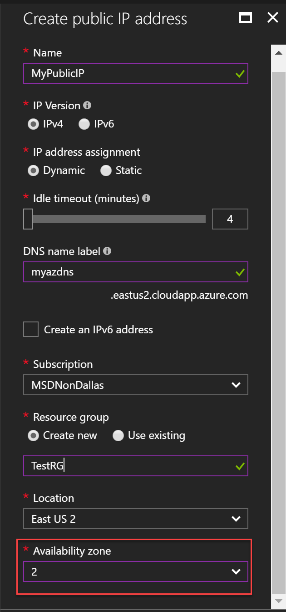

---
title: Create a zoned Public IP with the Azure Portal | Microsoft Docs
description: Create a public IP in an availability zone with the Azure Portal
services: virtual-network
documentationcenter: virtual-network
author: KumudD
manager: timlt
editor: 
tags: 

ms.assetid: 
ms.service: virtual-network
ms.devlang: na
ms.topic: 
ms.tgt_pltfrm: 
ms.workload: infrastructure
ms.date: 09/13/2017
ms.author: kumud
ms.custom: 
---

# Create a Public IP in an availability zone with The Azure Portal

Azure Public IP Addresses can be created through the Azure portal. This method provides a browser-based user interface for creating and configuring Public IP Addresses all related resources. This article steps through creating a Public IP Address in an availability zone (preview). An [availability zone](../availability-zones/az-overview.md) is a physically separate zone in an Azure region.
  

If you don't have an Azure subscription, create a [free account](https://azure.microsoft.com/free/?WT.mc_id=A261C142F) before you begin.

This article requires the Azure PowerShell module version 3.6 [*TBD*] or later. Run `Get-Module -ListAvailable AzureRM` to find the version. If you need to install or upgrade, see [Install Azure PowerShell module](/powershell/azure/install-azurerm-ps).

## Log in to Azure

Log in to the Azure portal at https://portal.azure.com. 

## Create a zonal Public IP

1. Click the **New** button found on the upper left-hand corner of the Azure portal.
2. Select **Networking**, and then select **Public IP address**.
3. Enter or select values for the following settings in the **Create public IP address** blade that appears, then click **Create**:

	|Setting|Required?|Details|
	|---|---|---|
	|Name|Yes|The name must be unique within the resource group you select.|
    |IP Version|Yes| Select IPv4 or IPv6. While public IPv4 addresses can be assigned to several Azure resources, an IPv6 public IP address can only be assigned to an Internet-facing load balancer. The load balancer can load balance IPv6 traffic to Azure virtual machines. Learn more about [load balancing IPv6 traffic to virtual machines](../load-balancer/load-balancer-ipv6-overview.md?toc=%2fazure%2fvirtual-network%2ftoc.json).
	|IP address assignment|Yes|**Dynamic:** Dynamic addresses are assigned only after the public IP address is associated to a NIC attached to a VM and the VM is started for the first time. Dynamic addresses can change if the VM the NIC is attached to is stopped (deallocated). The address remains the same if the VM is rebooted or stopped (but not deallocated). **Static:** Static addresses are assigned when the public IP address is created. Static addresses do not change even if the VM is put in the stopped (deallocated) state. The address is only released when the NIC is deleted. You can change the assignment method after the NIC is created. If you select IPv6 for the **IP version**, the only available assignment method is **Dynamic**.|
	|Idle timeout (minutes)|No|How many minutes to keep a TCP or HTTP connection open without relying on clients to send keep-alive messages. If you select IPv6 for **IP Version**, this value can't be changed. |
	|DNS name label|No|Must be unique within the Azure location you create the name in (across all subscriptions and all customers). The Azure public DNS service automatically registers the name and IP address so you can connect to a resource with the name. Azure appends *location.cloudapp.azure.com* (where location is the location you select) to the name you provide to create the fully qualified DNS name. If you choose to create both address versions, the same DNS name is assigned to both the IPv4 and IPv6 addresses. The Azure DNS service contains both IPv4 A and IPv6 AAAA name records and responds with both records when the DNS name is looked up. The client chooses which address (IPv4 or IPv6) to communicate with.|
    |Create an IPv6 (or IPv4) address|No| Whether IPv6 or IPv4 is displayed is dependent on what you select for **IP Version**. For example, if you select **IPv4** for **IP Version**, **IPv6** is displayed here.
    |Name (Only visible if you checked the **Create an IPv6 (or IPv4) address** checkbox)|Yes, if you select the **Create an IPv6** (or IPv4) checkbox.|The name must be different than the name you enter for the first **Name** in this list. If you choose to create both an IPv4 and an IPv6 address, the portal creates two separate public IP address resources, one with each IP address version assigned to it.|
    |IP address assignment (Only visible if you checked the **Create an IPv6 (or IPv4) address** checkbox)|Yes, if you select the **Create an IPv6** (or IPv4) checkbox.|If the checkbox says **Create an IPv4 address**, you can select an assignment method. If the checkbox says **Create an IPv6 address**, you cannot select an assignment method, as it must be **Dynamic**.|
	|Subscription|Yes|Must exist in the same [subscription](../azure-glossary-cloud-terminology.md?toc=%2fazure%2fvirtual-network%2ftoc.json#subscription) as the resource you want to associate the public IP address to.|
	|Resource group|Yes|Can exist in the same, or different, [resource group](../azure-glossary-cloud-terminology.md?toc=%2fazure%2fvirtual-network%2ftoc.json#resource-group) as the resource you want to associate the public IP address to.|
	|Location|Yes|Must exist in the same [location](https://azure.microsoft.com/regions), also referred to as region, as the resource you want to associate the public IP address to.|
	|Availability zone|No|Must exist in the same [location](https://azure.microsoft.com/regions), also referred to as region, and in the same [availability zone](../availability-zones/az-overview.md), as the resource you want to associate the public IP address to.|

     

## Next step

- Learn more about [Availability Zones] (../availability-zones/az-overview.md)