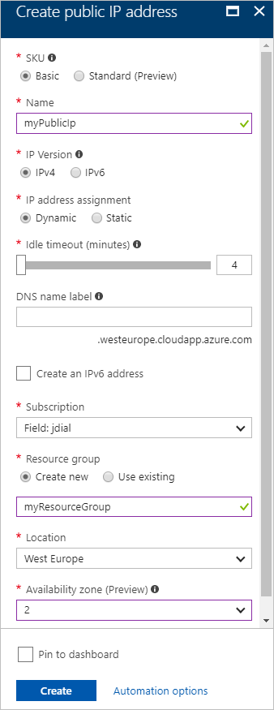

---
title: Create a zoned Public IP address with the Azure Portal | Microsoft Docs
description: Create a public IP address in an availability zone with the Azure Portal.
services: virtual-network
documentationcenter: virtual-network
author: jimdial
manager: jeconnoc
editor: 
tags: 

ms.assetid: 
ms.service: virtual-network
ms.devlang: na
ms.topic: 
ms.tgt_pltfrm: 
ms.workload: infrastructure
ms.date: 09/17/2017
ms.author: jdial
ms.custom: 
---

# Create a public IP address in an availability zone with The Azure portal

You can deploy a public IP address in an Azure availability zone (preview). An [availability zone](../availability-zones/az-overview.md) is a physically separate zone in an Azure region. You learn how to:

> * Create a public IP address in an availability zone
> * Identify related resources created in the availability zone
  
If you don't have an Azure subscription, create a [free account](https://azure.microsoft.com/free/?WT.mc_id=A261C142F) before you begin.

## Log in to Azure

Log in to the Azure portal at https://portal.azure.com. 

## Create a zonal public IP address

1. Click the **New** button found on the upper left-hand corner of the Azure portal.
2. Select **Networking**, and then select **Public IP address**.
3. Enter or select values for the following settings, select your subscription, accept the defaults for the remaining settings, then click **Create**:

	|Setting|Value|
	|---|---|
	|Name|The name must be unique within the resource group you select.|
	|Resource group|Click Create new, and enter myResourceGroup|
	|Location|West Europe|
	|Availability zone|2|

     

## Next steps

- Learn more about [Availability zones](../availability-zones/az-overview.md)
- Learn more about [public IP addresses](virtual-network-public-ip-address.md)