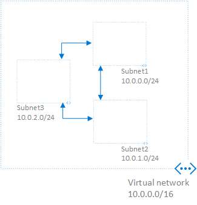
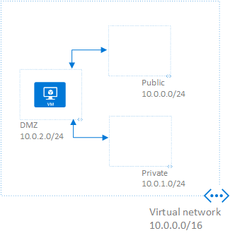
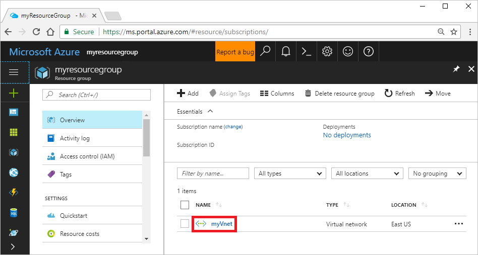
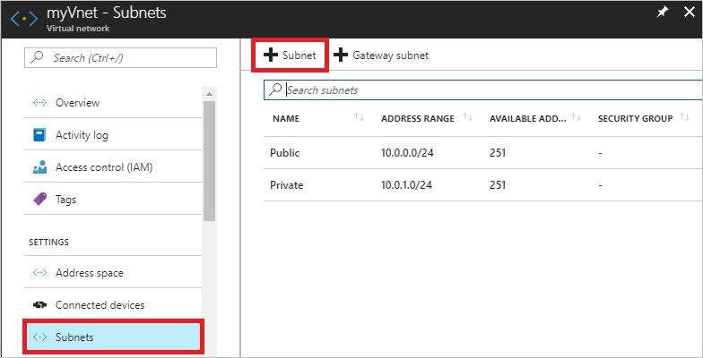
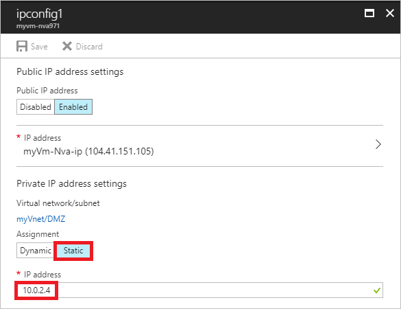

# Create a user-defined route - Azure portal

In this tutorial, learn how to create user-defined routes to route traffic between two [virtual network](virtual-networks-overview.md) subnets through a network virtual appliance. A network virtual appliance is a virtual machine that runs a network application, such as a firewall. To learn more about pre-configured network virtual appliances that you can deploy in an Azure virtual network, see the [Azure Marketplace](https://azuremarketplace.microsoft.com/marketplace/apps/category/networking?page=1&subcategories=appliances).

When you create subnets in a virtual network, Azure creates default [system routes](virtual-networks-udr-overview.md#system-routes) that enable resources in all subnets to communicate with each other, as shown in the following picture:



In this tutorial, you create a virtual network with public, private, and DMZ subnets, as shown in the picture that follows. Typically web servers might be deployed to a public subnet, and an application or database server might be deployed to a private subnet. You create a virtual machine to act as a network virtual appliance in the DMZ subnet, and optionally, create a virtual machine in each subnet that communicate through the network virtual appliance. All traffic between the public and private subnets is routed through the appliance, as shown in the following picture:



This article provides steps to create a user-defined route through the Resource Manager deployment model, which is the deployment model we recommend using when creating user-defined routes. If you need to create a user-defined route (classic), see [Create a user-defined route (classic)](virtual-network-create-udr-classic-ps.md). If you're not familiar with Azure's deployment models, see [Understand Azure deployment models](../azure-resource-manager/resource-manager-deployment-model.md?toc=%2fazure%2fvirtual-network%2ftoc.json). To learn more about user-defined routes, see [User-defined routes overview](virtual-networks-udr-overview.md#user-defined).

## Create routes and network virtual appliance

1. **Prerequisite**: Create a virtual network with two subnets by completing the steps in [Create a virtual network](#create-a-virtual-network).
2. After you've created the virtual network, in an Internet browser, go to the [Azure portal](https://portal.azure.com). Log in using your [Azure account](../azure-glossary-cloud-terminology.md?toc=%2fazure%2fvirtual-network%2ftoc.json#account).
3. On the **Search resources** box at the top of the portal, enter *myResourceGroup*. Click **myResourceGroup** when it appears in the search results. The resource group was created as part of the prerequisite.
4. Click **myVnet**, as shown in the following picture:

    

5. Create a subnet for the network virtual appliance:
 
    - Under **myVnet**, click **Subnets** under **SETTINGS** on the left side.
    - Click **+ Subnet**, as shown in the following picture:

         
    - Enter the following values under **Add subnet**, then click **OK**:

        |Setting|Value|
        |-----|-----|
        |Name|DMZ|
        |Address range (CIDR block)|10.0.2.0/24|

6. Create a network virtual appliance virtual machine:

    - On the left side of the portal, click **+ New**, then click **Compute**, and then click **Windows Server 2016 Datacenter** or **Ubuntu Server 16.04 LTS**.
    - Enter the following values on the **Basics** blade that appears, then click **OK**.

        |Setting|Value|
        |---|---|
        |Name|myVm-Nva|
        |User name|azureuser|
        |Password and Confirm password|A password of your choosing|
        |Subscription|Select your subscription|
        |Resource group|Click **Use existing**, then select **myResourceGroup**|
        |Location|East US|
    - On the **Choose a size** blade that appears, click **DS1_V2 Standard**, then click **Select**.
    - On the **Settings** blade that appears, click **Virtual network**. Click **myVnet** in the **Choose virtual network** blade that appears.
    - On the **Settings** blade, click **Subnet**. Click **DMZ** on the **Choose subnet** blade that appears. 
    - Leave the defaults for the remaining settings and click **OK**.
    - Click **Create** on the **Create** blade that appears. Deployment of the virtual machine takes a few minutes.

    > [!NOTE]
    > In addition to creating the virtual machine, the Azure portal creates a public IP address and assigns it to the virtual machine, by default. If you were deploying the virtual machine in a production environment, you may choose not to assign a public IP address to the virtual machine. Instead, you might access the network virtual appliance from other virtual machines within the virtual network. To learn more about public IP addresses, see [Manage a public IP address](virtual-network-public-ip-address.md).

7. Assign a static private IP address and enable IP forwarding for the network interface the portal created in the previous step. 
    - On the **Search resources** box at the top of the page, enter *myVm-Nva*.
    - Click **myVm-Nva** when it appears in the search results.
    - Click **Networking** under **SETTINGS** on the left side.
    - Click the name of the network interface under **myVm-Nva - Network interfaces**. The name is **myvm-nva***X*, where *X* is a number assigned by the portal.
    - Click **IP configurations** under **SETTINGS** for the network interface, as shown in the following picture:

        
        
    - Click **Enabled** for the **IP forwarding** setting, then click **Save**. IP forwarding must be enabled for each network interface that receives traffic not addressed to an IP address assigned to it. Enabling IP forwarding disables Azure's source/destination check for the network interface.
    - Click **ipconfig1** in the list of IP configurations.
    - Click **Static** for **Assignment** of the private IP address under **ipconfig1**, as shown in the following picture:

        
    - As shown in the previous picture, enter *10.0.2.4* under **IP address** in the **Private IP address settings**. Assigning a static IP address to the network interface ensures that the address doesn't change for the life of the virtual machine the network interface is attached to. The address entered is not currently assigned to another resource in the DMZ subnet that the network interface is in. 
    - To save the configuration, click **Save** under **ipconfig1**. Don't close the ipconfig1 box until you receive a notification in the portal that the network interface is saved.
 
8. Create two route tables. Route tables contain zero or more routes:

    - On the left side of the portal, click **+New** > **Networking** > **Route table**.
    - Enter the following values under **Create a route table**, and then click **Create**:

        |Setting|Value|
        |---|---|
        |Name|myRouteTable-Public|
        |Subscription|Select your subscription|
        |Resource group|Select **Use existing**, then select **myResourceGroup**|
        |Location|East US|
    
    - Complete the previous substeps of step 8 again, but name the route table *myRouteTable-Private*.
9. Add routes to the *myRouteTable-Public* route table and associate the route table to the *Public* subnet:

    - On the **Search resources** box at the top of the portal, enter *myRouteTable-Public*. Click **myRouteTable-Public** when it appears in the search results.
    - Under **myRouteTable-Public**, click **Routes** in the list of **SETTINGS**.
    - Click **+ Add** under **myRouteTable-Public - Routes**.
    -  By default, Azure routes traffic between all subnets within a virtual network. Create a route to change Azure's default routing so that traffic from the *Public* subnet is routed through the NVA, instead of directly to the *Private* subnet. Enter the following values on the **Add route** blade that appears, and then click **OK**:

        |Setting|Value|Explanation|
        |---|---|---|
        |Route name|ToPrivateSubnet|This route directs traffic to the Private subnet, through the network virtual appliance.|
        |Address prefix|10.0.1.0/24| Any traffic sent to any addresses within this address prefix (10.0.1.0 - 10.0.1.254) is sent to the network virtual appliance.|
        |Next hop type| Select **Virtual appliance**||
        |Next hop address|10.0.2.4| The static private IP address of the network interface attached to the network virtual appliance. The only hop type you can specify an address for is **Virtual appliance**.|

    - Under **myRouteTable-Public**, click **Subnets** under **Settings**. 
    - Click **+ Associate** under **myRouteTable-Public - Subnets**.
    - Click **Virtual network** under **Associate subnet**, then click **myVnet**.
    - Click **Subnet** under **Associate subnet**, then click **Public** under **Choose Subnet**. 
    - To save the configuration, click **OK** under **Associate subnet**. A subnet can have zero or one route table associated to it.
10. Complete step 9 again, searching for **myRouteTable-Private**, creating a route with the following settings, then associating the route table to the **Private** subnet of the **myVnet** virtual network:

    |Setting|Value|Explanation|
    |---|---|---|
    |Route name|ToPublicSubnet|This route directs traffic to the public subnet, through the network virtual appliance.|
    |Address prefix|10.0.0.0/24| Any traffic sent to any addresses within this address prefix (10.0.0.0 - 10.0.1.254) is sent to the network virtual appliance.|
    |Next hop type| Select **Virtual appliance**||
    |Next hop address|10.0.2.4||

    Network traffic between any resources in the Private and Public subnets flows through the network virtual appliance. 
11. **Optional:** Create a virtual machine in the Public and Private subnets and validate that communication between the virtual machines is routed through the network virtual appliance by completing the steps in [Validate routing](#validate-routing). 
12. **Optional**: Delete the resources that you create in this tutorial, by completing the steps in [Delete resources](#delete-resources).

## Validate routing

1. If you haven't already, complete the steps in [Create routes and network virtual appliance](#create-routes-and-network-virtual-appliance).
2. Click the **Try it** button in the box that follows, which opens the Azure Cloud Shell. If prompted, log in to Azure using your [Azure account](../azure-glossary-cloud-terminology.md?toc=%2fazure%2fvirtual-network%2ftoc.json#account). If you don't have an Azure account, you can sign up for a [free trial](https://azure.microsoft.com/offers/ms-azr-0044p). The Azure Cloud Shell is a free bash shell with the Azure command-line interface preinstalled. 

    The following scripts create two virtual machines, one in the *Public* subnet, and one in the *Private* subnet. The scripts also enable IP forwarding for the network interface within the operating system of the NVA to enable the operating system to route traffic through the network interface. A production NVA typically inspects the traffic before routing it, but in this tutorial, the simple NVA just routes the traffic without inspecting it. 

    Click the **Copy** button in the **Linux** or **Windows** scripts that follow and paste the script contents into a text editor. Change the password for the *adminPassword* variable, then paste the script into the Azure Cloud Shell. Run the script for the operating system you selected when you created the network virtual appliance in step 6 of [Create routes and network virtual appliance](#create-routes-and-network-virtual-appliance). 

    **Linux**

    ```azurecli-interactive
    #!/bin/bash

    #Set variables used in the script.
    rgName="myResourceGroup"
    location="eastus"
    adminPassword=ChangeToYourPassword
    
    # Create a virtual machine in the Public subnet.
    az vm create \
      --resource-group $rgName \
      --name myVm-Public \
      --image UbuntuLTS \
      --vnet-name myVnet \
      --subnet Public \
      --public-ip-address myPublicIp-Public \
      --admin-username azureuser \
      --admin-password $adminPassword

    # Create a virtual machine in the Private subnet.
    az vm create \
      --resource-group $rgName \
      --name myVm-Private \
      --image UbuntuLTS \
      --vnet-name myVnet \
      --subnet Private \
      --public-ip-address myPublicIp-Private \
      --admin-username azureuser \
      --admin-password $adminPassword

    # Enable IP forwarding for the network interface in the NVA virtual machine's operating system.    
    az vm extension set \
      --resource-group $rgName \
      --vm-name myVm-Nva \
      --name customScript \
      --publisher Microsoft.Azure.Extensions \
      --settings '{"commandToExecute":"sudo sysctl -w net.ipv4.ip_forward=1"}'
    ```

    **Windows**

    ```azurecli-interactive

    #!/bin/bash
    #Set variables used in the script.
    rgName="myResourceGroup"
    location="eastus"
    adminPassword=ChangeToYourPassword
    
    # Create a virtual machine in the Public subnet.
    az vm create \
      --resource-group $rgName \
      --name myVm-Public \
      --image win2016datacenter \
      --vnet-name myVnet \
      --subnet Public \
      --public-ip-address myPublicIp-Public \
      --admin-username azureuser \
      --admin-password $adminPassword

    # Allow pings through the Windows Firewall.
    az vm extension set \
      --publisher Microsoft.Compute \
      --version 1.9 \
      --name CustomScriptExtension \
      --vm-name myVm-Public \
      --resource-group $rgName \
      --settings '{"commandToExecute":"netsh advfirewall firewall add rule name=Allow-ping protocol=icmpv4 dir=in action=allow"}'

    # Create a virtual machine in the Private subnet.
    az vm create \
      --resource-group $rgName \
      --name myVm-Private \
      --image win2016datacenter \
      --vnet-name myVnet \
      --subnet Private \
      --public-ip-address myPublicIp-Private \
      --admin-username azureuser \
      --admin-password $adminPassword

    # Allow pings through the Windows Firewall.
    az vm extension set \
      --publisher Microsoft.Compute \
      --version 1.9 \
      --name CustomScriptExtension \
      --vm-name myVm-Private \
      --resource-group $rgName \
      --settings '{"commandToExecute":"netsh advfirewall firewall add rule name=Allow-ping protocol=icmpv4 dir=in action=allow"}'

    # Enable IP forwarding for the network interface in the NVA virtual machine's operating system.
    az vm extension set \
      --publisher Microsoft.Compute \
      --version 1.9 \
      --name CustomScriptExtension \
      --vm-name myVm-Nva \
      --resource-group $rgName \
      --settings '{"commandToExecute":"powershell.exe Set-ItemProperty -Path HKLM:\SYSTEM\CurrentControlSet\Services\Tcpip\Parameters -Name IpEnableRouter -Value 1"}'

    # Restart the NVA virtual machine.
    az vm extension set \
      --publisher Microsoft.Compute \
      --version 1.9 \
      --name CustomScriptExtension \
      --vm-name myVm-Nva \
      --resource-group $rgName \
      --settings '{"commandToExecute":"powershell.exe Restart-Computer -ComputerName myVm-Nva -Force"}'
    ```

3. Validate communication between the virtual machines in the Public and Private subnets. 

    - Open an [SSH](../virtual-machines/linux/tutorial-manage-vm.md?toc=%2fazure%2fvirtual-network%2ftoc.json#connect-to-vm) (Linux) or [Remote Desktop](../virtual-machines/windows/tutorial-manage-vm.md?toc=%2fazure%2fvirtual-network%2ftoc.json#connect-to-vm) (Windows) connection to the public IP address of the *myVm-Public* virtual machine.
    - From a command prompt on the *myVm-Public* virtual machine, enter `ping myVm-Private`. You receive replies because the NVA routes the traffic from the public to the private subnet.
    - From the *myVm-Public* virtual machine, run a trace route between the virtual machines in the public and private subnets. Enter the appropriate command that follows, depending upon which operating system you installed in the virtual machines in the Public and Private subnets:
        - **Windows**: From a command prompt, run the `tracert myvm-private` command.
        - **Ubuntu**: Run the `tracepath myvm-private` command.
      Traffic passes through 10.0.2.4 (the NVA) before reaching 10.0.1.4 (the virtual machine in the Private subnet). 
    - Complete the previous steps by connecting to the *myVm-Private* virtual machine and pinging the *myVm-Public* virtual machine. The trace route shows communication traveling through 10.0.2.4 before reaching 10.0.0.4 (the virtual machine in the Public subnet).
    - **Optionally**: To validate the next hop between two virtual machines within Azure, use the next hop capability of Azure Network Watcher. Before using Network Watcher, you must first [create an Azure Network Watcher instance](../network-watcher/network-watcher-create.md?toc=%2fazure%2fvirtual-network%2ftoc.json) for the region you want to use it in. In this tutorial, the US East region is used. Once you've enabled a Network Watcher instance for the region, enter the following command to see the next hop information between the virtual machines in the Public and Private subnets:
     
        ```azurecli-interactive
        az network watcher show-next-hop --resource-group myResourceGroup --vm myVm-Public --source-ip 10.0.0.4 --dest-ip 10.0.1.4
        ```

       The output returns *10.0.2.4* as the **nextHopIpAddress** and *VirtualAppliance* as the **nextHopType**. 

> [!NOTE]
> To illustrate the concepts in this tutorial, public IP addresses are assigned to the virtual machines in the Public and Private subnets, and all network port access is enabled within Azure for both virtual machines. When creating virtual machines for production use, you may not assign public IP addresses to them and may filter network traffic to the Private subnet by deploying a network virtual appliance in front of it, or by assigning a network security group to the subnets, network interface, or both. To learn more about network security groups, see [Network security groups](virtual-networks-nsg.md).

## Create a virtual network

This tutorial requires an existing virtual network with two subnets. Click the **Try it** button in the box that follows, to quickly create a virtual network. Clicking the **Try it** button opens the [Azure Cloud Shell](../cloud-shell/overview.md?toc=%2fazure%2fvirtual-network%2ftoc.json). Though the Cloud Shell runs PowerShell or a Bash shell, in this section, the Bash shell is used to create the virtual network. The Bash shell has the Azure command-line interface installed. If prompted by the Cloud Shell, log in to Azure using your [Azure account](../azure-glossary-cloud-terminology.md?toc=%2fazure%2fvirtual-network%2ftoc.json#account). If you don't have an Azure account, you can sign up for a [free trial](https://azure.microsoft.com/offers/ms-azr-0044p). To create the virtual network used in this tutorial, click the **Copy** button in the following box, then paste the script into the Azure Cloud Shell:

```azurecli-interactive
#!/bin/bash

#Set variables used in the script.
rgName="myResourceGroup"
location="eastus"

# Create a resource group.
az group create \
  --name $rgName \
  --location $location

# Create a virtual network with one subnet named Public.
az network vnet create \
  --name myVnet \
  --resource-group $rgName \
  --address-prefixes 10.0.0.0/16 \
  --subnet-name Public \
  --subnet-prefix 10.0.0.0/24

# Create an additional subnet named Private in the virtual network.
az network vnet subnet create \
  --name Private \
  --address-prefix 10.0.1.0/24 \
  --vnet-name myVnet \
  --resource-group $rgName
```

To learn more about how to use the portal, PowerShell, or an Azure Resource Manager template to create a virtual network, see [Create a virtual network](virtual-networks-create-vnet-arm-pportal.md).

## Delete resources

When you finish this tutorial, you might want to delete the resources that you created, so that you don't incur usage charges. Deleting a resource group also deletes all resources that are in the resource group. With the portal open, complete the following steps:

1. In the portal search box, enter **myResourceGroup**. In the search results, click **myResourceGroup**.
2. On the **myResourceGroup** blade, click the **Delete** icon.
3. To confirm the deletion, in the **TYPE THE RESOURCE GROUP NAME** box, enter **myResourceGroup**, and then click **Delete**.

## Next steps

- Create a [highly available network virtual appliance](/azure/architecture/reference-architectures/dmz/nva-ha?toc=%2fazure%2fvirtual-network%2ftoc.json).
- Network virtual appliances often have multiple network interfaces and IP addresses assigned to them. Learn how to [add network interfaces to an existing virtual machine](virtual-network-network-interface-vm.md#vm-add-nic) and [add IP addresses to an existing network interface](virtual-network-network-interface-addresses.md#add-ip-addresses). Though all virtual machine sizes can have at least two network interfaces attached to them, each virtual machine size supports a maximum number of network interfaces. To learn how many network interfaces each virtual machine size supports, see [Windows](../virtual-machines/windows/sizes.md?toc=%2Fazure%2Fvirtual-network%2Ftoc.json) and [Linux](../virtual-machines/linux/sizes.md?toc=%2fazure%2fvirtual-network%2ftoc.json) virtual machine sizes. 
- Create a user-defined route to force tunnel traffic on-premises through a [site-to-site VPN connection](../vpn-gateway/vpn-gateway-forced-tunneling-rm.md?toc=%2fazure%2fvirtual-network%2ftoc.json).
