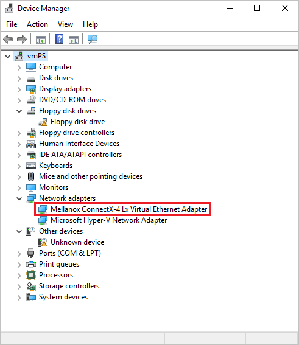

# Use Azure CLI to create a Windows or Linux VM with Accelerated Networking

This article describes how to create a Linux or Windows virtual machine (VM) with Accelerated Networking (AccelNet) enabled by using the Azure CLI command-line interface. The article also discusses how to enable and manage Accelerated Networking on existing VMs.

You can also create a VM with Accelerated Networking enabled by using the [Azure portal](quick-create-portal.md). For more information about using the Azure portal to manage Accelerated Networking on VMs, see [Manage Accelerated Networking through the portal](#manage-accelerated-networking-through-the-portal).

To use Azure PowerShell to create a Windows VM with Accelerated Networking enabled, see [Use Azure PowerShell to create a Linux VM with Accelerated Networking](create-vm-accelerated-networking-powershell.md).

## Prerequisites

- An Azure account with an active subscription. You can [create an account for free](https://azure.microsoft.com/free/?WT.mc_id=A261C142F).

- The latest version of [Azure CLI installed](/cli/azure/install-azure-cli). Sign in to Azure by using the [az login](/cli/azure/reference-index#az-login) command.

## Create a VM with Accelerated Networking

In the following examples, you can replace the example parameters such as `<myResourceGroup>`, `<myNic>`, and `<myVm>` with your own values.

### Create a virtual network

1. Use [az group create](/cli/azure/group#az-group-create) to create a resource group to contain the resources. Be sure to select a supported Windows or Linux region as listed in [Windows and Linux Accelerated Networking](https://azure.microsoft.com/updates/accelerated-networking-in-expanded-preview).

   ```azurecli
   az group create --name <myResourceGroup> --location <myAzureRegion>
   ```

1. Use [az network vnet create](/cli/azure/network/vnet#az-network-vnet-create) to create a virtual network with one subnet in the resource group:

   ```azurecli
   az network vnet create \
     --resource-group <myResourceGroup> \
     --name <myVnet> \
     --address-prefix 192.168.0.0/16 \
     --subnet-name <mySubnet> \
     --subnet-prefix 192.168.1.0/24
   ```

### Create a network security group

1. Use [az network nsg create](/cli/azure/network/nsg#az-network-nsg-create) to create a network security group (NSG).

   ```azurecli
   az network nsg create \
     --resource-group <myResourceGroup> \
     --name <myNsg>
   ```

1. The NSG contains several default rules, one of which disables all inbound access from the internet. Use [az network nsg rule create](/cli/azure/network/nsg/rule#az-network-nsg-rule-create) to open a port to allow remote desktop protocol (RDP) or secure shell (SSH) access to the VM.

   # [Windows](#tab/windows)
   
   ```azurecli
   az network nsg rule create \
     --resource-group <myResourceGroup> \
     --nsg-name <myNsg> \
     --name Allow-RDP-Internet \
     --access Allow \
     --protocol Tcp \
     --direction Inbound \
     --priority 100 \
     --source-address-prefix Internet \
     --source-port-range "*" \
     --destination-address-prefix "*" \
     --destination-port-range 3389
   ```
   
   # [Linux](#tab/linux)
   
   ```azurecli
   az network nsg rule create \
     --resource-group <myResourceGroup> \
     --nsg-name <myNsg> \
     --name Allow-SSH-Internet \
     --access Allow \
     --protocol Tcp \
     --direction Inbound \
     --priority 100 \
     --source-address-prefix Internet \
     --source-port-range "*" \
     --destination-address-prefix "*" \
     --destination-port-range 22
   ```

---
### Create a network interface with Accelerated Networking

1. Use [az network public-ip create](/cli/azure/network/public-ip#az-network-public-ip-create) to create a public IP address. The VM doesn't need a public IP address if you don't access it from the internet, but you need the public IP to complete the steps for this article.

   ```azurecli
   az network public-ip create \
     --name <myPublicIp> \
     --resource-group <myResourceGroup>
   ```

1. Use [az network nic create](/cli/azure/network/nic#az-network-nic-create) to create a network interface (NIC) with Accelerated Networking enabled. The following example creates a NIC in the subnet of the virtual network, and associates the NSG to the NIC.

   ```azurecli
   az network nic create \
    --resource-group <myResourceGroup> \
     --name <myNic> \
     --vnet-name <myVnet> \
     --subnet <mySubnet> \
     --accelerated-networking true \
     --public-ip-address <myPublicIp> \
     --network-security-group <myNsg>
   ```

### Create a VM and attach the NIC

Use [az vm create](/cli/azure/vm#az-vm-create) to create the VM, and use the `--nics` option to attach the NIC you created. Make sure to select a VM size and distribution that's listed in [Windows and Linux Accelerated Networking](https://azure.microsoft.com/updates/accelerated-networking-in-expanded-preview). For a list of all VM sizes and characteristics, see [Sizes for virtual machines in Azure](../virtual-machines/sizes.md).

# [Windows](#tab/windows)

The following example creates a Windows Server 2019 Datacenter VM with a size that supports Accelerated Networking, Standard_DS4_v2.

```azurecli
az vm create \
  --resource-group <myResourceGroup> \
  --name <myVm> \
  --image Win2019Datacenter \
  --size Standard_DS4_v2 \
  --admin-username <myAdminUser> \
  --admin-password <myAdminPassword> \
  --nics <myNic>
```

# [Linux](#tab/linux)

The following example creates a VM with a size that supports Accelerated Networking, Standard_DS4_v2.

```azurecli
az vm create \
  --resource-group <myResourceGroup> \
  --name <myVm> \
  --image UbuntuLTS \
  --size Standard_DS4_v2 \
  --admin-username <myAdminUser> \
  --generate-ssh-keys \
  --nics <myNic>
```

---

After the VM is created, you get output similar to the following example. For a Linux machine, take note of the `publicIpAddress`, which you enter to access the VM in the next step.

```output
{
  "fqdns": "",
  "id": "/subscriptions/00000000-0000-0000-0000-000000000000/resourceGroups/myResourceGroup/providers/Microsoft.Compute/virtualMachines/myVm",
  "location": "centralus",
  "macAddress": "00-0D-3A-23-9A-49",
  "powerState": "VM running",
  "privateIpAddress": "192.168.0.4",
  "publicIpAddress": "40.68.254.142",
  "resourceGroup": "myResourceGroup"
}
```

## Confirm that accelerated networking is enabled

# [Windows](#tab/windows)

Once you create the VM in Azure, connect to the VM and confirm that the Ethernet controller is installed in Windows.

1. In the [Azure portal](https://portal.azure.com), search for and select *virtual machines*.

1. On the **Virtual machines** page, select your new VM.

1. On the VM's **Overview** page, select **Connect**.

1. On the **Connect** screen, select **Native RDP**.

1. On the **Native RDP** screen, select **Download RDP file**.

1. Open the downloaded RDP file, and then sign in with the credentials you entered when you created the VM.

1. On the remote VM, right-click **Start** and select **Device Manager**.

1. In the **Device Manager** window, expand the **Network adapters** node.

1. Confirm that the **Mellanox ConnectX-4 Lx Virtual Ethernet Adapter** appears, as shown in the following image:

   

   The presence of the adapter confirms that Accelerated Networking is enabled for your VM.

> [!NOTE]
> If the Mellanox adapter fails to start, open an administrator command prompt on the remote VM and enter the following command:
>
> `netsh int tcp set global rss = enabled`

# [Linux](#tab/linux)

1. Use the following command to create an SSH session with the VM. Replace `<myPublicIp>` with the public IP address assigned to the VM you created, and replace `<myAdminUser>` with the `--admin-username` you specified when you created the VM.

   ```azurecli
   ssh <myAdminUser>@<myPublicIp>
   ```

1. From a shell on the remote VM, enter `uname -r` and confirm that the kernel version is one of the following versions, or greater:

   - **Ubuntu 16.04**: 4.11.0-1013.
   - **SLES SP3**: 4.4.92-6.18.
   - **RHEL**: 3.10.0-693, 2.6.32-573. RHEL 6.7-6.10 are supported if the Mellanox VF version 4.5+ is installed before Linux Integration Services 4.3+.
   - **CentOS**: 3.10.0-693.

   > [!NOTE]
   > Other kernel versions may be supported. For an updated list, see the compatibility tables for each distribution at [Supported Linux and FreeBSD virtual machines for Hyper-V](/windows-server/virtualization/hyper-v/supported-linux-and-freebsd-virtual-machines-for-hyper-v-on-windows), and confirm that SR-IOV is supported. You can find more details in the release notes for [Linux Integration Services for Hyper-V and Azure](https://www.microsoft.com/download/details.aspx?id=55106). * 

1. Use the `lspci` command to confirm that the Mellanox VF device is exposed to the VM. The returned output should be similar to the following example:

   ```output
   0000:00:00.0 Host bridge: Intel Corporation 440BX/ZX/DX - 82443BX/ZX/DX Host bridge (AGP disabled) (rev 03)
   0000:00:07.0 ISA bridge: Intel Corporation 82371AB/EB/MB PIIX4 ISA (rev 01)
   0000:00:07.1 IDE interface: Intel Corporation 82371AB/EB/MB PIIX4 IDE (rev 01)
   0000:00:07.3 Bridge: Intel Corporation 82371AB/EB/MB PIIX4 ACPI (rev 02)
   0000:00:08.0 VGA compatible controller: Microsoft Corporation Hyper-V virtual VGA
   0001:00:02.0 Ethernet controller: Mellanox Technologies MT27500/MT27520 Family [ConnectX-3/ConnectX-3 Pro Virtual Function]
   ```

1. Use the `ethtool -S eth0 | grep vf_` command to check for activity on the virtual function (VF). If accelerated networking is enabled and active, you receive output similar to the following example:

   ```output
   vf_rx_packets: 992956
   vf_rx_bytes: 2749784180
   vf_tx_packets: 2656684
   vf_tx_bytes: 1099443970
   vf_tx_dropped: 0
   ```

---

## Handle dynamic binding and revocation of virtual function

Binding to the synthetic NIC that's exposed in the VM is a mandatory requirement for all applications that take advantage of Accelerated Networking. If an application runs directly over the VF NIC, it doesn't receive all packets that are destined to the VM, because some packets show up over the synthetic interface.

You must run an application over the synthetic NIC to guarantee that the application receives all packets that are destined to it. Binding to the synthetic NIC also ensures that the application keeps running even if the VF is revoked during host servicing.

For more information about application binding requirements, see [How Accelerated Networking works in Linux and FreeBSD VMs](./accelerated-networking-how-it-works.md#application-usage).

<a name="enable-accelerated-networking-on-existing-vms"></a>

## Manage Accelerated Networking on existing VMs

It's possible to enable Accelerated Networking on an existing VM. The VM must meet the following requirements to support Accelerated Networking:

- A supported size for Accelerated Networking.

- A supported Azure Marketplace image and kernel version for Linux.

- Stopped or deallocated before you can enable Accelerated Networking on any NIC. This requirement applies to all individual VMs or VMs in an availability set or Azure Virtual Machine Scale Sets.

### Enable Accelerated Networking on individual VMs or VMs in availability sets

1. First, stop and deallocate the VM, or all the VMs in the availability set.

   ```azurecli
   az vm deallocate \
     --resource-group <myResourceGroup> \
     --name <myVm>
   ```

   If you created your VM individually without an availability set, you must stop or deallocate only the individual VM to enable Accelerated Networking. If you created your VM with an availability set, you must stop or deallocate all VMs in the set before you can enable Accelerated Networking on any of the NICs.

1. Once the VM is stopped, enable Accelerated Networking on the NIC of your VM.

   ```azurecli
   az network nic update \
     --name <myNic> \
     --resource-group <myResourceGroup> \
     --accelerated-networking true
   ```

1. Restart your VM, or all the VMs in the availability set, and [confirm that Accelerated Networking is enabled](#confirm-that-accelerated-networking-is-enabled).

   ```azurecli
   az vm start --resource-group <myResourceGroup> \
     --name <myVm>
   ```

### Enable Accelerated Networking on Virtual Machine Scale Sets

Azure Virtual Machine Scale Sets is slightly different, but follows the same workflow.

1. First, stop the VMs:

   ```azurecli
   az vmss deallocate \
     --name <myVmss> \
     --resource-group <myResourceGroup>
   ```

1. Once the VMs are stopped, update the Accelerated Networking property under the network interface.

   ```azurecli
   az vmss update --name <myVmss> \
     --resource-group <myResourceGroup> \
     --set virtualMachineProfile.networkProfile.networkInterfaceConfigurations[0].enableAcceleratedNetworking=true
   ```

1. Virtual Machine Scale Sets has an upgrade policy that applies updates by using automatic, rolling, or manual settings. The following instructions set the policy to automatic so Virtual Machine Scale Sets picks up the changes immediately after restart.

   ```azurecli
   az vmss update \
     --name <myVmss> \
     --resource-group <myResourceGroup> \
     --set upgradePolicy.mode="automatic"
   ```

1. Finally, restart Virtual Machine Scale Sets.

   ```azurecli
   az vmss start \
     --name <myVmss> \
     --resource-group <myResourceGroup>
   ```

Once you restart and the upgrades finish, the VF appears inside VMs that use a supported OS and VM size.

### Resize existing VMs with Accelerated Networking

You can resize VMs with Accelerated Networking enabled only to sizes that also support Accelerated Networking. You can't resize a VM with Accelerated Networking to a VM instance that doesn't support Accelerated Networking by using the resize operation. Instead, use the following process to resize these VMs:

1. Stop and deallocate the VM or all the VMs in the availability set or Virtual Machine Scale Sets.

1. Disable Accelerated Networking on the NIC of the VM or all the VMs in the availability set or Virtual Machine Scale Sets.

1. Move the VM or VMs to a new size that doesn't support Accelerated Networking, and restart them.

## Manage Accelerated Networking through the portal

When you [create a VM in the Azure portal](/azure/virtual-machines/linux/quick-create-portal), you can select the **Enable accelerated networking** checkbox on the **Networking** tab of the **Create a virtual machine** screen.

If the VM uses a [supported operating system](./accelerated-networking-overview.md#supported-operating-systems) and [VM size](./accelerated-networking-overview.md#supported-vm-instances) for Accelerated Networking, the **Enable accelerated networking** checkbox on the **Networking** tab of the **Create a virtual machine** screen is automatically selected. If Accelerated Networking isn't supported, the checkbox isn't selected, and a message explains the reason.

>[!NOTE]
>- You can enable Accelerated Networking during portal VM creation only for Azure Marketplace supported operating systems. To create and enable Accelerated Networking for a VM with a custom OS image, you must use Azure CLI or PowerShell.
>
>- The Accelerated Networking setting in the portal shows the user-selected state. Accelerated Networking allows choosing **Disabled** in the portal even if the VM size requires Accelerated Networking. VM sizes that require Accelerated Networking enable Accelerated Networking at runtime regardless of the user setting in the portal.

To enable or disable Accelerated Networking for an existing VM through the Azure portal:

1. From the [Azure portal](https://portal.azure.com) page for the VM, select **Networking** from the left menu.

1. On the **Networking** page, select the **Network Interface**.

1. At the top of the NIC **Overview** page, select **Edit accelerated networking**.

1. Select **Automatic**, **Enabled**, or **Disabled**, and then select **Save**.

To confirm whether Accelerated Networking is enabled for an existing VM:

1. From the portal page for the VM, select **Networking** from the left menu.

1. On the **Networking** page, select the **Network Interface**.

1. On the network interface **Overview** page, under **Essentials**, note whether **Accelerated networking** is set to **Enabled** or **Disabled**.

## Next steps

- [How Accelerated Networking works in Linux and FreeBSD VMs](./accelerated-networking-how-it-works.md)

- [Create a VM with Accelerated Networking by using PowerShell](../virtual-network/create-vm-accelerated-networking-powershell.md)

- [Proximity placement groups](../virtual-machines/co-location.md)
