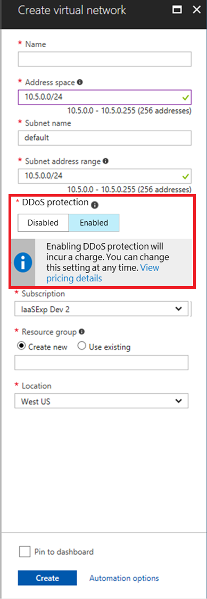
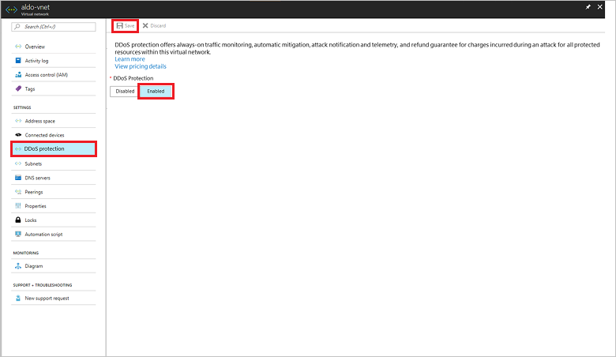
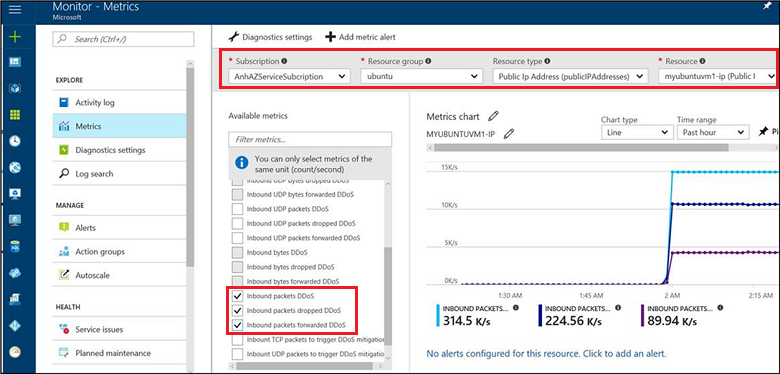
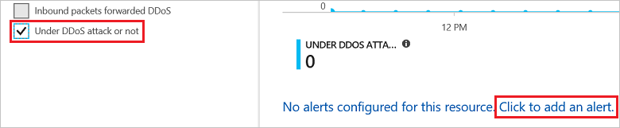
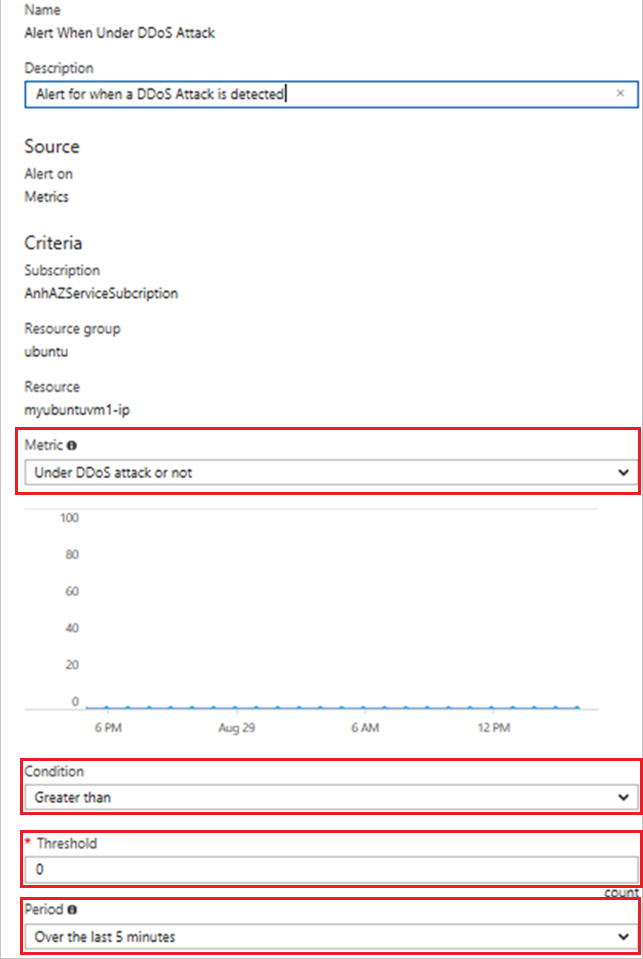
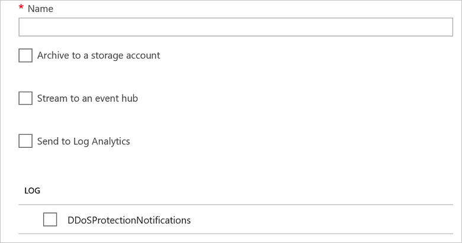
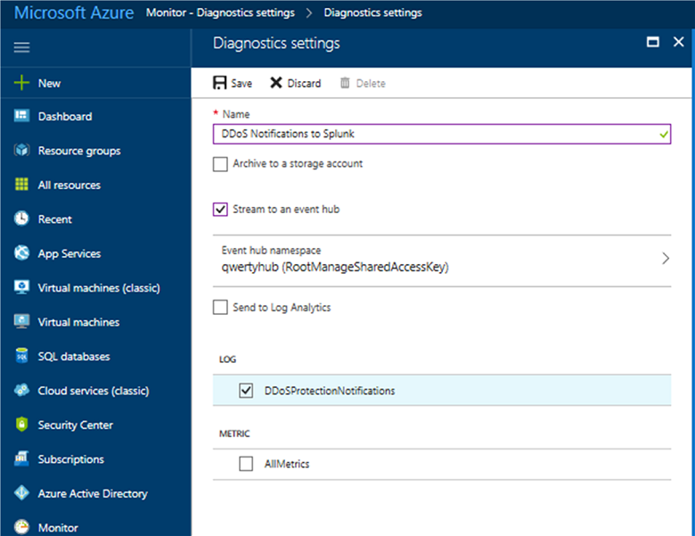

# Manage Azure DDoS Protection using the Azure portal

This article shows you how to use the Azure portal to enable DDoS Protection, disable DDoS Protection, and use telemetry to mitigate an attack. 

## Enable DDoS Protection

This section details steps to enable DDoS Protection on supported protected resource types. Before following the steps below, make sure you have completed the steps in the [FAQ](ddos-protection-faq.md). 

### Create a new virtual network and enable DDoS Protection

Navigate to **New -> Networking -> Virtual Network**

During virtual network creation, the option exists to enable DDoS Protection. A warning will state that enabling DDoS Protection incurs charges. No charges for DDoS Protection are incurred during preview. Charges are incurred at General Availability (GA) and customers will receive 30 days notice prior to the start of charges and GA.

 

Select **Enabled** and then click **Save**.

### Enable DDoS Protection on an existing virtual network 

To enable DDoS Protection on an existing virtual network, navigate to **Virtual Network -> DDoS Protection**. When this page is opened, the option to Enable or Disable DDoS Protection is presented.

Select **Enabled** and then **Save**. A warning states that enabling DDoS Protection incurs charges. No charges for DDoS Protection are incurred during preview. Charges are incurred at General Availability (GA) and customers will receive 30 days notice prior to the start of charges and GA.

## Disable DDoS Protection

This section details steps to disable DDoS Protection on supported protected resource types. 

To disable DDoS Protection, navigate to **Virtual Network -> DDoS Protection**. The option to **Disable DDoS Protection** is presented.

 

Select **Disabled** and then click **Save**.

## Use DDoS Protection telemetry

Learn how to use the Azure DDoS Protection service telemetry while under an attack using the Azure Monitor. 

Telemetry for an attack is provided through Azure Monitor in real time. The telemetry is available only for the duration that a public IP address is under mitigation. You will not see telemetry before or after an attack is mitigated.

1. To see telemetry for a DDoS attack, log into the Azure portal and navigate to the **Monitor -> Metrics** screen. 
2. Select the appropriate subscription, resource group, resource type of **Public IP** and the Public IP that is the target of the attack.   
3. After selecting the resource, a series of available metrics appears on the left side.
4. These metrics when selected, will be graphed in the Azure Monitor Metrics Chart. 

    

The metric names present different packet types and byes vs. packets, with a basic construct of tag names on each metric as follows:

- **Dropped tag name (e.g. Inbound Packets Dropped DDoS):** The number of packets dropped/scrubbed by the DDoS protection system.
- **Forwarded tag name (e.g: Inbound Packets Forwarded DDoS):** The number of packets forwarded by the DDoS system to the destination VIP – traffic that was not filtered.
- **No tag name (e.g:  Inbound Packets DDoS):** The total number of packets that came into the scrubbing system – representing the sum of the packets dropped and forwarded.

### Configure alerts on DDoS Protection metrics

Leveraging the Azure Monitor alert configuration, you can select any of the available DDoS Protection metrics to alert when there’s an active mitigation during an attack.

#### Configure email alert rules

Follow the steps below to configure an email alert for alerting. When the conditions are met, you receive an alert email on the address specified.

1. Log in to the Azure portal and navigate to the **Monitor -> Metrics** screen. 
2. Select the appropriate subscription, resource group, resource type of **Public IP** and the Public IP that is the target of the attack.
3. After selecting the resource, a series of Available Metrics appears on the left side.
4. To configure an email alert for a metric, click **Click to add an alert**. An email alert can be created on any metric, but the most obvious metric is **Under DDoS attack or not**. This is a boolean value 1 or 0. A **1** means you are under attack. A **0** means you are not under attack.

    

5. To be emailed when under attack, set the Metric for **Under DDoS attack or not** and **Condition to Greater than zero (0) over the last 5 minutes**. Similar alerts can be set up for other metrics. An example screenshot is provided below. 

    

You can also learn more about [configuring webhooks](../monitoring-and-diagnostics/insights-webhooks-alerts.md) and [logic apps](../logic-apps/logic-apps-what-are-logic-apps.md) for creating alerts.

### Configure logging on DDoS Protection metrics

To set up a logging alert, navigate to **Monitor -> Diagnostic Settings** page and then filter by Resource Group and Resource Type of Public IP Addresses.  If you don’t see the Public IP resource available in the list. Select the Public IP Resource you want to receive logs for in the drop-down list and then click **Turn on diagnostics to collect the following data**.

There are three options available for logging:

- **Archive to a storage account** – writes logs to a storage account.
- **Stream to an event hub** –  Allows a log receiver to pick up logs via an event hub. This enables integration with Splunk or other SIEM systems.
- **Send to Log Analytics** – Writes logs to Azure OMS Log Analytics service.

Below is an example configuration.

Refer to the [PowerShell quick start samples](../monitoring-and-diagnostics/insights-powershell-samples.md) to help you access & configure Azure diagnostic logging via PowerShell.

## Next steps

- [Read more about Azure Diagnostic Logs](../monitoring-and-diagnostics/monitoring-overview-of-diagnostic-logs.md)
- [Analyze logs from Azure storage with Log Analytics](../log-analytics/log-analytics-azure-storage.md)
- [Get started with Event Hubs](../event-hubs/event-hubs-csharp-ephcs-getstarted.md)