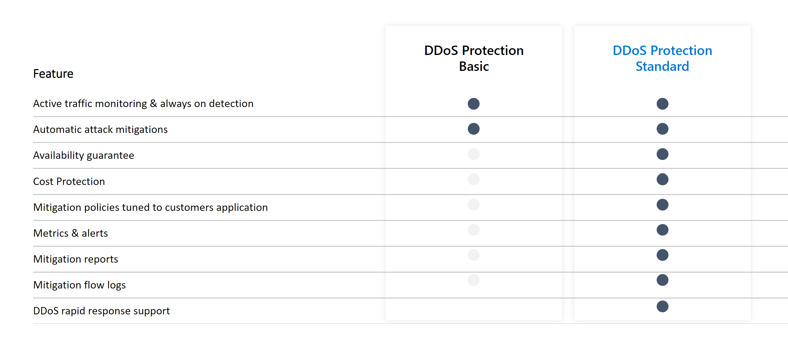

# Azure DDoS Protection Standard overview

Distributed denial of service (DDoS) attacks are some of the largest availability and security concerns facing customers that are moving their applications to the cloud. A DDoS attack attempts to exhaust an application’s resources, making the application unavailable to legitimate users. DDoS attacks can be targeted at any endpoint that is publicly reachable through the internet.

Azure DDoS protection, combined with application design best practices, provide defense against DDoS attacks. Azure DDoS protection provides the following service tiers:

- **Basic**: Automatically enabled as part of the Azure platform. Always-on traffic monitoring, and real-time mitigation of common network-level attacks, provide the same defenses utilized by Microsoft’s online services. The entire scale of Azure’s global network can be used to distribute and mitigate attack traffic across regions. Protection is provided for IPv4 and IPv6 Azure [public IP addresses](virtual-network-public-ip-address.md).
- **Standard**: Provides additional mitigation capabilities over the Basic service tier that are tuned specifically to Azure Virtual Network resources. DDoS Protection Standard is simple to enable, and requires no application changes. Protection policies are tuned through dedicated traffic monitoring and machine learning algorithms. Policies are applied to public IP addresses associated to resources deployed in virtual networks, such as Azure Load Balancer, Azure Application Gateway, and Azure Service Fabric instances, but this protection does not apply to App Service Environments. Real-time telemetry is available through Azure Monitor views during an attack, and for history. Rich attack mitigation analytics are available via diagnostic settings. Application layer protection can be added through the [Azure Application Gateway Web Application Firewall](../application-gateway//application-gateway-web-application-firewall-overview.md?toc=%2fazure%2fvirtual-network%2ftoc.json) or by installing a 3rd party firewall from Azure Marketplace. Protection is provided for IPv4 and IPv6 Azure [public IP addresses](virtual-network-public-ip-address.md).

|Feature                                         |DDoS Protection Basic                 |DDoS Protection Standard                      |
|------------------------------------------------|--------------------------------------|----------------------------------------------|
|Active traffic monitoring & always on detection |Yes                                   |Yes                                           |
|Automatic attack mitigations                    |Yes                                   |Yes                                           |
|Availability guarantee                          |Azure Region                          |Application                                   |
|Mitigation policies                             |Tuned for Azure traffic region volume |Tuned for application traffic volume          |
|Metrics & alerts                                |No                                    |Real time attack metrics & diagnostic logs via                                                                                            Azure monitor                                 |
|Mitigation reports                              |No                                    |Post attack mitigation reports                |
|Mitigation flow logs                            |No                                    |NRT log stream for SIEM integration           |
|Migration policy customizations                 |No                                    |Engage DDoS Experts                           |
|Support                                         |Best effort                           |Access to DDoS Experts during an active attack|
|SLA                                             |Azure Region                          |Application guarantee & cost protection       |
|Pricing                                         |Free                                  |Monthly & usage based                         |

## Types of DDoS attacks that DDoS Protection Standard mitigates

DDoS Protection Standard can mitigate the following types of attacks:

- **Volumetric attacks**: The attack's goal is to flood the network layer with a substantial amount of seemingly legitimate traffic. It includes UDP floods, amplification floods, and other spoofed-packet floods. DDoS Protection Standard mitigates these potential multi-gigabyte attacks by absorbing and scrubbing them, with Azure’s global network scale, automatically.
- **Protocol attacks**: These attacks render a target inaccessible, by exploiting a weakness in the layer 3 and layer 4 protocol stack. It includes, SYN flood attacks, reflection attacks, and other protocol attacks. DDoS Protection Standard mitigates these attacks, differentiating between malicious and legitimate traffic, by interacting with the client, and blocking malicious traffic. 
- **Resource (application) layer attacks**: These attacks target web application packets, to disrupt the transmission of data between hosts. The attacks include HTTP protocol violations, SQL injection, cross-site scripting, and other layer 7 attacks. Use the Azure [Application Gateway web application firewall](../application-gateway/application-gateway-web-application-firewall-overview.md?toc=%2fazure%2fvirtual-network%2ftoc.json), with DDoS Protection Standard, to provide defense against these attacks. There are also third-party web application firewall offerings available in the [Azure Marketplace](https://azuremarketplace.microsoft.com/marketplace/apps?page=1&search=web%20application%20firewall).

DDoS Protection Standard protects resources in a virtual network including public IP addresses associated with virtual machines, load balancers, and application gateways. When coupled with the Application Gateway web application firewall, DDoS Protection Standard can provide full layer 3 to layer 7 mitigation capability.

## DDoS Protection Standard features

DDoS Protection Standard features include:

- **Native platform integration:** Natively integrated into Azure. Includes configuration through the Azure portal. DDoS Protection Standard understands your resources and resource configuration.
- **Turn-key protection:** Simplified configuration immediately protects all resources on a virtual network as soon as DDoS Protection Standard is enabled. No intervention or user definition is required. DDoS Protection Standard instantly and automatically mitigates the attack, once it is detected.
- **Always-on traffic monitoring:** Your application traffic patterns are monitored 24 hour a day, 7 days a week, looking for indicators of DDoS attacks. Mitigation is performed when protection policies are exceeded.
- **Adaptive tuning:** Intelligent traffic profiling learns your application’s traffic over time, and selects and updates the profile that is the most suitable for your service. The profile adjusts as traffic changes over time.
- **Multi-Layered protection:** Provides full stack DDoS protection, when used with a web application firewall.
- **Extensive mitigation scale:** Over 60 different attack types can be mitigated, with global capacity, to protect against the largest known DDoS attacks.
- **Attack analytics:** Get detailed reports in five-minute increments during an attack, and a complete summary after the attack ends. Stream mitigation flow logs to an offline security information and event management (SIEM) system for near real-time monitoring during an attack.
- **Attack metrics:** Summarized metrics from each attack are accessible through Azure Monitor.
- **Attack alerting:** Alerts can be configured at the start and stop of an attack, and over the attack’s duration, using built-in attack metrics. Alerts integrate into your operational software like Microsoft Azure Monitor logs, Splunk, Azure Storage, Email, and the Azure portal.
- **Cost guarantee:** Data-transfer and application scale-out service credits for documented DDoS attacks.

## DDoS Protection Standard mitigation

DDoS Protection Standard monitors actual traffic utilization and constantly compares it against the thresholds defined in the DDoS Policy. When the traffic threshold is exceeded, DDoS mitigation is initiated automatically. When traffic returns below the threshold, the mitigation is removed.

During mitigation, traffic sent to the protected resource is redirected by the DDoS protection service and several checks are performed, such as the following checks:

- Ensure packets conform to internet specifications and are not malformed.
- Interact with the client to determine if the traffic is potentially a spoofed packet (e.g: SYN Auth or SYN Cookie or by dropping a packet for the source to retransmit it).
- Rate-limit packets, if no other enforcement method can be performed.

DDoS protection blocks attack traffic and forwards the remaining traffic to its intended destination. Within a few minutes of attack detection, you are notified using Azure Monitor metrics. By configuring logging on DDoS Protection Standard telemetry, you can write the logs to available options for future analysis. Metric data in Azure Monitor for DDoS Protection Standard is retained for 30 days.

Microsoft has partnered with [BreakingPoint Cloud](https://www.ixiacom.com/products/breakingpoint-cloud) to build an interface where you can generate traffic against DDoS Protection-enabled public IP addresses for simulations. The BreakPoint Cloud simulation allows you to:

- Validate how Microsoft Azure DDoS Protection Standard protects your Azure resources from DDoS attacks
- Optimize your incident response process while under DDoS attack
- Document DDoS compliance
- Train your network security teams

## Next steps

- [Configure DDoS Protection Standard](manage-ddos-protection.md)
