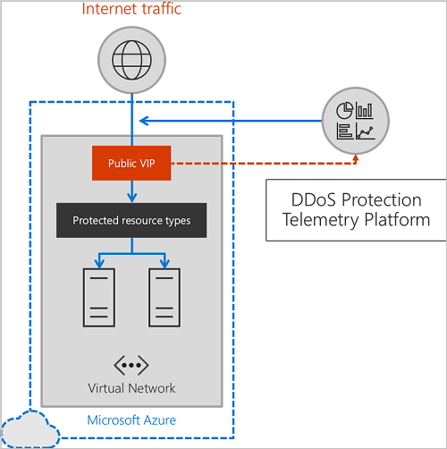

# DDoS Protection Service overview

>[!IMPORTANT]
>DDoS Protection is currently in preview. A limited number of Azure resources support DDoS Protection, and in a select number of regions. You need to register for the service during the limited preview to get the DDoS Protection service enabled for your subscription. You are contacted by the Azure DDoS team upon registration to guide you through the enablement process. Azure DDoS Protection service is available in US East, US West, and US Central regions. During preview, you are not charged for using the service.

Distributed Denial of Service (DDoS), is a type of attack where an attacker sends more requests to an application than the application is capable of handling. The resulting effect is depletion of resources, affecting the application’s availability and ability to service its customers. Over the past few years, attacks have increased sharply, with attacks becoming more sophisticated and larger in magnitude. DDoS attacks are one of the largest availability threats that face cloud services today. The intent of a DDoS attack is to exhaust the application's resources rendering the application unavailable to its customers. DDoS attacks can be targeted at any endpoint that is publicly reachable through the Internet.

DDoS Protection provides always-on network flow monitoring of the protected endpoints, and when a DDoS attack is detected, automatically applies mitigation to ensure only legitimate traffic reaches the service. DDoS Protection provides customers with the peace of mind that their services are protected from the impacts of DDoS attacks.

DDoS Protection on the virtual network has two main benefits:

- It simplifies the provisioning of protected resources in a single bulk operation and automatically protects additional resource types as they are supported.
- Protecting all the public IP resources on a virtual network ensures that an attack against one public IP in a virtual network cannot impact another public IP in a virtual network since all public IPs are protected.

For development and test scenarios, you are welcome to try DDoS Protection and provide feedback on your experiences at [Azure DDoS Protection](https://feedback.azure.com/forums/905032-azure-ddos-protection). For support issues, you can [open an Azure support ticket](azure-supportability/how-to-create-azure-support-request.md).

## Types of DDoS attacks

Services running on Azure are inherently protected by the defense that is in place to protect Azure’s infrastructure. However, the protection that safeguards the infrastructure has a much higher threshold than most applications have the capacity to handle, and does not provide telemetry or alerting, so while a traffic volume may be perceived as harmless by the platform, it can be devastating to the application receiving it. 

By enabling DDoS Protection, the application gets dedicated monitoring to detect attacks and application-specific thresholds. A service is protected with a profile that is tuned to its expected traffic volume, providing a much tighter defense against DDoS attacks.

DDoS Protection can mitigate these types of attacks:

- **Volumetric attacks** -  flood the network layer with substantial amount of seemingly legitimate traffic, and include, but are not limited to, ICMP floods, UDP floods, amplification flood and more. 
- **Protocol attacks** - also known as state exhaustion attacks target the connection state tables in firewalls, web application servers, and other infrastructure components. Includes but not limited to, SYN flood attacks, reflection attacks, and other protocol attacks. 
- **Application layer attacks** - can be mitigated by using DDoS Protection in combination with [Application Gateway](https://azure.microsoft.com/services/application-gateway/) WAF SKU to achieve complete protection both at the network layer and application layer.

DDoS Protection protects resources in a virtual network including Public IPs associated with VMs, internal load balancers, and application gateways. When coupled with the Application Gateway WAF SKU, DDoS Protection service can provide full L3 to L7 mitigation capability.

## How DDoS Protection works

DDoS Protection service features include: 

- **Native platform integration:** Azure DDoS Protection is natively integrated into Azure and includes configuration through the Azure portal and PowerShell. Azure DDoS Protection understands your resources and resource configuration.
- **Always-on traffic monitoring:** Your application traffic patterns are monitored 24x7, looking for indicators of DDoS attacks. Mitigation is performed when protection policies are exceeded.
- **Turn-key protection:** Simplified configuration immediately protects all resources on a virtual network as soon as Azure DDoS Protection is enabled. No intervention or user definition is required - DDoS Protection instantly and automatically mitigates the attack once it has been detected.
- **Adaptive tuning:** Intelligent traffic profiling learns your application’s traffic over time, and selects and updates the profile that is the most suitable for your service. The profile adjusts as traffic changes over time.
- **L3 to L7 Protection with an application gateway:** Application Gateway WAF features providing full stack DDoS protection.
- **Extensive mitigation scale:** Over 60 different attack types can be mitigated with global capacity to protect against the largest known DDoS attacks. 
- **Attack metrics:** Summarized metrics from each attack are accessible through Azure Monitor.
- **Attack alerting:** Alerts can be configured at the start and stop of an attack, and over the attack’s duration using built-in attack metrics. Alerts integrate into your operational software like OMS, Splunk, Azure Storage, Email, and Azure portal.
- **Cost guarantee:** Data-transfer and application scale-out service credits for documented DDoS attacks.

### DDoS Protection mitigation

During mitigation, traffic towards the protected resource is redirected through one or more Azure regional DDoS SDNs that exist across the globe. As traffic passes through the DDoS SDN, several checks are performed. These checks generally perform the following function:

- Ensure packets conform to Internet specifications and are not malformed.
- Interact with the client to determine if it is potentially a spoofed packet (e.g: SYN Auth or SYN Cookie or by dropping a packet for the source to retransmit it).
- Rate-limit packets if no other enforcement method can be performed.

The DDoS SDN blocks attack traffic and forward remaining traffic to intended destination. Within a few minutes of attack detection, you are notified using Azure Monitor metrics. By configuring logging on DDoS Protection telemetry, you can write the logs to available options for future analysis.

## Protected resources

A protected resource is a public IP attached to other resources. Public IPs are currently the only type of protected resource. Known public IP attachments are VMs, NVAs, application gateways, and Service Fabric. For the public IP scenarios, DDoS Protection supports any application regardless of where the associated domain is registered or hosted as long as the associated public IP is hosted on Azure.

Public IPs attached to multi-tenant, single VIP PaaS services are not supported during preview. Examples of unsupported resources include Storage VIPs, Event Hub VIPs, and Cloud Services applications.

## Traffic baselines, monitoring, and DDoS SDN

When DDoS Protection is enabled on a virtual network, as you deploy new protected resource types on the virtual network, they are added to DDoS Protection. Traffic pattern baselines are developed for the protected resources attached to the virtual network. The traffic baseline learns normal traffic bandwidth for each protected resource for every hour and day of the week. This baseline is used as the source of a DDoS policy that is installed for a protected resource.

Microsoft’s DDoS SDN monitors actual traffic utilization and constantly compares it against the thresholds defined in the DDoS Policy. When that traffic threshold is exceeded, then DDoS mitigation is initiated. When traffic goes below the threshold, the mitigation is removed.

## Next steps

- Learn more about managing DDoS Protection using [Azure PowerShell](ddos-protection-manage-ps.md) or the [Azure portal](ddos-protection-manage-portal.md).