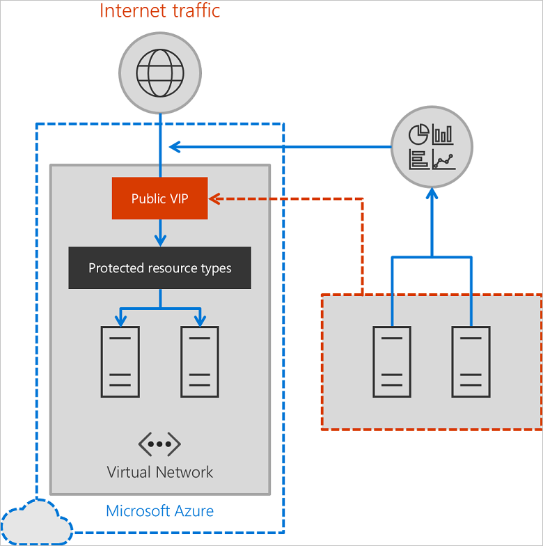

# DDoS Protection Service overview

Distributed Denial of Service, or DDoS, is a type of attack where an attacker sends more requests to an application than the application is capable of handling. The resulting effect is resources being depleted, affecting the application’s availability and ability to service its customers. Over the past few years, the industry has seen a sharp increase in attacks, with attacks becoming more sophisticated and larger in magnitude. DDoS attack can be targeted at any endpoint that is publicly reachable through the Internet.

## DDoS Protection Service

Azure DDoS Protection service is a new service offering from Azure Networking that gives our customers access to the same DDoS protection technology that safeguards Microsoft online assets such as Xbox Live and Office 365.

With the introduction of the Azure DDoS Protection service, your applications can now be protected with auto-tuned policies that are modeled after an application’s true network traffic pattern, so you do not have to worry about complex configurations to protect your applications from the impact of DDoS attacks.

>[!IMPORTANT]
>Azure DDoS Protection service is available in US East, US West, US Central, and UK South regions. During preview, you are not charged for using the service.

Azure DDoS Protection protects in-scope resources in a virtual network including Public IPs associated with VMs, internal load balancers, and application gateways. When coupled with the Application Gateway WAF SKU, DDoS Protection service can provide full L3 to L7 mitigation capability. 

## DDoS Protection Service features

Azure DDoS Protection integrates with the Azure platform providing advanced intelligence, to auto-configure and auto-tune your DDoS Protection settings. DDoS Protection uses its unique insight to your services configuration and resource health to make intelligent mitigation decisions. 

DDoS Protection includes these characteristics:

- Understands your resources and resource configuration
- Virtual network builds a profile of normal traffic
- Profile adjusts as traffic changes over time
- Protection policies define protection limits
- No user definition is required
- Mitigation is performed when protection policies are exceeded 

DDoS Protection Service is built from a strong pedigree of protecting other Microsoft online services, such as Xbox Live and Office 365. Azure DDoS Protection service features include: 

- **Native platform integration:** Azure DDoS Protection is natively integrated into Azure and includes configuration through the Azure portal and PowerShell.
- **Always-on traffic monitoring:** Your application traffic patterns are monitored 24x7, looking for indicators of DDoS attacks.
- **Turn-key protection:** Simplified configuration immediately protects all resources on a virtual network as soon as Azure DDoS Protection is enabled. No intervention is required - DDoS Protection instantly and automatically mitigates the attack once it has been detected.
- **Adaptive tuning:** Intelligent traffic profiling learns your application’s traffic over time, and selects and updates the profile that is the most suitable for your service.
- **L3 to L7 Protection with an application gateway:** Application Gateway WAF features providing full stack DDoS protection.
- **Extensive mitigation scale:** Over 60 different attack types can be mitigated with global capacity to protect against the largest known DDoS attacks. 
- **Attack metrics:** Summarized metrics from each attack are accessible through Azure Monitor.
- **Attack alerting:** Alerts can be configured at the start and stop of an attack, and over the attack’s duration using built-in attack metrics. Alerts integrate into your operational software like OMS, Splunk, Azure Storage, Email, and Azure portal.
- **Cost guarantee:** Data-transfer and application scale-out service credits for documented DDoS attacks.

## Azure DDoS Protection elements and concepts

###  Virtual network

DDoS Protection is enabled on a per virtual network basis. DDoS Protection on the virtual network has two main benefits:

- It simplifies the provisioning of protected resources in a single bulk operation and automatically protects additional resource types as they are supported.
- Protecting all the Public IP resources on a virtual network ensures that an attack against one Public IP in a virtual network cannot impact another Public IP in a virtual network since all Public IPs are protected.

### Protected resources

A protected resource in the context of private preview is a Public IP attached to specific resources. Review the FAQ section for the public IP attachments that are supported in preview.

### Traffic baseline creation

When a virtual network is enabled for DDoS Protection through Azure Resource Manager, the DDoS Protection service enumerates all protected resources on that virtual network. Similarly, as you deploy new protected resource types on the virtual network, they are added to the DDoS Protection service. The DDoS Protection service starts to develop a traffic baseline for the protected resources attached to the virtual network. The traffic baseline learns normal traffic bandwidth for each protected resource for every hour and day of the week. This baseline is used as the source of a DDoS policy that is installed for a protected resource. 

### Traffic monitoring and the DDoS SDN 

Microsoft’s DDoS SDN monitors actual traffic utilization and constantly compares it against the thresholds defined in the DDoS Policy. When that traffic threshold is exceeded, then DDoS mitigation is initiated. When traffic goes below the threshold, the mitigation is removed.

### DDoS mitigation

During mitigation, traffic towards the protected resource is redirected through one or more Azure regional DDoS SDNs that exist across the globe. As traffic passes through the DDoS SDN, several checks are performed. These checks generally perform the following function:

- Ensure packets conform to Internet specifications and are not malformed.
- Interact with the client to determine if it is potentially a spoofed packet (e.g: SYN Auth or SYN Cookie or by dropping a packet for the source to retransmit it).
- Rate-limit packets if no other enforcement method can be performed.

The DDoS SDN blocks attack traffic and forward remaining traffic to intended destination.

### Types of DDoS attacks

Azure DDoS Protection secures against many types of attacks. DDoS Protection can mitigate the following types of attacks.

#### Volumetric attacks

These attacks flood the network layer with substantial amount of seemingly legitimate traffic. Attack types include, but are not limited to, ICMP floods, UDP floods, amplification flood and more.

#### Protocol attacks

Also, known as state exhaustion attacks target the connection state tables in firewalls, web application servers, and other infrastructure components. Includes but not limited to, SYN flood attacks, reflection attacks, and other protocol attacks.

#### Application layer attacks

Use Azure DDoS Protection service in combination with [Application Gateway](https://azure.microsoft.com/services/application-gateway/) WAF SKU to achieve complete protection both at the network layer and application layer.

## Next steps

- Learn more about managing DDoS Protection using [Azure PowerShell](ddos-protection-manage-ps.md) or the [Azure portal](ddos-protection-manage-portal.md).
- Review [Frequently Asked Questions](ddos-protection-faq.md) about DDoS Protection.