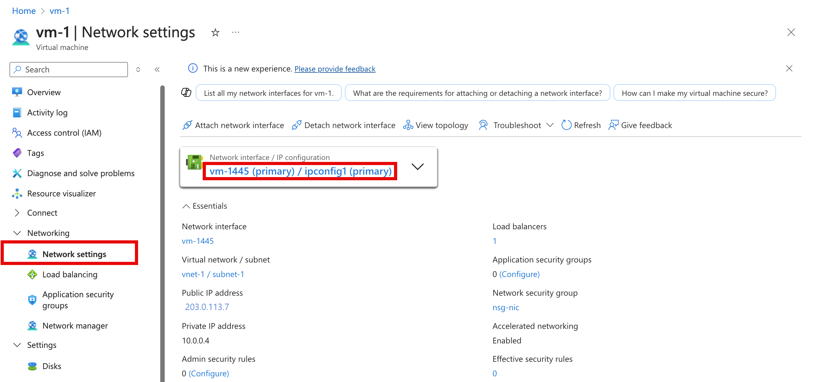
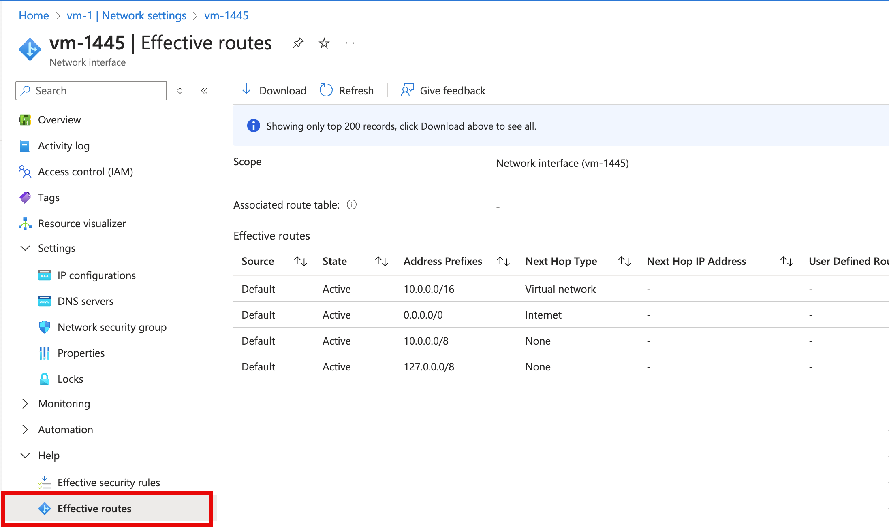

# Diagnose a virtual machine routing problem

In this article, you learn how to diagnose a routing problem by viewing the routes that are effective for a network interface in a virtual machine (VM). Azure creates several default routes for each virtual network subnet. You can override Azure's default routes by defining routes in a route table, and then associating the route table to a subnet. The combination of routes you create, Azure's default routes, and any routes propagated from your on-premises network through an Azure VPN gateway (if your virtual network is connected to your on-premises network) via the border gateway protocol (BGP), are the effective routes for all network interfaces in a subnet. If you're not familiar with virtual network, network interface, or routing concepts, see [Virtual network overview](virtual-networks-overview.md), [Network interface](virtual-network-network-interface.md), and [Routing overview](virtual-networks-udr-overview.md).

## Scenario

You attempt to connect to a VM, but the connection fails. To determine why you can't connect to the VM, you can view the effective routes for a network interface using the Azure [portal](#diagnose-using-azure-portal), [PowerShell](#diagnose-using-powershell), or the [Azure CLI](#diagnose-using-azure-cli).

The steps that follow assume you have an existing VM to view the effective routes for. If you don't have an existing VM, first deploy a [Linux](../virtual-machines/linux/quick-create-portal.md?toc=%2fazure%2fvirtual-network%2ftoc.json) or [Windows](../virtual-machines/windows/quick-create-portal.md?toc=%2fazure%2fvirtual-network%2ftoc.json) VM to complete the tasks in this article with. The examples in this article are for a VM named *myVM* with a network interface named *myVMNic1*. The VM and network interface are in a resource group named *myResourceGroup*, and are in the *East US* region. Change the values in the steps, as appropriate, for the VM you are diagnosing the problem for.

## Diagnose using Azure portal

1. Log into the Azure [portal](https://portal.azure.com) with an Azure account that has the [necessary permissions](virtual-network-network-interface.md#permissions).
2. At the top of the Azure portal, enter the name of a VM that is in the running state, in the search box. When the name of the VM appears in the search results, select it.
3. Under **Settings** on the left, select **Networking**, and navigate to the network interface resource by selecting its name.
     
4. On the left, select **Effective routes**. The effective routes for a network interface named **myVMNic1** are shown, in the following picture:
     

    If there are multiple network interfaces attached to the VM, you can view the effective routes for any network interface by selecting it. Since each network interface can be in a different subnet, each network interface can have different effective routes.

    In the example shown in the previous picture, the listed routes are default routes that Azure creates for each subnet. Your list has at least these routes, but may have additional routes, depending on capabilities you may have enabled for your virtual network such as it being peered with another virtual network or connected to your on-premises network through an Azure VPN gateway. To learn more about each of the routes, and other routes you may see for your network interface, see [Virtual network traffic routing](virtual-networks-udr-overview.md). If your list has a large number of routes, you may find it easier to select **Download**, to download a .csv file with the list of routes.

Though effective routes were viewed through the VM in the previous steps, you can also view effective routes through an:
- **Individual network interface**: Learn how to [view a network interface](virtual-network-network-interface.md#view-network-interface-settings).
- **Individual route table**: Learn how to [view a route table](manage-route-table.md#view-details-of-a-route-table).

## Diagnose using PowerShell

[!INCLUDE [updated-for-az](../../includes/updated-for-az.md)]

You can run the commands that follow in the [Azure Cloud Shell](https://shell.azure.com/powershell), or by running PowerShell from your computer. The Azure Cloud Shell is a free interactive shell. It has common Azure tools preinstalled and configured to use with your account. If you run PowerShell from your computer, you need the Azure PowerShell module, version 1.0.0 or later. Run `Get-Module -ListAvailable Az` on your computer, to find the installed version. If you need to upgrade, see [Install Azure PowerShell module](/powershell/azure/install-Az-ps). If you are running PowerShell locally, you also need to run `Connect-AzAccount` to log into Azure with an account that has the [necessary permissions](virtual-network-network-interface.md#permissions).

Get the effective routes for a network interface with [Get-AzEffectiveRouteTable](/powershell/module/az.network/get-azeffectiveroutetable). The following example gets the effective routes for a network interface named *myVMNic1*, that is in a resource group named *myResourceGroup*:

```azurepowershell-interactive
Get-AzEffectiveRouteTable `
  -NetworkInterfaceName myVMNic1 `
  -ResourceGroupName myResourceGroup `
  | Format-Table
```

To understand the information returned in the output, see [Routing overview](virtual-networks-udr-overview.md). Output is only returned if the VM is in the running state. If there are multiple network interfaces attached to the VM, you can review the effective routes for each network interface. Since each network interface can be in a different subnet, each network interface can have different effective routes. If you're still having a communication problem, see [additional diagnosis](#additional-diagnosis) and [considerations](#considerations).

If you don't know the name of a network interface, but do know the name of the VM the network interface is attached to, the following commands return the IDs of all network interfaces attached to a VM:

```azurepowershell-interactive
$VM = Get-AzVM -Name myVM `
  -ResourceGroupName myResourceGroup
$VM.NetworkProfile
```

You receive output similar to the following example:

```powershell
NetworkInterfaces
-----------------
{/subscriptions/<ID>/resourceGroups/myResourceGroup/providers/Microsoft.Network/networkInterfaces/myVMNic1
```

In the previous output, the network interface name is *myVMNic1*.

## Diagnose using Azure CLI

You can run the commands that follow in the  [Azure Cloud Shell](https://shell.azure.com/bash), or by running the CLI from your computer. This article requires the Azure CLI version 2.0.32 or later. Run `az --version` to find the installed version. If you need to install or upgrade, see [Install Azure CLI](/cli/azure/install-azure-cli). If you are running the Azure CLI locally, you also need to run `az login` and log into Azure with an account that has the [necessary permissions](virtual-network-network-interface.md#permissions).

Get the effective routes for a network interface with [az network nic show-effective-route-table](/cli/azure/network/nic#az_network_nic_show_effective_route_table). The following example gets the effective routes for a network interface named *myVMNic1* that is in a resource group named *myResourceGroup*:

```azurecli-interactive
az network nic show-effective-route-table \
  --name myVMNic1 \
  --resource-group myResourceGroup
```

To understand the information returned in the output, see [Routing overview](virtual-networks-udr-overview.md). Output is only returned if the VM is in the running state. If there are multiple network interfaces attached to the VM, you can review the effective routes for each network interface. Since each network interface can be in a different subnet, each network interface can have different effective routes. If you're still having a communication problem, see [additional diagnosis](#additional-diagnosis) and [considerations](#considerations).

If you don't know the name of a network interface, but do know the name of the VM the network interface is attached to, the following commands return the IDs of all network interfaces attached to a VM:

```azurecli-interactive
az vm show \
  --name myVM \
  --resource-group myResourceGroup
```

## Resolve a problem

Resolving routing problems typically consists of:

- Adding a custom route to override one of Azure's default routes. Learn how to [add a custom route](manage-route-table.md#create-a-route).
- Change or remove a custom route that may cause routing to an undesired location. Learn how to [change](manage-route-table.md#change-a-route) or [delete](manage-route-table.md#delete-a-route) a custom route.
- Ensuring that the route table that contains any custom routes you've defined is associated to the subnet the network interface is in. Learn how to [associate a route table to a subnet](manage-route-table.md#associate-a-route-table-to-a-subnet).
- Ensuring that devices such as Azure VPN gateway or network virtual appliances you've deployed are operable. Use the [VPN diagnostics](../network-watcher/diagnose-communication-problem-between-networks.md?toc=%2fazure%2fvirtual-network%2ftoc.json) capability of Network Watcher to determine any problems with an Azure VPN gateway.

If you're still having communication problems, see [Considerations](#considerations) and Additional diagnosis.

## Considerations

Consider the following points when troubleshooting communication problems:

- Routing is based on longest prefix match (LPM) among routes that you've defined, border gateway protocol (BGP), and system routes. If there is more than one route with the same LPM match, then a route is selected based on its origin in the order listed in [Routing overview](virtual-networks-udr-overview.md#how-azure-selects-a-route). With effective routes, you can only see effective routes that are an LPM match, based on all the available routes. Seeing how the routes are evaluated for a network interface makes it a lot easier to troubleshoot specific routes that may be impacting communication from your VM.
- If you've defined custom routes to a network virtual appliance (NVA), with *Virtual Appliance* as the next hop type, ensure that IP forwarding is enabled on the NVA receiving the traffic, or packets are dropped. Learn more about [enabling IP forwarding for a network interface](virtual-network-network-interface.md#enable-or-disable-ip-forwarding). Additionally, the operating system, or application within the NVA must also be able to forward network traffic and be configured to do so.
- If you've created a route to 0.0.0.0/0, all outbound internet traffic is routed to the next hop you specified, such as to an NVA or VPN gateway. Creating such a route is often referred to as forced tunneling. Remote connections using the RDP or SSH protocols from the internet to your VM may not work with this route, depending on how the next hop handles the traffic. Forced-tunneling can be enabled:
    - When using site-to-site VPN, by creating a route with a next hop type of *VPN Gateway*. Learn more about [configuring forced tunneling](../vpn-gateway/vpn-gateway-forced-tunneling-rm.md?toc=%2fazure%2fvirtual-network%2ftoc.json).
    - If a 0.0.0.0/0 (default route) is advertised over BGP through a virtual network gateway when using a site-to-site VPN, or ExpressRoute circuit. Learn more about using BGP with a [site-to-site VPN](../vpn-gateway/vpn-gateway-bgp-overview.md?toc=%2fazure%2fvirtual-network%2ftoc.json) or [ExpressRoute](../expressroute/expressroute-routing.md?toc=%2fazure%2fvirtual-network%2ftoc.json#ip-addresses-used-for-azure-private-peering).
- For virtual network peering traffic to work correctly, a system route with a next hop type of *VNet Peering* must exist for the peered virtual network's prefix range. If such a route doesn't exist, and the virtual network peering link is **Connected**:
    - Wait a few seconds, and retry. If it's a newly established peering link, it occasionally takes longer to propagate routes to all the network interfaces in a subnet. To learn more about virtual network peering, see [Virtual network peering overview](virtual-network-peering-overview.md) and [manage virtual network peering](virtual-network-manage-peering.md).
    - Network security group rules may be impacting communication. For more information, see [Diagnose a virtual machine network traffic filter problem](diagnose-network-traffic-filter-problem.md).
- Though Azure assigns default routes to each Azure network interface, if you have multiple network interfaces attached to the VM, only the primary network interface is assigned a default route (0.0.0.0/0), or gateway, within the VM's operating system. Learn how to create a default route for secondary network interfaces attached to a [Windows](../virtual-machines/windows/multiple-nics.md?toc=%2fazure%2fvirtual-network%2ftoc.json#configure-guest-os-for-multiple-nics) or [Linux](../virtual-machines/linux/multiple-nics.md?toc=%2fazure%2fvirtual-network%2ftoc.json#configure-guest-os-for-multiple-nics) VM. Learn more about [primary and secondary network  interfaces](virtual-network-network-interface-vm.md#constraints).

## Additional diagnosis

* To run a quick test to determine the next hop type for traffic destined to a location, use the [Next hop](../network-watcher/diagnose-vm-network-routing-problem.md?toc=%2fazure%2fvirtual-network%2ftoc.json) capability of Azure Network Watcher. Next hop tells you what the next hop type is for traffic destined to a specified location.
* If there are no routes causing a VM's network communication to fail, the problem may be due to firewall software running within the VM's operating system
* If you are [force tunneling](../vpn-gateway/vpn-gateway-forced-tunneling-rm.md?toc=%2fazure%2fvirtual-network%2ftoc.json) traffic to an on-premises device through a VPN gateway, or NVA, you may not be able to connect to a VM from the internet, depending on how you've configured routing for the devices. Confirm that the routing you have configured for the device routes traffic to either a public or private IP address for the VM.
* Use the [connection troubleshoot](../network-watcher/network-watcher-connectivity-portal.md?toc=%2fazure%2fvirtual-network%2ftoc.json) capability of Network Watcher to determine routing, filtering, and in-OS causes of outbound communication problems.

## Next steps

- Learn about all tasks, properties, and settings for a [route table and routes](manage-route-table.md).
- Learn about all [next hop types, system routes, and how Azure selects a route](virtual-networks-udr-overview.md).
