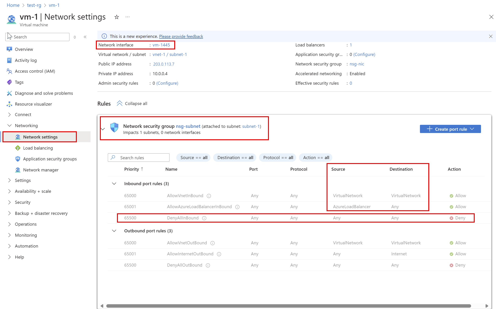

# Diagnose a virtual machine network traffic filter problem

In this article, you learn how to diagnose a network traffic filter problem by viewing the network security group (NSG) security rules that are effective for a virtual machine (VM).

NSGs enable you to control the types of traffic that flow in and out of a VM. You can associate an NSG to a subnet in an Azure virtual network, a network interface attached to a VM, or both. The effective security rules applied to a network interface are an aggregation of the rules that exist in the NSG associated to a network interface, and the subnet the network interface is in. Rules in different NSGs can sometimes conflict with each other and impact a VM's network connectivity. You can view all the effective security rules from NSGs that are applied on your VM's network interfaces. If you're not familiar with virtual network, network interface, or NSG concepts, see [Virtual network overview](virtual-networks-overview.md), [Network interface](virtual-network-network-interface.md), and [Network security groups overview](security-overview.md).

## Scenario

You attempt to connect to a VM over port 80 from the internet, but the connection fails. To determine why you can't access port 80 from the Internet, you can view the effective security rules for a network interface using the Azure [portal](#diagnose-using-azure-portal), [PowerShell](#diagnose-using-powershell), or the [Azure CLI](#diagnose-using-azure-cli).

The steps that follow assume you have an existing VM to view the effective security rules for. If you don't have an existing VM, first deploy a [Linux](../virtual-machines/linux/quick-create-portal.md?toc=%2fazure%2fvirtual-network%2ftoc.json) or [Windows](../virtual-machines/windows/quick-create-portal.md?toc=%2fazure%2fvirtual-network%2ftoc.json) VM to complete the tasks in this article with. The examples in this article are for a VM named *myVM* with a network interface named *myVMVMNic*. The VM and network interface are in a resource group named *myResourceGroup*, and are in the *East US* region. Change the values in the steps, as appropriate, for the VM you are diagnosing the problem for.

## Diagnose using Azure portal

1. Log into the Azure [portal](https://portal.azure.com) with an Azure account that has the [necessary permissions](virtual-network-network-interface.md#permissions).
2. At the top of the Azure portal, enter the name of the VM in the search box. When the name of the VM appears in the search results, select it.
3. Under **SETTINGS**, select **Networking**, as shown in the following picture:

   

   The rules you see listed in the previous picture are for a network interface named **myVMVMNic**. You see that there are **INBOUND PORT RULES** for the network interface from two different network security groups:
   
   - **mySubnetNSG**: Associated to the subnet that the network interface is in.
   - **myVMNSG**: Associated to the network interface in the VM named **myVMVMNic**.

   The rule named **DenyAllInBound** is what's preventing inbound communication to the VM over port 80, from the internet, as described in the [scenario](#scenario). The rule lists *0.0.0.0/0* for **SOURCE**, which includes the internet. No other rule with a higher priority (lower number) allows port 80 inbound. To allow port 80 inbound to the VM from the internet, see [Resolve a problem](#resolve-a-problem). To learn more about security rules and how Azure applies them, see [Network security groups](security-overview.md).

   At the bottom of the picture, you also see **OUTBOUND PORT RULES**. Under that are the outbound port rules for the network interface. Though the picture only shows four inbound rules for each NSG, your NSGs may have many more than four rules. In the picture, you see **VirtualNetwork** under **SOURCE** and **DESTINATION** and **AzureLoadBalancer** under **SOURCE**. **VirtualNetwork** and **AzureLoadBalancer** are [service tags](security-overview.md#service-tags). Service tags represent a group of IP address prefixes to help minimize complexity for security rule creation.

4. Ensure that the VM is in the running state, and then select **Effective security rules**, as shown in the previous picture, to see the effective security rules, shown in the following picture:

   

   The rules listed are the same as you saw in step 3, though there are different tabs for the NSG associated to the network interface and the subnet. As you can see in the picture, only the first 50 rules are shown. To download a .csv file that contains all of the rules, select **Download**.

   To see which prefixes each service tag represents, select a rule, such as the rule named **AllowAzureLoadBalancerInbound**. The following picture shows the prefixes for the **AzureLoadBalancer** service tag:

   

   Though the **AzureLoadBalancer** service tag only represents one prefix, other service tags represent several prefixes.

5. The previous steps showed the security rules for a network interface named **myVMVMNic**, but you've also seen a network interface named **myVMVMNic2** in some of the previous pictures. The VM in this example has two network interfaces attached to it. The effective security rules can be different for each network interface.

   To see the rules for the **myVMVMNic2** network interface, select it. As shown in the picture that follows, the network interface has the same rules associated to its subnet as the **myVMVMNic** network interface, because both network interfaces are in the same subnet. When you associate an NSG to a subnet, its rules are applied to all network interfaces in the subnet.

   

   Unlike the **myVMVMNic** network interface, the **myVMVMNic2** network interface does not have a network security group associated to it. Each network interface and subnet can have zero, or one, NSG associated to it. The NSG associated to each network interface or subnet can be the same, or different. You can associate the same network security group to as many network interfaces and subnets as you choose.

Though effective security rules were viewed through the VM, you can also view effective security rules through an individual:
- **Network interface**: Learn how to [view a network interface](virtual-network-network-interface.md#view-network-interface-settings).
- **NSG**: Learn how to [view an NSG](manage-network-security-group.md#view-details-of-a-network-security-group).

## Diagnose using PowerShell

[!INCLUDE [updated-for-az](../../includes/updated-for-az.md)]

You can run the commands that follow in the [Azure Cloud Shell](https://shell.azure.com/powershell), or by running PowerShell from your computer. The Azure Cloud Shell is a free interactive shell. It has common Azure tools preinstalled and configured to use with your account. If you run PowerShell from your computer, you need the Azure PowerShell module, version 1.0.0 or later. Run `Get-Module -ListAvailable Az` on your computer, to find the installed version. If you need to upgrade, see [Install Azure PowerShell module](/powershell/azure/install-az-ps). If you are running PowerShell locally, you also need to run `Connect-AzAccount` to log into Azure with an account that has the [necessary permissions](virtual-network-network-interface.md#permissions)].

Get the effective security rules for a network interface with [Get-AzEffectiveNetworkSecurityGroup](/powershell/module/az.network/get-azeffectivenetworksecuritygroup). The following example gets the effective security rules for a network interface named *myVMVMNic*, that is in a resource group named *myResourceGroup*:

```azurepowershell-interactive
Get-AzEffectiveNetworkSecurityGroup `
  -NetworkInterfaceName myVMVMNic `
  -ResourceGroupName myResourceGroup
```

Output is returned in json format. To understand the output, see [interpret command output](#interpret-command-output).
Output is only returned if an NSG is associated with the network interface, the subnet the network interface is in, or both. The VM must be in the running state. A VM may have multiple network interfaces with different NSGs applied. When troubleshooting, run the command for each network interface.

If you're still having a connectivity problem, see [additional diagnosis](#additional-diagnosis) and [considerations](#considerations).

If you don't know the name of a network interface, but do know the name of the VM the network interface is attached to, the following commands return the IDs of all network interfaces attached to a VM:

```azurepowershell-interactive
$VM = Get-AzVM -Name myVM -ResourceGroupName myResourceGroup
$VM.NetworkProfile
```

You receive output similar to the following example:

```output
NetworkInterfaces
-----------------
{/subscriptions/<ID>/resourceGroups/myResourceGroup/providers/Microsoft.Network/networkInterfaces/myVMVMNic
```

In the previous output, the network interface name is *myVMVMNic*.

## Diagnose using Azure CLI

If using Azure Command-line interface (CLI) commands to complete tasks in this article, either run the commands in the [Azure Cloud Shell](https://shell.azure.com/bash), or by running the CLI from your computer. This article requires the Azure CLI version 2.0.32 or later. Run `az --version` to find the installed version. If you need to install or upgrade, see [Install Azure CLI](/cli/azure/install-azure-cli). If you are running the Azure CLI locally, you also need to run `az login` and log into Azure with an account that has the [necessary permissions](virtual-network-network-interface.md#permissions).

Get the effective security rules for a network interface with [az network nic list-effective-nsg](/cli/azure/network/nic#az-network-nic-list-effective-nsg). The following example gets the effective security rules for a network interface named *myVMVMNic* that is in a resource group named *myResourceGroup*:

```azurecli-interactive
az network nic list-effective-nsg \
  --name myVMVMNic \
  --resource-group myResourceGroup
```

Output is returned in json format. To understand the output, see [interpret command output](#interpret-command-output).
Output is only returned if an NSG is associated with the network interface, the subnet the network interface is in, or both. The VM must be in the running state. A VM may have multiple network interfaces with different NSGs applied. When troubleshooting, run the command for each network interface.

If you're still having a connectivity problem, see [additional diagnosis](#additional-diagnosis) and [considerations](#considerations).

If you don't know the name of a network interface, but do know the name of the VM the network interface is attached to, the following commands return the IDs of all network interfaces attached to a VM:

```azurecli-interactive
az vm show \
  --name myVM \
  --resource-group myResourceGroup
```

Within the returned output, you see information similar to the following example:

```output
"networkProfile": {
    "additionalProperties": {},
    "networkInterfaces": [
      {
        "additionalProperties": {},
        "id": "/subscriptions/<ID>/resourceGroups/myResourceGroup/providers/Microsoft.Network/networkInterfaces/myVMVMNic",
        "primary": true,
        "resourceGroup": "myResourceGroup"
      },
```

In the previous output, the network interface name is *myVMVMNic interface*.

## Interpret command output

Regardless of whether you used the [PowerShell](#diagnose-using-powershell), or the [Azure CLI](#diagnose-using-azure-cli) to diagnose the problem, you receive output that contains the following information:

- **NetworkSecurityGroup**: The ID of the network security group.
- **Association**: Whether the network security group is associated to a *NetworkInterface* or *Subnet*. If an NSG is associated to both, output is returned with **NetworkSecurityGroup**, **Association**, and **EffectiveSecurityRules**, for each NSG. If the NSG is associated or disassociated immediately before running the command to view the effective security rules, you may need to wait a few seconds for the change to reflect in the command output.
- **EffectiveSecurityRules**: An explanation of each property is detailed in [Create a security rule](manage-network-security-group.md#create-a-security-rule). Rule names prefaced with *defaultSecurityRules/* are default security rules that exist in every NSG. Rule names prefaced with *securityRules/* are rules that you've created. Rules that specify a [service tag](security-overview.md#service-tags), such as **Internet**, **VirtualNetwork**, and **AzureLoadBalancer** for the **destinationAddressPrefix** or **sourceAddressPrefix** properties, also have values for the **expandedDestinationAddressPrefix** property. The **expandedDestinationAddressPrefix** property lists all address prefixes represented by the service tag.

If you see duplicate rules listed in the output, it's because an NSG is associated to both the network interface and the subnet. Both NSGs have the same default rules, and may have additional duplicate rules, if you've created your own rules that are the same in both NSGs.

The rule named **defaultSecurityRules/DenyAllInBound** is what's preventing inbound communication to the VM over port 80, from the internet, as described in the [scenario](#scenario). No other rule with a higher priority (lower number) allows port 80 inbound from the internet.

## Resolve a problem

Whether you use the Azure [portal](#diagnose-using-azure-portal), [PowerShell](#diagnose-using-powershell), or the [Azure CLI](#diagnose-using-azure-cli) to diagnose the problem presented in the [scenario](#scenario) in this article, the solution is to create a network security rule with the following properties:

| Property                | Value                                                                              |
|---------                |---------                                                                           |
| Source                  | Any                                                                                |
| Source port ranges      | Any                                                                                |
| Destination             | The IP address of the VM, a range of IP addresses, or all addresses in the subnet. |
| Destination port ranges | 80                                                                                 |
| Protocol                | TCP                                                                                |
| Action                  | Allow                                                                              |
| Priority                | 100                                                                                |
| Name                    | Allow-HTTP-All                                                                     |

After you create the rule, port 80 is allowed inbound from the internet, because the priority of the rule is higher than the default security rule named *DenyAllInBound*, that denies the traffic. Learn how to [create a security rule](manage-network-security-group.md#create-a-security-rule). If different NSGs are associated to both the network interface, and the subnet, you must create the same rule in both NSGs.

When Azure processes inbound traffic, it processes rules in the NSG associated to the subnet (if there is an associated NSG), and then it processes the rules in the NSG associated to the network interface. If there is an NSG associated to the network interface and the subnet, the port must be open in both NSGs, for the traffic to reach the VM. To ease administration and communication problems, we recommend that you associate an NSG to a subnet, rather than individual network interfaces. If VMs within a subnet need different security rules, you can make the network interfaces members of an application security group (ASG), and specify an ASG as the source and destination of a security rule. Learn more about [application security groups](security-overview.md#application-security-groups).

If you're still having communication problems, see [Considerations](#considerations) and Additional diagnosis.

## Considerations

Consider the following points when troubleshooting connectivity problems:

* Default security rules block inbound access from the internet, and only permit inbound traffic from the virtual network. To allow inbound traffic from the Internet, add security rules with a higher priority than default rules. Learn more about [default security rules](security-overview.md#default-security-rules), or how to [add a security rule](manage-network-security-group.md#create-a-security-rule).
* If you have peered virtual networks, by default, the **VIRTUAL_NETWORK** service tag automatically expands to include prefixes for peered virtual networks. To troubleshoot any issues related to virtual network peering, you can view the prefixes in the **ExpandedAddressPrefix** list. Learn more about [virtual network peering](virtual-network-peering-overview.md) and [service tags](security-overview.md#service-tags).
* Effective security rules are only shown for a network interface if there is an NSG associated with the VM's network interface and, or, subnet, and if the VM is in the running state.
* If there are no NSGs associated with the network interface or subnet, and you have a [public IP address](virtual-network-public-ip-address.md) assigned to a VM, all ports are open for inbound access from and outbound access to anywhere. If the VM has a public IP address, we recommend applying an NSG to the subnet the network interface.

## Additional diagnosis

* To run a quick test to determine if traffic is allowed to or from a VM, use the [IP flow verify](../network-watcher/diagnose-vm-network-traffic-filtering-problem.md) capability of Azure Network Watcher. IP flow verify tells you if traffic is allowed or denied. If denied, IP flow verify tells you which security rule is denying the traffic.
* If there are no security rules causing a VM's network connectivity to fail, the problem may be due to:
  * Firewall software running within the VM's operating system
  * Routes configured for virtual appliances or on-premises traffic. Internet traffic can be redirected to your on-premises network via [forced-tunneling](../vpn-gateway/vpn-gateway-forced-tunneling-rm.md?toc=%2fazure%2fvirtual-network%2ftoc.json). If you force tunnel internet traffic to a virtual appliance, or on-premises, you may not be able to connect to the VM from the internet. To learn how to diagnose route problems that may impede the flow of traffic out of the VM, see [Diagnose a virtual machine network traffic routing problem](diagnose-network-routing-problem.md).

## Next steps

- Learn about all tasks, properties, and settings for a [network security group](manage-network-security-group.md#work-with-network-security-groups) and [security rules](manage-network-security-group.md#work-with-security-rules).
- Learn about [default security rules](security-overview.md#default-security-rules), [service tags](security-overview.md#service-tags), and [how Azure processes security rules for inbound and outbound traffic](security-overview.md#network-security-groups) for a VM.
