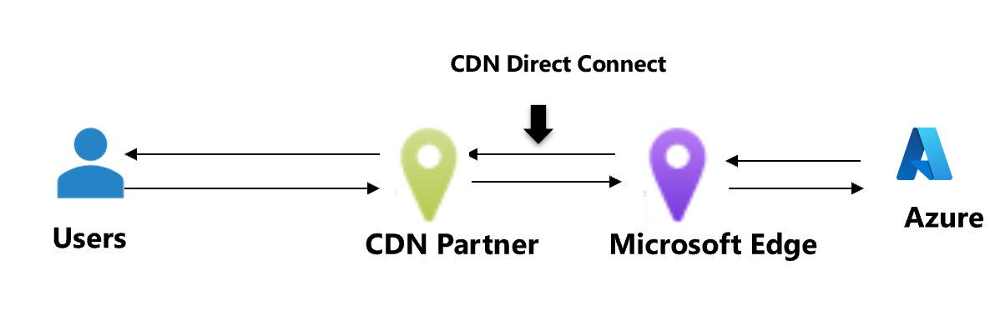

# What is Routing Preference Unmetered?

Routing Preference Unmetered is available for Content Delivery Network (CDN) providers with customers hosted their origin contents in Azure. The service allows CDN providers to establish direct peering connection with Microsoft global network edge routers at various locations.

Your network traffic egressing from origin in Azure destined to CDN provider benefits from the direct connectivity.
* Data transfer bill for traffic egressing from your Azure resources that are routed through these direct links is free.
* Direct connect between CDN provider and origin in Azure provides optimal performance as there are no hops in between. This benefits the CDN workload that frequently fetch data from the origin.

## Configuring Routing Preference Unmetered

To take advantage of Routing Preference unmetered, your CDN providers need to be part of this program. If your CDN provider is not part of the program, contact your CDN provider.

Next, configure routing preference for your resources, and set the Routing Preference type to **Internet**. You can configure Routing Preference while creating a public IP address, and then associate the public IP to resources such as virtual machines, internet facing load balancers, and more. [Learn how to configure routing preference for a public IP address using the Azure portal](./routing-preference-portal.md)

You can also enable routing preference for your storage account and publish a second endpoint, that needs to be used by CDN provider to fetch data from the storage origin. For example, publishing an internet route-specific endpoint for the storage account *StorageAccountA* will publish the second end point for your storage services as shown below:

## Next steps

* [Configure routing preference for a VM using the Azure PowerShell](./configure-routing-preference-virtual-machine-powershell.md)
* [Configure routing preference for a VM using the Azure CLI](./configure-routing-preference-virtual-machine-cli.md)
* [Configure routing preference for your storage account](../../storage/common/network-routing-preference.md)