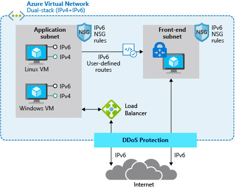

# What is IPv6 for Azure Virtual Network? (Preview)

IPv6 for Azure Virtual Network (VNET) enables you to host applications in Azure with IPv6 and IPv4 connectivity both within a virtual network and to and from the Internet. Due to the exhaustion of public IPv4 addresses, new networks for mobility and Internet of Things (IoT) are often built on IPv6. Even long established ISP and mobile networks are being transformed to IPv6. IPv4-only services can find themselves at a real disadvantage in both existing and emerging markets. Dual stack IPv4/IPv6 connectivity enables Azure-hosted services to traverse this technology gap with globally available, dual-stacked services that readily connect with both the existing IPv4 and these new IPv6 devices and networks.

Azure's original IPv6 connectivity makes it easy to provide dual stack (IPv4/IPv6) Internet connectivity for applications hosted in Azure. It allows for simple deployment of VMs with load balanced IPv6 connectivity for both inbound and outbound initiated connections. This feature is still available and more information is available [here](../load-balancer/load-balancer-ipv6-overview.md).
IPv6 for Azure virtual network is much more full featured- enabling full IPv6 solution architectures to be deployed in Azure.

> [!Important]
> IPv6 for Azure Virtual Network is currently in public preview. This preview is provided without a service level agreement and is not recommended for production workloads. Certain features may not be supported or may have constrained capabilities. See the [Supplemental Terms of Use for Microsoft Azure Previews](https://azure.microsoft.com/support/legal/preview-supplemental-terms/) for details.

The following diagram depicts a simple dual stack (IPv4/IPv6) deployment in Azure:

## Benefits

Azure Virtual Network IPv6 benefits:

- Helps expand the reach of your Azure-hosted applications into the growing mobile and Internet of Things markets.
- Dual stacked IPv4/IPv6 VMs provide maximum service deployment flexibility. A single service instance can connect with both IPv4 and IPv6-capable Internet clients.
- Builds on long-established, stable Azure VM-to-Internet IPv6 connectivity.
- Secure by default since IPv6 connectivity to the Internet is only established when you explicitly request it in your deployment.

## Capabilities

IPv6 support for virtual machines includes the following capabilities:

- Azure customers can define their own IPv6 virtual network address space to meet the needs of their applications, customers, or seamlessly integrate into their on-premises IP space.
- Dual stack (IPv4 and IPv6) virtual networks with dual stack subnets enable applications to connect with both IPv4 and IPv6 resources in their virtual network or - the Internet.
- Protect your resources with IPv6 rules for Network Security Groups
- Customize the routing of IPv6 traffic in your virtual network with User-Defined Routes- especially when leveraging Network Virtual Appliances to augment your application.
- IPv6 Load Balancer support to create resilient, scalable applications that includes Azure DNS support for AAAA records for IPv6 public IPs.
- Easily add IPv6 connectivity to existing IPv4-only deployments with Upgrade-in-Place.
- Create dual stack applications that automatically scale to your load with virtual machine scale sets.

## Limitations
The preview release of IPv6 for Azure virtual network has the following limitations:
- IPv6 for Azure virtual network (Preview) is available in all global Azure regions, but only in Global Azure- not the government clouds.   
- Portal support for the preview is limited to view only for much but not all IPv6 configuration, however IPv6 for virtual network has full support and documentation (with samples) for IPv6 deployment using Azure Powershell and Command Line Interface (CLI).
- Network Watcher support for the preview is limited to NSG flow logs and network packet captures.
- Load Balancing support for the preview is initially limited to Basic Load Balancer.
- Instance-level public IPs (public IPs directly on a VM) is not supported in preview.  
- Virtual network peering (regionally or globally) is not supported in preview. 

## Pricing

IPv6 Azure resources and bandwidth are charged at the same rates as IPv4. There are no additional or different charges for IPv6. You can find details about pricing for [public IP addresses](https://azure.microsoft.com/pricing/details/ip-addresses/), [network bandwidth](https://azure.microsoft.com/pricing/details/bandwidth/), or [Load Balancer](https://azure.microsoft.com/pricing/details/load-balancer/).

## Next steps

- Learn how to [deploy an IPv6 dual stack application using Azure PowerShell](virtual-network-ipv4-ipv6-dual-stack-powershell.md).
- Learn how to [deploy an IPv6 dual stack application using Azure CLI](virtual-network-ipv4-ipv6-dual-stack-cli.md).
