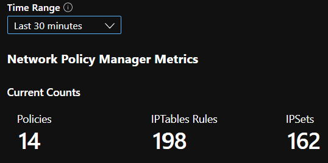
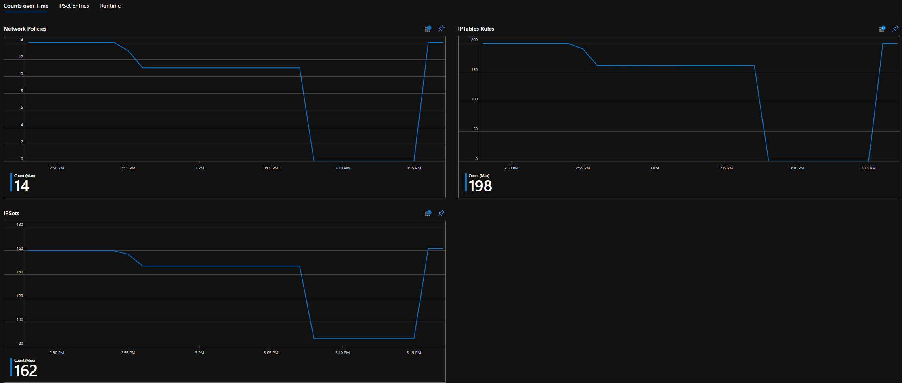
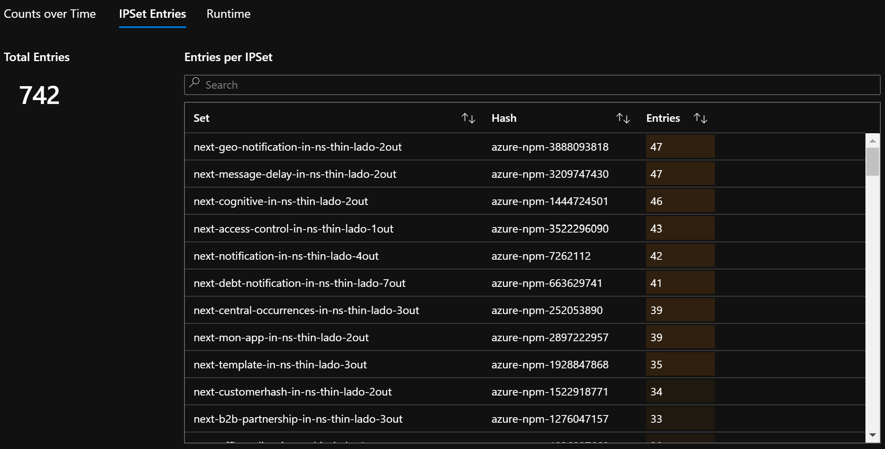
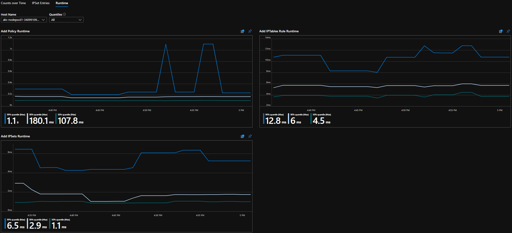
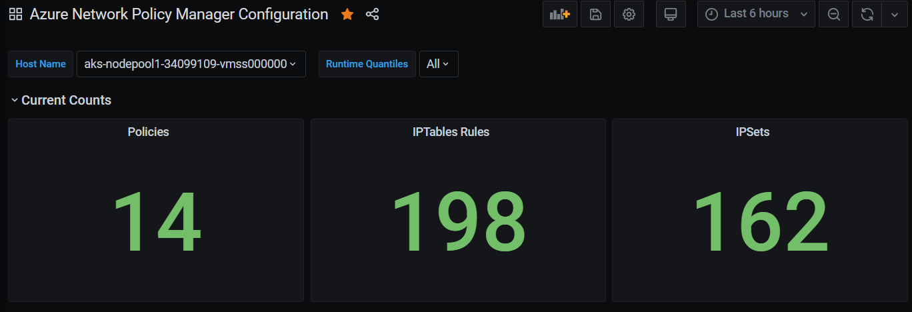
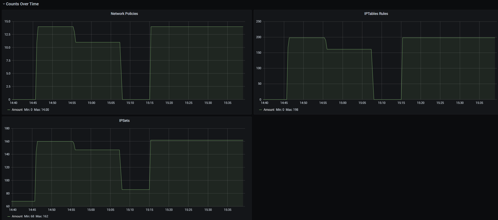
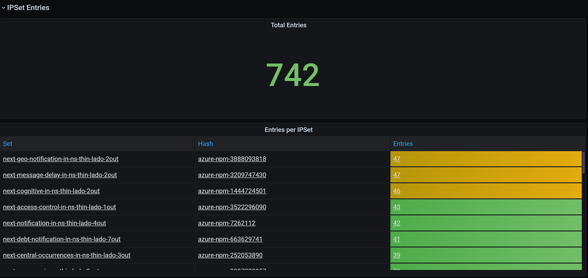
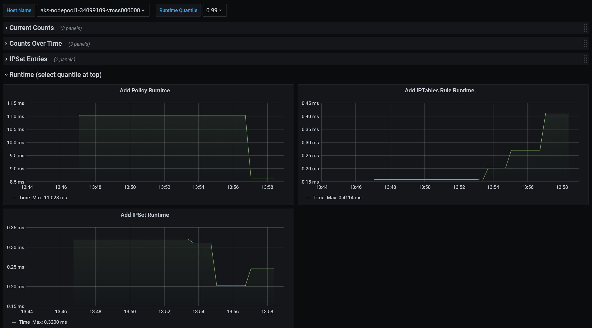

# Azure Kubernetes Network Policies overview

Network Policies provides micro-segmentation for pods just like Network Security Groups (NSGs) provide micro-segmentation for VMs. The Azure Network Policy Manager (also known as Azure NPM) implementation supports the standard Kubernetes Network Policy specification. You can use labels to select a group of pods and define a list of ingress and egress rules to filter traffic to and from these pods. Learn more about the Kubernetes network policies in the [Kubernetes documentation](https://kubernetes.io/docs/concepts/services-networking/network-policies/).


Azure NPM implementation works in conjunction with the Azure CNI that provides VNet integration for containers. NPM is supported only on Linux today. The implementation enforces traffic filtering by configuring allow and deny IP rules in Linux IPTables based on the defined policies. These rules are grouped together using Linux IPSets.

## Planning security for your Kubernetes cluster
When implementing security for your cluster, use network security groups (NSGs) to filter traffic entering and leaving your cluster subnet (North-South traffic). Use Azure NPM for traffic between pods in your cluster (East-West traffic).

## Using Azure NPM
Azure NPM can be used in the following ways to provide micro-segmentation for pods.

### Azure Kubernetes Service (AKS)
NPM is available natively in AKS and can be enabled at the time of cluster creation. Learn more about it in [Secure traffic between pods using network policies in Azure Kubernetes Service (AKS)](https://docs.microsoft.com/azure/aks/use-network-policies).

### AKS-engine
AKS-Engine is a tool that generates an Azure Resource Manager template for the deployment of a Kubernetes cluster in Azure. The cluster configuration is specified in a JSON file that is passed to the tool when generating the template. To learn more about the entire list of supported cluster settings and their descriptions, see Microsoft Azure Container Service Engine - Cluster Definition.

To enable policies on clusters deployed using acs-engine, specify the value of the networkPolicy setting in the cluster definition file to be "azure".

#### Example configuration

The below JSON example configuration creates a new virtual network and subnet, and deploys a Kubernetes cluster in it with Azure CNI. We recommend that you use “Notepad” to edit the JSON file. 
```json
{
  "apiVersion": "vlabs",
  "properties": {
    "orchestratorProfile": {
      "orchestratorType": "Kubernetes",
      "kubernetesConfig": {
         "networkPolicy": "azure"
       }
    },
    "masterProfile": {
      "count": 1,
      "dnsPrefix": "<specify a cluster name>",
      "vmSize": "Standard_D2s_v3"
    },
    "agentPoolProfiles": [
      {
        "name": "agentpool",
        "count": 2,
        "vmSize": "Standard_D2s_v3",
        "availabilityProfile": "AvailabilitySet"
      }
    ],
   "linuxProfile": {
      "adminUsername": "<specify admin username>",
      "ssh": {
        "publicKeys": [
          {
            "keyData": "<cut and paste your ssh key here>"
          }
        ]
      }
    },
    "servicePrincipalProfile": {
      "clientId": "<enter the client ID of your service principal here >",
      "secret": "<enter the password of your service principal here>"
    }
  }
}

```
### Do it yourself (DIY) Kubernetes clusters in Azure
 For DIY clusters, first install the CNI plug-in and enable it on every virtual machine in a cluster. For detailed instructions, see [Deploy the plug-in for a Kubernetes cluster that you deploy yourself](deploy-container-networking.md#deploy-plug-in-for-a-kubernetes-cluster).

Once the cluster is deployed run the following `kubectl` command to download and apply the Azure NPM *daemon set* to the cluster.

  ```
  kubectl apply -f https://raw.githubusercontent.com/Azure/acs-engine/master/parts/k8s/addons/kubernetesmasteraddons-azure-npm-daemonset.yaml

  ```
The solution is also open source and the code is available on the [Azure Container Networking repository](https://github.com/Azure/azure-container-networking/tree/master/npm).

## Monitor and Visualize Network Configurations with Azure NPM
Azure NPM includes informative Prometheus metrics that allow you to monitor and better understand your configurations. It provides built-in visualizations in either the Azure portal or Grafana Labs. You can start collecting these metrics using either Azure Monitor or a Prometheus Server.

### Benefits of Azure NPM Metrics
Users previously were only able to learn about their Network Configuration with the command `iptables -L` run inside a cluster node, which yields a verbose and difficult to understand output. NPM metrics provide the following benefits related to Network Policies, IPTables Rules, and IPSets.
- Provides insight into the relationship between the three and a time dimension to debug a configuration.
- Number of entries in all IPSets and each IPSet.
- Time taken to apply a policy with IPTable/IPSet level granularity.
 
### Supported Metrics
Following is the list of supported metrics:

|Metric Name |Description  |Prometheus Metric Type  |Labels  |
|---------|---------|---------|---------|
|`npm_num_policies`     |number of network policies          |Gauge         |-         |
|`npm_num_iptables_rules`     | number of IPTables rules     | Gauge        |-         |         
|`npm_num_ipsets`     |number of IPSets         |Gauge            |-         |
|`npm_num_ipset_entries`     |number of IP address entries in all IPSets         |Gauge         |-         |
|`npm_add_policy_exec_time`     |runtime for adding a network policy         |Summary         |quantile (0.5, 0.9, or 0.99)         |
|`npm_add_iptables_rule_exec_time`     |runtime for adding an IPTables rule         |Summary         |quantile (0.5, 0.9, or 0.99)         |
|`npm_add_ipset_exec_time`     |runtime for adding an IPSet         |Summary         |quantile (0.5, 0.9, or 0.99)         |
|`npm_ipset_counts` (advanced)     |number of entries within each individual IPSet         |GaugeVec         |set name & hash         |

The different quantile levels in "exec_time" metrics help you differentiate between the general and worst case scenarios.

There's also an "exec_time_count" and "exec_time_sum" metric for each "exec_time" Summary metric.

The metrics can be scraped through Azure Monitor for Containers or through Prometheus.

### Setup for Azure Monitor
The first step is to enable Azure Monitor for containers for your Kubernetes cluster. Steps can be found in [Azure Monitor for containers Overview](https://docs.microsoft.com/azure/azure-monitor/insights/container-insights-overview). Once you have Azure Monitor for containers enabled, configure the [Azure Monitor for containers ConfigMap](https://aka.ms/container-azm-ms-agentconfig) to enable NPM integration and collection of Prometheus NPM metrics. Azure monitor for containers ConfigMap has an ```integrations``` section with settings to collect NPM metrics. These settings are disabled by default in the ConfigMap. Enabling the basic setting ```collect_basic_metrics = true```, will collect basic NPM metrics. Enabling advanced setting ```collect_advanced_metrics = true``` will collect advanced metrics in addition to basic metrics. 

After editing the ConfigMap, save it locally and apply the ConfigMap to your cluster as follows.

```kubectl apply -f container-azm-ms-agentconfig.yaml```
Below is a snippet from the [Azure monitor for containers ConfigMap](https://aka.ms/container-azm-ms-agentconfig), which shows the NPM integration enabled with advanced metrics collection.
```
integrations: |-
    [integrations.azure_network_policy_manager]
        collect_basic_metrics = false
        collect_advanced_metrics = true
```
Advanced metrics are optional, and turning them on will automatically turn on basic metrics collection. Advanced metrics currently include only `npm_ipset_counts`

Learn more about [Azure monitor for containers collection settings in config map](https://aka.ms/azmon-containers-agent-collection-settings-doc)

### Visualization Options for Azure Monitor
Once NPM metrics collection is enabled, you can view the metrics in the Azure portal using Container Insights or in Grafana.

#### Viewing in Azure portal under Insights for the cluster
Open Azure portal. Once in your cluster's Insights, navigate to "Workbooks" and open "Network Policy Manager (NPM) Configuration".

Besides viewing the workbook (pictures below), you can also directly query the Prometheus metrics in "Logs" under the Insights section. For example, this query will return all the metrics being collected.
| where TimeGenerated > ago(5h)
| where Name contains "npm_"

You can also query Log Analytics directly for the metrics. Learn more about it with [Getting Started with Log Analytics Queries](https://docs.microsoft.com/azure/azure-monitor/insights/container-insights-log-search) 

#### Viewing in Grafana Dashboard
Set up your Grafana Server and configure a Log Analytics Data Source as described [here](https://grafana.com/grafana/plugins/grafana-azure-monitor-datasource). Then, import [Grafana Dashboard with a Log Analytics backend](https://grafana.com/grafana/dashboards/10956) into your Grafana Labs.

The dashboard has visuals similar to the Azure Workbook. You can add panels to chart & visualize NPM metrics from InsightsMetrics table.

### Setup for Prometheus Server
Some users may choose to collect metrics with a Prometheus Server instead of Azure Monitor for containers. You merely need to add two jobs to your scrape config to collect NPM metrics.

To install a simple Prometheus Server, add this helm repo on your cluster
```
helm repo add stable https://kubernetes-charts.storage.googleapis.com
helm repo update
```
then add a server
```
helm install prometheus stable/prometheus -n monitoring \
--set pushgateway.enabled=false,alertmanager.enabled=false, \
--set-file extraScrapeConfigs=prometheus-server-scrape-config.yaml
```
where `prometheus-server-scrape-config.yaml` consists of
```
- job_name: "azure-npm-node-metrics"
  metrics_path: /node-metrics
  kubernetes_sd_configs:
  - role: node
  relabel_configs:
  - source_labels: [__address__]
    action: replace
    regex: ([^:]+)(?::\d+)?
    replacement: "$1:10091"
    target_label: __address__
- job_name: "azure-npm-cluster-metrics"
  metrics_path: /cluster-metrics
  kubernetes_sd_configs:
  - role: service
  relabel_configs:
  - source_labels: [__meta_kubernetes_namespace]
    regex: kube-system
    action: keep
  - source_labels: [__meta_kubernetes_service_name]
    regex: npm-metrics-cluster-service
    action: keep
# Comment from here to the end to collect advanced metrics: number of entries for each IPSet
  metric_relabel_configs:
  - source_labels: [__name__]
    regex: npm_ipset_counts
    action: drop
```


You can also replace the `azure-npm-node-metrics` job  with the content below or incorporate it into a pre-existing job for Kubernetes pods:
```
- job_name: "azure-npm-node-metrics-from-pod-config"
  metrics_path: /node-metrics
  kubernetes_sd_configs:
  - role: pod
  relabel_configs:
  - source_labels: [__meta_kubernetes_namespace]
    regex: kube-system
    action: keep
  - source_labels: [__meta_kubernetes_pod_annotationpresent_azure_npm_scrapeable]
    action: keep
  - source_labels: [__address__]
    action: replace
    regex: ([^:]+)(?::\d+)?
    replacement: "$1:10091"
    target_label: __address__
```

### Visualization Options for Prometheus
When using a Prometheus Server only Grafana Dashboard is supported. 

If you haven't already, set up your Grafana Server and configure a Prometheus Data Source. Then, import our [Grafana Dashboard with a Prometheus backend](https://grafana.com/grafana/dashboards/13000) into your Grafana Labs.

The visuals for this dashboard are identical to the dashboard with a Container Insights/Log Analytics backend.

### Sample Dashboards
Following are some sample dashboard for NPM metrics in Container Insights (CI) and Grafana

#### CI Summary Counts


#### CI Counts over Time
[](media/kubernetes-network-policies/workbook-counts-over-time.png#lightbox)

#### CI IPSet Entries
[](media/kubernetes-network-policies/workbook-ipset-entries.png#lightbox)

#### CI Runtime Quantiles


#### Grafana Dashboard Summary Counts


#### Grafana Dashboard Counts over Time
[](media/kubernetes-network-policies/grafana-counts-over-time.png#lightbox)

#### Grafana Dashboard IPSet Entries
[](media/kubernetes-network-policies/grafana-ipset-entries.png#lightbox)

#### Grafana Dashboard Runtime Quantiles
[](media/kubernetes-network-policies/grafana-runtime-quantiles.png#lightbox)


## Next steps
- Learn about [Azure Kubernetes Service](../aks/intro-kubernetes.md).
-  Learn about [container networking](container-networking-overview.md).
- [Deploy the plug-in](deploy-container-networking.md) for Kubernetes clusters or Docker containers.

    
