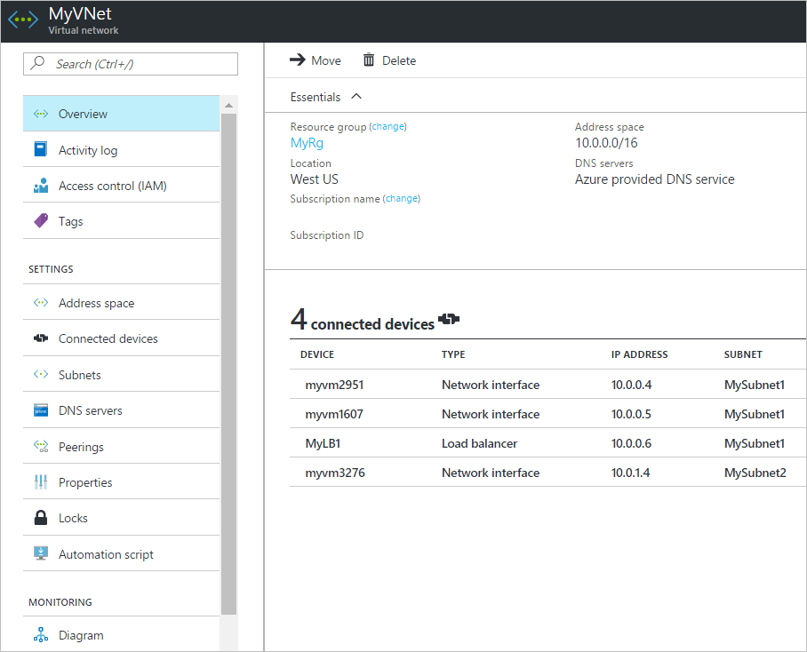

# Create, change, or delete a virtual network

[!INCLUDE [updated-for-az](../../includes/updated-for-az.md)]

Learn how to create and delete a virtual network and change settings, like DNS servers and IP address spaces, for an existing virtual network. If you're new to virtual networks, you can learn more about them in the [Virtual network overview](virtual-networks-overview.md) or by completing a [tutorial](quick-create-portal.md). A virtual network contains subnets. To learn how to create, change, and delete subnets, see [Manage subnets](virtual-network-manage-subnet.md).

## Before you begin

Complete the following tasks before completing steps in any section of this article:

- If you don't already have an Azure account, sign up for a [free trial account](https://azure.microsoft.com/free).
- If using the portal, open https://portal.azure.com, and log in with your Azure account.
- If using PowerShell commands to complete tasks in this article, either run the commands in the [Azure Cloud Shell](https://shell.azure.com/powershell), or by running PowerShell from your computer. The Azure Cloud Shell is a free interactive shell that you can use to run the steps in this article. It has common Azure tools preinstalled and configured to use with your account. This tutorial requires the Azure PowerShell module version 1.0.0 or later. Run `Get-Module -ListAvailable Az` to find the installed version. If you need to upgrade, see [Install Azure PowerShell module](/powershell/azure/install-az-ps). If you are running PowerShell locally, you also need to run `Connect-AzAccount` to create a connection with Azure.
- If using Azure Command-line interface (CLI) commands to complete tasks in this article, either run the commands in the [Azure Cloud Shell](https://shell.azure.com/bash), or by running the CLI from your computer. This tutorial requires the Azure CLI version 2.0.31 or later. Run `az --version` to find the installed version. If you need to install or upgrade, see [Install Azure CLI](/cli/azure/install-azure-cli). If you are running the Azure CLI locally, you also need to run `az login` to create a connection with Azure.
- The account you log into, or connect to Azure with, must be assigned to the [network contributor](../role-based-access-control/built-in-roles.md?toc=%2fazure%2fvirtual-network%2ftoc.json#network-contributor) role or to a [custom role](../role-based-access-control/custom-roles.md?toc=%2fazure%2fvirtual-network%2ftoc.json) that is assigned the appropriate actions listed in [Permissions](#permissions).

## Create a virtual network

1. Select **+ Create a resource** > **Networking** > **Virtual network**.
2. Enter or select values for the following settings, then select **Create**:
   - **Name**: The name must be unique in the [resource group](../azure-glossary-cloud-terminology.md?toc=%2fazure%2fvirtual-network%2ftoc.json#resource-group) that you select to create the virtual network in. You cannot change the name after the virtual network is created. You can create multiple virtual networks over time. For naming suggestions, see [Naming conventions](/azure/cloud-adoption-framework/ready/azure-best-practices/naming-and-tagging#naming-and-tagging-resources). Following a naming convention can help make it easier to manage multiple virtual networks.
   - **Address space**: The address space for a virtual network is composed of one or more non-overlapping address ranges that are specified in CIDR notation. The address range you define can be public or private (RFC 1918). Whether you define the address range as public or private, the address range is reachable only from within the virtual network, from interconnected virtual networks, and from any on-premises networks that you have connected to the virtual network. You cannot add the following address ranges:
     - 224.0.0.0/4 (Multicast)
     - 255.255.255.255/32 (Broadcast)
     - 127.0.0.0/8 (Loopback)
     - 169.254.0.0/16 (Link-local)
     - 168.63.129.16/32 (Internal DNS, DHCP, and Azure Load Balancer [health probe](../load-balancer/load-balancer-custom-probe-overview.md#probesource))

     Although you can define only one address range when you create the virtual network in the portal, you can add more address ranges to the address space after the virtual network is created. To learn how to add an address range to an existing virtual network, see [Add or remove an address range](#add-or-remove-an-address-range).

     >[!WARNING]
     >If a virtual network has address ranges that overlap with another virtual network or on-premises network, the two networks cannot be connected. Before you define an address range, consider whether you might want to connect the virtual network to other virtual networks or on-premises networks in the future.
     >
     >

     - **Subnet name**: The subnet name must be unique within the virtual network. You cannot change the subnet name after the subnet is created. The portal requires that you define one subnet when you create a virtual network, even though a virtual network isn't required to have any subnets. In the portal, you can define only one subnet when you create a virtual network. You can add more subnets to the virtual network later, after the virtual network is created. To add a subnet to a virtual network, see [Manage subnets](virtual-network-manage-subnet.md). You can create a virtual network that has multiple subnets by using Azure CLI or PowerShell.

       >[!TIP]
       >Sometimes, administrators create different subnets to filter or control traffic routing between the subnets. Before you define subnets, consider how you might want to filter and route traffic between your subnets. To learn more about filtering traffic between subnets, see [Network security groups](security-overview.md). Azure automatically routes traffic between subnets, but you can override Azure default routes. To learn more about Azures default subnet traffic routing, see [Routing overview](virtual-networks-udr-overview.md).
       >

     - **Subnet address range**: The range must be within the address space you entered for the virtual network. The smallest range you can specify is /29, which provides eight IP addresses for the subnet. Azure reserves the first and last address in each subnet for protocol conformance. Three additional addresses are reserved for Azure service usage. As a result, a virtual network with a subnet address range of /29 has only three usable IP addresses. If you plan to connect a virtual network to a VPN gateway, you must create a gateway subnet. Learn more about [specific address range considerations for gateway subnets](../vpn-gateway/vpn-gateway-about-vpn-gateway-settings.md?toc=%2fazure%2fvirtual-network%2ftoc.json#gwsub). You can change the address range after the subnet is created, under specific conditions. To learn how to change a subnet address range, see [Manage subnets](virtual-network-manage-subnet.md).
     - **Subscription**: Select a [subscription](../azure-glossary-cloud-terminology.md?toc=%2fazure%2fvirtual-network%2ftoc.json#subscription). You cannot use the same virtual network in more than one Azure subscription. However, you can connect a virtual network in one subscription to virtual networks in other subscriptions with [virtual network peering](virtual-network-peering-overview.md). Any Azure resource that you connect to the virtual network must be in the same subscription as the virtual network.
     - **Resource group**: Select an existing [resource group](../azure-resource-manager/management/overview.md?toc=%2fazure%2fvirtual-network%2ftoc.json#resource-groups) or create a new one. An Azure resource that you connect to the virtual network can be in the same resource group as the virtual network or in a different resource group.
     - **Location**: Select an Azure [location](https://azure.microsoft.com/regions/), also known as a region. A virtual network can be in only one Azure location. However, you can connect a virtual network in one location to a virtual network in another location by using a VPN gateway. Any Azure resource that you connect to the virtual network must be in the same location as the virtual network.

**Commands**

- Azure CLI: [az network vnet create](/cli/azure/network/vnet)
- PowerShell: [New-AzVirtualNetwork](/powershell/module/az.network/new-azvirtualnetwork)

## View virtual networks and settings

1. In the search box at the top of the portal, enter *virtual networks* in the search box. When **Virtual networks** appear in the search results, select it.
2. From the list of virtual networks, select the virtual network that you want to view settings for.
3. The following settings are listed for the virtual network you selected:
   - **Overview**: Provides information about the virtual network, including address space and DNS servers. The following screenshot shows the overview settings for a virtual network named **MyVNet**:

     

     You can move a virtual network to a different subscription or resource group by selecting **Change** next to **Resource group** or **Subscription name**. To learn how to move a virtual network, see [Move resources to a different resource group or subscription](../azure-resource-manager/management/move-resource-group-and-subscription.md?toc=%2fazure%2fvirtual-network%2ftoc.json). The article lists prerequisites, and how to move resources by using the Azure portal, PowerShell, and Azure CLI. All resources that are connected to the virtual network must move with the virtual network.
   - **Address space**: The address spaces that are assigned to the virtual network are listed. To learn how to add and remove an address range to the address space, complete the steps in [Add or remove an address range](#add-or-remove-an-address-range).
   - **Connected devices**: Any resources that are connected to the virtual network are listed. In the preceding screenshot, three network interfaces and one load balancer are connected to the virtual network. Any new resources that you create and connect to the virtual network are listed. If you delete a resource that was connected to the virtual network, it no longer appear in the list.
   - **Subnets**: A list of subnets that exist within the virtual network is shown. To learn how to add and remove a subnet, see [Manage subnets](virtual-network-manage-subnet.md).
   - **DNS servers**: You can specify whether the Azure internal DNS server or a custom DNS server provides name resolution for devices that are connected to the virtual network. When you create a virtual network by using the Azure portal, Azure's DNS servers are used for name resolution within a virtual network, by default. To modify the DNS servers, complete the steps in [Change DNS servers](#change-dns-servers) in this article.
   - **Peerings**: If there are existing peerings in the subscription, they are listed here. You can view settings for existing peerings, or create, change, or delete peerings. To learn more about peerings, see [Virtual network peering](virtual-network-peering-overview.md).
   - **Properties**: Displays settings about the virtual network, including the virtual network's resource ID and the Azure subscription it is in.
   - **Diagram**: The diagram provides a visual representation of all devices that are connected to the virtual network. The diagram has some key information about the devices. To manage a device in this view, in the diagram, select the device.
   - **Common Azure settings**: To learn more about common Azure settings, see the following information:
     - [Activity log](../azure-monitor/platform/platform-logs-overview.md)
     - [Access control (IAM)](../role-based-access-control/overview.md)
     - [Tags](../azure-resource-manager/management/tag-resources.md?toc=%2fazure%2fvirtual-network%2ftoc.json)
     - [Locks](../azure-resource-manager/management/lock-resources.md?toc=%2fazure%2fvirtual-network%2ftoc.json)
     - [Automation script](../azure-resource-manager/management/manage-resource-groups-portal.md#export-resource-groups-to-templates)

**Commands**

- Azure CLI: [az network vnet show](/cli/azure/network/vnet)
- PowerShell: [Get-AzVirtualNetwork](/powershell/module/az.network/get-azvirtualnetwork)

## Add or remove an address range

You can add and remove address ranges for a virtual network. An address range must be specified in CIDR notation, and cannot overlap with other address ranges within the same virtual network. The address ranges you define can be public or private (RFC 1918). Whether you define the address range as public or private, the address range is reachable only from within the virtual network, from interconnected virtual networks, and from any on-premises networks that you have connected to the virtual network. 

You can decrease the address range for a virtual network as long as it still includes the ranges of any associated subnets. Additionally, you can extend the address range, for example, changing a /16 to /8. 

<!-- the above statement has been edited to reflect the most recent comments on the reopened issue: https://github.com/MicrosoftDocs/azure-docs/issues/20572 -->

You cannot add the following address ranges:

- 224.0.0.0/4 (Multicast)
- 255.255.255.255/32 (Broadcast)
- 127.0.0.0/8 (Loopback)
- 169.254.0.0/16 (Link-local)
- 168.63.129.16/32 (Internal DNS, DHCP, and Azure Load Balancer [health probe](../load-balancer/load-balancer-custom-probe-overview.md#probesource))

To add or remove an address range:

1. In the search box at the top of the portal, enter *virtual networks* in the search box. When **Virtual networks** appear in the search results, select it.
2. From the list of virtual networks, select the virtual network for which you want to add or remove an address range.
3. Select **Address space**, under **SETTINGS**.
4. Complete one of the following options:
	- **Add an address range**: Enter the new address range. The address range cannot overlap with an existing address range that is defined for the virtual network.
	- **Remove an address range**: On the right of the address range you want to remove, select **...**, then select **Remove**. If a subnet exists in the address range, you cannot remove the address range. To remove an address range, you must first delete any subnets (and any resources in the subnets) that exist in the address range.
5. Select **Save**.

**Commands**

- Azure CLI: [az network vnet update](/cli/azure/network/vnet)
- PowerShell: [Set-AzVirtualNetwork](/powershell/module/az.network/set-azvirtualnetwork)

## Change DNS servers

All VMs that are connected to the virtual network register with the DNS servers that you specify for the virtual network. They also use the specified DNS server for name resolution. Each network interface (NIC) in a VM can have its own DNS server settings. If a NIC has its own DNS server settings, they override the DNS server settings for the virtual network. To learn more about NIC DNS settings, see [Network interface tasks and settings](virtual-network-network-interface.md#change-dns-servers). To learn more about name resolution for VMs and role instances in Azure Cloud Services, see [Name resolution for VMs and role instances](virtual-networks-name-resolution-for-vms-and-role-instances.md). To add, change, or remove a DNS server:

1. In the search box at the top of the portal, enter *virtual networks* in the search box. When **Virtual networks** appear in the search results, select it.
2. From the list of virtual networks, select the virtual network for which you want to change DNS servers for.
3. Select **DNS servers**, under **SETTINGS**.
4. Select one of the following options:
   - **Default (Azure-provided)**: All resource names and private IP addresses are automatically registered to the Azure DNS servers. You can resolve names between any resources that are connected to the same virtual network. You cannot use this option to resolve names across virtual networks. To resolve names across virtual networks, you must use a custom DNS server.
   - **Custom**: You can add one or more servers, up to the Azure limit for a virtual network. To learn more about DNS server limits, see [Azure limits](../azure-resource-manager/management/azure-subscription-service-limits.md?toc=%2fazure%2fvirtual-network%2ftoc.json#virtual-networking-limits-classic). You have the following options:
   - **Add an address**: Adds the server to your virtual network DNS servers list. This option also registers the DNS server with Azure. If you've already registered a DNS server with Azure, you can select that DNS server in the list.
   - **Remove an address**: Next to the server that you want to remove, select **...**, then **Remove**. Deleting the server removes the server only from this virtual network list. The DNS server remains registered in Azure for your other virtual networks to use.
   - **Reorder DNS server addresses**: It's important to verify that you list your DNS servers in the correct order for your environment. DNS server lists are used in the order that they are specified. They do not work as a round-robin setup. If the first DNS server in the list can be reached, the client uses that DNS server, regardless of whether the DNS server is functioning properly. Remove all the DNS servers that are listed, and then add them back in the order that you want.
   - **Change an address**: Highlight the DNS server in the list, and then enter the new address.
5. Select **Save**.
6. Restart the VMs that are connected to the virtual network, so they are assigned the new DNS server settings. VMs continue to use their current DNS settings until they are restarted.

**Commands**

- Azure CLI: [az network vnet update](/cli/azure/network/vnet)
- PowerShell: [Set-AzVirtualNetwork](/powershell/module/az.network/set-azvirtualnetwork)

## Delete a virtual network

You can delete a virtual network only if there are no resources connected to it. If there are resources connected to any subnet within the virtual network, you must first delete the resources that are connected to all subnets within the virtual network. The steps you take to delete a resource vary depending on the resource. To learn how to delete resources that are connected to subnets, read the documentation for each resource type you want to delete. To delete a virtual network:

1. In the search box at the top of the portal, enter *virtual networks* in the search box. When **Virtual networks** appear in the search results, select it.
2. From the list of virtual networks, select the virtual network you want to delete.
3. Confirm that there are no devices connected to the virtual network by selecting **Connected devices**, under **SETTINGS**. If there are connected devices, you must delete them before you can delete the virtual network. If there are no connected devices, select **Overview**.
4. Select **Delete**.
5. To confirm the deletion of the virtual network, select **Yes**.

**Commands**

- Azure CLI: [azure network vnet delete](/cli/azure/network/vnet)
- PowerShell: [Remove-AzVirtualNetwork](/powershell/module/az.network/remove-azvirtualnetwork)

## Permissions

To perform tasks on virtual networks, your account must be assigned to the [network contributor](../role-based-access-control/built-in-roles.md?toc=%2fazure%2fvirtual-network%2ftoc.json#network-contributor) role or to a [custom](../role-based-access-control/custom-roles.md?toc=%2fazure%2fvirtual-network%2ftoc.json) role that is assigned the appropriate actions listed in the following table:

| Action                                  |   Name                                |
|---------------------------------------- |   --------------------------------    |
|Microsoft.Network/virtualNetworks/read   |   Read a virtual Network              |
|Microsoft.Network/virtualNetworks/write  |   Create or update a virtual network  |
|Microsoft.Network/virtualNetworks/delete |   Delete a virtual network            |

## Next steps

- Create a virtual network using [PowerShell](powershell-samples.md) or [Azure CLI](cli-samples.md) sample scripts, or using Azure [Resource Manager templates](template-samples.md)
- Create and assign [Azure Policy definitions](policy-samples.md) for virtual networks
