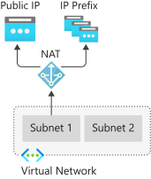
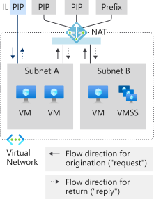
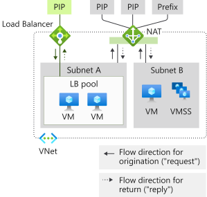
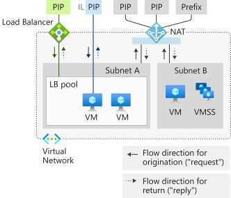
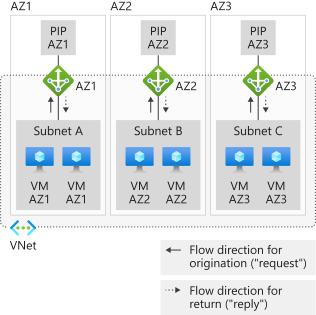
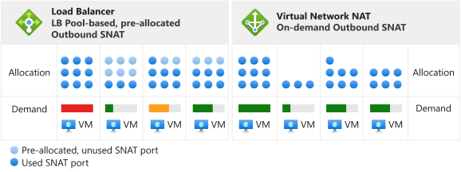
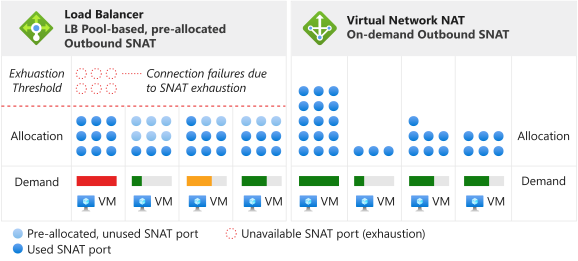

---

title: Designing Virtual networks with NAT gateway resources
titleSuffix: Azure Virtual Network NAT
description: Learn how to design virtual networks with NAT gateway resources.
services: virtual-network
documentationcenter: na
author: asudbring
manager: KumudD
ms.service: virtual-network
ms.subservice: nat
Customer intent: As an IT administrator, I want to learn more about how to design virtual networks with NAT gateway resources.
ms.devlang: na
ms.topic: article
ms.tgt_pltfrm: na
ms.workload: infrastructure-services
ms.date: 04/27/2020
ms.author: allensu
---

# Designing virtual networks with NAT gateway resources

NAT gateway resources are part of [Virtual Network NAT](nat-overview.md) and provide outbound Internet connectivity for one or more subnets of a virtual network. The subnet of the virtual network states which NAT gateway will be used. NAT provides source network address translation (SNAT) for a subnet.  NAT gateway resources specify which static IP addresses virtual machines use when creating outbound flows. Static IP addresses come from public IP address resources, public IP prefix resources, or both. If a public IP prefix resource is used, all IP addresses of the entire public IP prefix resource are consumed by a NAT gateway resource. A NAT gateway resource can use a total of up to 16 static IP addresses from either.

  

*Figure: Virtual Network NAT for outbound to Internet*

## How to deploy NAT

Configuring and using NAT gateway is intentionally made simple:  

NAT gateway resource:
- Create regional or zonal (zone-isolated) NAT gateway resource,
- Assign IP addresses,
- If necessary, modify TCP idle timeout (optional).  Review [timers](#timers) <ins>before</ins> you change the default.

Virtual network:
- Configure virtual network subnet to use a NAT gateway.

User-defined routes aren't necessary.

## Resource

The resource is designed to be simple as you can see from the following Azure Resource Manager example in a template-like format.  This template-like format is shown here to illustrate the concepts and structure.  Modify the example for your needs.  This document isn't intended as a tutorial.

The following diagram shows the writeable references between the different Azure Resource Manager resources.  The arrow indicates the direction of the reference, originating from where it's writeable. Review 

  

*Figure: Virtual Network NAT object model*

NAT is recommended for most workloads unless you have a specific dependency on [pool-based Load Balancer outbound connectivity](../load-balancer/load-balancer-outbound-connections.md).  

You can migrate from standard load balancer scenarios, including [outbound rules](../load-balancer/load-balancer-outbound-rules-overview.md), to NAT gateway. To migrate, move the public ip and public ip prefix resources from load balancer frontends to NAT gateway. New IP addresses for NAT gateway aren't required. Standard public IP address resources and public IP prefix resource can be reused as long as the total doesn't exceed 16 IP addresses. Plan for migration with service interruption in mind during the transition.  You can minimize the interruption by automating the process. Test the migration in a staging environment first.  During the transition, inbound originated flows aren't affected.

The following example is a snippet from an Azure Resource Manager template.  This template deploys several resources, including a NAT gateway.  The template has the following parameters in this example:

- **natgatewayname** -  Name of the NAT gateway.
- **location** - Azure region where resource is located.
- **publicipname** - Name of the outbound public IP associated with the NAT gateway.
- **vnetname** - Name of the virtual network.
- **subnetname** - Name of the subnet associated with the NAT gateway.

The total number of IP addresses provided by all IP address and prefix resources can't exceed 16 IP addresses total. Any number of IP addresses between 1 and 16 is allowed.

:::code language="json" source="~/quickstart-templates/101-nat-gateway-vnet/azuredeploy.json" range="81-96":::

When the NAT gateway resource has been created, it can be used on one or more subnets of a virtual network. Specify which subnets use this NAT gateway resource. A NAT gateway isn't able to span more than one virtual network. It isn't required to assign the same NAT gateway to all subnets of a virtual network. Individual subnets can be configured with different NAT gateway resources.

Scenarios that don't use availability zones will be regional (no zone specified). If you're using availability zones, you can specify a zone to isolate NAT to a specific zone. Zone-redundancy isn't supported. Review NAT [availability zones](#availability-zones).

:::code language="json" source="~/quickstart-templates/101-nat-gateway-vnet/azuredeploy.json" range="1-146" highlight="81-96":::

NAT gateways are defined with a property on a subnet within a virtual network. Flows created by virtual machines on subnet **subnetname** of virtual network **vnetname** will use the NAT gateway. All outbound connectivity will use the IP addresses associated with **natgatewayname** as the source IP address.

For more information on the Azure Resource Manager template used in this example, see:

- [Quickstart: Create a NAT gateway - Resource Manager template](quickstart-create-nat-gateway-template.md)
- [Virtual Network NAT](https://azure.microsoft.com/resources/templates/101-nat-gateway-1-vm/)

## Design Guidance

Review this section to familiarize yourself with considerations for designing virtual networks with NAT.  

1. [Cost optimization](#cost-optimization)
1. [Coexistence of inbound and outbound](#coexistence-of-inbound-and-outbound)
2. [Managing Basic resources](#managing-basic-resources)
3. [Availability Zones](#availability-zones)

### Cost optimization

[Service endpoints](virtual-network-service-endpoints-overview.md) and [private link](../private-link/private-link-overview.md) are options to consider for optimizing cost. NAT isn't needed for these services. Traffic directed to service endpoints or private link is not processed by the virtual network's NAT.  

Service endpoints tie Azure service resources to your virtual network and control access to your Azure service resources. For example, when you access Azure storage, use a service endpoint for storage to avoid data processed NAT charges. Service endpoints are free.

Private link exposes Azure PaaS service (or other services hosted with private link) as a private endpoint inside a virtual network.  Private link is billed based on duration and data processed.

Evaluate if either or both of these approaches are a good fit for your scenario and use as needed.

### Coexistence of inbound and outbound

NAT gateway is compatible with:

 - Standard load balancer
 - Standard public IP
 - Standard public IP prefix

When developing a new deployment, start with standard SKUs.

  

*Figure: Virtual Network NAT for outbound to Internet*

The Internet outbound only scenario provided by NAT gateway can be expanded with inbound from Internet functionality. Each resource is aware of the direction in which a flow is originated. On a subnet with a NAT gateway, all outbound to Internet scenarios are superseded by the NAT gateway. Inbound from Internet scenarios are provided by the respective resource.

#### NAT and VM with instance-level Public IP

  

*Figure: Virtual Network NAT and VM with instance-level Public IP*

| Direction | Resource |
|:---:|:---:|
| Inbound | VM with instance-level Public IP |
| Outbound | NAT gateway |

VM will use NAT gateway for outbound.  Inbound originated isn't affected.

#### NAT and VM with public Load Balancer

  

*Figure: Virtual Network NAT and VM with public Load Balancer*

| Direction | Resource |
|:---:|:---:|
| Inbound | public Load Balancer |
| Outbound | NAT gateway |

Any outbound configuration from a load-balancing rule or outbound rules is superseded by NAT gateway.  Inbound originated isn't affected.

#### NAT and VM with instance-level public IP and public Load Balancer

  

*Figure: Virtual Network NAT and VM with instance-level public IP and public Load Balancer*

| Direction | Resource |
|:---:|:---:|
| Inbound | VM with instance-level public IP and public Load Balancer |
| Outbound | NAT gateway |

Any outbound configuration from a load-balancing rule or outbound rules is superseded by NAT gateway.  The VM will also use NAT gateway for outbound.  Inbound originated isn't affected.

### Managing Basic resources

Standard load balancer, public IP, and public IP prefix are compatible with NAT gateway. NAT gateways operate in the scope of a subnet. The basic SKU of these services must be deployed on a subnet without a NAT gateway. This separation allows both SKU variants to coexist in the same virtual network.

NAT gateways take precedence over outbound scenarios of the subnet. Basic load balancer or public IP (and any managed service built with them) is unable to be adjusted with the correct translations. NAT gateway takes control over outbound to Internet traffic on a subnet. Inbound traffic to basic load balancer and public ip is unavailable. Inbound traffic to a basic load balancer and, or a public ip configured on a VM won't be available.

### Availability Zones

#### Zone isolation with zonal stacks

  

*Figure: Virtual Network NAT with zone isolation, creating multiple "zonal stacks"*

Even without availability zones, NAT is resilient and can survive multiple infrastructure component failures.  Availability zones build on this resiliency with zone isolation scenarios for NAT.

Virtual networks and their subnets are regional constructs.  Subnets aren't restricted to a zone.

A zonal promise for zone isolation exists when a virtual machine instance using a NAT gateway resource is in the same zone as the NAT gateway resource and its public IP addresses. The pattern you want to use for zone isolation is creating a "zonal stack" per availability zone.  This "zonal stack" consists of virtual machine instances, NAT gateway resources, public IP address and/or prefix resources on a subnet that is assumed to be serving only the same zone.   The control plane operations and data plane are then aligned with and constrained to the specified zone. 

Failure in a zone other than where your scenario exists is expected to be without impact to NAT. Outbound traffic from virtual machines in the same zone will fail because of zone isolation.  

#### Integrating inbound endpoints

If your scenario requires inbound endpoints, you have two options:

| Option | Pattern | Example | Pro | Con |
|---|---|---|---|---|
| (1) | **Align** the inbound endpoints with the respective **zonal stacks** you're creating for outbound. | Create a standard load balancer with zonal frontend. | Same health model and failure mode for inbound and outbound. Simpler to operate. | Individual IP addresses per zone may need to be masked by a common DNS name. |
| (2) | **Overlay** the zonal stacks with a **cross-zone** inbound endpoint. | Create a standard load balancer with zone-redundant frontend. | Single IP address for inbound endpoint. | Varying health model and failure modes for inbound and outbound.  More complex to operate. |

>[!NOTE]
> A zone-isolated NAT gateway requires IP addresses to match the zone of the NAT gateway. NAT gateway resources with IP addresses from a different zone or without a zone aren't allowed.

#### Cross-zone outbound scenarios not supported

  

*Figure: Virtual Network NAT not compatible with zone-spanning subnet*

You can't achieve a zonal promise with NAT gateway resources when virtual machine instances are deployed in multiple zones within the same subnet.   And even if there were multiple zonal NAT gateways attached to a subnet, the virtual machine instance wouldn't know which NAT gateway resource to select.

A zonal promise does't exist when 
a) the zone of a virtual machine instance and the zones of a zonal NAT gateway are not aligned, or
b) a regional NAT gateway resource is used with zonal virtual machine instances.

While the scenario will appear to work, its health model and failure mode is undefined from an availability zone point of view. Consider going with zonal stacks or all regional instead.

>[!NOTE]
>The zones property of a NAT gateway resource isn't mutable.  Redeploy NAT gateway resource with the intended regional or zone preference.

>[!NOTE] 
>IP addresses by themselves aren't zone-redundant if no zone is specified.  The frontend of a [Standard Load Balancer is zone-redundant](../load-balancer/load-balancer-standard-availability-zones.md#frontend) if an IP address isn't created in a specific zone.  This doesn't apply to NAT.  Only regional or zone-isolation is supported.

## Performance

Each NAT gateway resource can provide up to 50 Gbps of throughput. You can split your deployments into multiple subnets and assign each subnet or groups of subnets a NAT gateway to scale out.

Each NAT gateway can support 64,000 connections per assigned outbound IP address.  Review the following section on Source Network Address Translation (SNAT) for details as well as the [troubleshooting article](https://docs.microsoft.com/azure/virtual-network/troubleshoot-nat) for specific problem resolution guidance.

## Source Network Address Translation

Source network address translation (SNAT) rewrites the source of a flow to originate from a different IP address.  NAT gateway resources use a variant of SNAT commonly referred to port address translation (PAT). PAT rewrites the source address and source port. With SNAT, there's no fixed relationship between the number of private addresses and their translated public addresses.  

### Fundamentals

Let's look at an example of four flows to explain the basic concept.  The NAT gateway is using public IP address resource 65.52.0.2.

| Flow | Source tuple | Destination tuple |
|:---:|:---:|:---:|
| 1 | 192.168.0.16:4283 | 65.52.0.1:80 |
| 2 | 192.168.0.16:4284 | 65.52.0.1:80 |
| 3 | 192.168.0.17.5768 | 65.52.0.1:80 |
| 4 | 192.168.0.16:4285 | 65.52.0.2:80 |

These flows might look like this after PAT has taken place:

| Flow | Source tuple | SNAT'ed source tuple | Destination tuple | 
|:---:|:---:|:---:|:---:|
| 1 | 192.168.0.16:4283 | 65.52.0.2:234 | 65.52.0.1:80 |
| 2 | 192.168.0.16:4284 | 65.52.0.2:235 | 65.52.0.1:80 |
| 3 | 192.168.0.17.5768 | 65.52.0.2:236 | 65.52.0.1:80 |
| 4 | 192.168.0.16:4285 | 65.52.0.2:237 | 65.52.0.2:80 |

The destination will see the source of the flow as 65.52.0.2 (SNAT source tuple) with the assigned port shown.  PAT as shown in the preceding table is also called port masquerading SNAT.  Multiple private sources are masqueraded behind an IP and port.

Don't take a dependency on the specific way source ports are assigned.  The preceding is an illustration of the fundamental concept only.

SNAT provided by NAT is different from [Load Balancer](../load-balancer/load-balancer-outbound-connections.md) in several aspects.

### On-demand

NAT provides on-demand SNAT ports for new outbound traffic flows. All available SNAT ports in inventory are used by any virtual machine on subnets configured with NAT. 

  

*Figure: Virtual Network NAT on-demand outbound SNAT*

Any IP configuration of a virtual machine can create outbound flows on-demand as needed.  Pre-allocation, per instance planning including per instance worst case overprovisioning, isn't required.  

  

*Figure: Differences in exhaustion scenarios*

Once a SNAT port releases, it's available for use by any virtual machine on subnets configured with NAT.  On-demand allocation allows dynamic and divergent workloads on subnet(s) to use SNAT ports as they need.  As long as there's SNAT port inventory available, SNAT flows will succeed. SNAT port hot spots benefit from the larger inventory instead. SNAT ports aren't left unused for virtual machines not actively needing them.

### Scaling

Scaling NAT is primarily a function of managing the shared, available SNAT port inventory. NAT needs sufficient SNAT port inventory for expected peak outbound flows for all subnets attached to a NAT gateway resource.  You can use public IP address resources, public IP prefix resources, or both to create SNAT port inventory.  

>[!NOTE]
>If you are assigning a public IP prefix resource, the entire public IP prefix will be used.  You can't assign a public IP prefix resource and then break out individual IP addresses to assign to other resources.  If you want to assign individual IP addresses from a public IP prefix to multiple resources, you need to create individual public IP addresses from the public IP prefix resource and assign them as needed instead of the public IP prefix resource itself.

SNAT maps private addresses to one or more public IP addresses, rewriting source address and source port in the processes. A NAT gateway resource will use 64,000 ports (SNAT ports) per configured public IP address for this translation. NAT gateway resources can scale up to 16 IP addresses and 1M SNAT ports. If a public IP prefix resource is provided, each IP address within the prefix is providing SNAT port inventory. And adding more public IP addresses increases the available inventory SNAT ports. TCP and UDP are separate SNAT port inventories and unrelated.

NAT gateway resources opportunistically reuse source ports. For scaling purposes, you should assume each flow requires a new SNAT port and scale the total number of available IP addresses for outbound traffic.

### Protocols

NAT gateway resources interact with IP and IP transport headers of UDP and TCP flows and are agnostic to application layer payloads.  Other IP protocols aren't supported.

### Timers

>[!IMPORTANT]
>Long idle timer can unnecessarily increase likelihood of SNAT exhaustion. The longer of a timer you specify, the longer NAT will hold on to SNAT ports until they eventually idle timeout. If your flows are idle timed out, they will fail eventually anyway and unnecessarily consume SNAT port inventory.  Flows that fail at 2 hours would have failed at the default 4 minutes as well. Increasing the idle timeout is a last resort option that should be used sparingly. If a flow never does go idle, it will not be impacted by the idle timer.

TCP idle timeout can be adjusted from 4 minutes (default) to 120 minutes (2 hours) for all flows.  Additionally, you can reset the idle timer with traffic on the flow.  A recommended pattern for refreshing long idle connections and endpoint liveness detection is TCP keepalives.  TCP keepalives appear as duplicate ACKs to the endpoints, are low overhead, and invisible to the application layer.

The following timers are used for SNAT port release:

| Timer | Value |
|---|---|
| TCP FIN | 60 seconds |
| TCP RST | 10 seconds |
| TCP half open | 30 seconds |

A SNAT port is available for reuse to the same destination IP address and destination port after 5 seconds.

>[!NOTE] 
>These timer settings are subject to change. The values are provided to help troubleshooting and you shouldn't take a dependency on specific timers at this time.

## Limitations

- NAT is compatible with standard SKU public IP, public IP prefix, and load balancer resources.   Basic resources (for example basic load balancer) and any products derived from them aren't compatible with NAT.  Basic resources must be placed on a subnet not configured with NAT.
- IPv4 address family is supported.  NAT doesn't interact with IPv6 address family.  NAT can't be deployed on a subnet with an IPv6 prefix.
- NSG flow logging isn't supported when using NAT.
- NAT can't span multiple virtual networks.

## Feedback

We want to know how we can improve the service. Are missing a capability? Make your case for what we should build next at [UserVoice for NAT](https://aka.ms/natuservoice).

## Next steps

* Learn about [virtual network NAT](nat-overview.md).
* Learn about [metrics and alerts for NAT gateway resources](nat-metrics.md).
* Learn about [troubleshooting NAT gateway resources](troubleshoot-nat.md).
* Tutorial for validating NAT Gateway
  - [Azure CLI](tutorial-create-validate-nat-gateway-cli.md)
  - [PowerShell](tutorial-create-validate-nat-gateway-powershell.md)
  - [Portal](tutorial-create-validate-nat-gateway-portal.md)
* Quickstart for deploying a NAT gateway resource
  - [Azure CLI](./quickstart-create-nat-gateway-cli.md)
  - [PowerShell](./quickstart-create-nat-gateway-powershell.md)
  - [Portal](./quickstart-create-nat-gateway-portal.md)
  - [Template](./quickstart-create-nat-gateway-template.md)
* Learn about NAT gateway resource API
  - [REST API](https://docs.microsoft.com/rest/api/virtualnetwork/natgateways)
  - [Azure CLI](https://docs.microsoft.com/cli/azure/network/nat/gateway?view=azure-cli-latest)
  - [PowerShell](https://docs.microsoft.com/powershell/module/az.network/new-aznatgateway)
* Learn about [availability zones](../availability-zones/az-overview.md).
* Learn about [standard load balancer](../load-balancer/load-balancer-standard-overview.md).
* Learn about [availability zones and standard load balancer](../load-balancer/load-balancer-standard-availability-zones.md).
* [Tell us what to build next for Virtual Network NAT in UserVoice](https://aka.ms/natuservoice).

