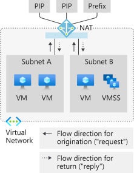
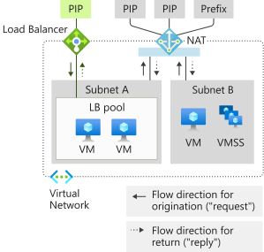
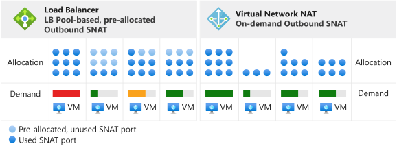

# Design virtual networks that use NAT gateway resources

Network Address Translation (NAT) gateway resources provide outbound internet connectivity for one or more subnets of a virtual network. The subnet of the virtual network states which NAT gateway the virtual network uses. You can design and deploy NAT gateway resources in [Azure Virtual Network NAT](nat-overview.md).

NAT provides Source Network Address Translation (SNAT) for a subnet. NAT gateway resources specify which static IP addresses VMs use when they create outbound flows. Static IP addresses come from public IP address resources, public IP prefix resources, or both. If a NAT gateway resource uses a public IP prefix resource, all IP addresses of the entire public IP prefix resource are consumed by the NAT gateway resource. A NAT gateway resource can use a maximum of 16 static IP addresses from either type of public IP resource.

The following figure depicts Virtual Network NAT for flows that are outbound to the internet:

  

## NAT deployment

You can set up and begin to use a NAT gateway in a few steps:

1. Set up the NAT gateway resource:

   1. Create a regional or zonal NAT gateway resource.
   1. Assign IP addresses.
   1. (Optional) If necessary, modify the TCP idle timeout. *Before* you change the TCP idle timeout from the default, review [timers](#timers).

1. Set up the virtual network:

   - Configure the virtual network subnet to use a NAT gateway.

You don't need to create user-defined routes for a NAT gateway.

## Design guidance

As you begin to design virtual networks to use NAT gateway resources, review the following sections for factors to consider.

### Connect to Azure services

We recommend that you use [Azure Private Link](../../private-link/private-link-overview.md) to connect to Azure services. Private Link ties Azure resources to your virtual network.

Private Link also helps you manage access to your Azure service resources. For example, when you access Azure Storage, use a private endpoint to ensure that your connection is private.

### Connect to the internet

We recommend that you use NAT in outbound scenarios for all production workloads that connect to a public endpoint. The following scenarios are examples of how to ensure coexistence of inbound internet when you use a NAT gateway for outbound internet.

## NAT and VM scenarios

The following sections describe scenarios you can set up to use NAT and VMs in your subnets.

### Instance-level public IP

The following figure depicts using NAT with a VM that uses an instance-level public IP:

  

The following table describes using NAT with a VM that uses an instance-level public IP:

| Direction | Resource |
|:---:|:---:|
| Inbound | VM with an instance-level public IP |
| Outbound | NAT gateway |

The VM uses the NAT gateway for outbound. Inbound originated isn't affected.

### Standard public load balancer

The following figure depicts using NAT with a VM that uses a standard public load balancer:

  

The following table describes using NAT with a VM that uses a standard public load balancer:

| Direction | Resource |
|:---:|:---:|
| Inbound | VM with a public load balancer |
| Outbound | NAT gateway |

A NAT gateway supersedes any outbound configuration from a load-balancing rule or from outbound rules. Inbound originated isn't affected.

#### Instance-level public IP and standard public load balancer

The following figure depicts using NAT with a VM that uses an instance-level public IP and a standard public load balancer:

  

The following table describes using NAT with a VM that uses an instance-level public IP and a standard public load balancer:

| Direction | Resource |
|:---:|:---:|
| Inbound | VM with an instance-level public IP and a public load balancer |
| Outbound | NAT gateway |

A NAT gateway supersedes any outbound configuration from a load-balancing rule or from outbound rules. The VM also uses the NAT gateway for outbound. Inbound originated isn't affected.

## Performance

Each NAT gateway resource can provide up to 50 Gbps of throughput. You can split your deployments into multiple subnets and assign each subnet or group of subnets a NAT gateway to scale out.

Each NAT gateway can support 64,000 flows each for TCP and UDP per assigned outbound IP address. For more information, see [SNAT](#snat). For guidance to resolve specific issues, see [Troubleshoot Azure Virtual Network NAT connectivity](./troubleshoot-nat.md).

## SNAT

SNAT rewrites the source of a flow so that the flow originates from a different IP address. NAT gateway resources use a variant of SNAT that's commonly referred to as *port address translation (PAT)*. PAT rewrites the source address and the source port. In SNAT, no fixed relationship exists between the number of private addresses and their translated public addresses.

### Fundamentals

Let's look at an example of four flows. The following table illustrates an example in which the NAT gateway uses public IP address resource 65.52.1.1 and the VM makes connections to 65.52.0.1.

| Flow | Source tuple | Destination tuple |
|:---:|:---:|:---:|
| 1 | 192.168.0.16:4283 | 65.52.0.1:80 |
| 2 | 192.168.0.16:4284 | 65.52.0.1:80 |
| 3 | 192.168.0.17.5768 | 65.52.0.1:80 |

The following table illustrates what the flows might look like after PAT:

| Flow | Source tuple | Source tuple after SNAT | Destination tuple |
|:---:|:---:|:---:|:---:|
| 1 | 192.168.0.16:4283 | **65.52.1.1:1234** | 65.52.0.1:80 |
| 2 | 192.168.0.16:4284 | **65.52.1.1:1235** | 65.52.0.1:80 |
| 3 | 192.168.0.17.5768 | **65.52.1.1:1236** | 65.52.0.1:80 |

The destination sees the source of the flow as 65.52.0.1 (source tuple after SNAT), with the assigned port that's shown in the table. PAT as shown in the table is also called *port masquerading SNAT*. Multiple private sources are masqueraded behind an IP and port.

#### Source (SNAT) port reuse

NAT gateways opportunistically reuse source (SNAT) ports. The following table illustrates this concept by adding a flow to the set of flows used in the preceding example. The VM in the example is a flow to 65.52.0.2.

| Flow | Source tuple | Destination tuple |
|:---:|:---:|:---:|
| 4 | 192.168.0.16:4285 | 65.52.0.2:80 |

A NAT gateway likely will translate flow 4 to a port that can also be used for other destinations, as shown in the next table. For more information about how to correctly size IP address provisioning, see [Scaling](#scaling).

| Flow | Source tuple | Source tuple after SNAT | Destination tuple |
|:---:|:---:|:---:|:---:|
| 4 | 192.168.0.16:4285 | 65.52.1.1:**1234** | 65.52.0.2:80 |

Source ports in the example are examples only. They don't represent set values that you need to use.

SNAT that's provided by NAT is different from SNAT that's provided by a [load balancer](../../load-balancer/load-balancer-outbound-connections.md) in several aspects.

### On-demand

NAT provides on-demand SNAT ports for new outbound traffic flows. VMs on subnets that are configured to use NAT use all SNAT ports that are available in inventory.

The following diagram depicts the inventory of all available SNAT ports used by any VM on subnets that are configured to use NAT:

  

Any IP configuration of a VM can create outbound flows on-demand as needed. You don't need to consider pre-allocation or per-instance planning, including per-instance worst-case over-provisioning.

The following diagram depicts the inventory of all available SNAT ports used by any VM on subnets that are configured to use NAT with an exhaustion threshold:

  

After a SNAT port releases, it's available for use by any VM on subnets that are configured to use NAT. On-demand allocation allows dynamic and divergent workloads on subnets to use SNAT ports as needed. If SNAT port inventory is available, SNAT flows succeed. SNAT port hotspots benefit from a larger inventory. SNAT ports aren't left unused for VMs that don't actively need them.

### Scaling

Scaling NAT primarily is a function of managing the shared, available SNAT port inventory. NAT requires sufficient SNAT port inventory for expected peak outbound flows for all subnets that are attached to a NAT gateway resource. You can use public IP address resources, public IP prefix resources, or both to create SNAT port inventory. 

> [!NOTE]
> If you assign a public IP prefix resource, the entire public IP prefix is used. You can't assign a public IP prefix resource and then break out individual IP addresses to assign to other resources. If you want to assign individual IP addresses from a public IP prefix to multiple resources, create individual public IP addresses from the public IP prefix resource and assign them as needed instead of assigning the public IP prefix resource itself.

SNAT maps private addresses to one or more public IP addresses. During the mapping process, SNAT rewrites the source address and source port. A NAT gateway resource uses 64,000 ports (SNAT ports) per configured public IP address for this translation. NAT gateway resources can scale up to 16 IP addresses and 1 million SNAT ports. If a public IP prefix resource is provided, each IP address within the prefix provides SNAT port inventory. Adding more public IP addresses increases the available inventory SNAT ports. TCP and UDP are separate SNAT port inventories and are unrelated to NAT gateway resources.

NAT gateway resources opportunistically reuse source (SNAT) ports. When you design scaling, assume that each flow requires a new SNAT port, and then scale the total number of available IP addresses for outbound traffic. Carefully consider the scale you're designing for, and then provision IP addresses quantities accordingly.

SNAT ports that are set to different destinations most likely will be reused, when possible. As SNAT port exhaustion approaches, flows might not succeed.

For a SNAT example, see [SNAT fundamentals](#source-network-address-translation).

### Protocols

NAT gateway resources interact with IP and IP transport headers of UDP and TCP flows. NAT gateway resources are agnostic to application layer payloads. Other IP protocols aren't supported.

### Timers

> [!IMPORTANT]
> A long idle timer might unnecessarily increase the likelihood of SNAT exhaustion. The longer the timer you set, the longer NAT holds on to SNAT ports, until they eventually idle time out. If your flows  idle time out, they eventually fail and unnecessarily consume SNAT port inventory. Flows that fail at 2 hours would also have failed at the default 4 minutes. Increasing the idle timeout is a last-resort option that you should use sparingly. If a flow never goes idle, it isn't affected by the idle timer.

For all flows, TCP idle timeout can be adjusted from 4 minutes (default) to 120 minutes (2 hours). You also can reset the idle timer with traffic on the flow. A recommended pattern for refreshing long idle connections and endpoint liveness detection is to use TCP keepalives. TCP keepalives appear as duplicate acknowledgments (ACKs) to the endpoints, they're low-overhead, and they're invisible to the application layer.

The timers listed in the following table are used for SNAT port release:

| Timer | Value |
|---|---|
| TCP FIN | 60 seconds |
| TCP RST | 10 seconds |
| TCP half open | 30 seconds |

A SNAT port is available for reuse to the same destination IP address and destination port after 5 seconds.

> [!NOTE]
> The timer settings described in the preceding table are subject to change. The values are provided to help you troubleshoot and are for example only.

## Limitations

NAT gateway resources have the following limitations:

- Basic load balancers and basic public IP addresses are not compatible with NAT. Instead, use standard SKU load balancers and public IPs.
- IP fragmentation isn't available when you use a NAT gateway.

## Next steps

- Review [virtual network NAT](nat-overview.md).
- Learn about [metrics and alerts for NAT gateway resources](nat-metrics.md).
- Learn how to [troubleshoot NAT gateway resources](troubleshoot-nat.md).
