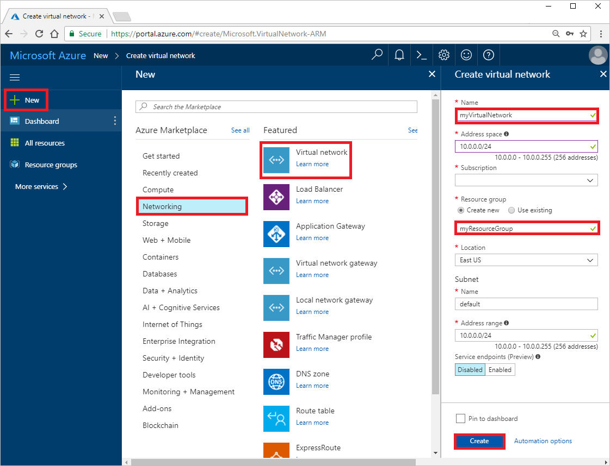
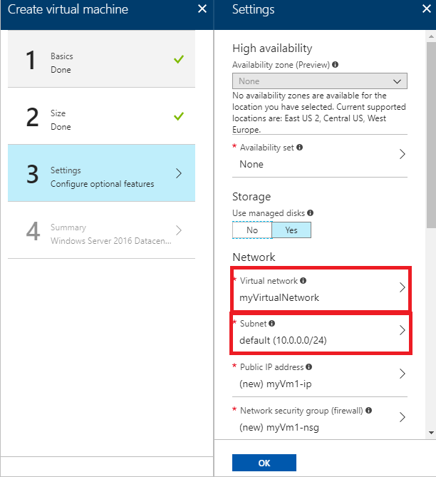
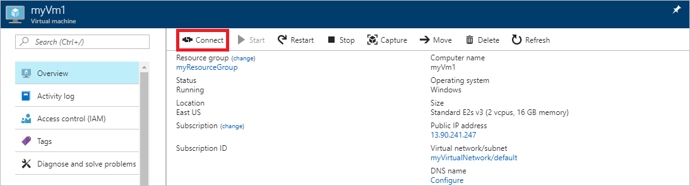

# Create a virtual network using the Azure portal

In this article, you learn how to create a virtual network. After creating a virtual network, you deploy two virtual machines into the virtual network and communicate privately between them, and with the internet.

If you don't have an Azure subscription, create a [free account](https://azure.microsoft.com/free/?WT.mc_id=A261C142F) before you begin.

## Log in to Azure 

Log in to the Azure portal at http://portal.azure.com.

## Create a virtual network

1. Select **+ Create a resource** on the upper, left corner of the Azure portal.
2. Select **Networking**, and then select **Virtual network**.
3. Enter, or select, the following information and then select **Create**:
    - **Name**: *myVirtualNetwork*
    - **Address space**: Accept default. The address space is specified in CIDR notation.
    - **Subscription**: Select your subscription
    - **Resource group**: Select **Create new** and enter *myResourceGroup*
    - **Location**: Select *East US**
    - **Subnet, Name**: Accept default
    - **Subnet, Address range**: Accept default
    - **Service endpoints**: Accept default

    

## Create virtual machines

A virtual network enables several types of Azure resources to communicate privately with each other, and with the Internet. One type of resource you can deploy into a virtual network is a virtual machine.

1. Select **+ Create a resource** found on the upper, left corner of the Azure portal.
2. Select **Compute**, and then select **Windows Server 2016 Datacenter**.
3. Enter, or select, the following information, and then select **OK**:
    - **Name**: *myVm1*
    - **User name**: A user name of your choosing.
    - **Password**: A password of your choosing. The password must be at least 12 characters long and meet the [defined complexity requirements](../virtual-machines/windows/faq.md?toc=%2fazure%2fvirtual-network%2ftoc.json#what-are-the-password-requirements-when-creating-a-vm).
    - **Subscription**: Select your subscription
    - **Resource group**: Select **Use existing** and select **myResourceGroup**
    - **Location**: Select *East US*

    
4. Select a size for the virtual machine and then select **Select**.
5. Under **Settings**, *myVirtualNetwork* should already be selected for **Virtual network**, but if it's not, select **Virtual network**, then select *myVirtualNetwork*. Leave *default* selected for **Subnet**, and then select **OK**.

    
6. On the **Summary** page, select **Create** to start the virtual machine deployment. The virtual machine takes a few minutes to deploy. 
7. Complete steps 1-6 again, but in step 3, name the virtual machine *myVm2*.

## Connect to a virtual machine

1. After *myVm1* is created, remotely connect to it. At the top of the Azure portal, enter *myVm1*. When **myVm1** appears in the search results, select it. Select the **Connect** button.

    

2. After selecting the **Connect** button, a Remote Desktop Protocol (.rdp) file is created and downloaded to your computer.  
3. Open the downloaded rdp file. If prompted, select **Connect**. Enter the user name and password you specified when creating the virtual machine (you may need to select **More choices**, then **Use a different account**, to specify the credentials you entered when you created the virtual machine), then select OK. You may receive a certificate warning during the sign-in process. Select **Yes** or **Continue** to proceed with the connection.

## Test communication between VMs

Ping, which uses ICMP is used to communicate between virtual machines. ICMP is not allowed through the Windows firewall, by default. To allow *myVm2* to ping *myVm1* in a later step, enter the following command from a command prompt:

```
netsh advfirewall firewall add rule name=Allow-ping protocol=icmpv4 dir=in action=allow
```

Close the remote desktop connection to *myVm1*. Complete the steps in [Connect to a virtual machine](#connect-to-a-virtual-machine), but connect to *myVm2*. From a command prompt enter `ping myvm1`.

You are able to successfully ping the *myVm1* virtual machine from the *myVm2* virtual machine because:

- You allowed it through the Windows firewall on the *myVm1* virtual machine in a previous step
- By default, Azure allows all network traffic between resources in the same virtual network 

## Test communication to the internet

While still connected to the *myVm2* virtual machine, enter `ping bing.com` from a command prompt.

You receive four replies from bing.com. 

You are able to successfully ping an internet resource from the *myVm2* virtual machine, because any virtual machine can communicate outbound to the internet, by default.

Exit the remote desktop session.

## Test communication from the internet

In the picture shown under step 1 in [Connect to a virtual machine](#connect-to-a-virtual-machine), you see a public IP address. In the picture, the address is *13.90.241.247*. The address for your virtual machine is different. Ping the public IP address of your *myVm1* virtual machine from your computer. Ping fails, even though ICMP is open through the Windows firewall.

Ping fails because all traffic to Windows virtual machines, except remote desktop connections over port 3389, is denied by Azure, by default. 

## Clean up resources

When no longer needed, delete the resource group and all resources it contains:

1. Enter *myResourceGroup* in the **Search** box at the top of the portal. When you see **myResourceGroup** in the search results, select it.
2. Select **Delete resource group**.
3. Enter *myResourceGroup* for **TYPE THE RESOURCE GROUP NAME:** and select **Delete**.

## Next steps

In this article, you deployed a default virtual network and two virtual machines. To change the default traffic that Azure allows or denies between virtual machines and the internet, continue to the tutorial for filtering network traffic.

> [!div class="nextstepaction"]
> [Filter network traffic](virtual-networks-create-nsg-arm-pportal)
