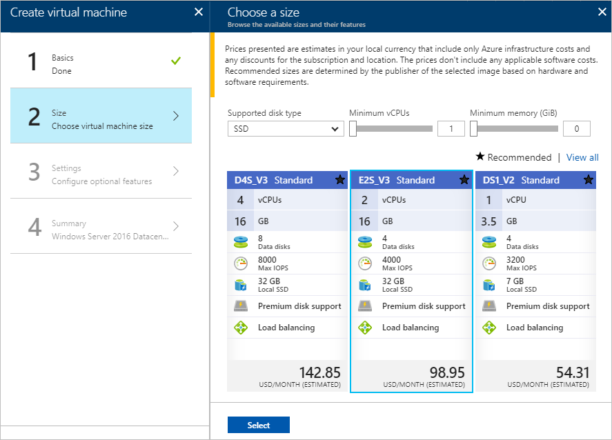

# Create a virtual network using the Azure portal

In this article, you learn how to create a virtual network. After creating a virtual network, you deploy two virtual machines into the virtual network and communicate privately between them, and with the Internet.

If you don't have an Azure subscription, create a [free account](https://azure.microsoft.com/free/?WT.mc_id=A261C142F) before you begin.

## Log in to Azure 

Log in to the Azure portal at http://portal.azure.com.

## Create a virtual network

1. Select **+ Create a resource** on the upper, left corner of the Azure portal.
2. Select **Networking**, and then select **Virtual network**.
3. Enter or select the information show in the following picture, and then select **Create**. 

    

## Create virtual machines

A virtual network enables several types of Azure resources to communicate privately with each other, and with the Internet. One type of resource you can deploy into a virtual network is a virtual machine.

1. Select **+ Create a resource** found on the upper, left corner of the Azure portal.
2. Select **Compute**, and then select **Windows Server 2016 Datacenter**.
3. Enter virtual machine information shown in the picture that follows, and then select **OK**. The **User name** and **Password** you enter are used to log in to the virtual machine in a later step. The password must be at least 12 characters long and meet the [defined complexity requirements](../virtual-machines/windows/faq.md?toc=%2fazure%2fvirtual-network%2ftoc.json#what-are-the-password-requirements-when-creating-a-vm).

    
4. Select a size for the virtual machine and then select **Select**. The sizes that appear for you may be different than the following example: 

    
5. Under **Settings**, *myVirtualNetwork* should already be selected for **Virtual network**, but if it's not, select **Virtual network**, then select *myVirtualNetwork*. Leave *default* selected for **Subnet**, and then select **OK**.

    
6. On the **Summary** page, select **Create** to start the virtual machine deployment. 
7. Complete steps 1-6 again, but in step 3, name the virtual machine *myVm2*.

## Connect to a virtual machine

1. Remotely connect to the *myVm1* virtual machine. At the top of the Azure portal, enter *myVm1*. When **myVm1** appears in the search results, select it. Select the **Connect** button.

    

2. After selecting the **Connect** button, a Remote Desktop Protocol (.rdp) file is created and downloaded to your computer.  
3. Open the downloaded rdp file. If prompted, select **Connect**. Enter the user name and password you specified when creating the virtual machine (you may need to select **More choices**, then **Use a different account**, to specify the credentials you entered when you created the virtual machine), then select OK. You may receive a certificate warning during the sign-in process. Select **Yes** or **Continue** to proceed with the connection.

## Test network communication

Attempting to ping a Windows virtual machine fails, because ping is not allowed through the Windows firewall, by default. To allow ping to *myVm1*, enter the following command from a command prompt:

```
netsh advfirewall firewall add rule name=Allow-ping protocol=icmpv4 dir=in action=allow
```

To validate communication with *myVm2*, enter the following command from a command prompt on the *myVm1* virtual machine. Provide the credentials you used when you created the virtual machine, and then complete the connection:

```
mstsc /v:myVm2
```

The remote desktop connection is successful because both virtual machines have private IP addresses assigned from the *default* subnet and because remote desktop is open through the Windows firewall, by default. From a command prompt, ping *myVm1*, from *myVm2*.

```
ping myvm1
```

Ping is successful because you allowed it through the Windows firewall on the *myVm1* virtual machine in a previous step. To confirm outbound communication to the Internet, enter the following command:

```
ping bing.com
```

You receive four replies from bing.com. By default, any virtual machine in a virtual network can communicate outbound to the Internet. 

Exit the remote desktop session.

## Clean up resources

When no longer needed, delete the resource group and all resources it contains:

1. Enter *myResourceGroup* in the **Search** box at the top of the portal. When you see **myResourceGroup** in the search results, select it.
2. Select **Delete resource group**.
3. Enter *myResourceGroup* for **TYPE THE RESOURCE GROUP NAME:** and select **Delete**.

## Next steps

In this article, you deployed a default virtual network with one subnet and then deployed two virtual machines into the subnet. To learn how to create a custom virtual network with multiple subnets, continue to the tutorial for creating a virtual network with multiple subnets.

> [!div class="nextstepaction"]
> [Create a virtual network with multiple subnets](virtual-networks-create-vnet-arm-pportal.md)
